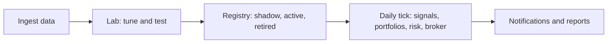

# Stonks

Stonks is a research and trading system for stocks, crypto, commodities and bonds. It pulls market data into a local lake, tests strategies hard before trusting them, and runs a daily tick that trades paper or real portfolios, or only sends you signals.



You drive it from the CLI, the web console, the REST API or an MCP client.

## Quick start

```bash
uv sync
cp .env.example .env        # add your EODHD_API_KEY
uv run stonks db init
uv run stonks ingest prices --tickers AAPL.US,MSFT.US --since 2025-01-01
uv run stonks lab run momentum --tickers AAPL.US,MSFT.US --start 2025-01-01 --end 2025-09-01
uv run stonks tick --dry-run --tickers AAPL.US,MSFT.US
uv run stonks serve         # API on http://127.0.0.1:8000 (and the console, once web/ is built)
```

Tests: `uv run pytest -n auto` (no network needed).

## Learn more

- [Wiki](https://github.com/sleousis/Stonks/wiki): guides for traders and operators, and the glossary.
- [API docs](https://sleousis.github.io/Stonks/): REST and MCP reference, generated from the code.
- [Architecture](docs/architecture.md) and [operations](docs/operations.md).
- [Deploy guide](docs/deploy.md): one server with Docker Compose.
- [Strategies](docs/strategies/README.md) and [principles](docs/principles.md).
- [Roadmap](docs/roadmap.md) and [changelog](CHANGELOG.md).
- [Contributing](CONTRIBUTING.md) and [security](SECURITY.md).

## Upgrading an older lake

`stonks db init` refuses a migration that would drop stored data. A lake from before migration 005 that still holds the old `tickers` columns needs `STONKS_ALLOW_DESTRUCTIVE_MIGRATIONS=1`. Back up first (`uv run python -m stonks.ops backup`).

## License and disclaimer

All rights reserved; see [LICENSE](LICENSE). This is not financial advice. Read [DISCLAIMER.md](DISCLAIMER.md) before trading with it.
