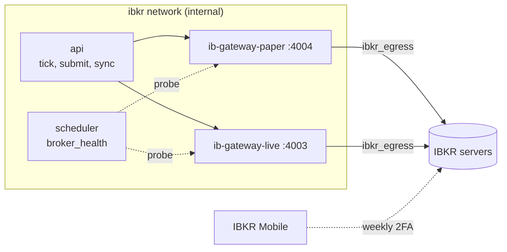

# IB Gateway

Stonks trades at Interactive Brokers through IB Gateway, a small Java app that holds the login session. It runs as a container next to the api. Design: [docs/design/live-trading.md](../../docs/design/live-trading.md), section 3.

## The two services

| Service | Profile | Account | Port on the `ibkr` network |
|---------|---------|---------|----------------------------|
| `ib-gateway-paper` | `ibkr-paper` | IBKR paper account | 4004 |
| `ib-gateway-live` | `ibkr-live` | IBKR live account | 4003 |

- Image `ghcr.io/gnzsnz/ib-gateway` (IB Gateway plus IBC, which types the login and restarts the app). It is pinned to a version tag in `deploy/compose.yaml`. Update it on purpose and test on paper first.
- Ports 4004 and 4003 are the image's relays to the gateway's API port. They live on the `ibkr` network, which is internal: only `api`, `scheduler` and the gateways join it. Nothing is published on the host.
- The gateways reach IBKR's servers through their own `ibkr_egress` network. No Stonks service joins it.
- VNC is off. See [One-off manual login](#one-off-manual-login-over-vnc) to turn it on for a moment.
- Each gateway has a 1 GB memory limit (`IBKR_GATEWAY_MEMORY`).



## Secret files

The username and password come only from files in `deploy/ibkr/secrets/`. Docker mounts them into the gateway container at `/run/secrets/`. The Stonks containers never see them. Paper and live have separate files.

| File | Holds |
|------|-------|
| `paper_username.txt` | Paper account username |
| `paper_password.txt` | Paper account password |
| `live_username.txt` | Dedicated live API username |
| `live_password.txt` | Its password |

Create them on the server, in `/opt/stonks/deploy` (or your checkout's `deploy/` folder):

```bash
cd deploy/ibkr/secrets
umask 077
read -r -p 'IBKR paper username: ' u && printf '%s' "$u" > paper_username.txt
read -r -s -p 'IBKR paper password: ' p && printf '%s' "$p" > paper_password.txt && echo
chmod 600 ./*.txt
# The gateway runs as uid 1000 and Compose mounts the files as they are.
sudo chown 1000:1000 ./*.txt
```

Do the same for `live_username.txt` and `live_password.txt` before you start the live profile.

- `read -s` keeps the password out of your shell history and off the screen.
- Never commit these files. The folder's `.gitignore` ignores everything except itself and its README.
- Never put them in `.env`, TOML, chat or a ticket.
- The image has `TWS_PASSWORD_FILE` but no file variable for the username. The Compose entrypoint reads the username file into `TWS_USERID` inside the container, then starts the image as usual.
- Start a profile only after its two files exist.

To change a password: update the file, then `docker compose --profile ibkr-live up -d --force-recreate ib-gateway-live`.

## A dedicated username

A login with the same username anywhere else (TWS, the web portal, the mobile app) kicks the gateway off. IBKR calls this a competing session. So:

- In IBKR's Client Portal, create a **secondary username** with trading rights and market data. The gateway uses it and nothing else does.
- Keep your main username for your own logins.
- Never run the paper and live gateways with the same username. Each login would end the other.

## The weekly login

- **Daily.** IB Gateway must restart once a day. IBC restarts it at `AUTO_RESTART_TIME` (`IBKR_AUTO_RESTART_TIME`, default `11:45 PM` in `IBKR_TIME_ZONE`, default `America/New_York`). This keeps the session, so no 2FA is needed. Pick a quiet time away from the submit window (open minus 20 minutes) and the tick (close plus 45 minutes).
- **Weekly.** After IBKR's Sunday reset (about 01:00 US Eastern) the session expires. IBC types the password and IBKR pushes an approval to **IBKR Mobile** on your phone. Approve it.
- **Missed it?** `TWOFA_TIMEOUT_ACTION=restart` and `RELOGIN_AFTER_TWOFA_TIMEOUT=yes` make the gateway restart and ask again, so a late approval still works.
- Stonks sends a push every Sunday evening (`ibkr_reauth_reminder`) and checks the gateway every 5 minutes (`broker_health`). The check logs in with the health client id, reads the managed account and the server time. A wrong account, a login that did not finish or a competing session pauses auto at once.

If the gateway is down at submit time, no orders go out that day and the tickets expire. Nothing is ever sent late. Down for two sessions in a row pauses auto subscriptions. See the design doc, "When the gateway is down".

## One-off manual login over VNC

Sometimes IBKR asks for something IBC cannot type (a new agreement, a security question). Turn VNC on for a few minutes, over Tailscale only:

1. Create `deploy/ibkr/secrets/vnc_password.txt` (as above, `chmod 600`, owner 1000).
2. Add a file `deploy/compose.vnc.yaml` on the server only:

   ```yaml
   services:
     ib-gateway-live:
       environment:
         VNC_SERVER_PASSWORD_FILE: /run/secrets/ibkr_vnc_password
       secrets: [ibkr_live_username, ibkr_live_password, ibkr_vnc_password]
       ports: ["${STONKS_TS_IP}:5900:5900"]
   secrets:
     ibkr_vnc_password:
       file: ./ibkr/secrets/vnc_password.txt
   ```

   `STONKS_TS_IP` is the server's Tailscale address (`tailscale ip -4`). Binding to it keeps the port off the public internet and off your home network.
3. `docker compose -f compose.yaml -f compose.vnc.yaml --profile ibkr-live up -d ib-gateway-live`
4. Connect a VNC viewer from a tailnet device to `<server>:5900`, finish the login.
5. Turn it off again: `docker compose --profile ibkr-live up -d ib-gateway-live`, then delete `vnc_password.txt` and `compose.vnc.yaml`.

## Memory

The gateway is a Java process. Plan about 1 GB per gateway.

- A 4 GB VM or home server holds the core stack plus one gateway.
- Paper and live at once want 8 GB.
- See [docs/capacity.md](../../docs/capacity.md).

## How Stonks connects

In your server config (TOML), one table per gateway:

```toml
[brokers.ibkr]
allow_live = false          # the live gateway is refused until you set true

[brokers.ibkr.gateways.paper]
host = "ib-gateway-paper"
port = 4004
mode = "paper"
portfolios = ["pf_default"]

[brokers.ibkr.gateways.live]
host = "ib-gateway-live"
port = 4003
mode = "live"
portfolios = ["pf_live"]
account_id = "U1234567"     # the expected account, not a secret

[brokers.ibkr.orders]
default_time_in_force = "opg"   # join the opening auction
collar_bps = 100                # a market order goes out as a limit this far through the reference
order_ref_max_length = 40       # longer client ids go out as a stable hash
```

- `host` is the Compose service name. It resolves only on the `ibkr` network.
- `portfolios` lists the portfolio ids that trade through that gateway.
- `allow_live = false` is the default. Keep it until the paper gate in the design doc passes.
- `account_id` is checked on every connect. A paper gateway must be logged in to a `DU` account and a live one to a `U` account, or Stonks refuses to trade.
- `[brokers.ibkr.health] probe = "socket"` only checks the port, for a gateway that is not logged in yet. The default `login` checks the account.
- Contracts are looked up once and cached in the `broker_contracts` table for 7 days (`contract_max_age_days`).
- No username, password or token goes in TOML. The optional Flex statements token is `STONKS_IBKR_FLEX_TOKEN` in `deploy/.env`.
- `account_type = "cash"` is the default and trades long only. Set `"margin"` on a gateway only for a margin account. Its short sales are then checked against IBKR's locate first.

## Client ids and the master client

Each Stonks process talks to the gateway under its own API client id. IBKR lets one session hold a client id at a time, so the API can act while a tick runs.

| Role | Client id | What it does |
|------|-----------|--------------|
| tick | 11 | places the tick's orders (the master) |
| sync | 12 | reads cash, positions and executions |
| health | 13 | the login probe, read only |
| reconcile | 14 | the reconciliation checks |
| stream | 15 | live prices, read only |
| api | 16 | the kill switch and manual orders |

Change them under `[brokers.ibkr.client_ids]`. They must all differ.

IBKR keeps each client in sync with its own orders only. The master client sees every order. Set it once, in each gateway:

1. Open the gateway over VNC (see [One-off manual login](#one-off-manual-login-over-vnc)).
2. In IB Gateway, go to Configure, Settings, API, Settings.
3. Set **Master API client ID** to `11` (the tick's id) and press OK.
4. The setting is stored inside the container. It survives the daily restart, but a recreated container (an image update, `--force-recreate`) loses it. Set it again then.

Without it Stonks still works, only a bit slower: the tick asks every client (`reqAllOpenOrders`) for an order it did not send, such as a manual order.

If you pick another master, tell Stonks in TOML:

```toml
[brokers.ibkr]
master_client_id = 11   # the default: the tick's id
```

The other clients read every open order with IBKR's `reqAllOpenOrders`, so the API still sees the tick's orders.

IBKR lets only the client that placed an order cancel it. So from the API:

- A manual order (client 16) is cancelled at once.
- A tick's order is cancelled in a short session as client 11, when no tick is running.
- While a tick runs, a stop-all kill switch that covers every portfolio of the gateway cancels every order with IBKR's global cancel. That includes orders you placed by hand in TWS. A buys-only kill never does this. Press it again once the tick is done.

## Link a portfolio (the ibkr connection)

A trader links a broker portfolio to a gateway through a connection. The connection holds only the gateway's name, never a login.

1. An admin adds `ibkr` to `[connections] enabled_providers` (or `STONKS_CONNECTIONS_ENABLED_PROVIDERS`).
2. The trader connects provider `ibkr` with the field `gateway` set to a gateway name, for example `paper`.
3. Stonks checks the account the gateway is logged in to and links a broker portfolio to it.

The sync reads cash, positions and the day's executions every few minutes (API client id 12). An auto book trades through the same gateway (client id 11). Manual orders from the web app use client id 16. The account can also hold your own trades. Stonks only trades what it opened, and your holdings stay external.

## Optional Flex statements

A Flex statement adds older trades, dividends, interest, fees and cash moves to the sync.

1. In Client Portal, create an Activity Flex Query (Trades at execution level, and Cash Transactions) and turn on the Flex Web Service. Note the query id and the token.
2. Put the token in `deploy/.env` as `STONKS_IBKR_FLEX_TOKEN`. Never in TOML.
3. Put the query id in TOML:

```toml
[brokers.ibkr.flex]
query_id = "123456"
refresh_hours = 6   # a sync reuses a statement this recent
```

A Flex failure never fails a sync. It is logged and the sync goes on.

## Borrow rates

`stonks ingest borrow` reads IBKR's public short stock files into the lake table `borrow_rates`. It uses IBKR's shared public FTP login, not yours. Pick the markets with `--markets usa,uk` or `[sources.ibkr_borrow] markets`.

## Start and stop

```bash
docker compose --profile ibkr-paper up -d        # paper gateway
docker compose --profile ibkr-live up -d         # live gateway
docker compose logs -f ib-gateway-paper          # watch the login
docker compose --profile ibkr-paper stop ib-gateway-paper
```

Or add `ibkr-paper` (and later `ibkr-live`) to `COMPOSE_PROFILES` in `deploy/.env` so every `up` and deploy starts it.
