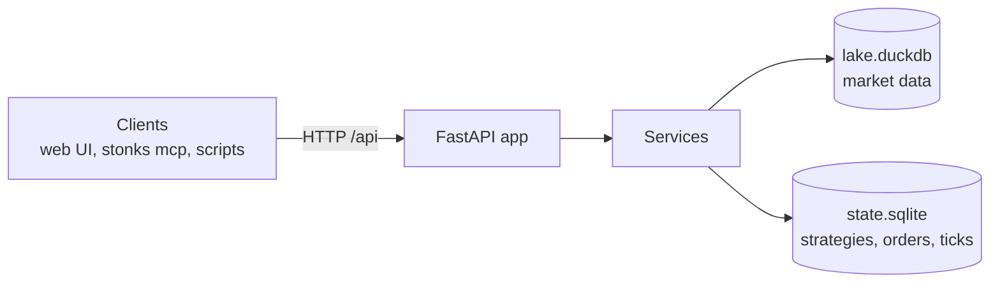

# REST API

<!-- Generated by `uv run python -m stonks.api.docs` from web/openapi.json. Do not edit. -->

Stonks API 0.1.0. Research + trading system: portfolio, strategies, market data, lab runs and background jobs.

Auth: reads (`GET`) are open to loopback clients by default
(`[api].open_reads_on_loopback`). Every other method needs
`Authorization: Bearer $STONKS_API_TOKEN`.

Tags: [alerts](#alerts-endpoints) · [auth](#auth-endpoints) · [brokers](#brokers-endpoints) · [catalog](#catalog-endpoints) · [health](#health-endpoints) · [ingest](#ingest-endpoints) · [jobs](#jobs-endpoints) · [lab](#lab-endpoints) · [market](#market-endpoints) · [orders](#orders-endpoints) · [pnl](#pnl-endpoints) · [portfolio](#portfolio-endpoints) · [risk](#risk-endpoints) · [shadow](#shadow-endpoints) · [sources](#sources-endpoints) · [strategies](#strategies-endpoints) · [studio](#studio-endpoints) · [ticks](#ticks-endpoints)

## alerts endpoints

| Method | Path | Summary | Auth | Request | Response |
|--------|------|---------|------|---------|----------|
| GET | `/api/alerts` | List Alerts | token, or open on loopback |  | [Page_AlertView_](#page_alertview_) |

## auth endpoints

| Method | Path | Summary | Auth | Request | Response |
|--------|------|---------|------|---------|----------|
| GET | `/api/auth/check` | Check Auth | token, or open on loopback |  | [AuthCheck](#authcheck) |

## brokers endpoints

| Method | Path | Summary | Auth | Request | Response |
|--------|------|---------|------|---------|----------|
| GET | `/api/brokers` | Get Broker Info | token, or open on loopback |  | [BrokerInfo](#brokerinfo) |
| GET | `/api/brokers/alpaca/status` | Get Alpaca Status | token, or open on loopback |  | [AlpacaStatus](#alpacastatus) |

## catalog endpoints

| Method | Path | Summary | Auth | Request | Response |
|--------|------|---------|------|---------|----------|
| GET | `/api/catalog/asset-classes` | List Asset Classes | token, or open on loopback |  | list[string] |
| GET | `/api/catalog/intervals` | List Intervals | token, or open on loopback |  | list[[IntervalInfo](#intervalinfo)] |
| GET | `/api/catalog/strategies` | List Strategy Classes | token, or open on loopback |  | list[[StrategyClassInfo](#strategyclassinfo)] |

## health endpoints

| Method | Path | Summary | Auth | Request | Response |
|--------|------|---------|------|---------|----------|
| GET | `/api/health` | Liveness probe | none |  | [Health](#health) |
| GET | `/api/health/report` | Health Report | token, or open on loopback |  | [HealthReportView](#healthreportview) |

## ingest endpoints

| Method | Path | Summary | Auth | Request | Response |
|--------|------|---------|------|---------|----------|
| GET | `/api/ingest/jobs/{job_id}/result` | Get Ingest Result | token, or open on loopback |  | [IngestResultView](#ingestresultview) |
| GET | `/api/ingest/runs` | List Runs | token, or open on loopback |  | [Page_IngestRunView_](#page_ingestrunview_) |
| POST | `/api/ingest/runs` | Start Ingest | bearer token | [IngestRequest](#ingestrequest) | [Job](#job) |

## jobs endpoints

| Method | Path | Summary | Auth | Request | Response |
|--------|------|---------|------|---------|----------|
| GET | `/api/jobs` | List Jobs | token, or open on loopback |  | [Page_Job_](#page_job_) |
| GET | `/api/jobs/{job_id}` | Get Job | token, or open on loopback |  | [Job](#job) |
| POST | `/api/jobs/{job_id}/cancel` | Cancel Job | bearer token |  | [Job](#job) |
| GET | `/api/jobs/{job_id}/events` | Stream Job Events | token, or open on loopback |  | SSE of [JobEvent](#jobevent) |
| POST | `/api/jobs/{job_id}/stream-token` | Create Stream Token | bearer token |  | [StreamToken](#streamtoken) |

## lab endpoints

| Method | Path | Summary | Auth | Request | Response |
|--------|------|---------|------|---------|----------|
| POST | `/api/lab/backtests` | Start Backtest | bearer token | [BacktestRequest](#backtestrequest) | [Job](#job) |
| GET | `/api/lab/backtests/{job_id}/result` | Get Backtest Result | token, or open on loopback |  | [BacktestResult](#backtestresult) |
| GET | `/api/lab/cost-models` | List Cost Models | token, or open on loopback |  | list[[CostModelPreset](#costmodelpreset)] |
| POST | `/api/lab/runs` | Start Lab Run | bearer token | [LabRunRequest](#labrunrequest) | [Job](#job) |
| GET | `/api/lab/runs/{job_id}/result` | Get Lab Run Result | token, or open on loopback |  | [LabRunView](#labrunview) |

## market endpoints

| Method | Path | Summary | Auth | Request | Response |
|--------|------|---------|------|---------|----------|
| GET | `/api/market/bars` | Get Bars | token, or open on loopback |  | [BarSeries](#barseries) |
| GET | `/api/market/coverage` | List Coverage | token, or open on loopback |  | [Page_CoverageRow_](#page_coveragerow_) |
| GET | `/api/market/instruments` | List Instruments | token, or open on loopback |  | [Page_InstrumentView_](#page_instrumentview_) |

## orders endpoints

| Method | Path | Summary | Auth | Request | Response |
|--------|------|---------|------|---------|----------|
| GET | `/api/orders` | List Orders | token, or open on loopback |  | [Page_OrderView_](#page_orderview_) |
| GET | `/api/orders/fills` | List Fills | token, or open on loopback |  | [Page_FillView_](#page_fillview_) |

## pnl endpoints

| Method | Path | Summary | Auth | Request | Response |
|--------|------|---------|------|---------|----------|
| GET | `/api/pnl` | Get Pnl | token, or open on loopback |  | [PnlSeries](#pnlseries) |

## portfolio endpoints

| Method | Path | Summary | Auth | Request | Response |
|--------|------|---------|------|---------|----------|
| GET | `/api/portfolio` | Get Portfolio | token, or open on loopback |  | [PortfolioView](#portfolioview) |
| GET | `/api/portfolio/snapshots` | List Snapshots | token, or open on loopback |  | [Page_SnapshotView_](#page_snapshotview_) |

## risk endpoints

| Method | Path | Summary | Auth | Request | Response |
|--------|------|---------|------|---------|----------|
| GET | `/api/risk/policy` | Get Risk Policy | token, or open on loopback |  | [RiskPolicy](#riskpolicy) |

## shadow endpoints

| Method | Path | Summary | Auth | Request | Response |
|--------|------|---------|------|---------|----------|
| GET | `/api/shadow/decisions` | List Shadow Decisions | token, or open on loopback |  | [Page_ShadowDecisionView_](#page_shadowdecisionview_) |
| GET | `/api/shadow/pnl` | List Shadow Pnl | token, or open on loopback |  | [Page_ShadowPnlSummary_](#page_shadowpnlsummary_) |
| GET | `/api/shadow/strategies/{strategy_id}/pnl` | Get Shadow Pnl | token, or open on loopback |  | [PnlSeries](#pnlseries) |

## sources endpoints

| Method | Path | Summary | Auth | Request | Response |
|--------|------|---------|------|---------|----------|
| GET | `/api/sources` | List Sources | token, or open on loopback |  | list[[DataSourceInfo](#datasourceinfo)] |

## strategies endpoints

| Method | Path | Summary | Auth | Request | Response |
|--------|------|---------|------|---------|----------|
| GET | `/api/strategies` | List Strategies | token, or open on loopback |  | [Page_StrategySummary_](#page_strategysummary_) |
| GET | `/api/strategies/summary` | Strategy Summary | token, or open on loopback |  | [StrategyStatusCounts](#strategystatuscounts) |
| GET | `/api/strategies/{strategy_id}` | Get Strategy | token, or open on loopback |  | [StrategyDetail](#strategydetail) |
| GET | `/api/strategies/{strategy_id}/golive` | Get Golive | token, or open on loopback |  | [GoLiveReport](#golivereport) |
| POST | `/api/strategies/{strategy_id}/promote` | Promote | bearer token |  | [StrategyDetail](#strategydetail) |
| POST | `/api/strategies/{strategy_id}/retire` | Retire | bearer token |  | [StrategyDetail](#strategydetail) |
| POST | `/api/strategies/{strategy_id}/shadow` | Shadow | bearer token |  | [StrategyDetail](#strategydetail) |

## studio endpoints

| Method | Path | Summary | Auth | Request | Response |
|--------|------|---------|------|---------|----------|
| GET | `/api/studio/capabilities` | Capabilities | token, or open on loopback |  | [StudioCapabilities](#studiocapabilities) |
| GET | `/api/studio/drafts` | List Drafts | token, or open on loopback |  | [Page_Draft_](#page_draft_) |
| POST | `/api/studio/drafts` | Create Draft | bearer token | [DraftCreate](#draftcreate) | [Draft](#draft) |
| GET | `/api/studio/drafts/{draft_id}` | Get Draft | token, or open on loopback |  | [Draft](#draft) |
| PATCH | `/api/studio/drafts/{draft_id}` | Update Draft | bearer token | [DraftUpdate](#draftupdate) | [Draft](#draft) |
| DELETE | `/api/studio/drafts/{draft_id}` | Delete Draft | bearer token |  | [Draft](#draft) |
| POST | `/api/studio/drafts/{draft_id}/backtests` | Start Backtest | bearer token | [DraftBacktestRequest](#draftbacktestrequest) | [Job](#job) |
| POST | `/api/studio/drafts/{draft_id}/disable` | Disable Draft | bearer token |  | [Draft](#draft) |
| POST | `/api/studio/drafts/{draft_id}/enable` | Enable Draft | bearer token |  | [Draft](#draft) |
| POST | `/api/studio/drafts/{draft_id}/lab-runs` | Start Lab Run | bearer token | [DraftLabRunRequest](#draftlabrunrequest) | [Job](#job) |
| POST | `/api/studio/drafts/{draft_id}/register` | Register Draft | bearer token |  | [Draft](#draft) |
| POST | `/api/studio/drafts/{draft_id}/validate` | Validate Draft | bearer token | [ValidateRequest](#validaterequest) \| null | [DraftValidation](#draftvalidation) |
| GET | `/api/studio/schema` | Schema | token, or open on loopback |  | object |
| POST | `/api/studio/spec/validate` | Validate Spec | bearer token | [SpecValidateRequest](#specvalidaterequest) | [DraftValidation](#draftvalidation) |
| GET | `/api/studio/templates` | Templates | token, or open on loopback |  | list[[RuleTemplateView](#ruletemplateview)] |

## ticks endpoints

| Method | Path | Summary | Auth | Request | Response |
|--------|------|---------|------|---------|----------|
| GET | `/api/ticks` | List Ticks | token, or open on loopback |  | [Page_TickRun_](#page_tickrun_) |
| POST | `/api/ticks` | Start Tick | bearer token | [TickRequest](#tickrequest) | [Job](#job) |
| GET | `/api/ticks/jobs/{job_id}/result` | Get Tick Result | token, or open on loopback |  | [TickResultView](#tickresultview) |
| GET | `/api/ticks/{tick_id}` | Get Tick | token, or open on loopback |  | [TickRunWithOrders](#tickrunwithorders) |

## Schemas

### AlertView

| Field | Type | Required | Description |
|-------|------|----------|-------------|
| `context` | object | yes |  |
| `created_at` | date-time | yes |  |
| `id` | integer | yes |  |
| `level` | "info" \| "warning" \| "error" | yes |  |
| `message` | string | yes |  |
| `title` | string | yes |  |

### AlpacaStatus

| Field | Type | Required | Description |
|-------|------|----------|-------------|
| `account` | [BrokerAccountView](#brokeraccountview) \| null | no |  |
| `clock` | [MarketClockView](#marketclockview) \| null | no |  |
| `connected` | boolean | yes |  |
| `error` | string \| null | no |  |
| `paper` | boolean | yes |  |

### AssetClassCosts

Fee and spread for one asset class.

| Field | Type | Required | Description |
|-------|------|----------|-------------|
| `fee_bps` | number | no |  |
| `fee_flat` | number | no |  |
| `half_spread_bps` | number | no |  |

### AuthCheck

| Field | Type | Required | Description |
|-------|------|----------|-------------|
| `authenticated` | true | no |  |

### BacktestRequest

| Field | Type | Required | Description |
|-------|------|----------|-------------|
| `cost_model` | "zero" \| "realistic" \| [CostModelSettings](#costmodelsettings) \| null | no |  |
| `end` | date | yes |  |
| `fee_per_trade` | number | no |  |
| `initial_cash` | number | no |  |
| `interval` | string | no |  |
| `rebalance_every_bars` | integer | no |  |
| `slippage_bps` | number | no |  |
| `start` | date | yes |  |
| `strategy` | [StrategyRef](#strategyref) | yes |  |
| `threshold` | number | no |  |
| `universe` | list[string] | yes |  |

### BacktestResult

| Field | Type | Required | Description |
|-------|------|----------|-------------|
| `cagr` | number \| null | yes |  |
| `end` | date | yes |  |
| `equity` | list[[EquityPoint](#equitypoint)] | yes |  |
| `final_return` | number \| null | yes |  |
| `interval` | string | yes |  |
| `max_drawdown` | number \| null | yes |  |
| `profit_factor` | number \| null | yes |  |
| `sharpe` | number \| null | yes |  |
| `start` | date | yes |  |
| `strategy_id` | string | yes |  |

### BarSeries

| Field | Type | Required | Description |
|-------|------|----------|-------------|
| `bars` | list[[BarView](#barview)] | yes |  |
| `interval` | string | yes |  |
| `ticker` | string | yes |  |
| `truncated` | boolean | yes |  |

### BarView

| Field | Type | Required | Description |
|-------|------|----------|-------------|
| `adj_close` | number \| null | yes |  |
| `close` | number \| null | yes |  |
| `high` | number \| null | yes |  |
| `low` | number \| null | yes |  |
| `open` | number \| null | yes |  |
| `timestamp` | date-time | yes |  |
| `volume` | number \| null | yes |  |

### BrokerAccountView

| Field | Type | Required | Description |
|-------|------|----------|-------------|
| `buying_power` | number | yes |  |
| `can_trade` | boolean | yes |  |
| `cash` | number | yes |  |
| `currency` | string | yes |  |
| `equity` | number | yes |  |
| `pattern_day_trader` | boolean | yes |  |
| `status` | string | yes |  |
| `trading_blocked` | boolean | yes |  |

### BrokerInfo

| Field | Type | Required | Description |
|-------|------|----------|-------------|
| `allow_live` | boolean | yes |  |
| `credentials_configured` | boolean | yes |  |
| `kind` | "simulated" \| "alpaca" | yes |  |
| `paper` | boolean | yes |  |

### CostModelPreset

| Field | Type | Required | Description |
|-------|------|----------|-------------|
| `description` | string | yes |  |
| `name` | "zero" \| "realistic" | yes |  |
| `settings` | [CostModelSettings](#costmodelsettings) | yes |  |

### CostModelSettings

Settings for ``AssetClassCostModel``. Zero costs by default; ``CostModelSettings.realistic()`` is a sensible starting point.

| Field | Type | Required | Description |
|-------|------|----------|-------------|
| `asset_classes` | dict[str, [AssetClassCosts](#assetclasscosts)] | no |  |
| `default` | [AssetClassCosts](#assetclasscosts) | no |  |
| `impact_bps` | number | no |  |
| `max_impact_bps` | number | no |  |

### CoverageRow

| Field | Type | Required | Description |
|-------|------|----------|-------------|
| `first_bar` | date-time | yes |  |
| `interval` | string | yes |  |
| `last_bar` | date-time | yes |  |
| `rows` | integer | yes |  |
| `ticker` | string | yes |  |

### DataSourceInfo

| Field | Type | Required | Description |
|-------|------|----------|-------------|
| `configured` | boolean | yes |  |
| `default` | boolean | yes |  |
| `detail` | string \| null | no |  |
| `id` | "eodhd" \| "yahoo" \| "defillama" | yes |  |

### Draft

| Field | Type | Required | Description |
|-------|------|----------|-------------|
| `created_at` | string | yes |  |
| `id` | string | yes |  |
| `kind` | "rule" \| "code" | yes |  |
| `name` | string | yes |  |
| `registered_strategy_id` | string \| null | yes |  |
| `source_code` | string \| null | yes |  |
| `spec` | object | yes |  |
| `status` | "draft" \| "registered" | yes |  |
| `strategy_status` | "active" \| "shadow" \| "retired" \| null | yes |  |
| `updated_at` | string | yes |  |

### DraftBacktestRequest

A :class:`~stonks.app.lab.BacktestRequest` without the strategy (the draft is the strategy).

| Field | Type | Required | Description |
|-------|------|----------|-------------|
| `end` | date | yes |  |
| `fee_per_trade` | number | no |  |
| `initial_cash` | number | no |  |
| `interval` | string | no |  |
| `rebalance_every_bars` | integer | no |  |
| `slippage_bps` | number | no |  |
| `start` | date | yes |  |
| `threshold` | number | no |  |
| `universe` | list[string] | yes |  |

### DraftCreate

| Field | Type | Required | Description |
|-------|------|----------|-------------|
| `kind` | "rule" \| "code" | no |  |
| `name` | string | yes |  |
| `source_code` | string \| null | no |  |
| `spec` | object | no |  |

### DraftLabRunRequest

A :class:`~stonks.app.lab.LabRunRequest` without the strategy. A rule draft's spec is fixed (it has no tunable parameters); a code draft's class is tuned over its parameter space.

| Field | Type | Required | Description |
|-------|------|----------|-------------|
| `budget` | integer | no |  |
| `end` | date | yes |  |
| `interval` | string | no |  |
| `objective` | "sharpe" \| "cagr" \| "final_return" | no |  |
| `register_strategy` | boolean | no |  |
| `seed` | integer | no |  |
| `start` | date | yes |  |
| `survival_tests` | list["benchmark_relative" \| "drift" \| "mcpt" \| "oos" \| "period_stability" \| "permutation" \| "perturbation" \| "runs_test" \| "walk_forward" \| "walk_forward_mcpt"] | no |  |
| `train_ratio` | number | no |  |
| `tuner` | "grid" \| "random" | no |  |
| `universe` | list[string] | yes |  |

### DraftUpdate

| Field | Type | Required | Description |
|-------|------|----------|-------------|
| `name` | string \| null | no |  |
| `source_code` | string \| null | no |  |
| `spec` | object \| null | no |  |

### DraftValidation

| Field | Type | Required | Description |
|-------|------|----------|-------------|
| `issues` | list[[ValidationIssue](#validationissue)] | yes |  |
| `smoke` | [SmokeCheck](#smokecheck) \| null | no |  |
| `valid` | boolean | yes |  |

### EquityPoint

| Field | Type | Required | Description |
|-------|------|----------|-------------|
| `timestamp` | date-time | yes |  |
| `value` | number | yes |  |

### FillView

| Field | Type | Required | Description |
|-------|------|----------|-------------|
| `fee` | number | yes |  |
| `filled_at` | string | yes |  |
| `id` | integer | yes |  |
| `order_client_id` | string | yes |  |
| `price` | number | yes |  |
| `quantity` | number | yes |  |
| `tick_id` | string \| null | yes |  |
| `ticker` | string | yes |  |

### GoLiveCheckView

| Field | Type | Required | Description |
|-------|------|----------|-------------|
| `detail` | string | yes |  |
| `limit` | number \| null | yes |  |
| `name` | "status" \| "min_days" \| "max_drawdown" \| "max_drift" \| "min_trades" \| "survival" | yes |  |
| `passed` | boolean | yes |  |
| `value` | number \| null | yes |  |

### GoLivePolicy

Limits a paper-trading period must meet before ``stonks golive check`` passes (``[golive]``). The gate only reports; promotion stays a human action. Every limit is strict about missing data: a period with no snapshots, no fills or no backtest expectation fails.

| Field | Type | Required | Description |
|-------|------|----------|-------------|
| `max_drawdown` | number | no |  |
| `max_drift` | number | no |  |
| `min_days` | integer | no |  |
| `min_trades` | integer | no |  |
| `require_all_survival_passed` | boolean | no |  |

### GoLiveReport

| Field | Type | Required | Description |
|-------|------|----------|-------------|
| `checks` | list[[GoLiveCheckView](#golivecheckview)] | yes |  |
| `passed` | boolean | yes |  |
| `policy` | [GoLivePolicy](#golivepolicy) | yes |  |
| `source` | "shadow" \| "portfolio" \| "none" | yes |  |
| `status` | string | yes |  |
| `strategy_id` | string | yes |  |

### Health

| Field | Type | Required | Description |
|-------|------|----------|-------------|
| `status` | string | yes |  |
| `version` | string | yes |  |

### HealthCheckView

| Field | Type | Required | Description |
|-------|------|----------|-------------|
| `detail` | string | yes |  |
| `name` | string | yes |  |
| `ok` | boolean | yes |  |

### HealthReportView

| Field | Type | Required | Description |
|-------|------|----------|-------------|
| `checked_at` | date-time | yes |  |
| `checks` | list[[HealthCheckView](#healthcheckview)] | yes |  |
| `healthy` | boolean | yes |  |

### IngestRequest

| Field | Type | Required | Description |
|-------|------|----------|-------------|
| `exchange` | string \| null | no |  |
| `interval` | string \| null | no |  |
| `kind` | "prices" \| "intraday" \| "fundamentals" \| "metadata" | yes |  |
| `since` | date \| null | no |  |
| `source` | "eodhd" \| "yahoo" \| "defillama" | no |  |
| `tickers` | list[string] | no |  |
| `until` | date \| null | no |  |

### IngestResultView

| Field | Type | Required | Description |
|-------|------|----------|-------------|
| `kind` | string | yes |  |
| `run_id` | integer | yes |  |
| `status` | string | yes |  |
| `tickers_failed` | integer | yes |  |
| `tickers_ok` | integer | yes |  |

### IngestRunView

| Field | Type | Required | Description |
|-------|------|----------|-------------|
| `error` | string \| null | yes |  |
| `finished_at` | date-time \| null | yes |  |
| `id` | integer | yes |  |
| `kind` | string | yes |  |
| `source` | string | yes |  |
| `started_at` | date-time | yes |  |
| `status` | string \| null | yes |  |
| `tickers_failed` | integer \| null | yes |  |
| `tickers_ok` | integer \| null | yes |  |

### InstrumentView

| Field | Type | Required | Description |
|-------|------|----------|-------------|
| `asset_class` | string \| null | yes |  |
| `currency` | string \| null | yes |  |
| `exchange` | string \| null | yes |  |
| `id` | string | yes |  |
| `industry` | string \| null | yes |  |
| `is_delisted` | boolean \| null | yes |  |
| `name` | string \| null | yes |  |
| `sector` | string \| null | yes |  |

### IntervalInfo

| Field | Type | Required | Description |
|-------|------|----------|-------------|
| `code` | string | yes |  |
| `is_intraday` | boolean | yes |  |
| `seconds` | integer | yes |  |

### Job

| Field | Type | Required | Description |
|-------|------|----------|-------------|
| `created_at` | date-time | yes |  |
| `error` | string \| null | no |  |
| `finished_at` | date-time \| null | no |  |
| `id` | string | yes |  |
| `kind` | string | yes |  |
| `message` | string \| null | no |  |
| `params` | object | yes |  |
| `progress` | number | yes |  |
| `result` | any | no |  |
| `started_at` | date-time \| null | no |  |
| `status` | "queued" \| "running" \| "succeeded" \| "failed" \| "cancelled" | yes |  |

### JobEvent

One ``data:`` payload of the job event stream.

| Field | Type | Required | Description |
|-------|------|----------|-------------|
| `error` | string \| null | no |  |
| `job_id` | string | yes |  |
| `message` | string \| null | no |  |
| `progress` | number | yes |  |
| `reason` | "timeout" \| "untracked" \| null | no |  |
| `status` | "queued" \| "running" \| "succeeded" \| "failed" \| "cancelled" | yes |  |

### LabRunRequest

Tunes the class the ``strategy`` ref points at (its ``params`` are ignored: the tuner searches the class's parameter space).

| Field | Type | Required | Description |
|-------|------|----------|-------------|
| `budget` | integer | no |  |
| `cost_model` | "zero" \| "realistic" \| [CostModelSettings](#costmodelsettings) \| null | no |  |
| `end` | date | yes |  |
| `interval` | string | no |  |
| `mcpt` | [McptOptions](#mcptoptions) \| null | no |  |
| `objective` | "sharpe" \| "cagr" \| "final_return" | no |  |
| `preset` | "promotion" \| "quick" \| "standard" \| null | no |  |
| `register_if_passes` | boolean | no |  |
| `register_strategy` | boolean | no |  |
| `seed` | integer | no |  |
| `start` | date | yes |  |
| `strategy` | [StrategyRef](#strategyref) | yes |  |
| `survival_tests` | list["benchmark_relative" \| "drift" \| "mcpt" \| "oos" \| "period_stability" \| "permutation" \| "perturbation" \| "runs_test" \| "walk_forward" \| "walk_forward_mcpt"] \| null | no |  |
| `train_ratio` | number | no |  |
| `tuner` | "grid" \| "random" | no |  |
| `universe` | list[string] | yes |  |
| `walk_forward` | [WalkForwardConfig](#walkforwardconfig) \| null | no |  |

### LabRunView

| Field | Type | Required | Description |
|-------|------|----------|-------------|
| `best_params` | object | yes |  |
| `best_score` | number \| null | yes |  |
| `class_path` | string | yes |  |
| `registered_strategy_id` | string \| null | yes |  |
| `survival_reports` | list[[SurvivalReportView](#survivalreportview)] | yes |  |
| `verdict` | "pass" \| "fail" | yes |  |

### MarketClockView

| Field | Type | Required | Description |
|-------|------|----------|-------------|
| `is_open` | boolean | yes |  |
| `next_close` | date-time | yes |  |
| `next_open` | date-time | yes |  |
| `timestamp` | date-time | yes |  |

### McptOptions

Monte-Carlo permutation test settings (survival test ``permutation``).

| Field | Type | Required | Description |
|-------|------|----------|-------------|
| `max_p_value` | number | no |  |
| `metric` | "profit_factor" \| "sharpe" \| "final_return" \| "cagr" | no |  |
| `n_permutations` | integer | no |  |
| `retune` | boolean | no |  |
| `seed` | integer \| null | no |  |

### OrderView

| Field | Type | Required | Description |
|-------|------|----------|-------------|
| `broker_order_id` | string \| null | yes |  |
| `client_id` | string | yes |  |
| `created_at` | string | yes |  |
| `limit_price` | number \| null | yes |  |
| `order_type` | string | yes |  |
| `quantity` | number | yes |  |
| `side` | string | yes |  |
| `status` | string | yes |  |
| `status_reason` | string \| null | no |  |
| `strategy_id` | string \| null | yes |  |
| `tick_id` | string \| null | yes |  |
| `ticker` | string | yes |  |
| `updated_at` | string | yes |  |

### Page_AlertView_

| Field | Type | Required | Description |
|-------|------|----------|-------------|
| `items` | list[[AlertView](#alertview)] | yes |  |
| `limit` | integer | yes |  |
| `offset` | integer | yes |  |
| `total` | integer | yes |  |

### Page_CoverageRow_

| Field | Type | Required | Description |
|-------|------|----------|-------------|
| `items` | list[[CoverageRow](#coveragerow)] | yes |  |
| `limit` | integer | yes |  |
| `offset` | integer | yes |  |
| `total` | integer | yes |  |

### Page_Draft_

| Field | Type | Required | Description |
|-------|------|----------|-------------|
| `items` | list[[Draft](#draft)] | yes |  |
| `limit` | integer | yes |  |
| `offset` | integer | yes |  |
| `total` | integer | yes |  |

### Page_FillView_

| Field | Type | Required | Description |
|-------|------|----------|-------------|
| `items` | list[[FillView](#fillview)] | yes |  |
| `limit` | integer | yes |  |
| `offset` | integer | yes |  |
| `total` | integer | yes |  |

### Page_IngestRunView_

| Field | Type | Required | Description |
|-------|------|----------|-------------|
| `items` | list[[IngestRunView](#ingestrunview)] | yes |  |
| `limit` | integer | yes |  |
| `offset` | integer | yes |  |
| `total` | integer | yes |  |

### Page_InstrumentView_

| Field | Type | Required | Description |
|-------|------|----------|-------------|
| `items` | list[[InstrumentView](#instrumentview)] | yes |  |
| `limit` | integer | yes |  |
| `offset` | integer | yes |  |
| `total` | integer | yes |  |

### Page_Job_

| Field | Type | Required | Description |
|-------|------|----------|-------------|
| `items` | list[[Job](#job)] | yes |  |
| `limit` | integer | yes |  |
| `offset` | integer | yes |  |
| `total` | integer | yes |  |

### Page_OrderView_

| Field | Type | Required | Description |
|-------|------|----------|-------------|
| `items` | list[[OrderView](#orderview)] | yes |  |
| `limit` | integer | yes |  |
| `offset` | integer | yes |  |
| `total` | integer | yes |  |

### Page_ShadowDecisionView_

| Field | Type | Required | Description |
|-------|------|----------|-------------|
| `items` | list[[ShadowDecisionView](#shadowdecisionview)] | yes |  |
| `limit` | integer | yes |  |
| `offset` | integer | yes |  |
| `total` | integer | yes |  |

### Page_ShadowPnlSummary_

| Field | Type | Required | Description |
|-------|------|----------|-------------|
| `items` | list[[ShadowPnlSummary](#shadowpnlsummary)] | yes |  |
| `limit` | integer | yes |  |
| `offset` | integer | yes |  |
| `total` | integer | yes |  |

### Page_SnapshotView_

| Field | Type | Required | Description |
|-------|------|----------|-------------|
| `items` | list[[SnapshotView](#snapshotview)] | yes |  |
| `limit` | integer | yes |  |
| `offset` | integer | yes |  |
| `total` | integer | yes |  |

### Page_StrategySummary_

| Field | Type | Required | Description |
|-------|------|----------|-------------|
| `items` | list[[StrategySummary](#strategysummary)] | yes |  |
| `limit` | integer | yes |  |
| `offset` | integer | yes |  |
| `total` | integer | yes |  |

### Page_TickRun_

| Field | Type | Required | Description |
|-------|------|----------|-------------|
| `items` | list[[TickRun](#tickrun)] | yes |  |
| `limit` | integer | yes |  |
| `offset` | integer | yes |  |
| `total` | integer | yes |  |

### ParameterInfo

| Field | Type | Required | Description |
|-------|------|----------|-------------|
| `bounds` | list[any] \| null | no |  |
| `default` | any | no |  |
| `description` | string | yes |  |
| `kind` | string | yes |  |
| `name` | string | yes |  |
| `tunable` | boolean | yes |  |

### PnlRowView

| Field | Type | Required | Description |
|-------|------|----------|-------------|
| `cumulative_return` | number \| null | yes |  |
| `daily_change` | number \| null | yes |  |
| `daily_return` | number \| null | yes |  |
| `day` | date | yes |  |
| `days_elapsed` | integer \| null | no |  |
| `drawdown` | number | yes |  |
| `total_value` | number | yes |  |

### PnlSeries

One row per day. ``strategy_id`` is ``None`` for the real portfolio and a shadow strategy's id for its virtual portfolio.

| Field | Type | Required | Description |
|-------|------|----------|-------------|
| `rows` | list[[PnlRowView](#pnlrowview)] | yes |  |
| `strategy_id` | string \| null | yes |  |

### PortfolioView

| Field | Type | Required | Description |
|-------|------|----------|-------------|
| `cash` | number | yes |  |
| `cost_basis` | number | no | Sum of the positions' cost_basis (positions with a known cost). |
| `currency` | string | no | Reporting currency: the currency every held instrument shares, else 'USD' (also for an empty book or unknown currencies). Amounts are not FX-converted. |
| `positions` | list[[PositionView](#positionview)] | yes |  |
| `positions_value` | number | yes |  |
| `snapshot_total_value` | number \| null | yes |  |
| `taken_at` | date-time \| null | yes |  |
| `tick_id` | string \| null | yes |  |
| `total_value` | number | yes |  |
| `unrealized_pnl` | number | no | Sum of the positions' unrealized_pnl (priced, known cost). |

### PositionView

| Field | Type | Required | Description |
|-------|------|----------|-------------|
| `avg_cost` | number \| null | no | Average cost per share from the fill history (weighted average, fees included); null when the ledger has no fills for the position. |
| `cost_basis` | number \| null | no | avg_cost * quantity. |
| `currency` | string \| null | no | The instrument's trading currency; null when unknown. |
| `market_value` | number \| null | yes |  |
| `price` | number \| null | yes |  |
| `price_date` | date \| null | yes |  |
| `quantity` | number | yes |  |
| `ticker` | string | yes |  |
| `unrealized_pnl` | number \| null | no | (price - avg_cost) * quantity at the latest stored close. |
| `unrealized_pnl_pct` | number \| null | no | unrealized_pnl / \|cost_basis\| (0.05 = +5%). |
| `weight` | number \| null | yes |  |

### ProblemDetails

| Field | Type | Required | Description |
|-------|------|----------|-------------|
| `detail` | string \| null | no |  |
| `errors` | list[object] \| null | no |  |
| `instance` | string \| null | no |  |
| `status` | integer | yes |  |
| `title` | string | yes |  |
| `type` | string | no |  |

### RiskAdjustmentView

One order the risk policy clipped or dropped.

| Field | Type | Required | Description |
|-------|------|----------|-------------|
| `adjusted_quantity` | number | yes |  |
| `original_quantity` | number | yes |  |
| `reason` | string | yes |  |
| `rule` | string | yes |  |
| `side` | string | yes |  |
| `ticker` | string | yes |  |

### RiskPolicy

Portfolio construction limits applied between ``strategy.decide`` and the broker (``[production.risk]``). Defaults are permissive, so an unconfigured install trades exactly what the strategy asks for.

| Field | Type | Required | Description |
|-------|------|----------|-------------|
| `cash_buffer_fraction` | number | no |  |
| `enabled` | boolean | no |  |
| `max_open_positions` | integer \| null | no |  |
| `max_weight_per_asset_class` | dict[str, number] | no |  |
| `max_weight_per_ticker` | number | no |  |
| `min_order_notional` | number | no |  |

### RuleTemplateView

| Field | Type | Required | Description |
|-------|------|----------|-------------|
| `description` | string | yes |  |
| `id` | string | yes |  |
| `spec` | object | yes |  |
| `title` | string | yes |  |

### ShadowDecisionView

| Field | Type | Required | Description |
|-------|------|----------|-------------|
| `as_of` | date | yes |  |
| `created_at` | date-time | yes |  |
| `id` | integer | yes |  |
| `price` | number \| null | yes |  |
| `quantity` | number | yes |  |
| `side` | string | yes |  |
| `status` | string | yes |  |
| `strategy_id` | string | yes |  |
| `tick_id` | string | yes |  |
| `ticker` | string | yes |  |

### ShadowOutcomeView

How one shadow strategy was evaluated during the tick.

| Field | Type | Required | Description |
|-------|------|----------|-------------|
| `decisions` | integer | no |  |
| `error` | string \| null | no |  |
| `fills` | integer | no |  |
| `status` | string | yes |  |
| `strategy_id` | string | yes |  |
| `total_value` | number \| null | no |  |

### ShadowPnlSummary

| Field | Type | Required | Description |
|-------|------|----------|-------------|
| `cumulative_return` | number \| null | yes |  |
| `days` | integer | yes |  |
| `first_day` | date \| null | yes |  |
| `latest_day` | date \| null | yes |  |
| `max_drawdown` | number \| null | yes |  |
| `status` | string \| null | yes |  |
| `strategy_id` | string | yes |  |
| `total_value` | number \| null | yes |  |

### SmokeCheck

| Field | Type | Required | Description |
|-------|------|----------|-------------|
| `data` | "lake" \| "sample" | yes |  |
| `errors` | list[string] | yes |  |
| `evaluations` | integer | yes |  |
| `ok` | boolean | yes |  |
| `signals` | integer | yes |  |
| `tickers` | list[string] | yes |  |

### SnapshotView

| Field | Type | Required | Description |
|-------|------|----------|-------------|
| `cash` | number | yes |  |
| `id` | integer | yes |  |
| `positions` | dict[str, number] | yes |  |
| `taken_at` | date-time | yes |  |
| `tick_id` | string \| null | yes |  |
| `total_value` | number | yes |  |

### SpecValidateRequest

| Field | Type | Required | Description |
|-------|------|----------|-------------|
| `spec` | object | yes |  |

### StatusChangeView

One audited status change or intervention (BL-24).

| Field | Type | Required | Description |
|-------|------|----------|-------------|
| `actor` | string | yes |  |
| `created_at` | string | yes |  |
| `from_status` | string \| null | yes |  |
| `golive_passed` | boolean \| null | yes |  |
| `golive_report` | object \| null | yes |  |
| `id` | integer | yes |  |
| `kind` | string | yes |  |
| `override` | boolean | yes |  |
| `reason` | string | yes |  |
| `to_status` | string \| null | yes |  |

### StrategyClassInfo

| Field | Type | Required | Description |
|-------|------|----------|-------------|
| `applicable_asset_classes` | list[string] | yes |  |
| `class_path` | string | yes |  |
| `description` | string | yes |  |
| `name` | string | yes |  |
| `parameters` | list[[ParameterInfo](#parameterinfo)] | yes |  |
| `source` | string | yes |  |

### StrategyDetail

| Field | Type | Required | Description |
|-------|------|----------|-------------|
| `applicable_asset_classes` | list[string] | yes |  |
| `class_path` | string | yes |  |
| `created_at` | string | yes |  |
| `id` | string | yes |  |
| `metadata` | [StrategyMetadataView](#strategymetadataview) | yes |  |
| `params` | object | yes |  |
| `status` | "active" \| "shadow" \| "retired" | yes |  |
| `status_history` | list[[StatusChangeView](#statuschangeview)] | yes |  |
| `survival_reports` | list[[SurvivalReportView](#survivalreportview)] | yes |  |
| `updated_at` | string | yes |  |

### StrategyMetadataView

The strategy's hypothesis card and capability hooks (BL-26).

| Field | Type | Required | Description |
|-------|------|----------|-------------|
| `alpha_family` | "trend" \| "reversion" \| "carry" \| "value" \| "quality" \| "growth" \| "sentiment" \| "data_driven" \| "benchmark" \| "other" | yes |  |
| `hypothesis` | string | yes |  |
| `label_horizon_bars` | integer | yes |  |
| `premise` | "trend" \| "mean_reversion" \| "none" | yes |  |
| `required_history_bars` | integer | yes |  |

### StrategyRef

Which strategy to run: a registered id, or a catalog class + params.

| Field | Type | Required | Description |
|-------|------|----------|-------------|
| `class_path` | string \| null | no |  |
| `params` | object | no |  |
| `strategy_id` | string \| null | no |  |

### StrategyStatusCounts

How many registered strategies are in each lifecycle status.

| Field | Type | Required | Description |
|-------|------|----------|-------------|
| `active` | integer | yes |  |
| `retired` | integer | yes |  |
| `shadow` | integer | yes |  |
| `total` | integer | yes |  |

### StrategySummary

| Field | Type | Required | Description |
|-------|------|----------|-------------|
| `applicable_asset_classes` | list[string] | yes |  |
| `class_path` | string | yes |  |
| `created_at` | string | yes |  |
| `id` | string | yes |  |
| `metadata` | [StrategyMetadataView](#strategymetadataview) | yes |  |
| `params` | object | yes |  |
| `status` | "active" \| "shadow" \| "retired" | yes |  |
| `updated_at` | string | yes |  |

### StreamToken

| Field | Type | Required | Description |
|-------|------|----------|-------------|
| `events_url` | string | yes |  |
| `expires_at` | date-time | yes |  |
| `token` | string | yes |  |

### StudioCapabilities

What this server lets the Studio do.

| Field | Type | Required | Description |
|-------|------|----------|-------------|
| `code_strategies` | boolean | yes |  |

### SurvivalReportView

| Field | Type | Required | Description |
|-------|------|----------|-------------|
| `metrics` | dict[str, number \| null] | yes |  |
| `notes` | string | yes |  |
| `passed` | boolean | yes |  |
| `test_id` | string | yes |  |

### TickRequest

| Field | Type | Required | Description |
|-------|------|----------|-------------|
| `as_of` | date \| null | no |  |
| `asset_class` | "equity" \| "crypto" \| "commodity" \| "bond" \| null | no |  |
| `dry_run` | boolean | no |  |
| `tickers` | list[string] \| null | no |  |

### TickResultView

| Field | Type | Required | Description |
|-------|------|----------|-------------|
| `dry_run` | boolean | yes |  |
| `fills` | integer | yes |  |
| `orders_placed` | integer | yes |  |
| `status` | string | yes |  |
| `tick_id` | string | yes |  |
| `winner_strategy_id` | string \| null | yes |  |

### TickRun

| Field | Type | Required | Description |
|-------|------|----------|-------------|
| `as_of` | date \| null | no | The trading date the tick ran for (null for rows that predate it). |
| `finished_at` | date-time \| null | yes |  |
| `id` | string | yes |  |
| `started_at` | date-time | yes |  |
| `status` | "running" \| "ok" \| "partial" \| "error" | yes |  |
| `summary` | [TickSummary](#ticksummary) \| null | yes |  |

### TickRunWithOrders

| Field | Type | Required | Description |
|-------|------|----------|-------------|
| `as_of` | date \| null | no | The trading date the tick ran for (null for rows that predate it). |
| `finished_at` | date-time \| null | yes |  |
| `id` | string | yes |  |
| `orders` | list[[OrderView](#orderview)] | yes |  |
| `started_at` | date-time | yes |  |
| `status` | "running" \| "ok" \| "partial" \| "error" | yes |  |
| `summary` | [TickSummary](#ticksummary) \| null | yes |  |

### TickSummary

| Field | Type | Required | Description |
|-------|------|----------|-------------|
| `error` | string \| null | no |  |
| `error_type` | string \| null | no |  |
| `exit_strategy_id` | string \| null | no |  |
| `fills` | integer \| null | no |  |
| `orders_placed` | integer \| null | no |  |
| `reason` | string \| null | no |  |
| `risk_adjustments` | list[[RiskAdjustmentView](#riskadjustmentview)] | no |  |
| `shadow` | list[[ShadowOutcomeView](#shadowoutcomeview)] | no |  |
| `shadow_error` | string \| null | no |  |
| `stale_buys_dropped` | list[string] | no |  |
| `winner_expected_return` | number \| null | no |  |
| `winner_strategy_id` | string \| null | no |  |

### ValidateRequest

Smoke-run on these lake tickers (sample data when empty), over the last ``bars`` bars up to ``as_of`` (latest data when omitted).

| Field | Type | Required | Description |
|-------|------|----------|-------------|
| `as_of` | date \| null | no |  |
| `bars` | integer | no |  |
| `tickers` | list[string] | no |  |

### ValidationIssue

| Field | Type | Required | Description |
|-------|------|----------|-------------|
| `message` | string | yes |  |
| `path` | string | yes |  |

### WalkForwardConfig

Walk-forward settings. ``test_days=None`` splits the dataset's validation window evenly over the folds; ``train_days=None`` means "everything before the first test window".

| Field | Type | Required | Description |
|-------|------|----------|-------------|
| `anchored` | boolean | no |  |
| `metric` | "sharpe" \| "cagr" \| "final_return" | no |  |
| `min_mean_score` | number | no |  |
| `min_positive_share` | number | no |  |
| `n_splits` | integer | no |  |
| `test_days` | integer \| null | no |  |
| `train_days` | integer \| null | no |  |
