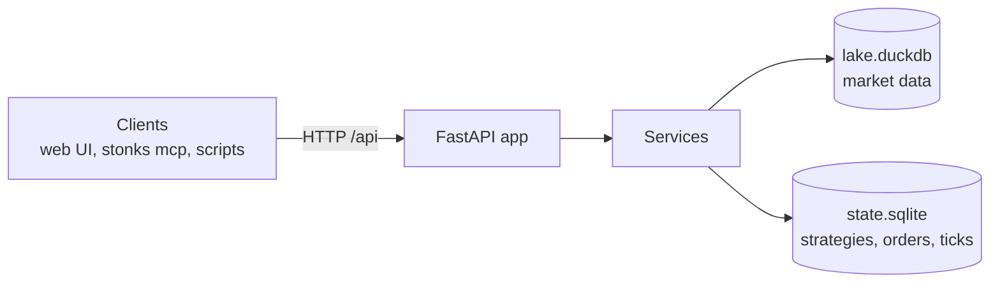

# REST API

<!-- Generated by `uv run python -m stonks.api.docs` from web/openapi.json. Do not edit. -->

Stonks API 0.1.0. Research + trading system: portfolio, strategies, market data, lab runs and background jobs.

Auth: every route except health and sign-in needs a credential: the browser
session cookie (plus `X-CSRF-Token` on writes) or `Authorization: Bearer stk_...`.
The Auth column names the permission a route checks (see `docs/security.md`).
"sign-in" means any signed-in user.

Tags: [alerts](#alerts-endpoints) · [auth](#auth-endpoints) · [backups](#backups-endpoints) · [brokers](#brokers-endpoints) · [catalog](#catalog-endpoints) · [connections](#connections-endpoints) · [halts](#halts-endpoints) · [health](#health-endpoints) · [ingest](#ingest-endpoints) · [jobs](#jobs-endpoints) · [lab](#lab-endpoints) · [market](#market-endpoints) · [notifications](#notifications-endpoints) · [orders](#orders-endpoints) · [pnl](#pnl-endpoints) · [portfolio](#portfolio-endpoints) · [push](#push-endpoints) · [risk](#risk-endpoints) · [schedule](#schedule-endpoints) · [shadow](#shadow-endpoints) · [sources](#sources-endpoints) · [statements](#statements-endpoints) · [strategies](#strategies-endpoints) · [studio](#studio-endpoints) · [subscriptions](#subscriptions-endpoints) · [tca](#tca-endpoints) · [ticks](#ticks-endpoints) · [universes](#universes-endpoints)

## alerts endpoints

| Method | Path | Summary | Auth | Request | Response |
|--------|------|---------|------|---------|----------|
| GET | `/api/alerts` | List Alerts | sign-in |  | [Page_AlertView_](#page_alertview_) |

## auth endpoints

| Method | Path | Summary | Auth | Request | Response |
|--------|------|---------|------|---------|----------|
| GET | `/api/auth/check` | Check Auth | sign-in |  | [AuthCheck](#authcheck) |
| POST | `/api/auth/login` | Login | none | [LoginRequest](#loginrequest) | [LoginView](#loginview) |
| POST | `/api/auth/logout` | Logout | none |  |  |
| GET | `/api/auth/me` | Me | sign-in |  | [MeView](#meview) |
| POST | `/api/auth/mfa/enrol` | Start Enrolment | none |  | [EnrolStartView](#enrolstartview) |
| POST | `/api/auth/mfa/enrol/confirm` | Confirm Enrolment | none | [MfaCodeRequest](#mfacoderequest) | [MfaView](#mfaview) |
| POST | `/api/auth/mfa/verify` | Verify Mfa | none | [MfaCodeRequest](#mfacoderequest) | [MfaView](#mfaview) |
| POST | `/api/auth/password` | Change Password | `password.change` | [PasswordChangeRequest](#passwordchangerequest) |  |
| POST | `/api/auth/recovery-codes` | Regenerate Recovery Codes | `mfa.recovery_codes` |  | [RecoveryCodesView](#recoverycodesview) |
| GET | `/api/auth/tokens` | List Tokens | sign-in |  | list[[TokenView](#tokenview)] |
| POST | `/api/auth/tokens` | Create Token | `tokens.manage` | [TokenCreateRequest](#tokencreaterequest) | [TokenCreatedView](#tokencreatedview) |
| DELETE | `/api/auth/tokens/{token_id}` | Revoke Token | `tokens.revoke` |  |  |
| GET | `/api/auth/users` | List Users | `users.read` |  | list[[UserView](#userview)] |
| POST | `/api/auth/users` | Create User | `users.manage` | [UserCreateRequest](#usercreaterequest) | [UserView](#userview) |
| PATCH | `/api/auth/users/{user_id}` | Update User | `users.manage` | [UserUpdateRequest](#userupdaterequest) | [UserView](#userview) |
| DELETE | `/api/auth/users/{user_id}/mfa` | Reset User Mfa | `users.manage` |  |  |
| POST | `/api/auth/users/{user_id}/password` | Reset User Password | `users.manage` | [PasswordResetRequest](#passwordresetrequest) |  |

## backups endpoints

| Method | Path | Summary | Auth | Request | Response |
|--------|------|---------|------|---------|----------|
| GET | `/api/backups` | List Backups | `operations.run` |  | list[[BackupView](#backupview)] |
| POST | `/api/backups` | Start Backup | `operations.run` |  | [Job](#job) |
| GET | `/api/backups/jobs/{job_id}/result` | Get Backup Result | `operations.run` |  | [BackupResultView](#backupresultview) |
| GET | `/api/backups/restores/{job_id}/result` | Get Restore Result | `operations.run` |  | [RestoreResultView](#restoreresultview) |
| POST | `/api/backups/{backup_id}/restore` | Restore Backup | `backups.restore` | [RestoreRequest](#restorerequest) | [Job](#job) |
| POST | `/api/backups/{backup_id}/verify` | Verify Backup | `operations.run` |  | [VerifyView](#verifyview) |

## brokers endpoints

| Method | Path | Summary | Auth | Request | Response |
|--------|------|---------|------|---------|----------|
| GET | `/api/brokers` | Get Broker Info | sign-in |  | [BrokerInfo](#brokerinfo) |
| GET | `/api/brokers/alpaca/status` | Get Alpaca Status | sign-in |  | [AlpacaStatus](#alpacastatus) |

## catalog endpoints

| Method | Path | Summary | Auth | Request | Response |
|--------|------|---------|------|---------|----------|
| GET | `/api/catalog/asset-classes` | List Asset Classes | sign-in |  | list[string] |
| GET | `/api/catalog/intervals` | List Intervals | sign-in |  | list[[IntervalInfo](#intervalinfo)] |
| GET | `/api/catalog/strategies` | List Strategy Classes | sign-in |  | list[[StrategyClassInfo](#strategyclassinfo)] |

## connections endpoints

| Method | Path | Summary | Auth | Request | Response |
|--------|------|---------|------|---------|----------|
| GET | `/api/connections` | List Connections | sign-in |  | list[[ConnectionView](#connectionview)] |
| GET | `/api/connections/callback` | Complete Portal | sign-in |  | [ConnectionView](#connectionview) |
| POST | `/api/connections/keys` | Connect With Keys | `connection.manage` | [ConnectWithKeysRequest](#connectwithkeysrequest) | [ConnectionView](#connectionview) |
| POST | `/api/connections/portal` | Start Portal | `connection.manage` | [StartPortalRequest](#startportalrequest) | [PortalLinkView](#portallinkview) |
| GET | `/api/connections/providers` | List Providers | sign-in |  | list[[ProviderView](#providerview)] |
| GET | `/api/connections/{connection_id}` | Get Connection | sign-in |  | [ConnectionView](#connectionview) |
| DELETE | `/api/connections/{connection_id}` | Delete Connection | `connection.manage` |  | [DisconnectView](#disconnectview) |
| GET | `/api/connections/{connection_id}/accounts` | List Accounts | sign-in |  | list[[stonks__app__connections__BrokerAccountView](#stonks__app__connections__brokeraccountview)] |
| POST | `/api/connections/{connection_id}/link` | Link Account | `portfolio.manage` | [LinkAccountRequest](#linkaccountrequest) | [LinkResultView](#linkresultview) |
| POST | `/api/connections/{connection_id}/sync` | Sync Connection | `portfolio.manage` |  | [SyncResultView](#syncresultview) |

## halts endpoints

| Method | Path | Summary | Auth | Request | Response |
|--------|------|---------|------|---------|----------|
| GET | `/api/halts` | List Halts | sign-in |  | list[[HaltView](#haltview)] |
| POST | `/api/halts/kill` | Engage Kill Switch | `killswitch.user` | [KillSwitchRequest](#killswitchrequest) | [HaltView](#haltview) |
| GET | `/api/halts/{halt_id}` | Get Halt | sign-in |  | [HaltView](#haltview) |
| POST | `/api/halts/{halt_id}/clear` | Clear Halt | `risk.reset` | [ClearHaltRequest](#clearhaltrequest) | [HaltView](#haltview) |
| POST | `/api/halts/{halt_id}/resume` | Resume Kill Switch | `killswitch.resume` | [ResumeRequest](#resumerequest) | [HaltView](#haltview) |

## health endpoints

| Method | Path | Summary | Auth | Request | Response |
|--------|------|---------|------|---------|----------|
| GET | `/api/health` | Liveness probe | none |  | [Health](#health) |
| GET | `/api/health/live` | Liveness probe (process and hosted scheduler) | none |  | [ProbeView](#probeview) |
| GET | `/api/health/ready` | Readiness probe (state migrated, lake present) | none |  | [ProbeView](#probeview) |
| GET | `/api/health/report` | Health Report | sign-in |  | [HealthReportView](#healthreportview) |
| POST | `/api/health/run` | Run Health Checks | `operations.run` | [HealthRunRequest](#healthrunrequest) | [HealthReportView](#healthreportview) |

## ingest endpoints

| Method | Path | Summary | Auth | Request | Response |
|--------|------|---------|------|---------|----------|
| GET | `/api/ingest/jobs/{job_id}/result` | Get Ingest Result | sign-in |  | [IngestResultView](#ingestresultview) |
| GET | `/api/ingest/runs` | List Runs | sign-in |  | [Page_IngestRunView_](#page_ingestrunview_) |
| POST | `/api/ingest/runs` | Start Ingest | `operations.run` | [IngestRequest](#ingestrequest) | [Job](#job) |

## jobs endpoints

| Method | Path | Summary | Auth | Request | Response |
|--------|------|---------|------|---------|----------|
| GET | `/api/jobs` | List Jobs | sign-in |  | [Page_Job_](#page_job_) |
| GET | `/api/jobs/{job_id}` | Get Job | sign-in |  | [Job](#job) |
| POST | `/api/jobs/{job_id}/cancel` | Cancel Job | `lab.run` |  | [Job](#job) |
| GET | `/api/jobs/{job_id}/events` | Stream Job Events | sign-in |  | SSE of [JobEvent](#jobevent) |
| POST | `/api/jobs/{job_id}/stream-token` | Create Stream Token | `data.read` |  | [StreamToken](#streamtoken) |

## lab endpoints

| Method | Path | Summary | Auth | Request | Response |
|--------|------|---------|------|---------|----------|
| POST | `/api/lab/backtests` | Start Backtest | `lab.run` | [BacktestRequest](#backtestrequest) | [Job](#job) |
| GET | `/api/lab/backtests/{job_id}/result` | Get Backtest Result | sign-in |  | [BacktestResult](#backtestresult) |
| GET | `/api/lab/cost-models` | List Cost Models | sign-in |  | list[[CostModelPreset](#costmodelpreset)] |
| GET | `/api/lab/ensure/{job_id}/result` | Get Lab Ensure Result | sign-in |  | [EnsureReport](#ensurereport) |
| POST | `/api/lab/runs` | Start Lab Run | `lab.run` | [LabRunRequest](#labrunrequest) | [Job](#job) |
| GET | `/api/lab/runs/{job_id}/result` | Get Lab Run Result | sign-in |  | [LabRunView](#labrunview) |
| POST | `/api/lab/signal-ic` | Start Signal Ic | `lab.run` | [SignalICRequest](#signalicrequest) | [Job](#job) |
| GET | `/api/lab/signal-ic/{job_id}/result` | Get Signal Ic Result | sign-in |  | [SignalICView](#signalicview) |
| GET | `/api/lab/survival-presets` | List Survival Presets | sign-in |  | list[[SurvivalPresetInfo](#survivalpresetinfo)] |
| GET | `/api/lab/survival-tests` | List Survival Tests | sign-in |  | list[[SurvivalTestInfo](#survivaltestinfo)] |
| POST | `/api/lab/sweeps` | Start Sweep | `lab.run` | [SweepRequest](#sweeprequest) | [Job](#job) |
| GET | `/api/lab/sweeps/{job_id}/result` | Get Sweep Result | sign-in |  | [SweepResultView](#sweepresultview) |

## market endpoints

| Method | Path | Summary | Auth | Request | Response |
|--------|------|---------|------|---------|----------|
| GET | `/api/market/bars` | Get Bars | sign-in |  | [BarSeries](#barseries) |
| GET | `/api/market/coverage` | List Coverage | sign-in |  | [Page_CoverageRow_](#page_coveragerow_) |
| GET | `/api/market/instruments` | List Instruments | sign-in |  | [Page_InstrumentView_](#page_instrumentview_) |

## notifications endpoints

| Method | Path | Summary | Auth | Request | Response |
|--------|------|---------|------|---------|----------|
| GET | `/api/notifications` | List Notifications | sign-in |  | [FeedView](#feedview) |
| GET | `/api/notifications/preferences` | Get Preferences | sign-in |  | [PreferencesView](#preferencesview) |
| PUT | `/api/notifications/preferences` | Update Preferences | `notifications.manage` | [PreferencesUpdate](#preferencesupdate) | [PreferencesView](#preferencesview) |
| PUT | `/api/notifications/quiet-hours` | Set Quiet Hours | `notifications.manage` | [QuietHoursUpdate](#quiethoursupdate) | [PreferencesView](#preferencesview) |
| POST | `/api/notifications/read` | Mark Read | `data.read` | [MarkReadRequest](#markreadrequest) | [MarkReadView](#markreadview) |
| PUT | `/api/notifications/webhook` | Set Webhook | `notifications.manage` | [WebhookUpdate](#webhookupdate) | [PreferencesView](#preferencesview) |

## orders endpoints

| Method | Path | Summary | Auth | Request | Response |
|--------|------|---------|------|---------|----------|
| GET | `/api/orders` | List Orders | sign-in |  | [Page_OrderView_](#page_orderview_) |
| GET | `/api/orders/fills` | List Fills | sign-in |  | [Page_FillView_](#page_fillview_) |

## pnl endpoints

| Method | Path | Summary | Auth | Request | Response |
|--------|------|---------|------|---------|----------|
| GET | `/api/pnl` | Get Pnl | sign-in |  | [PnlSeries](#pnlseries) |

## portfolio endpoints

| Method | Path | Summary | Auth | Request | Response |
|--------|------|---------|------|---------|----------|
| GET | `/api/portfolio` | Get Portfolio | sign-in |  | [PortfolioView](#portfolioview) |
| GET | `/api/portfolio/snapshots` | List Snapshots | sign-in |  | [Page_SnapshotView_](#page_snapshotview_) |
| GET | `/api/portfolio/totals` | Get Totals | `portfolio.totals` |  | [PortfolioTotalsView](#portfoliototalsview) |
| GET | `/api/portfolios` | List Portfolios | `data.read` |  | list[[PortfolioSummaryView](#portfoliosummaryview)] |
| GET | `/api/portfolios/trading-modes` | List Trading Modes | `data.read` |  | list[[TradingModeView](#tradingmodeview)] |

## push endpoints

| Method | Path | Summary | Auth | Request | Response |
|--------|------|---------|------|---------|----------|
| GET | `/api/push/subscriptions` | List Push Subscriptions | sign-in |  | list[[PushDeviceView](#pushdeviceview)] |
| POST | `/api/push/subscriptions` | Create Push Subscription | `notifications.manage` | [PushSubscriptionRequest](#pushsubscriptionrequest) | [PushDeviceView](#pushdeviceview) |
| DELETE | `/api/push/subscriptions` | Delete Push Subscription | `notifications.manage` | [PushUnsubscribeRequest](#pushunsubscriberequest) |  |
| GET | `/api/push/vapid-key` | Vapid Key | sign-in |  | [VapidKeyView](#vapidkeyview) |

## risk endpoints

| Method | Path | Summary | Auth | Request | Response |
|--------|------|---------|------|---------|----------|
| GET | `/api/risk/policy` | Get Risk Policy | sign-in |  | [RiskPolicy](#riskpolicy) |

## schedule endpoints

| Method | Path | Summary | Auth | Request | Response |
|--------|------|---------|------|---------|----------|
| GET | `/api/schedule` | Get Schedule | sign-in |  | [ScheduleView](#scheduleview) |
| POST | `/api/schedule/{job}/run-now` | Run Now | `operations.run` | [RunNowRequest](#runnowrequest) | [RunNowView](#runnowview) |

## shadow endpoints

| Method | Path | Summary | Auth | Request | Response |
|--------|------|---------|------|---------|----------|
| GET | `/api/shadow/decisions` | List Shadow Decisions | sign-in |  | [Page_ShadowDecisionView_](#page_shadowdecisionview_) |
| GET | `/api/shadow/pnl` | List Shadow Pnl | sign-in |  | [Page_ShadowPnlSummary_](#page_shadowpnlsummary_) |
| GET | `/api/shadow/strategies/{strategy_id}/pnl` | Get Shadow Pnl | sign-in |  | [PnlSeries](#pnlseries) |

## sources endpoints

| Method | Path | Summary | Auth | Request | Response |
|--------|------|---------|------|---------|----------|
| GET | `/api/sources` | List Sources | sign-in |  | list[[DataSourceInfo](#datasourceinfo)] |

## statements endpoints

| Method | Path | Summary | Auth | Request | Response |
|--------|------|---------|------|---------|----------|
| GET | `/api/statements/flags` | List Statement Flags | sign-in |  | [Page_StatementFlagView_](#page_statementflagview_) |

## strategies endpoints

| Method | Path | Summary | Auth | Request | Response |
|--------|------|---------|------|---------|----------|
| GET | `/api/strategies` | List Strategies | sign-in |  | [Page_StrategySummary_](#page_strategysummary_) |
| GET | `/api/strategies/summary` | Strategy Summary | sign-in |  | [StrategyStatusCounts](#strategystatuscounts) |
| GET | `/api/strategies/{strategy_id}` | Get Strategy | sign-in |  | [StrategyDetail](#strategydetail) |
| GET | `/api/strategies/{strategy_id}/golive` | Get Golive | sign-in |  | [GoLiveReport](#golivereport) |
| GET | `/api/strategies/{strategy_id}/history` | Get Strategy History | sign-in |  | list[[StatusChangeView](#statuschangeview)] |
| POST | `/api/strategies/{strategy_id}/promote` | Promote | `strategy.promote` | [StatusChangeRequest](#statuschangerequest) \| null | [StrategyDetail](#strategydetail) |
| POST | `/api/strategies/{strategy_id}/retire` | Retire | `strategy.promote` | [StatusChangeRequest](#statuschangerequest) \| null | [StrategyDetail](#strategydetail) |
| POST | `/api/strategies/{strategy_id}/shadow` | Shadow | `strategy.promote` | [StatusChangeRequest](#statuschangerequest) \| null | [StrategyDetail](#strategydetail) |

## studio endpoints

| Method | Path | Summary | Auth | Request | Response |
|--------|------|---------|------|---------|----------|
| GET | `/api/studio/capabilities` | Capabilities | sign-in |  | [StudioCapabilities](#studiocapabilities) |
| GET | `/api/studio/drafts` | List Drafts | sign-in |  | [Page_Draft_](#page_draft_) |
| POST | `/api/studio/drafts` | Create Draft | `lab.run` | [DraftCreate](#draftcreate) | [Draft](#draft) |
| GET | `/api/studio/drafts/{draft_id}` | Get Draft | sign-in |  | [Draft](#draft) |
| PATCH | `/api/studio/drafts/{draft_id}` | Update Draft | `lab.run` | [DraftUpdate](#draftupdate) | [Draft](#draft) |
| DELETE | `/api/studio/drafts/{draft_id}` | Delete Draft | `lab.run` |  | [Draft](#draft) |
| POST | `/api/studio/drafts/{draft_id}/backtests` | Start Backtest | `lab.run` | [DraftBacktestRequest](#draftbacktestrequest) | [Job](#job) |
| POST | `/api/studio/drafts/{draft_id}/disable` | Disable Draft | `strategy.promote` | [StatusChangeRequest](#statuschangerequest) \| null | [Draft](#draft) |
| POST | `/api/studio/drafts/{draft_id}/enable` | Enable Draft | `strategy.promote` | [StatusChangeRequest](#statuschangerequest) \| null | [Draft](#draft) |
| POST | `/api/studio/drafts/{draft_id}/lab-runs` | Start Lab Run | `lab.run` | [DraftLabRunRequest](#draftlabrunrequest) | [Job](#job) |
| POST | `/api/studio/drafts/{draft_id}/register` | Register Draft | `strategy.promote` |  | [Draft](#draft) |
| POST | `/api/studio/drafts/{draft_id}/validate` | Validate Draft | `lab.run` | [ValidateRequest](#validaterequest) \| null | [DraftValidation](#draftvalidation) |
| GET | `/api/studio/schema` | Schema | sign-in |  | object |
| POST | `/api/studio/spec/validate` | Validate Spec | `lab.run` | [SpecValidateRequest](#specvalidaterequest) | [DraftValidation](#draftvalidation) |
| GET | `/api/studio/templates` | Templates | sign-in |  | list[[RuleTemplateView](#ruletemplateview)] |

## subscriptions endpoints

| Method | Path | Summary | Auth | Request | Response |
|--------|------|---------|------|---------|----------|
| GET | `/api/subscriptions` | List Subscriptions | `data.read` |  | list[[SubscriptionView](#subscriptionview)] |
| POST | `/api/subscriptions` | Subscribe | `portfolio.trade` | [SubscribeRequest](#subscriberequest) | [SubscriptionView](#subscriptionview) |
| PATCH | `/api/subscriptions/{subscription_id}` | Update Subscription | `portfolio.trade` | [SubscriptionUpdate](#subscriptionupdate) | [SubscriptionView](#subscriptionview) |

## tca endpoints

| Method | Path | Summary | Auth | Request | Response |
|--------|------|---------|------|---------|----------|
| GET | `/api/tca/journal` | List Journal | sign-in |  | [Page_JournalEntryView_](#page_journalentryview_) |
| PUT | `/api/tca/notes/{note_id}` | Update Journal Note | `portfolio.manage` | [NoteRequest](#noterequest) | [JournalNoteView](#journalnoteview) |
| GET | `/api/tca/orders/{client_id}` | Get Order Tca | sign-in |  | [JournalEntryView](#journalentryview) |
| POST | `/api/tca/orders/{client_id}/notes` | Add Journal Note | `portfolio.manage` | [NoteRequest](#noterequest) | [JournalNoteView](#journalnoteview) |
| GET | `/api/tca/summary` | Tca Summary | sign-in |  | [TcaSummaryView](#tcasummaryview) |

## ticks endpoints

| Method | Path | Summary | Auth | Request | Response |
|--------|------|---------|------|---------|----------|
| GET | `/api/ticks` | List Ticks | sign-in |  | [Page_TickRun_](#page_tickrun_) |
| POST | `/api/ticks` | Start Tick | `operations.run` | [TickRequest](#tickrequest) | [Job](#job) |
| GET | `/api/ticks/jobs/{job_id}/result` | Get Tick Result | sign-in |  | [TickResultView](#tickresultview) |
| GET | `/api/ticks/{tick_id}` | Get Tick | sign-in |  | [TickRunWithOrders](#tickrunwithorders) |

## universes endpoints

| Method | Path | Summary | Auth | Request | Response |
|--------|------|---------|------|---------|----------|
| GET | `/api/universes` | List Universes | sign-in |  | list[[UniverseView](#universeview)] |
| POST | `/api/universes` | Create Universe | `lab.run` | [UniverseCreate](#universecreate) | [UniverseView](#universeview) |
| GET | `/api/universes/ensure/{job_id}/result` | Get Ensure Result | sign-in |  | [EnsureReport](#ensurereport) |
| POST | `/api/universes/index-history` | Import Index History | `lab.run` | [IndexHistoryImport](#indexhistoryimport) | [IndexHistoryView](#indexhistoryview) |
| GET | `/api/universes/refresh/{job_id}/result` | Get Refresh Result | sign-in |  | [UniverseRefreshView](#universerefreshview) |
| GET | `/api/universes/{universe_id}` | Get Universe | sign-in |  | [UniverseView](#universeview) |
| DELETE | `/api/universes/{universe_id}` | Delete Universe | `strategy.promote` |  | [UniverseView](#universeview) |
| POST | `/api/universes/{universe_id}/ensure` | Ensure Data | `lab.run` | [EnsureDataRequest](#ensuredatarequest) | [Job](#job) |
| GET | `/api/universes/{universe_id}/members` | Get Members | sign-in |  | [UniverseMembers](#universemembers) |
| POST | `/api/universes/{universe_id}/refresh` | Refresh Universe | `lab.run` |  | [Job](#job) |

## Schemas

### AlertView

| Field | Type | Required | Description |
|-------|------|----------|-------------|
| `context` | object | yes |  |
| `created_at` | date-time | yes |  |
| `id` | integer | yes |  |
| `level` | "info" \| "warning" \| "error" | yes |  |
| `message` | string | yes |  |
| `title` | string | yes |  |

### AlpacaStatus

| Field | Type | Required | Description |
|-------|------|----------|-------------|
| `account` | [stonks__app__brokers__BrokerAccountView](#stonks__app__brokers__brokeraccountview) \| null | no |  |
| `clock` | [MarketClockView](#marketclockview) \| null | no |  |
| `connected` | boolean | yes |  |
| `error` | string \| null | no |  |
| `paper` | boolean | yes |  |

### ApiScope

What a credential may do. A token never exceeds its user's role.

Type: "read" \| "trade" \| "lab" \| "admin"

### AssetClassCosts

Fee and spread for one asset class.

| Field | Type | Required | Description |
|-------|------|----------|-------------|
| `fee_bps` | number | no |  |
| `fee_flat` | number | no |  |
| `half_spread_bps` | number | no |  |

### AuthCheck

| Field | Type | Required | Description |
|-------|------|----------|-------------|
| `authenticated` | true | no |  |

### BacktestRequest

| Field | Type | Required | Description |
|-------|------|----------|-------------|
| `benchmark` | string \| null | no |  |
| `cost_model` | "zero" \| "realistic" \| [CostModelSettings](#costmodelsettings) \| null | no |  |
| `end` | date | yes |  |
| `fee_per_trade` | number | no |  |
| `initial_cash` | number | no |  |
| `interval` | string | no |  |
| `rebalance_every_bars` | integer | no |  |
| `slippage_bps` | number | no |  |
| `start` | date | yes |  |
| `strategy` | [StrategyRef](#strategyref) | yes |  |
| `threshold` | number | no |  |
| `universe` | list[string] | yes |  |

### BacktestResult

| Field | Type | Required | Description |
|-------|------|----------|-------------|
| `benchmark` | [BenchmarkStatsView](#benchmarkstatsview) \| null | no |  |
| `benchmark_equity` | list[[EquityPoint](#equitypoint)] | no |  |
| `cagr` | number \| null | yes |  |
| `calmar` | number \| null | no |  |
| `drawdown` | list[[EquityPoint](#equitypoint)] | no |  |
| `end` | date | yes |  |
| `equity` | list[[EquityPoint](#equitypoint)] | yes |  |
| `es_95` | number \| null | no |  |
| `final_return` | number \| null | yes |  |
| `fitness` | number \| null | no |  |
| `interval` | string | yes |  |
| `kurtosis` | number \| null | no |  |
| `max_dd_duration_bars` | integer | no |  |
| `max_drawdown` | number \| null | yes |  |
| `profit_factor` | number \| null | yes |  |
| `sharpe` | number \| null | yes |  |
| `skew` | number \| null | no |  |
| `sortino` | number \| null | no |  |
| `start` | date | yes |  |
| `strategy_id` | string | yes |  |
| `trade_count` | integer | no |  |
| `trade_stats` | [TradeStatsView](#tradestatsview) \| null | no |  |
| `trades` | list[[TradeView](#tradeview)] | no |  |
| `ulcer_index` | number \| null | no |  |
| `var_95` | number \| null | no |  |

### BackupResultView

| Field | Type | Required | Description |
|-------|------|----------|-------------|
| `backup_id` | string | yes |  |
| `pruned` | list[string] | yes |  |

### BackupView

| Field | Type | Required | Description |
|-------|------|----------|-------------|
| `created_at` | date-time | yes |  |
| `id` | string | yes |  |
| `size_bytes` | integer | yes |  |

### BarSeries

| Field | Type | Required | Description |
|-------|------|----------|-------------|
| `bars` | list[[BarView](#barview)] | yes |  |
| `interval` | string | yes |  |
| `ticker` | string | yes |  |
| `truncated` | boolean | yes |  |

### BarView

| Field | Type | Required | Description |
|-------|------|----------|-------------|
| `adj_close` | number \| null | yes |  |
| `close` | number \| null | yes |  |
| `high` | number \| null | yes |  |
| `low` | number \| null | yes |  |
| `open` | number \| null | yes |  |
| `timestamp` | date-time | yes |  |
| `volume` | number \| null | yes |  |

### BenchmarkStatsView

A backtest against its benchmark (``backtest.benchmark.BenchmarkStats``). Ratios are ``None`` when not finite.

| Field | Type | Required | Description |
|-------|------|----------|-------------|
| `alpha_annual` | number \| null | yes |  |
| `alpha_tstat` | number \| null | yes |  |
| `benchmark_cagr` | number \| null | yes |  |
| `benchmark_max_dd` | number \| null | yes |  |
| `benchmark_sharpe` | number \| null | yes |  |
| `beta` | number \| null | yes |  |
| `correlation` | number \| null | yes |  |
| `down_capture` | number \| null | yes |  |
| `excess_cagr` | number \| null | yes |  |
| `excluded` | list[string] | no |  |
| `information_ratio` | number \| null | yes |  |
| `members` | list[string] | no |  |
| `n_obs` | integer | yes |  |
| `name` | string | yes |  |
| `r2` | number \| null | yes |  |
| `residual_sharpe` | number \| null | yes |  |
| `spec` | string | yes |  |
| `tracking_error` | number \| null | yes |  |
| `up_capture` | number \| null | yes |  |

### BrokerInfo

| Field | Type | Required | Description |
|-------|------|----------|-------------|
| `allow_live` | boolean | yes |  |
| `credentials_configured` | boolean | yes |  |
| `kind` | "simulated" \| "alpaca" | yes |  |
| `paper` | boolean | yes |  |

### ChannelDefaultView

| Field | Type | Required | Description |
|-------|------|----------|-------------|
| `channel` | string | yes |  |
| `default_enabled` | boolean | yes |  |
| `fallback` | boolean | yes |  |

### CircuitBreakerSettings

| Field | Type | Required | Description |
|-------|------|----------|-------------|
| `cooldown` | "rest_of_month" \| "none" | no |  |
| `max_drawdown_halt` | number \| null | no |  |
| `max_month_loss` | number \| null | no |  |
| `max_week_loss` | number \| null | no |  |
| `week_sessions` | integer | no |  |

### ClearHaltRequest

| Field | Type | Required | Description |
|-------|------|----------|-------------|
| `reason` | string | yes |  |

### ConnectWithKeysRequest

API-key connect. ``fields`` are the provider's ``credential_fields`` (plus ``paper`` for brokers with a paper endpoint). They are write-only: never logged, stored only sealed, never returned.

| Field | Type | Required | Description |
|-------|------|----------|-------------|
| `fields` | dict[str, password] | yes |  |
| `label` | string \| null | no |  |
| `provider` | string | yes |  |

### ConnectionView

| Field | Type | Required | Description |
|-------|------|----------|-------------|
| `consecutive_failures` | integer | yes |  |
| `created_at` | date-time | yes |  |
| `id` | string | yes |  |
| `label` | string \| null | yes |  |
| `last_error` | string \| null | yes |  |
| `last_sync_at` | date-time \| null | yes |  |
| `last_sync_status` | "ok" \| "partial" \| "error" \| null | yes |  |
| `next_sync_at` | date-time \| null | yes |  |
| `provider` | string | yes |  |
| `status` | "pending" \| "active" \| "error" | yes |  |
| `updated_at` | date-time | yes |  |

### CostComparisonView

Live shortfall of the strategy's real orders against the cost model's estimate (BL-32, P22), in bps.

| Field | Type | Required | Description |
|-------|------|----------|-------------|
| `live_is_bps` | number \| null | no |  |
| `model_gap_bps` | number \| null | no |  |
| `modelled_bps` | number \| null | no |  |
| `orders` | integer | no |  |

### CostModelPreset

| Field | Type | Required | Description |
|-------|------|----------|-------------|
| `description` | string | yes |  |
| `name` | "zero" \| "realistic" | yes |  |
| `settings` | [CostModelSettings](#costmodelsettings) | yes |  |

### CostModelSettings

Settings for ``AssetClassCostModel``. Zero costs by default; ``CostModelSettings.realistic()`` is a sensible starting point.

| Field | Type | Required | Description |
|-------|------|----------|-------------|
| `adv_window` | integer | no |  |
| `asset_classes` | dict[str, [AssetClassCosts](#assetclasscosts)] | no |  |
| `default` | [AssetClassCosts](#assetclasscosts) | no |  |
| `half_spread_model` | "class" \| "corwin_schultz" \| "abdi_ranaldo" | no |  |
| `impact_bps` | number | no |  |
| `impact_gamma` | number | no |  |
| `impact_model` | "sqrt" \| "sqrt_vol" \| "istar" | no |  |
| `istar` | [IStarSettings](#istarsettings) | no |  |
| `max_half_spread_bps` | number | no |  |
| `max_impact_bps` | number | no |  |
| `spread_window` | integer | no |  |
| `vol_window` | integer | no |  |

### CoverageRow

| Field | Type | Required | Description |
|-------|------|----------|-------------|
| `first_bar` | date-time | yes |  |
| `interval` | string | yes |  |
| `last_bar` | date-time | yes |  |
| `rows` | integer | yes |  |
| `ticker` | string | yes |  |

### DataSourceInfo

| Field | Type | Required | Description |
|-------|------|----------|-------------|
| `configured` | boolean | yes |  |
| `default` | boolean | yes |  |
| `detail` | string \| null | no |  |
| `id` | "eodhd" \| "yahoo" \| "defillama" | yes |  |

### DisconnectView

| Field | Type | Required | Description |
|-------|------|----------|-------------|
| `archived_portfolios` | list[string] | yes |  |
| `connection_id` | string | yes |  |
| `remote_error` | string \| null | yes |  |
| `remote_removed` | boolean \| null | yes |  |

### Draft

| Field | Type | Required | Description |
|-------|------|----------|-------------|
| `created_at` | string | yes |  |
| `id` | string | yes |  |
| `kind` | "rule" \| "code" | yes |  |
| `name` | string | yes |  |
| `owner_id` | string \| null | no |  |
| `registered_strategy_id` | string \| null | yes |  |
| `source_code` | string \| null | yes |  |
| `spec` | object | yes |  |
| `status` | "draft" \| "registered" | yes |  |
| `strategy_status` | "active" \| "shadow" \| "retired" \| null | yes |  |
| `updated_at` | string | yes |  |

### DraftBacktestRequest

A :class:`~stonks.app.lab.BacktestRequest` without the strategy (the draft is the strategy).

| Field | Type | Required | Description |
|-------|------|----------|-------------|
| `benchmark` | string \| null | no |  |
| `cost_model` | "zero" \| "realistic" \| [CostModelSettings](#costmodelsettings) \| null | no |  |
| `end` | date | yes |  |
| `fee_per_trade` | number | no |  |
| `initial_cash` | number | no |  |
| `interval` | string | no |  |
| `rebalance_every_bars` | integer | no |  |
| `slippage_bps` | number | no |  |
| `start` | date | yes |  |
| `threshold` | number | no |  |
| `universe` | list[string] | yes |  |

### DraftCreate

| Field | Type | Required | Description |
|-------|------|----------|-------------|
| `kind` | "rule" \| "code" | no |  |
| `name` | string | yes |  |
| `source_code` | string \| null | no |  |
| `spec` | object | no |  |

### DraftLabRunRequest

A :class:`~stonks.app.lab.LabRunRequest` without the strategy. A rule draft's spec is fixed (it has no tunable parameters); a code draft's class is tuned over its parameter space. Registering (``register_strategy`` always, ``register_if_passes`` only on a pass) links the new strategy to the draft.

| Field | Type | Required | Description |
|-------|------|----------|-------------|
| `benchmark` | string \| null | no |  |
| `budget` | integer | no |  |
| `cost_model` | "zero" \| "realistic" \| [CostModelSettings](#costmodelsettings) \| null | no |  |
| `embargo_bars` | integer \| null | no |  |
| `end` | date | yes |  |
| `grid_size` | integer | no |  |
| `hypothesis` | string \| null | no |  |
| `interval` | string | no |  |
| `mcpt` | [McptOptions](#mcptoptions) \| null | no |  |
| `objective` | "sharpe" \| "cagr" \| "final_return" | no |  |
| `preflight` | boolean \| null | no |  |
| `premortem` | string \| null | no |  |
| `preset` | "promotion" \| "quick" \| "standard" \| null | no |  |
| `register_if_passes` | boolean | no |  |
| `register_strategy` | boolean | no |  |
| `seed` | integer | no |  |
| `start` | date | yes |  |
| `strict_preflight` | boolean \| null | no |  |
| `survival_tests` | list["benchmark_relative" \| "cost_stress" \| "cross_instrument" \| "deflated_sharpe" \| "drift" \| "event_study" \| "mc_trades" \| "mcpt" \| "oos" \| "pbo" \| "period_stability" \| "permutation" \| "perturbation" \| "plateau" \| "runs_test" \| "signal_ic" \| "vs_random" \| "walk_forward" \| "walk_forward_mcpt"] \| null | no |  |
| `test_options` | dict[str, object] \| null | no |  |
| `train_ratio` | number | no |  |
| `tuner` | "grid" \| "random" | no |  |
| `universe` | list[string] | yes |  |
| `walk_forward` | [WalkForwardConfig](#walkforwardconfig) \| null | no |  |

### DraftUpdate

| Field | Type | Required | Description |
|-------|------|----------|-------------|
| `name` | string \| null | no |  |
| `source_code` | string \| null | no |  |
| `spec` | object \| null | no |  |

### DraftValidation

| Field | Type | Required | Description |
|-------|------|----------|-------------|
| `issues` | list[[ValidationIssue](#validationissue)] | yes |  |
| `smoke` | [SmokeCheck](#smokecheck) \| null | no |  |
| `valid` | boolean | yes |  |

### DrawdownScalingSettings

| Field | Type | Required | Description |
|-------|------|----------|-------------|
| `schedule` | list[list[any]] \| null | no |  |

### EnrolStartView

| Field | Type | Required | Description |
|-------|------|----------|-------------|
| `otpauth_uri` | string | yes |  |
| `secret` | string | yes |  |

### EnsureDataRequest

Fetch the missing bars of the universe's members over a window (every name that was a member on any day of it, delisted ones too).

| Field | Type | Required | Description |
|-------|------|----------|-------------|
| `end` | date | yes |  |
| `interval` | string | no |  |
| `source` | "eodhd" \| "yahoo" \| "defillama" \| null | no |  |
| `start` | date | yes |  |

### EnsureReport

What an ensure did. ``run_id`` is the ``ingest_runs`` row (``None`` when nothing was missing).

| Field | Type | Required | Description |
|-------|------|----------|-------------|
| `bulk_days` | integer | no |  |
| `clipped_start` | date \| null | no |  |
| `end` | date | yes |  |
| `failed` | list[string] | no |  |
| `gaps` | integer | no |  |
| `interval` | string | yes |  |
| `readjusted` | list[string] | no |  |
| `run_id` | integer \| null | no |  |
| `source` | string | yes |  |
| `start` | date | yes |  |
| `status` | string | no |  |
| `tickers_failed` | integer | no |  |
| `tickers_fetched` | integer | no |  |
| `tickers_requested` | integer | no |  |
| `tickers_up_to_date` | integer | no |  |
| `warnings` | list[string] | no |  |

### EquityPoint

| Field | Type | Required | Description |
|-------|------|----------|-------------|
| `timestamp` | date-time | yes |  |
| `value` | number | yes |  |

### FailingCheck

One go-live check that failed (``GoLiveCheck`` without ``passed``).

| Field | Type | Required | Description |
|-------|------|----------|-------------|
| `detail` | string | no |  |
| `limit` | number \| null | no |  |
| `name` | string | yes |  |
| `value` | number \| null | no |  |

### FeedItemView

| Field | Type | Required | Description |
|-------|------|----------|-------------|
| `category` | string \| null | yes |  |
| `created_at` | date-time | yes |  |
| `deep_link` | string \| null | yes |  |
| `id` | integer | yes |  |
| `level` | string | yes |  |
| `message` | string | yes |  |
| `read_at` | date-time \| null | yes |  |
| `title` | string | yes |  |

### FeedView

| Field | Type | Required | Description |
|-------|------|----------|-------------|
| `items` | list[[FeedItemView](#feeditemview)] | yes |  |
| `unread_count` | integer | yes |  |

### FillView

| Field | Type | Required | Description |
|-------|------|----------|-------------|
| `fee` | number | yes |  |
| `filled_at` | string | yes |  |
| `id` | integer | yes |  |
| `order_client_id` | string | yes |  |
| `price` | number | yes |  |
| `quantity` | number | yes |  |
| `tick_id` | string \| null | yes |  |
| `ticker` | string | yes |  |

### GoLiveCheckView

| Field | Type | Required | Description |
|-------|------|----------|-------------|
| `detail` | string | yes |  |
| `limit` | number \| null | yes |  |
| `name` | "status" \| "min_days" \| "max_drawdown" \| "max_drift" \| "min_trades" \| "survival" \| "within_mc_band" \| "quit_rule" \| "promotion_preset" \| "nonzero_costs" \| "hypothesis_recorded" \| "backtest_min_trades" | yes |  |
| `passed` | boolean | yes |  |
| `value` | number \| null | yes |  |

### GoLivePolicy

Limits a paper-trading period must meet before ``stonks golive check`` passes (``[golive]``). The gate only reports; promotion stays a human action. Every limit is strict about missing data: a period with no snapshots, no fills or no backtest expectation fails.

| Field | Type | Required | Description |
|-------|------|----------|-------------|
| `incubation` | boolean | no |  |
| `max_drawdown` | number | no |  |
| `max_drift` | number | no |  |
| `min_backtest_trades` | integer | no |  |
| `min_days` | integer | no |  |
| `min_hypothesis_chars` | integer | no |  |
| `min_trades` | integer | no |  |
| `min_trl_alpha` | number | no |  |
| `min_trl_cap_days` | integer | no |  |
| `periods_per_year` | number | no |  |
| `promotion_preset` | string | no |  |
| `quit_drawdown_multiple` | number | no |  |
| `require_all_survival_passed` | boolean | no |  |
| `use_min_trl` | boolean | no |  |

### GoLiveReport

| Field | Type | Required | Description |
|-------|------|----------|-------------|
| `checklist` | [PromotionChecklistView](#promotionchecklistview) | no |  |
| `checks` | list[[GoLiveCheckView](#golivecheckview)] | yes |  |
| `costs` | [CostComparisonView](#costcomparisonview) \| null | no |  |
| `passed` | boolean | yes |  |
| `policy` | [GoLivePolicy](#golivepolicy) | yes |  |
| `source` | "shadow" \| "portfolio" \| "none" | yes |  |
| `status` | string | yes |  |
| `strategy_id` | string | yes |  |

### HaltView

| Field | Type | Required | Description |
|-------|------|----------|-------------|
| `active` | boolean | yes |  |
| `clear_reason` | string \| null | yes |  |
| `cleared_at` | string \| null | yes |  |
| `cleared_by` | string \| null | yes |  |
| `expires_on` | date \| null | yes |  |
| `halt` | "buys" \| "all" | yes |  |
| `id` | integer | yes |  |
| `kind` | "month_loss" \| "week_loss" \| "drawdown" \| "operational" \| "kill" | yes |  |
| `portfolio_id` | string \| null | yes |  |
| `reason` | string | yes |  |
| `scope` | "global" \| "user" \| "portfolio" | yes |  |
| `tripped_at` | string | yes |  |
| `tripped_by` | string | yes |  |
| `user_id` | string \| null | yes |  |

### Health

| Field | Type | Required | Description |
|-------|------|----------|-------------|
| `status` | string | yes |  |
| `version` | string | yes |  |

### HealthCheckView

| Field | Type | Required | Description |
|-------|------|----------|-------------|
| `detail` | string | yes |  |
| `name` | string | yes |  |
| `ok` | boolean | yes |  |

### HealthConfig

Thresholds for ``stonks health`` (``[production.health]``).

| Field | Type | Required | Description |
|-------|------|----------|-------------|
| `ingest_failure_lookback_hours` | integer | no |  |
| `max_bar_age_days` | integer | no |  |
| `stuck_ingest_minutes` | integer | no |  |
| `stuck_tick_minutes` | integer | no |  |

### HealthReportView

| Field | Type | Required | Description |
|-------|------|----------|-------------|
| `checked_at` | date-time | yes |  |
| `checks` | list[[HealthCheckView](#healthcheckview)] | yes |  |
| `healthy` | boolean | yes |  |
| `thresholds` | [HealthConfig](#healthconfig) | yes |  |

### HealthRunRequest

| Field | Type | Required | Description |
|-------|------|----------|-------------|
| `tickers` | list[string] \| null | no |  |

### HorizonICView

| Field | Type | Required | Description |
|-------|------|----------|-------------|
| `hac_lags` | integer | yes |  |
| `hit_rate` | number \| null | yes |  |
| `horizon` | integer | yes |  |
| `ic_std` | number \| null | yes |  |
| `icir` | number \| null | yes |  |
| `mean_ic` | number \| null | yes |  |
| `n_dates` | integer | yes |  |
| `quantile_means` | list[number \| null] | yes |  |
| `se_hac` | number \| null | yes |  |
| `se_iid` | number \| null | yes |  |
| `spread_mean` | number \| null | yes |  |
| `spread_t_hac` | number \| null | yes |  |
| `t_stat_hac` | number \| null | yes |  |

### IStarSettings

Kissell's I-Star parameters: ``I = a1 (Q/ADV)^a2 sigma^a3`` bps, with a temporary part ``b1 I pov^a4`` and a permanent part ``(1 - b1) I``. The defaults are Kissell's published US-equity estimates, **not calibrated** for this system; treat them as a starting point.

| Field | Type | Required | Description |
|-------|------|----------|-------------|
| `a1` | number | no |  |
| `a2` | number | no |  |
| `a3` | number | no |  |
| `a4` | number | no |  |
| `b1` | number | no |  |
| `periods_per_year` | number | no |  |
| `pov` | number | no |  |

### IndexHistoryImport

An index constituent history as CSV (``date,ticker,action`` with ``add``, ``remove`` or ``member``) or JSON (``as_of``, ``constituents``, ``changes``).

| Field | Type | Required | Description |
|-------|------|----------|-------------|
| `content` | string | yes |  |
| `format` | "csv" \| "json" | no |  |
| `index_id` | string | yes |  |

### IndexHistoryView

| Field | Type | Required | Description |
|-------|------|----------|-------------|
| `as_of` | date \| null | yes |  |
| `changes` | integer | yes |  |
| `constituents` | integer | yes |  |
| `index_id` | string | yes |  |

### IngestRequest

| Field | Type | Required | Description |
|-------|------|----------|-------------|
| `exchange` | string \| null | no |  |
| `interval` | string \| null | no |  |
| `kind` | "prices" \| "intraday" \| "fundamentals" \| "metadata" | yes |  |
| `since` | date \| null | no |  |
| `source` | "eodhd" \| "yahoo" \| "defillama" | no |  |
| `tickers` | list[string] | no |  |
| `until` | date \| null | no |  |

### IngestResultView

| Field | Type | Required | Description |
|-------|------|----------|-------------|
| `kind` | string | yes |  |
| `run_id` | integer | yes |  |
| `status` | string | yes |  |
| `tickers_failed` | integer | yes |  |
| `tickers_ok` | integer | yes |  |

### IngestRunView

| Field | Type | Required | Description |
|-------|------|----------|-------------|
| `error` | string \| null | yes |  |
| `finished_at` | date-time \| null | yes |  |
| `id` | integer | yes |  |
| `kind` | string | yes |  |
| `source` | string | yes |  |
| `started_at` | date-time | yes |  |
| `status` | string \| null | yes |  |
| `tickers_failed` | integer \| null | yes |  |
| `tickers_ok` | integer \| null | yes |  |

### InstrumentView

| Field | Type | Required | Description |
|-------|------|----------|-------------|
| `asset_class` | string \| null | yes |  |
| `currency` | string \| null | yes |  |
| `exchange` | string \| null | yes |  |
| `id` | string | yes |  |
| `industry` | string \| null | yes |  |
| `is_delisted` | boolean \| null | yes |  |
| `name` | string \| null | yes |  |
| `sector` | string \| null | yes |  |

### IntervalInfo

| Field | Type | Required | Description |
|-------|------|----------|-------------|
| `code` | string | yes |  |
| `is_intraday` | boolean | yes |  |
| `seconds` | integer | yes |  |

### Job

| Field | Type | Required | Description |
|-------|------|----------|-------------|
| `created_at` | date-time | yes |  |
| `error` | string \| null | no |  |
| `finished_at` | date-time \| null | no |  |
| `id` | string | yes |  |
| `kind` | string | yes |  |
| `message` | string \| null | no |  |
| `owner_id` | string \| null | no |  |
| `params` | object | yes |  |
| `progress` | number | yes |  |
| `result` | any | no |  |
| `started_at` | date-time \| null | no |  |
| `status` | "queued" \| "running" \| "succeeded" \| "failed" \| "cancelled" | yes |  |

### JobEvent

One ``data:`` payload of the job event stream.

| Field | Type | Required | Description |
|-------|------|----------|-------------|
| `error` | string \| null | no |  |
| `job_id` | string | yes |  |
| `message` | string \| null | no |  |
| `progress` | number | yes |  |
| `reason` | "timeout" \| "untracked" \| null | no |  |
| `status` | "queued" \| "running" \| "succeeded" \| "failed" \| "cancelled" | yes |  |

### JournalEntryView

One order: why it was placed, the signal context, the outcome and the notes people added.

| Field | Type | Required | Description |
|-------|------|----------|-------------|
| `client_id` | string | yes |  |
| `context` | object \| null | yes |  |
| `created_at` | string | yes |  |
| `decided_at` | string \| null | yes |  |
| `decision_price` | number \| null | yes |  |
| `next_session_move_bps` | number \| null | yes |  |
| `notes` | list[[JournalNoteView](#journalnoteview)] | yes |  |
| `portfolio_id` | string \| null | yes |  |
| `quantity` | number | yes |  |
| `shortfall` | [ShortfallView](#shortfallview) \| null | yes |  |
| `side` | string | yes |  |
| `status` | string | yes |  |
| `status_reason` | string \| null | yes |  |
| `strategy_id` | string \| null | yes |  |
| `ticker` | string | yes |  |
| `trigger` | string \| null | yes |  |

### JournalNoteView

| Field | Type | Required | Description |
|-------|------|----------|-------------|
| `author` | string | yes |  |
| `created_at` | string | yes |  |
| `id` | integer | yes |  |
| `note` | string | yes |  |
| `order_client_id` | string | yes |  |
| `updated_at` | string | yes |  |

### KillSwitchRequest

| Field | Type | Required | Description |
|-------|------|----------|-------------|
| `flatten` | boolean | no |  |
| `portfolio_id` | string \| null | no |  |
| `reason` | string | yes |  |
| `scope` | "global" \| "user" \| "portfolio" | yes |  |

### LabRunRequest

Tunes the class the ``strategy`` ref points at (its ``params`` are ignored: the tuner searches the class's parameter space).

| Field | Type | Required | Description |
|-------|------|----------|-------------|
| `benchmark` | string \| null | no |  |
| `budget` | integer | no |  |
| `cost_model` | "zero" \| "realistic" \| [CostModelSettings](#costmodelsettings) \| null | no |  |
| `embargo_bars` | integer \| null | no |  |
| `end` | date | yes |  |
| `ensure_data` | boolean | no |  |
| `grid_size` | integer | no |  |
| `hypothesis` | string \| null | no |  |
| `interval` | string | no |  |
| `mcpt` | [McptOptions](#mcptoptions) \| null | no |  |
| `objective` | "sharpe" \| "cagr" \| "final_return" | no |  |
| `preflight` | boolean \| null | no |  |
| `premortem` | string \| null | no |  |
| `preset` | "promotion" \| "quick" \| "standard" \| null | no |  |
| `register_if_passes` | boolean | no |  |
| `register_strategy` | boolean | no |  |
| `seed` | integer | no |  |
| `start` | date | yes |  |
| `strategy` | [StrategyRef](#strategyref) | yes |  |
| `strict_preflight` | boolean \| null | no |  |
| `survival_tests` | list["benchmark_relative" \| "cost_stress" \| "cross_instrument" \| "deflated_sharpe" \| "drift" \| "event_study" \| "mc_trades" \| "mcpt" \| "oos" \| "pbo" \| "period_stability" \| "permutation" \| "perturbation" \| "plateau" \| "runs_test" \| "signal_ic" \| "vs_random" \| "walk_forward" \| "walk_forward_mcpt"] \| null | no |  |
| `test_options` | dict[str, object] \| null | no |  |
| `train_ratio` | number | no |  |
| `tuner` | "grid" \| "random" | no |  |
| `universe` | list[string] | no |  |
| `universe_id` | string \| null | no |  |
| `walk_forward` | [WalkForwardConfig](#walkforwardconfig) \| null | no |  |

### LabRunView

| Field | Type | Required | Description |
|-------|------|----------|-------------|
| `benchmark` | [BenchmarkStatsView](#benchmarkstatsview) \| null | no |  |
| `best_params` | object | yes |  |
| `best_score` | number \| null | yes |  |
| `class_path` | string | yes |  |
| `ensure_job_id` | string \| null | no |  |
| `n_trials_class` | integer | no |  |
| `n_trials_run` | integer | no |  |
| `preflight` | [PreflightView](#preflightview) \| null | no |  |
| `registered_strategy_id` | string \| null | yes |  |
| `run_id` | string | no |  |
| `survival_reports` | list[[SurvivalReportView](#survivalreportview)] | yes |  |
| `verdict` | "pass" \| "fail" | yes |  |

### LinkAccountRequest

| Field | Type | Required | Description |
|-------|------|----------|-------------|
| `external_account_id` | string | yes |  |
| `name` | string \| null | no |  |
| `portfolio_id` | string \| null | no |  |

### LinkResultView

| Field | Type | Required | Description |
|-------|------|----------|-------------|
| `connection_id` | string | yes |  |
| `external_account_id` | string | yes |  |
| `portfolio_id` | string | yes |  |

### LiquiditySettings

| Field | Type | Required | Description |
|-------|------|----------|-------------|
| `max_amihud` | number \| null | no |  |
| `max_pct_adv` | number \| null | no |  |
| `min_median_dollar_volume` | number \| null | no |  |

### LoginRequest

| Field | Type | Required | Description |
|-------|------|----------|-------------|
| `email` | string | yes |  |
| `password` | string | yes |  |

### LoginView

| Field | Type | Required | Description |
|-------|------|----------|-------------|
| `csrf_token` | string | yes |  |
| `display_name` | string | yes |  |
| `next_step` | "enrol" \| "verify" | yes |  |
| `user_id` | string | yes |  |

### MarkReadRequest

| Field | Type | Required | Description |
|-------|------|----------|-------------|
| `ids` | list[integer] \| null | no |  |

### MarkReadView

| Field | Type | Required | Description |
|-------|------|----------|-------------|
| `unread_count` | integer | yes |  |
| `updated` | integer | yes |  |

### MarketClockView

| Field | Type | Required | Description |
|-------|------|----------|-------------|
| `is_open` | boolean | yes |  |
| `next_close` | date-time | yes |  |
| `next_open` | date-time | yes |  |
| `timestamp` | date-time | yes |  |

### MarketSessionsView

| Field | Type | Required | Description |
|-------|------|----------|-------------|
| `calendar` | string | yes |  |
| `is_open` | boolean | yes |  |
| `next` | [SessionTimesView](#sessiontimesview) | yes |  |
| `today` | [SessionTimesView](#sessiontimesview) \| null | yes |  |

### MaxHoldingSettings

| Field | Type | Required | Description |
|-------|------|----------|-------------|
| `max_holding_bars` | integer \| null | no |  |

### McptOptions

Monte-Carlo permutation test settings (survival test ``permutation``).

| Field | Type | Required | Description |
|-------|------|----------|-------------|
| `max_p_value` | number | no |  |
| `metric` | "profit_factor" \| "bar_profit_factor" \| "sharpe" \| "final_return" \| "cagr" | no |  |
| `n_permutations` | integer | no |  |
| `retune` | boolean \| "auto" | no |  |
| `seed` | integer \| null | no |  |

### MeView

| Field | Type | Required | Description |
|-------|------|----------|-------------|
| `display_name` | string | yes |  |
| `email` | string \| null | yes |  |
| `mfa_enrolled` | boolean | yes |  |
| `mfa_fresh` | boolean | yes |  |
| `role` | [Role](#role) | yes |  |
| `scopes` | list[[ApiScope](#apiscope)] | yes |  |
| `user_id` | string | yes |  |
| `via` | "session" \| "token" \| "legacy" \| "cli" \| "scheduler" | yes |  |

### MfaCodeRequest

| Field | Type | Required | Description |
|-------|------|----------|-------------|
| `code` | string \| null | no |  |
| `recovery_code` | string \| null | no |  |

### MfaView

| Field | Type | Required | Description |
|-------|------|----------|-------------|
| `csrf_token` | string \| null | no |  |
| `method` | "totp" \| "recovery_code" | yes |  |
| `recovery_codes` | list[string] \| null | no |  |
| `recovery_codes_left` | integer | yes |  |

### NoteRequest

| Field | Type | Required | Description |
|-------|------|----------|-------------|
| `note` | string | yes |  |

### OperationalHaltSettings

| Field | Type | Required | Description |
|-------|------|----------|-------------|
| `max_bar_age_days` | integer \| null | no |  |

### OrderView

| Field | Type | Required | Description |
|-------|------|----------|-------------|
| `broker_order_id` | string \| null | yes |  |
| `client_id` | string | yes |  |
| `created_at` | string | yes |  |
| `limit_price` | number \| null | yes |  |
| `order_type` | string | yes |  |
| `quantity` | number | yes |  |
| `side` | string | yes |  |
| `status` | string | yes |  |
| `status_reason` | string \| null | no |  |
| `strategy_id` | string \| null | yes |  |
| `tick_id` | string \| null | yes |  |
| `ticker` | string | yes |  |
| `updated_at` | string | yes |  |

### Page_AlertView_

| Field | Type | Required | Description |
|-------|------|----------|-------------|
| `items` | list[[AlertView](#alertview)] | yes |  |
| `limit` | integer | yes |  |
| `offset` | integer | yes |  |
| `total` | integer | yes |  |

### Page_CoverageRow_

| Field | Type | Required | Description |
|-------|------|----------|-------------|
| `items` | list[[CoverageRow](#coveragerow)] | yes |  |
| `limit` | integer | yes |  |
| `offset` | integer | yes |  |
| `total` | integer | yes |  |

### Page_Draft_

| Field | Type | Required | Description |
|-------|------|----------|-------------|
| `items` | list[[Draft](#draft)] | yes |  |
| `limit` | integer | yes |  |
| `offset` | integer | yes |  |
| `total` | integer | yes |  |

### Page_FillView_

| Field | Type | Required | Description |
|-------|------|----------|-------------|
| `items` | list[[FillView](#fillview)] | yes |  |
| `limit` | integer | yes |  |
| `offset` | integer | yes |  |
| `total` | integer | yes |  |

### Page_IngestRunView_

| Field | Type | Required | Description |
|-------|------|----------|-------------|
| `items` | list[[IngestRunView](#ingestrunview)] | yes |  |
| `limit` | integer | yes |  |
| `offset` | integer | yes |  |
| `total` | integer | yes |  |

### Page_InstrumentView_

| Field | Type | Required | Description |
|-------|------|----------|-------------|
| `items` | list[[InstrumentView](#instrumentview)] | yes |  |
| `limit` | integer | yes |  |
| `offset` | integer | yes |  |
| `total` | integer | yes |  |

### Page_Job_

| Field | Type | Required | Description |
|-------|------|----------|-------------|
| `items` | list[[Job](#job)] | yes |  |
| `limit` | integer | yes |  |
| `offset` | integer | yes |  |
| `total` | integer | yes |  |

### Page_JournalEntryView_

| Field | Type | Required | Description |
|-------|------|----------|-------------|
| `items` | list[[JournalEntryView](#journalentryview)] | yes |  |
| `limit` | integer | yes |  |
| `offset` | integer | yes |  |
| `total` | integer | yes |  |

### Page_OrderView_

| Field | Type | Required | Description |
|-------|------|----------|-------------|
| `items` | list[[OrderView](#orderview)] | yes |  |
| `limit` | integer | yes |  |
| `offset` | integer | yes |  |
| `total` | integer | yes |  |

### Page_ShadowDecisionView_

| Field | Type | Required | Description |
|-------|------|----------|-------------|
| `items` | list[[ShadowDecisionView](#shadowdecisionview)] | yes |  |
| `limit` | integer | yes |  |
| `offset` | integer | yes |  |
| `total` | integer | yes |  |

### Page_ShadowPnlSummary_

| Field | Type | Required | Description |
|-------|------|----------|-------------|
| `items` | list[[ShadowPnlSummary](#shadowpnlsummary)] | yes |  |
| `limit` | integer | yes |  |
| `offset` | integer | yes |  |
| `total` | integer | yes |  |

### Page_SnapshotView_

| Field | Type | Required | Description |
|-------|------|----------|-------------|
| `items` | list[[SnapshotView](#snapshotview)] | yes |  |
| `limit` | integer | yes |  |
| `offset` | integer | yes |  |
| `total` | integer | yes |  |

### Page_StatementFlagView_

| Field | Type | Required | Description |
|-------|------|----------|-------------|
| `items` | list[[StatementFlagView](#statementflagview)] | yes |  |
| `limit` | integer | yes |  |
| `offset` | integer | yes |  |
| `total` | integer | yes |  |

### Page_StrategySummary_

| Field | Type | Required | Description |
|-------|------|----------|-------------|
| `items` | list[[StrategySummary](#strategysummary)] | yes |  |
| `limit` | integer | yes |  |
| `offset` | integer | yes |  |
| `total` | integer | yes |  |

### Page_TickRun_

| Field | Type | Required | Description |
|-------|------|----------|-------------|
| `items` | list[[TickRun](#tickrun)] | yes |  |
| `limit` | integer | yes |  |
| `offset` | integer | yes |  |
| `total` | integer | yes |  |

### ParameterInfo

| Field | Type | Required | Description |
|-------|------|----------|-------------|
| `bounds` | list[any] \| null | no |  |
| `default` | any | no |  |
| `description` | string | yes |  |
| `kind` | string | yes |  |
| `name` | string | yes |  |
| `tunable` | boolean | yes |  |

### PasswordChangeRequest

| Field | Type | Required | Description |
|-------|------|----------|-------------|
| `current_password` | string | yes |  |
| `new_password` | string | yes |  |

### PasswordResetRequest

| Field | Type | Required | Description |
|-------|------|----------|-------------|
| `new_password` | string | yes |  |

### PnlRowView

| Field | Type | Required | Description |
|-------|------|----------|-------------|
| `cumulative_return` | number \| null | yes |  |
| `daily_change` | number \| null | yes |  |
| `daily_return` | number \| null | yes |  |
| `day` | date | yes |  |
| `days_elapsed` | integer \| null | no |  |
| `drawdown` | number | yes |  |
| `total_value` | number | yes |  |

### PnlSeries

One row per day. ``strategy_id`` is ``None`` for the real portfolio and a shadow strategy's id for its virtual portfolio.

| Field | Type | Required | Description |
|-------|------|----------|-------------|
| `rows` | list[[PnlRowView](#pnlrowview)] | yes |  |
| `strategy_id` | string \| null | yes |  |

### PortalLinkView

| Field | Type | Required | Description |
|-------|------|----------|-------------|
| `connection_id` | string | yes |  |
| `expires_at` | date-time | yes |  |
| `url` | string | yes |  |

### PortfolioSummaryView

| Field | Type | Required | Description |
|-------|------|----------|-------------|
| `base_currency` | string | yes |  |
| `broker_connection_id` | string \| null | yes |  |
| `created_at` | date-time | yes |  |
| `id` | string | yes |  |
| `initial_cash` | number \| null | yes |  |
| `kind` | "simulated" \| "broker" | yes |  |
| `name` | string | yes |  |
| `status` | "active" \| "paused" \| "archived" | yes |  |
| `trading` | "paper" \| "live" | yes |  |

### PortfolioSyncView

| Field | Type | Required | Description |
|-------|------|----------|-------------|
| `activities_new` | integer | yes |  |
| `activities_seen` | integer | yes |  |
| `error` | string \| null | yes |  |
| `external_account_id` | string | yes |  |
| `portfolio_id` | string | yes |  |
| `positions` | integer | yes |  |
| `snapshot_id` | integer \| null | yes |  |
| `unmapped` | list[string] | yes |  |

### PortfolioTotalsView

Sums over every active portfolio's latest snapshot, for admins. No tickers and no per-person numbers (decision 2026-09-26).

| Field | Type | Required | Description |
|-------|------|----------|-------------|
| `cash` | number | yes |  |
| `owners` | integer | yes | People who own those portfolios. |
| `portfolios` | integer | yes | Active portfolios with at least one snapshot. |
| `total_value` | number | yes | Sum of each book's value at its latest snapshot. |

### PortfolioView

| Field | Type | Required | Description |
|-------|------|----------|-------------|
| `cash` | number | yes |  |
| `cost_basis` | number | no | Sum of the positions' cost_basis (positions with a known cost). |
| `currency` | string | no | Reporting currency: the currency every held instrument shares, else 'USD' (also for an empty book or unknown currencies). Amounts are not FX-converted. |
| `positions` | list[[PositionView](#positionview)] | yes |  |
| `positions_value` | number | yes |  |
| `snapshot_total_value` | number \| null | yes |  |
| `taken_at` | date-time \| null | yes |  |
| `tick_id` | string \| null | yes |  |
| `total_value` | number | yes |  |
| `unrealized_pnl` | number | no | Sum of the positions' unrealized_pnl (priced, known cost). |

### PortfolioVolSettings

| Field | Type | Required | Description |
|-------|------|----------|-------------|
| `shock_cap` | number \| null | no |  |
| `vol_cap` | number \| null | no |  |

### PositionView

| Field | Type | Required | Description |
|-------|------|----------|-------------|
| `avg_cost` | number \| null | no | Average cost per share from the fill history (weighted average, fees included); null when the ledger has no fills for the position. |
| `cost_basis` | number \| null | no | avg_cost * quantity. |
| `currency` | string \| null | no | The instrument's trading currency; null when unknown. |
| `market_value` | number \| null | yes |  |
| `price` | number \| null | yes |  |
| `price_date` | date \| null | yes |  |
| `quantity` | number | yes |  |
| `ticker` | string | yes |  |
| `unrealized_pnl` | number \| null | no | (price - avg_cost) * quantity at the latest stored close. |
| `unrealized_pnl_pct` | number \| null | no | unrealized_pnl / \|cost_basis\| (0.05 = +5%). |
| `weight` | number \| null | yes |  |

### PreferenceItem

| Field | Type | Required | Description |
|-------|------|----------|-------------|
| `category` | "signal" \| "order" \| "risk" \| "system" | yes |  |
| `channel` | string | yes |  |
| `enabled` | boolean | yes |  |
| `strategy_id` | string \| null | no |  |

### PreferencesUpdate

| Field | Type | Required | Description |
|-------|------|----------|-------------|
| `preferences` | list[[PreferenceItem](#preferenceitem)] | yes |  |

### PreferencesView

| Field | Type | Required | Description |
|-------|------|----------|-------------|
| `channel_defaults` | list[[ChannelDefaultView](#channeldefaultview)] | no |  |
| `channels` | list[string] | yes |  |
| `preferences` | list[[PreferenceItem](#preferenceitem)] | yes |  |
| `quiet_end` | string \| null | yes |  |
| `quiet_start` | string \| null | yes |  |
| `timezone` | string | yes |  |
| `webhook` | string \| null | yes |  |

### PreflightIssueView

| Field | Type | Required | Description |
|-------|------|----------|-------------|
| `code` | string | yes |  |
| `details` | object | no |  |
| `message` | string | yes |  |
| `severity` | "error" \| "warning" | yes |  |

### PreflightView

The BL-37 data preflight of a lab run. A run only starts with no errors, so a result carries warnings (and ``ok`` true).

| Field | Type | Required | Description |
|-------|------|----------|-------------|
| `issues` | list[[PreflightIssueView](#preflightissueview)] | yes |  |
| `ok` | boolean | yes |  |
| `skipped` | boolean | yes |  |

### ProbeView

| Field | Type | Required | Description |
|-------|------|----------|-------------|
| `checks` | dict[str, string] | no |  |
| `status` | string | yes |  |

### ProblemDetails

| Field | Type | Required | Description |
|-------|------|----------|-------------|
| `blockers` | list[string] \| null | no |  |
| `code` | string \| null | no |  |
| `detail` | string \| null | no |  |
| `errors` | list[object] \| null | no |  |
| `failing_checks` | list[[FailingCheck](#failingcheck)] \| null | no |  |
| `instance` | string \| null | no |  |
| `next_step` | string \| null | no |  |
| `status` | integer | yes |  |
| `title` | string | yes |  |
| `type` | string | no |  |

### PromotionChecklistView

What a reviewer reads before promoting; it doesn't change the verdict. ``None`` for anything not recorded.

| Field | Type | Required | Description |
|-------|------|----------|-------------|
| `dsr` | number \| null | no |  |
| `excess_cagr` | number \| null | no |  |
| `hypothesis` | string \| null | no |  |
| `n_trials_class` | integer \| null | no |  |
| `pbo` | number \| null | no |  |
| `premortem` | string \| null | no |  |

### ProviderView

| Field | Type | Required | Description |
|-------|------|----------|-------------|
| `auth_flow` | string | yes |  |
| `can_trade` | boolean | yes |  |
| `capabilities` | list[string] | yes |  |
| `credential_fields` | list[string] | yes |  |
| `display_name` | string | yes |  |
| `name` | string | yes |  |

### PushDeviceView

A registered browser or installed app: no endpoint, no keys.

| Field | Type | Required | Description |
|-------|------|----------|-------------|
| `created_at` | date-time | yes |  |
| `endpoint_host` | string | yes |  |
| `failure_count` | integer | yes |  |
| `id` | string | yes |  |
| `last_success_at` | date-time \| null | yes |  |
| `user_agent` | string \| null | yes |  |

### PushKeys

| Field | Type | Required | Description |
|-------|------|----------|-------------|
| `auth` | string | yes |  |
| `p256dh` | string | yes |  |

### PushSubscriptionRequest

The browser's ``PushSubscription.toJSON()`` plus its user agent.

| Field | Type | Required | Description |
|-------|------|----------|-------------|
| `endpoint` | string | yes |  |
| `expirationTime` | number \| null | no |  |
| `keys` | [PushKeys](#pushkeys) | yes |  |
| `user_agent` | string \| null | no |  |

### PushUnsubscribeRequest

| Field | Type | Required | Description |
|-------|------|----------|-------------|
| `endpoint` | string | yes |  |

### QuietHoursUpdate

| Field | Type | Required | Description |
|-------|------|----------|-------------|
| `end` | string \| null | no |  |
| `start` | string \| null | no |  |

### RecoveryCodesView

| Field | Type | Required | Description |
|-------|------|----------|-------------|
| `recovery_codes` | list[string] | yes |  |

### RestoreRequest

| Field | Type | Required | Description |
|-------|------|----------|-------------|
| `confirmation` | string | yes |  |

### RestoreResultView

| Field | Type | Required | Description |
|-------|------|----------|-------------|
| `backup_id` | string | yes |  |
| `data_dir` | string | yes |  |
| `lake_migrations_applied` | list[integer] | yes |  |
| `next_steps` | list[string] | yes |  |
| `state_migrations_applied` | list[integer] | yes |  |

### ResumeRequest

| Field | Type | Required | Description |
|-------|------|----------|-------------|
| `confirmation` | string | yes |  |
| `reason` | string | yes |  |

### RiskAdjustmentView

One order the risk policy clipped or dropped.

| Field | Type | Required | Description |
|-------|------|----------|-------------|
| `adjusted_quantity` | number | yes |  |
| `original_quantity` | number | yes |  |
| `reason` | string | yes |  |
| `rule` | string | yes |  |
| `side` | string | yes |  |
| `ticker` | string | yes |  |

### RiskPerPositionSettings

| Field | Type | Required | Description |
|-------|------|----------|-------------|
| `atr_multiple` | number | no |  |
| `max_risk` | number \| null | no |  |
| `max_var` | number \| null | no |  |

### RiskPolicy

Portfolio construction limits applied between ``strategy.decide`` and the broker (``[production.risk]``). Defaults are permissive, so an unconfigured install trades exactly what the strategy asks for.

| Field | Type | Required | Description |
|-------|------|----------|-------------|
| `cash_buffer_fraction` | number | no |  |
| `enabled` | boolean | no |  |
| `max_open_positions` | integer \| null | no |  |
| `max_weight_per_asset_class` | dict[str, number] | no |  |
| `max_weight_per_ticker` | number | no |  |
| `min_order_notional` | number | no |  |
| `rules` | [RuleSettings](#rulesettings) | no |  |

### Role

Type: "viewer" \| "trader" \| "admin"

### RuleSettings

| Field | Type | Required | Description |
|-------|------|----------|-------------|
| `circuit_breaker` | [CircuitBreakerSettings](#circuitbreakersettings) | no |  |
| `drawdown_scaling` | [DrawdownScalingSettings](#drawdownscalingsettings) | no |  |
| `liquidity` | [LiquiditySettings](#liquiditysettings) | no |  |
| `max_holding` | [MaxHoldingSettings](#maxholdingsettings) | no |  |
| `operational_halt` | [OperationalHaltSettings](#operationalhaltsettings) | no |  |
| `portfolio_vol` | [PortfolioVolSettings](#portfoliovolsettings) | no |  |
| `risk_per_position` | [RiskPerPositionSettings](#riskperpositionsettings) | no |  |
| `sector_cap` | [SectorCapSettings](#sectorcapsettings) | no |  |

### RuleTemplateView

| Field | Type | Required | Description |
|-------|------|----------|-------------|
| `description` | string | yes |  |
| `id` | string | yes |  |
| `spec` | object | yes |  |
| `title` | string | yes |  |

### RunNowRequest

| Field | Type | Required | Description |
|-------|------|----------|-------------|
| `as_of` | date \| null | no |  |

### RunNowView

| Field | Type | Required | Description |
|-------|------|----------|-------------|
| `as_of` | date | yes |  |
| `job` | string | yes |  |
| `run_key` | string | yes |  |
| `status` | string | no |  |

### ScheduleView

| Field | Type | Required | Description |
|-------|------|----------|-------------|
| `backend` | string | yes |  |
| `hosted` | boolean | yes |  |
| `jobs` | list[[ScheduledJobView](#scheduledjobview)] | yes |  |
| `market` | [MarketSessionsView](#marketsessionsview) \| null | no |  |
| `recent` | list[[ScheduledRunView](#scheduledrunview)] | yes |  |

### ScheduledJobView

| Field | Type | Required | Description |
|-------|------|----------|-------------|
| `action` | string | yes |  |
| `name` | string | yes |  |
| `next_as_of` | date \| null | yes |  |
| `next_run_at` | date-time \| null | yes |  |
| `trigger` | string | yes |  |

### ScheduledRunView

| Field | Type | Required | Description |
|-------|------|----------|-------------|
| `action` | string | yes |  |
| `as_of` | string \| null | yes |  |
| `catch_up` | boolean | yes |  |
| `detail` | object \| null | yes |  |
| `error` | string \| null | yes |  |
| `finished_at` | date-time \| null | yes |  |
| `id` | string | yes |  |
| `job_name` | string | yes |  |
| `run_key` | string | yes |  |
| `scheduled_for` | date-time | yes |  |
| `started_at` | date-time | yes |  |
| `status` | string | yes |  |

### SectorCapSettings

| Field | Type | Required | Description |
|-------|------|----------|-------------|
| `max_weight_per_sector` | number \| null | no |  |

### SessionTimesView

| Field | Type | Required | Description |
|-------|------|----------|-------------|
| `close` | date-time | yes |  |
| `date` | date | yes |  |
| `open` | date-time | yes |  |
| `pre_open` | date-time | yes |  |

### ShadowDecisionView

| Field | Type | Required | Description |
|-------|------|----------|-------------|
| `as_of` | date | yes |  |
| `created_at` | date-time | yes |  |
| `id` | integer | yes |  |
| `price` | number \| null | yes |  |
| `quantity` | number | yes |  |
| `side` | string | yes |  |
| `status` | string | yes |  |
| `strategy_id` | string | yes |  |
| `tick_id` | string | yes |  |
| `ticker` | string | yes |  |

### ShadowOutcomeView

How one shadow strategy was evaluated during the tick.

| Field | Type | Required | Description |
|-------|------|----------|-------------|
| `decisions` | integer | no |  |
| `error` | string \| null | no |  |
| `fills` | integer | no |  |
| `status` | string | yes |  |
| `strategy_id` | string | yes |  |
| `total_value` | number \| null | no |  |

### ShadowPnlSummary

| Field | Type | Required | Description |
|-------|------|----------|-------------|
| `cumulative_return` | number \| null | yes |  |
| `days` | integer | yes |  |
| `first_day` | date \| null | yes |  |
| `latest_day` | date \| null | yes |  |
| `max_drawdown` | number \| null | yes |  |
| `status` | string \| null | yes |  |
| `strategy_id` | string | yes |  |
| `total_value` | number \| null | yes |  |

### ShortfallView

Implementation shortfall of one order. Costs are positive, in bps of the filled quantity's value at the decision price; ``null`` while an input is not known yet.

| Field | Type | Required | Description |
|-------|------|----------|-------------|
| `arrival_price` | number \| null | yes |  |
| `benchmark_price` | number \| null | yes |  |
| `convention_bps` | number \| null | yes |  |
| `decision_price` | number | yes |  |
| `delay_bps` | number \| null | yes |  |
| `expected_bps` | number \| null | yes |  |
| `fee_bps` | number \| null | yes |  |
| `fill_price` | number \| null | yes |  |
| `filled_quantity` | number | yes |  |
| `impact_bps` | number \| null | yes |  |
| `is_bps` | number \| null | yes |  |
| `is_cost` | number \| null | yes |  |
| `opportunity_bps` | number \| null | yes |  |
| `opportunity_cost` | number \| null | yes |  |
| `ordered_quantity` | number | yes |  |
| `post_close_price` | number \| null | yes |  |
| `side` | string | yes |  |
| `total_bps` | number \| null | yes |  |

### SignalICRequest

| Field | Type | Required | Description |
|-------|------|----------|-------------|
| `end` | date | yes |  |
| `every_bars` | integer | no |  |
| `horizons` | list[integer] | no |  |
| `interval` | string | no |  |
| `min_names` | integer | no |  |
| `n_quantiles` | integer | no |  |
| `start` | date | yes |  |
| `strategy` | [StrategyRef](#strategyref) | yes |  |
| `universe` | list[string] | yes |  |

### SignalICView

:class:`stonks.lab.signal_eval.SignalICResult`; NaN is null.

| Field | Type | Required | Description |
|-------|------|----------|-------------|
| `every_bars` | integer | yes |  |
| `horizons` | list[[HorizonICView](#horizonicview)] | no |  |
| `ic_estimate` | number \| null | no |  |
| `ic_horizon` | integer \| null | no |  |
| `n_dates` | integer | yes |  |
| `n_quantiles` | integer | yes |  |
| `n_tickers` | integer | yes |  |
| `note` | string | no |  |
| `score_turnover` | number \| null | no |  |
| `status` | string | yes |  |
| `strategy_id` | string | yes |  |
| `top_quantile_turnover` | number \| null | no |  |
| `window` | list[any] | yes |  |

### SmokeCheck

| Field | Type | Required | Description |
|-------|------|----------|-------------|
| `data` | "lake" \| "sample" | yes |  |
| `errors` | list[string] | yes |  |
| `evaluations` | integer | yes |  |
| `ok` | boolean | yes |  |
| `signals` | integer | yes |  |
| `tickers` | list[string] | yes |  |

### SnapshotView

| Field | Type | Required | Description |
|-------|------|----------|-------------|
| `cash` | number | yes |  |
| `id` | integer | yes |  |
| `positions` | dict[str, number] | yes |  |
| `taken_at` | date-time | yes |  |
| `tick_id` | string \| null | yes |  |
| `total_value` | number | yes |  |

### SpecValidateRequest

| Field | Type | Required | Description |
|-------|------|----------|-------------|
| `spec` | object | yes |  |

### StartPortalRequest

| Field | Type | Required | Description |
|-------|------|----------|-------------|
| `connection_id` | string \| null | no |  |
| `label` | string \| null | no |  |
| `provider` | string | yes |  |
| `redirect_uri` | string | yes |  |

### StatementFlagView

| Field | Type | Required | Description |
|-------|------|----------|-------------|
| `check_id` | string | yes |  |
| `detail` | string | yes |  |
| `flagged_at` | date-time | yes |  |
| `frequency` | string | yes |  |
| `period_end` | date | yes |  |
| `severity` | "error" \| "warning" | yes |  |
| `ticker` | string | yes |  |

### StatusChangeRequest

Body of a status-change route (promote / retire / shadow, Studio enable / disable). Demotions need ``reason``; a promotion without a passing go-live check needs ``override`` plus a ``reason`` of at least 20 characters.

| Field | Type | Required | Description |
|-------|------|----------|-------------|
| `actor` | string \| null | no |  |
| `override` | boolean | no |  |
| `reason` | string \| null | no |  |

### StatusChangeView

One audited status change or intervention (BL-24).

| Field | Type | Required | Description |
|-------|------|----------|-------------|
| `actor` | string | yes |  |
| `created_at` | string | yes |  |
| `from_status` | string \| null | yes |  |
| `golive_passed` | boolean \| null | yes |  |
| `golive_report` | object \| null | yes |  |
| `id` | integer | yes |  |
| `kind` | string | yes |  |
| `override` | boolean | yes |  |
| `reason` | string | yes |  |
| `to_status` | string \| null | yes |  |

### StrategyClassInfo

| Field | Type | Required | Description |
|-------|------|----------|-------------|
| `applicable_asset_classes` | list[string] | yes |  |
| `class_path` | string | yes |  |
| `description` | string | yes |  |
| `name` | string | yes |  |
| `parameters` | list[[ParameterInfo](#parameterinfo)] | yes |  |
| `source` | string | yes |  |

### StrategyDetail

| Field | Type | Required | Description |
|-------|------|----------|-------------|
| `applicable_asset_classes` | list[string] | yes |  |
| `class_path` | string | yes |  |
| `created_at` | string | yes |  |
| `id` | string | yes |  |
| `metadata` | [StrategyMetadataView](#strategymetadataview) | yes |  |
| `params` | object | yes |  |
| `status` | "active" \| "shadow" \| "retired" | yes |  |
| `status_history` | list[[StatusChangeView](#statuschangeview)] | yes |  |
| `survival_reports` | list[[SurvivalReportView](#survivalreportview)] | yes |  |
| `updated_at` | string | yes |  |

### StrategyMetadataView

The strategy's hypothesis card and capability hooks (BL-26).

| Field | Type | Required | Description |
|-------|------|----------|-------------|
| `alpha_family` | "trend" \| "reversion" \| "carry" \| "value" \| "quality" \| "growth" \| "sentiment" \| "data_driven" \| "benchmark" \| "other" | yes |  |
| `hypothesis` | string | yes |  |
| `label_horizon_bars` | integer | yes |  |
| `premise` | "trend" \| "mean_reversion" \| "none" | yes |  |
| `required_history_bars` | integer | yes |  |

### StrategyRef

Which strategy to run: a registered id, or a catalog class + params.

| Field | Type | Required | Description |
|-------|------|----------|-------------|
| `class_path` | string \| null | no |  |
| `params` | object | no |  |
| `strategy_id` | string \| null | no |  |

### StrategyStatusCounts

How many registered strategies are in each lifecycle status.

| Field | Type | Required | Description |
|-------|------|----------|-------------|
| `active` | integer | yes |  |
| `retired` | integer | yes |  |
| `shadow` | integer | yes |  |
| `total` | integer | yes |  |

### StrategySummary

| Field | Type | Required | Description |
|-------|------|----------|-------------|
| `applicable_asset_classes` | list[string] | yes |  |
| `class_path` | string | yes |  |
| `created_at` | string | yes |  |
| `id` | string | yes |  |
| `metadata` | [StrategyMetadataView](#strategymetadataview) | yes |  |
| `params` | object | yes |  |
| `status` | "active" \| "shadow" \| "retired" | yes |  |
| `updated_at` | string | yes |  |

### StreamToken

| Field | Type | Required | Description |
|-------|------|----------|-------------|
| `events_url` | string | yes |  |
| `expires_at` | date-time | yes |  |
| `token` | string | yes |  |

### StudioCapabilities

What this server lets the Studio do.

| Field | Type | Required | Description |
|-------|------|----------|-------------|
| `code_strategies` | boolean | yes |  |

### SubscribeRequest

| Field | Type | Required | Description |
|-------|------|----------|-------------|
| `mode` | "notify" \| "paper" \| "auto" | no |  |
| `portfolio_id` | string \| null | no |  |
| `strategy_id` | string | yes |  |
| `weight` | number | no |  |

### SubscriptionUpdate

| Field | Type | Required | Description |
|-------|------|----------|-------------|
| `enabled` | boolean \| null | no |  |
| `mode` | "notify" \| "paper" \| "auto" \| null | no |  |
| `reason` | string \| null | no |  |

### SubscriptionView

| Field | Type | Required | Description |
|-------|------|----------|-------------|
| `auto_blockers` | list[string] | yes |  |
| `auto_enabled_at` | date-time \| null | yes |  |
| `created_at` | date-time | yes |  |
| `enabled` | boolean | yes |  |
| `id` | string | yes |  |
| `mode` | "notify" \| "paper" \| "auto" | yes |  |
| `paper_days_completed` | integer | yes |  |
| `paper_days_required` | integer | yes |  |
| `paused_reason` | string \| null | yes |  |
| `portfolio_id` | string \| null | yes |  |
| `strategy_id` | string | yes |  |
| `strategy_status` | string \| null | yes |  |
| `updated_at` | date-time | yes |  |
| `weight` | number | yes |  |

### SurvivalPresetInfo

| Field | Type | Required | Description |
|-------|------|----------|-------------|
| `name` | string | yes |  |
| `options` | dict[str, object] | yes |  |
| `tests` | list[string] | yes |  |

### SurvivalReportView

| Field | Type | Required | Description |
|-------|------|----------|-------------|
| `metrics` | dict[str, number \| null] | yes |  |
| `notes` | string | yes |  |
| `passed` | boolean | yes |  |
| `test_id` | string | yes |  |

### SurvivalTestInfo

A survival test and the options a request's ``test_options[id]`` may set, as JSON Schema from the backend's own options model.

| Field | Type | Required | Description |
|-------|------|----------|-------------|
| `config_schema` | object \| null | no |  |
| `description` | string | yes |  |
| `id` | string | yes |  |
| `options_schema` | object | yes |  |
| `presets` | list[string] | yes |  |

### SweepRequest

A sweep over a basket: ``universe`` (tickers) or ``universe_id`` (every member during the window). ``strategies`` default to every catalogued non-wrapper strategy. The lab options apply to every run; sweeps never register strategies.

| Field | Type | Required | Description |
|-------|------|----------|-------------|
| `benchmark` | string \| null | no |  |
| `budget` | integer | no |  |
| `cost_model` | "zero" \| "realistic" \| [CostModelSettings](#costmodelsettings) \| null | no |  |
| `embargo_bars` | integer \| null | no |  |
| `end` | date | yes |  |
| `exclude` | list[string] | no |  |
| `grid_size` | integer | no |  |
| `hypothesis` | string \| null | no |  |
| `interval` | string | no |  |
| `mcpt` | [McptOptions](#mcptoptions) \| null | no |  |
| `objective` | "sharpe" \| "cagr" \| "final_return" | no |  |
| `preflight` | boolean \| null | no |  |
| `premortem` | string \| null | no |  |
| `preset` | "promotion" \| "quick" \| "standard" \| null | no |  |
| `register_if_passes` | boolean | no |  |
| `register_strategy` | boolean | no |  |
| `seed` | integer | no |  |
| `start` | date | yes |  |
| `strategies` | list[string] \| null | no |  |
| `strict_preflight` | boolean \| null | no |  |
| `survival_tests` | list["benchmark_relative" \| "cost_stress" \| "cross_instrument" \| "deflated_sharpe" \| "drift" \| "event_study" \| "mc_trades" \| "mcpt" \| "oos" \| "pbo" \| "period_stability" \| "permutation" \| "perturbation" \| "plateau" \| "runs_test" \| "signal_ic" \| "vs_random" \| "walk_forward" \| "walk_forward_mcpt"] \| null | no |  |
| `test_options` | dict[str, object] \| null | no |  |
| `train_ratio` | number | no |  |
| `tuner` | "grid" \| "random" | no |  |
| `universe` | list[string] | no |  |
| `universe_id` | string \| null | no |  |
| `walk_forward` | [WalkForwardConfig](#walkforwardconfig) \| null | no |  |

### SweepResultView

| Field | Type | Required | Description |
|-------|------|----------|-------------|
| `errors` | integer | yes |  |
| `failed` | integer | yes |  |
| `passed` | integer | yes |  |
| `rows` | list[[SweepRowView](#sweeprowview)] | yes |  |
| `universe` | list[string] | yes |  |
| `universe_id` | string \| null | no |  |

### SweepRowView

| Field | Type | Required | Description |
|-------|------|----------|-------------|
| `best_params` | object | no |  |
| `best_score` | number \| null | no |  |
| `error` | string \| null | no |  |
| `n_trials` | integer | no |  |
| `run_id` | string | no |  |
| `strategy` | string | yes |  |
| `survival` | dict[str, object] | no |  |
| `ticker` | string \| null | yes |  |
| `verdict` | "pass" \| "fail" \| "error" | yes |  |

### SyncResultView

| Field | Type | Required | Description |
|-------|------|----------|-------------|
| `accounts_seen` | integer | yes |  |
| `connection_id` | string | yes |  |
| `error` | string \| null | yes |  |
| `next_sync_at` | date-time \| null | yes |  |
| `portfolios` | list[[PortfolioSyncView](#portfoliosyncview)] | yes |  |
| `status` | "ok" \| "partial" \| "error" | yes |  |

### TcaGroupView

Costs of a group of orders, weighted by notional, in bps.

| Field | Type | Required | Description |
|-------|------|----------|-------------|
| `convention_bps` | number \| null | yes |  |
| `delay_bps` | number \| null | yes |  |
| `expected_bps` | number \| null | yes |  |
| `fee_bps` | number \| null | yes |  |
| `filled_notional` | number | yes |  |
| `filled_orders` | integer | yes |  |
| `impact_bps` | number \| null | yes |  |
| `is_bps` | number \| null | yes |  |
| `is_cost` | number | yes |  |
| `key` | string | yes |  |
| `model_gap_bps` | number \| null | yes |  |
| `opportunity_bps` | number \| null | yes |  |
| `opportunity_cost` | number | yes |  |
| `orders` | integer | yes |  |

### TcaSummaryView

| Field | Type | Required | Description |
|-------|------|----------|-------------|
| `by` | "all" \| "strategy" \| "ticker" \| "portfolio" \| "day" \| "week" \| "month" | yes |  |
| `groups` | list[[TcaGroupView](#tcagroupview)] | yes |  |
| `portfolio_id` | string | yes |  |
| `since` | date \| null | yes |  |
| `until` | date \| null | yes |  |

### TickRequest

| Field | Type | Required | Description |
|-------|------|----------|-------------|
| `as_of` | date \| null | no |  |
| `asset_class` | "equity" \| "crypto" \| "commodity" \| "bond" \| null | no |  |
| `bars_due_at` | date-time \| null | no | Buy only tickers whose latest session that closed by this time has its daily bar in the lake (scheduled ticks send their fire time). Tickers whose bar is missing are marked and sellable, not buyable. |
| `dry_run` | boolean | no |  |
| `scoped` | boolean \| null | no | Trade only the tick's tickers and leave other holdings alone, not even selling them. Default: true when tickers or asset_class narrow the universe. |
| `tickers` | list[string] \| null | no |  |

### TickResultView

| Field | Type | Required | Description |
|-------|------|----------|-------------|
| `dry_run` | boolean | yes |  |
| `fills` | integer | yes |  |
| `orders_placed` | integer | yes |  |
| `status` | string | yes |  |
| `tick_id` | string | yes |  |
| `winner_strategy_id` | string \| null | yes |  |

### TickRun

| Field | Type | Required | Description |
|-------|------|----------|-------------|
| `as_of` | date \| null | no | The trading date the tick ran for (null for rows that predate it). |
| `finished_at` | date-time \| null | yes |  |
| `id` | string | yes |  |
| `started_at` | date-time | yes |  |
| `status` | "running" \| "ok" \| "partial" \| "error" | yes |  |
| `summary` | [TickSummary](#ticksummary) \| null | yes |  |

### TickRunWithOrders

| Field | Type | Required | Description |
|-------|------|----------|-------------|
| `as_of` | date \| null | no | The trading date the tick ran for (null for rows that predate it). |
| `finished_at` | date-time \| null | yes |  |
| `id` | string | yes |  |
| `orders` | list[[OrderView](#orderview)] | yes |  |
| `started_at` | date-time | yes |  |
| `status` | "running" \| "ok" \| "partial" \| "error" | yes |  |
| `summary` | [TickSummary](#ticksummary) \| null | yes |  |

### TickSummary

| Field | Type | Required | Description |
|-------|------|----------|-------------|
| `deferred_corporate_actions` | list[object] | no |  |
| `error` | string \| null | no |  |
| `error_type` | string \| null | no |  |
| `exit_strategy_id` | string \| null | no |  |
| `fills` | integer \| null | no |  |
| `orders_placed` | integer \| null | no |  |
| `outside_universe_skipped` | list[string] | no |  |
| `portfolio_id` | string \| null | no |  |
| `reason` | string \| null | no |  |
| `risk_adjustments` | list[[RiskAdjustmentView](#riskadjustmentview)] | no |  |
| `shadow` | list[[ShadowOutcomeView](#shadowoutcomeview)] | no |  |
| `shadow_error` | string \| null | no |  |
| `stale_buys_dropped` | list[string] | no |  |
| `winner_expected_return` | number \| null | no |  |
| `winner_strategy_id` | string \| null | no |  |

### TokenCreateRequest

| Field | Type | Required | Description |
|-------|------|----------|-------------|
| `expires_in_days` | integer \| null | no |  |
| `name` | string | yes |  |
| `scopes` | list[[ApiScope](#apiscope)] | yes |  |

### TokenCreatedView

| Field | Type | Required | Description |
|-------|------|----------|-------------|
| `info` | [TokenView](#tokenview) | yes |  |
| `token` | string | yes |  |

### TokenView

| Field | Type | Required | Description |
|-------|------|----------|-------------|
| `created_at` | string | yes |  |
| `expires_at` | string \| null | yes |  |
| `id` | string | yes |  |
| `last_used_at` | string \| null | yes |  |
| `name` | string | yes |  |
| `revoked_at` | string \| null | yes |  |
| `scopes` | list[[ApiScope](#apiscope)] | yes |  |

### TradeStatsView

Trade-level statistics of a backtest (``backtest.trades.TradeStats``). Win/loss figures are over closed round trips; ``None`` marks an unbounded ratio (no losing trades).

| Field | Type | Required | Description |
|-------|------|----------|-------------|
| `avg_bars_held` | number \| null | yes |  |
| `avg_loss` | number \| null | yes |  |
| `avg_win` | number \| null | yes |  |
| `cost_drag_annual` | number \| null | yes |  |
| `costs_paid` | number \| null | yes |  |
| `expectancy` | number \| null | yes |  |
| `exposure` | number \| null | yes |  |
| `n_open` | integer | yes |  |
| `n_trades` | integer | yes |  |
| `payoff_ratio` | number \| null | yes |  |
| `trade_profit_factor` | number \| null | yes |  |
| `turnover_annual` | number \| null | yes |  |
| `win_rate` | number \| null | yes |  |

### TradeView

One round trip (a lot, or part of one, from buy to sell or to the end).

| Field | Type | Required | Description |
|-------|------|----------|-------------|
| `bars_held` | integer | yes |  |
| `entry_px` | number | yes |  |
| `entry_ts` | date-time | yes |  |
| `exit_px` | number | yes |  |
| `exit_ts` | date-time | yes |  |
| `fees` | number | yes |  |
| `is_open` | boolean | yes |  |
| `pnl` | number | yes |  |
| `qty` | number | yes |  |
| `return_pct` | number \| null | yes |  |
| `ticker` | string | yes |  |

### TradingModeView

Whether a portfolio trades paper or live money, and through what.

| Field | Type | Required | Description |
|-------|------|----------|-------------|
| `broker` | "simulated" \| "alpaca" \| "connection" | yes | simulated (the Stonks ledger), alpaca (the configured account, default portfolio only) or connection (a linked broker account, synced read-only). |
| `detail` | string | yes |  |
| `name` | string | yes |  |
| `portfolio_id` | string | yes |  |
| `trading` | "paper" \| "live" | yes | paper: simulated fills or a paper broker account. live: real money. |

### UniverseCreate

| Field | Type | Required | Description |
|-------|------|----------|-------------|
| `csv` | string \| null | no |  |
| `description` | string \| null | no |  |
| `id` | string | yes |  |
| `kind` | "list" \| "exchange" \| "rule" \| "index" | yes |  |
| `name` | string \| null | no |  |
| `spec` | object | no |  |

### UniverseMembers

| Field | Type | Required | Description |
|-------|------|----------|-------------|
| `as_of` | date | yes |  |
| `count` | integer | yes |  |
| `tickers` | list[string] | yes |  |
| `universe_id` | string | yes |  |

### UniverseRefreshView

| Field | Type | Required | Description |
|-------|------|----------|-------------|
| `current_members` | integer | yes |  |
| `kind` | string | yes |  |
| `members` | integer | yes |  |
| `refreshed_at` | date-time \| null | no |  |
| `spans` | integer | yes |  |
| `universe_id` | string | yes |  |
| `warnings` | list[string] | no |  |

### UniverseView

| Field | Type | Required | Description |
|-------|------|----------|-------------|
| `created_at` | date-time \| null | no |  |
| `description` | string \| null | no |  |
| `id` | string | yes |  |
| `kind` | "list" \| "exchange" \| "rule" \| "index" | yes |  |
| `member_count` | integer \| null | no |  |
| `name` | string \| null | no |  |
| `refreshed_at` | date-time \| null | no |  |
| `spec` | object | yes |  |
| `updated_at` | date-time \| null | no |  |

### UserCreateRequest

| Field | Type | Required | Description |
|-------|------|----------|-------------|
| `display_name` | string | yes |  |
| `email` | string | yes |  |
| `password` | string | yes |  |
| `role` | [Role](#role) | yes |  |

### UserUpdateRequest

| Field | Type | Required | Description |
|-------|------|----------|-------------|
| `role` | [Role](#role) \| null | no |  |
| `status` | "active" \| "disabled" \| null | no |  |

### UserView

Identity and status only. Admins never see holdings here.

| Field | Type | Required | Description |
|-------|------|----------|-------------|
| `created_at` | string | yes |  |
| `display_name` | string | yes |  |
| `email` | string \| null | yes |  |
| `id` | string | yes |  |
| `last_login_at` | string \| null | yes |  |
| `mfa_enrolled` | boolean | yes |  |
| `role` | [Role](#role) | yes |  |
| `status` | "active" \| "disabled" | yes |  |

### ValidateRequest

Smoke-run on these lake tickers (sample data when empty), over the last ``bars`` bars up to ``as_of`` (latest data when omitted).

| Field | Type | Required | Description |
|-------|------|----------|-------------|
| `as_of` | date \| null | no |  |
| `bars` | integer | no |  |
| `tickers` | list[string] | no |  |

### ValidationIssue

| Field | Type | Required | Description |
|-------|------|----------|-------------|
| `message` | string | yes |  |
| `path` | string | yes |  |

### VapidKeyView

| Field | Type | Required | Description |
|-------|------|----------|-------------|
| `public_key` | string \| null | yes |  |

### VerifyView

| Field | Type | Required | Description |
|-------|------|----------|-------------|
| `backup_id` | string | yes |  |
| `ok` | boolean | yes |  |
| `problems` | list[string] | yes |  |

### WalkForwardConfig

Walk-forward settings. ``test_days=None`` splits the dataset's validation window evenly over the folds; ``train_days=None`` means "everything before the first test window".

| Field | Type | Required | Description |
|-------|------|----------|-------------|
| `anchored` | boolean | no |  |
| `matrix` | boolean | no |  |
| `matrix_min_pass_share` | number | no |  |
| `matrix_test_bars` | list[integer] | no |  |
| `matrix_train_bars` | list[integer] | no |  |
| `max_workers` | integer \| null | no |  |
| `metric` | "sharpe" \| "cagr" \| "final_return" | no |  |
| `min_mean_score` | number | no |  |
| `min_positive_share` | number | no |  |
| `min_wfe` | number \| null | no |  |
| `n_splits` | integer | no |  |
| `seed` | integer \| null | no |  |
| `test_days` | integer \| null | no |  |
| `train_days` | integer \| null | no |  |

### WebhookUpdate

Your own webhook (a public ``https`` URL). Write-only: responses show its scheme and host only. Null removes it.

| Field | Type | Required | Description |
|-------|------|----------|-------------|
| `url` | password \| null | no |  |

### stonks__app__brokers__BrokerAccountView

| Field | Type | Required | Description |
|-------|------|----------|-------------|
| `buying_power` | number | yes |  |
| `can_trade` | boolean | yes |  |
| `cash` | number | yes |  |
| `currency` | string | yes |  |
| `equity` | number | yes |  |
| `pattern_day_trader` | boolean | yes |  |
| `status` | string | yes |  |
| `trading_blocked` | boolean | yes |  |

### stonks__app__connections__BrokerAccountView

| Field | Type | Required | Description |
|-------|------|----------|-------------|
| `connection_id` | string | yes |  |
| `currency` | string | yes |  |
| `external_account_id` | string | yes |  |
| `institution` | string \| null | yes |  |
| `name` | string | yes |  |
| `number_mask` | string \| null | yes |  |
| `portfolio_id` | string \| null | yes |  |
