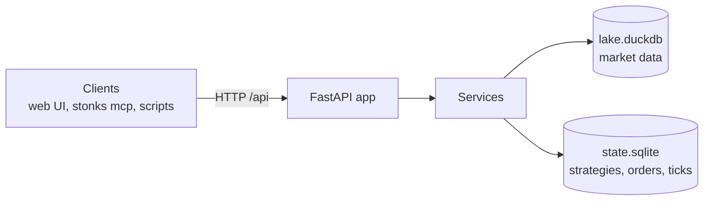

# REST API

<!-- Generated by `uv run python -m stonks.api.docs` from web/openapi.json. Do not edit. -->

Stonks API 1.0.0. Research + trading system: portfolio, strategies, market data, lab runs and background jobs.

Auth: every route except health and sign-in needs a credential: the browser
session cookie (plus `X-CSRF-Token` on writes) or `Authorization: Bearer stk_...`.
The Auth column names the permission a route checks (see `docs/security.md`).
"sign-in" means any signed-in user.

Tags: [alerts](#alerts-endpoints) · [assistant](#assistant-endpoints) · [auth](#auth-endpoints) · [backups](#backups-endpoints) · [brokers](#brokers-endpoints) · [calendars](#calendars-endpoints) · [catalog](#catalog-endpoints) · [charts](#charts-endpoints) · [connections](#connections-endpoints) · [demo](#demo-endpoints) · [execution](#execution-endpoints) · [exports](#exports-endpoints) · [factors](#factors-endpoints) · [fx](#fx-endpoints) · [halts](#halts-endpoints) · [health](#health-endpoints) · [ingest](#ingest-endpoints) · [insights](#insights-endpoints) · [jobs](#jobs-endpoints) · [journal](#journal-endpoints) · [lab](#lab-endpoints) · [lab-worker](#lab-worker-endpoints) · [live](#live-endpoints) · [market](#market-endpoints) · [model-versions](#model-versions-endpoints) · [notifications](#notifications-endpoints) · [onboarding](#onboarding-endpoints) · [options](#options-endpoints) · [orders](#orders-endpoints) · [pnl](#pnl-endpoints) · [portfolio](#portfolio-endpoints) · [price-alerts](#price-alerts-endpoints) · [push](#push-endpoints) · [reconcile](#reconcile-endpoints) · [risk](#risk-endpoints) · [schedule](#schedule-endpoints) · [screener](#screener-endpoints) · [shadow](#shadow-endpoints) · [sources](#sources-endpoints) · [starter](#starter-endpoints) · [statement-imports](#statement-imports-endpoints) · [statements](#statements-endpoints) · [strategies](#strategies-endpoints) · [stream](#stream-endpoints) · [studio](#studio-endpoints) · [subscriptions](#subscriptions-endpoints) · [system-settings](#system-settings-endpoints) · [tax](#tax-endpoints) · [tca](#tca-endpoints) · [telegram](#telegram-endpoints) · [ticks](#ticks-endpoints) · [universes](#universes-endpoints) · [watchlists](#watchlists-endpoints)

## alerts endpoints

| Method | Path | Summary | Auth | Request | Response |
|--------|------|---------|------|---------|----------|
| GET | `/api/alerts` | List Alerts | sign-in |  | [Page_AlertView_](#page_alertview_) |

## assistant endpoints

| Method | Path | Summary | Auth | Request | Response |
|--------|------|---------|------|---------|----------|
| GET | `/api/assistant/briefings/prefs` | Get Briefing Prefs | sign-in |  | [BriefingPrefsView](#briefingprefsview) |
| PUT | `/api/assistant/briefings/prefs` | Set Briefing Prefs | `notifications.manage` | [BriefingPrefsUpdate](#briefingprefsupdate) | [BriefingPrefsView](#briefingprefsview) |
| POST | `/api/assistant/briefings/run` | Run Briefings | `operations.run` | [BriefingRunRequest](#briefingrunrequest) | [BriefingRunView](#briefingrunview) |
| GET | `/api/assistant/conversations` | List Conversations | sign-in |  | [Page_ConversationView_](#page_conversationview_) |
| POST | `/api/assistant/conversations` | Create Conversation | `data.read` | [ConversationCreate](#conversationcreate) | [ConversationView](#conversationview) |
| GET | `/api/assistant/conversations/{conversation_id}` | Get Conversation | sign-in |  | [ConversationDetailView](#conversationdetailview) |
| DELETE | `/api/assistant/conversations/{conversation_id}` | Delete Conversation | `data.read` |  |  |
| POST | `/api/assistant/conversations/{conversation_id}/actions/{action_id}` | Decide Action | `data.read` | [ActionDecision](#actiondecision) | SSE of [AssistantEventView](#assistanteventview) |
| POST | `/api/assistant/conversations/{conversation_id}/messages` | Send Message | `data.read` | [MessageCreate](#messagecreate) | SSE of [AssistantEventView](#assistanteventview) |
| GET | `/api/assistant/conversations/{conversation_id}/turns` | List Turns | sign-in |  | [Page_TurnView_](#page_turnview_) |
| DELETE | `/api/assistant/freeze` | Clear Freeze | `killswitch.resume` |  |  |
| GET | `/api/assistant/research` | List Research | sign-in |  | [Page_ResearchSessionView_](#page_researchsessionview_) |
| POST | `/api/assistant/research` | Start Research | `lab.run` | [ResearchStart](#researchstart) | [Job](#job) |
| GET | `/api/assistant/research/{session_id}` | Get Research | sign-in |  | [ResearchSessionDetailView](#researchsessiondetailview) |
| GET | `/api/assistant/status` | Assistant Status | sign-in |  | [AssistantStatusView](#assistantstatusview) |

## auth endpoints

| Method | Path | Summary | Auth | Request | Response |
|--------|------|---------|------|---------|----------|
| GET | `/api/auth/check` | Check Auth | sign-in |  | [AuthCheck](#authcheck) |
| POST | `/api/auth/login` | Login | none | [LoginRequest](#loginrequest) | [LoginView](#loginview) |
| POST | `/api/auth/logout` | Logout | none |  |  |
| GET | `/api/auth/me` | Me | sign-in |  | [MeView](#meview) |
| POST | `/api/auth/mfa/enrol` | Start Enrolment | none |  | [EnrolStartView](#enrolstartview) |
| POST | `/api/auth/mfa/enrol/confirm` | Confirm Enrolment | none | [MfaCodeRequest](#mfacoderequest) | [MfaView](#mfaview) |
| POST | `/api/auth/mfa/verify` | Verify Mfa | none | [MfaCodeRequest](#mfacoderequest) | [MfaView](#mfaview) |
| POST | `/api/auth/password` | Change Password | `password.change` | [PasswordChangeRequest](#passwordchangerequest) |  |
| POST | `/api/auth/recovery-codes` | Regenerate Recovery Codes | `mfa.recovery_codes` |  | [RecoveryCodesView](#recoverycodesview) |
| GET | `/api/auth/tokens` | List Tokens | sign-in |  | [Page_TokenView_](#page_tokenview_) |
| POST | `/api/auth/tokens` | Create Token | `tokens.manage` | [TokenCreateRequest](#tokencreaterequest) | [TokenCreatedView](#tokencreatedview) |
| DELETE | `/api/auth/tokens/{token_id}` | Revoke Token | `tokens.revoke` |  |  |
| GET | `/api/auth/toolsets` | List Toolsets | sign-in |  | [Page_ToolsetView_](#page_toolsetview_) |
| GET | `/api/auth/users` | List Users | `users.read` |  | [Page_UserView_](#page_userview_) |
| POST | `/api/auth/users` | Create User | `users.manage` | [UserCreateRequest](#usercreaterequest) | [UserView](#userview) |
| PATCH | `/api/auth/users/{user_id}` | Update User | `users.manage` | [UserUpdateRequest](#userupdaterequest) | [UserView](#userview) |
| DELETE | `/api/auth/users/{user_id}/mfa` | Reset User Mfa | `users.manage` |  |  |
| POST | `/api/auth/users/{user_id}/password` | Reset User Password | `users.manage` | [PasswordResetRequest](#passwordresetrequest) |  |

## backups endpoints

| Method | Path | Summary | Auth | Request | Response |
|--------|------|---------|------|---------|----------|
| GET | `/api/backups` | List Backups | `operations.run` |  | [Page_BackupView_](#page_backupview_) |
| POST | `/api/backups` | Start Backup | `operations.run` |  | [Job](#job) |
| GET | `/api/backups/jobs/{job_id}/result` | Get Backup Result | `operations.run` |  | [BackupResultView](#backupresultview) |
| GET | `/api/backups/restores/{job_id}/result` | Get Restore Result | `operations.run` |  | [RestoreResultView](#restoreresultview) |
| POST | `/api/backups/{backup_id}/restore` | Restore Backup | `backups.restore` | [RestoreRequest](#restorerequest) | [Job](#job) |
| POST | `/api/backups/{backup_id}/verify` | Verify Backup | `operations.run` |  | [VerifyView](#verifyview) |

## brokers endpoints

| Method | Path | Summary | Auth | Request | Response |
|--------|------|---------|------|---------|----------|
| GET | `/api/brokers` | Get Broker Info | sign-in |  | [BrokerInfo](#brokerinfo) |
| GET | `/api/brokers/alpaca/status` | Get Alpaca Status | sign-in |  | [AlpacaStatus](#alpacastatus) |
| GET | `/api/brokers/gateways` | Get Broker Gateways | `data.read` |  | [GatewayHealthView](#gatewayhealthview) |

## calendars endpoints

| Method | Path | Summary | Auth | Request | Response |
|--------|------|---------|------|---------|----------|
| GET | `/api/calendars` | Get Calendar | sign-in |  | [CalendarView](#calendarview) |
| GET | `/api/calendars/alert-kinds` | List Event Alert Kinds | sign-in |  | list[[EventAlertKindView](#eventalertkindview)] |
| GET | `/api/calendars/earnings-warnings` | Get Earnings Warnings | sign-in |  | [EarningsWarningsView](#earningswarningsview) |
| GET | `/api/calendars/news` | Get News | sign-in |  | [NewsView](#newsview) |
| POST | `/api/calendars/refresh` | Refresh Calendars | `operations.run` | [CalendarRefreshRequest](#calendarrefreshrequest) | [Job](#job) |
| GET | `/api/calendars/refresh/{job_id}/result` | Get Refresh Result | sign-in |  | [CalendarRefreshView](#calendarrefreshview) |

## catalog endpoints

| Method | Path | Summary | Auth | Request | Response |
|--------|------|---------|------|---------|----------|
| GET | `/api/catalog/asset-classes` | List Asset Classes | sign-in |  | list[string] |
| GET | `/api/catalog/intervals` | List Intervals | sign-in |  | list[[IntervalInfo](#intervalinfo)] |
| GET | `/api/catalog/strategies` | List Strategy Classes | sign-in |  | list[[StrategyClassInfo](#strategyclassinfo)] |

## charts endpoints

| Method | Path | Summary | Auth | Request | Response |
|--------|------|---------|------|---------|----------|
| GET | `/api/charts/compare` | Compare Charts | sign-in |  | [CompareView](#compareview) |
| GET | `/api/charts/{ticker}` | Get Chart | sign-in |  | [ChartView](#chartview) |

## connections endpoints

| Method | Path | Summary | Auth | Request | Response |
|--------|------|---------|------|---------|----------|
| GET | `/api/connections` | List Connections | sign-in |  | [Page_ConnectionView_](#page_connectionview_) |
| GET | `/api/connections/callback` | Complete Portal | sign-in |  | [ConnectionView](#connectionview) |
| POST | `/api/connections/keys` | Connect With Keys | `connection.manage` | [ConnectWithKeysRequest](#connectwithkeysrequest) | [ConnectionView](#connectionview) |
| POST | `/api/connections/portal` | Start Portal | `connection.manage` | [StartPortalRequest](#startportalrequest) | [PortalLinkView](#portallinkview) |
| GET | `/api/connections/providers` | List Providers | sign-in |  | list[[ProviderView](#providerview)] |
| GET | `/api/connections/{connection_id}` | Get Connection | sign-in |  | [ConnectionView](#connectionview) |
| DELETE | `/api/connections/{connection_id}` | Delete Connection | `connection.manage` |  | [DisconnectView](#disconnectview) |
| GET | `/api/connections/{connection_id}/accounts` | List Accounts | sign-in |  | [Page_BrokerAccountView_](#page_brokeraccountview_) |
| POST | `/api/connections/{connection_id}/link` | Link Account | `portfolio.manage` | [LinkAccountRequest](#linkaccountrequest) | [LinkResultView](#linkresultview) |
| POST | `/api/connections/{connection_id}/sync` | Sync Connection | `portfolio.manage` |  | [SyncResultView](#syncresultview) |

## demo endpoints

| Method | Path | Summary | Auth | Request | Response |
|--------|------|---------|------|---------|----------|
| GET | `/api/demo` | Get Demo | sign-in |  | [DemoPortfolioView](#demoportfolioview) |
| POST | `/api/demo` | Open Demo | `data.read` |  | [DemoPortfolioView](#demoportfolioview) |
| DELETE | `/api/demo` | Remove Demo | `data.read` |  |  |

## execution endpoints

| Method | Path | Summary | Auth | Request | Response |
|--------|------|---------|------|---------|----------|
| GET | `/api/execution/algos` | List Execution Algos | sign-in |  | [AlgoList](#algolist) |
| POST | `/api/planner/confirm` | Confirm Rebalance | `portfolio.trade` | [PlanConfirm](#planconfirm) | [PlanConfirmResult](#planconfirmresult) |
| POST | `/api/planner/plan` | Plan Rebalance | `data.read` | [PlanRequest](#planrequest) | [RebalancePlanView](#rebalanceplanview) |
| GET | `/api/portfolios/{portfolio_id}/algo-parents` | List Algo Parents | sign-in |  | [ParentOrderList](#parentorderlist) |
| GET | `/api/portfolios/{portfolio_id}/execution-algos` | List Execution Algo Settings | sign-in |  | [AlgoSettingList](#algosettinglist) |
| PUT | `/api/portfolios/{portfolio_id}/execution-algos` | Set Execution Algo | `portfolio.manage` | [AlgoSettingUpdate](#algosettingupdate) | [AlgoSettingView](#algosettingview) |
| DELETE | `/api/portfolios/{portfolio_id}/execution-algos` | Clear Execution Algo | `portfolio.manage` |  |  |

## exports endpoints

| Method | Path | Summary | Auth | Request | Response |
|--------|------|---------|------|---------|----------|
| GET | `/api/exports/fills` | Fills as CSV | sign-in |  | `text/csv` |
| GET | `/api/exports/journal` | Trade journal as CSV | sign-in |  | `text/csv` |
| GET | `/api/exports/lab-trials` | Lab trial results as CSV | `lab.run` |  | `text/csv` |
| GET | `/api/exports/orders` | Orders as CSV | sign-in |  | `text/csv` |
| GET | `/api/exports/pnl` | Daily P&L as CSV | sign-in |  | `text/csv` |
| GET | `/api/exports/snapshots` | Portfolio snapshots as CSV | sign-in |  | `text/csv` |

## factors endpoints

| Method | Path | Summary | Auth | Request | Response |
|--------|------|---------|------|---------|----------|
| GET | `/api/factors` | List Factors | sign-in |  | [FactorCatalogView](#factorcatalogview) |
| POST | `/api/factors/check` | Check Expression | `data.read` | [ExpressionCheckRequest](#expressioncheckrequest) | [ExpressionCheckView](#expressioncheckview) |
| POST | `/api/factors/tearsheets` | Start Tearsheet | `lab.run` | [FactorTearSheetRequest](#factortearsheetrequest) | [Job](#job) |
| GET | `/api/factors/tearsheets/{job_id}/result` | Get Tearsheet Result | sign-in |  | [FactorTearSheetView](#factortearsheetview) |
| POST | `/api/factors/values` | Factor Values | `data.read` | [FactorValuesRequest](#factorvaluesrequest) | [FactorValuesView](#factorvaluesview) |
| GET | `/api/factors/{factor_id}` | Get Factor | sign-in |  | [FactorView](#factorview) |

## fx endpoints

| Method | Path | Summary | Auth | Request | Response |
|--------|------|---------|------|---------|----------|
| GET | `/api/fx/rate` | Get Fx Rate | sign-in |  | [FxRateView](#fxrateview) |

## halts endpoints

| Method | Path | Summary | Auth | Request | Response |
|--------|------|---------|------|---------|----------|
| GET | `/api/halts` | List Halts | sign-in |  | [Page_HaltView_](#page_haltview_) |
| POST | `/api/halts/kill` | Engage Kill Switch | `killswitch.user` | [KillSwitchRequest](#killswitchrequest) | [HaltView](#haltview) |
| GET | `/api/halts/{halt_id}` | Get Halt | sign-in |  | [HaltView](#haltview) |
| POST | `/api/halts/{halt_id}/clear` | Clear Halt | `risk.reset` | [ClearHaltRequest](#clearhaltrequest) | [HaltView](#haltview) |
| POST | `/api/halts/{halt_id}/resume` | Resume Kill Switch | `killswitch.resume` | [ResumeRequest](#resumerequest) | [HaltView](#haltview) |
| GET | `/api/halts/{halt_id}/resume-checks` | Get Resume Checks | `killswitch.user` |  | [ResumeChecksView](#resumechecksview) |

## health endpoints

| Method | Path | Summary | Auth | Request | Response |
|--------|------|---------|------|---------|----------|
| GET | `/api/health` | Liveness probe | none |  | [Health](#health) |
| GET | `/api/health/live` | Liveness probe (process and hosted scheduler) | none |  | [ProbeView](#probeview) |
| GET | `/api/health/price-check` | Latest Price Check | sign-in |  | [PriceCheckView](#pricecheckview) \| null |
| POST | `/api/health/price-check/run` | Run Price Check | `operations.run` | [PriceCheckRunBody](#pricecheckrunbody) | [PriceCheckRunView](#pricecheckrunview) |
| GET | `/api/health/ready` | Readiness probe (state migrated, lake present) | none |  | [ProbeView](#probeview) |
| GET | `/api/health/report` | Health Report | sign-in |  | [HealthReportView](#healthreportview) |
| POST | `/api/health/run` | Run Health Checks | `operations.run` | [HealthRunRequest](#healthrunrequest) | [HealthReportView](#healthreportview) |

## ingest endpoints

| Method | Path | Summary | Auth | Request | Response |
|--------|------|---------|------|---------|----------|
| GET | `/api/ingest/jobs/{job_id}/result` | Get Ingest Result | sign-in |  | [IngestResultView](#ingestresultview) |
| GET | `/api/ingest/runs` | List Runs | sign-in |  | [Page_IngestRunView_](#page_ingestrunview_) |
| POST | `/api/ingest/runs` | Start Ingest | `operations.run` | [IngestRequest](#ingestrequest) | [Job](#job) |

## insights endpoints

| Method | Path | Summary | Auth | Request | Response |
|--------|------|---------|------|---------|----------|
| GET | `/api/insights` | Get Insights | sign-in |  | [InsightsView](#insightsview) |
| GET | `/api/insights/agreement` | Get Agreement | sign-in |  | [AgreementView](#agreementview) |
| GET | `/api/insights/behaviour` | Get Behaviour | sign-in |  | [BehaviourView](#behaviourview) |
| GET | `/api/insights/look-through` | Get Look Through | `data.read` |  | [LookThroughView](#lookthroughview) |
| GET | `/api/insights/totals` | Get Totals | `portfolio.totals` |  | [InsightsTotalsView](#insightstotalsview) |

## jobs endpoints

| Method | Path | Summary | Auth | Request | Response |
|--------|------|---------|------|---------|----------|
| GET | `/api/jobs` | List Jobs | sign-in |  | [Page_Job_](#page_job_) |
| GET | `/api/jobs/{job_id}` | Get Job | sign-in |  | [Job](#job) |
| POST | `/api/jobs/{job_id}/cancel` | Cancel Job | `lab.run` |  | [Job](#job) |
| GET | `/api/jobs/{job_id}/events` | Stream Job Events | sign-in |  | SSE of [JobEvent](#jobevent) |
| POST | `/api/jobs/{job_id}/stream-token` | Create Stream Token | `data.read` |  | [StreamToken](#streamtoken) |

## journal endpoints

| Method | Path | Summary | Auth | Request | Response |
|--------|------|---------|------|---------|----------|
| GET | `/api/journal/breakdown` | Get Journal Breakdown | sign-in |  | [BreakdownView](#breakdownview) |
| GET | `/api/journal/calendar` | Get Pnl Calendar | sign-in |  | [PnlCalendarView](#pnlcalendarview) |
| GET | `/api/journal/labels` | List Journal Labels | sign-in |  | [JournalLabelsView](#journallabelsview) |
| GET | `/api/journal/playbooks` | List Playbooks | sign-in |  | [Page_PlaybookView_](#page_playbookview_) |
| POST | `/api/journal/playbooks` | Create Playbook | `portfolio.manage` | [PlaybookCreate](#playbookcreate) | [PlaybookView](#playbookview) |
| PATCH | `/api/journal/playbooks/{playbook_id}` | Update Playbook | `portfolio.manage` | [PlaybookUpdate](#playbookupdate) | [PlaybookView](#playbookview) |
| GET | `/api/journal/trades` | List Journal Trades | sign-in |  | [Page_JournalTradeView_](#page_journaltradeview_) |
| GET | `/api/journal/trades/{trade_id}` | Get Journal Trade | sign-in |  | [JournalTradeDetailView](#journaltradedetailview) |
| PUT | `/api/journal/trades/{trade_id}/review` | Review Journal Trade | `portfolio.manage` | [AnnotationRequest](#annotationrequest) | [AnnotationView](#annotationview) |

## lab endpoints

| Method | Path | Summary | Auth | Request | Response |
|--------|------|---------|------|---------|----------|
| POST | `/api/lab/backtests` | Start Backtest | `lab.run` | [BacktestRequest](#backtestrequest) | [Job](#job) |
| GET | `/api/lab/backtests/{job_id}/result` | Get Backtest Result | sign-in |  | [BacktestResult](#backtestresult) |
| GET | `/api/lab/cost-models` | List Cost Models | sign-in |  | list[[CostModelPreset](#costmodelpreset)] |
| GET | `/api/lab/ensure/{job_id}/result` | Get Lab Ensure Result | sign-in |  | [EnsureReport](#ensurereport) |
| GET | `/api/lab/ledger` | List Ledger Runs | `lab.run` |  | [Page_LedgerRunView_](#page_ledgerrunview_) |
| GET | `/api/lab/ledger/{run_id}` | Get Ledger Run | `lab.run` |  | [LedgerRunDetail](#ledgerrundetail) |
| POST | `/api/lab/runs` | Start Lab Run | `lab.run` | [LabRunRequest](#labrunrequest) | [Job](#job) |
| GET | `/api/lab/runs/{job_id}/result` | Get Lab Run Result | sign-in |  | [LabRunView](#labrunview) |
| POST | `/api/lab/signal-ic` | Start Signal Ic | `lab.run` | [SignalICRequest](#signalicrequest) | [Job](#job) |
| GET | `/api/lab/signal-ic/{job_id}/result` | Get Signal Ic Result | sign-in |  | [SignalICView](#signalicview) |
| GET | `/api/lab/survival-presets` | List Survival Presets | sign-in |  | list[[SurvivalPresetInfo](#survivalpresetinfo)] |
| GET | `/api/lab/survival-tests` | List Survival Tests | sign-in |  | list[[SurvivalTestInfo](#survivaltestinfo)] |
| POST | `/api/lab/sweeps` | Start Sweep | `lab.run` | [SweepRequest](#sweeprequest) | [Job](#job) |
| GET | `/api/lab/sweeps/{job_id}/result` | Get Sweep Result | sign-in |  | [SweepResultView](#sweepresultview) |
| POST | `/api/lab/verify` | Start Verify | `lab.run` | [VerifyRequest](#verifyrequest) \| null | [Job](#job) |
| GET | `/api/lab/verify/jobs/{job_id}/result` | Get Verify Result | sign-in |  | [VerifyResultView](#verifyresultview) |

## lab-worker endpoints

| Method | Path | Summary | Auth | Request | Response |
|--------|------|---------|------|---------|----------|
| POST | `/api/lab/worker/claim` | Claim Job | `lab.worker` | [WorkerRef](#workerref) | [ClaimResult](#claimresult) |
| POST | `/api/lab/worker/jobs/{job_id}/complete` | Complete Job | `lab.worker` | [WorkerOutcome](#workeroutcome) | [Job](#job) |
| POST | `/api/lab/worker/jobs/{job_id}/heartbeat` | Heartbeat Job | `lab.worker` | [WorkerHeartbeat](#workerheartbeat) | [HeartbeatReply](#heartbeatreply) |
| POST | `/api/lab/worker/jobs/{job_id}/release` | Release Job | `lab.worker` | [WorkerRef](#workerref) | [Job](#job) |
| POST | `/api/lab/worker/register` | Register Worker | `lab.worker` | [WorkerHello](#workerhello) | [WorkerConfig](#workerconfig) |
| GET | `/api/lab/worker/snapshots/{name}` | Download Snapshot | `lab.worker` |  | `application/x-tar` |
| POST | `/api/lab/worker/stop` | Stop Worker | `lab.worker` | [WorkerRef](#workerref) | [WorkerStopped](#workerstopped) |

## live endpoints

| Method | Path | Summary | Auth | Request | Response |
|--------|------|---------|------|---------|----------|
| GET | `/api/portfolios/{portfolio_id}/live/account-profile` | Get Account Profile | sign-in |  | [AccountProfileView](#accountprofileview) |
| PUT | `/api/portfolios/{portfolio_id}/live/account-profile` | Set Account Profile | `live.manage` | [AccountProfileBody](#accountprofilebody) | [AccountProfileView](#accountprofileview) |
| GET | `/api/portfolios/{portfolio_id}/live/allocation` | Get Live Allocation | sign-in |  | [LiveAllocationView](#liveallocationview) |
| PUT | `/api/portfolios/{portfolio_id}/live/allocation` | Set Live Allocation | `live.manage` | [LiveAllocationUpdate](#liveallocationupdate) | [LiveAllocationView](#liveallocationview) |
| GET | `/api/portfolios/{portfolio_id}/live/gate-report` | Get Live Gate Report | `data.read` |  | [GateReportView](#gatereportview) |
| GET | `/api/portfolios/{portfolio_id}/live/margin` | Get Live Margin | `data.read` |  | [MarginView](#marginview) |
| GET | `/api/portfolios/{portfolio_id}/live/options` | Get Options Live | `data.read` |  | [OptionsLiveView](#optionsliveview) |
| PUT | `/api/portfolios/{portfolio_id}/live/options/approval` | Set Options Approval | `live.manage` | [OptionsApprovalUpdate](#optionsapprovalupdate) | [OptionsLiveView](#optionsliveview) |
| POST | `/api/portfolios/{portfolio_id}/live/preview` | Preview Live Orders | `portfolio.trade` |  | [LivePreviewView](#livepreviewview) |
| GET | `/api/portfolios/{portfolio_id}/live/rules` | Get Live Rules | `data.read` |  | [LiveRulesView](#liverulesview) |
| GET | `/api/portfolios/{portfolio_id}/live/stage` | Get Live Stage | `data.read` |  | [LiveStageView](#livestageview) |
| POST | `/api/portfolios/{portfolio_id}/live/stage/demote` | Demote Live Stage | `portfolio.trade` | [StageDemoteBody](#stagedemotebody) | [LiveStageView](#livestageview) |
| POST | `/api/portfolios/{portfolio_id}/live/stage/promote` | Promote Live Stage | `live.manage` | [StagePromoteBody](#stagepromotebody) | [LiveStageView](#livestageview) |

## market endpoints

| Method | Path | Summary | Auth | Request | Response |
|--------|------|---------|------|---------|----------|
| GET | `/api/market/bars` | Get Bars | sign-in |  | [BarSeries](#barseries) |
| GET | `/api/market/breadth` | Get Breadth | `data.read` |  | [BreadthView](#breadthview) |
| GET | `/api/market/coverage` | List Coverage | sign-in |  | [Page_CoverageRow_](#page_coveragerow_) |
| GET | `/api/market/data-coverage` | Get Data Coverage | sign-in |  | [DataCoverage](#datacoverage) |
| GET | `/api/market/instruments` | List Instruments | sign-in |  | [Page_InstrumentView_](#page_instrumentview_) |

## model-versions endpoints

| Method | Path | Summary | Auth | Request | Response |
|--------|------|---------|------|---------|----------|
| GET | `/api/model-versions/candidates` | List Candidates | sign-in |  | [Page_ModelVersionView_](#page_modelversionview_) |
| GET | `/api/model-versions/jobs/{job_id}/result` | Get Retrain Result | sign-in |  | [RetrainResultView](#retrainresultview) |
| POST | `/api/model-versions/retrain` | Start Retrain | `lab.run` | [RetrainRequest](#retrainrequest) \| null | [Job](#job) |
| GET | `/api/strategies/{strategy_id}/versions` | List Versions | sign-in |  | [Page_ModelVersionView_](#page_modelversionview_) |
| GET | `/api/strategies/{strategy_id}/versions/history` | Version History | sign-in |  | [Page_VersionEventView_](#page_versioneventview_) |
| GET | `/api/strategies/{strategy_id}/versions/{version}/calibration` | Model Calibration | sign-in |  | [CalibrationView](#calibrationview) |
| GET | `/api/strategies/{strategy_id}/versions/{version}/check` | Check Swap | sign-in |  | [SwapReportView](#swapreportview) |
| POST | `/api/strategies/{strategy_id}/versions/{version}/reject` | Reject Version | `strategy.promote` | [VersionChangeRequest](#versionchangerequest) \| null | [ModelVersionView](#modelversionview) |
| POST | `/api/strategies/{strategy_id}/versions/{version}/swap` | Swap Version | `strategy.promote` | [VersionChangeRequest](#versionchangerequest) \| null | [ModelVersionView](#modelversionview) |

## notifications endpoints

| Method | Path | Summary | Auth | Request | Response |
|--------|------|---------|------|---------|----------|
| GET | `/api/notifications` | List Notifications | sign-in |  | [FeedView](#feedview) |
| GET | `/api/notifications/preferences` | Get Preferences | sign-in |  | [PreferencesView](#preferencesview) |
| PUT | `/api/notifications/preferences` | Update Preferences | `notifications.manage` | [PreferencesUpdate](#preferencesupdate) | [PreferencesView](#preferencesview) |
| PUT | `/api/notifications/quiet-hours` | Set Quiet Hours | `notifications.manage` | [QuietHoursUpdate](#quiethoursupdate) | [PreferencesView](#preferencesview) |
| POST | `/api/notifications/read` | Mark Read | `data.read` | [MarkReadRequest](#markreadrequest) | [MarkReadView](#markreadview) |
| POST | `/api/notifications/test` | Send Test | `data.read` |  | [TestNotificationView](#testnotificationview) |
| PUT | `/api/notifications/webhook` | Set Webhook | `notifications.manage` | [WebhookUpdate](#webhookupdate) | [PreferencesView](#preferencesview) |

## onboarding endpoints

| Method | Path | Summary | Auth | Request | Response |
|--------|------|---------|------|---------|----------|
| GET | `/api/onboarding` | Get Onboarding | sign-in |  | [OnboardingView](#onboardingview) |
| PUT | `/api/onboarding` | Update Onboarding | `data.read` | [OnboardingUpdate](#onboardingupdate) | [OnboardingView](#onboardingview) |
| PUT | `/api/onboarding/steps/{step}` | Update Onboarding Step | `data.read` | [StepUpdate](#stepupdate) | [OnboardingView](#onboardingview) |
| GET | `/api/onboarding/system` | Get System Checklist | `operations.run` |  | [SystemChecklistView](#systemchecklistview) |

## options endpoints

| Method | Path | Summary | Auth | Request | Response |
|--------|------|---------|------|---------|----------|
| POST | `/api/options/backtests` | Start Backtest | `lab.run` | [OptionsBacktestRequest](#optionsbacktestrequest) | [Job](#job) |
| GET | `/api/options/backtests/{job_id}/result` | Get Backtest Result | `data.read` |  | [OptionsBacktestView](#optionsbacktestview) |
| GET | `/api/options/chains/{underlying}` | Get Chain | `data.read` |  | [OptionChainView](#optionchainview) |
| POST | `/api/options/payoff` | Get Payoff | `data.read` | [OptionPayoffRequest](#optionpayoffrequest) | [OptionPayoffView](#optionpayoffview) |
| GET | `/api/options/strategies` | List Strategies | `data.read` |  | list[[OptionStrategyView](#optionstrategyview)] |
| GET | `/api/options/structures` | List Structures | `data.read` |  | list[[OptionStructureView](#optionstructureview)] |
| GET | `/api/options/underlyings` | List Underlyings | `data.read` |  | [Page_OptionUnderlyingView_](#page_optionunderlyingview_) |

## orders endpoints

| Method | Path | Summary | Auth | Request | Response |
|--------|------|---------|------|---------|----------|
| GET | `/api/orders` | List Orders | sign-in |  | [Page_OrderView_](#page_orderview_) |
| GET | `/api/orders/drafts` | List Order Drafts | sign-in |  | [Page_OrderDraftView_](#page_orderdraftview_) |
| POST | `/api/orders/drafts` | Create Order Draft | `portfolio.trade` | [OrderDraftCreate](#orderdraftcreate) | [OrderDraftView](#orderdraftview) |
| POST | `/api/orders/drafts/{draft_id}/approve` | Approve Order Draft | `orders.approve` |  | [OrderDraftApproval](#orderdraftapproval) |
| POST | `/api/orders/drafts/{draft_id}/reject` | Reject Order Draft | `portfolio.trade` | [OrderDraftDecision](#orderdraftdecision) | [OrderDraftView](#orderdraftview) |
| GET | `/api/orders/fills` | List Fills | sign-in |  | [Page_FillView_](#page_fillview_) |
| POST | `/api/orders/manual` | Place Manual Order | `portfolio.trade` | [ManualOrderRequest](#manualorderrequest) | [ManualOrderResult](#manualorderresult) |
| POST | `/api/orders/manual/plan` | Plan Manual Order | `portfolio.trade` | [TradePlanRequest](#tradeplanrequest) | [TradePlanView](#tradeplanview) |
| POST | `/api/orders/manual/preview` | Preview Manual Order | `portfolio.trade` | [ManualOrderRequest](#manualorderrequest) | [ManualOrderResult](#manualorderresult) |
| POST | `/api/orders/{client_id}/cancel` | Cancel Order | `portfolio.trade` | [OrderCancelRequest](#ordercancelrequest) | [OrderCancelResult](#ordercancelresult) |
| POST | `/api/orders/{client_id}/change` | Change Manual Order | `portfolio.trade` | [ManualOrderChange](#manualorderchange) | [ManualOrderResult](#manualorderresult) |
| GET | `/api/tickets` | List Tickets | sign-in |  | [Page_TicketView_](#page_ticketview_) |
| POST | `/api/tickets/approve` | Approve Tickets | `orders.approve` | [TicketApproval](#ticketapproval) | [TicketList](#ticketlist) |
| POST | `/api/tickets/submit` | Submit Tickets | `operations.run` |  | [TicketSubmitResult](#ticketsubmitresult) |
| GET | `/api/tickets/summary` | Ticket Summary | sign-in |  | [TicketSummary](#ticketsummary) |
| GET | `/api/tickets/{ticket_id}` | Get Ticket | sign-in |  | [TicketView](#ticketview) |
| POST | `/api/tickets/{ticket_id}/reject` | Reject Ticket | `portfolio.trade` | [TicketRejection](#ticketrejection) | [TicketView](#ticketview) |

## pnl endpoints

| Method | Path | Summary | Auth | Request | Response |
|--------|------|---------|------|---------|----------|
| GET | `/api/pnl` | Get Pnl | sign-in |  | [PnlSeries](#pnlseries) |

## portfolio endpoints

| Method | Path | Summary | Auth | Request | Response |
|--------|------|---------|------|---------|----------|
| GET | `/api/decisions` | List Trade Decisions | `data.read` |  | [Page_TradeDecisionView_](#page_tradedecisionview_) |
| GET | `/api/portfolio` | Get Portfolio | sign-in |  | [PortfolioView](#portfolioview) |
| GET | `/api/portfolio/snapshots` | List Snapshots | sign-in |  | [Page_SnapshotView_](#page_snapshotview_) |
| GET | `/api/portfolio/totals` | Get Totals | `portfolio.totals` |  | [PortfolioTotalsView](#portfoliototalsview) |
| GET | `/api/portfolios` | List Portfolios | `data.read` |  | [Page_PortfolioSummaryView_](#page_portfoliosummaryview_) |
| POST | `/api/portfolios` | Create Portfolio | `portfolio.manage` | [PortfolioCreate](#portfoliocreate) | [PortfolioSummaryView](#portfoliosummaryview) |
| GET | `/api/portfolios/trading-modes` | List Trading Modes | `data.read` |  | [Page_TradingModeView_](#page_tradingmodeview_) |
| PATCH | `/api/portfolios/{portfolio_id}` | Rename Portfolio | `portfolio.manage` | [PortfolioRename](#portfoliorename) | [PortfolioSummaryView](#portfoliosummaryview) |
| GET | `/api/portfolios/{portfolio_id}/cash-flows` | List Cash Flows | sign-in |  | [Page_CashFlowView_](#page_cashflowview_) |
| POST | `/api/portfolios/{portfolio_id}/cash-flows` | Record Cash Flow | `portfolio.manage` | [CashFlowCreate](#cashflowcreate) | [CashFlowView](#cashflowview) |

## price-alerts endpoints

| Method | Path | Summary | Auth | Request | Response |
|--------|------|---------|------|---------|----------|
| GET | `/api/price-alerts` | List Price Alerts | sign-in |  | [Page_PriceAlertView_](#page_pricealertview_) |
| POST | `/api/price-alerts` | Create Price Alert | `notifications.manage` | [PriceAlertCreate](#pricealertcreate) | [PriceAlertView](#pricealertview) |
| POST | `/api/price-alerts/evaluate` | Evaluate Price Alerts | `operations.run` | [PriceAlertRunRequest](#pricealertrunrequest) \| null | [PriceAlertRunView](#pricealertrunview) |
| GET | `/api/price-alerts/events` | List Price Alert Events | sign-in |  | [Page_PriceAlertEventView_](#page_pricealerteventview_) |
| GET | `/api/price-alerts/{alert_id}` | Get Price Alert | sign-in |  | [PriceAlertView](#pricealertview) |
| PATCH | `/api/price-alerts/{alert_id}` | Update Price Alert | `notifications.manage` | [PriceAlertUpdate](#pricealertupdate) | [PriceAlertView](#pricealertview) |
| DELETE | `/api/price-alerts/{alert_id}` | Delete Price Alert | `notifications.manage` |  |  |

## push endpoints

| Method | Path | Summary | Auth | Request | Response |
|--------|------|---------|------|---------|----------|
| GET | `/api/push/subscriptions` | List Push Subscriptions | sign-in |  | [Page_PushDeviceView_](#page_pushdeviceview_) |
| POST | `/api/push/subscriptions` | Create Push Subscription | `notifications.manage` | [PushSubscriptionRequest](#pushsubscriptionrequest) | [PushDeviceView](#pushdeviceview) |
| DELETE | `/api/push/subscriptions` | Delete Push Subscription | `notifications.manage` | [PushUnsubscribeRequest](#pushunsubscriberequest) |  |
| DELETE | `/api/push/subscriptions/{device_id}` | Delete Push Device | `notifications.manage` |  |  |
| GET | `/api/push/vapid-key` | Vapid Key | sign-in |  | [VapidKeyView](#vapidkeyview) |

## reconcile endpoints

| Method | Path | Summary | Auth | Request | Response |
|--------|------|---------|------|---------|----------|
| GET | `/api/reconcile/reports` | List Reconcile Reports | `data.read` |  | [Page_ReconcileReportView_](#page_reconcilereportview_) |
| GET | `/api/reconcile/reports/{report_id}` | Get Reconcile Report | `data.read` |  | [ReconcileReportView](#reconcilereportview) |

## risk endpoints

| Method | Path | Summary | Auth | Request | Response |
|--------|------|---------|------|---------|----------|
| GET | `/api/risk/intraday` | List Intraday Snapshots | `data.read` |  | [Page_IntradaySnapshotView_](#page_intradaysnapshotview_) |
| GET | `/api/risk/limits` | Get My Risk Limits | sign-in |  | [RiskLimitsView](#risklimitsview) |
| PUT | `/api/risk/limits` | Set My Risk Limits | `portfolio.manage` | [RiskLimitsUpdate](#risklimitsupdate) | [RiskLimitsView](#risklimitsview) |
| GET | `/api/risk/live` | Get Live Risk | sign-in |  | [RiskSummaryView](#risksummaryview) |
| GET | `/api/risk/policy` | Get Risk Policy | sign-in |  | [RiskPolicy](#riskpolicy) |
| GET | `/api/risk/snapshots` | List Risk Snapshots | sign-in |  | [Page_RiskSnapshotView_](#page_risksnapshotview_) |

## schedule endpoints

| Method | Path | Summary | Auth | Request | Response |
|--------|------|---------|------|---------|----------|
| GET | `/api/schedule` | Get Schedule | sign-in |  | [ScheduleView](#scheduleview) |
| POST | `/api/schedule/{job}/run-now` | Run Now | `operations.run` | [RunNowRequest](#runnowrequest) | [RunNowView](#runnowview) |

## screener endpoints

| Method | Path | Summary | Auth | Request | Response |
|--------|------|---------|------|---------|----------|
| GET | `/api/screener/alerts` | List Screen Alerts | sign-in |  | [Page_ScreenAlertView_](#page_screenalertview_) |
| POST | `/api/screener/alerts/evaluate` | Evaluate Screen Alerts | `operations.run` | [ScreenAlertRunRequest](#screenalertrunrequest) \| null | [ScreenAlertRunView](#screenalertrunview) |
| GET | `/api/screener/alerts/events` | List Screen Alert Events | sign-in |  | [Page_ScreenAlertEventView_](#page_screenalerteventview_) |
| POST | `/api/screener/jobs` | Submit Screen Job | `data.read` | [ScreenRunRequest](#screenrunrequest) | [Job](#job) |
| GET | `/api/screener/jobs/{job_id}/result` | Get Screen Job Result | `data.read` |  | [ScreenResult](#screenresult) |
| GET | `/api/screener/metrics` | List Metrics | sign-in |  | list[[MetricView](#metricview)] |
| POST | `/api/screener/run` | Run Screen | `data.read` | [ScreenRunRequest](#screenrunrequest) | [ScreenResult](#screenresult) |
| GET | `/api/screener/screens` | List Screens | sign-in |  | [Page_SavedScreenView_](#page_savedscreenview_) |
| POST | `/api/screener/screens` | Create Screen | `portfolio.manage` | [SavedScreenCreate](#savedscreencreate) | [SavedScreenView](#savedscreenview) |
| GET | `/api/screener/screens/{screen_id}` | Get Screen | sign-in |  | [SavedScreenView](#savedscreenview) |
| PATCH | `/api/screener/screens/{screen_id}` | Update Screen | `portfolio.manage` | [SavedScreenUpdate](#savedscreenupdate) | [SavedScreenView](#savedscreenview) |
| DELETE | `/api/screener/screens/{screen_id}` | Delete Screen | `portfolio.manage` |  |  |
| GET | `/api/screener/screens/{screen_id}/alert` | Get Screen Alert | sign-in |  | [ScreenAlertView](#screenalertview) |
| PUT | `/api/screener/screens/{screen_id}/alert` | Set Screen Alert | `notifications.manage` | [ScreenAlertSet](#screenalertset) | [ScreenAlertView](#screenalertview) |
| DELETE | `/api/screener/screens/{screen_id}/alert` | Delete Screen Alert | `notifications.manage` |  |  |
| POST | `/api/screener/size` | Size Screen | `data.read` | [ScreenRunRequest](#screenrunrequest) | [ScreenSize](#screensize) |
| POST | `/api/screener/universes` | Save As Universe | `lab.run` | [ScreenUniverseRequest](#screenuniverserequest) | [ScreenUniverseView](#screenuniverseview) |

## shadow endpoints

| Method | Path | Summary | Auth | Request | Response |
|--------|------|---------|------|---------|----------|
| GET | `/api/shadow/decisions` | List Shadow Decisions | sign-in |  | [Page_ShadowDecisionView_](#page_shadowdecisionview_) |
| GET | `/api/shadow/pnl` | List Shadow Pnl | sign-in |  | [Page_ShadowPnlSummary_](#page_shadowpnlsummary_) |
| GET | `/api/shadow/strategies/{strategy_id}/pnl` | Get Shadow Pnl | sign-in |  | [PnlSeries](#pnlseries) |

## sources endpoints

| Method | Path | Summary | Auth | Request | Response |
|--------|------|---------|------|---------|----------|
| GET | `/api/sources` | List Sources | sign-in |  | list[[DataSourceInfo](#datasourceinfo)] |

## starter endpoints

| Method | Path | Summary | Auth | Request | Response |
|--------|------|---------|------|---------|----------|
| GET | `/api/starter` | Get Starter Set | sign-in |  | [StarterView](#starterview) |
| POST | `/api/starter/install` | Install Starter Set | `operations.run` |  | [StarterInstallView](#starterinstallview) |

## statement-imports endpoints

| Method | Path | Summary | Auth | Request | Response |
|--------|------|---------|------|---------|----------|
| GET | `/api/statement-imports` | List Statement Imports | sign-in |  | [Page_StatementImportView_](#page_statementimportview_) |
| POST | `/api/statement-imports` | Commit Statement Import | `portfolio.manage` | [StatementImportRequest](#statementimportrequest) | [StatementImportView](#statementimportview) |
| GET | `/api/statement-imports/presets` | List Statement Presets | sign-in |  | list[[StatementPresetView](#statementpresetview)] |
| POST | `/api/statement-imports/preview` | Preview Statement Import | `portfolio.manage` | [StatementImportRequest](#statementimportrequest) | [StatementPreview](#statementpreview) |
| POST | `/api/statement-imports/{import_id}/undo` | Undo Statement Import | `portfolio.manage` |  | [StatementImportView](#statementimportview) |

## statements endpoints

| Method | Path | Summary | Auth | Request | Response |
|--------|------|---------|------|---------|----------|
| GET | `/api/statements/flags` | List Statement Flags | sign-in |  | [Page_StatementFlagView_](#page_statementflagview_) |

## strategies endpoints

| Method | Path | Summary | Auth | Request | Response |
|--------|------|---------|------|---------|----------|
| GET | `/api/strategies` | List Strategies | sign-in |  | [Page_StrategySummary_](#page_strategysummary_) |
| GET | `/api/strategies/leaderboard` | Get Leaderboard | sign-in |  | [LeaderboardView](#leaderboardview) |
| GET | `/api/strategies/summary` | Strategy Summary | sign-in |  | [StrategyStatusCounts](#strategystatuscounts) |
| GET | `/api/strategies/{strategy_id}` | Get Strategy | sign-in |  | [StrategyDetail](#strategydetail) |
| GET | `/api/strategies/{strategy_id}/golive` | Get Golive | sign-in |  | [GoLiveReport](#golivereport) |
| GET | `/api/strategies/{strategy_id}/history` | Get Strategy History | sign-in |  | [Page_StatusChangeView_](#page_statuschangeview_) |
| POST | `/api/strategies/{strategy_id}/promote` | Promote | `strategy.promote` | [StatusChangeRequest](#statuschangerequest) \| null | [StrategyDetail](#strategydetail) |
| POST | `/api/strategies/{strategy_id}/retire` | Retire | `strategy.promote` | [StatusChangeRequest](#statuschangerequest) \| null | [StrategyDetail](#strategydetail) |
| POST | `/api/strategies/{strategy_id}/shadow` | Shadow | `strategy.promote` | [StatusChangeRequest](#statuschangerequest) \| null | [StrategyDetail](#strategydetail) |
| GET | `/api/strategies/{strategy_id}/tearsheet` | Get Tear Sheet | sign-in |  | [TearSheetView](#tearsheetview) |

## stream endpoints

| Method | Path | Summary | Auth | Request | Response |
|--------|------|---------|------|---------|----------|
| GET | `/api/stream/status` | Get Stream Status | `data.read` |  | [StreamStatusView](#streamstatusview) |

## studio endpoints

| Method | Path | Summary | Auth | Request | Response |
|--------|------|---------|------|---------|----------|
| GET | `/api/studio/capabilities` | Capabilities | sign-in |  | [StudioCapabilities](#studiocapabilities) |
| GET | `/api/studio/drafts` | List Drafts | sign-in |  | [Page_Draft_](#page_draft_) |
| POST | `/api/studio/drafts` | Create Draft | `lab.run` | [DraftCreate](#draftcreate) | [Draft](#draft) |
| GET | `/api/studio/drafts/{draft_id}` | Get Draft | sign-in |  | [Draft](#draft) |
| PATCH | `/api/studio/drafts/{draft_id}` | Update Draft | `lab.run` | [DraftUpdate](#draftupdate) | [Draft](#draft) |
| DELETE | `/api/studio/drafts/{draft_id}` | Delete Draft | `lab.run` |  | [Draft](#draft) |
| POST | `/api/studio/drafts/{draft_id}/backtests` | Start Backtest | `lab.run` | [DraftBacktestRequest](#draftbacktestrequest) | [Job](#job) |
| POST | `/api/studio/drafts/{draft_id}/disable` | Disable Draft | `strategy.promote` | [StatusChangeRequest](#statuschangerequest) \| null | [Draft](#draft) |
| POST | `/api/studio/drafts/{draft_id}/enable` | Enable Draft | `strategy.promote` | [StatusChangeRequest](#statuschangerequest) \| null | [Draft](#draft) |
| POST | `/api/studio/drafts/{draft_id}/lab-runs` | Start Lab Run | `lab.run` | [DraftLabRunRequest](#draftlabrunrequest) | [Job](#job) |
| POST | `/api/studio/drafts/{draft_id}/register` | Register Draft | `strategy.promote` |  | [Draft](#draft) |
| POST | `/api/studio/drafts/{draft_id}/validate` | Validate Draft | `lab.run` | [ValidateRequest](#validaterequest) \| null | [DraftValidation](#draftvalidation) |
| GET | `/api/studio/schema` | Schema | sign-in |  | object |
| POST | `/api/studio/spec/validate` | Validate Spec | `lab.run` | [SpecValidateRequest](#specvalidaterequest) | [DraftValidation](#draftvalidation) |
| GET | `/api/studio/templates` | Templates | sign-in |  | list[[RuleTemplateView](#ruletemplateview)] |

## subscriptions endpoints

| Method | Path | Summary | Auth | Request | Response |
|--------|------|---------|------|---------|----------|
| GET | `/api/subscriptions` | List Subscriptions | `data.read` |  | [Page_SubscriptionView_](#page_subscriptionview_) |
| POST | `/api/subscriptions` | Subscribe | `portfolio.trade` | [SubscribeRequest](#subscriberequest) | [SubscriptionView](#subscriptionview) |
| PATCH | `/api/subscriptions/{subscription_id}` | Update Subscription | `portfolio.trade` | [SubscriptionUpdate](#subscriptionupdate) | [SubscriptionView](#subscriptionview) |

## system-settings endpoints

| Method | Path | Summary | Auth | Request | Response |
|--------|------|---------|------|---------|----------|
| GET | `/api/settings/system` | List System Settings | `settings.read` |  | [SystemSettingsView](#systemsettingsview) |
| GET | `/api/settings/system/{key}` | Get System Setting | `settings.read` |  | [SystemSettingView](#systemsettingview) |
| PUT | `/api/settings/system/{key}` | Change System Setting | `settings.manage` | [SystemSettingChange](#systemsettingchange) | [SystemSettingView](#systemsettingview) |
| POST | `/api/settings/system/{key}/reset` | Reset System Setting | `settings.manage` | [SystemSettingReset](#systemsettingreset) | [SystemSettingView](#systemsettingview) |

## tax endpoints

| Method | Path | Summary | Auth | Request | Response |
|--------|------|---------|------|---------|----------|
| GET | `/api/tax/exports/dividends` | Dividends and withholding as CSV | sign-in |  | `text/csv` |
| GET | `/api/tax/exports/gains` | Realized gains per lot as CSV | sign-in |  | `text/csv` |
| GET | `/api/tax/exports/lots` | Open tax lots as CSV | sign-in |  | `text/csv` |
| GET | `/api/tax/lots/picks` | List Tax Lot Picks | sign-in |  | [Page_LotPickView_](#page_lotpickview_) |
| PUT | `/api/tax/lots/picks` | Set Tax Lot Picks | `portfolio.manage` | [LotPicksUpdate](#lotpicksupdate) | list[[LotPickView](#lotpickview)] |
| GET | `/api/tax/preview` | Preview Trade Tax | sign-in |  | [TaxPreviewView](#taxpreviewview) |
| GET | `/api/tax/settings` | Get Tax Settings | sign-in |  | [TaxSettingsView](#taxsettingsview) |
| PUT | `/api/tax/settings` | Update Tax Settings | `portfolio.manage` | [TaxSettingsUpdate](#taxsettingsupdate) | [TaxSettingsView](#taxsettingsview) |
| GET | `/api/tax/year` | Get Tax Year | sign-in |  | [TaxYearView](#taxyearview) |

## tca endpoints

| Method | Path | Summary | Auth | Request | Response |
|--------|------|---------|------|---------|----------|
| GET | `/api/tca/journal` | List Journal | sign-in |  | [Page_JournalEntryView_](#page_journalentryview_) |
| PUT | `/api/tca/notes/{note_id}` | Update Journal Note | `portfolio.manage` | [NoteRequest](#noterequest) | [JournalNoteView](#journalnoteview) |
| GET | `/api/tca/orders/{client_id}` | Get Order Tca | sign-in |  | [JournalEntryView](#journalentryview) |
| POST | `/api/tca/orders/{client_id}/notes` | Add Journal Note | `portfolio.manage` | [NoteRequest](#noterequest) | [JournalNoteView](#journalnoteview) |
| GET | `/api/tca/summary` | Tca Summary | sign-in |  | [TcaSummaryView](#tcasummaryview) |

## telegram endpoints

| Method | Path | Summary | Auth | Request | Response |
|--------|------|---------|------|---------|----------|
| GET | `/api/telegram/link` | Get Link | sign-in |  | [TelegramLinkView](#telegramlinkview) |
| DELETE | `/api/telegram/link` | Delete Link | `notifications.manage` |  |  |
| POST | `/api/telegram/link-code` | Create Link Code | `notifications.manage` |  | [TelegramLinkCodeView](#telegramlinkcodeview) |

## ticks endpoints

| Method | Path | Summary | Auth | Request | Response |
|--------|------|---------|------|---------|----------|
| GET | `/api/ticks` | List Ticks | sign-in |  | [Page_TickRun_](#page_tickrun_) |
| POST | `/api/ticks` | Start Tick | `operations.run` | [TickRequest](#tickrequest) | [Job](#job) |
| GET | `/api/ticks/jobs/{job_id}/result` | Get Tick Result | sign-in |  | [TickResultView](#tickresultview) |
| GET | `/api/ticks/{tick_id}` | Get Tick | sign-in |  | [TickRunWithOrders](#tickrunwithorders) |

## universes endpoints

| Method | Path | Summary | Auth | Request | Response |
|--------|------|---------|------|---------|----------|
| GET | `/api/universes` | List Universes | sign-in |  | [Page_UniverseView_](#page_universeview_) |
| POST | `/api/universes` | Create Universe | `lab.run` | [UniverseCreate](#universecreate) | [UniverseView](#universeview) |
| GET | `/api/universes/ensure/{job_id}/result` | Get Ensure Result | sign-in |  | [EnsureReport](#ensurereport) |
| GET | `/api/universes/exchanges` | List Exchanges | sign-in |  | [Page_ExchangeView_](#page_exchangeview_) |
| POST | `/api/universes/index-history` | Import Index History | `lab.run` | [IndexHistoryImport](#indexhistoryimport) | [IndexHistoryView](#indexhistoryview) |
| GET | `/api/universes/refresh/{job_id}/result` | Get Refresh Result | sign-in |  | [UniverseRefreshView](#universerefreshview) |
| GET | `/api/universes/{universe_id}` | Get Universe | sign-in |  | [UniverseView](#universeview) |
| PUT | `/api/universes/{universe_id}` | Update Universe | `lab.run` | [UniverseUpdate](#universeupdate) | [UniverseView](#universeview) |
| DELETE | `/api/universes/{universe_id}` | Delete Universe | `strategy.promote` |  | [UniverseView](#universeview) |
| POST | `/api/universes/{universe_id}/ensure` | Ensure Data | `lab.run` | [EnsureDataRequest](#ensuredatarequest) | [Job](#job) |
| GET | `/api/universes/{universe_id}/history` | Get History | sign-in |  | [Page_MembershipSpanView_](#page_membershipspanview_) |
| GET | `/api/universes/{universe_id}/members` | Get Members | sign-in |  | [UniverseMembers](#universemembers) |
| POST | `/api/universes/{universe_id}/refresh` | Refresh Universe | `lab.run` |  | [Job](#job) |

## watchlists endpoints

| Method | Path | Summary | Auth | Request | Response |
|--------|------|---------|------|---------|----------|
| GET | `/api/watchlists` | List Watchlists | sign-in |  | [Page_WatchlistView_](#page_watchlistview_) |
| POST | `/api/watchlists` | Create Watchlist | `portfolio.manage` | [WatchlistCreate](#watchlistcreate) | [WatchlistView](#watchlistview) |
| GET | `/api/watchlists/{watchlist_id}` | Get Watchlist | sign-in |  | [WatchlistView](#watchlistview) |
| PATCH | `/api/watchlists/{watchlist_id}` | Update Watchlist | `portfolio.manage` | [WatchlistUpdate](#watchlistupdate) | [WatchlistView](#watchlistview) |
| DELETE | `/api/watchlists/{watchlist_id}` | Delete Watchlist | `portfolio.manage` |  |  |

## Schemas

### AboveAverage

| Field | Type | Required | Description |
|-------|------|----------|-------------|
| `count` | integer | yes | Stocks closing above it. |
| `days` | integer | yes | The average's length in sessions. |
| `eligible` | integer | yes | Stocks with enough bars to have the average. |
| `pct` | number \| null | yes | count / eligible; null when none is eligible. |

### AccountProfileBody

| Field | Type | Required | Description |
|-------|------|----------|-------------|
| `account_type` | "cash" \| "margin" | no |  |
| `acknowledge_margin_risks` | boolean | no |  |
| `allow_short` | boolean | no |  |
| `base_currency` | string | no |  |
| `client_class` | "retail" \| "professional" | no |  |
| `fx_policy` | "refuse" \| "convert" | no |  |
| `jurisdiction` | "us" \| "eu" \| "uk" | yes |  |
| `wash_sale_mode` | "warn" \| "block" | no |  |

### AccountProfileView

| Field | Type | Required | Description |
|-------|------|----------|-------------|
| `account_type` | "cash" \| "margin" | no |  |
| `allow_short` | boolean | no |  |
| `base_currency` | string | no |  |
| `client_class` | "retail" \| "professional" | no |  |
| `fx_policy` | "refuse" \| "convert" | no |  |
| `jurisdiction` | "us" \| "eu" \| "uk" | yes |  |
| `portfolio_id` | string | yes |  |
| `wash_sale_mode` | "warn" \| "block" | no |  |

### AccountRuleView

| Field | Type | Required | Description |
|-------|------|----------|-------------|
| `applies` | boolean | yes |  |
| `name` | string | yes |  |

### AccountRulesSettings

| Field | Type | Required | Description |
|-------|------|----------|-------------|
| `enabled` | boolean | no |  |
| `margin_accounts` | boolean | no |  |
| `margin_buffer` | number | no |  |
| `pdt_equity_threshold` | number | no |  |
| `pdt_max_day_trades` | integer | no |  |
| `pdt_window_days` | integer | no |  |
| `settlement_days` | dict[str, integer] | no |  |
| `short_disclosure_threshold` | number | no |  |
| `wash_sale_window_days` | integer | no |  |

### ActionDecision

| Field | Type | Required | Description |
|-------|------|----------|-------------|
| `approve` | boolean | yes | true runs the action, false drops it. |

### AdjustmentView

| Field | Type | Required | Description |
|-------|------|----------|-------------|
| `adjusted_quantity` | number | yes |  |
| `original_quantity` | number | yes |  |
| `reason` | string | yes |  |
| `rule` | string | yes |  |
| `side` | string | yes |  |
| `ticker` | string | yes |  |

### AgreementView

| Field | Type | Required | Description |
|-------|------|----------|-------------|
| `as_of` | date \| null | yes | The price day the strategies scored. |
| `holdings` | list[[HoldingAgreement](#holdingagreement)] | yes |  |
| `portfolio_id` | string | yes |  |
| `skipped` | list[string] | yes | Active strategies that could not be loaded. |
| `strategies` | list[string] | yes | Active strategies asked, in registry order. |

### AlertView

| Field | Type | Required | Description |
|-------|------|----------|-------------|
| `context` | object | yes |  |
| `created_at` | date-time | yes |  |
| `id` | integer | yes |  |
| `level` | "info" \| "warning" \| "error" | yes |  |
| `message` | string | yes |  |
| `title` | string | yes |  |

### AlgoInfo

| Field | Type | Required | Description |
|-------|------|----------|-------------|
| `cost_assumption` | dict[str, number] | yes | spread_factor, impact_factor and timing_bps the backtest assumes. |
| `defaults` | object | yes |  |
| `description` | string | yes |  |
| `name` | string | yes |  |
| `params_schema` | object | yes |  |
| `sliceable` | boolean | yes | Stonks can send it as child orders at other brokers. |
| `title` | string | yes |  |

### AlgoList

| Field | Type | Required | Description |
|-------|------|----------|-------------|
| `items` | list[[AlgoInfo](#algoinfo)] | yes |  |

### AlgoSettingList

| Field | Type | Required | Description |
|-------|------|----------|-------------|
| `items` | list[[AlgoSettingView](#algosettingview)] | yes |  |

### AlgoSettingUpdate

| Field | Type | Required | Description |
|-------|------|----------|-------------|
| `algo` | string | yes |  |
| `params` | object | no |  |
| `strategy_id` | string \| null | no |  |

### AlgoSettingView

| Field | Type | Required | Description |
|-------|------|----------|-------------|
| `algo` | string | yes |  |
| `params` | object | yes |  |
| `portfolio_id` | string | yes |  |
| `strategy_id` | string \| null | yes | Empty: the portfolio's own setting. |
| `updated_at` | date-time | yes |  |
| `updated_by` | string \| null | yes |  |

### AllocationSlice

| Field | Type | Required | Description |
|-------|------|----------|-------------|
| `holdings` | integer | yes | Holdings in the group (0 for cash). |
| `key` | string | yes | The group: an asset class, sector, currency or ticker. |
| `value` | number | yes | Market value of the group (shorts count negative). |
| `weight` | number \| null | yes | value / the book's total value; null when the total is zero or less. |

### AllocationView

| Field | Type | Required | Description |
|-------|------|----------|-------------|
| `asset_class` | list[[AllocationSlice](#allocationslice)] | yes |  |
| `currency` | list[[AllocationSlice](#allocationslice)] | yes |  |
| `sector` | list[[AllocationSlice](#allocationslice)] | yes |  |
| `ticker` | list[[AllocationSlice](#allocationslice)] | yes |  |

### AlpacaStatus

| Field | Type | Required | Description |
|-------|------|----------|-------------|
| `account` | [stonks__app__brokers__BrokerAccountView](#stonks__app__brokers__brokeraccountview) \| null | no |  |
| `clock` | [MarketClockView](#marketclockview) \| null | no |  |
| `connected` | boolean | yes |  |
| `error` | string \| null | no |  |
| `paper` | boolean | yes |  |

### AlphaBetaView

| Field | Type | Required | Description |
|-------|------|----------|-------------|
| `alpha_annual` | number \| null | no |  |
| `alpha_t` | number \| null | no |  |
| `benchmark` | string | no |  |
| `beta` | number \| null | no |  |
| `n_periods` | integer | no |  |
| `r_squared` | number \| null | no |  |

### AnnotationRequest

A trade's review. Replaces what was there.

| Field | Type | Required | Description |
|-------|------|----------|-------------|
| `followed_plan` | boolean \| null | no |  |
| `mistakes` | list[string] | no |  |
| `playbook_id` | string \| null | no |  |
| `review` | string \| null | no |  |
| `tags` | list[string] | no |  |

### AnnotationView

| Field | Type | Required | Description |
|-------|------|----------|-------------|
| `followed_plan` | boolean \| null | yes |  |
| `mistakes` | list[string] | yes |  |
| `playbook_id` | string \| null | yes |  |
| `review` | string \| null | yes |  |
| `tags` | list[string] | yes |  |
| `trade_id` | integer | yes |  |
| `updated_at` | string | yes |  |
| `updated_by` | string | yes |  |

### ApiScope

What a credential may do. A token never exceeds its user's role.

Type: "read" \| "trade" \| "lab" \| "admin" \| "lab_worker"

### ArtifactFile

| Field | Type | Required | Description |
|-------|------|----------|-------------|
| `content_b64` | string | yes |  |
| `path` | string | yes |  |

### AssetClassCosts

Fee and spread for one asset class.

| Field | Type | Required | Description |
|-------|------|----------|-------------|
| `commission` | string | no |  |
| `fee_bps` | number | no |  |
| `fee_flat` | number | no |  |
| `half_spread_bps` | number | no |  |
| `us_sell_fees` | boolean | no |  |

### AssistantEventView

One server-sent event of a turn. ``kind`` is also the SSE event name.

| Field | Type | Required | Description |
|-------|------|----------|-------------|
| `data` | object | yes |  |
| `kind` | "text" \| "tool_call" \| "tool_result" \| "confirm_required" \| "grounding" \| "done" \| "error" | yes |  |

### AssistantStatusView

| Field | Type | Required | Description |
|-------|------|----------|-------------|
| `enabled` | boolean | yes | True when a model endpoint is configured. |
| `frozen_until` | date-time \| null | no | A burst of writes froze your assistant until then. |
| `max_steps` | integer | yes |  |
| `max_tokens` | integer | yes |  |
| `model` | string \| null | yes | The model name, when enabled. |
| `order_tools` | boolean | no | The assistant may draft orders for you to approve. |
| `prompt_version` | string | no |  |
| `reason` | string \| null | no |  |
| `research_only` | boolean | no | No write tool at all for you right now. |
| `timeout_seconds` | number | yes |  |

### AuthCheck

| Field | Type | Required | Description |
|-------|------|----------|-------------|
| `authenticated` | true | no |  |

### BacktestRequest

Give ``universe`` (tickers) or ``universe_id``: a stored universe, every member at some point in the window, delisted names included.

| Field | Type | Required | Description |
|-------|------|----------|-------------|
| `benchmark` | string \| null | no |  |
| `cost_model` | "zero" \| "realistic" \| "ibkr_tiered" \| "ibkr_fixed" \| [CostModelSettings](#costmodelsettings) \| null | no |  |
| `end` | date | yes |  |
| `fee_per_trade` | number | no |  |
| `initial_cash` | number | no |  |
| `interval` | string | no |  |
| `rebalance_every_bars` | integer | no |  |
| `slippage_bps` | number | no |  |
| `start` | date | yes |  |
| `strategy` | [StrategyRef](#strategyref) | yes |  |
| `threshold` | number | no |  |
| `universe` | list[string] | no |  |
| `universe_id` | string \| null | no |  |

### BacktestResult

| Field | Type | Required | Description |
|-------|------|----------|-------------|
| `benchmark` | [BenchmarkStatsView](#benchmarkstatsview) \| null | no |  |
| `benchmark_equity` | list[[EquityPoint](#equitypoint)] | no |  |
| `cagr` | number \| null | yes |  |
| `calmar` | number \| null | no |  |
| `drawdown` | list[[EquityPoint](#equitypoint)] | no |  |
| `end` | date | yes |  |
| `equity` | list[[EquityPoint](#equitypoint)] | yes |  |
| `es_95` | number \| null | no |  |
| `final_return` | number \| null | yes |  |
| `fitness` | number \| null | no |  |
| `interval` | string | yes |  |
| `kurtosis` | number \| null | no |  |
| `lots` | [LotView](#lotview) \| null | no |  |
| `max_dd_duration_bars` | integer | no |  |
| `max_drawdown` | number \| null | yes |  |
| `profit_factor` | number \| null | yes |  |
| `sharpe` | number \| null | yes |  |
| `skew` | number \| null | no |  |
| `sortino` | number \| null | no |  |
| `start` | date | yes |  |
| `strategy_id` | string | yes |  |
| `trade_count` | integer | no |  |
| `trade_stats` | [TradeStatsView](#tradestatsview) \| null | no |  |
| `trades` | list[[TradeView](#tradeview)] | no |  |
| `ulcer_index` | number \| null | no |  |
| `var_95` | number \| null | no |  |

### BackupResultView

| Field | Type | Required | Description |
|-------|------|----------|-------------|
| `backup_id` | string | yes |  |
| `pruned` | list[string] | yes |  |

### BackupView

| Field | Type | Required | Description |
|-------|------|----------|-------------|
| `created_at` | date-time | yes |  |
| `id` | string | yes |  |
| `size_bytes` | integer | yes |  |

### BarSeries

| Field | Type | Required | Description |
|-------|------|----------|-------------|
| `bars` | list[[BarView](#barview)] | yes |  |
| `interval` | string | yes |  |
| `ticker` | string | yes |  |
| `truncated` | boolean | yes |  |

### BarView

| Field | Type | Required | Description |
|-------|------|----------|-------------|
| `adj_close` | number \| null | yes |  |
| `close` | number \| null | yes |  |
| `high` | number \| null | yes |  |
| `low` | number \| null | yes |  |
| `open` | number \| null | yes |  |
| `timestamp` | date-time | yes |  |
| `volume` | number \| null | yes |  |

### BehaviourBucketView

| Field | Type | Required | Description |
|-------|------|----------|-------------|
| `label` | string | yes |  |
| `pnl` | number | yes |  |
| `trades` | integer | yes |  |
| `win_rate` | number \| null | yes |  |

### BehaviourView

How you trade by hand: your manual orders and the trades a broker sync brought in, paired into round trips (FIFO, fees in).

| Field | Type | Required | Description |
|-------|------|----------|-------------|
| `against_strategies_cost` | number \| null | yes | P&L of the trades against the strategies (negative: what it cost). |
| `avg_loss` | number \| null | yes |  |
| `avg_win` | number \| null | yes |  |
| `by_holding` | list[[BehaviourBucketView](#behaviourbucketview)] | yes |  |
| `by_weekday` | list[[BehaviourBucketView](#behaviourbucketview)] | yes | By the weekday of the entry. |
| `disposition` | [DispositionView](#dispositionview) | yes |  |
| `open_positions` | integer | yes |  |
| `overtrading` | [OvertradingView](#overtradingview) | yes |  |
| `portfolio_id` | string | yes |  |
| `revenge` | [BehaviourBucketView](#behaviourbucketview) | yes | Entries within a day of a losing exit, and how they did. |
| `since` | date \| null | yes |  |
| `sources` | dict[str, integer] | yes | Fills by source: manual or broker. |
| `total_pnl` | number | yes |  |
| `trades` | integer | yes | Closed round trips. |
| `versus_strategies` | list[[BehaviourBucketView](#behaviourbucketview)] | yes | Trades with, against or without a view of the active strategies' signals at the entry. |
| `win_rate` | number \| null | yes |  |

### BenchmarkStatsView

A backtest against its benchmark (``backtest.benchmark.BenchmarkStats``). Ratios are ``None`` when not finite.

| Field | Type | Required | Description |
|-------|------|----------|-------------|
| `alpha_annual` | number \| null | yes |  |
| `alpha_tstat` | number \| null | yes |  |
| `benchmark_cagr` | number \| null | yes |  |
| `benchmark_max_dd` | number \| null | yes |  |
| `benchmark_sharpe` | number \| null | yes |  |
| `beta` | number \| null | yes |  |
| `correlation` | number \| null | yes |  |
| `down_capture` | number \| null | yes |  |
| `excess_cagr` | number \| null | yes |  |
| `excluded` | list[string] | no |  |
| `information_ratio` | number \| null | yes |  |
| `members` | list[string] | no |  |
| `n_obs` | integer | yes |  |
| `name` | string | yes |  |
| `r2` | number \| null | yes |  |
| `residual_sharpe` | number \| null | yes |  |
| `spec` | string | yes |  |
| `tracking_error` | number \| null | yes |  |
| `up_capture` | number \| null | yes |  |

### BorrowCheckSettings

| Field | Type | Required | Description |
|-------|------|----------|-------------|
| `borrow` | [BorrowSettings](#borrowsettings) \| null | no |  |
| `enabled` | boolean | no |  |
| `max_borrow_fee` | number \| null | no |  |

### BorrowSettings

``FlatBorrow`` knobs: the general-collateral fee per asset class and the tickers that are hard to borrow or not borrowable at all.

| Field | Type | Required | Description |
|-------|------|----------|-------------|
| `fee_rate_annual` | dict[str, number] | no |  |
| `hard` | list[string] | no |  |
| `hard_fee_rate_annual` | number | no |  |
| `none` | list[string] | no |  |

### Breadth

| Field | Type | Required | Description |
|-------|------|----------|-------------|
| `above_200` | [AboveAverage](#aboveaverage) | yes |  |
| `above_50` | [AboveAverage](#aboveaverage) | yes |  |
| `advance_decline_ratio` | number \| null | yes | advancers / decliners; null without decliners. |
| `advancers` | integer | yes |  |
| `as_of` | date \| null | yes | The last day with bars; null for an empty lake. |
| `decliners` | integer | yes |  |
| `distribution_dates` | list[date] | yes |  |
| `distribution_days` | integer \| null | yes | Null without index bars. |
| `distribution_window` | integer | yes |  |
| `high_low_window` | integer | yes | Sessions in the high and low window. |
| `index` | string \| null | yes | The index distribution days are counted on. |
| `lines` | list[[BreadthLine](#breadthline)] | yes | What the numbers mean, in plain words. |
| `members` | integer | yes | Stocks with a close on as_of and the day before. |
| `new_highs` | integer | yes |  |
| `new_lows` | integer | yes |  |
| `unchanged` | integer | yes |  |

### BreadthLine

| Field | Type | Required | Description |
|-------|------|----------|-------------|
| `key` | "advance_decline" \| "above_average" \| "highs_lows" \| "distribution" \| "empty" | yes |  |
| `text` | string | yes | One plain sentence. |
| `tone` | "good" \| "neutral" \| "bad" | yes |  |

### BreadthView

| Field | Type | Required | Description |
|-------|------|----------|-------------|
| `breadth` | [Breadth](#breadth) | yes |  |
| `universe` | string | yes | What was measured, in words. |

### BreakdownView

| Field | Type | Required | Description |
|-------|------|----------|-------------|
| `base_currency` | string | yes |  |
| `by` | "all" \| "sleeve" \| "origin" \| "ticker" \| "side" \| "exit_trigger" \| "tag" \| "mistake" \| "playbook" \| "plan" | yes |  |
| `fx_missing` | list[string] | yes |  |
| `groups` | list[[GroupStatsView](#groupstatsview)] | yes |  |
| `portfolio_id` | string | yes |  |
| `since` | date \| null | yes |  |
| `unconverted` | integer | yes |  |
| `until` | date \| null | yes |  |

### BriefingPrefsUpdate

| Field | Type | Required | Description |
|-------|------|----------|-------------|
| `post_close` | boolean | yes |  |
| `pre_open` | boolean | yes |  |

### BriefingPrefsView

| Field | Type | Required | Description |
|-------|------|----------|-------------|
| `available` | boolean | yes |  |
| `post_close` | boolean | yes |  |
| `pre_open` | boolean | yes |  |

### BriefingRunRequest

| Field | Type | Required | Description |
|-------|------|----------|-------------|
| `as_of` | date \| null | no |  |
| `kind` | "pre_open" \| "post_close" | yes |  |

### BriefingRunView

| Field | Type | Required | Description |
|-------|------|----------|-------------|
| `as_of` | date | yes |  |
| `failed` | integer | no |  |
| `kind` | "pre_open" \| "post_close" | yes |  |
| `people` | integer | no |  |
| `sent` | integer | no |  |
| `skipped` | string \| null | no |  |

### BrokerInfo

| Field | Type | Required | Description |
|-------|------|----------|-------------|
| `allow_live` | boolean | yes |  |
| `credentials_configured` | boolean | yes |  |
| `kind` | "simulated" \| "alpaca" \| "ibkr" | yes |  |
| `paper` | boolean | yes |  |
| `real_money_books` | integer | no |  |

### CalendarBucketView

| Field | Type | Required | Description |
|-------|------|----------|-------------|
| `end` | date | yes |  |
| `key` | string | yes |  |
| `pnl` | number | yes |  |
| `start` | date | yes |  |
| `trades` | integer | yes |  |
| `wins` | integer | yes |  |

### CalendarRefreshRequest

| Field | Type | Required | Description |
|-------|------|----------|-------------|
| `alert_days` | dict[str, integer] \| null | no |  |
| `alerts` | boolean | no |  |
| `countries` | list[string] \| null | no |  |
| `end` | date \| null | no |  |
| `kinds` | list["earnings" \| "dividends" \| "economic"] | no |  |
| `source` | "eodhd" \| "yahoo" \| "defillama" | no |  |
| `start` | date \| null | no |  |
| `tickers` | list[string] \| null | no |  |

### CalendarRefreshView

| Field | Type | Required | Description |
|-------|------|----------|-------------|
| `alerts` | [EventAlertSummary](#eventalertsummary) \| null | no |  |
| `calendars_failed` | integer | yes |  |
| `calendars_ok` | integer | yes |  |
| `end` | date | yes |  |
| `failed` | list[string] | yes |  |
| `run_id` | integer | yes |  |
| `start` | date | yes |  |
| `status` | string | yes |  |

### CalendarView

| Field | Type | Required | Description |
|-------|------|----------|-------------|
| `dividends` | list[[DividendEvent](#dividendevent)] | yes |  |
| `earnings` | list[[EarningsEvent](#earningsevent)] | yes |  |
| `economic` | list[[EconomicEvent](#economicevent)] | yes |  |
| `end` | date | yes |  |
| `filings` | list[[FilingEvent](#filingevent)] | no |  |
| `scope` | "all" \| "holdings" \| "watchlists" \| "tickers" | yes |  |
| `start` | date | yes |  |
| `tickers` | list[string] \| null | yes |  |
| `truncated` | boolean | no |  |

### CalibrationView

Live calibration of a classifier version's probability forecasts (roadmap 23.9): Brier score against always forecasting the base rate, the reliability table and the expected calibration error. Empty for a model that forecasts no probabilities.

| Field | Type | Required | Description |
|-------|------|----------|-------------|
| `base_rate` | number \| null | yes |  |
| `bins` | list[[ReliabilityBinView](#reliabilitybinview)] | yes |  |
| `brier` | number \| null | yes |  |
| `brier_base_rate` | number \| null | yes |  |
| `ece` | number \| null | yes |  |
| `mean_forecast` | number \| null | yes |  |
| `n_forecasts` | integer | yes |  |
| `n_resolved` | integer | yes |  |
| `skill` | number \| null | yes |  |
| `strategy_id` | string | yes |  |
| `version` | integer | yes |  |

### CapitalRampSettings

| Field | Type | Required | Description |
|-------|------|----------|-------------|
| `enabled` | boolean | no |  |

### CashFlowCreate

| Field | Type | Required | Description |
|-------|------|----------|-------------|
| `amount` | number | yes |  |
| `flow_date` | date \| null | no | Default: today (UTC). |
| `kind` | "deposit" \| "withdrawal" | yes |  |
| `note` | string \| null | no |  |

### CashFlowView

| Field | Type | Required | Description |
|-------|------|----------|-------------|
| `amount` | number | yes |  |
| `flow_date` | date | yes |  |
| `id` | integer \| null | yes | The recorded row; null for a flow from a broker sync. |
| `kind` | "deposit" \| "withdrawal" | yes |  |
| `note` | string \| null | no |  |
| `portfolio_id` | string | yes |  |
| `source` | "manual" \| "broker" | yes |  |

### ChannelDefaultView

| Field | Type | Required | Description |
|-------|------|----------|-------------|
| `channel` | string | yes |  |
| `default_enabled` | boolean | yes |  |
| `fallback` | boolean | yes |  |

### ChartFillView

| Field | Type | Required | Description |
|-------|------|----------|-------------|
| `filled_at` | date-time | yes |  |
| `order_client_id` | string | yes |  |
| `price` | number | yes |  |
| `quantity` | number | yes |  |
| `side` | string \| null | yes |  |
| `strategy_id` | string \| null | yes |  |

### ChartSignalView

| Field | Type | Required | Description |
|-------|------|----------|-------------|
| `as_of` | date | yes |  |
| `kind` | string | yes |  |
| `reason` | string \| null | yes |  |
| `strategy_id` | string | yes |  |
| `strength` | number \| null | yes |  |

### ChartView

| Field | Type | Required | Description |
|-------|------|----------|-------------|
| `bars` | list[[BarView](#barview)] | yes |  |
| `fills` | list[[ChartFillView](#chartfillview)] | yes |  |
| `interval` | string | yes |  |
| `portfolio_id` | string \| null | yes |  |
| `signals` | list[[ChartSignalView](#chartsignalview)] | yes |  |
| `ticker` | string | yes |  |
| `truncated` | boolean | yes |  |

### ChoiceOption

| Field | Type | Required | Description |
|-------|------|----------|-------------|
| `label` | string | yes |  |
| `value` | string | yes |  |

### CircuitBreakerSettings

| Field | Type | Required | Description |
|-------|------|----------|-------------|
| `cooldown` | "rest_of_month" \| "none" | no |  |
| `max_drawdown_halt` | number \| null | no |  |
| `max_month_loss` | number \| null | no |  |
| `max_week_loss` | number \| null | no |  |
| `week_sessions` | integer | no |  |

### ClaimResult

| Field | Type | Required | Description |
|-------|------|----------|-------------|
| `job` | [ClaimedJob](#claimedjob) \| null | no |  |

### ClaimedJob

| Field | Type | Required | Description |
|-------|------|----------|-------------|
| `created_at` | date-time | yes |  |
| `id` | string | yes |  |
| `kind` | string | yes |  |
| `owner_id` | string \| null | yes |  |
| `params` | object | yes |  |
| `seed` | [ResearchRows](#researchrows) | yes |  |
| `snapshot` | [SnapshotRef](#snapshotref) | yes |  |

### ClearHaltRequest

| Field | Type | Required | Description |
|-------|------|----------|-------------|
| `reason` | string | yes |  |

### ColumnMapping

Which CSV column holds which field. Only ``date`` is required, plus either a ``type`` column (with ``types`` mapping its values to kinds) or one fixed ``kind`` for every row.

| Field | Type | Required | Description |
|-------|------|----------|-------------|
| `amount` | string \| null | no |  |
| `currency` | string \| null | no |  |
| `date` | string | yes |  |
| `date_format` | string \| null | no |  |
| `default_currency` | string | no |  |
| `description` | string \| null | no |  |
| `exchange` | string \| null | no |  |
| `fee` | string \| null | no |  |
| `kind` | "trade" \| "dividend" \| "interest" \| "fee" \| "deposit" \| "withdrawal" \| "split" \| "other" \| null | no |  |
| `price` | string \| null | no |  |
| `quantity` | string \| null | no |  |
| `sell_values` | list[string] | no |  |
| `symbol` | string \| null | no |  |
| `type` | string \| null | no |  |
| `types` | dict[str, "trade" \| "dividend" \| "interest" \| "fee" \| "deposit" \| "withdrawal" \| "split" \| "other"] | no |  |

### CommissionSettings

``[backtest.costs.commissions]``: the rates of every schedule. An asset class picks its schedule with ``commission``.

| Field | Type | Required | Description |
|-------|------|----------|-------------|
| `ibkr_fixed` | [IbkrFixedFees](#ibkrfixedfees) | no |  |
| `ibkr_tiered` | [IbkrTieredFees](#ibkrtieredfees) | no |  |
| `us_regulatory` | [UsRegulatoryFees](#usregulatoryfees) | no |  |

### ComparePoint

| Field | Type | Required | Description |
|-------|------|----------|-------------|
| `time` | date | yes |  |
| `value` | number | yes |  |

### CompareSeriesView

| Field | Type | Required | Description |
|-------|------|----------|-------------|
| `drawdown` | list[[ComparePoint](#comparepoint)] | yes |  |
| `max_drawdown` | number \| null | yes |  |
| `periods_per_year` | number | yes |  |
| `points` | list[[ComparePoint](#comparepoint)] | yes |  |
| `rolling_sharpe` | list[[ComparePoint](#comparepoint)] | yes |  |
| `sharpe` | number \| null | yes |  |
| `ticker` | string | yes |  |
| `total_return` | number \| null | yes |  |

### CompareView

| Field | Type | Required | Description |
|-------|------|----------|-------------|
| `end` | date \| null | yes |  |
| `missing` | list[string] | yes |  |
| `series` | list[[CompareSeriesView](#compareseriesview)] | yes |  |
| `start` | date \| null | yes |  |
| `window` | integer | yes |  |

### Concentration

| Field | Type | Required | Description |
|-------|------|----------|-------------|
| `effective_holdings` | number \| null | yes | 1 / hhi. |
| `hhi` | number \| null | yes | Herfindahl index of the holding weights (0 to 1). |
| `holdings` | integer | yes | Priced holdings. |
| `largest` | string \| null | yes |  |
| `top5_weight` | number \| null | yes |  |
| `top_weight` | number \| null | yes | Largest holding's share of gross holdings. |

### ConnectWithKeysRequest

API-key connect. ``fields`` are the provider's ``credential_fields`` (plus ``paper`` for brokers with a paper endpoint). They are write-only: never logged, stored only sealed, never returned.

| Field | Type | Required | Description |
|-------|------|----------|-------------|
| `fields` | dict[str, password] | yes |  |
| `label` | string \| null | no |  |
| `provider` | string | yes |  |

### ConnectionView

| Field | Type | Required | Description |
|-------|------|----------|-------------|
| `accounts_count` | integer | no |  |
| `consecutive_failures` | integer | yes |  |
| `created_at` | date-time | yes |  |
| `id` | string | yes |  |
| `label` | string \| null | yes |  |
| `last_error` | string \| null | yes |  |
| `last_sync_at` | date-time \| null | yes |  |
| `last_sync_status` | "ok" \| "partial" \| "error" \| null | yes |  |
| `next_sync_at` | date-time \| null | yes |  |
| `provider` | string | yes |  |
| `status` | "pending" \| "active" \| "error" | yes |  |
| `updated_at` | date-time | yes |  |

### ConversationCreate

| Field | Type | Required | Description |
|-------|------|----------|-------------|
| `research_only` | boolean | no | Offer no write tool at all in this conversation. |
| `title` | string | no |  |

### ConversationDetailView

| Field | Type | Required | Description |
|-------|------|----------|-------------|
| `created_at` | date-time | yes |  |
| `id` | string | yes |  |
| `messages` | list[[MessageView](#messageview)] | yes |  |
| `pending_actions` | list[[PendingActionView](#pendingactionview)] | yes | Write actions waiting for you to approve or reject. |
| `research_only` | boolean | no |  |
| `title` | string | yes |  |
| `updated_at` | date-time | yes |  |

### ConversationView

| Field | Type | Required | Description |
|-------|------|----------|-------------|
| `created_at` | date-time | yes |  |
| `id` | string | yes |  |
| `research_only` | boolean | no |  |
| `title` | string | yes |  |
| `updated_at` | date-time | yes |  |

### CostComparisonView

Live shortfall of the strategy's real orders against the cost model's estimate (BL-32, P22), in bps.

| Field | Type | Required | Description |
|-------|------|----------|-------------|
| `live_is_bps` | number \| null | no |  |
| `model_gap_bps` | number \| null | no |  |
| `modelled_bps` | number \| null | no |  |
| `orders` | integer | no |  |

### CostModelPreset

| Field | Type | Required | Description |
|-------|------|----------|-------------|
| `description` | string | yes |  |
| `name` | "zero" \| "realistic" \| "ibkr_tiered" \| "ibkr_fixed" | yes |  |
| `settings` | [CostModelSettings](#costmodelsettings) | yes |  |

### CostModelSettings

Settings for ``AssetClassCostModel``. Zero costs by default; ``CostModelSettings.realistic()`` is a sensible starting point.

| Field | Type | Required | Description |
|-------|------|----------|-------------|
| `adv_window` | integer | no |  |
| `asset_classes` | dict[str, [AssetClassCosts](#assetclasscosts)] | no |  |
| `commissions` | [CommissionSettings](#commissionsettings) | no |  |
| `default` | [AssetClassCosts](#assetclasscosts) | no |  |
| `exec_algo` | [ExecAlgoAssumption](#execalgoassumption) \| null | no |  |
| `half_spread_model` | "class" \| "corwin_schultz" \| "abdi_ranaldo" | no |  |
| `impact_bps` | number | no |  |
| `impact_gamma` | number | no |  |
| `impact_model` | "sqrt" \| "sqrt_vol" \| "istar" | no |  |
| `istar` | [IStarSettings](#istarsettings) | no |  |
| `max_half_spread_bps` | number | no |  |
| `max_impact_bps` | number | no |  |
| `spread_window` | integer | no |  |
| `vol_window` | integer | no |  |

### CoverageRow

| Field | Type | Required | Description |
|-------|------|----------|-------------|
| `first_bar` | date-time | yes |  |
| `interval` | string | yes |  |
| `last_bar` | date-time | yes |  |
| `rows` | integer | yes |  |
| `ticker` | string | yes |  |

### DataCoverage

Which kinds of data the lake holds at all. Calendars, news, fundamentals and option chains need a paid data plan, so an empty page can say "needs a data plan" instead of looking broken (audit F49).

| Field | Type | Required | Description |
|-------|------|----------|-------------|
| `calendars` | boolean | yes |  |
| `fundamentals` | boolean | yes |  |
| `news` | boolean | yes |  |
| `options` | boolean | yes |  |

### DataSourceInfo

| Field | Type | Required | Description |
|-------|------|----------|-------------|
| `configured` | boolean | yes |  |
| `default` | boolean | yes |  |
| `detail` | string \| null | no |  |
| `id` | "eodhd" \| "yahoo" \| "defillama" | yes |  |

### DayChangeView

A book's headline value and change on its latest day. ``/api/pnl`` and ``/api/insights`` both carry it from :func:`stonks.production.pnl.day_change`, so every page shows the same number: format ``change_pct`` with one formatter everywhere.

| Field | Type | Required | Description |
|-------|------|----------|-------------|
| `change` | number \| null | yes |  |
| `change_pct` | number \| null | yes | change / the previous value (0.01 = +1%). |
| `day` | date | yes | The trading day of the latest snapshot. |
| `previous_day` | date \| null | yes | The day the change is measured from (null with one day of history or across a gap longer than a long weekend). |
| `value` | number | yes | The book's value at the latest snapshot. |

### DemoPointView

| Field | Type | Required | Description |
|-------|------|----------|-------------|
| `day` | date | yes |  |
| `value` | number | yes |  |

### DemoPortfolioView

Your demo portfolio. ``exists`` is false until you open one: then the other fields are empty.

| Field | Type | Required | Description |
|-------|------|----------|-------------|
| `as_of` | date \| null | no |  |
| `cash` | number \| null | no |  |
| `created_at` | date-time \| null | no |  |
| `currency` | string | no |  |
| `curve` | list[[DemoPointView](#demopointview)] | no |  |
| `day_change` | number \| null | no |  |
| `exists` | boolean | yes |  |
| `label` | string | no |  |
| `name` | string \| null | no |  |
| `positions` | list[[DemoPositionView](#demopositionview)] | no |  |
| `start_value` | number \| null | no |  |
| `total_return` | number \| null | no |  |
| `total_value` | number \| null | no |  |

### DemoPositionView

| Field | Type | Required | Description |
|-------|------|----------|-------------|
| `cost` | number | yes |  |
| `name` | string | yes |  |
| `pnl` | number | yes |  |
| `pnl_pct` | number | yes |  |
| `price` | number | yes |  |
| `quantity` | number | yes |  |
| `sector` | string | yes |  |
| `ticker` | string | yes |  |
| `value` | number | yes |  |
| `weight` | number | yes |  |

### DisconnectView

| Field | Type | Required | Description |
|-------|------|----------|-------------|
| `archived_portfolios` | list[string] | yes |  |
| `connection_id` | string | yes |  |
| `remote_error` | string \| null | yes |  |
| `remote_removed` | boolean \| null | yes |  |

### DispositionView

| Field | Type | Required | Description |
|-------|------|----------|-------------|
| `avg_days_losers` | number \| null | yes |  |
| `avg_days_winners` | number \| null | yes |  |
| `present` | boolean | yes | Losers are held clearly longer than winners. |
| `ratio` | number \| null | yes | Losers held this many times longer than winners. |

### DividendEvent

| Field | Type | Required | Description |
|-------|------|----------|-------------|
| `amount` | number \| null | no |  |
| `currency` | string \| null | no |  |
| `declaration_date` | date \| null | no |  |
| `ex_date` | date | yes |  |
| `name` | string \| null | no |  |
| `pay_date` | date \| null | no |  |
| `record_date` | date \| null | no |  |
| `ticker` | string | yes |  |

### Draft

| Field | Type | Required | Description |
|-------|------|----------|-------------|
| `created_at` | string | yes |  |
| `id` | string | yes |  |
| `kind` | "rule" \| "code" | yes |  |
| `name` | string | yes |  |
| `owner_id` | string \| null | no |  |
| `registered_strategy_id` | string \| null | yes |  |
| `source_code` | string \| null | yes |  |
| `spec` | object | yes |  |
| `status` | "draft" \| "registered" | yes |  |
| `strategy_status` | "active" \| "shadow" \| "retired" \| null | yes |  |
| `updated_at` | string | yes |  |

### DraftBacktestRequest

A :class:`~stonks.app.lab.BacktestRequest` without the strategy (the draft is the strategy).

| Field | Type | Required | Description |
|-------|------|----------|-------------|
| `benchmark` | string \| null | no |  |
| `cost_model` | "zero" \| "realistic" \| "ibkr_tiered" \| "ibkr_fixed" \| [CostModelSettings](#costmodelsettings) \| null | no |  |
| `end` | date | yes |  |
| `fee_per_trade` | number | no |  |
| `initial_cash` | number | no |  |
| `interval` | string | no |  |
| `rebalance_every_bars` | integer | no |  |
| `slippage_bps` | number | no |  |
| `start` | date | yes |  |
| `threshold` | number | no |  |
| `universe` | list[string] | yes |  |

### DraftCreate

| Field | Type | Required | Description |
|-------|------|----------|-------------|
| `kind` | "rule" \| "code" | no |  |
| `name` | string | yes |  |
| `source_code` | string \| null | no |  |
| `spec` | object | no |  |

### DraftLabRunRequest

A :class:`~stonks.app.lab.LabRunRequest` without the strategy. A rule draft's spec is fixed (it has no tunable parameters); a code draft's class is tuned over its parameter space. Registering (``register_strategy`` always, ``register_if_passes`` only on a pass) links the new strategy to the draft.

| Field | Type | Required | Description |
|-------|------|----------|-------------|
| `benchmark` | string \| null | no |  |
| `budget` | integer | no |  |
| `cost_model` | "zero" \| "realistic" \| "ibkr_tiered" \| "ibkr_fixed" \| [CostModelSettings](#costmodelsettings) \| null | no |  |
| `embargo_bars` | integer \| null | no |  |
| `end` | date | yes |  |
| `grid_size` | integer | no |  |
| `heatmap` | [HeatmapOptions](#heatmapoptions) \| null | no |  |
| `hypothesis` | string \| null | no |  |
| `interval` | string | no |  |
| `mcpt` | [McptOptions](#mcptoptions) \| null | no |  |
| `objective` | "sharpe" \| "cagr" \| "final_return" \| "sortino" \| "calmar" \| "sharpe_dd" \| "multi" \| "cv_sharpe" \| "cv_cagr" \| "cv_final_return" | no |  |
| `preflight` | boolean \| null | no |  |
| `premortem` | string \| null | no |  |
| `preset` | "promotion" \| "quick" \| "standard" \| null | no |  |
| `prune` | boolean | no |  |
| `register_if_passes` | boolean | no |  |
| `register_strategy` | boolean | no |  |
| `sampler` | "tpe" \| "nsga2" \| "random" | no |  |
| `seed` | integer | no |  |
| `start` | date | yes |  |
| `strict_preflight` | boolean \| null | no |  |
| `survival_tests` | list["benchmark_relative" \| "cost_stress" \| "cpcv" \| "crisis" \| "cross_instrument" \| "data_snooping" \| "deflated_sharpe" \| "drift" \| "event_study" \| "forecast_skill" \| "mc_trades" \| "mcpt" \| "oos" \| "pbo" \| "period_stability" \| "permutation" \| "perturbation" \| "plateau" \| "pool_correlation" \| "runs_test" \| "signal_ic" \| "stress" \| "vs_random" \| "walk_forward" \| "walk_forward_mcpt"] \| null | no |  |
| `test_options` | dict[str, object] \| null | no |  |
| `train_ratio` | number | no |  |
| `tuner` | "grid" \| "random" \| "optuna" | no |  |
| `universe` | list[string] | yes |  |
| `walk_forward` | [WalkForwardConfig](#walkforwardconfig) \| null | no |  |

### DraftUpdate

| Field | Type | Required | Description |
|-------|------|----------|-------------|
| `name` | string \| null | no |  |
| `source_code` | string \| null | no |  |
| `spec` | object \| null | no |  |

### DraftValidation

| Field | Type | Required | Description |
|-------|------|----------|-------------|
| `issues` | list[[ValidationIssue](#validationissue)] | yes |  |
| `smoke` | [SmokeCheck](#smokecheck) \| null | no |  |
| `valid` | boolean | yes |  |

### DrawdownScalingSettings

| Field | Type | Required | Description |
|-------|------|----------|-------------|
| `schedule` | list[list[any]] \| null | no |  |

### DriftItemView

| Field | Type | Required | Description |
|-------|------|----------|-------------|
| `broker` | number \| string \| null | yes |  |
| `detail` | string | yes |  |
| `explained` | boolean | yes |  |
| `key` | string | yes |  |
| `kind` | string | yes |  |
| `material` | boolean | yes |  |
| `ours` | number \| string \| null | yes |  |

### EarningsEvent

| Field | Type | Required | Description |
|-------|------|----------|-------------|
| `before_after_market` | "before" \| "during" \| "after" \| null | no |  |
| `currency` | string \| null | no |  |
| `eps_actual` | number \| null | no |  |
| `eps_difference` | number \| null | no |  |
| `eps_estimate` | number \| null | no |  |
| `name` | string \| null | no |  |
| `period_end` | date | yes |  |
| `report_date` | date | yes |  |
| `surprise_percent` | number \| null | no |  |
| `ticker` | string | yes |  |

### EarningsWarning

| Field | Type | Required | Description |
|-------|------|----------|-------------|
| `before_after_market` | "before" \| "during" \| "after" \| null | no |  |
| `name` | string \| null | no |  |
| `next_open` | date-time | yes |  |
| `report_date` | date | yes |  |
| `ticker` | string | yes |  |

### EarningsWarningsView

| Field | Type | Required | Description |
|-------|------|----------|-------------|
| `checked` | list[string] | yes |  |
| `warnings` | list[[EarningsWarning](#earningswarning)] | yes |  |

### EconomicAlertsUpdate

Economic release alerts. Only what is given changes.

| Field | Type | Required | Description |
|-------|------|----------|-------------|
| `countries` | list[string] \| null | no |  |
| `default_countries` | boolean | no |  |
| `min_importance` | "low" \| "medium" \| "high" \| null | no |  |

### EconomicAlertsView

Which economic releases alert you. Turned on or off by the ``economic`` switch in ``event_alerts``.

| Field | Type | Required | Description |
|-------|------|----------|-------------|
| `countries` | list[string] | yes |  |
| `country_options` | list[[ChoiceOption](#choiceoption)] | no |  |
| `default_countries` | boolean | yes |  |
| `importance_options` | list[[ChoiceOption](#choiceoption)] | no |  |
| `min_importance` | "low" \| "medium" \| "high" | yes |  |

### EconomicEvent

| Field | Type | Required | Description |
|-------|------|----------|-------------|
| `actual` | number \| null | no |  |
| `change` | number \| null | no |  |
| `change_pct` | number \| null | no |  |
| `comparison` | "mom" \| "qoq" \| "yoy" \| "none" | yes |  |
| `country` | string | yes |  |
| `estimate` | number \| null | no |  |
| `event_time` | date-time | yes |  |
| `event_type` | string | yes |  |
| `importance` | "low" \| "medium" \| "high" | no |  |
| `period` | string \| null | no |  |
| `previous` | number \| null | no |  |

### EngineView

| Field | Type | Required | Description |
|-------|------|----------|-------------|
| `bar_closes` | integer | yes |  |
| `bars` | integer | yes |  |
| `calendar` | string | yes |  |
| `deadman` | "ok" \| "silent" \| "closed" \| "stopped" | yes |  |
| `dispatch_lag` | [LatencyView](#latencyview) | yes |  |
| `engine_id` | string | yes |  |
| `event_to_order` | [LatencyView](#latencyview) | yes |  |
| `handler_errors` | dict[str, integer] | yes |  |
| `last_dispatch_age_seconds` | number \| null | yes |  |
| `last_dispatch_at` | date-time \| null | yes |  |
| `late_bars` | integer | yes |  |
| `live` | boolean | yes |  |
| `market_open` | boolean | yes |  |
| `pending_closes` | integer | yes |  |
| `silent_seconds` | number \| null | yes |  |
| `started_at` | date-time | yes |  |
| `state` | string | yes |  |
| `stopped_at` | date-time \| null | yes |  |
| `stream` | [StreamHealthView](#streamhealthview) \| null | yes |  |
| `updated_at` | date-time | yes |  |

### EnrolStartView

| Field | Type | Required | Description |
|-------|------|----------|-------------|
| `otpauth_uri` | string | yes |  |
| `secret` | string | yes |  |

### EnsureDataRequest

Fetch the missing bars of the universe's members over a window (every name that was a member on any day of it, delisted ones too).

| Field | Type | Required | Description |
|-------|------|----------|-------------|
| `end` | date | yes |  |
| `interval` | string | no |  |
| `source` | "eodhd" \| "yahoo" \| "defillama" \| null | no |  |
| `start` | date | yes |  |

### EnsureReport

What an ensure did. ``run_id`` is the ``ingest_runs`` row (``None`` when nothing was missing).

| Field | Type | Required | Description |
|-------|------|----------|-------------|
| `bulk_days` | integer | no |  |
| `clipped_start` | date \| null | no |  |
| `end` | date | yes |  |
| `failed` | list[string] | no |  |
| `gaps` | integer | no |  |
| `interval` | string | yes |  |
| `readjusted` | list[string] | no |  |
| `run_id` | integer \| null | no |  |
| `source` | string | yes |  |
| `start` | date | yes |  |
| `status` | string | no |  |
| `tickers_failed` | integer | no |  |
| `tickers_fetched` | integer | no |  |
| `tickers_requested` | integer | no |  |
| `tickers_up_to_date` | integer | no |  |
| `warnings` | list[string] | no |  |

### EquityPoint

| Field | Type | Required | Description |
|-------|------|----------|-------------|
| `timestamp` | date-time | yes |  |
| `value` | number | yes |  |

### EquityPointView

| Field | Type | Required | Description |
|-------|------|----------|-------------|
| `date` | date | yes |  |
| `value` | number | yes |  |

### EventAlertKindView

| Field | Type | Required | Description |
|-------|------|----------|-------------|
| `default_days_ahead` | integer | yes |  |
| `kind` | string | yes |  |
| `label` | string | yes |  |
| `topic` | string | yes |  |

### EventAlertSummary

| Field | Type | Required | Description |
|-------|------|----------|-------------|
| `people` | integer | yes |  |
| `repeats` | integer | yes |  |
| `sent` | integer | yes |  |

### EventAlertSwitchItem

| Field | Type | Required | Description |
|-------|------|----------|-------------|
| `enabled` | boolean | yes |  |
| `topic` | string | yes |  |

### EventAlertSwitchView

| Field | Type | Required | Description |
|-------|------|----------|-------------|
| `enabled` | boolean | yes |  |
| `label` | string | yes |  |
| `topic` | string | yes |  |

### ExchangeView

An exchange our instruments name, for the exchange picker.

| Field | Type | Required | Description |
|-------|------|----------|-------------|
| `exchange` | string | yes |  |
| `instruments` | integer | yes |  |
| `listed` | integer | yes |  |

### ExecAlgoAssumption

``[backtest.costs.exec_algo]``: the execution algo the fills assume.

| Field | Type | Required | Description |
|-------|------|----------|-------------|
| `name` | string | yes |  |
| `params` | object | no |  |

### Exposure

| Field | Type | Required | Description |
|-------|------|----------|-------------|
| `benchmark` | string \| null | yes |  |
| `beta` | number \| null | yes | Sum of each holding's weight times its beta to the benchmark, over the holdings with a beta. Null when none has one. |
| `beta_coverage` | number | yes | Share of the gross holdings (by value) that have a beta. |
| `gross` | number \| null | yes | (long - short) / total value; null without value. |
| `long_value` | number | yes |  |
| `net` | number \| null | yes | (long + short) / total value; null without value. |
| `short_value` | number | yes | Market value of short holdings (zero or negative). |

### ExpressionCheckRequest

| Field | Type | Required | Description |
|-------|------|----------|-------------|
| `expression` | string | yes |  |

### ExpressionCheckView

| Field | Type | Required | Description |
|-------|------|----------|-------------|
| `canonical` | string \| null | no |  |
| `error` | string \| null | no |  |
| `lookback_bars` | integer \| null | no |  |
| `ok` | boolean | yes |  |

### ExternalOrderView

| Field | Type | Required | Description |
|-------|------|----------|-------------|
| `broker_order_id` | string | yes |  |
| `quantity` | number | yes |  |
| `side` | string | yes |  |
| `ticker` | string | yes |  |

### ExternalView

The owner's own holdings and hand-placed orders: never drift.

| Field | Type | Required | Description |
|-------|------|----------|-------------|
| `orders` | list[[ExternalOrderView](#externalorderview)] | yes |  |
| `positions` | dict[str, number] | yes |  |

### FactorCatalogView

| Field | Type | Required | Description |
|-------|------|----------|-------------|
| `factors` | list[[FactorView](#factorview)] | yes |  |
| `families` | list[string] | yes |  |
| `sets` | list[[FactorSetView](#factorsetview)] | yes |  |

### FactorSetView

| Field | Type | Required | Description |
|-------|------|----------|-------------|
| `count` | integer | yes |  |
| `name` | string | yes |  |

### FactorTearSheetRequest

| Field | Type | Required | Description |
|-------|------|----------|-------------|
| `end` | date | yes |  |
| `every_bars` | integer | no |  |
| `factor` | string | yes |  |
| `horizons` | list[integer] | no |  |
| `interval` | string | no |  |
| `min_names` | integer | no |  |
| `n_quantiles` | integer | no |  |
| `start` | date | yes |  |
| `universe` | list[string] \| null | no |  |
| `universe_id` | string \| null | no |  |

### FactorTearSheetView

:class:`stonks.factors.tearsheet.FactorTearSheet`; NaN is null.

| Field | Type | Required | Description |
|-------|------|----------|-------------|
| `alpha_beta` | [AlphaBetaView](#alphabetaview) | no |  |
| `coverage` | number \| null | no |  |
| `every_bars` | integer | yes |  |
| `factor` | [FactorView](#factorview) | yes |  |
| `horizons` | list[[HorizonSummaryView](#horizonsummaryview)] | no |  |
| `ic_by_group` | dict[str, list[[GroupICView](#groupicview)]] | no |  |
| `ic_horizon` | integer \| null | no |  |
| `ic_series` | list[list[any]] | no |  |
| `interval` | string | yes |  |
| `monthly_ic` | list[[MonthlyICView](#monthlyicview)] | no |  |
| `n_dates` | integer | yes |  |
| `n_quantiles` | integer | yes |  |
| `n_tickers` | integer | yes |  |
| `note` | string | no |  |
| `periods` | list[[PeriodICView](#periodicview)] | no |  |
| `quantile_curves` | [QuantileCurvesView](#quantilecurvesview) | no |  |
| `score_turnover` | number \| null | no |  |
| `size_basis` | string | no |  |
| `status` | string | yes |  |
| `top_quantile_turnover` | number \| null | no |  |
| `universe_id` | string \| null | no |  |
| `window` | list[any] | yes |  |

### FactorValue

| Field | Type | Required | Description |
|-------|------|----------|-------------|
| `rank` | integer | yes |  |
| `ticker` | string | yes |  |
| `value` | number | yes |  |

### FactorValuesRequest

| Field | Type | Required | Description |
|-------|------|----------|-------------|
| `as_of` | date | yes |  |
| `factor` | string | yes |  |
| `universe` | list[string] \| null | no |  |
| `universe_id` | string \| null | no |  |

### FactorValuesView

| Field | Type | Required | Description |
|-------|------|----------|-------------|
| `as_of` | string | yes |  |
| `direction` | integer | yes |  |
| `factor_id` | string | yes |  |
| `missing` | list[string] | yes |  |
| `values` | list[[FactorValue](#factorvalue)] | yes |  |

### FactorView

| Field | Type | Required | Description |
|-------|------|----------|-------------|
| `asset_classes` | list[string] | yes |  |
| `description` | string | yes |  |
| `direction` | integer | yes |  |
| `expression` | string \| null | no |  |
| `family` | string | yes |  |
| `hypothesis` | string | yes |  |
| `id` | string | yes |  |
| `kind` | string | yes |  |
| `lookback_bars` | integer | yes |  |
| `provenance` | [ProvenanceView](#provenanceview) \| null | no |  |
| `set` | string \| null | no |  |

### FailingCheck

One go-live check that failed (``GoLiveCheck`` without ``passed``).

| Field | Type | Required | Description |
|-------|------|----------|-------------|
| `detail` | string | no |  |
| `limit` | number \| null | no |  |
| `name` | string | yes |  |
| `value` | number \| null | no |  |

### FeedItemView

| Field | Type | Required | Description |
|-------|------|----------|-------------|
| `category` | string \| null | yes |  |
| `created_at` | date-time | yes |  |
| `deep_link` | string \| null | yes |  |
| `id` | integer | yes |  |
| `level` | string | yes |  |
| `message` | string | yes |  |
| `read_at` | date-time \| null | yes |  |
| `title` | string | yes |  |

### FeedView

| Field | Type | Required | Description |
|-------|------|----------|-------------|
| `items` | list[[FeedItemView](#feeditemview)] | yes |  |
| `unread_count` | integer | yes |  |

### FilingEvent

A current report (8-K) a company filed (roadmap 23.13).

| Field | Type | Required | Description |
|-------|------|----------|-------------|
| `accepted_at` | date-time | yes |  |
| `form` | string | yes |  |
| `item_names` | list[string] | no |  |
| `items` | list[string] | no |  |
| `name` | string \| null | no |  |
| `ticker` | string | yes |  |
| `url` | string \| null | no |  |

### FillView

| Field | Type | Required | Description |
|-------|------|----------|-------------|
| `fee` | number | yes |  |
| `filled_at` | string | yes |  |
| `id` | integer | yes |  |
| `order_client_id` | string | yes |  |
| `price` | number | yes |  |
| `quantity` | number | yes |  |
| `side` | string \| null | no |  |
| `tick_id` | string \| null | yes |  |
| `ticker` | string | yes |  |

### FundCoverage

| Field | Type | Required | Description |
|-------|------|----------|-------------|
| `as_of` | date | yes | The day the fund's holdings list describes. |
| `covered` | number | yes | Share of the fund the listed holdings explain (0 to 1). |
| `fund` | string | yes |  |
| `holdings` | integer | yes | Holdings listed for the fund. |
| `source` | string | yes |  |
| `value` | number | yes | Market value of the fund in the book. |

### FxRateView

| Field | Type | Required | Description |
|-------|------|----------|-------------|
| `base_currency` | string | yes |  |
| `day` | date | yes |  |
| `quote_currency` | string | yes |  |
| `rate` | number \| null | yes |  |

### GateCheckView

| Field | Type | Required | Description |
|-------|------|----------|-------------|
| `detail` | string | yes |  |
| `name` | string | yes |  |
| `passed` | boolean \| null | yes |  |
| `required` | any | no |  |
| `value` | any | no |  |

### GateDayView

| Field | Type | Required | Description |
|-------|------|----------|-------------|
| `clean` | boolean | yes |  |
| `drift_items` | integer \| null | yes |  |
| `fills` | integer | yes |  |
| `fills_missing_commission` | integer | yes |  |
| `live_return` | number \| null | yes |  |
| `model_return` | number \| null | yes |  |
| `orders_filled` | integer | yes |  |
| `orders_refused` | integer | yes |  |
| `orders_rejected` | integer | yes |  |
| `orders_sent` | integer | yes |  |
| `reject_rate` | number | yes |  |
| `session_date` | date | yes |  |
| `stage` | "sim_paper" \| "broker_paper" \| "live_small" \| "live_scale" | yes |  |
| `stuck_orders` | integer | yes |  |
| `tca_gap_bps` | number \| null | yes |  |
| `tca_orders` | integer | yes |  |

### GateReportView

| Field | Type | Required | Description |
|-------|------|----------|-------------|
| `checks` | list[[GateCheckView](#gatecheckview)] | yes |  |
| `computed_at` | date-time | yes |  |
| `from_stage` | "sim_paper" \| "broker_paper" \| "live_small" \| "live_scale" | yes |  |
| `metrics` | object | yes |  |
| `passed` | boolean | yes |  |
| `portfolio_id` | string | yes |  |
| `target` | "sim_paper" \| "broker_paper" \| "live_small" \| "live_scale" \| null | yes |  |

### GatewayHealthView

| Field | Type | Required | Description |
|-------|------|----------|-------------|
| `configured` | boolean | yes |  |
| `gateways` | list[[GatewayView](#gatewayview)] | yes |  |

### GatewayView

| Field | Type | Required | Description |
|-------|------|----------|-------------|
| `checked` | boolean | yes |  |
| `connected` | boolean | yes |  |
| `consecutive_failures` | integer | yes |  |
| `detail` | string \| null | yes |  |
| `down_since` | string \| null | yes |  |
| `fault` | string \| null | yes |  |
| `gateway` | string | yes |  |
| `last_check_at` | string \| null | yes |  |
| `last_ok_at` | string \| null | yes |  |
| `latency_ms` | number \| null | yes |  |
| `mode` | "paper" \| "live" | yes |  |
| `paused_at` | string \| null | yes |  |
| `paused_books` | list[[PausedBookView](#pausedbookview)] | yes |  |
| `paused_elsewhere` | integer | yes |  |
| `your_portfolios` | list[string] | yes |  |

### GoLiveCheckView

| Field | Type | Required | Description |
|-------|------|----------|-------------|
| `detail` | string | yes |  |
| `limit` | number \| null | yes |  |
| `name` | "status" \| "min_days" \| "max_drawdown" \| "max_drift" \| "min_trades" \| "survival" \| "within_mc_band" \| "quit_rule" \| "promotion_preset" \| "nonzero_costs" \| "hypothesis_recorded" \| "backtest_min_trades" | yes |  |
| `passed` | boolean | yes |  |
| `value` | number \| null | yes |  |

### GoLivePolicy

Limits a paper-trading period must meet before ``stonks golive check`` passes (``[golive]``). The gate only reports; promotion stays a human action. Every limit is strict about missing data: a period with no snapshots, no fills or no backtest expectation fails.

| Field | Type | Required | Description |
|-------|------|----------|-------------|
| `incubation` | boolean | no |  |
| `max_drawdown` | number | no |  |
| `max_drift` | number | no |  |
| `min_backtest_trades` | integer | no |  |
| `min_days` | integer | no |  |
| `min_hypothesis_chars` | integer | no |  |
| `min_trades` | integer | no |  |
| `min_trl_alpha` | number | no |  |
| `min_trl_cap_days` | integer | no |  |
| `periods_per_year` | number | no |  |
| `promotion_preset` | string | no |  |
| `quit_drawdown_multiple` | number | no |  |
| `require_all_survival_passed` | boolean | no |  |
| `use_min_trl` | boolean | no |  |

### GoLiveReport

| Field | Type | Required | Description |
|-------|------|----------|-------------|
| `checklist` | [PromotionChecklistView](#promotionchecklistview) | no |  |
| `checks` | list[[GoLiveCheckView](#golivecheckview)] | yes |  |
| `costs` | [CostComparisonView](#costcomparisonview) \| null | no |  |
| `passed` | boolean | yes |  |
| `policy` | [GoLivePolicy](#golivepolicy) | yes |  |
| `real_money_books` | integer | no |  |
| `source` | "shadow" \| "portfolio" \| "none" | yes |  |
| `status` | string | yes |  |
| `strategy_id` | string | yes |  |

### GrossExposureSettings

| Field | Type | Required | Description |
|-------|------|----------|-------------|
| `max_gross` | number \| null | no |  |

### GroupICView

| Field | Type | Required | Description |
|-------|------|----------|-------------|
| `group` | string | yes |  |
| `mean_ic` | number \| null | yes |  |
| `mean_names` | number \| null | yes |  |
| `n_dates` | integer | yes |  |
| `t_stat_hac` | number \| null | yes |  |

### GroupStatsView

Results of one group of closed legs, money in the base currency.

| Field | Type | Required | Description |
|-------|------|----------|-------------|
| `avg_exit_efficiency` | number \| null | yes |  |
| `avg_holding_days` | number \| null | yes |  |
| `avg_loss` | number \| null | yes |  |
| `avg_pnl` | number \| null | yes |  |
| `avg_r` | number \| null | yes |  |
| `avg_win` | number \| null | yes |  |
| `key` | string | yes |  |
| `losses` | integer | yes |  |
| `open` | integer | yes |  |
| `pnl` | number | yes |  |
| `profit_factor` | number \| null | yes |  |
| `r_trades` | integer | yes |  |
| `trades` | integer | yes |  |
| `win_rate` | number \| null | yes |  |
| `wins` | integer | yes |  |

### HaltView

| Field | Type | Required | Description |
|-------|------|----------|-------------|
| `active` | boolean | yes |  |
| `clear_reason` | string \| null | yes |  |
| `cleared_at` | string \| null | yes |  |
| `cleared_by` | string \| null | yes |  |
| `expires_on` | date \| null | yes |  |
| `halt` | "buys" \| "all" | yes |  |
| `id` | integer | yes |  |
| `kind` | "month_loss" \| "week_loss" \| "drawdown" \| "operational" \| "kill" \| "runaway" \| "broker_drift" \| "intraday_loss" | yes |  |
| `portfolio_id` | string \| null | yes |  |
| `reason` | string | yes |  |
| `scope` | "global" \| "user" \| "portfolio" | yes |  |
| `tripped_at` | string | yes |  |
| `tripped_by` | string | yes |  |
| `user_id` | string \| null | yes |  |

### Health

| Field | Type | Required | Description |
|-------|------|----------|-------------|
| `status` | string | yes |  |
| `version` | string | yes |  |

### HealthCheckView

| Field | Type | Required | Description |
|-------|------|----------|-------------|
| `detail` | string | yes |  |
| `name` | string | yes |  |
| `ok` | boolean | yes |  |

### HealthConfig

Thresholds for ``stonks health`` (``[production.health]``).

| Field | Type | Required | Description |
|-------|------|----------|-------------|
| `ingest_failure_lookback_hours` | integer | no |  |
| `max_bar_age_days` | integer | no |  |
| `stuck_ingest_minutes` | integer | no |  |
| `stuck_lab_queue_minutes` | integer | no |  |
| `stuck_tick_minutes` | integer | no |  |

### HealthReportView

| Field | Type | Required | Description |
|-------|------|----------|-------------|
| `checked_at` | date-time | yes |  |
| `checks` | list[[HealthCheckView](#healthcheckview)] | yes |  |
| `healthy` | boolean | yes |  |
| `thresholds` | [HealthConfig](#healthconfig) | yes |  |

### HealthRunRequest

| Field | Type | Required | Description |
|-------|------|----------|-------------|
| `tickers` | list[string] \| null | no |  |

### HeartbeatReply

| Field | Type | Required | Description |
|-------|------|----------|-------------|
| `cancel_requested` | boolean | yes |  |
| `running` | boolean | yes |  |

### HeatmapOptions

Which two parameters to sweep and how finely.

| Field | Type | Required | Description |
|-------|------|----------|-------------|
| `fast` | boolean | no | Score cells on the vectorised fast path when the strategy has one. |
| `grid_size` | integer | no | Points per axis. |
| `x` | string \| null | no | Parameter across the map. Default: the first numeric tunable one. |
| `y` | string \| null | no | Parameter down the map. Default: the next numeric tunable one. |

### HeatmapView

Scores over ``y_values`` (rows) by ``x_values`` (columns), ``None`` for a cell that failed. ``metric`` is the run's objective, or ``fast_sharpe`` when the cells were scored on the vectorised fast path. Every cell is a trial in the ledger.

| Field | Type | Required | Description |
|-------|------|----------|-------------|
| `best` | object | yes |  |
| `fast` | boolean | yes |  |
| `fixed` | object | yes |  |
| `metric` | string | yes |  |
| `plateau` | [PlateauOverlayView](#plateauoverlayview) \| null | no |  |
| `scores` | list[list[number \| null]] | yes |  |
| `x` | string | yes |  |
| `x_values` | list[any] | yes |  |
| `y` | string | yes |  |
| `y_values` | list[any] | yes |  |

### HoldingAgreement

| Field | Type | Required | Description |
|-------|------|----------|-------------|
| `agree` | integer | yes |  |
| `disagree` | integer | yes |  |
| `opinions` | list[[Opinion](#opinion)] | yes |  |
| `side` | "long" \| "short" | yes |  |
| `symbol` | string | yes |  |
| `ticker` | string \| null | yes |  |

### HorizonICView

| Field | Type | Required | Description |
|-------|------|----------|-------------|
| `hac_lags` | integer | yes |  |
| `hit_rate` | number \| null | yes |  |
| `horizon` | integer | yes |  |
| `ic_std` | number \| null | yes |  |
| `icir` | number \| null | yes |  |
| `mean_ic` | number \| null | yes |  |
| `n_dates` | integer | yes |  |
| `quantile_means` | list[number \| null] | yes |  |
| `se_hac` | number \| null | yes |  |
| `se_iid` | number \| null | yes |  |
| `spread_mean` | number \| null | yes |  |
| `spread_t_hac` | number \| null | yes |  |
| `t_stat_hac` | number \| null | yes |  |

### HorizonSummaryView

| Field | Type | Required | Description |
|-------|------|----------|-------------|
| `hac_lags` | integer | yes |  |
| `hit_rate` | number \| null | yes |  |
| `horizon` | integer | yes |  |
| `ic_std` | number \| null | yes |  |
| `icir` | number \| null | yes |  |
| `mean_ic` | number \| null | yes |  |
| `n_dates` | integer | yes |  |
| `quantile_means` | list[number \| null] | yes |  |
| `spread_mean` | number \| null | yes |  |
| `spread_t_hac` | number \| null | yes |  |
| `t_stat_hac` | number \| null | yes |  |

### IStarSettings

Kissell's I-Star parameters: ``I = a1 (Q/ADV)^a2 sigma^a3`` bps, with a temporary part ``b1 I pov^a4`` and a permanent part ``(1 - b1) I``. The defaults are Kissell's published US-equity estimates, **not calibrated** for this system; treat them as a starting point.

| Field | Type | Required | Description |
|-------|------|----------|-------------|
| `a1` | number | no |  |
| `a2` | number | no |  |
| `a3` | number | no |  |
| `a4` | number | no |  |
| `b1` | number | no |  |
| `periods_per_year` | number | no |  |
| `pov` | number | no |  |

### IbkrFixedFees

IBKR Pro Fixed, US stocks and ETFs. Source: interactivebrokers.com/en/pricing/commissions-stocks.php (Fixed: USD 0.005 per share, minimum USD 1.00, maximum 1% of trade value).

| Field | Type | Required | Description |
|-------|------|----------|-------------|
| `max_fraction` | number | no |  |
| `minimum` | number | no |  |
| `per_share` | number | no |  |

### IbkrTieredFees

IBKR Pro Tiered, US stocks and ETFs. Source: the page above (minimum USD 0.35 per order, maximum 1% of trade value, plus exchange, clearing and pass-through fees).

| Field | Type | Required | Description |
|-------|------|----------|-------------|
| `clearing_per_share` | number | no |  |
| `exchange_per_share` | number | no |  |
| `max_fraction` | number | no |  |
| `minimum` | number | no |  |
| `monthly_shares` | number | no |  |
| `tiers` | list[list[any]] | no |  |

### IndexHistoryImport

An index constituent history as CSV (``date,ticker,action`` with ``add``, ``remove`` or ``member``) or JSON (``as_of``, ``constituents``, ``changes``).

| Field | Type | Required | Description |
|-------|------|----------|-------------|
| `content` | string | yes |  |
| `format` | "csv" \| "json" | no |  |
| `index_id` | string | yes |  |

### IndexHistoryView

| Field | Type | Required | Description |
|-------|------|----------|-------------|
| `as_of` | date \| null | yes |  |
| `changes` | integer | yes |  |
| `constituents` | integer | yes |  |
| `index_id` | string | yes |  |

### IngestRequest

| Field | Type | Required | Description |
|-------|------|----------|-------------|
| `exchange` | string \| null | no |  |
| `interval` | string \| null | no |  |
| `kind` | "prices" \| "intraday" \| "fundamentals" \| "metadata" \| "borrow" | yes |  |
| `markets` | list[string] | no |  |
| `since` | date \| null | no |  |
| `source` | "eodhd" \| "yahoo" \| "defillama" | no |  |
| `tickers` | list[string] | no |  |
| `until` | date \| null | no |  |

### IngestResultView

| Field | Type | Required | Description |
|-------|------|----------|-------------|
| `kind` | string | yes |  |
| `run_id` | integer | yes |  |
| `status` | string | yes |  |
| `tickers_failed` | integer | yes |  |
| `tickers_ok` | integer | yes |  |

### IngestRunView

| Field | Type | Required | Description |
|-------|------|----------|-------------|
| `error` | string \| null | yes |  |
| `finished_at` | date-time \| null | yes |  |
| `id` | integer | yes |  |
| `kind` | string | yes |  |
| `source` | string | yes |  |
| `started_at` | date-time | yes |  |
| `status` | string \| null | yes |  |
| `tickers_failed` | integer \| null | yes |  |
| `tickers_ok` | integer \| null | yes |  |

### InsightsTotalsView

Sums over every active portfolio's latest snapshot, for admins. No tickers, sectors or per-person numbers (decision 2026-09-26).

| Field | Type | Required | Description |
|-------|------|----------|-------------|
| `asset_class` | list[[AllocationSlice](#allocationslice)] | yes |  |
| `cash` | number | yes |  |
| `exposure` | [Exposure](#exposure) | yes |  |
| `owners` | integer | yes |  |
| `portfolios` | integer | yes |  |
| `suppressed` | boolean | no |  |
| `total_value` | number | yes |  |

### InsightsView

| Field | Type | Required | Description |
|-------|------|----------|-------------|
| `allocation` | [AllocationView](#allocationview) | yes |  |
| `cash` | number | yes |  |
| `currency` | string | yes | Reporting currency. Amounts are not FX-converted. |
| `day_change` | [DayChangeView](#daychangeview) \| null | no | The headline value and day change, the same one /api/pnl carries. |
| `exposure` | [Exposure](#exposure) | yes |  |
| `fx_missing` | list[string] | no | Held currencies with no FX rate to the base currency. |
| `monthly_returns` | list[[MonthlyReturn](#monthlyreturn)] | no | Time-weighted return of each month from the daily values, oldest first: deposits and withdrawals are left out. Empty when a flow has no FX rate. |
| `mwr` | number \| null | no | Money-weighted return since inception, annualized (XIRR of the start value, deposits, withdrawals and the latest value). |
| `net_flows` | number | no | Deposits less withdrawals since inception. |
| `notes` | list[string] | yes |  |
| `pnl` | list[[PeriodPnl](#periodpnl)] | yes |  |
| `portfolio_id` | string | yes |  |
| `risk` | [RiskView](#riskview) | yes |  |
| `source` | "tick" \| "sync" \| null | yes | tick (the Stonks ledger) or sync (a broker). |
| `taken_at` | date-time \| null | yes | When the snapshot read was taken. |
| `total_value` | number | yes |  |
| `total_value_base` | number \| null | no | Cash (kept in the base currency) plus every priced holding converted to the base currency at the latest FX rate; null when a held currency has no rate. |
| `uncovered` | list[string] | yes | Broker symbols no ticker maps to. |
| `unpriced` | list[string] | yes | Holdings without a price, left out of the numbers. |

### InstrumentView

| Field | Type | Required | Description |
|-------|------|----------|-------------|
| `asset_class` | string \| null | yes |  |
| `currency` | string \| null | yes |  |
| `exchange` | string \| null | yes |  |
| `id` | string | yes |  |
| `industry` | string \| null | yes |  |
| `is_delisted` | boolean \| null | yes |  |
| `name` | string \| null | yes |  |
| `sector` | string \| null | yes |  |

### IntervalInfo

| Field | Type | Required | Description |
|-------|------|----------|-------------|
| `code` | string | yes |  |
| `is_intraday` | boolean | yes |  |
| `seconds` | integer | yes |  |

### IntradayDrawdownSettings

``(drawdown from the day's high, size)`` levels; ``None`` is off.

| Field | Type | Required | Description |
|-------|------|----------|-------------|
| `schedule` | list[list[any]] \| null | no |  |

### IntradayLossLimitSettings

| Field | Type | Required | Description |
|-------|------|----------|-------------|
| `flatten` | boolean | no |  |
| `hard_loss` | number \| null | no |  |
| `max_loss` | number \| null | no |  |
| `window_minutes` | integer | no |  |

### IntradayOrderRateSettings

| Field | Type | Required | Description |
|-------|------|----------|-------------|
| `max_orders_per_day` | integer \| null | no |  |
| `max_orders_per_minute` | integer \| null | no |  |

### IntradayPnlView

| Field | Type | Required | Description |
|-------|------|----------|-------------|
| `available` | boolean | yes |  |
| `note` | string | yes |  |
| `snapshot_minutes` | integer | yes |  |

### IntradaySnapshotView

One book at one moment of a session. ``strategy_id`` is null for the whole portfolio. Money is in the book's currency.

| Field | Type | Required | Description |
|-------|------|----------|-------------|
| `at` | date-time | yes |  |
| `day` | date | yes |  |
| `day_return` | number \| null | yes |  |
| `drawdown` | number | yes |  |
| `exposures` | dict[str, number] | yes |  |
| `fees` | number | yes |  |
| `fills` | integer | yes |  |
| `gross_exposure` | number | yes |  |
| `high_water_pnl` | number | yes |  |
| `max_mark_age_seconds` | number \| null | yes |  |
| `net_exposure` | number | yes |  |
| `pnl` | number | yes |  |
| `portfolio_id` | string | yes |  |
| `realised` | number | yes |  |
| `stale_marks` | integer | yes |  |
| `start_value` | number | yes |  |
| `strategy_id` | string \| null | yes |  |
| `unmarked` | integer | yes |  |
| `unrealised` | number | yes |  |
| `value` | number | yes |  |

### IntradayStaleDataSettings

| Field | Type | Required | Description |
|-------|------|----------|-------------|
| `max_bar_age_seconds` | integer \| null | no |  |

### Job

| Field | Type | Required | Description |
|-------|------|----------|-------------|
| `created_at` | date-time | yes |  |
| `error` | string \| null | no |  |
| `finished_at` | date-time \| null | no |  |
| `id` | string | yes |  |
| `kind` | string | yes |  |
| `message` | string \| null | no |  |
| `owner_id` | string \| null | no |  |
| `params` | object | yes |  |
| `progress` | number | yes |  |
| `result` | any | no |  |
| `started_at` | date-time \| null | no |  |
| `status` | "queued" \| "running" \| "succeeded" \| "failed" \| "cancelled" | yes |  |

### JobEvent

One ``data:`` payload of the job event stream.

| Field | Type | Required | Description |
|-------|------|----------|-------------|
| `error` | string \| null | no |  |
| `job_id` | string | yes |  |
| `message` | string \| null | no |  |
| `progress` | number | yes |  |
| `reason` | "timeout" \| "untracked" \| null | no |  |
| `status` | "queued" \| "running" \| "succeeded" \| "failed" \| "cancelled" | yes |  |

### JournalEntryView

One order: why it was placed, the signal context, the outcome and the notes people added.

| Field | Type | Required | Description |
|-------|------|----------|-------------|
| `client_id` | string | yes |  |
| `context` | object \| null | yes |  |
| `created_at` | string | yes |  |
| `decided_at` | string \| null | yes |  |
| `decision_price` | number \| null | yes |  |
| `next_session_move_bps` | number \| null | yes |  |
| `notes` | list[[JournalNoteView](#journalnoteview)] | yes |  |
| `portfolio_id` | string \| null | yes |  |
| `quantity` | number | yes |  |
| `shortfall` | [ShortfallView](#shortfallview) \| null | yes |  |
| `side` | string | yes |  |
| `status` | string | yes |  |
| `status_reason` | string \| null | yes |  |
| `strategy_id` | string \| null | yes |  |
| `strategy_name` | string \| null | no | The strategy's plain title (a starter's), or null: the console names it from the id. |
| `ticker` | string | yes |  |
| `trigger` | string \| null | yes |  |

### JournalLabelsView

Tags and mistakes already used in the portfolio, for suggestions.

| Field | Type | Required | Description |
|-------|------|----------|-------------|
| `mistakes` | list[string] | yes |  |
| `tags` | list[string] | yes |  |

### JournalNoteView

| Field | Type | Required | Description |
|-------|------|----------|-------------|
| `author` | string | yes |  |
| `created_at` | string | yes |  |
| `id` | integer | yes |  |
| `note` | string | yes |  |
| `order_client_id` | string | yes |  |
| `updated_at` | string | yes |  |

### JournalTradeDetailView

A whole trade: every leg and its review.

| Field | Type | Required | Description |
|-------|------|----------|-------------|
| `followed_plan` | boolean \| null | yes |  |
| `legs` | list[[JournalTradeView](#journaltradeview)] | yes |  |
| `mistakes` | list[string] | yes |  |
| `origin` | "strategy" \| "manual" | yes |  |
| `playbook_id` | string \| null | yes |  |
| `playbook_name` | string \| null | yes |  |
| `pnl` | number | yes |  |
| `pnl_base` | number \| null | yes |  |
| `portfolio_id` | string | yes |  |
| `review` | string \| null | yes |  |
| `side` | "long" \| "short" | yes |  |
| `sleeve` | string | yes |  |
| `sleeve_name` | string \| null | no | The sleeve strategy's plain title (a starter's), or null. |
| `tags` | list[string] | yes |  |
| `ticker` | string | yes |  |
| `trade_id` | integer | yes |  |
| `updated_at` | string \| null | yes |  |
| `updated_by` | string \| null | yes |  |

### JournalTradeView

One leg of a trade. Money is in the instrument's currency, and ``pnl_base`` in the portfolio's base currency (null with no FX rate).

| Field | Type | Required | Description |
|-------|------|----------|-------------|
| `currency` | string | yes |  |
| `dividends` | number | yes |  |
| `entry_at` | date-time | yes |  |
| `entry_client_id` | string | yes |  |
| `entry_price` | number | yes |  |
| `exit_at` | date-time \| null | yes |  |
| `exit_client_id` | string \| null | yes |  |
| `exit_efficiency` | number \| null | yes |  |
| `exit_price` | number | yes |  |
| `exit_trigger` | string \| null | yes |  |
| `fees` | number | yes |  |
| `followed_plan` | boolean \| null | yes |  |
| `holding_days` | number | yes |  |
| `is_open` | boolean | yes |  |
| `leg_id` | string | yes |  |
| `mae_pct` | number \| null | yes |  |
| `mae_r` | number \| null | yes |  |
| `mfe_pct` | number \| null | yes |  |
| `mistakes` | list[string] | yes |  |
| `origin` | "strategy" \| "manual" | yes |  |
| `playbook_id` | string \| null | yes |  |
| `playbook_name` | string \| null | yes |  |
| `pnl` | number | yes |  |
| `pnl_base` | number \| null | yes |  |
| `quantity` | number | yes |  |
| `r_multiple` | number \| null | yes |  |
| `return_pct` | number | yes |  |
| `review` | string \| null | yes |  |
| `risk_amount` | number \| null | yes |  |
| `side` | "long" \| "short" | yes |  |
| `sleeve` | string | yes |  |
| `sleeve_name` | string \| null | no | The sleeve strategy's plain title (a starter's), or null. |
| `stop_price` | number \| null | yes |  |
| `stop_source` | string \| null | yes |  |
| `tags` | list[string] | yes |  |
| `target_price` | number \| null | yes |  |
| `ticker` | string | yes |  |
| `trade_id` | integer | yes |  |

### KillSwitchRequest

| Field | Type | Required | Description |
|-------|------|----------|-------------|
| `buys_only` | boolean | no | stop buys only: sells and exits still go through, no position is closed |
| `flatten` | boolean \| null | no | deprecated name of buys_only (it never closed a position) |
| `portfolio_id` | string \| null | no |  |
| `reason` | string | yes |  |
| `scope` | "global" \| "user" \| "portfolio" | yes |  |

### LabRunRequest

Tunes the class the ``strategy`` ref points at over its parameter space. The ref's ``params`` stay fixed for the whole search, such as the ``factor`` of the ``factor`` strategy.

| Field | Type | Required | Description |
|-------|------|----------|-------------|
| `benchmark` | string \| null | no |  |
| `budget` | integer | no |  |
| `cost_model` | "zero" \| "realistic" \| "ibkr_tiered" \| "ibkr_fixed" \| [CostModelSettings](#costmodelsettings) \| null | no |  |
| `embargo_bars` | integer \| null | no |  |
| `end` | date | yes |  |
| `ensure_data` | boolean | no |  |
| `grid_size` | integer | no |  |
| `heatmap` | [HeatmapOptions](#heatmapoptions) \| null | no |  |
| `hypothesis` | string \| null | no |  |
| `interval` | string | no |  |
| `mcpt` | [McptOptions](#mcptoptions) \| null | no |  |
| `objective` | "sharpe" \| "cagr" \| "final_return" \| "sortino" \| "calmar" \| "sharpe_dd" \| "multi" \| "cv_sharpe" \| "cv_cagr" \| "cv_final_return" | no |  |
| `preflight` | boolean \| null | no |  |
| `premortem` | string \| null | no |  |
| `preset` | "promotion" \| "quick" \| "standard" \| null | no |  |
| `prune` | boolean | no |  |
| `register_if_passes` | boolean | no |  |
| `register_strategy` | boolean | no |  |
| `sampler` | "tpe" \| "nsga2" \| "random" | no |  |
| `seed` | integer | no |  |
| `start` | date | yes |  |
| `strategy` | [StrategyRef](#strategyref) | yes |  |
| `strict_preflight` | boolean \| null | no |  |
| `survival_tests` | list["benchmark_relative" \| "cost_stress" \| "cpcv" \| "crisis" \| "cross_instrument" \| "data_snooping" \| "deflated_sharpe" \| "drift" \| "event_study" \| "forecast_skill" \| "mc_trades" \| "mcpt" \| "oos" \| "pbo" \| "period_stability" \| "permutation" \| "perturbation" \| "plateau" \| "pool_correlation" \| "runs_test" \| "signal_ic" \| "stress" \| "vs_random" \| "walk_forward" \| "walk_forward_mcpt"] \| null | no |  |
| `test_options` | dict[str, object] \| null | no |  |
| `train_ratio` | number | no |  |
| `tuner` | "grid" \| "random" \| "optuna" | no |  |
| `universe` | list[string] | no |  |
| `universe_id` | string \| null | no |  |
| `walk_forward` | [WalkForwardConfig](#walkforwardconfig) \| null | no |  |

### LabRunView

| Field | Type | Required | Description |
|-------|------|----------|-------------|
| `benchmark` | [BenchmarkStatsView](#benchmarkstatsview) \| null | no |  |
| `best_params` | object | yes |  |
| `best_score` | number \| null | yes |  |
| `class_path` | string | yes |  |
| `ensure_job_id` | string \| null | no |  |
| `heatmap` | [HeatmapView](#heatmapview) \| null | no |  |
| `n_trials_class` | integer | no |  |
| `n_trials_family` | integer | no |  |
| `n_trials_run` | integer | no |  |
| `preflight` | [PreflightView](#preflightview) \| null | no |  |
| `registered_strategy_id` | string \| null | yes |  |
| `robustness` | "survived" \| "did_not_survive" | no |  |
| `run_id` | string | no |  |
| `survival_reports` | list[[SurvivalReportView](#survivalreportview)] | yes |  |
| `verdict` | "pass" \| "fail" | yes |  |

### LastRunTotalsView

Counts of one trading run over every book, for admins only.

| Field | Type | Required | Description |
|-------|------|----------|-------------|
| `fills` | integer \| null | yes | Null when the totals are suppressed. |
| `finished_at` | string \| null | yes |  |
| `orders_placed` | integer \| null | yes | Null when the totals are suppressed. |
| `status` | string | yes |  |
| `tick_id` | string | yes |  |

### LatencyView

| Field | Type | Required | Description |
|-------|------|----------|-------------|
| `count` | integer | yes |  |
| `max_seconds` | number \| null | yes |  |
| `mean_seconds` | number \| null | yes |  |
| `p50_seconds` | number \| null | yes |  |
| `p95_seconds` | number \| null | yes |  |

### LeaderboardRow

| Field | Type | Required | Description |
|-------|------|----------|-------------|
| `book_trades` | integer | yes |  |
| `class_path` | string | yes |  |
| `golive_passed` | boolean \| null | yes |  |
| `live_since` | date-time \| null | yes |  |
| `paper` | [PaperFigures](#paperfigures) | yes |  |
| `rank` | integer | yes |  |
| `status` | string | yes |  |
| `strategy_id` | string | yes |  |
| `strategy_name` | string \| null | no | The strategy's plain title (a starter's), or null: the console names it from the id. |
| `survival_passed` | integer | yes |  |
| `survival_total` | integer | yes |  |

### LeaderboardView

| Field | Type | Required | Description |
|-------|------|----------|-------------|
| `as_of` | date \| null | yes |  |
| `rows` | list[[LeaderboardRow](#leaderboardrow)] | yes |  |
| `sort` | "sharpe" \| "return" \| "drawdown" \| "trades" | yes |  |

### LedgerRunDetail

| Field | Type | Required | Description |
|-------|------|----------|-------------|
| `best_score` | number \| null | yes | Best finite objective score, null if none. |
| `budget` | integer \| null | yes |  |
| `end` | string \| null | no |  |
| `finished_at` | date-time \| null | yes |  |
| `hypothesis` | string \| null | yes |  |
| `id` | string | yes |  |
| `interval` | string \| null | no |  |
| `n_failed` | integer | yes | Trials that failed (no finite score). |
| `n_trials` | integer | yes | Trials this run evaluated. |
| `n_trials_class` | integer | yes | Trials of this strategy class across every recorded run (what P2 counts). |
| `objective` | string \| null | yes |  |
| `premortem` | string \| null | yes |  |
| `robustness` | "running" \| "survived" \| "did_not_survive" \| "error" \| "stopped" | yes | The run's status: did the strategy survive the robustness tests. Independent of the trial counts. |
| `seed` | integer \| null | yes |  |
| `start` | string \| null | no |  |
| `started_at` | date-time | yes |  |
| `strategy_class` | string | yes |  |
| `tickers` | integer | no | Tickers in the dataset. |
| `trials` | list[[LedgerTrialView](#ledgertrialview)] | yes |  |
| `trials_errored` | integer | yes | Trials that ended with no score (same as n_failed). |
| `trials_ran` | integer | yes | Trials that ran to a score. |
| `tuner` | string \| null | yes |  |
| `universe_id` | string \| null | no |  |
| `verdict` | "pass" \| "fail" \| "error" \| null | yes |  |

### LedgerRunView

One recorded lab run: what was tested, why, and how it came out.

| Field | Type | Required | Description |
|-------|------|----------|-------------|
| `best_score` | number \| null | yes | Best finite objective score, null if none. |
| `budget` | integer \| null | yes |  |
| `end` | string \| null | no |  |
| `finished_at` | date-time \| null | yes |  |
| `hypothesis` | string \| null | yes |  |
| `id` | string | yes |  |
| `interval` | string \| null | no |  |
| `n_failed` | integer | yes | Trials that failed (no finite score). |
| `n_trials` | integer | yes | Trials this run evaluated. |
| `objective` | string \| null | yes |  |
| `premortem` | string \| null | yes |  |
| `robustness` | "running" \| "survived" \| "did_not_survive" \| "error" \| "stopped" | yes | The run's status: did the strategy survive the robustness tests. Independent of the trial counts. |
| `seed` | integer \| null | yes |  |
| `start` | string \| null | no |  |
| `started_at` | date-time | yes |  |
| `strategy_class` | string | yes |  |
| `tickers` | integer | no | Tickers in the dataset. |
| `trials_errored` | integer | yes | Trials that ended with no score (same as n_failed). |
| `trials_ran` | integer | yes | Trials that ran to a score. |
| `tuner` | string \| null | yes |  |
| `universe_id` | string \| null | no |  |
| `verdict` | "pass" \| "fail" \| "error" \| null | yes |  |

### LedgerTrialView

| Field | Type | Required | Description |
|-------|------|----------|-------------|
| `n_bars` | integer \| null | yes |  |
| `outcome` | "ran" \| "error" | yes | How the trial ran (ran or error); not a robustness verdict. |
| `params` | object | yes |  |
| `score` | number \| null | yes | Objective score, null for a failed trial. |
| `status` | "ok" \| "failed" | yes |  |
| `trial_index` | integer | yes |  |

### LinkAccountRequest

| Field | Type | Required | Description |
|-------|------|----------|-------------|
| `external_account_id` | string | yes |  |
| `name` | string \| null | no |  |
| `portfolio_id` | string \| null | no |  |

### LinkResultView

| Field | Type | Required | Description |
|-------|------|----------|-------------|
| `connection_id` | string | yes |  |
| `external_account_id` | string | yes |  |
| `portfolio_id` | string | yes |  |

### LiquiditySettings

| Field | Type | Required | Description |
|-------|------|----------|-------------|
| `max_amihud` | number \| null | no |  |
| `max_pct_adv` | number \| null | no |  |
| `min_median_dollar_volume` | number \| null | no |  |

### LiveAllocationUpdate

| Field | Type | Required | Description |
|-------|------|----------|-------------|
| `amount` | number | yes |  |
| `currency` | string | yes |  |
| `reason` | string | yes |  |

### LiveAllocationView

| Field | Type | Required | Description |
|-------|------|----------|-------------|
| `amount` | number \| null | yes |  |
| `currency` | string \| null | yes |  |
| `portfolio_id` | string | yes |  |
| `reason` | string \| null | yes |  |
| `updated_at` | date-time \| null | yes |  |
| `updated_by` | string \| null | yes |  |

### LiveNotionalCapsSettings

| Field | Type | Required | Description |
|-------|------|----------|-------------|
| `max_day_notional` | number \| null | no |  |
| `max_global_day_notional` | number \| null | no |  |
| `max_order_notional` | number \| null | no |  |
| `max_user_day_notional` | number \| null | no |  |

### LivePreviewView

| Field | Type | Required | Description |
|-------|------|----------|-------------|
| `account` | [PreviewAccountView](#previewaccountview) \| null | yes |  |
| `adjustments` | list[[AdjustmentView](#adjustmentview)] | yes |  |
| `allocation` | number \| null | yes |  |
| `as_of` | date | yes |  |
| `notes` | list[string] | yes |  |
| `orders` | list[[PreviewOrderView](#previeworderview)] | yes |  |
| `portfolio_id` | string | yes |  |
| `reason` | string \| null | yes |  |
| `stage` | "sim_paper" \| "broker_paper" \| "live_small" \| "live_scale" | yes |  |
| `status` | string | yes |  |
| `transmitted` | boolean | yes |  |
| `what_if_available` | boolean | yes |  |

### LiveRuleView

| Field | Type | Required | Description |
|-------|------|----------|-------------|
| `name` | string | yes |  |
| `on` | boolean | yes |  |
| `settings` | object | yes |  |

### LiveRulesView

| Field | Type | Required | Description |
|-------|------|----------|-------------|
| `account_rules` | list[[AccountRuleView](#accountruleview)] | yes |  |
| `account_rules_on` | boolean | yes |  |
| `portfolio_id` | string | yes |  |
| `profile_set` | boolean | yes |  |
| `safeguards` | list[[LiveRuleView](#liveruleview)] | yes |  |

### LiveStageView

| Field | Type | Required | Description |
|-------|------|----------|-------------|
| `days` | list[[GateDayView](#gatedayview)] | yes |  |
| `history` | list[[StageChangeView](#stagechangeview)] | yes |  |
| `next_stage` | "sim_paper" \| "broker_paper" \| "live_small" \| "live_scale" \| null | yes |  |
| `portfolio_id` | string | yes |  |
| `real_money` | boolean | yes |  |
| `stage` | "sim_paper" \| "broker_paper" \| "live_small" \| "live_scale" | yes |  |

### LoginRequest

| Field | Type | Required | Description |
|-------|------|----------|-------------|
| `email` | string | yes |  |
| `password` | string | yes |  |

### LoginView

| Field | Type | Required | Description |
|-------|------|----------|-------------|
| `csrf_token` | string | yes |  |
| `display_name` | string | yes |  |
| `next_step` | "enrol" \| "verify" | yes |  |
| `user_id` | string | yes |  |

### LookThrough

| Field | Type | Required | Description |
|-------|------|----------|-------------|
| `country` | list[[LookThroughSlice](#lookthroughslice)] | yes |  |
| `fund_value` | number | yes | Value of every held fund with a holdings list. |
| `funds` | list[[FundCoverage](#fundcoverage)] | yes | Held funds with a holdings list. |
| `listed_fund_value` | number | yes | Part of fund_value the listed holdings explain. The rest shows as 'not listed'. |
| `names` | list[[LookThroughName](#lookthroughname)] | yes | Largest single names, funds split. |
| `sector` | list[[LookThroughSlice](#lookthroughslice)] | yes |  |

### LookThroughName

One company with its direct and fund holdings added up (23.14).

| Field | Type | Required | Description |
|-------|------|----------|-------------|
| `direct_value` | number | yes |  |
| `fund_value` | number | yes |  |
| `funds` | list[string] | yes | Held funds that own this name. |
| `key` | string | yes | The ticker, or the fund's own code for the holding. |
| `name` | string \| null | yes |  |
| `value` | number | yes | Direct value plus each fund's value times its weight. |
| `weight` | number \| null | yes | value / the book's total value. |

### LookThroughSlice

One sector or country with funds split into what they hold (23.14).

| Field | Type | Required | Description |
|-------|------|----------|-------------|
| `direct_value` | number | yes | Part held directly, not through a fund. |
| `fund_value` | number | yes | Part held through funds. |
| `key` | string | yes | A sector, an ISO country code, cash, not listed or unknown. |
| `value` | number | yes | Market value in the group, funds split by weight. |
| `weight` | number \| null | yes | value / the book's total value. |

### LookThroughView

A portfolio's exposure with each held fund split into what it holds (roadmap 23.14).

| Field | Type | Required | Description |
|-------|------|----------|-------------|
| `as_of` | date | yes | Fund holdings are the lists known on this day. |
| `currency` | string | yes | Reporting currency. Amounts are not FX-converted. |
| `look_through` | [LookThrough](#lookthrough) | yes |  |
| `notes` | list[string] | yes |  |
| `portfolio_id` | string | yes |  |
| `total_value` | number | yes |  |

### LosingLockSettings

| Field | Type | Required | Description |
|-------|------|----------|-------------|
| `lock_days` | integer | no |  |
| `loss_window_days` | integer | no |  |
| `max_consecutive_losses` | integer \| null | no |  |
| `max_loss_pct` | number \| null | no |  |

### LotPick

| Field | Type | Required | Description |
|-------|------|----------|-------------|
| `buy_fill_id` | integer | yes |  |
| `quantity` | number | yes |  |

### LotPickView

| Field | Type | Required | Description |
|-------|------|----------|-------------|
| `buy_fill_id` | integer | yes |  |
| `quantity` | number | yes |  |
| `sell_fill_id` | integer | yes |  |
| `ticker` | string | yes |  |

### LotPicksUpdate

The lots one sell fill closes. An empty list clears the picks.

| Field | Type | Required | Description |
|-------|------|----------|-------------|
| `picks` | list[[LotPick](#lotpick)] | no |  |
| `sell_fill_id` | integer | yes |  |

### LotSaleView

| Field | Type | Required | Description |
|-------|------|----------|-------------|
| `acquired` | date | yes |  |
| `cost_basis` | number | yes |  |
| `gain` | number | yes |  |
| `holding_period` | "short" \| "long" | yes |  |
| `proceeds` | number | yes |  |
| `quantity` | number | yes |  |

### LotView

What lot rounding did in a backtest (roadmap 23.1).

| Field | Type | Required | Description |
|-------|------|----------|-------------|
| `max_drift` | number \| null | no |  |
| `mean_drift` | number \| null | no |  |
| `min_capital` | number \| null | no |  |
| `min_capital_profile` | string | no |  |
| `orders` | integer | no |  |
| `profile` | string | yes |  |
| `rounded` | integer | no |  |
| `skipped` | integer | no |  |
| `skipped_notional` | number \| null | no |  |
| `skipped_share` | number \| null | no |  |

### ManualDisciplineSettings

| Field | Type | Required | Description |
|-------|------|----------|-------------|
| `cooldown_minutes` | integer \| null | no |  |
| `enabled` | boolean | no |  |
| `max_daily_loss` | number \| null | no |  |
| `max_entries_per_day` | integer \| null | no |  |
| `require_stop_live` | boolean | no |  |

### ManualOrderChange

A new quantity or limit for one of your working manual orders. It is cancelled at the broker and replaced by a new order.

| Field | Type | Required | Description |
|-------|------|----------|-------------|
| `allow_reduce` | boolean | no |  |
| `limit_price` | number \| null | no |  |
| `portfolio_id` | string \| null | no |  |
| `quantity` | number \| null | no |  |
| `reason` | string | yes |  |

### ManualOrderRequest

One order you place by hand. It goes through the kill switch, every halt and every risk rule of the book, like a strategy's order.

| Field | Type | Required | Description |
|-------|------|----------|-------------|
| `allow_reduce` | boolean | no | Place a smaller order when a risk rule shrinks it. Off: the order is refused and the answer says what the rules allow. |
| `client_id` | string \| null | no | Your idempotency key. The same key places the order once. |
| `limit_price` | number \| null | no | Needed for a limit order. |
| `order_type` | "market" \| "limit" | no |  |
| `portfolio_id` | string \| null | no | One of your portfolios. Default: your own book. |
| `quantity` | number | yes |  |
| `reason` | string | yes | Why you trade (recorded). |
| `side` | "buy" \| "sell" | yes |  |
| `stop_price` | number \| null | no | A protective stop for this entry: below a buy, above a short sale. A book at a broker gets a stop order once the entry fills. |
| `target_price` | number \| null | no | Where you plan to take the profit (recorded). |
| `ticker` | string | yes | Instrument id, e.g. AAPL.US |

### ManualOrderResult

| Field | Type | Required | Description |
|-------|------|----------|-------------|
| `adjustments` | list[[RiskAdjustmentView](#riskadjustmentview)] | no |  |
| `client_id` | string | yes |  |
| `duplicate` | boolean | no | The client id was placed before. |
| `fill_price` | number \| null | no |  |
| `halt` | string \| null | no | A halt that limits the book. |
| `limit_price` | number \| null | yes |  |
| `live` | boolean | yes | The book trades real money. |
| `order_type` | "market" \| "limit" | yes |  |
| `portfolio_id` | string | yes |  |
| `protective_stop` | string \| null | no | The client id of the stop order placed at the broker. |
| `quantity` | number | yes | What was placed (smaller when allow_reduce applied). |
| `reason` | string \| null | no | Why it ended in its status. |
| `reference_price` | number | yes | The latest close the order was checked at. |
| `requested_quantity` | number | yes |  |
| `reward_risk` | number \| null | no | The gain at the target over the loss at the stop. |
| `side` | "buy" \| "sell" | yes |  |
| `status` | "preview" \| "pending" \| "filled" \| "partially_filled" \| "rejected" \| "cancelled" | yes |  |
| `stop_price` | number \| null | no | The protective stop planned. |
| `target_price` | number \| null | no |  |
| `ticker` | string | yes |  |

### MarginAccountView

The account as the broker reports it now.

| Field | Type | Required | Description |
|-------|------|----------|-------------|
| `account_type` | "cash" \| "margin" | yes |  |
| `available_funds` | number | yes |  |
| `buying_power` | number | yes |  |
| `cash` | number | yes |  |
| `currency` | string | yes |  |
| `cushion` | number \| null | yes |  |
| `day_trades_remaining` | integer \| null | yes |  |
| `equity` | number | yes |  |
| `excess_liquidity` | number \| null | yes |  |
| `initial_margin` | number | yes |  |
| `level` | "ok" \| "warn" \| "reduce" \| "call" \| null | yes |  |
| `maintenance_margin` | number | yes |  |
| `margin_room` | number \| null | yes |  |
| `margin_use` | number \| null | yes |  |
| `reported_type` | "cash" \| "margin" \| null | yes |  |

### MarginCallSettings

| Field | Type | Required | Description |
|-------|------|----------|-------------|
| `buffer` | number | no |  |
| `enabled` | boolean | no |  |
| `margin` | [MarginSettings](#marginsettings) | no |  |
| `reduce_cushion` | number | no |  |
| `restore_cushion` | number | no |  |
| `warn_cushion` | number | no |  |

### MarginCheckView

| Field | Type | Required | Description |
|-------|------|----------|-------------|
| `checked_at` | date-time | yes |  |
| `cushion` | number \| null | yes |  |
| `equity` | number | yes |  |
| `level` | "ok" \| "warn" \| "reduce" \| "call" | yes |  |
| `maintenance_margin` | number | yes |  |
| `source` | "tick" \| "monitor" | yes |  |

### MarginRates

Requirement rates, as fractions of a position's market value.

| Field | Type | Required | Description |
|-------|------|----------|-------------|
| `initial_long` | number | no |  |
| `initial_short` | number | no |  |
| `maintenance_long` | number | no |  |
| `maintenance_short` | number | no |  |

### MarginSettings

Which margin model a book uses, and its rates.

| Field | Type | Required | Description |
|-------|------|----------|-------------|
| `debit_rate_annual` | number | no |  |
| `model` | "cash" \| "reg_t" | no |  |
| `overrides` | dict[str, [MarginRates](#marginrates)] | no |  |
| `rates` | [MarginRates](#marginrates) | no |  |

### MarginView

| Field | Type | Required | Description |
|-------|------|----------|-------------|
| `account` | [MarginAccountView](#marginaccountview) \| null | yes |  |
| `buffer` | number | yes |  |
| `latest_check` | [MarginCheckView](#margincheckview) \| null | yes |  |
| `margin_accounts_on` | boolean | yes |  |
| `pdt` | [PdtView](#pdtview) | yes |  |
| `portfolio_id` | string | yes |  |
| `profile_type` | "cash" \| "margin" \| null | yes |  |
| `read_error` | string \| null | yes |  |
| `reduce_cushion` | number | yes |  |
| `restore_cushion` | number | yes |  |
| `warn_cushion` | number | yes |  |

### MarkReadRequest

| Field | Type | Required | Description |
|-------|------|----------|-------------|
| `ids` | list[integer] \| null | no |  |

### MarkReadView

| Field | Type | Required | Description |
|-------|------|----------|-------------|
| `unread_count` | integer | yes |  |
| `updated` | integer | yes |  |

### MarketClockView

| Field | Type | Required | Description |
|-------|------|----------|-------------|
| `is_open` | boolean | yes |  |
| `next_close` | date-time | yes |  |
| `next_open` | date-time | yes |  |
| `timestamp` | date-time | yes |  |

### MarketSessionsView

| Field | Type | Required | Description |
|-------|------|----------|-------------|
| `calendar` | string | yes |  |
| `is_open` | boolean | yes |  |
| `next` | [SessionTimesView](#sessiontimesview) | yes |  |
| `today` | [SessionTimesView](#sessiontimesview) \| null | yes |  |

### MaxHoldingSettings

| Field | Type | Required | Description |
|-------|------|----------|-------------|
| `max_holding_bars` | integer \| null | no |  |

### MaxOrdersPerRunSettings

| Field | Type | Required | Description |
|-------|------|----------|-------------|
| `max_closing_orders` | integer \| null | no |  |
| `max_opening_orders` | integer \| null | no |  |

### McptOptions

Monte-Carlo permutation test settings (survival test ``permutation``).

| Field | Type | Required | Description |
|-------|------|----------|-------------|
| `max_p_value` | number | no |  |
| `metric` | "profit_factor" \| "bar_profit_factor" \| "sharpe" \| "final_return" \| "cagr" | no |  |
| `n_permutations` | integer | no |  |
| `retune` | boolean \| "auto" | no |  |
| `seed` | integer \| null | no |  |

### MeView

| Field | Type | Required | Description |
|-------|------|----------|-------------|
| `display_name` | string | yes |  |
| `email` | string \| null | yes |  |
| `mfa_enrolled` | boolean | yes |  |
| `mfa_fresh` | boolean | yes |  |
| `role` | [Role](#role) | yes |  |
| `scopes` | list[[ApiScope](#apiscope)] | yes |  |
| `toolsets` | list[string] \| null | no |  |
| `user_id` | string | yes |  |
| `via` | "session" \| "token" \| "legacy" \| "cli" \| "scheduler" \| "assistant" \| "telegram" | yes |  |

### MembershipSpanView

One stretch of membership: a member from ``start_date`` up to the day before ``end_date``.

| Field | Type | Required | Description |
|-------|------|----------|-------------|
| `end_date` | date \| null | no |  |
| `start_date` | date \| null | no |  |
| `ticker` | string | yes |  |

### MessageCreate

| Field | Type | Required | Description |
|-------|------|----------|-------------|
| `content` | string | yes |  |

### MessageView

| Field | Type | Required | Description |
|-------|------|----------|-------------|
| `content` | string | yes |  |
| `created_at` | date-time | yes |  |
| `id` | integer | yes |  |
| `role` | "user" \| "assistant" \| "tool" | yes |  |
| `tool_call_id` | string \| null | no |  |
| `tool_calls` | list[[ToolCallView](#toolcallview)] | no |  |
| `tool_name` | string \| null | no |  |

### MetricFilter

Keep a ticker when ``min <= value <= max``. A ticker with no value for the metric fails the filter.

| Field | Type | Required | Description |
|-------|------|----------|-------------|
| `max` | number \| null | no |  |
| `metric` | string | yes |  |
| `min` | number \| null | no |  |

### MetricView

| Field | Type | Required | Description |
|-------|------|----------|-------------|
| `description` | string | yes |  |
| `group` | "price" \| "fundamental" | yes |  |
| `id` | string | yes |  |
| `label` | string | yes |  |
| `unit` | "ratio" \| "percent" \| "money" | yes |  |

### MfaCodeRequest

| Field | Type | Required | Description |
|-------|------|----------|-------------|
| `code` | string \| null | no |  |
| `recovery_code` | string \| null | no |  |

### MfaView

| Field | Type | Required | Description |
|-------|------|----------|-------------|
| `csrf_token` | string \| null | no |  |
| `method` | "totp" \| "recovery_code" | yes |  |
| `recovery_codes` | list[string] \| null | no |  |
| `recovery_codes_left` | integer | yes |  |

### ModelVersionView

| Field | Type | Required | Description |
|-------|------|----------|-------------|
| `book_id` | string | yes |  |
| `created_at` | string | yes |  |
| `created_by` | string | yes |  |
| `error` | string \| null | yes |  |
| `fit` | object | yes |  |
| `status` | string | yes |  |
| `strategy_id` | string | yes |  |
| `train_end` | date \| null | yes |  |
| `train_start` | date \| null | yes |  |
| `updated_at` | string | yes |  |
| `version` | integer | yes |  |

### MonthlyICView

| Field | Type | Required | Description |
|-------|------|----------|-------------|
| `months` | list[number \| null] | yes |  |
| `year` | integer | yes |  |

### MonthlyReturn

| Field | Type | Required | Description |
|-------|------|----------|-------------|
| `month` | string | yes | YYYY-MM |
| `value` | number \| null | yes |  |

### NetExposureSettings

| Field | Type | Required | Description |
|-------|------|----------|-------------|
| `max_net` | number \| null | no |  |
| `min_net` | number \| null | no |  |

### NewsItem

| Field | Type | Required | Description |
|-------|------|----------|-------------|
| `published_at` | date-time | yes |  |
| `sentiment` | number \| null | no |  |
| `source_name` | string \| null | no |  |
| `tags` | list[string] | no |  |
| `ticker` | string | yes |  |
| `title` | string | yes |  |
| `url` | string \| null | no |  |

### NewsView

| Field | Type | Required | Description |
|-------|------|----------|-------------|
| `items` | list[[NewsItem](#newsitem)] | yes |  |
| `sentiment` | list[[SentimentDay](#sentimentday)] | yes |  |
| `tickers` | list[string] | yes |  |

### NoteRequest

| Field | Type | Required | Description |
|-------|------|----------|-------------|
| `note` | string | yes |  |

### OnboardingStepView

| Field | Type | Required | Description |
|-------|------|----------|-------------|
| `derived` | boolean | yes |  |
| `id` | "account" \| "portfolio" \| "data" \| "follow" \| "alerts" | yes |  |
| `state` | "done" \| "skipped" \| "todo" | yes |  |

### OnboardingUpdate

| Field | Type | Required | Description |
|-------|------|----------|-------------|
| `dismissed` | boolean | yes |  |

### OnboardingView

| Field | Type | Required | Description |
|-------|------|----------|-------------|
| `complete` | boolean | yes |  |
| `dismissed` | boolean | yes |  |
| `show` | boolean | yes |  |
| `steps` | list[[OnboardingStepView](#onboardingstepview)] | yes |  |

### OperationalHaltSettings

| Field | Type | Required | Description |
|-------|------|----------|-------------|
| `max_bar_age_days` | integer \| null | no |  |

### Opinion

| Field | Type | Required | Description |
|-------|------|----------|-------------|
| `expected_return` | number \| null | yes |  |
| `reason` | string | yes |  |
| `stance` | "agree" \| "disagree" \| "no_view" \| "not_applicable" \| "error" | yes |  |
| `strategy_id` | string | yes |  |

### OptionChainRow

| Field | Type | Required | Description |
|-------|------|----------|-------------|
| `call` | [OptionQuoteView](#optionquoteview) \| null | no |  |
| `put` | [OptionQuoteView](#optionquoteview) \| null | no |  |
| `strike` | number | yes |  |

### OptionChainView

| Field | Type | Required | Description |
|-------|------|----------|-------------|
| `as_of` | date | yes |  |
| `days_to_expiry` | integer \| null | no |  |
| `expiries` | list[date] | yes |  |
| `expiry` | date \| null | no |  |
| `models` | list[string] | yes |  |
| `rows` | list[[OptionChainRow](#optionchainrow)] | yes |  |
| `spot` | number \| null | no |  |
| `synthetic` | boolean | yes |  |
| `underlying` | string | yes |  |

### OptionGreekLimitsSettings

| Field | Type | Required | Description |
|-------|------|----------|-------------|
| `max_dollar_delta` | number \| null | no |  |
| `max_dollar_gamma` | number \| null | no |  |
| `max_position_dollar_delta` | number \| null | no |  |
| `max_position_vega` | number \| null | no |  |
| `max_theta` | number \| null | no |  |
| `max_vega` | number \| null | no |  |

### OptionMarginSettings

| Field | Type | Required | Description |
|-------|------|----------|-------------|
| `cash_buffer` | number | no |  |
| `enabled` | boolean | no |  |
| `method` | "reg_t" \| "risk_based" | no |  |

### OptionMaxLossSettings

| Field | Type | Required | Description |
|-------|------|----------|-------------|
| `max_loss_per_group` | number \| null | no |  |
| `max_loss_total` | number \| null | no |  |

### OptionPayoffRequest

| Field | Type | Required | Description |
|-------|------|----------|-------------|
| `as_of` | date \| null | no |  |
| `delta` | number \| null | no |  |
| `dte` | integer | no |  |
| `long_delta` | number \| null | no |  |
| `short_delta` | number \| null | no |  |
| `structure` | string | yes |  |
| `underlying` | string | yes |  |
| `wing_delta` | number \| null | no |  |

### OptionPayoffView

| Field | Type | Required | Description |
|-------|------|----------|-------------|
| `as_of` | date | yes |  |
| `breakevens` | list[number] | yes |  |
| `cost` | number | yes |  |
| `legs` | list[[PayoffLegView](#payofflegview)] | yes |  |
| `max_gain` | number \| null | no |  |
| `max_loss` | number \| null | no |  |
| `points` | list[[PayoffPointView](#payoffpointview)] | yes |  |
| `spot` | number | yes |  |
| `structure` | string | yes |  |
| `synthetic` | boolean | yes |  |
| `underlying` | string | yes |  |

### OptionQuoteView

| Field | Type | Required | Description |
|-------|------|----------|-------------|
| `ask` | number \| null | no |  |
| `bid` | number \| null | no |  |
| `contract_id` | string | yes |  |
| `delta` | number \| null | no |  |
| `gamma` | number \| null | no |  |
| `iv` | number \| null | no |  |
| `mark` | number \| null | no |  |
| `open_interest` | number \| null | no |  |
| `theta` | number \| null | no |  |
| `vega` | number \| null | no |  |
| `volume` | number \| null | no |  |

### OptionStrategyView

| Field | Type | Required | Description |
|-------|------|----------|-------------|
| `hypothesis` | string | yes |  |
| `id` | string | yes |  |
| `parameters` | list[[ParameterInfo](#parameterinfo)] | yes |  |
| `structures` | list[string] | yes |  |

### OptionStructureView

| Field | Type | Required | Description |
|-------|------|----------|-------------|
| `holds_shares` | boolean | yes |  |
| `name` | string | yes |  |
| `params` | list[string] | yes |  |

### OptionUnderlyingView

| Field | Type | Required | Description |
|-------|------|----------|-------------|
| `contracts` | integer | yes |  |
| `days` | integer | yes |  |
| `first_day` | date | yes |  |
| `last_day` | date | yes |  |
| `sources` | list[string] | yes |  |
| `synthetic` | boolean | yes |  |
| `underlying` | string | yes |  |

### OptionsApprovalUpdate

| Field | Type | Required | Description |
|-------|------|----------|-------------|
| `level` | "none" \| "covered" \| "spreads" \| "naked" | yes |  |
| `reason` | string | yes |  |

### OptionsBacktestRequest

| Field | Type | Required | Description |
|-------|------|----------|-------------|
| `cash` | number | no |  |
| `end` | date | yes |  |
| `params` | object | no |  |
| `start` | date | yes |  |
| `strategy` | string | yes |  |
| `trials` | integer | no |  |
| `underlyings` | list[string] | yes |  |
| `validation` | boolean | no |  |

### OptionsBacktestView

| Field | Type | Required | Description |
|-------|------|----------|-------------|
| `cagr` | number \| null | no |  |
| `days` | integer | yes |  |
| `end` | date | yes |  |
| `equity` | list[[EquityPointView](#equitypointview)] | yes |  |
| `fills` | integer | yes |  |
| `final_return` | number \| null | no |  |
| `max_drawdown` | number \| null | no |  |
| `rejected` | integer | yes |  |
| `rejection_reasons` | dict[str, integer] | yes |  |
| `sharpe` | number \| null | no |  |
| `sources` | list[string] | yes |  |
| `start` | date | yes |  |
| `strategy` | string | yes |  |
| `synthetic` | boolean | yes |  |
| `underlyings` | list[string] | yes |  |
| `validation` | list[[SurvivalReportView](#survivalreportview)] | yes |  |
| `verdict` | "passed" \| "failed" \| "not_run" | yes |  |

### OptionsLevelView

| Field | Type | Required | Description |
|-------|------|----------|-------------|
| `allows` | string | yes |  |
| `level` | "none" \| "covered" \| "spreads" \| "naked" | yes |  |

### OptionsLiveView

A portfolio's live options state. ``allowed`` is true only when the switch is on, the stage is ``live_small`` or higher and the level is above ``none``.

| Field | Type | Required | Description |
|-------|------|----------|-------------|
| `allowed` | boolean | yes |  |
| `auto_approve_closes` | boolean | yes |  |
| `close_sessions` | integer | yes |  |
| `enabled` | boolean | yes | [production.options] live, set by the admin |
| `expiry_action` | string | yes |  |
| `level` | "none" \| "covered" \| "spreads" \| "naked" | yes |  |
| `levels` | list[[OptionsLevelView](#optionslevelview)] | yes |  |
| `portfolio_id` | string | yes |  |
| `reason` | string \| null | no | why the level was set |
| `reasons` | list[string] | yes |  |
| `stage` | string \| null | yes |  |
| `updated_at` | date-time \| null | no |  |
| `updated_by` | string \| null | no |  |

### OrderCancelRequest

| Field | Type | Required | Description |
|-------|------|----------|-------------|
| `portfolio_id` | string \| null | no |  |
| `reason` | string | yes |  |

### OrderCancelResult

| Field | Type | Required | Description |
|-------|------|----------|-------------|
| `cancelled` | boolean | yes |  |
| `client_id` | string | yes |  |
| `status` | string | yes |  |

### OrderDraftApproval

| Field | Type | Required | Description |
|-------|------|----------|-------------|
| `draft` | [OrderDraftView](#orderdraftview) | yes |  |
| `order` | [ManualOrderResult](#manualorderresult) | yes |  |

### OrderDraftCreate

An order to propose. The server prices it and checks it; a person approves it in the web app before anything is placed.

| Field | Type | Required | Description |
|-------|------|----------|-------------|
| `limit_price` | number \| null | no |  |
| `order_type` | "market" \| "limit" | no |  |
| `portfolio_id` | string \| null | no |  |
| `quantity` | number | yes |  |
| `reason` | string | yes |  |
| `retry_key` | string | yes | The same key returns the draft already made (a safe retry). |
| `side` | "buy" \| "sell" | yes |  |
| `ticker` | string | yes |  |

### OrderDraftDecision

| Field | Type | Required | Description |
|-------|------|----------|-------------|
| `note` | string \| null | no |  |

### OrderDraftView

| Field | Type | Required | Description |
|-------|------|----------|-------------|
| `client_id` | string \| null | yes | The manual order it became, once placed. |
| `conversation_id` | string \| null | yes |  |
| `created_at` | date-time | yes |  |
| `decided_at` | date-time \| null | yes |  |
| `decided_by` | string \| null | yes |  |
| `decision_note` | string \| null | yes |  |
| `expires_at` | date-time | yes |  |
| `id` | string | yes |  |
| `limit_price` | number \| null | yes |  |
| `notional` | number | yes | quantity x reference_price, computed by the server. |
| `order_type` | "market" \| "limit" | yes |  |
| `portfolio_id` | string | yes |  |
| `quantity` | number | yes |  |
| `reason` | string | yes |  |
| `reference_price` | number | yes | The latest close, computed by the server. |
| `side` | "buy" \| "sell" | yes |  |
| `source` | "assistant" \| "console" \| "mcp" | yes |  |
| `status` | "pending" \| "placed" \| "rejected" \| "expired" \| "cancelled" | yes |  |
| `ticker` | string | yes |  |

### OrderView

| Field | Type | Required | Description |
|-------|------|----------|-------------|
| `broker_order_id` | string \| null | yes |  |
| `client_id` | string | yes |  |
| `created_at` | string | yes |  |
| `limit_price` | number \| null | yes |  |
| `manual_reason` | string \| null | no |  |
| `order_type` | string | yes |  |
| `origin` | "strategy" \| "manual" | no |  |
| `placed_by` | string \| null | no |  |
| `protective` | boolean | no |  |
| `quantity` | number | yes |  |
| `replaces_client_id` | string \| null | no |  |
| `side` | string | yes |  |
| `state` | string \| null | no |  |
| `status` | string | yes |  |
| `status_reason` | string \| null | no |  |
| `stop_price` | number \| null | no |  |
| `strategy_id` | string \| null | yes |  |
| `strategy_name` | string \| null | no | The strategy's plain title (a starter's), or null: the console names it from the id. |
| `tick_id` | string \| null | yes |  |
| `ticker` | string | yes |  |
| `time_in_force` | string \| null | no |  |
| `updated_at` | string | yes |  |

### OvertradingView

| Field | Type | Required | Description |
|-------|------|----------|-------------|
| `active_days` | integer | yes |  |
| `busy_day_pnl` | number | yes |  |
| `busy_days` | integer | yes | Days with many entries (5 or more). |
| `entries_per_active_day` | number \| null | yes |  |
| `max_entries_in_a_day` | integer | yes |  |
| `other_day_pnl` | number | yes |  |

### Page_AlertView_

| Field | Type | Required | Description |
|-------|------|----------|-------------|
| `items` | list[[AlertView](#alertview)] | yes |  |
| `limit` | integer | yes |  |
| `offset` | integer | yes |  |
| `total` | integer | yes |  |

### Page_BackupView_

| Field | Type | Required | Description |
|-------|------|----------|-------------|
| `items` | list[[BackupView](#backupview)] | yes |  |
| `limit` | integer | yes |  |
| `offset` | integer | yes |  |
| `total` | integer | yes |  |

### Page_BrokerAccountView_

| Field | Type | Required | Description |
|-------|------|----------|-------------|
| `items` | list[[stonks__app__connections__BrokerAccountView](#stonks__app__connections__brokeraccountview)] | yes |  |
| `limit` | integer | yes |  |
| `offset` | integer | yes |  |
| `total` | integer | yes |  |

### Page_CashFlowView_

| Field | Type | Required | Description |
|-------|------|----------|-------------|
| `items` | list[[CashFlowView](#cashflowview)] | yes |  |
| `limit` | integer | yes |  |
| `offset` | integer | yes |  |
| `total` | integer | yes |  |

### Page_ConnectionView_

| Field | Type | Required | Description |
|-------|------|----------|-------------|
| `items` | list[[ConnectionView](#connectionview)] | yes |  |
| `limit` | integer | yes |  |
| `offset` | integer | yes |  |
| `total` | integer | yes |  |

### Page_ConversationView_

| Field | Type | Required | Description |
|-------|------|----------|-------------|
| `items` | list[[ConversationView](#conversationview)] | yes |  |
| `limit` | integer | yes |  |
| `offset` | integer | yes |  |
| `total` | integer | yes |  |

### Page_CoverageRow_

| Field | Type | Required | Description |
|-------|------|----------|-------------|
| `items` | list[[CoverageRow](#coveragerow)] | yes |  |
| `limit` | integer | yes |  |
| `offset` | integer | yes |  |
| `total` | integer | yes |  |

### Page_Draft_

| Field | Type | Required | Description |
|-------|------|----------|-------------|
| `items` | list[[Draft](#draft)] | yes |  |
| `limit` | integer | yes |  |
| `offset` | integer | yes |  |
| `total` | integer | yes |  |

### Page_ExchangeView_

| Field | Type | Required | Description |
|-------|------|----------|-------------|
| `items` | list[[ExchangeView](#exchangeview)] | yes |  |
| `limit` | integer | yes |  |
| `offset` | integer | yes |  |
| `total` | integer | yes |  |

### Page_FillView_

| Field | Type | Required | Description |
|-------|------|----------|-------------|
| `items` | list[[FillView](#fillview)] | yes |  |
| `limit` | integer | yes |  |
| `offset` | integer | yes |  |
| `total` | integer | yes |  |

### Page_HaltView_

| Field | Type | Required | Description |
|-------|------|----------|-------------|
| `items` | list[[HaltView](#haltview)] | yes |  |
| `limit` | integer | yes |  |
| `offset` | integer | yes |  |
| `total` | integer | yes |  |

### Page_IngestRunView_

| Field | Type | Required | Description |
|-------|------|----------|-------------|
| `items` | list[[IngestRunView](#ingestrunview)] | yes |  |
| `limit` | integer | yes |  |
| `offset` | integer | yes |  |
| `total` | integer | yes |  |

### Page_InstrumentView_

| Field | Type | Required | Description |
|-------|------|----------|-------------|
| `items` | list[[InstrumentView](#instrumentview)] | yes |  |
| `limit` | integer | yes |  |
| `offset` | integer | yes |  |
| `total` | integer | yes |  |

### Page_IntradaySnapshotView_

| Field | Type | Required | Description |
|-------|------|----------|-------------|
| `items` | list[[IntradaySnapshotView](#intradaysnapshotview)] | yes |  |
| `limit` | integer | yes |  |
| `offset` | integer | yes |  |
| `total` | integer | yes |  |

### Page_Job_

| Field | Type | Required | Description |
|-------|------|----------|-------------|
| `items` | list[[Job](#job)] | yes |  |
| `limit` | integer | yes |  |
| `offset` | integer | yes |  |
| `total` | integer | yes |  |

### Page_JournalEntryView_

| Field | Type | Required | Description |
|-------|------|----------|-------------|
| `items` | list[[JournalEntryView](#journalentryview)] | yes |  |
| `limit` | integer | yes |  |
| `offset` | integer | yes |  |
| `total` | integer | yes |  |

### Page_JournalTradeView_

| Field | Type | Required | Description |
|-------|------|----------|-------------|
| `items` | list[[JournalTradeView](#journaltradeview)] | yes |  |
| `limit` | integer | yes |  |
| `offset` | integer | yes |  |
| `total` | integer | yes |  |

### Page_LedgerRunView_

| Field | Type | Required | Description |
|-------|------|----------|-------------|
| `items` | list[[LedgerRunView](#ledgerrunview)] | yes |  |
| `limit` | integer | yes |  |
| `offset` | integer | yes |  |
| `total` | integer | yes |  |

### Page_LotPickView_

| Field | Type | Required | Description |
|-------|------|----------|-------------|
| `items` | list[[LotPickView](#lotpickview)] | yes |  |
| `limit` | integer | yes |  |
| `offset` | integer | yes |  |
| `total` | integer | yes |  |

### Page_MembershipSpanView_

| Field | Type | Required | Description |
|-------|------|----------|-------------|
| `items` | list[[MembershipSpanView](#membershipspanview)] | yes |  |
| `limit` | integer | yes |  |
| `offset` | integer | yes |  |
| `total` | integer | yes |  |

### Page_ModelVersionView_

| Field | Type | Required | Description |
|-------|------|----------|-------------|
| `items` | list[[ModelVersionView](#modelversionview)] | yes |  |
| `limit` | integer | yes |  |
| `offset` | integer | yes |  |
| `total` | integer | yes |  |

### Page_OptionUnderlyingView_

| Field | Type | Required | Description |
|-------|------|----------|-------------|
| `items` | list[[OptionUnderlyingView](#optionunderlyingview)] | yes |  |
| `limit` | integer | yes |  |
| `offset` | integer | yes |  |
| `total` | integer | yes |  |

### Page_OrderDraftView_

| Field | Type | Required | Description |
|-------|------|----------|-------------|
| `items` | list[[OrderDraftView](#orderdraftview)] | yes |  |
| `limit` | integer | yes |  |
| `offset` | integer | yes |  |
| `total` | integer | yes |  |

### Page_OrderView_

| Field | Type | Required | Description |
|-------|------|----------|-------------|
| `items` | list[[OrderView](#orderview)] | yes |  |
| `limit` | integer | yes |  |
| `offset` | integer | yes |  |
| `total` | integer | yes |  |

### Page_PlaybookView_

| Field | Type | Required | Description |
|-------|------|----------|-------------|
| `items` | list[[PlaybookView](#playbookview)] | yes |  |
| `limit` | integer | yes |  |
| `offset` | integer | yes |  |
| `total` | integer | yes |  |

### Page_PortfolioSummaryView_

| Field | Type | Required | Description |
|-------|------|----------|-------------|
| `items` | list[[PortfolioSummaryView](#portfoliosummaryview)] | yes |  |
| `limit` | integer | yes |  |
| `offset` | integer | yes |  |
| `total` | integer | yes |  |

### Page_PriceAlertEventView_

| Field | Type | Required | Description |
|-------|------|----------|-------------|
| `items` | list[[PriceAlertEventView](#pricealerteventview)] | yes |  |
| `limit` | integer | yes |  |
| `offset` | integer | yes |  |
| `total` | integer | yes |  |

### Page_PriceAlertView_

| Field | Type | Required | Description |
|-------|------|----------|-------------|
| `items` | list[[PriceAlertView](#pricealertview)] | yes |  |
| `limit` | integer | yes |  |
| `offset` | integer | yes |  |
| `total` | integer | yes |  |

### Page_PushDeviceView_

| Field | Type | Required | Description |
|-------|------|----------|-------------|
| `items` | list[[PushDeviceView](#pushdeviceview)] | yes |  |
| `limit` | integer | yes |  |
| `offset` | integer | yes |  |
| `total` | integer | yes |  |

### Page_ReconcileReportView_

| Field | Type | Required | Description |
|-------|------|----------|-------------|
| `items` | list[[ReconcileReportView](#reconcilereportview)] | yes |  |
| `limit` | integer | yes |  |
| `offset` | integer | yes |  |
| `total` | integer | yes |  |

### Page_ResearchSessionView_

| Field | Type | Required | Description |
|-------|------|----------|-------------|
| `items` | list[[ResearchSessionView](#researchsessionview)] | yes |  |
| `limit` | integer | yes |  |
| `offset` | integer | yes |  |
| `total` | integer | yes |  |

### Page_RiskSnapshotView_

| Field | Type | Required | Description |
|-------|------|----------|-------------|
| `items` | list[[RiskSnapshotView](#risksnapshotview)] | yes |  |
| `limit` | integer | yes |  |
| `offset` | integer | yes |  |
| `total` | integer | yes |  |

### Page_SavedScreenView_

| Field | Type | Required | Description |
|-------|------|----------|-------------|
| `items` | list[[SavedScreenView](#savedscreenview)] | yes |  |
| `limit` | integer | yes |  |
| `offset` | integer | yes |  |
| `total` | integer | yes |  |

### Page_ScreenAlertEventView_

| Field | Type | Required | Description |
|-------|------|----------|-------------|
| `items` | list[[ScreenAlertEventView](#screenalerteventview)] | yes |  |
| `limit` | integer | yes |  |
| `offset` | integer | yes |  |
| `total` | integer | yes |  |

### Page_ScreenAlertView_

| Field | Type | Required | Description |
|-------|------|----------|-------------|
| `items` | list[[ScreenAlertView](#screenalertview)] | yes |  |
| `limit` | integer | yes |  |
| `offset` | integer | yes |  |
| `total` | integer | yes |  |

### Page_ShadowDecisionView_

| Field | Type | Required | Description |
|-------|------|----------|-------------|
| `items` | list[[ShadowDecisionView](#shadowdecisionview)] | yes |  |
| `limit` | integer | yes |  |
| `offset` | integer | yes |  |
| `total` | integer | yes |  |

### Page_ShadowPnlSummary_

| Field | Type | Required | Description |
|-------|------|----------|-------------|
| `items` | list[[ShadowPnlSummary](#shadowpnlsummary)] | yes |  |
| `limit` | integer | yes |  |
| `offset` | integer | yes |  |
| `total` | integer | yes |  |

### Page_SnapshotView_

| Field | Type | Required | Description |
|-------|------|----------|-------------|
| `items` | list[[SnapshotView](#snapshotview)] | yes |  |
| `limit` | integer | yes |  |
| `offset` | integer | yes |  |
| `total` | integer | yes |  |

### Page_StatementFlagView_

| Field | Type | Required | Description |
|-------|------|----------|-------------|
| `items` | list[[StatementFlagView](#statementflagview)] | yes |  |
| `limit` | integer | yes |  |
| `offset` | integer | yes |  |
| `total` | integer | yes |  |

### Page_StatementImportView_

| Field | Type | Required | Description |
|-------|------|----------|-------------|
| `items` | list[[StatementImportView](#statementimportview)] | yes |  |
| `limit` | integer | yes |  |
| `offset` | integer | yes |  |
| `total` | integer | yes |  |

### Page_StatusChangeView_

| Field | Type | Required | Description |
|-------|------|----------|-------------|
| `items` | list[[StatusChangeView](#statuschangeview)] | yes |  |
| `limit` | integer | yes |  |
| `offset` | integer | yes |  |
| `total` | integer | yes |  |

### Page_StrategySummary_

| Field | Type | Required | Description |
|-------|------|----------|-------------|
| `items` | list[[StrategySummary](#strategysummary)] | yes |  |
| `limit` | integer | yes |  |
| `offset` | integer | yes |  |
| `total` | integer | yes |  |

### Page_SubscriptionView_

| Field | Type | Required | Description |
|-------|------|----------|-------------|
| `items` | list[[SubscriptionView](#subscriptionview)] | yes |  |
| `limit` | integer | yes |  |
| `offset` | integer | yes |  |
| `total` | integer | yes |  |

### Page_TickRun_

| Field | Type | Required | Description |
|-------|------|----------|-------------|
| `items` | list[[TickRun](#tickrun)] | yes |  |
| `limit` | integer | yes |  |
| `offset` | integer | yes |  |
| `total` | integer | yes |  |

### Page_TicketView_

| Field | Type | Required | Description |
|-------|------|----------|-------------|
| `items` | list[[TicketView](#ticketview)] | yes |  |
| `limit` | integer | yes |  |
| `offset` | integer | yes |  |
| `total` | integer | yes |  |

### Page_TokenView_

| Field | Type | Required | Description |
|-------|------|----------|-------------|
| `items` | list[[TokenView](#tokenview)] | yes |  |
| `limit` | integer | yes |  |
| `offset` | integer | yes |  |
| `total` | integer | yes |  |

### Page_ToolsetView_

| Field | Type | Required | Description |
|-------|------|----------|-------------|
| `items` | list[[ToolsetView](#toolsetview)] | yes |  |
| `limit` | integer | yes |  |
| `offset` | integer | yes |  |
| `total` | integer | yes |  |

### Page_TradeDecisionView_

| Field | Type | Required | Description |
|-------|------|----------|-------------|
| `items` | list[[TradeDecisionView](#tradedecisionview)] | yes |  |
| `limit` | integer | yes |  |
| `offset` | integer | yes |  |
| `total` | integer | yes |  |

### Page_TradingModeView_

| Field | Type | Required | Description |
|-------|------|----------|-------------|
| `items` | list[[TradingModeView](#tradingmodeview)] | yes |  |
| `limit` | integer | yes |  |
| `offset` | integer | yes |  |
| `total` | integer | yes |  |

### Page_TurnView_

| Field | Type | Required | Description |
|-------|------|----------|-------------|
| `items` | list[[TurnView](#turnview)] | yes |  |
| `limit` | integer | yes |  |
| `offset` | integer | yes |  |
| `total` | integer | yes |  |

### Page_UniverseView_

| Field | Type | Required | Description |
|-------|------|----------|-------------|
| `items` | list[[UniverseView](#universeview)] | yes |  |
| `limit` | integer | yes |  |
| `offset` | integer | yes |  |
| `total` | integer | yes |  |

### Page_UserView_

| Field | Type | Required | Description |
|-------|------|----------|-------------|
| `items` | list[[UserView](#userview)] | yes |  |
| `limit` | integer | yes |  |
| `offset` | integer | yes |  |
| `total` | integer | yes |  |

### Page_VersionEventView_

| Field | Type | Required | Description |
|-------|------|----------|-------------|
| `items` | list[[VersionEventView](#versioneventview)] | yes |  |
| `limit` | integer | yes |  |
| `offset` | integer | yes |  |
| `total` | integer | yes |  |

### Page_WatchlistView_

| Field | Type | Required | Description |
|-------|------|----------|-------------|
| `items` | list[[WatchlistView](#watchlistview)] | yes |  |
| `limit` | integer | yes |  |
| `offset` | integer | yes |  |
| `total` | integer | yes |  |

### PaperFigures

The model book's result. Every figure is null without two days.

| Field | Type | Required | Description |
|-------|------|----------|-------------|
| `cagr` | number \| null | yes |  |
| `days` | integer | yes |  |
| `first_day` | date \| null | yes |  |
| `latest_day` | date \| null | yes |  |
| `latest_value` | number \| null | yes |  |
| `max_drawdown` | number \| null | yes |  |
| `sharpe` | number \| null | yes |  |
| `sortino` | number \| null | yes |  |
| `total_return` | number \| null | yes |  |
| `trades` | integer | yes |  |
| `volatility` | number \| null | yes |  |

### ParameterInfo

| Field | Type | Required | Description |
|-------|------|----------|-------------|
| `bounds` | list[any] \| null | no |  |
| `default` | any | no |  |
| `description` | string | yes |  |
| `kind` | string | yes |  |
| `name` | string | yes |  |
| `tunable` | boolean | yes |  |

### ParentOrderList

| Field | Type | Required | Description |
|-------|------|----------|-------------|
| `items` | list[[ParentOrderView](#parentorderview)] | yes |  |

### ParentOrderView

A parent order Stonks works as child slices.

| Field | Type | Required | Description |
|-------|------|----------|-------------|
| `algo` | string | yes |  |
| `client_id` | string | yes |  |
| `filled` | number | yes |  |
| `portfolio_id` | string | yes |  |
| `quantity` | number | yes |  |
| `side` | "buy" \| "sell" | yes |  |
| `slices` | list[[SliceView](#sliceview)] | yes |  |
| `state` | string | yes |  |
| `ticker` | string | yes |  |
| `window_end` | date-time | yes |  |
| `window_start` | date-time | yes |  |

### PasswordChangeRequest

| Field | Type | Required | Description |
|-------|------|----------|-------------|
| `current_password` | string | yes |  |
| `new_password` | string | yes |  |

### PasswordResetRequest

| Field | Type | Required | Description |
|-------|------|----------|-------------|
| `new_password` | string | yes |  |

### PausedBookView

| Field | Type | Required | Description |
|-------|------|----------|-------------|
| `portfolio_id` | string | yes |  |
| `portfolio_name` | string | yes |  |
| `reason` | string | yes |  |
| `strategy_id` | string | yes |  |
| `subscription_id` | string | yes |  |

### PayoffLegView

| Field | Type | Required | Description |
|-------|------|----------|-------------|
| `expiry` | date \| null | no |  |
| `instrument` | string | yes |  |
| `kind` | "option" \| "shares" | yes |  |
| `price` | number | yes |  |
| `quantity` | number | yes |  |
| `right` | "call" \| "put" \| null | no |  |
| `strike` | number \| null | no |  |

### PayoffPointView

| Field | Type | Required | Description |
|-------|------|----------|-------------|
| `profit` | number | yes |  |
| `spot` | number | yes |  |

### PdtView

| Field | Type | Required | Description |
|-------|------|----------|-------------|
| `applies` | boolean | yes |  |
| `day_trades_remaining` | integer \| null | yes |  |
| `equity_threshold` | number | yes |  |
| `max_day_trades` | integer | yes |  |
| `window_days` | integer | yes |  |

### PendingActionView

| Field | Type | Required | Description |
|-------|------|----------|-------------|
| `arguments` | object | yes |  |
| `created_at` | date-time | yes |  |
| `id` | string | yes |  |
| `status` | "pending" \| "approved" \| "rejected" \| "done" \| "failed" | yes |  |
| `tool_call_id` | string | yes |  |
| `tool_name` | string | yes |  |

### PeriodICView

| Field | Type | Required | Description |
|-------|------|----------|-------------|
| `end` | string | yes |  |
| `mean_ic` | number \| null | no |  |
| `n_dates` | integer | yes |  |
| `period` | string | yes |  |
| `spread_mean` | number \| null | no |  |
| `start` | string | yes |  |
| `t_stat_hac` | number \| null | no |  |

### PeriodPnl

| Field | Type | Required | Description |
|-------|------|----------|-------------|
| `change` | number \| null | yes | Value change, deposits and withdrawals included. |
| `change_pct` | number \| null | yes | change / start_value (0.05 = +5%). |
| `end_day` | date | yes |  |
| `end_value` | number | yes |  |
| `net_flows` | number | no | Deposits less withdrawals inside the period (roadmap 20.5). |
| `period` | "1d" \| "1w" \| "1m" \| "3m" \| "ytd" \| "1y" \| "inception" | yes |  |
| `start_day` | date \| null | yes | Day of the start value; null without history. |
| `start_value` | number \| null | yes |  |
| `twr` | number \| null | no | Time-weighted return over the period: deposits and withdrawals taken out, so a deposit is never profit. Null without a start value. |

### PlanConfirm

| Field | Type | Required | Description |
|-------|------|----------|-------------|
| `key` | string \| null | no | Idempotency key. Default: one from the plan's trades. |
| `long_term_rate` | number \| null | no |  |
| `min_trade_value` | number | no |  |
| `portfolio_id` | string | yes |  |
| `reason` | string | yes |  |
| `short_term_rate` | number \| null | no |  |
| `source` | "strategy" \| "targets" | yes | strategy: the weights of the strategy's test book; targets: your list. |
| `strategy_id` | string \| null | no |  |
| `targets` | list[[PlanTarget](#plantarget)] | no |  |

### PlanConfirmResult

| Field | Type | Required | Description |
|-------|------|----------|-------------|
| `key` | string | yes |  |
| `plan` | [RebalancePlanView](#rebalanceplanview) | yes |  |
| `ticket_ids` | list[string] | yes |  |
| `written` | integer | yes | New tickets. A repeat of the same key writes none. |

### PlanLineView

| Field | Type | Required | Description |
|-------|------|----------|-------------|
| `cost` | number | yes |  |
| `cost_bps` | number \| null | yes |  |
| `current_quantity` | number | yes |  |
| `current_weight` | number | yes |  |
| `price` | number \| null | yes |  |
| `quantity` | number | yes |  |
| `side` | "buy" \| "sell" \| null | yes |  |
| `skipped` | string \| null | yes |  |
| `target_quantity` | number | yes |  |
| `target_weight` | number | yes |  |
| `tax` | [PlanTaxView](#plantaxview) \| null | yes |  |
| `ticker` | string | yes |  |
| `value` | number | yes |  |
| `weight_after` | number | yes |  |

### PlanRequest

| Field | Type | Required | Description |
|-------|------|----------|-------------|
| `long_term_rate` | number \| null | no |  |
| `min_trade_value` | number | no |  |
| `portfolio_id` | string | yes |  |
| `short_term_rate` | number \| null | no |  |
| `source` | "strategy" \| "targets" | yes | strategy: the weights of the strategy's test book; targets: your list. |
| `strategy_id` | string \| null | no |  |
| `targets` | list[[PlanTarget](#plantarget)] | no |  |

### PlanTarget

| Field | Type | Required | Description |
|-------|------|----------|-------------|
| `ticker` | string | yes |  |
| `weight` | number | yes |  |

### PlanTaxView

| Field | Type | Required | Description |
|-------|------|----------|-------------|
| `estimated_tax` | number \| null | yes |  |
| `gain` | number | yes |  |
| `long_term_gain` | number | yes |  |
| `lots` | list[[LotSaleView](#lotsaleview)] | yes |  |
| `short_term_gain` | number | yes |  |

### PlateauOverlayView

The plateau test's verdict on the tuned set, laid over the map.

| Field | Type | Required | Description |
|-------|------|----------|-------------|
| `metrics` | dict[str, number \| null] | no |  |
| `notes` | string | yes |  |
| `passed` | boolean | yes |  |
| `step` | number | yes |  |
| `x_range` | list[number] \| null | no |  |
| `y_range` | list[number] \| null | no |  |

### PlaybookCreate

| Field | Type | Required | Description |
|-------|------|----------|-------------|
| `description` | string \| null | no |  |
| `name` | string | yes |  |

### PlaybookUpdate

| Field | Type | Required | Description |
|-------|------|----------|-------------|
| `archived` | boolean \| null | no |  |
| `description` | string \| null | no |  |
| `name` | string \| null | no |  |

### PlaybookView

| Field | Type | Required | Description |
|-------|------|----------|-------------|
| `archived` | boolean | yes |  |
| `created_at` | string | yes |  |
| `description` | string \| null | yes |  |
| `id` | string | yes |  |
| `name` | string | yes |  |
| `updated_at` | string | yes |  |

### PnlCalendarView

Realised P&L of closed legs by exit day, ISO week and month.

| Field | Type | Required | Description |
|-------|------|----------|-------------|
| `base_currency` | string | yes |  |
| `best_day` | string \| null | yes |  |
| `days` | list[[CalendarBucketView](#calendarbucketview)] | yes |  |
| `fx_missing` | list[string] | yes |  |
| `months` | list[[CalendarBucketView](#calendarbucketview)] | yes |  |
| `portfolio_id` | string | yes |  |
| `since` | date \| null | yes |  |
| `total` | number | yes |  |
| `trades` | integer | yes |  |
| `unconverted` | integer | yes |  |
| `until` | date \| null | yes |  |
| `weeks` | list[[CalendarBucketView](#calendarbucketview)] | yes |  |
| `worst_day` | string \| null | yes |  |

### PnlRowView

| Field | Type | Required | Description |
|-------|------|----------|-------------|
| `cumulative_return` | number \| null | yes |  |
| `daily_change` | number \| null | yes |  |
| `daily_return` | number \| null | yes |  |
| `day` | date | yes |  |
| `days_elapsed` | integer \| null | no |  |
| `drawdown` | number | yes |  |
| `total_value` | number | yes |  |

### PnlSeries

One row per day. ``strategy_id`` is ``None`` for the real portfolio and a shadow strategy's id for its virtual portfolio.

| Field | Type | Required | Description |
|-------|------|----------|-------------|
| `base_currency` | string \| null | no |  |
| `base_rows` | list[[PnlRowView](#pnlrowview)] \| null | no |  |
| `day_change` | [DayChangeView](#daychangeview) \| null | no |  |
| `fx_missing` | list[string] | no |  |
| `mwr` | number \| null | no |  |
| `net_flows` | number | no |  |
| `rows` | list[[PnlRowView](#pnlrowview)] | yes |  |
| `strategy_id` | string \| null | yes |  |
| `twr` | number \| null | no |  |

### PortalLinkView

| Field | Type | Required | Description |
|-------|------|----------|-------------|
| `connection_id` | string | yes |  |
| `expires_at` | date-time | yes |  |
| `url` | string | yes |  |

### PortfolioCreate

A new paper portfolio of yours (simulated fills on the Stonks ledger). Broker portfolios come from linking a broker connection.

| Field | Type | Required | Description |
|-------|------|----------|-------------|
| `base_currency` | string | no |  |
| `initial_cash` | number \| null | no | Starting cash. Default: the configured amount. |
| `name` | string | yes |  |

### PortfolioRename

| Field | Type | Required | Description |
|-------|------|----------|-------------|
| `name` | string | yes |  |

### PortfolioSubmitView

| Field | Type | Required | Description |
|-------|------|----------|-------------|
| `failed` | integer | yes |  |
| `held` | integer | yes |  |
| `portfolio_id` | string | yes |  |
| `reason` | string \| null | yes |  |
| `sent` | integer | yes |  |
| `status` | "ok" \| "partial" \| "skipped" \| "error" | yes |  |

### PortfolioSummaryView

| Field | Type | Required | Description |
|-------|------|----------|-------------|
| `base_currency` | string | yes |  |
| `broker_connection_id` | string \| null | yes |  |
| `created_at` | date-time | yes |  |
| `id` | string | yes |  |
| `initial_cash` | number \| null | yes |  |
| `is_default` | boolean | no |  |
| `kind` | "simulated" \| "broker" | yes |  |
| `live_stage` | "sim_paper" \| "broker_paper" \| "live_small" \| "live_scale" | no |  |
| `name` | string | yes |  |
| `status` | "active" \| "paused" \| "archived" | yes |  |
| `trading` | "paper" \| "live" | yes |  |

### PortfolioSyncView

| Field | Type | Required | Description |
|-------|------|----------|-------------|
| `activities_new` | integer | yes |  |
| `activities_seen` | integer | yes |  |
| `error` | string \| null | yes |  |
| `external_account_id` | string | yes |  |
| `portfolio_id` | string | yes |  |
| `positions` | integer | yes |  |
| `snapshot_id` | integer \| null | yes |  |
| `unmapped` | list[string] | yes |  |

### PortfolioTotalsView

Sums over every active portfolio's latest snapshot, for admins. No tickers and no per-person numbers (decision 2026-09-26).

| Field | Type | Required | Description |
|-------|------|----------|-------------|
| `cash` | number | yes |  |
| `last_run` | [LastRunTotalsView](#lastruntotalsview) \| null | no | The latest finished trading run's order and fill counts across every book (null before the first run). Traders see only their own books' counts on the runs list; this is the one place with the whole run. |
| `owners` | integer | yes | People who own those portfolios. |
| `portfolios` | integer | yes | Active portfolios with at least one snapshot. |
| `suppressed` | boolean | no | True when too few other people own books for the sums to hide anyone's numbers: cash and value then read 0. |
| `total_value` | number | yes | Sum of each book's value at its latest snapshot. |

### PortfolioView

| Field | Type | Required | Description |
|-------|------|----------|-------------|
| `base_currency` | string \| null | no | The portfolio's base (reporting) currency. |
| `cash` | number | yes |  |
| `cost_basis` | number | no | Sum of the positions' cost_basis (positions with a known cost). |
| `currency` | string | no | Reporting currency: the currency every held instrument shares, else 'USD' (also for an empty book or unknown currencies). Amounts are not FX-converted. |
| `fx_missing` | list[string] | no | Held currencies with no stored FX rate to the base currency. |
| `positions` | list[[PositionView](#positionview)] | yes |  |
| `positions_value` | number | yes |  |
| `positions_value_base` | number \| null | no | positions_value in the base currency; null when a held currency has no FX rate (see fx_missing). |
| `snapshot_total_value` | number \| null | yes |  |
| `taken_at` | date-time \| null | yes |  |
| `tick_id` | string \| null | yes |  |
| `total_value` | number | yes |  |
| `total_value_base` | number \| null | no | Cash (kept in the base currency) plus positions_value_base; null when a held currency has no FX rate. |
| `unrealized_pnl` | number | no | Sum of the positions' unrealized_pnl (priced, known cost). |

### PortfolioVolSettings

| Field | Type | Required | Description |
|-------|------|----------|-------------|
| `shock_cap` | number \| null | no |  |
| `vol_cap` | number \| null | no |  |

### PositionView

| Field | Type | Required | Description |
|-------|------|----------|-------------|
| `avg_cost` | number \| null | no | Average cost per share from the fill history (weighted average, fees included); null when the ledger has no fills for the position. |
| `cost_basis` | number \| null | no | avg_cost * quantity * multiplier. |
| `currency` | string \| null | no | The instrument's trading currency; null when unknown. |
| `market_value` | number \| null | yes |  |
| `market_value_base` | number \| null | no | market_value in the portfolio's base currency, at the FX rate of the price date; null when unpriced or no FX rate is stored. |
| `multiplier` | number | no | Units per contract: 1 for a stock, 100 for a standard option. price and avg_cost are per unit; market_value, cost_basis and unrealized_pnl count it. |
| `price` | number \| null | yes |  |
| `price_date` | date \| null | yes |  |
| `quantity` | number | yes |  |
| `ticker` | string | yes |  |
| `unrealized_pnl` | number \| null | no | (price - avg_cost) * quantity * multiplier at the latest stored close (an option's latest quote mark). |
| `unrealized_pnl_pct` | number \| null | no | unrealized_pnl / \|cost_basis\| (0.05 = +5%). |
| `weight` | number \| null | yes |  |

### PreferenceItem

| Field | Type | Required | Description |
|-------|------|----------|-------------|
| `category` | "signal" \| "order" \| "risk" \| "system" \| "price_alert" \| "event_alert" \| "screen_alert" | yes |  |
| `channel` | string | yes |  |
| `enabled` | boolean | yes |  |
| `strategy_id` | string \| null | no |  |

### PreferencesUpdate

Only what is given changes.

| Field | Type | Required | Description |
|-------|------|----------|-------------|
| `economic_alerts` | [EconomicAlertsUpdate](#economicalertsupdate) \| null | no |  |
| `event_alerts` | list[[EventAlertSwitchItem](#eventalertswitchitem)] | no |  |
| `preferences` | list[[PreferenceItem](#preferenceitem)] | no |  |

### PreferencesView

| Field | Type | Required | Description |
|-------|------|----------|-------------|
| `channel_defaults` | list[[ChannelDefaultView](#channeldefaultview)] | no |  |
| `channels` | list[string] | yes |  |
| `economic_alerts` | [EconomicAlertsView](#economicalertsview) \| null | no |  |
| `event_alerts` | list[[EventAlertSwitchView](#eventalertswitchview)] | no |  |
| `preferences` | list[[PreferenceItem](#preferenceitem)] | yes |  |
| `quiet_end` | string \| null | yes |  |
| `quiet_start` | string \| null | yes |  |
| `timezone` | string | yes |  |
| `webhook` | string \| null | yes |  |

### PreflightIssueView

| Field | Type | Required | Description |
|-------|------|----------|-------------|
| `code` | string | yes |  |
| `details` | object | no |  |
| `message` | string | yes |  |
| `severity` | "error" \| "warning" | yes |  |

### PreflightView

The BL-37 data preflight of a lab run. A run only starts with no errors, so a result carries warnings (and ``ok`` true).

| Field | Type | Required | Description |
|-------|------|----------|-------------|
| `issues` | list[[PreflightIssueView](#preflightissueview)] | yes |  |
| `ok` | boolean | yes |  |
| `skipped` | boolean | yes |  |

### PreviewAccountView

| Field | Type | Required | Description |
|-------|------|----------|-------------|
| `account_type` | string | yes |  |
| `available_funds` | number | yes |  |
| `buying_power` | number | yes |  |
| `cash` | number | yes |  |
| `currency` | string | yes |  |
| `equity` | number | yes |  |
| `settled_cash` | number | yes |  |

### PreviewLotView

| Field | Type | Required | Description |
|-------|------|----------|-------------|
| `acquired` | date | yes |  |
| `cost_basis` | number | yes |  |
| `gain` | number | yes |  |
| `holding_period` | "short" \| "long" | yes |  |
| `kind` | "long" \| "short" | yes |  |
| `open_fill_id` | integer | yes | The fill that opened the lot. |
| `proceeds` | number | yes |  |
| `quantity` | number | yes |  |
| `wash_sale_disallowed` | number | yes |  |

### PreviewOrderView

| Field | Type | Required | Description |
|-------|------|----------|-------------|
| `adjustments` | list[[AdjustmentView](#adjustmentview)] | yes |  |
| `client_id` | string | yes |  |
| `limit_price` | number \| null | yes |  |
| `notional` | number \| null | yes |  |
| `order_type` | string | yes |  |
| `position_effect` | string \| null | yes |  |
| `quantity` | number | yes |  |
| `side` | string | yes |  |
| `strategy_id` | string \| null | yes |  |
| `ticker` | string | yes |  |
| `time_in_force` | string \| null | yes |  |
| `what_if` | [WhatIfView](#whatifview) \| null | yes |  |
| `what_if_error` | string \| null | yes |  |

### PriceAlertCreate

A rule on one ticker (``ticker``) or on one of your watchlists (``watchlist_id``), not both.

| Field | Type | Required | Description |
|-------|------|----------|-------------|
| `condition` | "crosses_above" \| "crosses_below" \| "moves_pct" | yes |  |
| `enabled` | boolean | no |  |
| `level` | number \| null | no | The price to watch (crossings). |
| `name` | string \| null | no |  |
| `pct` | number \| null | no | Percent move, either way (moves_pct). |
| `ticker` | string \| null | no |  |
| `watchlist_id` | string \| null | no |  |
| `window_days` | integer \| null | no | Calendar days the move is measured over. |

### PriceAlertEventView

| Field | Type | Required | Description |
|-------|------|----------|-------------|
| `created_at` | date-time | yes |  |
| `detail` | string | yes |  |
| `id` | integer | yes |  |
| `observed_at` | string | yes |  |
| `price` | number | yes |  |
| `rule_id` | string | yes |  |
| `ticker` | string | yes |  |

### PriceAlertRunRequest

| Field | Type | Required | Description |
|-------|------|----------|-------------|
| `as_of` | date \| null | no |  |

### PriceAlertRunView

| Field | Type | Required | Description |
|-------|------|----------|-------------|
| `as_of` | date | yes |  |
| `checked` | integer | yes |  |
| `fired` | integer | yes |  |
| `published` | integer | yes |  |
| `rules` | integer | yes |  |
| `skipped_no_price` | integer | yes |  |

### PriceAlertUpdate

Change the name, the thresholds or switch the rule on or off. The target and the condition stay (make a new rule for another one).

| Field | Type | Required | Description |
|-------|------|----------|-------------|
| `enabled` | boolean \| null | no |  |
| `level` | number \| null | no | The price to watch (crossings). |
| `name` | string \| null | no |  |
| `pct` | number \| null | no | Percent move, either way (moves_pct). |
| `window_days` | integer \| null | no | Calendar days the move is measured over. |

### PriceAlertView

| Field | Type | Required | Description |
|-------|------|----------|-------------|
| `condition` | "crosses_above" \| "crosses_below" \| "moves_pct" | yes |  |
| `created_at` | date-time | yes |  |
| `enabled` | boolean | yes |  |
| `id` | string | yes |  |
| `last_seen` | dict[str, object] | no |  |
| `level` | number \| null | yes |  |
| `name` | string \| null | yes |  |
| `pct` | number \| null | yes |  |
| `target_kind` | "ticker" \| "watchlist" | yes |  |
| `ticker` | string \| null | yes |  |
| `updated_at` | date-time | yes |  |
| `watchlist_id` | string \| null | yes |  |
| `window_days` | integer \| null | yes |  |

### PriceBandSettings

| Field | Type | Required | Description |
|-------|------|----------|-------------|
| `band_pct` | number \| null | no |  |
| `delayed_band_pct` | number | no |  |
| `max_gap_pct` | number \| null | no |  |
| `nbbo_band_pct` | number | no |  |

### PriceCheckItemView

| Field | Type | Required | Description |
|-------|------|----------|-------------|
| `adjustment_gap` | number \| null | no |  |
| `close_gap` | number \| null | no |  |
| `detail` | string | yes |  |
| `second_close` | number \| null | no |  |
| `source` | string | no |  |
| `status` | string | yes |  |
| `ticker` | string | yes |  |
| `vendor_close` | number \| null | no |  |
| `vendor_date` | date \| null | no |  |

### PriceCheckRunBody

| Field | Type | Required | Description |
|-------|------|----------|-------------|
| `as_of` | date \| null | no |  |

### PriceCheckRunView

| Field | Type | Required | Description |
|-------|------|----------|-------------|
| `check` | [PriceCheckView](#pricecheckview) \| null | no |  |
| `ran` | boolean | yes |  |
| `reason` | string \| null | no |  |

### PriceCheckView

| Field | Type | Required | Description |
|-------|------|----------|-------------|
| `as_of` | date | yes |  |
| `checked_at` | date-time | yes |  |
| `detail` | string \| null | no |  |
| `halt_id` | integer \| null | no |  |
| `held` | list[string] | yes |  |
| `id` | integer | yes |  |
| `items` | list[[PriceCheckItemView](#pricecheckitemview)] | yes |  |
| `source` | string | yes |  |
| `status` | string | yes |  |
| `tickers_checked` | integer | yes |  |
| `tickers_compared` | integer | yes |  |

### ProbeView

| Field | Type | Required | Description |
|-------|------|----------|-------------|
| `checks` | dict[str, string] | no |  |
| `status` | string | yes |  |

### ProblemDetails

| Field | Type | Required | Description |
|-------|------|----------|-------------|
| `blockers` | list[string] \| null | no |  |
| `code` | string \| null | no |  |
| `detail` | string \| null | no |  |
| `errors` | list[object] \| null | no |  |
| `failing_checks` | list[[FailingCheck](#failingcheck)] \| null | no |  |
| `instance` | string \| null | no |  |
| `next_step` | string \| null | no |  |
| `risk_adjustments` | list[object] \| null | no |  |
| `status` | integer | yes |  |
| `title` | string | yes |  |
| `type` | string | no |  |

### PromotionChecklistView

What a reviewer reads before promoting; it doesn't change the verdict. ``None`` for anything not recorded.

| Field | Type | Required | Description |
|-------|------|----------|-------------|
| `dsr` | number \| null | no |  |
| `excess_cagr` | number \| null | no |  |
| `hypothesis` | string \| null | no |  |
| `lot_skipped_share` | number \| null | no |  |
| `min_capital` | number \| null | no |  |
| `n_trials_class` | integer \| null | no |  |
| `pbo` | number \| null | no |  |
| `premortem` | string \| null | no |  |

### ProtectiveStopSettings

| Field | Type | Required | Description |
|-------|------|----------|-------------|
| `atr_multiple` | number | no |  |
| `atr_window` | integer | no |  |
| `enabled` | boolean | no |  |
| `fallback_pct` | number | no |  |

### ProvenanceView

The paper a published factor comes from (roadmap 23.13).

| Field | Type | Required | Description |
|-------|------|----------|-------------|
| `paper` | string | yes |  |
| `published` | integer | yes |  |
| `reported` | string | yes |  |
| `sample_end` | integer | yes |  |
| `sample_start` | integer | yes |  |
| `t_stat` | number \| null | no |  |

### ProviderView

| Field | Type | Required | Description |
|-------|------|----------|-------------|
| `auth_flow` | string | yes |  |
| `can_trade` | boolean | yes |  |
| `capabilities` | list[string] | yes |  |
| `credential_fields` | list[string] | yes |  |
| `display_name` | string | yes |  |
| `enabled` | boolean | yes |  |
| `has_paper` | boolean | yes |  |
| `name` | string | yes |  |

### PushDeviceView

A registered browser or installed app: no endpoint, no keys.

| Field | Type | Required | Description |
|-------|------|----------|-------------|
| `created_at` | date-time | yes |  |
| `endpoint_host` | string | yes |  |
| `failure_count` | integer | yes |  |
| `id` | string | yes |  |
| `last_success_at` | date-time \| null | yes |  |
| `user_agent` | string \| null | yes |  |

### PushKeys

| Field | Type | Required | Description |
|-------|------|----------|-------------|
| `auth` | string | yes |  |
| `p256dh` | string | yes |  |

### PushSubscriptionRequest

The browser's ``PushSubscription.toJSON()`` plus its user agent.

| Field | Type | Required | Description |
|-------|------|----------|-------------|
| `endpoint` | string | yes |  |
| `expirationTime` | number \| null | no |  |
| `keys` | [PushKeys](#pushkeys) | yes |  |
| `user_agent` | string \| null | no |  |

### PushUnsubscribeRequest

| Field | Type | Required | Description |
|-------|------|----------|-------------|
| `endpoint` | string | yes |  |

### QuantileCurvesView

| Field | Type | Required | Description |
|-------|------|----------|-------------|
| `dates` | list[string] | no |  |
| `series` | list[list[number \| null]] | no |  |
| `spread` | list[number \| null] | no |  |

### QuietHoursUpdate

| Field | Type | Required | Description |
|-------|------|----------|-------------|
| `end` | string \| null | no |  |
| `start` | string \| null | no |  |

### RebalancePlanView

| Field | Type | Required | Description |
|-------|------|----------|-------------|
| `algo` | object \| null | yes | The execution algo the trades would use. |
| `as_of` | date | yes |  |
| `buys` | number | yes |  |
| `cash_after` | number | yes |  |
| `cash_before` | number | yes |  |
| `cash_weight_after` | number | yes |  |
| `equity` | number | yes |  |
| `lines` | list[[PlanLineView](#planlineview)] | yes |  |
| `max_drift_after` | number | yes |  |
| `notes` | list[string] | yes |  |
| `portfolio_id` | string | yes |  |
| `sells` | number | yes |  |
| `source` | "strategy" \| "targets" | yes |  |
| `strategy_id` | string \| null | yes |  |
| `tax_total` | number \| null | yes |  |
| `total_cost` | number | yes |  |
| `turnover` | number | yes | Traded value over the book's value. |

### ReconcileReportView

| Field | Type | Required | Description |
|-------|------|----------|-------------|
| `as_of` | date | yes |  |
| `detail` | string \| null | yes |  |
| `explained` | list[[DriftItemView](#driftitemview)] | yes |  |
| `external` | [ExternalView](#externalview) | yes |  |
| `halt_id` | integer \| null | yes |  |
| `id` | string | yes |  |
| `items` | list[[DriftItemView](#driftitemview)] | yes |  |
| `kind` | "sod" \| "submit" \| "eod" \| "adhoc" | yes |  |
| `paused` | list[string] | yes |  |
| `portfolio_id` | string | yes |  |
| `status` | "clean" \| "warn" \| "drift" \| "outage" \| "fault" | yes |  |
| `summary` | object | yes |  |
| `taken_at` | string | yes |  |

### RecoveryCodesView

| Field | Type | Required | Description |
|-------|------|----------|-------------|
| `recovery_codes` | list[string] | yes |  |

### ReliabilityBinView

| Field | Type | Required | Description |
|-------|------|----------|-------------|
| `count` | integer | yes |  |
| `lower` | number | yes |  |
| `mean_forecast` | number \| null | yes |  |
| `observed_rate` | number \| null | yes |  |
| `upper` | number | yes |  |

### ResearchProposalView

| Field | Type | Required | Description |
|-------|------|----------|-------------|
| `arguments` | object | yes | What the model proposed. |
| `best_score` | number \| null | yes |  |
| `budget` | integer \| null | yes |  |
| `class_path` | string \| null | yes |  |
| `cpu_seconds` | number | yes |  |
| `created_at` | date-time | yes |  |
| `finished_at` | date-time \| null | yes |  |
| `hypothesis` | string \| null | yes |  |
| `id` | string | yes |  |
| `lab_run_id` | string \| null | yes | The run in the trial ledger. |
| `outcome` | object \| null | yes |  |
| `premortem` | string \| null | yes |  |
| `reason` | string \| null | yes | Why it was rejected, stopped or failed. |
| `seq` | integer | yes |  |
| `status` | "rejected" \| "running" \| "done" \| "failed" \| "stopped" | yes |  |
| `trials` | integer | yes |  |
| `validation_start` | date \| null | yes |  |
| `verdict` | string \| null | yes |  |

### ResearchRows

Rows of the research tables plus the artifact files that go with them.

| Field | Type | Required | Description |
|-------|------|----------|-------------|
| `files` | list[[ArtifactFile](#artifactfile)] | no |  |
| `lab_runs` | list[object] | no |  |
| `lab_trials` | list[object] | no |  |
| `strategies` | list[object] | no |  |
| `survival_reports` | list[object] | no |  |

### ResearchSessionDetailView

| Field | Type | Required | Description |
|-------|------|----------|-------------|
| `cpu_seconds_used` | number | yes |  |
| `created_at` | date-time | yes |  |
| `finished_at` | date-time \| null | yes |  |
| `goal` | string | yes |  |
| `id` | string | yes |  |
| `job_id` | string \| null | yes |  |
| `max_cpu_seconds` | number | yes |  |
| `max_proposals` | integer | yes |  |
| `max_trials` | integer | yes |  |
| `model` | string | yes |  |
| `model_cutoff` | date | yes | The model's training cutoff: validation windows start after it. |
| `prompt_version` | string | yes |  |
| `proposals` | list[[ResearchProposalView](#researchproposalview)] | yes |  |
| `started_at` | date-time \| null | yes |  |
| `status` | "queued" \| "running" \| "done" \| "stopped" \| "failed" | yes |  |
| `stop_reason` | string \| null | yes |  |
| `summary` | string \| null | yes |  |
| `trials_used` | integer | yes |  |
| `universe` | list[string] | yes |  |
| `universe_id` | string \| null | yes |  |

### ResearchSessionView

| Field | Type | Required | Description |
|-------|------|----------|-------------|
| `cpu_seconds_used` | number | yes |  |
| `created_at` | date-time | yes |  |
| `finished_at` | date-time \| null | yes |  |
| `goal` | string | yes |  |
| `id` | string | yes |  |
| `job_id` | string \| null | yes |  |
| `max_cpu_seconds` | number | yes |  |
| `max_proposals` | integer | yes |  |
| `max_trials` | integer | yes |  |
| `model` | string | yes |  |
| `model_cutoff` | date | yes | The model's training cutoff: validation windows start after it. |
| `prompt_version` | string | yes |  |
| `started_at` | date-time \| null | yes |  |
| `status` | "queued" \| "running" \| "done" \| "stopped" \| "failed" | yes |  |
| `stop_reason` | string \| null | yes |  |
| `summary` | string \| null | yes |  |
| `trials_used` | integer | yes |  |
| `universe` | list[string] | yes |  |
| `universe_id` | string \| null | yes |  |

### ResearchStart

A research session: what to look for, on which universe, and budgets that may only be lower than the configured ones.

| Field | Type | Required | Description |
|-------|------|----------|-------------|
| `goal` | string | yes | What to look for. |
| `max_cpu_seconds` | number \| null | no | At most the setting. |
| `max_proposals` | integer \| null | no | At most the setting. |
| `max_trials` | integer \| null | no | At most the setting. |
| `universe` | list[string] | no |  |
| `universe_id` | string \| null | no |  |

### RestoreRequest

| Field | Type | Required | Description |
|-------|------|----------|-------------|
| `confirmation` | string | yes |  |

### RestoreResultView

| Field | Type | Required | Description |
|-------|------|----------|-------------|
| `backup_id` | string | yes |  |
| `data_dir` | string | yes |  |
| `lake_migrations_applied` | list[integer] | yes |  |
| `next_steps` | list[string] | yes |  |
| `state_migrations_applied` | list[integer] | yes |  |

### ResumeCheckView

| Field | Type | Required | Description |
|-------|------|----------|-------------|
| `detail` | string | yes |  |
| `name` | string | yes |  |
| `passed` | boolean \| null | yes |  |
| `portfolio_id` | string \| null | no |  |

### ResumeChecksView

What is checked before a kill switch resume (roadmap 23.15): per portfolio at a real broker, the gateway, the last reconcile, the account and the equity cover of the largest position.

| Field | Type | Required | Description |
|-------|------|----------|-------------|
| `checks` | list[[ResumeCheckView](#resumecheckview)] | yes |  |
| `halt_id` | integer | yes |  |
| `passed` | boolean | yes |  |

### ResumeRequest

| Field | Type | Required | Description |
|-------|------|----------|-------------|
| `confirmation` | string | yes |  |
| `override_checks` | boolean | no |  |
| `reason` | string | yes |  |

### RetrainOutcomeView

| Field | Type | Required | Description |
|-------|------|----------|-------------|
| `detail` | string \| null | yes |  |
| `status` | string | yes |  |
| `strategy_id` | string | yes |  |
| `train_end` | date \| null | yes |  |
| `train_start` | date \| null | yes |  |
| `version` | integer \| null | yes |  |

### RetrainRequest

| Field | Type | Required | Description |
|-------|------|----------|-------------|
| `as_of` | date \| null | no |  |
| `force` | boolean | no |  |
| `strategy_ids` | list[string] \| null | no |  |
| `tickers` | list[string] \| null | no |  |

### RetrainResultView

| Field | Type | Required | Description |
|-------|------|----------|-------------|
| `as_of` | date | yes |  |
| `candidates` | integer | yes |  |
| `failed` | integer | yes |  |
| `outcomes` | list[[RetrainOutcomeView](#retrainoutcomeview)] | yes |  |
| `skipped` | integer | yes |  |

### RiskAdjustmentView

One order the risk policy clipped or dropped.

| Field | Type | Required | Description |
|-------|------|----------|-------------|
| `adjusted_quantity` | number | yes |  |
| `original_quantity` | number | yes |  |
| `reason` | string | yes |  |
| `rule` | string | yes |  |
| `side` | string | yes |  |
| `ticker` | string | yes |  |

### RiskLimitsUpdate

| Field | Type | Required | Description |
|-------|------|----------|-------------|
| `limits` | object | yes |  |

### RiskLimitsView

| Field | Type | Required | Description |
|-------|------|----------|-------------|
| `effective` | [RiskPolicy](#riskpolicy) | yes |  |
| `ignored` | list[string] | yes |  |
| `mine` | object | yes |  |
| `system` | [RiskPolicy](#riskpolicy) | yes |  |

### RiskPerPositionSettings

| Field | Type | Required | Description |
|-------|------|----------|-------------|
| `atr_multiple` | number | no |  |
| `max_risk` | number \| null | no |  |
| `max_var` | number \| null | no |  |

### RiskPolicy

Portfolio construction limits applied between ``strategy.decide`` and the broker (``[production.risk]``). Defaults are permissive, so an unconfigured install trades exactly what the strategy asks for.

| Field | Type | Required | Description |
|-------|------|----------|-------------|
| `cash_buffer_fraction` | number | no |  |
| `enabled` | boolean | no |  |
| `max_open_positions` | integer \| null | no |  |
| `max_weight_per_asset_class` | dict[str, number] | no |  |
| `max_weight_per_ticker` | number | no |  |
| `min_order_notional` | number | no |  |
| `rules` | [RuleSettings](#rulesettings) | no |  |

### RiskSnapshotView

One book on one day. Figures are fractions of ``value``; a loss is positive. ``strategy_id`` is null for the whole portfolio.

| Field | Type | Required | Description |
|-------|------|----------|-------------|
| `as_of` | date | yes |  |
| `decay_days` | integer \| null | yes |  |
| `decay_reason` | string \| null | yes |  |
| `decayed` | boolean | yes |  |
| `es_95` | number \| null | yes |  |
| `es_99` | number \| null | yes |  |
| `expected_ir` | number \| null | yes |  |
| `exposures` | dict[str, number] | yes |  |
| `ir_long` | number \| null | yes |  |
| `ir_short` | number \| null | yes |  |
| `kupiec_p_95` | number \| null | yes |  |
| `kupiec_p_99` | number \| null | yes |  |
| `observations` | integer | yes |  |
| `pnl` | number \| null | yes |  |
| `portfolio_id` | string | yes |  |
| `ratio_out_of_band` | boolean | yes |  |
| `realized_return` | number \| null | yes |  |
| `sigma` | number \| null | yes |  |
| `strategy_id` | string \| null | yes |  |
| `tick_id` | string \| null | yes |  |
| `value` | number | yes |  |
| `var_95` | number \| null | yes |  |
| `var_99` | number \| null | yes |  |
| `violation_95` | boolean \| null | yes |  |
| `violation_99` | boolean \| null | yes |  |
| `violation_ratio_95` | number \| null | yes |  |
| `violation_ratio_99` | number \| null | yes |  |
| `violations_95` | integer | yes |  |
| `violations_99` | integer | yes |  |
| `window_days` | integer | yes |  |

### RiskStats

| Field | Type | Required | Description |
|-------|------|----------|-------------|
| `current_drawdown` | number | yes | Latest value against its peak, <= 0. |
| `expected_shortfall_95` | number | yes | Mean return at or below var_95. |
| `max_drawdown` | number | yes | Worst fall from a peak, <= 0. |
| `observations` | integer | yes | Daily returns the numbers use. |
| `var_95` | number | yes | One-day historical value at risk, a return (loss < 0). |
| `volatility` | number \| null | yes | Annualized (252 days) standard deviation. |

### RiskSummaryView

| Field | Type | Required | Description |
|-------|------|----------|-------------|
| `as_of` | date \| null | yes |  |
| `portfolio` | [RiskSnapshotView](#risksnapshotview) \| null | yes |  |
| `portfolio_id` | string | yes |  |
| `strategies` | list[[RiskSnapshotView](#risksnapshotview)] | yes |  |

### RiskView

| Field | Type | Required | Description |
|-------|------|----------|-------------|
| `concentration` | [Concentration](#concentration) | yes |  |
| `history` | [RiskStats](#riskstats) \| null | yes | From the portfolio's own daily values; null with under three days. |
| `holdings` | [RiskStats](#riskstats) \| null | yes | Today's weights applied to the last year of price returns; null without enough prices. |
| `returns_as_of` | date \| null | yes | Last price day behind holdings risk and beta. |

### Role

Type: "viewer" \| "trader" \| "admin"

### RuleSettings

| Field | Type | Required | Description |
|-------|------|----------|-------------|
| `account_rules` | [AccountRulesSettings](#accountrulessettings) | no |  |
| `borrow_check` | [BorrowCheckSettings](#borrowchecksettings) | no |  |
| `capital_ramp` | [CapitalRampSettings](#capitalrampsettings) | no |  |
| `circuit_breaker` | [CircuitBreakerSettings](#circuitbreakersettings) | no |  |
| `drawdown_scaling` | [DrawdownScalingSettings](#drawdownscalingsettings) | no |  |
| `gross_exposure` | [GrossExposureSettings](#grossexposuresettings) | no |  |
| `intraday_drawdown` | [IntradayDrawdownSettings](#intradaydrawdownsettings) | no |  |
| `intraday_loss_limit` | [IntradayLossLimitSettings](#intradaylosslimitsettings) | no |  |
| `intraday_order_rate` | [IntradayOrderRateSettings](#intradayorderratesettings) | no |  |
| `intraday_stale_data` | [IntradayStaleDataSettings](#intradaystaledatasettings) | no |  |
| `liquidity` | [LiquiditySettings](#liquiditysettings) | no |  |
| `live_notional_caps` | [LiveNotionalCapsSettings](#livenotionalcapssettings) | no |  |
| `losing_lock` | [LosingLockSettings](#losinglocksettings) | no |  |
| `manual_discipline` | [ManualDisciplineSettings](#manualdisciplinesettings) | no |  |
| `margin_call` | [MarginCallSettings](#margincallsettings) | no |  |
| `max_holding` | [MaxHoldingSettings](#maxholdingsettings) | no |  |
| `max_orders_per_run` | [MaxOrdersPerRunSettings](#maxordersperrunsettings) | no |  |
| `net_exposure` | [NetExposureSettings](#netexposuresettings) | no |  |
| `operational_halt` | [OperationalHaltSettings](#operationalhaltsettings) | no |  |
| `option_greek_limits` | [OptionGreekLimitsSettings](#optiongreeklimitssettings) | no |  |
| `option_margin` | [OptionMarginSettings](#optionmarginsettings) | no |  |
| `option_max_loss` | [OptionMaxLossSettings](#optionmaxlosssettings) | no |  |
| `portfolio_vol` | [PortfolioVolSettings](#portfoliovolsettings) | no |  |
| `price_band` | [PriceBandSettings](#pricebandsettings) | no |  |
| `protective_stops` | [ProtectiveStopSettings](#protectivestopsettings) | no |  |
| `risk_per_position` | [RiskPerPositionSettings](#riskperpositionsettings) | no |  |
| `sector_cap` | [SectorCapSettings](#sectorcapsettings) | no |  |
| `short_caps` | [ShortCapsSettings](#shortcapssettings) | no |  |
| `short_option_guard` | [ShortOptionGuardSettings](#shortoptionguardsettings) | no |  |
| `squeeze_guard` | [SqueezeGuardSettings](#squeezeguardsettings) | no |  |
| `stop_cooldown` | [StopCooldownSettings](#stopcooldownsettings) | no |  |
| `stop_guard` | [StopGuardSettings](#stopguardsettings) | no |  |
| `style_exposure` | [StyleExposureSettings](#styleexposuresettings) | no |  |

### RuleTemplateView

| Field | Type | Required | Description |
|-------|------|----------|-------------|
| `description` | string | yes |  |
| `id` | string | yes |  |
| `spec` | object | yes |  |
| `title` | string | yes |  |

### RunNowRequest

| Field | Type | Required | Description |
|-------|------|----------|-------------|
| `as_of` | date \| null | no |  |

### RunNowView

| Field | Type | Required | Description |
|-------|------|----------|-------------|
| `as_of` | date | yes |  |
| `job` | string | yes |  |
| `run_key` | string | yes |  |
| `status` | string | no |  |

### SavedScreenCreate

| Field | Type | Required | Description |
|-------|------|----------|-------------|
| `name` | string | yes |  |
| `spec` | [ScreenSpec](#screenspec) | yes |  |

### SavedScreenUpdate

Rename, replace the spec, or both. Unset fields stay.

| Field | Type | Required | Description |
|-------|------|----------|-------------|
| `name` | string \| null | no |  |
| `spec` | [ScreenSpec](#screenspec) \| null | no |  |

### SavedScreenView

| Field | Type | Required | Description |
|-------|------|----------|-------------|
| `created_at` | date-time | yes |  |
| `id` | string | yes |  |
| `name` | string | yes |  |
| `spec` | [ScreenSpec](#screenspec) | yes |  |
| `updated_at` | date-time | yes |  |

### ScheduleView

| Field | Type | Required | Description |
|-------|------|----------|-------------|
| `backend` | string | yes |  |
| `hosted` | boolean | yes |  |
| `jobs` | list[[ScheduledJobView](#scheduledjobview)] | yes |  |
| `market` | [MarketSessionsView](#marketsessionsview) \| null | no |  |
| `recent` | list[[ScheduledRunView](#scheduledrunview)] | yes |  |
| `running` | boolean | no |  |

### ScheduledJobView

| Field | Type | Required | Description |
|-------|------|----------|-------------|
| `action` | string | yes |  |
| `name` | string | yes |  |
| `next_as_of` | date \| null | yes |  |
| `next_run_at` | date-time \| null | yes |  |
| `off_reason` | "engine_off" \| "options_off" \| "no_gateway" \| null | no |  |
| `trigger` | string | yes |  |
| `trigger_text` | string | no |  |

### ScheduledRunView

| Field | Type | Required | Description |
|-------|------|----------|-------------|
| `action` | string | yes |  |
| `as_of` | string \| null | yes |  |
| `catch_up` | boolean | yes |  |
| `detail` | object \| null | yes |  |
| `error` | string \| null | yes |  |
| `finished_at` | date-time \| null | yes |  |
| `id` | string | yes |  |
| `job_name` | string | yes |  |
| `origin` | "schedule" \| "run_now" \| "outside" | no |  |
| `run_key` | string | yes |  |
| `scheduled_for` | date-time | yes |  |
| `started_at` | date-time | yes |  |
| `status` | string | yes |  |

### ScreenAlertEventView

| Field | Type | Required | Description |
|-------|------|----------|-------------|
| `as_of` | date | yes |  |
| `created_at` | date-time | yes |  |
| `id` | integer | yes |  |
| `matched` | integer | yes |  |
| `screen_id` | string | yes |  |
| `screen_name` | string \| null | yes |  |
| `tickers` | list[string] | yes |  |

### ScreenAlertRunRequest

| Field | Type | Required | Description |
|-------|------|----------|-------------|
| `as_of` | date \| null | no |  |

### ScreenAlertRunView

| Field | Type | Required | Description |
|-------|------|----------|-------------|
| `alerts` | integer | yes |  |
| `as_of` | date | yes |  |
| `baselines` | integer | yes |  |
| `failed` | integer | yes |  |
| `fired` | integer | yes |  |
| `published` | integer | yes |  |
| `ran` | integer | yes |  |

### ScreenAlertSet

Turn an alert on for one of your saved screens, or change it.

| Field | Type | Required | Description |
|-------|------|----------|-------------|
| `cadence` | "daily" \| "weekly" | no |  |
| `enabled` | boolean | no |  |
| `weekday` | integer \| null | no | Weekly: the day it runs, 0 = Monday. |

### ScreenAlertView

| Field | Type | Required | Description |
|-------|------|----------|-------------|
| `cadence` | "daily" \| "weekly" | yes |  |
| `created_at` | date-time | yes |  |
| `enabled` | boolean | yes |  |
| `last_as_of` | date \| null | yes |  |
| `last_error` | string \| null | yes |  |
| `matched` | integer | yes |  |
| `screen_id` | string | yes |  |
| `screen_name` | string | yes |  |
| `updated_at` | date-time | yes |  |
| `weekday` | integer \| null | yes |  |

### ScreenResult

| Field | Type | Required | Description |
|-------|------|----------|-------------|
| `as_of` | date | yes |  |
| `cached` | boolean | no |  |
| `candidates` | integer | yes |  |
| `matched` | integer | yes |  |
| `metrics` | list[string] | yes |  |
| `rows` | list[[ScreenRow](#screenrow)] | yes |  |
| `truncated` | boolean | yes |  |

### ScreenRow

| Field | Type | Required | Description |
|-------|------|----------|-------------|
| `exchange` | string \| null | no |  |
| `name` | string \| null | no |  |
| `sector` | string \| null | no |  |
| `ticker` | string | yes |  |
| `values` | dict[str, number \| null] | yes |  |

### ScreenRunRequest

Run ``spec``, or one of your saved screens by ``screen_id``.

| Field | Type | Required | Description |
|-------|------|----------|-------------|
| `as_of` | date \| null | no |  |
| `screen_id` | string \| null | no |  |
| `spec` | [ScreenSpec](#screenspec) \| null | no |  |

### ScreenSize

How big a screen is before any metric is read, and how to run it.

| Field | Type | Required | Description |
|-------|------|----------|-------------|
| `as_of` | date | yes |  |
| `candidates` | integer | yes |  |
| `job_threshold` | integer | yes |  |
| `max_candidates` | integer | yes |  |
| `over_cap` | boolean | yes |  |
| `use_job` | boolean | yes |  |

### ScreenSpec

| Field | Type | Required | Description |
|-------|------|----------|-------------|
| `adv_window_bars` | integer | no |  |
| `asset_classes` | list["equity" \| "crypto" \| "commodity" \| "bond"] \| null | no |  |
| `columns` | list[string] | no |  |
| `descending` | boolean | no |  |
| `exchanges` | list[string] \| null | no |  |
| `exclude_sectors` | list[string] | no |  |
| `filters` | list[[MetricFilter](#metricfilter)] | no |  |
| `limit` | integer \| null | no |  |
| `min_adv` | number \| null | no |  |
| `min_price` | number \| null | no |  |
| `sectors` | list[string] \| null | no |  |
| `sort_by` | string \| null | no |  |
| `universe_id` | string \| null | no |  |

### ScreenUniverseRequest

Store a screen (``spec`` or ``screen_id``) as a universe.

| Field | Type | Required | Description |
|-------|------|----------|-------------|
| `description` | string \| null | no |  |
| `end` | date \| null | no |  |
| `mode` | "rule" \| "snapshot" | no |  |
| `name` | string \| null | no |  |
| `rebalance` | "weekly" \| "monthly" \| "quarterly" | no |  |
| `refresh` | boolean | no |  |
| `screen_id` | string \| null | no |  |
| `spec` | [ScreenSpec](#screenspec) \| null | no |  |
| `start` | date \| null | no |  |
| `universe_id` | string | yes |  |

### ScreenUniverseView

| Field | Type | Required | Description |
|-------|------|----------|-------------|
| `refresh_job` | [Job](#job) \| null | no |  |
| `universe` | [UniverseView](#universeview) | yes |  |
| `warnings` | list[string] | no |  |

### SectorCapSettings

| Field | Type | Required | Description |
|-------|------|----------|-------------|
| `look_through` | boolean | no |  |
| `max_weight_per_sector` | number \| null | no |  |

### SentimentDay

| Field | Type | Required | Description |
|-------|------|----------|-------------|
| `article_count` | integer \| null | no |  |
| `day` | date | yes |  |
| `sentiment` | number \| null | no |  |
| `ticker` | string | yes |  |

### SessionTimesView

| Field | Type | Required | Description |
|-------|------|----------|-------------|
| `close` | date-time | yes |  |
| `date` | date | yes |  |
| `open` | date-time | yes |  |
| `pre_open` | date-time | yes |  |

### ShadowDecisionView

| Field | Type | Required | Description |
|-------|------|----------|-------------|
| `as_of` | date | yes |  |
| `created_at` | date-time | yes |  |
| `id` | integer | yes |  |
| `price` | number \| null | yes |  |
| `quantity` | number | yes |  |
| `side` | string | yes |  |
| `status` | string | yes |  |
| `strategy_id` | string | yes |  |
| `strategy_name` | string \| null | no | The strategy's plain title (a starter's), or null: the console names it from the id. |
| `tick_id` | string | yes |  |
| `ticker` | string | yes |  |

### ShadowOutcomeView

How one shadow strategy was evaluated during the tick.

| Field | Type | Required | Description |
|-------|------|----------|-------------|
| `decisions` | integer | no |  |
| `error` | string \| null | no |  |
| `fills` | integer | no |  |
| `status` | string | yes |  |
| `strategy_id` | string | yes |  |
| `strategy_name` | string \| null | no | The strategy's plain title (a starter's), or null: the console names it from the id. |
| `total_value` | number \| null | no |  |

### ShadowPnlSummary

| Field | Type | Required | Description |
|-------|------|----------|-------------|
| `cumulative_return` | number \| null | yes |  |
| `days` | integer | yes |  |
| `first_day` | date \| null | yes |  |
| `latest_day` | date \| null | yes |  |
| `max_drawdown` | number \| null | yes |  |
| `status` | string \| null | yes |  |
| `strategy_id` | string | yes |  |
| `strategy_name` | string \| null | no | The strategy's plain title (a starter's), or null: the console names it from the id. |
| `total_value` | number \| null | yes |  |

### ShortCapsSettings

| Field | Type | Required | Description |
|-------|------|----------|-------------|
| `max_short_total` | number \| null | no |  |
| `max_short_weight` | number \| null | no |  |

### ShortOptionGuardSettings

| Field | Type | Required | Description |
|-------|------|----------|-------------|
| `approval_level` | integer | no |  |
| `cash_secured` | boolean | no |  |
| `enabled` | boolean | no |  |
| `max_short_contracts` | number \| null | no |  |
| `min_dte` | integer | no |  |

### ShortfallView

Implementation shortfall of one order. Costs are positive, in bps of the filled quantity's value at the decision price; ``null`` while an input is not known yet.

| Field | Type | Required | Description |
|-------|------|----------|-------------|
| `arrival_price` | number \| null | yes |  |
| `benchmark_price` | number \| null | yes |  |
| `convention_bps` | number \| null | yes |  |
| `decision_price` | number | yes |  |
| `delay_bps` | number \| null | yes |  |
| `expected_bps` | number \| null | yes |  |
| `fee_bps` | number \| null | yes |  |
| `fill_price` | number \| null | yes |  |
| `filled_quantity` | number | yes |  |
| `impact_bps` | number \| null | yes |  |
| `is_bps` | number \| null | yes |  |
| `is_cost` | number \| null | yes |  |
| `opportunity_bps` | number \| null | yes |  |
| `opportunity_cost` | number \| null | yes |  |
| `ordered_quantity` | number | yes |  |
| `post_close_price` | number \| null | yes |  |
| `side` | string | yes |  |
| `total_bps` | number \| null | yes |  |

### SignalICRequest

| Field | Type | Required | Description |
|-------|------|----------|-------------|
| `end` | date | yes |  |
| `every_bars` | integer | no |  |
| `horizons` | list[integer] | no |  |
| `interval` | string | no |  |
| `min_names` | integer | no |  |
| `n_quantiles` | integer | no |  |
| `start` | date | yes |  |
| `strategy` | [StrategyRef](#strategyref) | yes |  |
| `universe` | list[string] | yes |  |

### SignalICView

:class:`stonks.lab.signal_eval.SignalICResult`; NaN is null.

| Field | Type | Required | Description |
|-------|------|----------|-------------|
| `every_bars` | integer | yes |  |
| `horizons` | list[[HorizonICView](#horizonicview)] | no |  |
| `ic_estimate` | number \| null | no |  |
| `ic_horizon` | integer \| null | no |  |
| `n_dates` | integer | yes |  |
| `n_quantiles` | integer | yes |  |
| `n_tickers` | integer | yes |  |
| `note` | string | no |  |
| `score_turnover` | number \| null | no |  |
| `status` | string | yes |  |
| `strategy_id` | string | yes |  |
| `top_quantile_turnover` | number \| null | no |  |
| `window` | list[any] | yes |  |

### SliceView

| Field | Type | Required | Description |
|-------|------|----------|-------------|
| `client_id` | string | yes |  |
| `filled` | number | yes |  |
| `order_state` | string \| null | yes |  |
| `quantity` | number | yes |  |
| `send_after` | date-time | yes |  |
| `seq` | integer | yes |  |
| `status` | "planned" \| "sent" \| "skipped" | yes |  |
| `status_reason` | string \| null | yes |  |

### SmokeCheck

| Field | Type | Required | Description |
|-------|------|----------|-------------|
| `data` | "lake" \| "sample" | yes |  |
| `errors` | list[string] | yes |  |
| `evaluations` | integer | yes |  |
| `ok` | boolean | yes |  |
| `signals` | integer | yes |  |
| `tickers` | list[string] | yes |  |

### SnapshotRef

A lake snapshot by folder name; fetch it from ``GET /api/lab/worker/snapshots/{name}``.

| Field | Type | Required | Description |
|-------|------|----------|-------------|
| `created_at` | date-time | yes |  |
| `fingerprint` | string | yes |  |
| `name` | string | yes |  |

### SnapshotView

| Field | Type | Required | Description |
|-------|------|----------|-------------|
| `as_of` | date \| null | no | The trading day the snapshot is for (null on old rows). |
| `cash` | number | yes |  |
| `id` | integer | yes |  |
| `positions` | dict[str, number] | yes |  |
| `taken_at` | date-time | yes |  |
| `tick_id` | string \| null | yes |  |
| `total_value` | number | yes |  |

### SpecValidateRequest

| Field | Type | Required | Description |
|-------|------|----------|-------------|
| `spec` | object | yes |  |

### SqueezeGuardSettings

| Field | Type | Required | Description |
|-------|------|----------|-------------|
| `atr_multiple` | number \| null | no |  |
| `borrow` | [BorrowSettings](#borrowsettings) \| null | no |  |
| `max_adverse_pct` | number \| null | no |  |
| `max_borrow_fee` | number \| null | no |  |
| `spike_bars` | integer | no |  |
| `spike_pct` | number \| null | no |  |

### StageChangeView

| Field | Type | Required | Description |
|-------|------|----------|-------------|
| `actor` | string | yes |  |
| `created_at` | date-time | yes |  |
| `direction` | "promote" \| "demote" | yes |  |
| `from_stage` | "sim_paper" \| "broker_paper" \| "live_small" \| "live_scale" | yes |  |
| `gate_report` | object \| null | yes |  |
| `id` | integer | yes |  |
| `reason` | string | yes |  |
| `to_stage` | "sim_paper" \| "broker_paper" \| "live_small" \| "live_scale" | yes |  |

### StageDemoteBody

| Field | Type | Required | Description |
|-------|------|----------|-------------|
| `reason` | string | yes |  |
| `to_stage` | "sim_paper" \| "broker_paper" \| "live_small" \| "live_scale" | yes |  |

### StagePromoteBody

| Field | Type | Required | Description |
|-------|------|----------|-------------|
| `confirm` | string | yes |  |
| `reason` | string | yes |  |
| `to_stage` | "sim_paper" \| "broker_paper" \| "live_small" \| "live_scale" | yes |  |

### StartPortalRequest

| Field | Type | Required | Description |
|-------|------|----------|-------------|
| `connection_id` | string \| null | no |  |
| `label` | string \| null | no |  |
| `provider` | string | yes |  |
| `redirect_uri` | string | yes |  |

### StarterInstallView

| Field | Type | Required | Description |
|-------|------|----------|-------------|
| `next_steps` | list[string] | yes |  |
| `registered` | list[string] | yes | Starters put On trial by this call. |
| `skipped` | list[string] | yes | Starters that were already registered. |
| `universe` | list[string] \| null | yes | The trading universe this call set, or null when one was configured. |

### StarterLabelView

Set on a strategy of the starter set (``stonks starter install``): a simple reference shipped with Stonks, On trial like any other.

| Field | Type | Required | Description |
|-------|------|----------|-------------|
| `summary` | string | yes |  |
| `title` | string | yes |  |

### StarterStrategyView

| Field | Type | Required | Description |
|-------|------|----------|-------------|
| `id` | string | yes |  |
| `status` | string \| null | yes | Its status when registered (shadow = On trial), null when not installed. |
| `summary` | string | yes |  |
| `title` | string | yes |  |

### StarterView

| Field | Type | Required | Description |
|-------|------|----------|-------------|
| `installed` | boolean | yes | Every starter is registered (in any status). |
| `strategies` | list[[StarterStrategyView](#starterstrategyview)] | yes |  |
| `universe` | list[string] | yes | The starter trading universe. |

### StatementFlagView

| Field | Type | Required | Description |
|-------|------|----------|-------------|
| `check_id` | string | yes |  |
| `detail` | string | yes |  |
| `flagged_at` | date-time | yes |  |
| `frequency` | string | yes |  |
| `period_end` | date | yes |  |
| `severity` | "error" \| "warning" | yes |  |
| `ticker` | string | yes |  |

### StatementImportRequest

A CSV to preview or import, into ``portfolio_id`` (a broker portfolio of yours) or into a new portfolio named ``new_portfolio``.

| Field | Type | Required | Description |
|-------|------|----------|-------------|
| `as_of` | date \| null | no | The day a holdings export describes; blank is today. |
| `content` | string | yes | The CSV text. |
| `currency` | string | no |  |
| `filename` | string \| null | no |  |
| `mapping` | [ColumnMapping](#columnmapping) \| null | no | Column mapping; blank guesses it from the headers. |
| `new_portfolio` | string \| null | no |  |
| `portfolio_id` | string \| null | no |  |
| `preset` | string \| null | no | A broker export preset id (GET /api/statement-imports/presets), or 'auto'. Blank with no mapping also detects a preset from the headers first. |

### StatementImportView

| Field | Type | Required | Description |
|-------|------|----------|-------------|
| `as_of` | date \| null | no |  |
| `created_at` | date-time | yes |  |
| `filename` | string \| null | yes |  |
| `first_date` | date \| null | yes |  |
| `id` | string | yes |  |
| `kind` | "activities" \| "holdings" | no |  |
| `last_date` | date \| null | yes |  |
| `portfolio_id` | string | yes |  |
| `portfolio_name` | string \| null | yes |  |
| `preset` | string \| null | no |  |
| `rows_added` | integer | yes |  |
| `rows_duplicate` | integer | yes |  |
| `rows_skipped` | integer | yes |  |
| `rows_total` | integer | yes |  |
| `undone_at` | date-time \| null | yes |  |

### StatementPresetView

A broker export Stonks reads without a mapping.

| Field | Type | Required | Description |
|-------|------|----------|-------------|
| `broker` | string | yes |  |
| `how_to_export` | string | yes |  |
| `id` | string | yes |  |
| `kind` | "activities" \| "holdings" | yes |  |
| `label` | string | yes |  |

### StatementPreview

| Field | Type | Required | Description |
|-------|------|----------|-------------|
| `as_of` | date \| null | no |  |
| `duplicate` | integer | yes |  |
| `first_date` | date \| null | yes |  |
| `guessed` | boolean | yes |  |
| `headers` | list[string] | yes |  |
| `kind` | "activities" \| "holdings" | no |  |
| `last_date` | date \| null | yes |  |
| `locale` | string \| null | no |  |
| `mapping` | [ColumnMapping](#columnmapping) \| null | yes |  |
| `new` | integer | yes |  |
| `notes` | list[string] | no |  |
| `preset` | string \| null | no |  |
| `preset_label` | string \| null | no |  |
| `rows` | list[[StatementRowView](#statementrowview)] | yes |  |
| `skipped` | integer | yes |  |
| `total` | integer | yes |  |
| `unmapped` | list[string] | yes |  |

### StatementRowView

| Field | Type | Required | Description |
|-------|------|----------|-------------|
| `amount` | number \| null | no |  |
| `currency` | string \| null | no |  |
| `day` | date \| null | no |  |
| `fee` | number \| null | no |  |
| `kind` | string \| null | no |  |
| `line` | integer | yes |  |
| `price` | number \| null | no |  |
| `quantity` | number \| null | no |  |
| `reason` | string \| null | no |  |
| `status` | "new" \| "duplicate" \| "skipped" | yes |  |
| `symbol` | string \| null | no |  |
| `ticker` | string \| null | no |  |

### StatusChangeRequest

Body of a status-change route (promote / retire / shadow, Studio enable / disable). Demotions need ``reason``; a promotion without a passing go-live check needs ``override`` plus a ``reason`` of at least 20 characters.

| Field | Type | Required | Description |
|-------|------|----------|-------------|
| `actor` | string \| null | no |  |
| `override` | boolean | no |  |
| `reason` | string \| null | no |  |

### StatusChangeView

One audited status change or intervention (BL-24).

| Field | Type | Required | Description |
|-------|------|----------|-------------|
| `actor` | string | yes |  |
| `created_at` | string | yes |  |
| `from_status` | string \| null | yes |  |
| `golive_passed` | boolean \| null | yes |  |
| `golive_report` | object \| null | yes |  |
| `id` | integer | yes |  |
| `kind` | string | yes |  |
| `override` | boolean | yes |  |
| `reason` | string | yes |  |
| `to_status` | string \| null | yes |  |

### StepUpdate

| Field | Type | Required | Description |
|-------|------|----------|-------------|
| `state` | "done" \| "skipped" \| "todo" | yes |  |

### StopCooldownSettings

| Field | Type | Required | Description |
|-------|------|----------|-------------|
| `cooldown_days` | integer \| null | no |  |
| `count_losses` | boolean \| null | no |  |

### StopGuardSettings

| Field | Type | Required | Description |
|-------|------|----------|-------------|
| `count_losses` | boolean \| null | no |  |
| `max_stops` | integer \| null | no |  |
| `window_days` | integer | no |  |

### StrategyClassInfo

| Field | Type | Required | Description |
|-------|------|----------|-------------|
| `alpha_family` | string | no |  |
| `applicable_asset_classes` | list[string] | yes |  |
| `class_path` | string | yes |  |
| `description` | string | yes |  |
| `is_wrapper` | boolean | no |  |
| `name` | string | yes |  |
| `parameters` | list[[ParameterInfo](#parameterinfo)] | yes |  |
| `source` | string | yes |  |
| `title` | string | no |  |

### StrategyDetail

| Field | Type | Required | Description |
|-------|------|----------|-------------|
| `applicable_asset_classes` | list[string] | yes |  |
| `class_path` | string | yes |  |
| `created_at` | string | yes |  |
| `id` | string | yes |  |
| `metadata` | [StrategyMetadataView](#strategymetadataview) | yes |  |
| `params` | object | yes |  |
| `starter` | [StarterLabelView](#starterlabelview) \| null | no | Set for a starter strategy: its plain title and summary. |
| `status` | "active" \| "shadow" \| "retired" | yes |  |
| `status_history` | list[[StatusChangeView](#statuschangeview)] | yes |  |
| `survival_reports` | list[[SurvivalReportView](#survivalreportview)] | yes |  |
| `updated_at` | string | yes |  |

### StrategyMetadataView

The strategy's hypothesis card and capability hooks (BL-26).

| Field | Type | Required | Description |
|-------|------|----------|-------------|
| `alpha_family` | "trend" \| "reversion" \| "carry" \| "value" \| "quality" \| "growth" \| "sentiment" \| "data_driven" \| "benchmark" \| "other" | yes |  |
| `hypothesis` | string | yes |  |
| `label_horizon_bars` | integer | yes |  |
| `premise` | "trend" \| "mean_reversion" \| "none" | yes |  |
| `required_history_bars` | integer | yes |  |

### StrategyRef

Which strategy to run: a registered id, or a catalog class + params.

| Field | Type | Required | Description |
|-------|------|----------|-------------|
| `class_path` | string \| null | no |  |
| `params` | object | no |  |
| `strategy_id` | string \| null | no |  |

### StrategyStatusCounts

How many registered strategies are in each lifecycle status.

| Field | Type | Required | Description |
|-------|------|----------|-------------|
| `active` | integer | yes |  |
| `retired` | integer | yes |  |
| `shadow` | integer | yes |  |
| `total` | integer | yes |  |

### StrategySummary

| Field | Type | Required | Description |
|-------|------|----------|-------------|
| `applicable_asset_classes` | list[string] | yes |  |
| `class_path` | string | yes |  |
| `created_at` | string | yes |  |
| `id` | string | yes |  |
| `metadata` | [StrategyMetadataView](#strategymetadataview) | yes |  |
| `params` | object | yes |  |
| `starter` | [StarterLabelView](#starterlabelview) \| null | no | Set for a starter strategy: its plain title and summary. |
| `status` | "active" \| "shadow" \| "retired" | yes |  |
| `updated_at` | string | yes |  |

### StreamHealthView

| Field | Type | Required | Description |
|-------|------|----------|-------------|
| `backfills_failed` | integer | yes |  |
| `backfills_ok` | integer | yes |  |
| `bars_written` | integer | yes |  |
| `connected` | boolean | yes |  |
| `connected_at` | date-time \| null | yes |  |
| `connects` | integer | yes |  |
| `disconnects` | integer | yes |  |
| `gaps` | integer | yes |  |
| `last_error` | string \| null | yes |  |
| `last_event_age_seconds` | number \| null | yes |  |
| `last_event_at` | date-time \| null | yes |  |
| `late_ticks` | integer | yes |  |
| `source` | string | yes |  |
| `state` | string | yes |  |
| `write_errors` | integer | yes |  |

### StreamStatusView

| Field | Type | Required | Description |
|-------|------|----------|-------------|
| `as_of` | date-time | yes |  |
| `deadman_minutes` | integer | yes |  |
| `engines` | list[[EngineView](#engineview)] | yes |  |
| `intraday_pnl` | [IntradayPnlView](#intradaypnlview) | yes |  |
| `source` | string | yes |  |
| `stale_after_seconds` | number | yes |  |
| `streaming_enabled` | boolean | yes |  |

### StreamToken

| Field | Type | Required | Description |
|-------|------|----------|-------------|
| `events_url` | string | yes |  |
| `expires_at` | date-time | yes |  |
| `token` | string | yes |  |

### StudioCapabilities

What this server lets the Studio do.

| Field | Type | Required | Description |
|-------|------|----------|-------------|
| `code_strategies` | boolean | yes |  |

### StyleExposureSettings

| Field | Type | Required | Description |
|-------|------|----------|-------------|
| `max_abs_exposure` | number \| null | no |  |
| `styles` | list["momentum" \| "size" \| "value" \| "volatility"] | no |  |

### SubscribeRequest

| Field | Type | Required | Description |
|-------|------|----------|-------------|
| `mode` | "notify" \| "paper" \| "approve" \| "auto" | no |  |
| `portfolio_id` | string \| null | no |  |
| `strategy_id` | string | yes |  |
| `weight` | number | no |  |

### SubscriptionUpdate

| Field | Type | Required | Description |
|-------|------|----------|-------------|
| `enabled` | boolean \| null | no |  |
| `mode` | "notify" \| "paper" \| "approve" \| "auto" \| null | no |  |
| `reason` | string \| null | no |  |

### SubscriptionView

| Field | Type | Required | Description |
|-------|------|----------|-------------|
| `auto_blockers` | list[string] | yes |  |
| `auto_enabled_at` | date-time \| null | yes |  |
| `created_at` | date-time | yes |  |
| `enabled` | boolean | yes |  |
| `id` | string | yes |  |
| `mode` | "notify" \| "paper" \| "approve" \| "auto" | yes |  |
| `paper_days_completed` | integer | yes |  |
| `paper_days_required` | integer | yes |  |
| `paused_reason` | string \| null | yes |  |
| `portfolio_id` | string \| null | yes |  |
| `strategy_id` | string | yes |  |
| `strategy_status` | string \| null | yes |  |
| `updated_at` | date-time | yes |  |
| `weight` | number | yes |  |

### SurvivalPresetInfo

| Field | Type | Required | Description |
|-------|------|----------|-------------|
| `name` | string | yes |  |
| `options` | dict[str, object] | yes |  |
| `tests` | list[string] | yes |  |

### SurvivalReportView

| Field | Type | Required | Description |
|-------|------|----------|-------------|
| `metrics` | dict[str, number \| null] | yes |  |
| `notes` | string | yes |  |
| `passed` | boolean | yes |  |
| `test_id` | string | yes |  |

### SurvivalTestInfo

A survival test and the options a request's ``test_options[id]`` may set, as JSON Schema from the backend's own options model.

| Field | Type | Required | Description |
|-------|------|----------|-------------|
| `config_schema` | object \| null | no |  |
| `description` | string | yes |  |
| `id` | string | yes |  |
| `options_schema` | object | yes |  |
| `presets` | list[string] | yes |  |

### SwapCheckView

| Field | Type | Required | Description |
|-------|------|----------|-------------|
| `detail` | string | yes |  |
| `limit` | number \| null | yes |  |
| `name` | string | yes |  |
| `passed` | boolean | yes |  |
| `value` | number \| null | yes |  |

### SwapReportView

The swap check of a candidate against the live version (``[lifecycle.swap]``).

| Field | Type | Required | Description |
|-------|------|----------|-------------|
| `candidate_drawdown` | number \| null | yes |  |
| `candidate_return` | number \| null | yes |  |
| `checks` | list[[SwapCheckView](#swapcheckview)] | yes |  |
| `days` | integer | yes |  |
| `live_return` | number \| null | yes |  |
| `live_version` | integer | yes |  |
| `passed` | boolean | yes |  |
| `strategy_id` | string | yes |  |
| `version` | integer | yes |  |

### SweepRequest

A sweep over a basket: ``universe`` (tickers) or ``universe_id`` (every member during the window). ``strategies`` default to every catalogued non-wrapper strategy. The lab options apply to every run; sweeps never register strategies.

| Field | Type | Required | Description |
|-------|------|----------|-------------|
| `benchmark` | string \| null | no |  |
| `budget` | integer | no |  |
| `cost_model` | "zero" \| "realistic" \| "ibkr_tiered" \| "ibkr_fixed" \| [CostModelSettings](#costmodelsettings) \| null | no |  |
| `embargo_bars` | integer \| null | no |  |
| `end` | date | yes |  |
| `exclude` | list[string] | no |  |
| `grid_size` | integer | no |  |
| `heatmap` | [HeatmapOptions](#heatmapoptions) \| null | no |  |
| `hypothesis` | string \| null | no |  |
| `interval` | string | no |  |
| `mcpt` | [McptOptions](#mcptoptions) \| null | no |  |
| `objective` | "sharpe" \| "cagr" \| "final_return" \| "sortino" \| "calmar" \| "sharpe_dd" \| "multi" \| "cv_sharpe" \| "cv_cagr" \| "cv_final_return" | no |  |
| `preflight` | boolean \| null | no |  |
| `premortem` | string \| null | no |  |
| `preset` | "promotion" \| "quick" \| "standard" \| null | no |  |
| `prune` | boolean | no |  |
| `register_if_passes` | boolean | no |  |
| `register_strategy` | boolean | no |  |
| `sampler` | "tpe" \| "nsga2" \| "random" | no |  |
| `seed` | integer | no |  |
| `start` | date | yes |  |
| `strategies` | list[string] \| null | no |  |
| `strict_preflight` | boolean \| null | no |  |
| `survival_tests` | list["benchmark_relative" \| "cost_stress" \| "cpcv" \| "crisis" \| "cross_instrument" \| "data_snooping" \| "deflated_sharpe" \| "drift" \| "event_study" \| "forecast_skill" \| "mc_trades" \| "mcpt" \| "oos" \| "pbo" \| "period_stability" \| "permutation" \| "perturbation" \| "plateau" \| "pool_correlation" \| "runs_test" \| "signal_ic" \| "stress" \| "vs_random" \| "walk_forward" \| "walk_forward_mcpt"] \| null | no |  |
| `test_options` | dict[str, object] \| null | no |  |
| `train_ratio` | number | no |  |
| `tuner` | "grid" \| "random" \| "optuna" | no |  |
| `universe` | list[string] | no |  |
| `universe_id` | string \| null | no |  |
| `walk_forward` | [WalkForwardConfig](#walkforwardconfig) \| null | no |  |

### SweepResultView

| Field | Type | Required | Description |
|-------|------|----------|-------------|
| `errors` | integer | yes |  |
| `failed` | integer | yes |  |
| `passed` | integer | yes |  |
| `rows` | list[[SweepRowView](#sweeprowview)] | yes |  |
| `universe` | list[string] | yes |  |
| `universe_id` | string \| null | no |  |

### SweepRowView

| Field | Type | Required | Description |
|-------|------|----------|-------------|
| `best_params` | object | no |  |
| `best_score` | number \| null | no |  |
| `error` | string \| null | no |  |
| `n_trials` | integer | no |  |
| `run_id` | string | no |  |
| `strategy` | string | yes |  |
| `survival` | dict[str, object] | no |  |
| `ticker` | string \| null | yes |  |
| `verdict` | "pass" \| "fail" \| "error" | yes |  |

### SyncResultView

| Field | Type | Required | Description |
|-------|------|----------|-------------|
| `accounts_seen` | integer | yes |  |
| `connection_id` | string | yes |  |
| `error` | string \| null | yes |  |
| `next_sync_at` | date-time \| null | yes |  |
| `portfolios` | list[[PortfolioSyncView](#portfoliosyncview)] | yes |  |
| `status` | "ok" \| "partial" \| "error" | yes |  |

### SystemCheckView

| Field | Type | Required | Description |
|-------|------|----------|-------------|
| `detail` | string | yes |  |
| `done` | boolean | yes |  |
| `id` | "data_source" \| "first_ingest" \| "strategies" \| "backup" \| "scheduler" | yes |  |

### SystemChecklistView

| Field | Type | Required | Description |
|-------|------|----------|-------------|
| `checks` | list[[SystemCheckView](#systemcheckview)] | yes |  |
| `complete` | boolean | yes |  |

### SystemSettingChange

| Field | Type | Required | Description |
|-------|------|----------|-------------|
| `reason` | string | yes | Why, kept in the audit log. |
| `value` | any | yes | The new value; null turns an optional limit off. |

### SystemSettingReset

| Field | Type | Required | Description |
|-------|------|----------|-------------|
| `reason` | string | yes |  |

### SystemSettingView

| Field | Type | Required | Description |
|-------|------|----------|-------------|
| `applies` | "next_run" \| "restart" | yes | next_run: the next trading run or job uses it. restart: the scheduler picks it up when it restarts. |
| `choices` | list[string] \| null | no | The allowed values for a choice field (null: free input). For production.universe, the ids of the stored universes; a ticker list is also accepted. |
| `default` | any | yes | The value from the TOML config and environment. |
| `group` | "risk" \| "trading" \| "notifications" \| "schedule" | yes |  |
| `help` | string | yes |  |
| `key` | string | yes | Dotted path in the config, e.g. production.risk.max_weight_per_ticker. |
| `label` | string | yes |  |
| `overridden` | boolean | yes |  |
| `problem` | string \| null | no | Set when the stored override no longer validates and is skipped. |
| `reason` | string \| null | no |  |
| `updated_at` | string \| null | no |  |
| `updated_by` | string \| null | no |  |
| `value` | any | yes | The value in effect now. |

### SystemSettingsView

| Field | Type | Required | Description |
|-------|------|----------|-------------|
| `items` | list[[SystemSettingView](#systemsettingview)] | yes |  |

### TaxPreviewView

What a trade would realise now, before it is placed. An estimate at your configured rates, not tax advice.

| Field | Type | Required | Description |
|-------|------|----------|-------------|
| `after_tax_proceeds` | number | yes |  |
| `currency` | string | yes | The trade's currency; every amount is in it. |
| `estimated_tax` | number | yes | Tax on this trade's own gains (0 on a loss). |
| `jurisdiction` | "us" \| "eu" \| "uk" | yes |  |
| `long_term_gain` | number | yes |  |
| `lot_method` | "fifo" \| "specific" | yes |  |
| `lots` | list[[PreviewLotView](#previewlotview)] | yes | The lots the trade closes, in order. |
| `portfolio_id` | string | yes |  |
| `price` | number | yes | The price used: yours, else the latest close. |
| `proceeds` | number | yes |  |
| `quantity` | number | yes |  |
| `rates` | [TaxRatesView](#taxratesview) | yes |  |
| `realized_gain` | number | yes |  |
| `short_term_gain` | number | yes |  |
| `side` | "buy" \| "sell" | yes |  |
| `ticker` | string | yes |  |
| `wash_sale_disallowed` | number | yes |  |
| `wash_sale_warning` | string \| null | no |  |
| `year_tax_change` | number | yes | How much the trade changes this year's estimated tax (negative lowers it). |

### TaxRatesView

| Field | Type | Required | Description |
|-------|------|----------|-------------|
| `long_term` | number | yes | Rate on gains held more than one year. |
| `short_term` | number | yes | Rate on gains held one year or less. |

### TaxSettingsUpdate

| Field | Type | Required | Description |
|-------|------|----------|-------------|
| `base_currency` | string \| null | no |  |
| `jurisdiction` | "us" \| "eu" \| "uk" \| null | no |  |
| `lot_method` | "fifo" \| "specific" \| null | no |  |
| `wash_sales` | boolean \| null | no |  |

### TaxSettingsView

| Field | Type | Required | Description |
|-------|------|----------|-------------|
| `base_currency` | string | yes | Reporting currency of values, P&L and exports. |
| `jurisdiction` | "us" \| "eu" \| "uk" | yes | us applies wash sales when switched on. |
| `locked` | boolean | no | True while the portfolio trades real money: the base currency and jurisdiction are the live account profile's too and cannot change. |
| `lot_method` | "fifo" \| "specific" | yes | fifo, or specific: your picks first, then FIFO for the rest. |
| `portfolio_id` | string | yes |  |
| `updated_at` | date-time \| null | no |  |
| `wash_sales` | boolean | yes | US wash sale adjustment (us jurisdiction only). |

### TaxYearView

Gains realised this year and the estimated tax on them, in the base currency. Short and long term losses offset gains first.

| Field | Type | Required | Description |
|-------|------|----------|-------------|
| `base_currency` | string | yes |  |
| `disposals` | integer | yes |  |
| `estimated_tax` | number | yes |  |
| `jurisdiction` | "us" \| "eu" \| "uk" | yes |  |
| `long_term_gain` | number | yes |  |
| `portfolio_id` | string | yes |  |
| `rates` | [TaxRatesView](#taxratesview) | yes |  |
| `short_term_gain` | number | yes |  |
| `unconverted` | integer | yes | Disposals left out for want of an FX rate. |
| `wash_sale_disallowed` | number | yes |  |
| `year` | integer | yes |  |

### TcaGroupView

Costs of a group of orders, weighted by notional, in bps.

| Field | Type | Required | Description |
|-------|------|----------|-------------|
| `convention_bps` | number \| null | yes |  |
| `delay_bps` | number \| null | yes |  |
| `expected_bps` | number \| null | yes |  |
| `fee_bps` | number \| null | yes |  |
| `filled_notional` | number | yes |  |
| `filled_orders` | integer | yes |  |
| `impact_bps` | number \| null | yes |  |
| `is_bps` | number \| null | yes |  |
| `is_cost` | number | yes |  |
| `key` | string | yes |  |
| `model_gap_bps` | number \| null | yes |  |
| `opportunity_bps` | number \| null | yes |  |
| `opportunity_cost` | number | yes |  |
| `orders` | integer | yes |  |

### TcaMoneyView

A group's money figures in the portfolio's base currency (roadmap 20.5), each order converted at the FX rate of its decision day. Null when an order's currency has no rate.

| Field | Type | Required | Description |
|-------|------|----------|-------------|
| `filled_notional` | number \| null | yes |  |
| `is_cost` | number \| null | yes |  |
| `key` | string | yes |  |
| `opportunity_cost` | number \| null | yes |  |

### TcaSummaryView

| Field | Type | Required | Description |
|-------|------|----------|-------------|
| `base_currency` | string \| null | no |  |
| `by` | "all" \| "strategy" \| "ticker" \| "portfolio" \| "algo" \| "day" \| "week" \| "month" | yes |  |
| `fx_missing` | list[string] | no |  |
| `groups` | list[[TcaGroupView](#tcagroupview)] | yes |  |
| `groups_base` | list[[TcaMoneyView](#tcamoneyview)] | no |  |
| `portfolio_id` | string | yes |  |
| `since` | date \| null | yes |  |
| `until` | date \| null | yes |  |

### TearSheetView

| Field | Type | Required | Description |
|-------|------|----------|-------------|
| `book_trades` | integer | yes |  |
| `curve` | list[[PnlRowView](#pnlrowview)] | yes |  |
| `golive` | [GoLiveReport](#golivereport) \| null | yes |  |
| `live_since` | date-time \| null | yes |  |
| `monthly_returns` | list[[MonthlyReturn](#monthlyreturn)] | yes |  |
| `paper` | [PaperFigures](#paperfigures) | yes |  |
| `recent_trades` | list[[ShadowDecisionView](#shadowdecisionview)] | yes |  |
| `status_history` | list[[StatusChangeView](#statuschangeview)] | yes |  |
| `strategy` | [StrategyDetail](#strategydetail) | yes |  |

### TelegramLinkCodeView

| Field | Type | Required | Description |
|-------|------|----------|-------------|
| `bot_username` | string \| null | no |  |
| `code` | string | yes | Shown once. Send /link CODE to the bot. |
| `expires_at` | date-time | yes |  |

### TelegramLinkView

| Field | Type | Required | Description |
|-------|------|----------|-------------|
| `bot_configured` | boolean | yes | The server has a bot token, so it can send. |
| `bot_enabled` | boolean | yes | The server answers commands ([telegram].enabled). |
| `bot_username` | string \| null | no |  |
| `linked` | boolean | yes |  |
| `linked_at` | date-time \| null | no |  |
| `username` | string \| null | no | The linked chat's @username. |

### TestNotificationView

What a test notification queued: its feed id and one delivery per enabled channel target (a push device, the webhook, email).

| Field | Type | Required | Description |
|-------|------|----------|-------------|
| `channels` | list[string] | yes |  |
| `deliveries` | integer | yes |  |
| `notification_id` | integer \| null | yes |  |

### TickRequest

| Field | Type | Required | Description |
|-------|------|----------|-------------|
| `as_of` | date \| null | no |  |
| `asset_class` | "equity" \| "crypto" \| "commodity" \| "bond" \| null | no |  |
| `bars_due_at` | date-time \| null | no | Buy only tickers whose latest session that closed by this time has its daily bar in the lake (scheduled ticks send their fire time). Tickers whose bar is missing are marked and sellable, not buyable. |
| `dry_run` | boolean | no |  |
| `scoped` | boolean \| null | no | Trade only the tick's tickers and leave other holdings alone, not even selling them. Default: true when tickers or asset_class narrow the universe. |
| `tickers` | list[string] \| null | no |  |

### TickResultView

| Field | Type | Required | Description |
|-------|------|----------|-------------|
| `broker_mode` | "simulated" \| "paper" \| "live" | no | Whose money the default book traded: simulated fills, a broker's paper account, or a live (real money) account. |
| `dry_run` | boolean | yes |  |
| `fills` | integer | yes |  |
| `orders_placed` | integer | yes |  |
| `status` | string | yes |  |
| `tick_id` | string | yes |  |
| `winner_strategy_id` | string \| null | yes |  |
| `winner_strategy_name` | string \| null | no |  |

### TickRun

| Field | Type | Required | Description |
|-------|------|----------|-------------|
| `as_of` | date \| null | no | The trading date the tick ran for (null for rows that predate it). |
| `finished_at` | date-time \| null | yes |  |
| `id` | string | yes |  |
| `started_at` | date-time | yes |  |
| `status` | "running" \| "ok" \| "partial" \| "error" | yes |  |
| `summary` | [TickSummary](#ticksummary) \| null | yes |  |

### TickRunWithOrders

| Field | Type | Required | Description |
|-------|------|----------|-------------|
| `as_of` | date \| null | no | The trading date the tick ran for (null for rows that predate it). |
| `finished_at` | date-time \| null | yes |  |
| `id` | string | yes |  |
| `orders` | list[[OrderView](#orderview)] | yes |  |
| `started_at` | date-time | yes |  |
| `status` | "running" \| "ok" \| "partial" \| "error" | yes |  |
| `summary` | [TickSummary](#ticksummary) \| null | yes |  |

### TickSummary

| Field | Type | Required | Description |
|-------|------|----------|-------------|
| `broker_mode` | "simulated" \| "paper" \| "live" \| null | no |  |
| `deferred_corporate_actions` | list[object] | no |  |
| `dry_run` | boolean \| null | no |  |
| `error` | string \| null | no |  |
| `error_type` | string \| null | no |  |
| `exit_strategy_id` | string \| null | no |  |
| `exit_strategy_name` | string \| null | no |  |
| `fills` | integer \| null | no |  |
| `orders_placed` | integer \| null | no |  |
| `outside_universe_skipped` | list[string] | no |  |
| `portfolio_id` | string \| null | no |  |
| `reason` | string \| null | no |  |
| `risk_adjustments` | list[[RiskAdjustmentView](#riskadjustmentview)] | no |  |
| `shadow` | list[[ShadowOutcomeView](#shadowoutcomeview)] | no |  |
| `shadow_error` | string \| null | no |  |
| `stale_buys_dropped` | list[string] | no |  |
| `winner_expected_return` | number \| null | no |  |
| `winner_strategy_id` | string \| null | no |  |
| `winner_strategy_name` | string \| null | no |  |

### TicketApproval

| Field | Type | Required | Description |
|-------|------|----------|-------------|
| `ticket_ids` | list[string] | yes |  |

### TicketList

| Field | Type | Required | Description |
|-------|------|----------|-------------|
| `items` | list[[TicketView](#ticketview)] | yes |  |

### TicketRejection

| Field | Type | Required | Description |
|-------|------|----------|-------------|
| `reason` | string | yes |  |

### TicketSubmitResult

| Field | Type | Required | Description |
|-------|------|----------|-------------|
| `expired` | integer | yes |  |
| `failed` | integer | yes |  |
| `portfolios` | list[[PortfolioSubmitView](#portfoliosubmitview)] | yes |  |
| `sent` | integer | yes |  |
| `settled` | integer | yes |  |

### TicketSummary

Tickets waiting for you, for the badge in the menu.

| Field | Type | Required | Description |
|-------|------|----------|-------------|
| `awaiting_approval` | integer | yes |  |
| `by_portfolio` | dict[str, integer] | yes |  |

### TicketView

One order ticket: the order a live book decided, why, and what became of it.

| Field | Type | Required | Description |
|-------|------|----------|-------------|
| `as_of` | date | yes | The day the book decided. |
| `client_id` | string | yes | The order the ticket becomes at the broker. |
| `created_at` | date-time | yes |  |
| `decided_at` | date-time \| null | yes |  |
| `decided_by` | string \| null | yes |  |
| `decision_reason` | string \| null | yes |  |
| `expires_at` | date-time | yes | The submit deadline: unsent, it expires. |
| `hold` | "approve_mode" \| "runaway" \| "hard_to_borrow" \| "options" \| null | yes | Why it waits for a person (approve mode, a runaway run, a hard to borrow short sale, or a live option order). |
| `id` | string | yes |  |
| `limit_price` | number \| null | yes |  |
| `notional` | number \| null | yes | quantity x (limit, else the reference price). |
| `order_type` | string | yes |  |
| `portfolio_id` | string | yes |  |
| `portfolio_name` | string | yes |  |
| `position_effect` | "open" \| "close" \| null | yes |  |
| `quantity` | number | yes |  |
| `reason` | object | yes | Signal score, rank, target weight, trigger. |
| `reference_price` | number \| null | yes | The price the book decided at. |
| `rules` | list[object] | yes | The risk and account rules that touched it. |
| `side` | "buy" \| "sell" | yes |  |
| `status` | "awaiting_approval" \| "approved" \| "rejected" \| "expired" \| "submitted" \| "filled" \| "unfilled" \| "cancelled" \| "failed" | yes |  |
| `status_reason` | string \| null | yes |  |
| `strategy_id` | string \| null | yes |  |
| `strategy_name` | string \| null | no | The strategy's plain title (a starter's), or null: the console names it from the id. |
| `submit_after` | date-time | yes |  |
| `submitted_at` | date-time \| null | yes |  |
| `tick_id` | string \| null | yes |  |
| `ticker` | string | yes |  |
| `what_if` | object \| null | yes | The broker's preview: commission and margin (when it has one). |

### TokenCreateRequest

| Field | Type | Required | Description |
|-------|------|----------|-------------|
| `expires_in_days` | integer \| null | no |  |
| `name` | string | yes |  |
| `scopes` | list[[ApiScope](#apiscope)] | yes |  |
| `toolsets` | list[string] \| null | no |  |

### TokenCreatedView

| Field | Type | Required | Description |
|-------|------|----------|-------------|
| `info` | [TokenView](#tokenview) | yes |  |
| `token` | string | yes |  |

### TokenView

| Field | Type | Required | Description |
|-------|------|----------|-------------|
| `created_at` | string | yes |  |
| `expires_at` | string \| null | yes |  |
| `id` | string | yes |  |
| `last_used_at` | string \| null | yes |  |
| `name` | string | yes |  |
| `revoked_at` | string \| null | yes |  |
| `scopes` | list[[ApiScope](#apiscope)] | yes |  |
| `toolsets` | list[string] \| null | no |  |

### ToolCallView

| Field | Type | Required | Description |
|-------|------|----------|-------------|
| `arguments` | object | yes |  |
| `id` | string | yes |  |
| `name` | string | yes |  |

### ToolsetView

One MCP tool group a token can be limited to.

| Field | Type | Required | Description |
|-------|------|----------|-------------|
| `about` | string | yes |  |
| `name` | string | yes |  |

### TradeDecisionView

One ticker in one book on one tick: the step that kept it out or trimmed it. ``step`` is one of universe, rank, constructor, buffer, stale_price, risk_rule, lots, scope, external, halt, held or traded.

| Field | Type | Required | Description |
|-------|------|----------|-------------|
| `as_of` | date | yes |  |
| `detail` | object | yes |  |
| `outcome` | string | yes |  |
| `portfolio_id` | string | yes |  |
| `score` | number \| null | yes |  |
| `step` | string | yes |  |
| `step_text` | string | yes |  |
| `strategies` | list[string] | yes |  |
| `strategy_id` | string \| null | yes |  |
| `summary` | string | yes |  |
| `tick_id` | string | yes |  |
| `ticker` | string | yes |  |

### TradePlanRequest

Size an entry from the risk you choose and the distance to the stop.

| Field | Type | Required | Description |
|-------|------|----------|-------------|
| `entry_price` | number \| null | no | Your entry, e.g. a limit. Default: the latest close. |
| `portfolio_id` | string \| null | no |  |
| `risk_amount` | number \| null | no | Risk as an amount in the book's currency. |
| `risk_percent` | number \| null | no | Risk as a percent of the book's value. |
| `side` | "buy" \| "sell" | yes |  |
| `stop_price` | number | yes |  |
| `target_price` | number \| null | no |  |
| `ticker` | string | yes |  |

### TradePlanView

| Field | Type | Required | Description |
|-------|------|----------|-------------|
| `capped_by` | "cash" \| null | yes | cash: the cash cut the size. |
| `cash` | number | yes |  |
| `entry_is_close` | boolean | yes | The entry is the latest close. |
| `entry_price` | number | yes |  |
| `equity` | number | yes | The book's value at the latest closes. |
| `note` | string \| null | no |  |
| `notional` | number | yes |  |
| `quantity` | integer | yes | Whole shares whose loss at the stop fits the risk. |
| `reward_risk` | number \| null | yes | The gain at the target over the risk. |
| `risk_amount` | number | yes | The loss at the stop for that quantity. |
| `risk_budget` | number | yes | The risk you chose, as an amount. |
| `risk_per_share` | number | yes |  |
| `side` | "buy" \| "sell" | yes |  |
| `stop_price` | number | yes |  |
| `target_price` | number \| null | yes |  |
| `ticker` | string | yes |  |

### TradeStatsView

Trade-level statistics of a backtest (``backtest.trades.TradeStats``). Win/loss figures are over closed round trips; ``None`` marks an unbounded ratio (no losing trades).

| Field | Type | Required | Description |
|-------|------|----------|-------------|
| `avg_bars_held` | number \| null | yes |  |
| `avg_loss` | number \| null | yes |  |
| `avg_win` | number \| null | yes |  |
| `cost_drag_annual` | number \| null | yes |  |
| `costs_paid` | number \| null | yes |  |
| `expectancy` | number \| null | yes |  |
| `exposure` | number \| null | yes |  |
| `n_open` | integer | yes |  |
| `n_trades` | integer | yes |  |
| `payoff_ratio` | number \| null | yes |  |
| `trade_profit_factor` | number \| null | yes |  |
| `turnover_annual` | number \| null | yes |  |
| `win_rate` | number \| null | yes |  |

### TradeView

One round trip (a lot, or part of one, from buy to sell or to the end).

| Field | Type | Required | Description |
|-------|------|----------|-------------|
| `bars_held` | integer | yes |  |
| `entry_px` | number | yes |  |
| `entry_ts` | date-time | yes |  |
| `exit_px` | number | yes |  |
| `exit_ts` | date-time | yes |  |
| `fees` | number | yes |  |
| `is_open` | boolean | yes |  |
| `pnl` | number | yes |  |
| `qty` | number | yes |  |
| `return_pct` | number \| null | yes |  |
| `ticker` | string | yes |  |

### TradingModeView

Whether a portfolio trades paper or live money, and through what.

| Field | Type | Required | Description |
|-------|------|----------|-------------|
| `broker` | "simulated" \| "alpaca" \| "ibkr" \| "connection" | yes | simulated (the Stonks ledger), alpaca (the configured account, default portfolio only), ibkr (the IB Gateway that serves the default portfolio) or connection (a linked broker account, synced read-only). |
| `detail` | string | yes |  |
| `live_stage` | "sim_paper" \| "broker_paper" \| "live_small" \| "live_scale" | no | Where the portfolio stands on the way to real money. A broker portfolio trades real money only at live_small or live_scale. |
| `name` | string | yes |  |
| `portfolio_id` | string | yes |  |
| `trading` | "paper" \| "live" | yes | paper: simulated fills or a paper broker account. live: real money. |

### TurnView

One recorded turn: the model, the prompt version, every tool call and result, and the drafts it made.

| Field | Type | Required | Description |
|-------|------|----------|-------------|
| `draft_ids` | list[string] | yes |  |
| `finished_at` | date-time \| null | yes |  |
| `id` | string | yes |  |
| `model` | string | yes |  |
| `prompt_version` | string | yes |  |
| `started_at` | date-time | yes |  |
| `status` | string | yes |  |
| `steps` | integer | yes |  |
| `trace` | list[object] | yes |  |

### UniverseCreate

| Field | Type | Required | Description |
|-------|------|----------|-------------|
| `csv` | string \| null | no |  |
| `description` | string \| null | no |  |
| `id` | string | yes |  |
| `kind` | "list" \| "exchange" \| "rule" \| "index" | yes |  |
| `name` | string \| null | no |  |
| `spec` | object | no |  |

### UniverseMembers

| Field | Type | Required | Description |
|-------|------|----------|-------------|
| `as_of` | date | yes |  |
| `count` | integer | yes |  |
| `tickers` | list[string] | yes |  |
| `universe_id` | string | yes |  |

### UniverseRefreshView

| Field | Type | Required | Description |
|-------|------|----------|-------------|
| `current_members` | integer | yes |  |
| `kind` | string | yes |  |
| `members` | integer | yes |  |
| `refreshed_at` | date-time \| null | no |  |
| `spans` | integer | yes |  |
| `universe_id` | string | yes |  |
| `warnings` | list[string] | no |  |

### UniverseUpdate

A universe's new definition. The members stay as they are until the next refresh.

| Field | Type | Required | Description |
|-------|------|----------|-------------|
| `csv` | string \| null | no |  |
| `description` | string \| null | no |  |
| `kind` | "list" \| "exchange" \| "rule" \| "index" | yes |  |
| `name` | string \| null | no |  |
| `spec` | object | no |  |

### UniverseView

| Field | Type | Required | Description |
|-------|------|----------|-------------|
| `created_at` | date-time \| null | no |  |
| `description` | string \| null | no |  |
| `id` | string | yes |  |
| `kind` | "list" \| "exchange" \| "rule" \| "index" | yes |  |
| `member_count` | integer \| null | no |  |
| `name` | string \| null | no |  |
| `refreshed_at` | date-time \| null | no |  |
| `spec` | object | yes |  |
| `updated_at` | date-time \| null | no |  |

### UsRegulatoryFees

US regulatory transaction fees, passed through by IBKR on either plan.

| Field | Type | Required | Description |
|-------|------|----------|-------------|
| `cat_per_share` | number | no |  |
| `sec_rate_per_million` | number | no |  |
| `taf_max` | number | no |  |
| `taf_per_share` | number | no |  |

### UserCreateRequest

| Field | Type | Required | Description |
|-------|------|----------|-------------|
| `display_name` | string | yes |  |
| `email` | string | yes |  |
| `password` | string | yes |  |
| `role` | [Role](#role) | yes |  |

### UserUpdateRequest

| Field | Type | Required | Description |
|-------|------|----------|-------------|
| `role` | [Role](#role) \| null | no |  |
| `status` | "active" \| "disabled" \| null | no |  |

### UserView

Identity and status only. Admins never see holdings here.

| Field | Type | Required | Description |
|-------|------|----------|-------------|
| `created_at` | string | yes |  |
| `display_name` | string | yes |  |
| `email` | string \| null | yes |  |
| `id` | string | yes |  |
| `last_login_at` | string \| null | yes |  |
| `mfa_enrolled` | boolean | yes |  |
| `role` | [Role](#role) | yes |  |
| `status` | "active" \| "disabled" | yes |  |

### ValidateRequest

Smoke-run on these lake tickers (sample data when empty), over the last ``bars`` bars up to ``as_of`` (latest data when omitted).

| Field | Type | Required | Description |
|-------|------|----------|-------------|
| `as_of` | date \| null | no |  |
| `bars` | integer | no |  |
| `tickers` | list[string] | no |  |

### ValidationIssue

| Field | Type | Required | Description |
|-------|------|----------|-------------|
| `message` | string | yes |  |
| `path` | string | yes |  |

### VapidKeyView

| Field | Type | Required | Description |
|-------|------|----------|-------------|
| `public_key` | string \| null | yes |  |

### VerifyReportView

| Field | Type | Required | Description |
|-------|------|----------|-------------|
| `changed_tickers` | list[string] | yes |  |
| `class_path` | string | yes |  |
| `code_changed` | boolean \| null | yes |  |
| `config_changed` | boolean \| null | yes |  |
| `current_score` | number \| null | yes |  |
| `data_changed` | boolean \| null | yes |  |
| `error` | string \| null | yes |  |
| `kind` | string | yes |  |
| `moved` | boolean | yes |  |
| `objective` | string \| null | yes |  |
| `restated_tickers` | list[string] | no |  |
| `run_id` | string \| null | yes |  |
| `score_delta` | number \| null | yes |  |
| `stored_score` | number \| null | yes |  |
| `target` | string | yes |  |
| `tolerance` | number | yes |  |

### VerifyRequest

| Field | Type | Required | Description |
|-------|------|----------|-------------|
| `alert` | boolean | no |  |
| `targets` | list[string] | no |  |
| `tolerance` | number \| null | no |  |

### VerifyResultView

| Field | Type | Required | Description |
|-------|------|----------|-------------|
| `alerted` | boolean | no |  |
| `checked` | integer | yes |  |
| `moved` | list[string] | yes |  |
| `reports` | list[[VerifyReportView](#verifyreportview)] | yes |  |

### VerifyView

| Field | Type | Required | Description |
|-------|------|----------|-------------|
| `backup_id` | string | yes |  |
| `ok` | boolean | yes |  |
| `problems` | list[string] | yes |  |

### VersionChangeRequest

Body of a swap or a reject. A reject needs ``reason``. A swap without a passing check needs ``override`` plus a ``reason`` of at least 20 characters.

| Field | Type | Required | Description |
|-------|------|----------|-------------|
| `override` | boolean | no |  |
| `reason` | string \| null | no |  |

### VersionEventView

One row of the append-only version log.

| Field | Type | Required | Description |
|-------|------|----------|-------------|
| `actor` | string | yes |  |
| `check_passed` | boolean \| null | yes |  |
| `check_report` | object \| null | yes |  |
| `created_at` | string | yes |  |
| `from_status` | string \| null | yes |  |
| `id` | integer | yes |  |
| `kind` | string | yes |  |
| `override` | boolean | yes |  |
| `reason` | string | yes |  |
| `to_status` | string | yes |  |
| `version` | integer | yes |  |

### WalkForwardConfig

Walk-forward settings. ``test_days=None`` splits the dataset's validation window evenly over the folds; ``train_days=None`` means "everything before the first test window".

| Field | Type | Required | Description |
|-------|------|----------|-------------|
| `anchored` | boolean | no |  |
| `matrix` | boolean | no |  |
| `matrix_min_pass_share` | number | no |  |
| `matrix_test_bars` | list[integer] | no |  |
| `matrix_train_bars` | list[integer] | no |  |
| `max_workers` | integer \| null | no |  |
| `metric` | "sharpe" \| "cagr" \| "final_return" | no |  |
| `min_mean_score` | number | no |  |
| `min_positive_share` | number | no |  |
| `min_wfe` | number \| null | no |  |
| `n_splits` | integer | no |  |
| `seed` | integer \| null | no |  |
| `test_days` | integer \| null | no |  |
| `train_days` | integer \| null | no |  |

### WatchlistCreate

| Field | Type | Required | Description |
|-------|------|----------|-------------|
| `name` | string | yes |  |
| `tickers` | list[string] | no |  |

### WatchlistUpdate

Rename, replace the tickers, or both. Unset fields stay.

| Field | Type | Required | Description |
|-------|------|----------|-------------|
| `name` | string \| null | no |  |
| `tickers` | list[string] \| null | no |  |

### WatchlistView

| Field | Type | Required | Description |
|-------|------|----------|-------------|
| `created_at` | date-time | yes |  |
| `id` | string | yes |  |
| `name` | string | yes |  |
| `tickers` | list[string] | yes |  |
| `updated_at` | date-time | yes |  |

### WebhookUpdate

Your own webhook (a public ``https`` URL). Write-only: responses show its scheme and host only. Null removes it.

| Field | Type | Required | Description |
|-------|------|----------|-------------|
| `url` | password \| null | no |  |

### WhatIfView

| Field | Type | Required | Description |
|-------|------|----------|-------------|
| `commission` | number \| null | yes |  |
| `commission_currency` | string \| null | yes |  |
| `equity_with_loan_after` | number | yes |  |
| `initial_margin_change` | number | yes |  |
| `maintenance_margin_change` | number | yes |  |
| `warning` | string \| null | yes |  |

### WorkerConfig

The server's ``[lab.offload]`` timing, which the worker follows.

| Field | Type | Required | Description |
|-------|------|----------|-------------|
| `executor` | string | yes |  |
| `heartbeat_seconds` | number | yes |  |
| `kinds` | list[string] | yes |  |
| `lease_seconds` | number | yes |  |
| `poll_seconds` | number | yes |  |

### WorkerHeartbeat

| Field | Type | Required | Description |
|-------|------|----------|-------------|
| `message` | string \| null | no |  |
| `progress` | number | no |  |
| `worker_id` | string | yes |  |

### WorkerHello

| Field | Type | Required | Description |
|-------|------|----------|-------------|
| `cpus` | integer | yes |  |
| `host` | string | yes |  |
| `pid` | integer | yes |  |
| `worker_id` | string | yes |  |

### WorkerOutcome

| Field | Type | Required | Description |
|-------|------|----------|-------------|
| `error` | string \| null | no |  |
| `research` | [ResearchRows](#researchrows) | no |  |
| `result` | any | no |  |
| `status` | "succeeded" \| "failed" \| "cancelled" | yes |  |
| `worker_id` | string | yes |  |

### WorkerRef

| Field | Type | Required | Description |
|-------|------|----------|-------------|
| `worker_id` | string | yes |  |

### WorkerStopped

| Field | Type | Required | Description |
|-------|------|----------|-------------|
| `stopped` | boolean | yes |  |
| `worker_id` | string | yes |  |

### stonks__app__brokers__BrokerAccountView

| Field | Type | Required | Description |
|-------|------|----------|-------------|
| `buying_power` | number | yes |  |
| `can_trade` | boolean | yes |  |
| `cash` | number | yes |  |
| `currency` | string | yes |  |
| `equity` | number | yes |  |
| `pattern_day_trader` | boolean | yes |  |
| `status` | string | yes |  |
| `trading_blocked` | boolean | yes |  |

### stonks__app__connections__BrokerAccountView

| Field | Type | Required | Description |
|-------|------|----------|-------------|
| `connection_id` | string | yes |  |
| `currency` | string | yes |  |
| `external_account_id` | string | yes |  |
| `institution` | string \| null | yes |  |
| `name` | string | yes |  |
| `number_mask` | string \| null | yes |  |
| `portfolio_id` | string \| null | yes |  |
