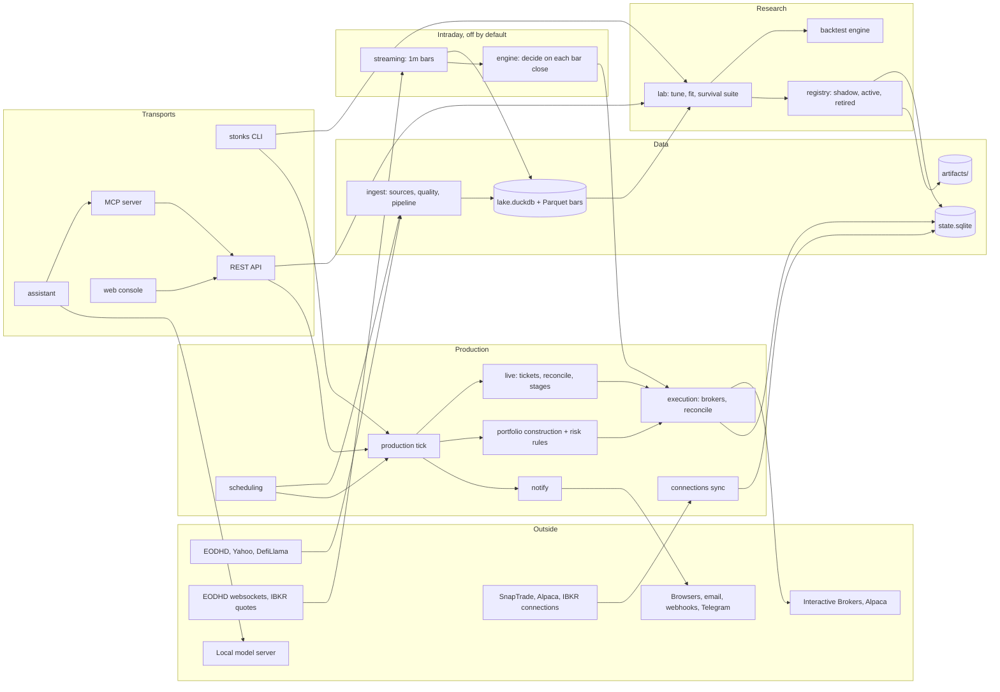
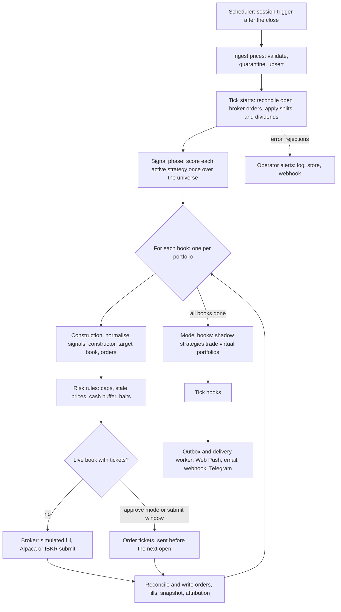
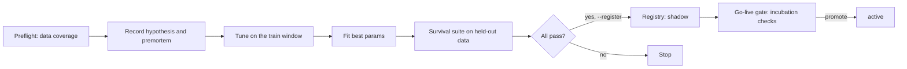
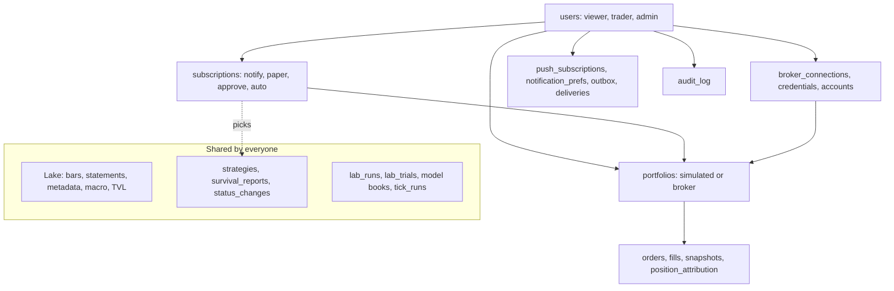

# Architecture

Stonks has four stages: ingest data, test strategies in the lab, keep the survivors in the registry, and run a daily tick that turns their signals into orders for each portfolio. The REST API, and through it the MCP server and web console, run on one service layer in `stonks.app`; business logic never lives in a transport.

## Overview

The CLI opens the stores itself and reuses the services for lab and registry work. The console and MCP always go through the API. The assistant calls the in-process MCP tools as the signed-in user. The intraday engine runs in its own process.

## Building blocks

| Package | Job |
|---|---|
| `core` | Types (`Bar`, `Order`, `Fill`, `Portfolio`), intervals, parameter specs, protocols, instruments, the `Clock` seam and stream events. No dependencies. |
| `ingest` | `DataSource` adapters (`eodhd`, `yahoo`, `defillama`), IBKR's short stock files (`ibkr_borrow`), bar quality checks and quarantine, idempotent upserts, on-demand fetching of missing bars (`ensure.py`). |
| `streaming` | Live quotes into 1-minute bars behind the `StreamingSource` seam (EODHD websockets, IBKR quotes, replay), recordings, reconnect and gap backfill. Off by default. See [intraday](design/intraday.md). |
| `engine` | The intraday event engine: event driver, decision step on each bar close, session rules, intraday router, crash recovery, monitoring. Its own process, off by default. |
| `auth` | Sign-in, sessions, TOTP 2FA, recovery codes, API tokens and role permissions (`stonks users`). |
| `universes` | Stored universe definitions (list, exchange, rule, index) refreshed into point-in-time membership. See [universes](universes.md). |
| `screener` | Screens on price and fundamental metrics, point in time, behind a metric registry. A `rule` universe runs a screen at each rebalance. See [universes](universes.md#screener). |
| `calendars` | Earnings, dividend and economic calendars, the earnings check before the next open, and upcoming-event alerts. See [calendars](calendars.md). |
| `store` | `DuckDBLake` (market data) and `SqliteState` (everything that changes), migrations, the `BarStore` seam. |
| `features` | Optional indicator and scoring helpers that strategies call. |
| `factors` | Factor registry and library, an expression language compiled to DuckDB SQL, cached panels, tear sheets and model datasets. See [factors](factors.md). |
| `strategies` | `BaseStrategy`, 32 example strategies (three of them intraday), 6 wrappers, the rule-based Studio strategy. |
| `portfolio` | Constructors and optimisers that turn signals into a target book, covariance and factor risk models, and the shared construction pipeline. |
| `lab`, `stats` | Tuning (grid, random, Optuna), survival tests, trial ledger, parallel pool, parameter heatmaps, signal research, statistics. |
| `lifecycle` | Model versions: scheduled retraining into candidates and governed swaps. See [model lifecycle](model-lifecycle.md). |
| `backtest` | Engine, simulated broker, fills, costs, trade ledger, metrics, benchmark, corporate actions, the intraday backtest, cost calibration. |
| `registry` | Strategy status, artifacts on disk, the governance audit. |
| `production` | The tick, ranker, model books, risk rules, hooks, go-live gate, P&L, health, manual orders, and the live path (`live/`: tickets, submit window, reconcile checks, stages and gates, protective stops). |
| `execution` | Client ids, the simulated, Alpaca and IBKR brokers, reconciliation, drift, margin and borrow. |
| `accounts` | Users, roles, portfolios, subscriptions, ownership checks, audit log. |
| `connections`, `security` | Broker account sync and trading for auto books. Encrypted credentials. |
| `insights` | Allocation, exposure, P&L and risk of any portfolio you own, and which strategies agree with each holding. |
| `notify`, `telegram`, `price_alerts` | Operator alerts and per-user notifications (Web Push, email, webhook, Telegram), the Telegram bot, price alerts. |
| `assistant` | The in-app AI assistant on a local model, its safety gate and the AI research loop. |
| `fx`, `tax` | FX conversion over the lake's rates, and yearly tax exports. See [tax](tax.md). |
| `options` | Options research: pricing, chains, structures, strategies and risk. Off by default, never in the tick. See [options](design/options.md). |
| `scheduling`, `ops` | Built-in scheduler, metrics, dead-man checks; backup and restore. |
| `reporting` | Static HTML reports, tear sheets, factor tear sheets and factor attribution. |
| `app`, `api`, `mcp`, `web/` | Service layer, FastAPI server, MCP server, Angular console. |

## The seams

New behaviour plugs in behind a seam. Most are registries, so a new one is one new module.

| Seam | Where | Examples |
|---|---|---|
| `DataSource` | `ingest/sources/base.py` | eodhd, yahoo, defillama |
| `BarStore` | `store/bars.py` | DuckDB table, Parquet files |
| `UniverseProvider` | `universes/providers/` (registry) | list, exchange, rule, index |
| `IndexSource` | `universes/index_sources/` (registry) | wikipedia_sp500 |
| `Strategy` | `core/protocols.py`, `strategies/base.py` | 39 catalogued: 33 strategies and 6 wrappers |
| `Factor` | `factors/base.py`, `factors/library/` (registry) | alpha158, classic, fundamentals |
| `Tuner`, `Objective` | `lab/tuning/`, `lab/objectives.py` | Tuners grid, random, optuna. Objectives Sharpe, CAGR, final return, Sortino, Calmar, drawdown Sharpe, multi-metric, purged CV |
| `SurvivalTest` | `lab/survival/` (registry) | 23 tests, presets `quick`, `standard`, `promotion` |
| `Forecaster` | `features/forecasters/` (registry) | random_walk, drift, ets, theta, chronos_bolt, chronos_2, timesfm_2_5, kronos_small, kronos_mini ([forecasting](forecasting.md)) |
| `PortfolioConstructor` | `portfolio/base.py` (registry) | single_winner, equal_weight_top_n, inverse_vol, vol_target, atr_parity, hrp, erc, mean_variance_costs |
| `RiskRule` | `production/rules/` (registry) | caps, position risk, portfolio vol, style exposure, drawdown scaling, liquidity, sector cap, max holding, circuit breaker, short rules, account rules, live safeguards, protective stops, option limits, intraday rules |
| `PostTickHook`, `TradeGate` | `production/hooks/` (registry) | position attribution, notification enqueue, quit rule, TCA, risk monitor, halts gate, runaway guard |
| `Broker` | `core/protocols.py`, `execution/brokers/` | simulated, alpaca, ibkr |
| `BrokerConnection` | `connections/base.py` | alpaca, snaptrade, ibkr, fake |
| `StreamingSource` | `streaming/base.py`, `streaming/sources/` (registry) | eodhd_ws, ibkr, replay, lake_bars |
| `ScreenMetric` | `screener/metrics/` (registry) | price, returns, volatility, valuation, quality |
| Event alert kind | `calendars/alert_kinds/` (registry) | earnings, ex-dividend, economic release |
| `ChatModel` | `assistant/model.py` | OpenAI-compatible client (Ollama, vLLM, llama.cpp), scripted fake |
| Notification channel | `notify/channels.py` | webpush, email, webhook, telegram |
| `PricingModel` | `options/pricing/` (registry) | Black-Scholes, Black-76, American approximations (QuantLib) |
| Option structure | `options/structures/` (registry) | covered call, cash-secured put, verticals, iron condor |
| `AssignmentModel` | `options/assignment.py` | early assignment before dividends and deep in the money |

### One instrument model

Every tradable thing has one description in `core/instruments.py`: an `InstrumentSpec` with its symbol, asset class, kind (spot, option, future), currency, exchange, tick size, lot size, multiplier and, for derivatives, the underlying, expiry, strike and right. A stock is a spot spec with multiplier 1 and no expiry. Brokers keep their own keys in `broker_ids` (for example the IBKR contract id), so an adapter can cache lookups without leaking its types. `InstrumentBook` resolves any symbol to its spec. The option view (`core/options.py`: intrinsic value, OCC symbol, split adjustment) converts to and from a spec.

Multi-leg orders are explicit: a `ComboOrder` in `core/combos.py` is a parent order whose legs fill as one unit, all or none. The options backtest fills them from quotes, and a broker with combo orders (IBKR) can map the parent onto one native order.

## The daily loop

Key points:

- **One score per strategy.** The ranker scores each strategy once per tick. The same instance then decides for every book, so per-day state carries over.
- **Books.** `run_tick` loops over the books of a `TickPlan`, and each book soft-fails on its own. `load_tick_plan` builds one book per portfolio from its `paper`, `approve` and `auto` subscriptions (`[production] books_from_subscriptions = true`). `pf_default` follows every active strategy, because a promotion subscribes it.
- **Idempotent orders.** Client ids are `<as_of>:<strategy>:<ticker>:<side>` for `pf_default` and `<as_of>:<portfolio>:<strategy>:<ticker>:<side>` for others. A rerun for the same day skips orders already placed. At an external broker each order is written as `pending` before it is submitted.
- **Live books.** A book in `approve` mode, or any auto book with `[production.live] submit_in_window = true`, writes order tickets. The `live_submit` job sends the approved ones in a window before the open, after a reconcile check. See [operations](operations.md#live-trading).
- **Model books.** Shadow strategies run alone against virtual portfolios (`shadow_decisions`, `shadow_portfolio_snapshots`). They never touch real ledgers and are the evidence for promotion.
- **Hooks.** `portfolio` hooks run inside each book's transaction (position attribution, TCA, risk monitor). `tick` hooks run once at the end. `notification_enqueue` sends each notify subscription's signals through the notification router. A failing hook is logged and never loses the ledger.

## The intraday loop

Off by default (`[engine] enabled = false`). The engine runs in its own process between the `engine_start` and `engine_stop` jobs. A streaming source turns quotes into 1-minute bars. On each bar close the decision step builds orders per engine book through the same construction pipeline, and the intraday router sends day orders. Intraday P&L, the intraday risk rules and the `intraday_loss` halt run on the same bar closes. The intraday backtest runs the same driver and step on stored bars. See [intraday](design/intraday.md).

## Research flow

Every trial is written to `lab_runs` and `lab_trials`, so the deflated Sharpe and PBO know how many things were tried. Every status change writes a `status_changes` row. Promotion needs a passing go-live check or an override with a reason.

## Accounts and data ownership

Market facts and the strategy catalog are shared. Money, people and delivery belong to someone.

- **Global:** the whole lake; `strategies`, `survival_reports`, `status_changes`, `lab_runs`, `lab_trials`, model books, `tick_runs`. `jobs` and `strategy_drafts` are global but carry an `owner_id`.
- **User:** `users`, `broker_connections`, `broker_credentials`, `push_subscriptions`, notification preferences and settings, outbox rows, `alerts.user_id`.
- **Portfolio:** `portfolios`, `subscriptions`, `orders`, `fills`, `portfolio_snapshots`, `position_attribution`, `broker_positions`, `broker_activities`.
- **Modes:** `notify` sends signals only, `paper` trades a simulated portfolio, `approve` decides and waits for a person to approve each order, `auto` trades a broker portfolio. Auto needs 20 completed paper days first. The tick trades one book per portfolio from these subscriptions.
- **Live stages:** a broker portfolio moves from `sim_paper` to `broker_paper`, `live_small` and `live_scale` only through a gate report or a logged override. See [live trading](design/live-trading.md).
- **Enforcement:** `accounts/scope.py` checks ownership and answers "not found" for other users' rows. Portfolio and subscription risk settings can only tighten the global policy.

Sign-in lives in `auth/`: passwords, sessions, mandatory TOTP 2FA with recovery codes, API tokens and the viewer, trader and admin roles (state migration 015, `stonks users`). Every API route checks a permission. `STONKS_API_TOKEN` is kept only as a legacy credential. See [security.md](security.md). Full design: [design/accounts-and-modes.md](design/accounts-and-modes.md).

## Stores and processes

| Store | File | Holds |
|---|---|---|
| Lake | `data/lake.duckdb` (+ `data/bars/` in Parquet mode) | Market data, quality quarantine, ingest runs. |
| State | `data/state.sqlite` (WAL) | Registry, ledgers, jobs, accounts, scheduler, notifications, connections. |
| Artifacts | `data/artifacts/<id>/` | `meta.json`, `params.json`, survival reports, fitted state. |

DuckDB allows one writer per file. While `stonks serve` runs, the scheduler (`api` backend) and MCP go through the API. `STONKS_DATA_DIR` moves all three stores.

## Bar store: DuckDB table or Parquet

The lake reads and writes bars through the `BarStore` seam (`store/bars.py`):

- `DuckDBTableBarStore`: the `bars` table in the lake file. The default and what tests use.
- `ParquetBarStore`: files at `<lake dir>/bars/interval=<code>/ticker=<id>/year=<yyyy>/part-0.parquet`. Many processes can read while one writes. Path values are percent-encoded (`ES=F` becomes `ticker=ES%3DF`).

The `DuckDBLake` API is the same either way. On a Parquet lake the connection gets a temporary `bars` view over the files, so existing SQL keeps working. A process that cannot open the lake file can read bars with `open_bar_reader(<lake dir>/bars)`.

Writes stay safe: each upsert rewrites a partition to a temp file and swaps it in with `os.replace`; each `(interval, ticker)` has an OS lock under `bars/_locks/`; on Windows the swap retries for up to 60 s while a reader holds the file. The lake records its store in `lake_settings`, so every process agrees.

Switch: set `[lake.bars] backend = "parquet"`, stop `stonks serve`, run `uv run python -m stonks.store.bars_migrate`. It copies every series, checks row counts and checksums, and only then switches. `--to duckdb` switches back.

## Cross-cutting rules

- **Config:** `config/default.toml`, overridden by environment variables. Secrets only in the environment.
- **Logging:** structlog JSON with `run_id` / `tick_id`.
- **Soft fails:** a bad ticker, book, hook or channel is logged and skipped; the run records it.
- **Idempotency:** upserts by primary key, orders by `client_id`, scheduled runs by `(job, run key)`, notifications by dedupe key.
- **Testing:** TDD, hermetic by default, live tests behind `STONKS_RUN_LIVE_TESTS=1`.

## More

- [Operations](operations.md), [deploy](deploy.md), [capacity](capacity.md), [runbooks](runbooks/)
- [Principles](principles.md), [strategies](strategies/README.md), [web console](ui.md), [universes and on-demand data](universes.md), [calendars and news](calendars.md), [factors](factors.md), [model lifecycle](model-lifecycle.md), [tax](tax.md), [security](security.md)
- Designs: [accounts and modes](design/accounts-and-modes.md), [live trading](design/live-trading.md), [intraday](design/intraday.md), [short selling](design/shorting.md), [options](design/options.md)
- Block notes (history and details): [ingestion](blocks/01_ingestion.md), [storage](blocks/02_storage.md), [lab](blocks/03_strategy_lab.md), [registry](blocks/04_strategy_store.md), [tick](blocks/05_production_tick.md)
