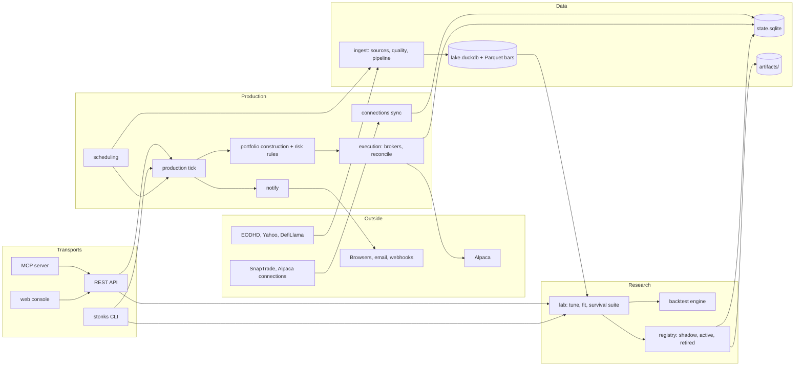
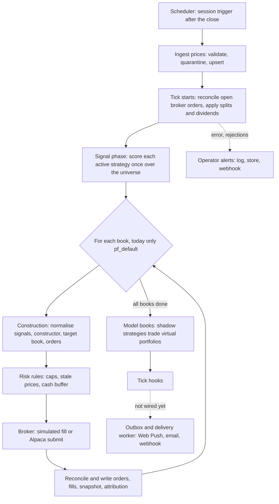
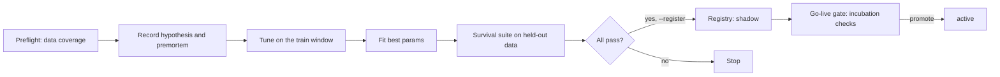
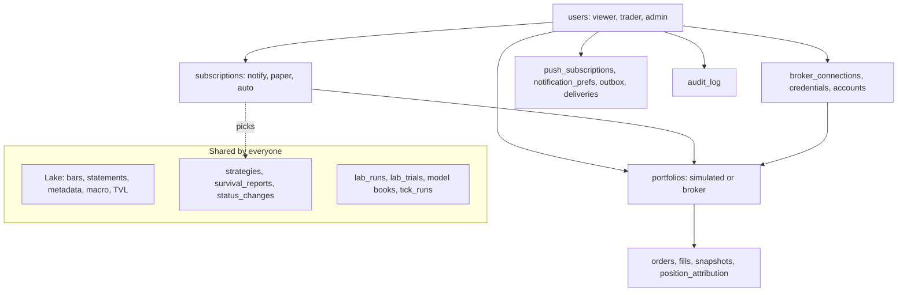

# Architecture

Stonks has four stages: ingest data, test strategies in the lab, keep the survivors in the registry, and run a daily tick that turns their signals into orders for each portfolio. The REST API, and through it the MCP server and web console, run on one service layer in `stonks.app`; business logic never lives in a transport.

## Overview

The CLI opens the stores itself and reuses the services for lab and registry work. The console and MCP always go through the API.

## Building blocks

| Package | Job |
|---|---|
| `core` | Types (`Bar`, `Order`, `Fill`, `Portfolio`), intervals, parameter specs, protocols. No dependencies. |
| `ingest` | `DataSource` adapters (`eodhd`, `yahoo`, `defillama`), bar quality checks and quarantine, idempotent upserts, on-demand fetching of missing bars (`ensure.py`). |
| `auth` | Sign-in, sessions, TOTP 2FA, recovery codes, API tokens and role permissions (`stonks users`). |
| `universes` | Stored universe definitions (list, exchange, rule, index) refreshed into point-in-time membership. See [universes](universes.md). |
| `screener` | Screens on price and fundamental metrics, point in time, behind a metric registry. A `rule` universe runs a screen at each rebalance. See [universes](universes.md#screener). |
| `calendars` | Earnings, dividend and economic calendars, the earnings check before the next open, and upcoming-event alerts. See [calendars](calendars.md). |
| `store` | `DuckDBLake` (market data) and `SqliteState` (everything that changes), migrations, the `BarStore` seam. |
| `features` | Optional indicator and scoring helpers that strategies call. |
| `factors` | Factor registry and library, an expression language compiled to DuckDB SQL, cached panels, tear sheets and model datasets. See [factors](factors.md). |
| `strategies` | `BaseStrategy`, 26 example strategies, wrappers, the rule-based Studio strategy. |
| `portfolio` | Constructors that turn signals into a target book, and the shared construction pipeline. |
| `lab`, `stats` | Tuning, survival tests, trial ledger, parallel pool, signal research, statistics. |
| `backtest` | Engine, simulated broker, fills, costs, trade ledger, metrics, benchmark, corporate actions. |
| `registry` | Strategy status, artifacts on disk, the governance audit. |
| `production` | The tick, ranker, model books, risk rules, hooks, go-live gate, P&L, health. |
| `execution` | Client ids, the simulated and Alpaca brokers, reconciliation. |
| `accounts` | Users, roles, portfolios, subscriptions, ownership checks, audit log. |
| `connections`, `security` | Read-only broker account sync; encrypted credentials. |
| `notify` | Operator alerts and per-user notifications (Web Push, email, webhook). |
| `scheduling`, `ops` | Built-in scheduler, metrics, dead-man checks; backup and restore. |
| `reporting` | Static HTML reports and tear sheets. |
| `app`, `api`, `mcp`, `web/` | Service layer, FastAPI server, MCP server, Angular console. |

## The seams

New behaviour plugs in behind a seam. Most are registries, so a new one is one new module.

| Seam | Where | Examples |
|---|---|---|
| `DataSource` | `ingest/sources/base.py` | eodhd, yahoo, defillama |
| `BarStore` | `store/bars.py` | DuckDB table, Parquet files |
| `UniverseProvider` | `universes/providers/` (registry) | list, exchange, rule, index |
| `IndexSource` | `universes/index_sources/` (registry) | wikipedia_sp500 |
| `Strategy` | `core/protocols.py`, `strategies/base.py` | 34 catalogued strategies |
| `Factor` | `factors/base.py`, `factors/library/` (registry) | alpha158, classic, fundamentals |
| `Tuner`, `Objective` | `lab/tuning/`, `lab/objectives.py` | grid, random; Sharpe, CAGR, final return |
| `SurvivalTest` | `lab/survival/` (registry) | 18 tests, presets `quick`, `standard`, `promotion` |
| `PortfolioConstructor` | `portfolio/base.py` (registry) | single_winner, equal_weight_top_n, inverse_vol, vol_target, atr_parity |
| `RiskRule` | `production/rules/` (registry) | caps, position risk, portfolio vol, drawdown scaling, liquidity, sector cap, max holding |
| `PostTickHook`, `TradeGate` | `production/hooks/` (registry) | position attribution, notification enqueue |
| `Broker` | `core/protocols.py`, `execution/brokers/` | simulated, alpaca |
| `BrokerConnection` | `connections/base.py` | alpaca, snaptrade, fake |
| Notification channel | `notify/channels.py` | webpush, email, webhook |
| `PricingModel` | `options/pricing/` (registry) | Black-Scholes, Black-76, American approximations (QuantLib) |
| Option structure | `options/structures/` (registry) | covered call, cash-secured put, verticals, iron condor |
| `AssignmentModel` | `options/assignment.py` | early assignment before dividends and deep in the money |

### One instrument model

Every tradable thing has one description in `core/instruments.py`: an `InstrumentSpec` with its symbol, asset class, kind (spot, option, future), currency, exchange, tick size, lot size, multiplier and, for derivatives, the underlying, expiry, strike and right. A stock is a spot spec with multiplier 1 and no expiry. Brokers keep their own keys in `broker_ids` (for example the IBKR contract id), so an adapter can cache lookups without leaking its types. `InstrumentBook` resolves any symbol to its spec. The option view (`core/options.py`: intrinsic value, OCC symbol, split adjustment) converts to and from a spec.

Multi-leg orders are explicit: a `ComboOrder` in `core/combos.py` is a parent order whose legs fill as one unit, all or none. The options backtest fills them from quotes, and a broker with combo orders (IBKR) can map the parent onto one native order.

## The daily loop

Key points:

- **One score per strategy.** The ranker scores each strategy once per tick. The same instance then decides for every book, so per-day state carries over.
- **Books.** `run_tick` loops over the books of a `TickPlan`, and each book soft-fails on its own. Today every entrypoint runs the default plan: one book, `pf_default` (owned by `usr_owner`), over every active strategy. `load_tick_plan`, which builds a book per portfolio from its `paper` and `auto` subscriptions, exists but is not wired in yet.
- **Idempotent orders.** Client ids are `<as_of>:<strategy>:<ticker>:<side>` for `pf_default` and `<as_of>:<portfolio>:<strategy>:<ticker>:<side>` for others. A rerun for the same day skips orders already placed. With Alpaca, each order is written as `pending` before it is submitted.
- **Model books.** Shadow strategies run alone against virtual portfolios (`shadow_decisions`, `shadow_portfolio_snapshots`). They never touch real ledgers and are the evidence for promotion.
- **Hooks.** `portfolio` hooks run inside each book's transaction (position attribution). `tick` hooks run once at the end. The `notification_enqueue` hook only logs for now; the tick does not fill the notification outbox yet. A failing hook is logged and never loses the ledger.

## Research flow

Every trial is written to `lab_runs` and `lab_trials`, so the deflated Sharpe and PBO know how many things were tried. Every status change writes a `status_changes` row. Promotion needs a passing go-live check or an override with a reason.

## Accounts and data ownership

Market facts and the strategy catalog are shared. Money, people and delivery belong to someone.

- **Global:** the whole lake; `strategies`, `survival_reports`, `status_changes`, `lab_runs`, `lab_trials`, model books, `tick_runs`. `jobs` and `strategy_drafts` are global but carry an `owner_id`.
- **User:** `users`, `broker_connections`, `broker_credentials`, `push_subscriptions`, notification preferences and settings, outbox rows, `alerts.user_id`.
- **Portfolio:** `portfolios`, `subscriptions`, `orders`, `fills`, `portfolio_snapshots`, `position_attribution`, `broker_positions`, `broker_activities`.
- **Modes:** `notify` sends signals only, `paper` trades a simulated portfolio, `auto` trades a broker portfolio. Auto needs 20 completed paper days first. Subscriptions are stored, but the tick does not read them yet (it trades `pf_default` over every active strategy).
- **Enforcement:** `accounts/scope.py` checks ownership and answers "not found" for other users' rows. Portfolio and subscription risk settings can only tighten the global policy.

Sign-in lives in `auth/`: passwords, sessions, mandatory TOTP 2FA with recovery codes, API tokens and the viewer, trader and admin roles (state migration 015, `stonks users`). Every API route checks a permission. `STONKS_API_TOKEN` is kept only as a legacy credential. See [security.md](security.md). Full design: [design/accounts-and-modes.md](design/accounts-and-modes.md).

## Stores and processes

| Store | File | Holds |
|---|---|---|
| Lake | `data/lake.duckdb` (+ `data/bars/` in Parquet mode) | Market data, quality quarantine, ingest runs. |
| State | `data/state.sqlite` (WAL) | Registry, ledgers, jobs, accounts, scheduler, notifications, connections. |
| Artifacts | `data/artifacts/<id>/` | `meta.json`, `params.json`, survival reports, fitted state. |

DuckDB allows one writer per file. While `stonks serve` runs, the scheduler (`api` backend) and MCP go through the API. `STONKS_DATA_DIR` moves all three stores.

## Bar store: DuckDB table or Parquet

The lake reads and writes bars through the `BarStore` seam (`store/bars.py`):

- `DuckDBTableBarStore`: the `bars` table in the lake file. The default and what tests use.
- `ParquetBarStore`: files at `<lake dir>/bars/interval=<code>/ticker=<id>/year=<yyyy>/part-0.parquet`. Many processes can read while one writes. Path values are percent-encoded (`ES=F` becomes `ticker=ES%3DF`).

The `DuckDBLake` API is the same either way. On a Parquet lake the connection gets a temporary `bars` view over the files, so existing SQL keeps working. A process that cannot open the lake file can read bars with `open_bar_reader(<lake dir>/bars)`.

Writes stay safe: each upsert rewrites a partition to a temp file and swaps it in with `os.replace`; each `(interval, ticker)` has an OS lock under `bars/_locks/`; on Windows the swap retries for up to 60 s while a reader holds the file. The lake records its store in `lake_settings`, so every process agrees.

Switch: set `[lake.bars] backend = "parquet"`, stop `stonks serve`, run `uv run python -m stonks.store.bars_migrate`. It copies every series, checks row counts and checksums, and only then switches. `--to duckdb` switches back.

## Cross-cutting rules

- **Config:** `config/default.toml`, overridden by environment variables. Secrets only in the environment.
- **Logging:** structlog JSON with `run_id` / `tick_id`.
- **Soft fails:** a bad ticker, book, hook or channel is logged and skipped; the run records it.
- **Idempotency:** upserts by primary key, orders by `client_id`, scheduled runs by `(job, run key)`, notifications by dedupe key.
- **Testing:** TDD, hermetic by default, live tests behind `STONKS_RUN_LIVE_TESTS=1`.

## More

- [Operations](operations.md), [deploy](deploy.md), [capacity](capacity.md), [runbooks](runbooks/)
- [Principles](principles.md), [strategies](strategies/README.md), [web console](ui.md), [universes and on-demand data](universes.md), [calendars and news](calendars.md)
- Block notes (history and details): [ingestion](blocks/01_ingestion.md), [storage](blocks/02_storage.md), [lab](blocks/03_strategy_lab.md), [registry](blocks/04_strategy_store.md), [tick](blocks/05_production_tick.md)
