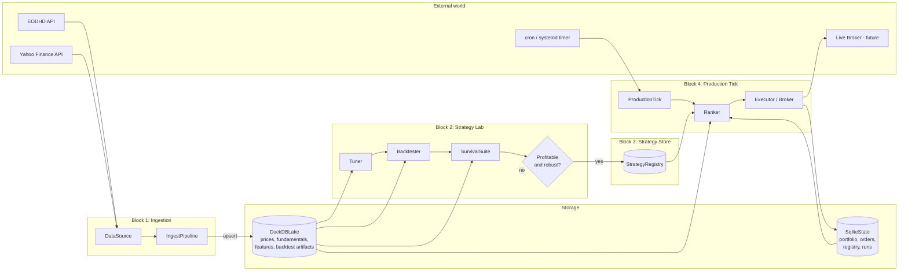
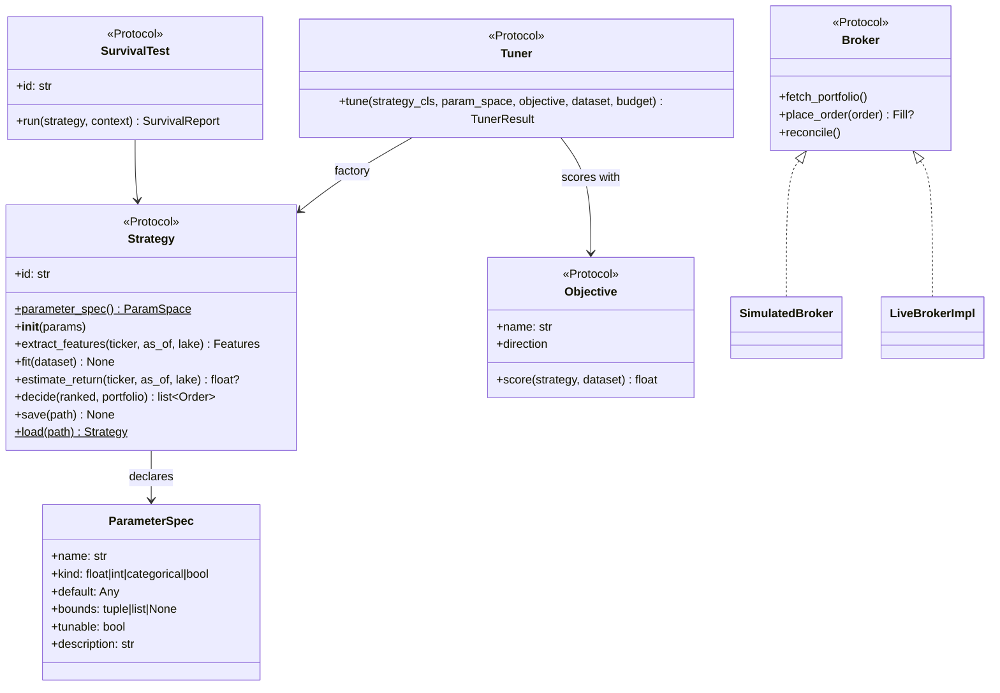

# Stonks — Architecture Overview

End-to-end equity research + trading system. Four blocks: Ingestion → Strategy Lab → Strategy Store → Production Tick. Everything behind the store is strategy-agnostic; the strategy owns its own feature extraction and parameter descriptions.

## Fixed design decisions

| Axis | Decision |
|---|---|
| Execution target | Live trading eventually; broker seam abstract from day one; orders idempotent via `client_id`. |
| Universe size | 5k+ tickers. |
| Analytical store | DuckDB (single file `data/lake.duckdb`). |
| Transactional state | SQLite (single file `data/state.sqlite`). |
| Scheduling | External (cron / systemd timer). Each production tick is a fresh Python process. |
| Strategy shape | Protocol. Rule-based, technical, aggregator, ML, hybrid all satisfy it. `fit()` is optional. |
| Feature extraction | Lives *inside* each strategy. No shared feature-pipeline layer. |
| Parameter handling | Strategies declare `ParameterSpec` list; tuner reads only that. |
| Survival tests | Composable protocol; suite runs all four (OOS, period stability, perturbation, drift). |
| Language / tooling | Python 3.12+, uv, ruff, pytest, structlog, pydantic-settings, typer. |

## Top-level diagram



## Interface seams



## Repository layout

```
Stonks/
├── pyproject.toml
├── README.md
├── CLAUDE.md
├── .env.example
├── .gitignore
├── config/default.toml
├── data/                       # gitignored
├── scripts/                    # operational runners (post-MVP)
├── docs/
│   ├── architecture.md
│   └── blocks/
│       ├── 01_ingestion.md
│       ├── 02_storage.md
│       ├── 03_strategy_lab.md
│       ├── 04_strategy_store.md
│       └── 05_production_tick.md
├── src/stonks/
│   ├── config.py  logging.py  cli.py
│   ├── core/       params.py    # + types.py protocols.py (post-MVP)
│   ├── ingest/     sources/{base,eodhd,yahoo}.py  name_mapper.py  schemas.py  pipeline.py
│   ├── store/      lake.py      # + state.py (post-MVP)
│   ├── features/   library.py                     (post-MVP)
│   ├── strategies/                                (post-MVP)
│   ├── lab/                                       (post-MVP)
│   ├── registry/                                  (post-MVP)
│   ├── backtest/                                  (post-MVP)
│   ├── execution/                                 (post-MVP)
│   └── production/                                (post-MVP)
└── tests/          unit/  integration/  fixtures/
```

## Cross-cutting concerns

- **Config.** `pydantic-settings` layered over env + `config/default.toml`. Singleton via `load_settings()`. Secrets never in TOML; only in `.env` / env vars.
- **Logging.** `structlog` JSON. Every block emits structured events with `run_id`, `block`, `strategy_id` (where applicable) so logs are correlatable across a production tick.
- **Error handling philosophy.** Per-ticker soft-fail during ingestion and ranking (log + continue). Hard-fail on store corruption or broker reconcile mismatch.
- **Testing.** No live API calls in default `pytest`. `STONKS_RUN_LIVE_TESTS=1` + a real API key enables a small contract-test suite.
- **Idempotency.** Ingestion upserts are idempotent (PK + `ON CONFLICT`). Orders carry a `client_id`. Production ticks are safe to re-run for the same date.

## Per-block documents

- [Block 1 — Ingestion](blocks/01_ingestion.md) (implemented in MVP)
- [Block 2 — Storage](blocks/02_storage.md) (lake half implemented in MVP)
- [Block 3 — Strategy Lab](blocks/03_strategy_lab.md)
- [Block 4 — Strategy Store](blocks/04_strategy_store.md)
- [Block 5 — Production Tick](blocks/05_production_tick.md)
