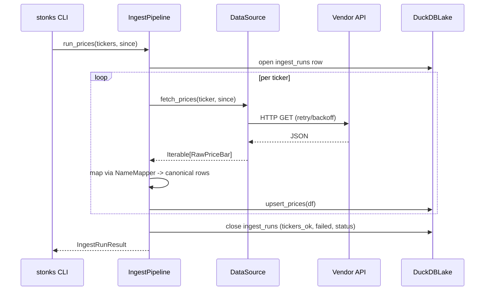

# Block 1 — Ingestion (APIs → Lake)

## Purpose

Pull prices and fundamentals from one or more vendor APIs and upsert them into the canonical DuckDB lake. The block has no knowledge of strategies, backtests, or production.

## Module layout

```
src/stonks/ingest/
├── sources/
│   ├── base.py          # DataSource ABC
│   ├── eodhd.py         # EodhdDataSource + pure response parsers
│   └── yahoo.py         # YahooDataSource (post-MVP)
├── name_mapper.py       # vendor → canonical key renamer
├── schemas.py           # canonical pydantic row models
└── pipeline.py          # IngestPipeline orchestration
```

## `DataSource` contract

```python
class DataSource(ABC):
    source_id: str
    @abstractmethod
    def list_tickers(self, exchange: str) -> list[str]: ...
    @abstractmethod
    def fetch_prices(self, ticker: str, since: date | None = None,
                     until: date | None = None) -> Iterable[RawPriceBar]: ...
    @abstractmethod
    def fetch_fundamentals(self, ticker: str) -> Iterable[FundamentalRow]: ...

    # Everything-else surface: dividends, insider trades, news + sentiment,
    # analyst estimates + ratings, shares outstanding, employees, revenue
    # and geographic segmentations, static profile. Default returns an empty
    # bundle so subclasses only populate what they cover.
    def fetch_metadata(self, ticker: str) -> MetadataBundle:
        return MetadataBundle()
```

- Thin HTTP client. No transformation beyond parsing JSON into typed rows.
- API key, base URL, rate limits injected via constructor (fed by `Settings`).
- Per-request retry with exponential backoff.
- Per-ticker soft-fail: exceptions are caught at the pipeline boundary, logged with `ticker` + `source_id`, and accounted for in `ingest_runs.tickers_failed`.

## `IngestPipeline`

```python
class IngestPipeline:
    def __init__(self, source: DataSource, lake: DuckDBLake): ...
    def run_prices(self, tickers: Sequence[str], since: date | None = None,
                   until: date | None = None) -> IngestRunResult: ...
    def run_fundamentals(self, tickers: Sequence[str]) -> IngestRunResult: ...
    def run_metadata(self, tickers: Sequence[str]) -> IngestRunResult: ...   # fetches MetadataBundle per ticker
```

- Opens an `ingest_runs` row at start, closes with status at end.
- Soft-fail semantics: `status="ok"` if all tickers succeeded, `"partial"` if some failed but at least one succeeded, `"error"` if none succeeded, `"ok"` for an empty batch.
- Pure upserts → idempotent across re-runs.

## Flow diagram



## EODHD specifics

- Free tier supports EOD prices only (≤ 1-year window). The fundamentals endpoint returns **HTTP 403** on the free tier; the client maps that to `EodhdFreeTierError` (a clean domain error, no retry churn).
- Parsing is factored into pure functions (`parse_prices_response`, `parse_fundamentals_response`) so unit tests work from captured fixtures without ever touching the network.

## Adding a new data source

1. Create `sources/<vendor>.py` implementing `DataSource`.
2. Populate its name map (constants in the module).
3. Register it in the source factory used by the CLI.

No change required in `IngestPipeline`, the lake schema, or anything downstream.

## CLI

```
stonks ingest prices       [--exchange US | --tickers AAPL.US,MSFT.US | --asset-class crypto] [--since 2025-05-01]
stonks ingest fundamentals --tickers AAPL.US,MSFT.US
stonks ingest metadata     [--tickers AAPL.US | --asset-class crypto]
stonks ingest intraday     --tickers AAPL.US --interval 5m
```

## Multi-asset support

Assets fall into a closed set declared in `core.types.AssetClass`: `equity`, `crypto`, `commodity`, `bond`. Equity is the historical default and has the richest metadata surface (the three financial statements, dividends, insider trades, analyst data, ESG, …). Non-equity classes share the same `bars` time series and add a small per-class profile table (`crypto_profiles`, `bond_profiles` + `bond_yield_history`, `commodity_contracts`).

EODHD encodes the class in the ticker suffix:

| Asset class | EODHD virtual exchange | Example tickers |
|-------------|-----------------------|-----------------|
| equity      | many real exchanges (US, LSE, XETRA, …) | `AAPL.US`, `VOD.LSE` |
| crypto      | `CC`                                    | `BTC-USD.CC`, `ETH-USD.CC` |
| commodity   | `COMM`                                  | `GC.COMM`, `CL.COMM` |
| bond        | `GBOND`                                 | `US10Y.GBOND`, `DE10Y.GBOND` |

Adapter behaviour:

- `classify_asset_class(ticker)` is the single source of truth for routing; both the CLI and the EODHD adapter share it.
- `EodhdDataSource.fetch_fundamentals` short-circuits with an empty bundle for non-equity tickers (no issuer → no statements).
- `EodhdDataSource.fetch_metadata` routes non-equity tickers to a narrower path that only hits `/fundamentals` and populates the matching per-class profile (`crypto_profile` / `bond_profile` / `commodity_contract`); the equity-shaped fields stay at their defaults.

CLI ergonomics: every ingest command that takes a universe accepts `--asset-class` so an operator doesn't need to memorise EODHD's virtual-exchange codes.

```
stonks ingest prices --asset-class crypto                # auto-resolves to --exchange CC
stonks ingest prices --asset-class bond                  # auto-resolves to --exchange GBOND
stonks ingest prices --tickers BTC-USD.CC,ETH-USD.CC --asset-class crypto   # validates
stonks ingest metadata --asset-class commodity           # full profile pull for COMM universe
```

Equity has no single virtual exchange, so `--asset-class equity` requires `--exchange` or `--tickers` to be passed explicitly. Mixing classes under one `--asset-class` flag (e.g. `--asset-class crypto --tickers BTC-USD.CC,AAPL.US`) fails fast with the offending ticker named.

## Testing

- `tests/unit/test_name_mapper.py` — key renaming.
- `tests/unit/test_ingest_schemas.py` — canonical pydantic models.
- `tests/unit/test_eodhd_parsing.py` — pure parsers + HTTP 403 → `EodhdFreeTierError` (uses a fake `requests.Session`).
- `tests/integration/test_ingest_pipeline.py` — `FakeDataSource` drives happy path, soft-fail, all-fail, idempotency, empty-batch.
- `tests/integration/test_cli.py` — Typer CliRunner smoke tests for `stonks db init`, `stonks db info`, `stonks ingest prices`.
- `tests/integration/live/test_eodhd_live.py` — real EODHD call for AAPL.US, gated by `STONKS_RUN_LIVE_TESTS=1` + `EODHD_API_KEY`.

## Milestones

- **MVP (done):** EODHD source (prices + fundamentals code-path), pipeline, CLI, tests.
- **Next:** Yahoo source; bulk endpoints where vendors support them; exchange-level discovery via `list_tickers`.
