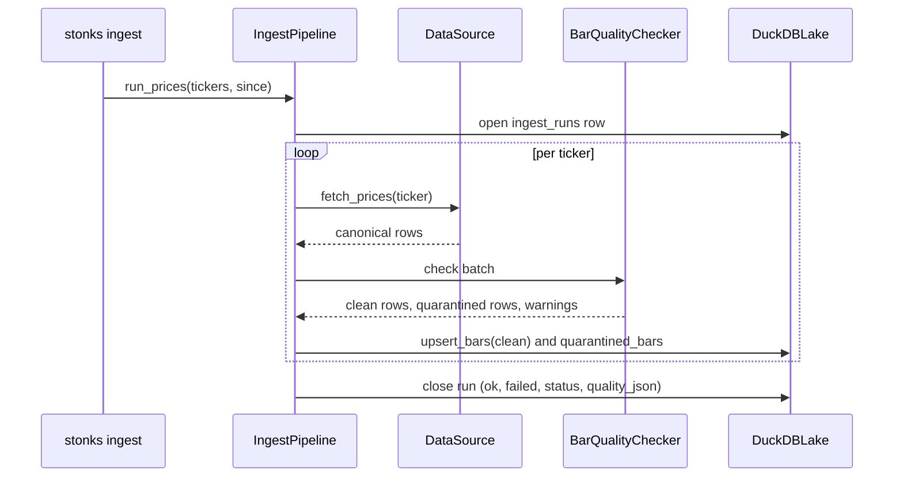

# Block 1: Ingestion (APIs to lake)

## Purpose

Pull market data from vendor APIs and upsert it into the DuckDB lake. The block knows nothing about strategies, backtests or trading.

## Module layout

```
src/stonks/ingest/
├── sources/
│   ├── base.py          # DataSource ABC and DataSourceError
│   ├── registry.py      # source id -> configured DataSource (--source)
│   ├── eodhd.py         # EODHD: prices, intraday, statements, metadata, macro, exchanges
│   ├── yahoo.py         # Yahoo Finance (wraps yfinance): prices, intraday, basic profiles
│   └── defillama.py     # DefiLlama: DeFi TVL per chain (no key)
├── pipeline.py          # IngestPipeline: fetch, validate, upsert, record the run
├── quality.py           # BarQualityChecker: quarantine bad bars, warn on odd ones
├── quality_config.py    # DataQualityConfig and fallback settings
├── metadata_bundle.py   # MetadataBundle returned by fetch_metadata
├── name_mapper.py       # vendor key -> canonical column renamer
├── redact.py            # keeps API keys out of logged errors
└── schemas.py           # canonical pydantic row models
```

## `DataSource` contract

Three methods are required. The rest are optional and default to "nothing" (or, for TVL, an `UnsupportedCapabilityError` that the pipeline counts as a soft fail).

```python
class DataSource(ABC):
    source_id: str                                   # "eodhd", "yahoo", "defillama"
    def list_tickers(self, exchange: str) -> list[str]: ...                  # required
    def fetch_prices(self, ticker, since=None, until=None) -> Iterable[RawPriceBar]: ...   # required
    def fetch_fundamentals(self, ticker) -> FinancialStatementsBundle: ...   # required
    def fetch_metadata(self, ticker) -> MetadataBundle: ...                   # optional
    def fetch_intraday_bars(self, ticker, interval, since=None, until=None): ...  # optional
    def list_exchanges(self) -> Iterable[ExchangeInfo]: ...                   # optional
    def fetch_macro_indicator(self, country_iso, indicator): ...             # optional
    def fetch_chain_tvl(self, chain, since=None) -> Iterable[DefiTvlRow]: ... # optional
```

- A source is a thin client. It parses vendor JSON into canonical rows and maps vendor names to domain names. Vendor types never leave the module.
- Keys, URLs, timeouts and retries come from `[sources.<id>]` in the config. Keys come from the environment only (`EODHD_API_KEY`).
- Each request retries with backoff.

## `IngestPipeline`

```python
pipe = IngestPipeline(source, lake, quality=None, fallback=None, notifier=None)
pipe.run_prices(tickers, since, until)
pipe.run_intraday_bars(tickers, interval, since, until)
pipe.run_fundamentals(tickers)
pipe.run_metadata(tickers)
pipe.run_macro_indicators(...)
pipe.run_defi_tvl(...)
```

- Every run opens an `ingest_runs` row and closes it with `tickers_ok`, `tickers_failed` and a status: `ok` (all passed, or an empty batch), `partial` (some failed), `error` (all failed).
- A failing ticker is logged and counted. It never stops the run.
- Writes are upserts, so a rerun is safe.
- Bar runs validate every batch before it reaches the bar store (see [Data quality](#data-quality)) and store a summary in `ingest_runs.quality_json`.
- With a `fallback` source, a ticker whose primary fetch soft-fails is retried once on the fallback. The CLI does not pass a fallback yet.



## Data quality

`BarQualityChecker` runs on every `ingest prices` and `ingest intraday` batch.

- Rows that cannot be right (missing or non-positive prices, high below low, close outside the range, duplicate timestamps, one-bar spikes that revert) go to `quarantined_bars`, not `bars`.
- Findings that can be real (large moves that stick, stale or flat series, zero-volume streaks) are warnings only.
- The thresholds are the `DataQualityConfig` defaults. The `[ingest.quality]` table is not read from the config file yet.

Details and triage: [runbooks/data-stale.md](../runbooks/data-stale.md).

## Sources

| Source | Serves | Key |
|--------|--------|-----|
| `eodhd` (default) | Daily and intraday bars, statements, metadata, macro, exchange lists | `EODHD_API_KEY` |
| `yahoo` | Daily and intraday bars, basic profiles. Equities and crypto only. | none |
| `defillama` | DeFi TVL per chain | none |

EODHD free tier: daily prices only, one year back. Paid endpoints return HTTP 403, which the client raises as `EodhdFreeTierError` (no retries).

Add a source: write `sources/<vendor>.py`, add a factory to `_FACTORIES` in `sources/registry.py` and a `[sources.<id>]` config model. Nothing else changes.

## CLI

Every command below except `aggregate` takes `--source eodhd|yahoo|defillama` (default `eodhd`; `tvl` defaults to `defillama`).

```bash
uv run stonks ingest exchanges
uv run stonks ingest prices --tickers AAPL.US,MSFT.US --since 2025-05-01 [--until ...]
uv run stonks ingest prices --exchange US
uv run stonks ingest prices --asset-class crypto
uv run stonks ingest fundamentals --tickers AAPL.US
uv run stonks ingest metadata --tickers AAPL.US
uv run stonks ingest intraday --tickers AAPL.US --interval 5m --since 2026-09-01
uv run stonks ingest macro --countries USA,DEU --indicators real_gdp_total
uv run stonks ingest tvl --chains ethereum,solana --since 2025-01-01
uv run stonks ingest aggregate --tickers AAPL.US --from 1d --to 1w
uv run stonks ingest all-intervals --tickers AAPL.US --since 2025-01-01
```

`aggregate` builds a coarser interval from bars already in the lake. `all-intervals` pulls daily and intraday bars and builds the usual aggregates in one go.

## Asset classes

The closed set is `equity`, `crypto`, `commodity`, `bond` (`core.types.AssetClass`). EODHD puts the class in the ticker suffix:

| Asset class | Suffix | Example |
|-------------|--------|---------|
| equity | a real exchange (`US`, `LSE`, `XETRA`, ...) | `AAPL.US` |
| crypto | `CC` | `BTC-USD.CC` |
| commodity | `COMM` | `GC.COMM` |
| bond | `GBOND` | `US10Y.GBOND` |

- `classify_asset_class(ticker)` is the one place that decides the class.
- `--asset-class crypto` resolves to `--exchange CC` (and so on). `equity` has no single exchange, so it needs `--exchange` or `--tickers`.
- Mixing classes under one `--asset-class` fails fast and names the ticker.
- `ingest fundamentals` rejects non-equity tickers: statements are equity-only.
- For non-equity tickers, `fetch_metadata` fills the class profile table (`crypto_profiles`, `bond_profiles`, `commodity_contracts`).

## Testing

Pipeline tests use `FakeDataSource` (canned data) and never touch the network. Vendor parsers are tested on captured fixtures. Live contract tests live in `tests/integration/live/` behind `@pytest.mark.live` and `STONKS_RUN_LIVE_TESTS=1`.
