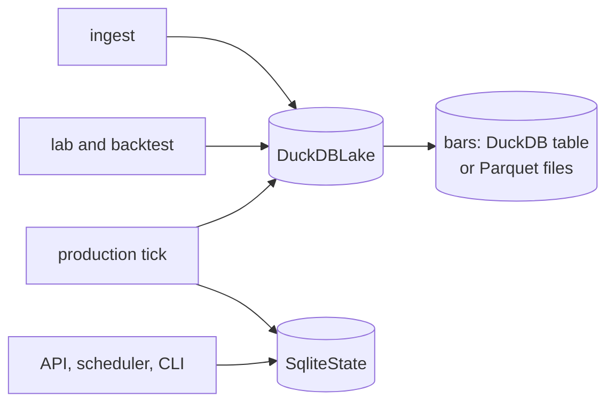

# Block 2: Storage (DuckDB lake and SQLite state)

## Purpose

Two separate stores, each behind a small class:

- **`DuckDBLake`** (`data/lake.duckdb`): market data. Bars, statements, metadata, macro, TVL. Large, columnar, read by backtests and the lab.
- **`SqliteState`** (`data/state.sqlite`): everything that changes as Stonks runs. Strategies, survival reports, ticks, orders, fills, snapshots, jobs, alerts, accounts, scheduler, notifications, broker connections.

Neither needs a server. The column lists of every table are in `CLAUDE.md` under "Canonical schemas" and in the migration files themselves.



## `DuckDBLake`

```python
lake = DuckDBLake(Path("data/lake.duckdb"), read_only=False)
lake.migrate()
lake.upsert_bars(df, Interval.DAY_1)
lake.get_bars(ticker, interval, start, end)
lake.aggregate_bars(...)                      # build 1w from 1d, 4h from 1h, ...
lake.delete_bars(ticker, interval, stamps)    # drop bars (a stored spike)
lake.upsert_prices(df) / lake.get_prices(...) # daily shims over bars
lake.get_statement_history(...)               # point in time, by filing_date
lake.get_corporate_actions(tickers)           # splits and dividends
lake.sql("SELECT ...")                        # escape hatch
```

- Every write is an idempotent upsert.
- Statement upserts use `COALESCE(EXCLUDED.col, table.col)`, so a NULL never wipes a stored value but a real restated value overwrites it.
- `read_only=True` opens an existing file without the write lock (lab workers use this on snapshot copies).
- DuckDB allows one writing process per file. While `stonks serve` runs, it holds the lake.

### Bar store

Bars live behind the `BarStore` seam (`store/bars.py`):

| Backend | Where | Use when |
|---------|-------|----------|
| `duckdb` (default) | the `bars` table in the lake file | one process at a time |
| `parquet` | `<lake dir>/bars/interval=<code>/ticker=<id>/year=<yyyy>/part-0.parquet` | other processes must read bars while `stonks serve` holds the lake |

The lake remembers its choice in the `lake_settings` table (key `bars_backend`), so every process agrees. Switch with:

```bash
uv run python -m stonks.store.bars_migrate --to parquet   # stop stonks serve first
```

The copy is checked per ticker and interval (row count and checksum) before the lake switches.

- Aggregated bars keep the adjustment: a weekly bar's `adj_close` is the last daily `adj_close` of the week, not its raw close.
- A reader (`open_bar_reader`) opened on an empty store writes the empty sentinel file first, so it sees bars written later. Only on a read-only disk does its view stay empty.
- Date windows end at 23:59:59.999999, so a bar in the last second of a day counts in that day.

## Lake migrations (`store/migrations_duckdb/`)

| # | Adds |
|---|------|
| 001 | `tickers`, `prices`, `fundamentals`, `ingest_runs` |
| 002 | profile columns on `tickers`; `dividends`, `insider_transactions`, `news`, `news_sentiment`, `analyst_estimates`, `analyst_ratings`, `shares_outstanding`, `employee_count`, `segmentation` |
| 003 | interval-aware `bars` (PK `ticker, timestamp, interval`); `prices` becomes a view over `interval = '1d'` |
| 004 | `stock_splits`, `market_cap_history` |
| 005 | identifiers and GICS columns on `tickers` (drops six old ones); `ticker_snapshots`, `institutional_holders`, `earnings_announcements`, `analyst_forecasts`, `esg_snapshots`, `esg_activities`, `cross_listings`, `officers` |
| 006 | full article columns on `news` |
| 007 | `tickers` renamed `instruments`, `asset_class`; `crypto_profiles`, `bond_profiles`, `bond_yield_history`, `commodity_contracts` |
| 008 | `fundamentals` replaced by `income_statement`, `balance_sheet`, `cash_flow_statement` |
| 009 | `macro_indicators` |
| 010 | `insider_transactions` rebuilt with a natural key |
| 011 | `defi_tvl` |
| 012 | `lake_settings` |
| 013 | `quarantined_bars`; `ingest_runs.quality_json` |
| 014 | `statement_flags` (statement audit, BL-36) |
| 015 | `universe_membership` (point-in-time universes, BL-37) |

### Statement audit and universe membership

`store/audit.py` runs accounting checks over the three statements in SQL. It flags a period when assets do not match liabilities plus equity, net income or cash differ between statements, gross profit does not match revenue minus cost of revenue, four quarters do not add up to the year, the filing date comes before the period end, or shares are negative. Flags land in `statement_flags`. The audit replaces the flags of the tickers it checks, so running it twice gives the same result. Statement rows are never changed. Readers skip error-flagged periods with `get_statements_as_of(..., exclude_flagged=True)`.

`universe_membership` records which tickers were in a named universe and when. `end_date` is the first day a ticker is out, and an open span has no `end_date`. Delisted names keep their rows. Read it with `members_as_of(universe_id, date)` and `members_between(universe_id, start, end)`.

`stonks db init` refuses a migration that would drop populated data (005 on an old lake) unless `STONKS_ALLOW_DESTRUCTIVE_MIGRATIONS=1`. Back up first.

## `SqliteState`

Deliberately thin: connection, migrations, introspection, `execute`, `sql` and `transaction()`. Domain helpers belong to the block that owns each table (registry, production, accounts, scheduling, notify, connections).

- Opens with `PRAGMA journal_mode=WAL` (several processes can share it) and `PRAGMA foreign_keys=ON`.
- `transaction()` is an explicit `BEGIN` / `COMMIT` / `ROLLBACK`.

## State migrations (`store/migrations_sqlite/`)

| # | Adds |
|---|------|
| 001 | `strategies`, `survival_reports`, `tick_runs`, `orders`, `fills`, `portfolio_snapshots` |
| 002 | `shadow_decisions`, `shadow_portfolio_snapshots` |
| 003 | `jobs` (API background jobs) |
| 004 | `portfolio_snapshots.as_of` |
| 005 | `strategy_drafts` (Strategy Studio) |
| 006 | `orders.status_reason` |
| 007 | `alerts` |
| 008 | `lab_runs`, `lab_trials` (trial ledger) |
| 009 | `status_changes` (promotion audit) |
| 010 | `users`, `portfolios`, `subscriptions`, `audit_log`; `portfolio_id` on orders, fills and snapshots; owners on jobs and drafts; user columns on alerts |
| 011 | `scheduled_runs`, `scheduler_instances`, `scheduler_deadline_alerts` |
| 012 | `notification_outbox`, `notification_deliveries`, `push_subscriptions`, `notification_prefs`, `notification_settings` |
| 013 | `broker_connections`, `broker_credentials`, `broker_accounts`, `broker_positions`, `broker_activities`; `portfolio_snapshots.source` |
| 014 | `position_attribution` |

## Migration rules

- Files apply in lexical order. Each store tracks them in `schema_migrations`.
- Never edit an applied migration. Add a new one.
- SQLite migrations must be idempotent per statement (`IF NOT EXISTS`), because `executescript` commits each statement. DuckDB migrations run in one transaction.
- `uv run stonks db init` migrates both stores. `uv run stonks db info` lists tables and row counts.

## Backups

`python -m stonks.ops backup` copies both stores, the Parquet bars and the artifacts consistently. See [runbooks/restore.md](../runbooks/restore.md).
