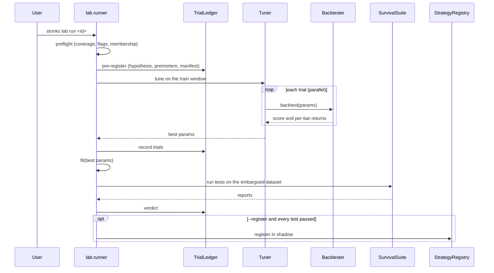

# Block 3: Strategy lab

## Purpose

Turn a strategy class into a tuned, fitted instance that has survived a suite of tests, and only then register it. Every part is strategy-agnostic: a new strategy needs no change to the tuners, objectives or survival tests, and a new test needs no change to any strategy.

The rules behind the tests are in [principles.md](../principles.md). The list of strategies is in [strategies/README.md](../strategies/README.md).

## Module layout

```
src/stonks/lab/
├── runner.py        # preflight, pre-register, tune, fit, survival suite, verdict
├── preflight.py     # data checks before a run (BL-37)
├── universe.py      # point-in-time universes: id, list or rule (BL-37)
├── catalog.py       # every strategy `stonks lab run` can name
├── dataset.py       # LabDataset: train / validation windows, embargo
├── objectives.py    # sharpe, cagr, final_return
├── tuning/          # grid.py, random.py, tune_and_fit in base.py
├── trials.py        # trial ledger: lab_runs, lab_trials
├── manifest.py      # reproducibility manifest (git sha, config hash, data fingerprint)
├── parallel.py      # the one spawn process pool (tuning, sweeps, reruns)
├── lake_copy.py     # read-only snapshot lakes for workers
├── backtesting.py   # backtest helpers shared by the lab and the API
├── signal_eval.py   # IC analysis of a strategy's scores
└── survival/        # one module per survival test + registry.py
src/stonks/backtest/ # engine, simulated broker, fills, costs, trades, metrics, benchmark
src/stonks/stats/    # PSR, deflated Sharpe, MinTRL, bootstrap, HAC, CSCV/PBO, FDR
```

## The `Strategy` protocol

```python
class Strategy(Protocol):
    id: str
    @classmethod
    def parameter_spec(cls) -> ParamSpace: ...
    def __init__(self, params: Params) -> None: ...
    def extract_features(self, ticker, as_of, lake) -> Features: ...
    def fit(self, dataset) -> None: ...                       # optional
    def estimate_return(self, ticker, as_of, lake) -> float | None: ...
    def decide(self, my_picks, portfolio, prices, as_of) -> list[Order]: ...
    def save(self, path: Path) -> None: ...
    @classmethod
    def load(cls, path: Path) -> Strategy: ...
```

- `BaseStrategy` gives defaults: no features, no-op `fit`, and `save` / `load` of `params.json` and `meta.json`.
- `ParameterSpec(tunable=False)` marks params the tuner must leave alone.
- Feature knobs (lookbacks, smoothing) are normal parameters, so tuning covers them.
- Strategies also declare `applicable_asset_classes` and metadata (hypothesis, family, label horizon, required history).
- A strategy that reads a ticker it does not trade (a reference market, an index filter, a regime condition) names it in `data_tickers()`. Wrappers add their inner strategy's data tickers, label horizon and required history to their own.

## Tuners and objectives

- Tuners: `grid` and `random` (`--tuner`). A tuner reads only the `ParamSpace`.
- Objectives: `sharpe` (default), `cagr`, `final_return` (`--objective`).
- Trials run in parallel on `[lab.parallel] max_workers` processes (0 = every core). Results do not depend on the worker count.
- Worker snapshots and the permuted, perturbed and noise lakes of the survival tests copy every ticker a run reads: the universe, `LabDataset.reference_tickers` (filled from the strategy's `data_tickers()`) and the benchmark ticker. See `lab.dataset.data_tickers`. References are permuted together with the universe.

## Survival tests

A test is one module in `lab/survival/` with an `id` and a `run` method; `survival/registry.py` finds it. There are 18:

| Id | Checks |
|----|--------|
| `oos` | Out-of-sample result on the validation window (PSR gate, minimum trades) |
| `period_stability` | Works in each sub-period, not one lucky stretch |
| `perturbation` | Holds up when prices and parameters get small noise |
| `drift` | Feature distributions did not shift (PSI) |
| `walk_forward` | Rolling tune and test windows, walk-forward efficiency |
| `deflated_sharpe` | Sharpe still significant after counting every trial |
| `pbo` | Probability of backtest overfitting (CSCV) |
| `mc_trades` | Monte Carlo over the trade sequence |
| `cost_stress` | Survives doubled costs and a speed limit |
| `plateau` | Neighbouring parameters score nearly as well |
| `cross_instrument` | Works on other instruments too |
| `benchmark_relative` | Beats the benchmark after beta |
| `mcpt` | Real score beats scores on shuffled bars |
| `walk_forward_mcpt` | Permutation test inside walk-forward |
| `runs_test` | Wins and losses do not cluster abnormally |
| `signal_ic` | Scores rank future returns (informational) |
| `event_study` | Entries beat baseline drift |
| `vs_random` | Beats random entries with the same exposure |

Presets (`--preset`):

| Preset | Tests |
|--------|-------|
| `quick` (default; `--register` defaults to `promotion`) | `oos`, `period_stability` |
| `standard` | `quick` plus `perturbation`, `walk_forward`, `deflated_sharpe`, `cost_stress` |
| `promotion` | `oos`, `walk_forward`, `deflated_sharpe`, `pbo`, `mc_trades`, `cost_stress`, `plateau`, `cross_instrument`, `benchmark_relative`, `mcpt` (200 permutations) |

`--tests a,b,c` picks tests by id instead. `--test-option` passes options to one test.

No evidence is never a pass:

- An empty suite fails.
- `benchmark_relative`, `runs_test`, `cross_instrument`, `vs_random`, `walk_forward`, `walk_forward_mcpt` and `mcpt` fail with "insufficient data" when they have no trades, too few bars, too few tickers or runs, or no finite score.
- `benchmark_relative` needs at least one trade, 20 bars and some tracking error.
- `cross_instrument` fails with fewer than `min_tickers` names. The promotion preset adds 3 held-out tickers from the lake.
- `vs_random` needs at least half of its noise runs, and never fewer than 5.
- `event_study` counts only entries with a forward return at the holding horizon.

Other rules:

- `perturbation` compares per-bar returns, not equity levels. The level correlation is still reported.
- `drift` ignores NaN feature values and reports their share as `nan_share`.
- IC standard errors keep gaps in the date calendar.
- The suite runs `walk_forward` first, so `mc_trades` always scores the stitched trades. Reports keep the order you asked for.
- The trial matrix is indexed by date.

## Run sequence



```bash
uv run stonks lab run momentum --tickers AAPL.US,MSFT.US --start 2023-01-01 --end 2025-01-01 \
  --preset promotion --hypothesis "winners keep winning for months" --register
uv run stonks lab sweep --start 2023-01-01 --end 2025-01-01 --csv-out sweep.csv
```

`lab sweep` runs every catalogued strategy (or `--strategies`) over one basket and summarises the verdicts.

### Preflight and universes

Before tuning, the runner checks the data (`lab/preflight.py`). An empty universe, or no bars at all in the window, stops the run with a clear message. Everything else is a warning: missing tickers, data that starts late, too little history for the strategy's `required_history_bars`, quarantined bars, audit flags, a static ticker list (survivorship bias, P14), members of the named universe missing from the dataset, a long window with no delisted name, zero costs, a benchmark with no bars, a reference ticker the strategy reads with no bars (`missing_reference_data`), and tickers that are never members of the named universe in the window (`not_members`, they never trade). Warnings go to the log and to the run manifest. `LabRunner(strict_preflight=True)` turns them into errors, and `preflight=False` turns the check off. A preflight that crashes never blocks a run.

`lab/universe.py` resolves a universe on a date. It takes a universe id (rows in `universe_membership`), a static list, or a rule with `min_adv`, `asset_classes` and `exclude_sectors`. A rule includes a delisted name up to its delisting date. `resolve_window` gives every name that was in the universe at any point in a window.

## Backtester

- Interval-aware: `BacktestConfig.interval` is any `Interval`; `rebalance_every_bars` counts bars.
- Orders decided on bar t fill at the next bar's open. Equity is marked at each close, carried forward for tickers with no bar.
- With a `universe_id` (`BacktestConfig.universe_id`, passed through from the lab dataset) a name is traded only on days it is a member of that universe. Buys of other names are dropped and a holding that leaves is sold (P14).
- `SimulatedBroker` uses the same `Broker` protocol as production. Its `FillModel` caps participation, fills limit and stop orders from the bar range and guards gaps. The gap limit is never shorter than two bars, so weekly and monthly runs fill. Its `CostModel` charges per-asset-class spread, fees and impact (`[backtest.costs]`, realistic by default). I-Star annualises volatility with the bars per year of the interval on each asset class's calendar. Lagged ADV and volatility are split-adjusted.
- Splits and cash dividends are applied on their ex-dates.
- When a construction method is configured, the engine runs the same construction pipeline as the tick (`portfolio/pipeline.py`). Its daily history is rebased to the raw close of each decision's last bar, so a split after the decision never changes risk sizing. Risk rules see each position's entry date, and a rule's date-keyed client id gets the bar time added.
- `BacktestReport` carries the trade ledger, Sharpe, Sortino, Calmar, drawdown and its duration, Ulcer index, VaR, ES, skew, kurtosis, turnover and costs, plus benchmark alpha and beta. The ledger pools lots per ticker: a sell closes its own strategy's lots first, then any other lot, so an owner change or a risk-rule exit never leaves a lot open.
- Intraday Sharpe counts whole bars per session: a 6.5 hour session has 7 hourly bars and 2 four-hour bars.
- `equal_weight_top_n` and `inverse_vol` rank their signals, so every positive pick can be held. `vol_target` sizes only names with a positive forecast.

## Signal research

`lab/signal_eval.py` treats `estimate_return` as a signal and measures its rank IC against forward returns over several horizons. `--events` adds the event study.

```bash
uv run python -m stonks.lab.signal_eval --strategy momentum --tickers AAPL.US,MSFT.US --events --html signal.html
```
