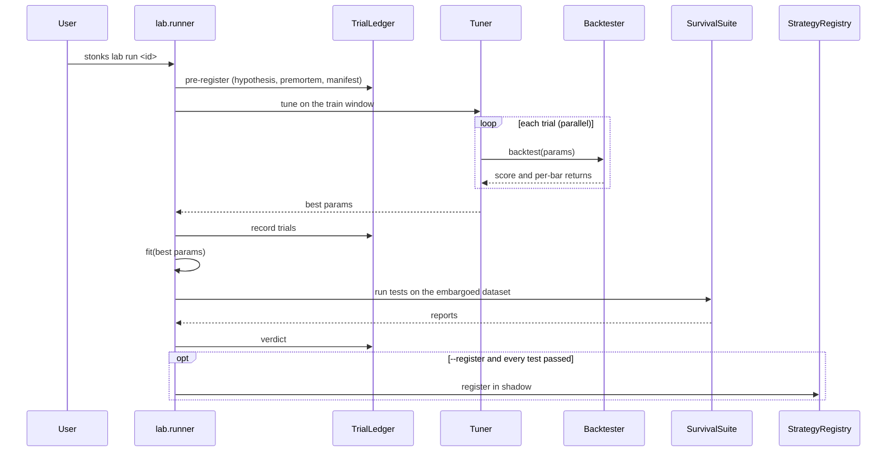

# Block 3: Strategy lab

## Purpose

Turn a strategy class into a tuned, fitted instance that has survived a suite of tests, and only then register it. Every part is strategy-agnostic: a new strategy needs no change to the tuners, objectives or survival tests, and a new test needs no change to any strategy.

The rules behind the tests are in [principles.md](../principles.md). The list of strategies is in [strategies/README.md](../strategies/README.md).

## Module layout

```
src/stonks/lab/
├── runner.py        # pre-register, tune, fit, survival suite, verdict
├── catalog.py       # every strategy `stonks lab run` can name
├── dataset.py       # LabDataset: train / validation windows, embargo
├── objectives.py    # sharpe, cagr, final_return
├── tuning/          # grid.py, random.py, tune_and_fit in base.py
├── trials.py        # trial ledger: lab_runs, lab_trials
├── manifest.py      # reproducibility manifest (git sha, config hash, data fingerprint)
├── parallel.py      # the one spawn process pool (tuning, sweeps, reruns)
├── lake_copy.py     # read-only snapshot lakes for workers
├── backtesting.py   # backtest helpers shared by the lab and the API
├── signal_eval.py   # IC analysis of a strategy's scores
└── survival/        # one module per survival test + registry.py
src/stonks/backtest/ # engine, simulated broker, fills, costs, trades, metrics, benchmark
src/stonks/stats/    # PSR, deflated Sharpe, MinTRL, bootstrap, HAC, CSCV/PBO, FDR
```

## The `Strategy` protocol

```python
class Strategy(Protocol):
    id: str
    @classmethod
    def parameter_spec(cls) -> ParamSpace: ...
    def __init__(self, params: Params) -> None: ...
    def extract_features(self, ticker, as_of, lake) -> Features: ...
    def fit(self, dataset) -> None: ...                       # optional
    def estimate_return(self, ticker, as_of, lake) -> float | None: ...
    def decide(self, my_picks, portfolio, prices, as_of) -> list[Order]: ...
    def save(self, path: Path) -> None: ...
    @classmethod
    def load(cls, path: Path) -> Strategy: ...
```

- `BaseStrategy` gives defaults: no features, no-op `fit`, and `save` / `load` of `params.json` and `meta.json`.
- `ParameterSpec(tunable=False)` marks params the tuner must leave alone.
- Feature knobs (lookbacks, smoothing) are normal parameters, so tuning covers them.
- Strategies also declare `applicable_asset_classes` and metadata (hypothesis, family, label horizon, required history).

## Tuners and objectives

- Tuners: `grid` and `random` (`--tuner`). A tuner reads only the `ParamSpace`.
- Objectives: `sharpe` (default), `cagr`, `final_return` (`--objective`).
- Trials run in parallel on `[lab.parallel] max_workers` processes (0 = every core). Results do not depend on the worker count.

## Survival tests

A test is one module in `lab/survival/` with an `id` and a `run` method; `survival/registry.py` finds it. There are 18:

| Id | Checks |
|----|--------|
| `oos` | Out-of-sample result on the validation window (PSR gate, minimum trades) |
| `period_stability` | Works in each sub-period, not one lucky stretch |
| `perturbation` | Holds up when prices and parameters get small noise |
| `drift` | Feature distributions did not shift (PSI) |
| `walk_forward` | Rolling tune and test windows, walk-forward efficiency |
| `deflated_sharpe` | Sharpe still significant after counting every trial |
| `pbo` | Probability of backtest overfitting (CSCV) |
| `mc_trades` | Monte Carlo over the trade sequence |
| `cost_stress` | Survives doubled costs and a speed limit |
| `plateau` | Neighbouring parameters score nearly as well |
| `cross_instrument` | Works on other instruments too |
| `benchmark_relative` | Beats the benchmark after beta |
| `mcpt` | Real score beats scores on shuffled bars |
| `walk_forward_mcpt` | Permutation test inside walk-forward |
| `runs_test` | Wins and losses do not cluster abnormally |
| `signal_ic` | Scores rank future returns (informational) |
| `event_study` | Entries beat baseline drift |
| `vs_random` | Beats random entries with the same exposure |

Presets (`--preset`):

| Preset | Tests |
|--------|-------|
| `quick` (default; `--register` defaults to `promotion`) | `oos`, `period_stability` |
| `standard` | `quick` plus `perturbation`, `walk_forward`, `deflated_sharpe`, `cost_stress` |
| `promotion` | `oos`, `walk_forward`, `deflated_sharpe`, `pbo`, `mc_trades`, `cost_stress`, `plateau`, `cross_instrument`, `benchmark_relative`, `mcpt` (200 permutations) |

`--tests a,b,c` picks tests by id instead. `--test-option` passes options to one test.

## Run sequence



```bash
uv run stonks lab run momentum --tickers AAPL.US,MSFT.US --start 2023-01-01 --end 2025-01-01 \
  --preset promotion --hypothesis "winners keep winning for months" --register
uv run stonks lab sweep --start 2023-01-01 --end 2025-01-01 --csv-out sweep.csv
```

`lab sweep` runs every catalogued strategy (or `--strategies`) over one basket and summarises the verdicts.

## Backtester

- Interval-aware: `BacktestConfig.interval` is any `Interval`; `rebalance_every_bars` counts bars.
- Orders decided on bar t fill at the next bar's open. Equity is marked at each close, carried forward for tickers with no bar.
- `SimulatedBroker` uses the same `Broker` protocol as production. Its `FillModel` caps participation, fills limit and stop orders from the bar range and guards gaps. Its `CostModel` charges per-asset-class spread, fees and square-root impact (`[backtest.costs]`, realistic by default).
- Splits and cash dividends are applied on their ex-dates.
- When a construction method is configured, the engine runs the same construction pipeline as the tick (`portfolio/pipeline.py`).
- `BacktestReport` carries the trade ledger (FIFO round trips), Sharpe, Sortino, Calmar, drawdown and its duration, Ulcer index, VaR, ES, skew, kurtosis, turnover and costs, plus benchmark alpha and beta.

## Signal research

`lab/signal_eval.py` treats `estimate_return` as a signal and measures its rank IC against forward returns over several horizons. `--events` adds the event study.

```bash
uv run python -m stonks.lab.signal_eval --strategy momentum --tickers AAPL.US,MSFT.US --events --html signal.html
```
