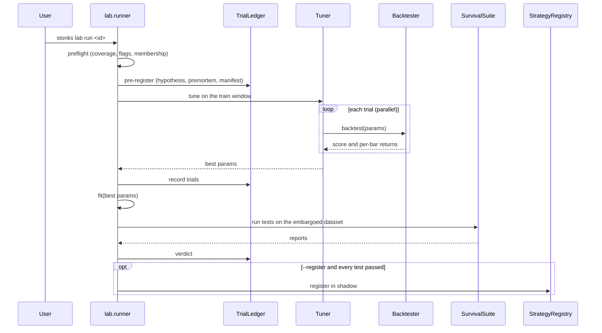

# Block 3: Strategy lab

## Purpose

Turn a strategy class into a tuned, fitted instance that has survived a suite of tests, and only then register it. Every part is strategy-agnostic: a new strategy needs no change to the tuners, objectives or survival tests, and a new test needs no change to any strategy.

The rules behind the tests are in [principles.md](../principles.md). The list of strategies is in [strategies/README.md](../strategies/README.md).

## Module layout

```
src/stonks/lab/
├── runner.py        # preflight, pre-register, tune, fit, survival suite, verdict
├── preflight.py     # data checks before a run (BL-37)
├── universe.py      # point-in-time universes: id, list or rule (BL-37)
├── catalog.py       # every strategy `stonks lab run` can name
├── dataset.py       # LabDataset: train / validation windows, embargo
├── objectives.py    # sharpe, cagr, final_return, sortino, calmar, sharpe_dd, multi
├── tuning/          # grid.py, random.py, optuna.py, tune_and_fit in base.py
├── heatmap.py       # 2D parameter sweeps around the tuned set
├── trials.py        # trial ledger: lab_runs, lab_trials
├── manifest.py      # reproducibility manifest (git sha, config hash, data fingerprint)
├── parallel.py      # the one spawn process pool (tuning, sweeps, reruns)
├── lake_copy.py     # read-only snapshot lakes for workers
├── backtesting.py   # backtest helpers shared by the lab and the API
├── signal_eval.py   # IC analysis of a strategy's scores
└── survival/        # one module per survival test + registry.py
src/stonks/backtest/ # engine, simulated broker, fills, costs, trades, metrics, benchmark
src/stonks/stats/    # PSR, deflated Sharpe, MinTRL, bootstrap, HAC, CSCV/PBO, FDR
```

## The `Strategy` protocol

```python
class Strategy(Protocol):
    id: str
    @classmethod
    def parameter_spec(cls) -> ParamSpace: ...
    def __init__(self, params: Params) -> None: ...
    def extract_features(self, ticker, as_of, lake) -> Features: ...
    def fit(self, dataset) -> None: ...                       # optional
    def estimate_return(self, ticker, as_of, lake) -> float | None: ...
    def decide(self, my_picks, portfolio, prices, as_of) -> list[Order]: ...
    def save(self, path: Path) -> None: ...
    @classmethod
    def load(cls, path: Path) -> Strategy: ...
```

- `BaseStrategy` gives defaults: no features, no-op `fit`, and `save` / `load` of `params.json` and `meta.json`.
- `ParameterSpec(tunable=False)` marks params the tuner must leave alone.
- Feature knobs (lookbacks, smoothing) are normal parameters, so tuning covers them.
- Strategies also declare `applicable_asset_classes` and metadata (hypothesis, family, label horizon, required history).
- A strategy sees a bar only after it closes. In an intraday run a daily bar stays hidden during its own session. The engine declares its bar length with `strategies._common.decision_interval`.
- `label_horizon_bars` and `required_history_bars` follow the params, so the embargo covers the horizon the tuner picked.
- `RegimeFilter` clamps `k` to its number of conditions. `ma_crossover` tunes `fast` from 2 to 25 and `slow` from 26 to 200, so every corner of a tunable space constructs.
- A strategy that reads a ticker it does not trade (a reference market, an index filter, a regime condition) names it in `data_tickers()`. Wrappers add their inner strategy's data tickers, label horizon and required history to their own.

## Tuners and objectives

- Tuners: `grid`, `random` and `optuna` (`--tuner`). A tuner reads only the `ParamSpace`.
- `optuna` is Bayesian search. Optuna stays inside `lab/tuning/optuna.py`, behind the `Tuner` seam. It asks for trials in fixed batches and our process pool runs them, so the result is the same for any worker count and the same seed gives the same trials.
- `--sampler` picks how optuna searches: `tpe` (default), `nsga2` (a Pareto search over the parts of the `multi` objective) or `random`.
- `--prune` lets optuna stop a trial early when its fast vectorised score trails the others. Only strategies with the fast path can be pruned. A pruned trial still counts in the trial ledger (P2).
- Objectives (`--objective`): `sharpe` (default), `cagr`, `final_return`, `sortino`, `calmar`, `sharpe_dd` (Sharpe less twice the max drawdown) and `multi` (Sharpe plus half the Calmar less the max drawdown). `cv_sharpe`, `cv_cagr` and `cv_final_return` score on purged folds.
- `lab.cv.CVObjective(inner, folds=5)` wraps any of them: it scores a strategy on purged folds of the train window, each fold fitted on the others, so a tuner stops picking on in-sample fit (BL-45). The `cv_*` objectives are this wrapper.
- Trials run in parallel on `[lab.parallel] max_workers` processes (0 = every core). Results do not depend on the worker count.
- Worker snapshots and the permuted, perturbed and noise lakes of the survival tests copy every ticker a run reads: the universe, `LabDataset.reference_tickers` (filled from the strategy's `data_tickers()`) and the benchmark ticker. See `lab.dataset.data_tickers`. References are permuted together with the universe.

### Fast path

A strategy can give `target_positions(closes, params)`: its target weights for every bar at once, with no look-ahead. `momentum`, `ma_crossover`, `donchian_breakout`, `ewmac_trend` and `tsmom` have it. The lab uses it to screen trials, to prune them and to fill heatmaps. Parity tests check it against the event engine.

### Parameter heatmaps

`--heatmap x,y` (or `--heatmap auto`) sweeps two parameters around the tuned set after tuning. The other parameters stay at their tuned values.

- `--heatmap-grid N` sets the points per axis (2 to 15, default 7). The tuned value is always on the axis.
- Cells use the fast path when the strategy has one. `--heatmap-full` scores them with full backtests instead.
- Every cell counts as a trial before the survival suite runs (P2). The winner is still the tuner's pick.
- The `plateau` test's verdict and its neighbourhood are drawn on the map.
- The map is in the run result, the JSON output, the artifact's `meta.json` and the strategy's tear sheet (`stonks report --backtest <id>`). The CLI prints it as a grid.
- The API and the MCP `run_lab` tool take it as `heatmap: {x, y, grid_size, fast}`.

```bash
uv run stonks lab run ma_crossover --tickers AAPL.US --start 2023-01-01 --end 2025-01-01 \
  --tuner optuna --objective calmar --prune --heatmap fast,slow --tests plateau
```

## Survival tests

A test is one module in `lab/survival/` with an `id` and a `run` method; `survival/registry.py` finds it. There are 23:

| Id | Checks |
|----|--------|
| `oos` | Out-of-sample result on the validation window (PSR gate, minimum trades) |
| `period_stability` | Works in each sub-period, not one lucky stretch |
| `perturbation` | Holds up when prices and parameters get small noise |
| `drift` | Feature distributions did not shift (PSI) |
| `walk_forward` | Rolling tune and test windows, walk-forward efficiency |
| `deflated_sharpe` | Sharpe still significant after counting every trial |
| `data_snooping` | The best trial beats cash after White's Reality Check, Hansen's SPA and Romano-Wolf over the trial family (roadmap 23.9) |
| `pbo` | Probability of backtest overfitting (CSCV) |
| `mc_trades` | Monte Carlo over the trade sequence |
| `cost_stress` | Survives doubled costs and a speed limit |
| `plateau` | Neighbouring parameters score nearly as well |
| `cross_instrument` | Works on other instruments too |
| `benchmark_relative` | Beats the benchmark after beta |
| `mcpt` | Real score beats scores on shuffled bars |
| `walk_forward_mcpt` | Permutation test inside walk-forward |
| `runs_test` | Wins and losses do not cluster abnormally |
| `signal_ic` | Scores rank future returns (informational) |
| `event_study` | Entries beat baseline drift |
| `vs_random` | Beats random entries with the same exposure |
| `cpcv` | Combinatorial purged CV: most backtest paths of models that never saw their data are positive (BL-45) |
| `crisis` | Drawdown in each named crisis window stays within 1.5x the benchmark's (BL-48) |
| `stress` | 5th-percentile Sharpe and 95th-percentile drawdown over 200 simulated validation windows (BL-48) |

Presets (`--preset`):

| Preset | Tests |
|--------|-------|
| `quick` (default; `--register` defaults to `promotion`) | `oos`, `period_stability` |
| `standard` | `quick` plus `perturbation`, `walk_forward`, `deflated_sharpe`, `cost_stress` |
| `promotion` | `oos`, `walk_forward`, `deflated_sharpe`, `pbo`, `mc_trades`, `cost_stress`, `plateau`, `cross_instrument`, `benchmark_relative`, `mcpt` (200 permutations), `event_study`, `vs_random`, `cpcv`, `crisis`, `data_snooping` |

`--tests a,b,c` picks tests by id instead. `--test-option` passes options to one test.

No evidence is never a pass:

- An empty suite fails.
- `benchmark_relative`, `runs_test`, `cross_instrument`, `vs_random`, `walk_forward`, `walk_forward_mcpt` and `mcpt` fail with "insufficient data" when they have no trades, too few bars, too few tickers or runs, or no finite score.
- `benchmark_relative` needs at least one trade, 20 bars and some tracking error.
- `cross_instrument` fails with fewer than `min_tickers` names. The promotion preset adds 3 held-out tickers from the lake.
- `vs_random` needs at least half of its noise runs, and never fewer than 5.
- `event_study` counts only entries with a forward return at the holding horizon.

Other rules:

- `perturbation` compares per-bar returns, not equity levels. The level correlation is still reported.
- `drift` ignores NaN feature values and reports their share as `nan_share`.
- IC standard errors keep gaps in the date calendar.
- The suite runs `walk_forward` first, so `mc_trades` always scores the stitched trades. Reports keep the order you asked for.
- The trial matrix is indexed by date.

### Data snooping (roadmap 23.9)

A search that tries many settings finds a good-looking one by luck. `deflated_sharpe` corrects the Sharpe ratio for the number of trials. `data_snooping` tests the trials directly, as a bootstrap over their per-bar returns (`stats/data_snooping.py`):

- White's Reality Check: can the best trial's mean return be luck, given every trial tried?
- Hansen's SPA: the same question, less hurt by bad trials that cannot win. The test passes when its p-value is at most `max_p` (0.05).
- Romano-Wolf step-down: which trials beat cash while the chance of any false find stays at `max_p`. The report says how many it rejects and whether the selected trial is one of them.

The trial family is the run's own trials plus every run of the same research family. Other runs' trials are lined up on the run's bars by date, and a missing bar counts as cash. The bootstrap is a stationary block bootstrap (mean block 10 bars) with a fixed seed. Fewer than `min_trials` usable trials fails for lack of data.

### Lab verify (roadmap 23.9)

`stonks lab verify [RUN_OR_STRATEGY ...]` reruns a stored lab result from its manifest and says whether it still holds (P2, P12):

1. It recomputes the data fingerprint over the same tickers, window and interval, and names the tickers whose bars, corporate actions or statement versions changed since. Restated statements are listed apart (`restated_tickers`).
2. It compares the config hash and the git sha with today's.
3. It rebuilds the chosen parameters on the run's dataset, scores them with the run's objective and seed, and compares with the stored score.

A result has moved when the score changed by more than `[lab.verify] tolerance`, or can no longer be scored. Changed data alone is reported, not judged: a restated revenue figure does not move a price-only strategy. The CLI exits 1 when a result moved.

The weekly `lab_verify` job (Sunday 07:00 UTC, all three scheduler backends) reruns every strategy of `[lab.verify] statuses` and sends one operator alert naming the ones that moved. REST: `POST /api/lab/verify` then `GET /api/lab/verify/jobs/{job_id}/result`. MCP: `verify_lab_results`.

```toml
[lab.verify]
tolerance = 0.05        # in the objective's units
statuses = ["active"]   # what the weekly job re-checks
```

### Purged CV, CPCV and labels (BL-45)

- `lab/cv.py` holds `PurgedKFold` and `CombinatorialPurgedKFold`. Both drop train samples whose labels overlap a test block (purge) and the samples right after it (embargo).
- With 6 groups and 2 test groups, CPCV makes 15 splits that chain into 5 full backtest paths.
- The `cpcv` test lays the groups over the whole dataset window. Each split is re-tuned (when the lab run bound a tuner) and fitted on its purged training segments, then backtested on its test groups. It passes when at least 60% of the path Sharpes are positive and the pooled PSR is at least 0.9. Every held-out day is in every path, so the pooled PSR is taken on the bar-by-bar mean of the paths, and each day counts once.
- A split's dataset carries its segments as `LabDataset.train_segments`. `train_windows` lists them. A strategy that reads only `train_window` gets the longest segment, so it never trains on a test block.
- `features/labels.py`: triple-barrier labels (EWMA volatility widths, high and low touches), label concurrency, average uniqueness and the sequential bootstrap.
- `features/ml.py`: `bet_size(p)` turns a probability into a size in 0.1 steps (0 at p = 0.5), `break_even_probability(tp, sl)` is `sl / (tp + sl)`, and `Classifier.fit` takes `sample_weight`.

### Crisis and stress (BL-48)

- `crisis` checks the GFC, the 2011 euro crisis, Q4 2018, COVID, 2022 H1 and the 2022 crypto collapse. Windows with no data are skipped and `crisis_coverage` reports the share covered. With no window covered the test passes with a note (P35 says "where data allows"). Set `require_coverage` to fail instead.
- `stress` simulates the validation window 200 times, by a stationary block bootstrap of whole bars (mean block 20) or by GARCH-t filtered historical simulation (`method="garch_fhs"`). Every ticker draws the same days, so correlations survive. It is not in a preset: it is slow, so ask for it with `--tests stress`.
- `features/vol_forecast.py` is the `VolForecaster` seam: `ewma`, `garch` (GARCH(1,1)-t, the `arch` library wrapped, only plain floats leave the fit) and `har_rv`.

## Run sequence



```bash
uv run stonks lab run momentum --tickers AAPL.US,MSFT.US --start 2023-01-01 --end 2025-01-01 \
  --preset promotion --hypothesis "winners keep winning for months" --register
uv run stonks lab sweep --start 2023-01-01 --end 2025-01-01 --csv-out sweep.csv
```

`lab sweep` runs every catalogued strategy (or `--strategies`) over one basket and summarises the verdicts.

### Preflight and universes

Before tuning, the runner checks the data (`lab/preflight.py`). An empty universe, or no bars at all in the window, stops the run with a clear message. Everything else is a warning: missing tickers, data that starts late, too little history for the strategy's `required_history_bars`, quarantined bars, audit flags, a static ticker list (survivorship bias, P14), members of the named universe missing from the dataset, a long window with no delisted name, zero costs, a benchmark with no bars, a reference ticker the strategy reads with no bars (`missing_reference_data`), and tickers that are never members of the named universe in the window (`not_members`, they never trade). Warnings go to the log and to the run manifest. `LabRunner(strict_preflight=True)` turns them into errors, and `preflight=False` turns the check off. A preflight that crashes never blocks a run.

`lab/universe.py` resolves a universe on a date. It takes a universe id (rows in `universe_membership`), a static list, or a rule with `min_adv`, `asset_classes` and `exclude_sectors`. A rule includes a delisted name up to its delisting date. `resolve_window` gives every name that was in the universe at any point in a window.

## Backtester

- Interval-aware: `BacktestConfig.interval` is any `Interval`; `rebalance_every_bars` counts bars.
- Orders decided on bar t fill at the next bar's open. Equity is marked at each close, carried forward for tickers with no bar.
- With a `universe_id` (`BacktestConfig.universe_id`, passed through from the lab dataset) a name is traded only on days it is a member of that universe. Buys of other names are dropped and a holding that leaves is sold (P14).
- `SimulatedBroker` uses the same `Broker` protocol as production. Its `FillModel` caps participation, fills limit and stop orders from the bar range and guards gaps. The gap limit is never shorter than two bars, so weekly and monthly runs fill. Its `CostModel` charges per-asset-class spread, fees and impact (`[backtest.costs]`, realistic by default). I-Star annualises volatility with the bars per year of the interval on each asset class's calendar. Lagged ADV and volatility are split-adjusted.
- Splits and cash dividends are applied on their ex-dates.
- When a construction method is configured, the engine runs the same construction pipeline as the tick (`portfolio/pipeline.py`). Its daily history is rebased to the raw close of each decision's last bar, so a split after the decision never changes risk sizing. Risk rules see each position's entry date, and a rule's date-keyed client id gets the bar time added.
- `BacktestReport` carries the trade ledger, Sharpe, Sortino, Calmar, drawdown and its duration, Ulcer index, VaR, ES, skew, kurtosis, turnover and costs, plus benchmark alpha and beta. The ledger pools lots per ticker: a sell closes its own strategy's lots first, then any other lot, so an owner change or a risk-rule exit never leaves a lot open.
- Intraday Sharpe counts whole bars per session: a 6.5 hour session has 7 hourly bars and 2 four-hour bars.
- `equal_weight_top_n` and `inverse_vol` rank their signals, so every positive pick can be held. In `vol_target` a name at forecast 0 keeps its instrument weight slice (Carver).

## Signal research

`lab/signal_eval.py` treats `estimate_return` as a signal and measures its rank IC against forward returns over several horizons. `--events` adds the event study.

```bash
uv run python -m stonks.lab.signal_eval --strategy momentum --tickers AAPL.US,MSFT.US --events --html signal.html
```
