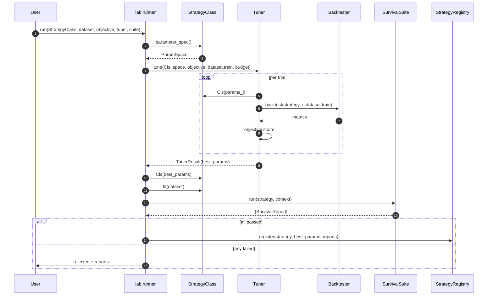

# Block 3 — Strategy Lab

> Status: **implemented** (Block 3a + Block 3b). Reference strategies: BuyAndHold (rule-based), Momentum (technical indicator), DonchianBreakout (channel breakout, inspired by neurotrader888/mcpt), RSIPCAStrategy (ML — PCA over many RSI periods + a linear predictor with quantile thresholds, inspired by neurotrader888/RSI-PCA). The `fit` → `save` → `load` lifecycle is exercised end-to-end by RSIPCAStrategy (fitted weights persist alongside params in the artifact bundle). Backtester is **interval-agnostic** — `BacktestConfig.interval` accepts any `Interval` (1m, 5m, 15m, 30m, 1h, 4h, 12h, 1d, 1w). Rebalance cadence is bar-counted (`rebalance_every_bars`), so the same config works identically at every interval.
>
> Survival tests now include **MonteCarloPermutationTest (MCPT)**: scores the strategy against the real bars and against N in-memory lakes filled with time-shuffled bars, deriving a p-value. The bar-permutation preserves per-bar return distribution but destroys time ordering — a proper null for any strategy that claims to exploit temporal structure (momentum, breakout, mean-reversion, …).

## Purpose

Turn a `Strategy` *class* into a fitted, survived strategy *instance* worth registering. All components are strategy-agnostic; a new strategy plugs in with zero changes to tuner, objectives, or survival tests.

## Module layout (target)

```
src/stonks/strategies/
├── base.py                        # BaseStrategy with default save/load/fit no-ops
└── examples/…                     # reference impls (buy_and_hold, value_screen, momentum, ensemble, linear_regressor)
src/stonks/features/
└── library.py                     # optional TTM, reindex_to_daily, pct_change_yoy helpers
src/stonks/lab/
├── dataset.py                     # LabDataset: train/val/test window resolver
├── objectives.py                  # SharpeObjective, CAGRObjective, RMSEObjective
├── tuning/
│   ├── base.py                    # Tuner Protocol, TunerResult, SearchSpace derivation
│   ├── grid.py
│   ├── random.py
│   └── optuna_tuner.py
├── survival/
│   ├── base.py                    # SurvivalTest Protocol, SurvivalReport, SurvivalSuite
│   ├── oos.py                     # OutOfSampleBacktest
│   ├── period_stability.py
│   ├── perturbation.py
│   └── drift.py                   # PSI/KS-based
└── runner.py                      # tune → fit → suite → register
src/stonks/backtest/
├── engine.py                      # date loop; talks to Broker Protocol
├── portfolio.py
├── simulated_broker.py
└── report.py                      # metrics: Sharpe, max_dd, CAGR, turnover
```

## `Strategy` Protocol

```python
class Strategy(Protocol):
    id: str

    @classmethod
    def parameter_spec(cls) -> ParamSpace: ...
    def __init__(self, params: Params) -> None: ...

    # feature extraction lives here
    def extract_features(self, ticker: str, as_of: date, lake: DuckDBLake) -> Features: ...

    def fit(self, dataset: LabDataset) -> None: ...          # optional; default = no-op

    def estimate_return(self, ticker: str, as_of: date, lake: DuckDBLake) -> float | None: ...
    def decide(self, ranked: list[tuple[float, "Strategy"]], portfolio: Portfolio) -> list[Order]: ...

    def save(self, path: Path) -> None: ...                  # default = write params.json only
    @classmethod
    def load(cls, path: Path) -> "Strategy": ...
```

- `ParameterSpec.tunable=False` marks params the tuner must leave alone (data paths, universe filters).
- Feature-construction knobs (lookback window, smoothing) are normal `ParameterSpec` entries, so tuning optimizes them alongside decision knobs.

## `Tuner` + `Objective`

```python
class Objective(Protocol):
    name: str
    direction: Literal["maximize", "minimize"]
    def score(self, strategy: Strategy, dataset: LabDataset) -> float: ...

class Tuner(Protocol):
    def tune(self, strategy_cls: type[Strategy], param_space: ParamSpace,
             objective: Objective, dataset: LabDataset, budget: int) -> TunerResult: ...
```

- Tuner reads `param_space` and nothing else about the strategy.
- Implementations: `GridTuner`, `RandomTuner`, `OptunaTuner`. Adding a `BayesianTuner` is a single-file addition.

## Survival tests

```python
class SurvivalTest(Protocol):
    id: str
    def run(self, strategy: Strategy, context: LabContext) -> SurvivalReport: ...

@dataclass
class SurvivalReport:
    test_id: str
    passed: bool
    metrics: dict[str, float]
    notes: str = ""

class SurvivalSuite:
    def __init__(self, tests: list[SurvivalTest]): ...
    def run(self, strategy: Strategy, context: LabContext) -> list[SurvivalReport]: ...
```

| Test | What it checks | Pass criterion (configurable) |
|---|---|---|
| `oos` | Performance on held-out final window. | Sharpe ≥ T_sharpe AND max_dd ≤ T_dd. |
| `period_stability` | Backtest across K disjoint historical windows. | Std-dev of Sharpe across windows ≤ T_var. |
| `perturbation` | Inject Gaussian noise into features/prices at N levels; re-run. | Return-curve correlation with baseline ≥ T_corr. |
| `drift` | Compare training-period vs recent feature distributions. | Max PSI across features ≤ T_psi. |

Thresholds are config-driven; the lab runner reads them from `settings().lab.survival_thresholds`.

## Runner sequence



## Backtester

- Date-driven loop; pulls universe-of-the-day from the lake.
- Calls `strategy.estimate_return` and `strategy.decide`; orders flow through the `Broker` Protocol (same interface used in production).
- `SimulatedBroker` implements `Broker` for the lab; fills at next-bar open with configurable slippage/fees.

## Milestones

- **Lab M1:** `Strategy` base + `BaseStrategy` defaults + one rule-based example + `SimulatedBroker` + `Backtester` + `GridTuner` + `oos` test + `lab.runner`.
- **Lab M2:** remaining three survival tests, `RandomTuner`, `OptunaTuner`.
- **Lab M3:** ML example strategies + joblib artifact persistence.
