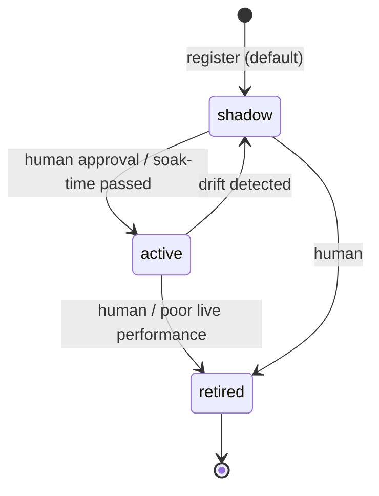

# Block 4 — Strategy Store (Registry)

> Status: **implemented**. Metadata in SQLite (`strategies`, `survival_reports`); artifacts on disk under `data/artifacts/<id>/`.

## Purpose

Durable catalog of strategies that survived the lab. Production looks here to know what to rank. Lab looks here to avoid registering duplicates. Humans look here to audit and retire strategies.

## Storage

- **Metadata:** SQLite (`strategies`, `survival_reports` tables — schemas in [`02_storage.md`](02_storage.md)).
- **Artifacts:** on-disk bundles at `data/artifacts/<strategy_id>/` (params JSON + optional joblib-serialized fitted state + metadata). Inspectable without opening the DB.

## Module layout (target)

```
src/stonks/registry/
├── store.py         # StrategyRegistry
├── artifact.py      # ArtifactBundle(save/load); wraps joblib for ML + plain JSON for rule-based
└── schema.sql
```

## `StrategyRegistry`

```python
class StrategyRegistry:
    def __init__(self, state: SqliteState, artifacts_dir: Path): ...

    # writes
    def register(self, strategy: Strategy, params: Params,
                 reports: list[SurvivalReport]) -> str: ...   # returns registered id
    def set_status(self, strategy_id: str,
                   status: Literal["active", "shadow", "retired"]) -> None: ...

    # reads
    def load(self, strategy_id: str) -> Strategy: ...
    def list_active(self) -> list[StrategyHandle]: ...
    def list_all(self) -> list[StrategyHandle]: ...
    def get_reports(self, strategy_id: str) -> list[SurvivalReport]: ...
```

`StrategyHandle` holds `id, class_path, params, artifact_path, status, created_at` — enough for the production ranker to rehydrate via `load`.

## Lifecycle



- `shadow`: ranked but not executed (paper only). Default state on fresh registration.
- `active`: eligible for real execution.
- `retired`: ignored by the ranker.

## Why artifacts on disk instead of in SQLite

- Inspectable: `ls data/artifacts/<id>/` shows `params.json` + `model.joblib`.
- Keeps the state DB small; backups of state don't copy model weights.
- Easy to version-control (outside git, via a separate artifact store later) or garbage-collect by status.

## Artifact bundle layout

```
data/artifacts/<strategy_id>/
├── meta.json                    # class_path, created_at, stonks version
├── params.json                  # the Params dict
├── fitted_state.joblib          # optional; rule-based strategies skip
└── reports/
    ├── oos.json
    ├── period_stability.json
    ├── perturbation.json
    └── drift.json
```

## Rehydrating a strategy

```python
handle = registry.load(id)
module = importlib.import_module(handle.class_path.module)
cls = getattr(module, handle.class_path.name)
strategy = cls(handle.params)
if handle.artifact_path and (handle.artifact_path / "fitted_state.joblib").exists():
    strategy = cls.load(handle.artifact_path)
```

## CLI

```
stonks registry list    [--status active|shadow|retired]
stonks registry show    <id>
stonks registry promote <id>      # shadow → active
stonks registry retire  <id>
```

## Testing (target)

- `tests/integration/test_registry_roundtrip.py` — register a fake strategy, list active, load back, round-trip params.
- `tests/integration/test_registry_status_transitions.py` — enforce legal transitions.
