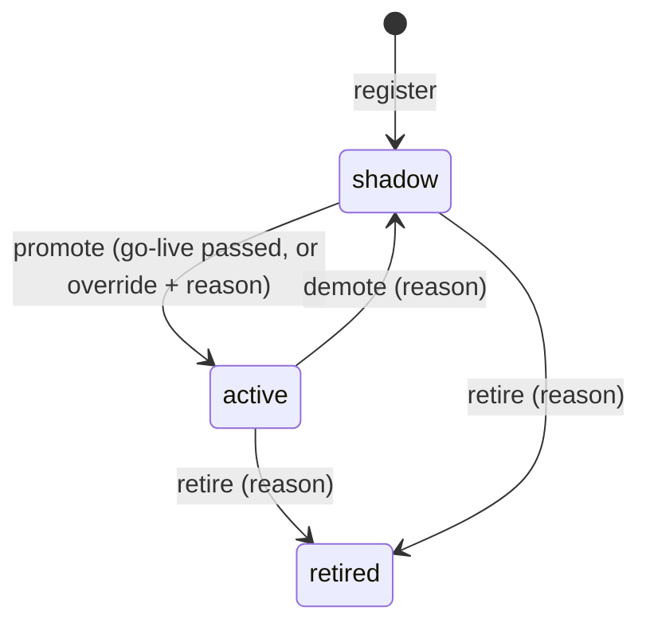

# Block 4: Strategy store (registry)

## Purpose

The durable list of strategies that passed the lab. The tick reads it to know what to score, the console and CLI read it to audit, and governance rules decide who may change a status.

## Storage

- **Metadata** in SQLite: `strategies`, `survival_reports`, and the audit table `status_changes` (see [02_storage.md](02_storage.md)).
- **Artifacts** on disk at `data/artifacts/<strategy_id>/` (`[registry] artifacts_dir`).

```
data/artifacts/<strategy_id>/
├── meta.json          # class_path, created_at, stonks_version, strategy metadata, lab provenance
├── params.json        # the params
├── reports/<test_id>.json
└── ...                # fitted state the strategy saves itself (e.g. fitted_state.json, model/)
```

Trial return matrices sit beside them at `data/artifacts/_trials/<run_id>.npz`.

## `StrategyRegistry`

```python
registry = StrategyRegistry(state, artifacts_dir)
sid = registry.register(strategy, reports)             # lands in shadow
registry.set_status(sid, "active", actor=..., golive_report=report)   # or override=True, reason=...
registry.load(sid)                                      # rebuilds via importlib from class_path
registry.list_active(); registry.list_all(status="shadow")
registry.get_reports(sid); registry.status_history(sid)
registry.record_intervention(kind, actor=..., reason=...)   # risk reset, manual order, config change
```

## Lifecycle and governance



- `shadow`: scored every tick and traded only in its model book (virtual portfolio). This is where incubation happens.
- `active`: eligible for real portfolios.
- `retired`: ignored.

Rules (BL-24):

- `set_status` is the only writer of `strategies.status`. Each change writes a `status_changes` row (actor, from, to, reason, override flag, go-live report) in the same transaction.
- Promotion to `active` needs a passing go-live check (`production/golive.py`), or `--override` with a reason of at least 20 characters.
- Demotions are always allowed but need a reason.

Go-live details and incubation limits: [operations.md](../operations.md) and `[golive]` in `config/default.toml`.

## CLI

```bash
uv run stonks registry list [--status active|shadow|retired] [--asset-class crypto]
uv run stonks registry show <id>
uv run stonks registry history <id>
uv run stonks golive check <id>
uv run stonks registry promote <id> [--override --reason "why this is safe"]
uv run stonks registry shadow <id> --reason "..."
uv run stonks registry retire <id> --reason "..."
```

The same actions exist in the REST API, the console (Strategies and Go-live pages) and, behind an explicit confirm, the MCP server.
