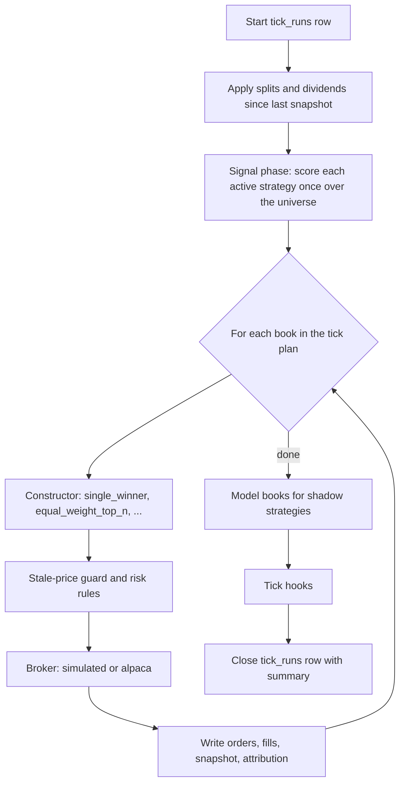
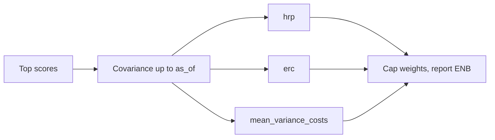

# Block 5: Production tick

## Purpose

One tick per trading day: score the strategies, build each portfolio's orders, check them against risk, send them to a broker, and record everything. The tick keeps no state between runs; all of it lives in the lake and the state DB. The scheduler, the CLI and the API all start it the same way.

The full daily loop (scheduler, ingest, tick, notifications) is in [architecture.md](../architecture.md). How to run and watch it is in [operations.md](../operations.md). Accounts, portfolios and modes are in [design/accounts-and-modes.md](../design/accounts-and-modes.md).

## Module layout

```
src/stonks/production/
├── tick.py              # run_tick, load_tick_plan (one book per portfolio)
├── ranker.py            # signal phase: Ranker, SignalSet, StrategyPool
├── shadow.py            # model books: virtual portfolios for shadow strategies
├── risk.py              # apply_risk over the rule registry
├── rules/               # RiskRule registry: caps, risk per position, portfolio vol,
│                        # drawdown scaling, liquidity, sector cap, max holding
├── hooks/               # post-tick hooks: position attribution, notification enqueue (placeholder)
├── golive.py            # go-live and incubation gate
├── corporate_actions.py # splits and dividends applied to stored portfolios
├── pnl.py, health.py, prices.py, settings_builder.py
src/stonks/portfolio/pipeline.py   # build_orders, shared with the backtest
src/stonks/execution/
├── orders.py            # make_client_id
├── brokers/             # simulated, alpaca (wraps alpaca-py), make_broker
└── reconcile.py         # broker order state and fills into orders / fills
```

## Three phases



1. **Signal phase.** `Ranker` scores every active strategy once (and shadow strategies when a book or the model books need them). The instance that scored is the one that decides.
2. **Portfolio phase.** `run_tick` takes a `TickPlan`. The default plan, which `stonks tick`, the API and the scheduler use today, is one book: `pf_default` over every active strategy. `load_tick_plan` can build one book per active portfolio with enabled `paper` or `auto` subscriptions, but no entry point calls it yet. Each book runs `portfolio.pipeline.build_orders` (constructor, orders, risk), then its broker. Each book fails on its own without stopping the others.
3. **Model books and hooks.** Shadow strategies trade their virtual portfolios (`shadow_decisions`, `shadow_portfolio_snapshots`). Then `tick`-stage hooks run. The notification hook is a placeholder: it only logs the signals of `notify` subscriptions and does not write the outbox yet.

## Optimising constructors

Three constructors size a book from a covariance matrix instead of one volatility per name. Pick one with `[production.construction].method`. Every other key in that table is a knob of the constructor.



| Method | What it does |
|---|---|
| `hrp` | Hierarchical risk parity. Clusters names by correlation, then splits weight between clusters in inverse proportion to their variance. Never inverts the matrix. |
| `erc` | Equal risk contribution. Every name adds the same share of portfolio risk. `budget = "score"` gives better scores more risk. |
| `mean_variance_costs` | Maximises expected return minus risk minus trading costs, with an optional turnover cap. Expected return is `ic * sigma * score`. Uses cvxpy behind the `QpSolver` seam. |

- **Shared knobs.** `top_n` (20), `max_weight` (1.0), `estimator` (`ledoit_wolf`), `lookback` (252 bars), `min_observations` (60). All three are long-only by default and never go above `max_gross`.
- **Covariance.** `portfolio/covariance.py` has four estimators: `sample`, `ledoit_wolf`, `ewma` (lambda 0.94) and `denoised` (Marchenko-Pastur). Every estimate is made positive definite, so duplicate or near-duplicate names don't break the maths.
- **Short or missing history.** Only rows up to the decision date are used. A name with fewer than `min_observations` rows falls back to its own volatility with no correlation. A name with neither is left out.
- **Costs.** `spread_cost` is paid on every trade. Square-root impact is added when the input carries daily volumes. If the turnover cap can't be met (the book already breaks a limit), that one decision drops the cap and says so in the target book's `meta`.
- **Effective number of bets.** `portfolio/diversification.py` counts independent bets over principal components (principle P33). Ten names that move together count as about one. Each of the three constructors puts it in `meta["enb"]`.

## Brokers

| `[brokers].kind` | Behaviour |
|------------------|-----------|
| `simulated` (default) | Fills in memory with the `[backtest.costs]` model; needs no keys. |
| `alpaca` | Paper by default. Reconciles open orders first, writes each order `pending` before submitting, and books fills only through `execution/reconcile.py`. Live money needs `paper = false` and `allow_live = true`. Keys from `ALPACA_API_KEY` / `ALPACA_SECRET_KEY`. Applies to the default portfolio only. |

Broker connections (`connections/`) sync other brokers' holdings read-only; they do not trade yet.

## Idempotency and recovery

- Every run gets a unique `tick_id`.
- Client ids are keyed by date, not by run: `<as_of>:<strategy>:<ticker>:<side>` for `pf_default`, `<as_of>:<portfolio>:<strategy>:<ticker>:<side>` for other portfolios.
- A rerun for the same `as_of` rebuilds the same ids and skips orders already stored (unless rejected or cancelled).
- A tick for a date older than the latest snapshot is refused.
- Model books skip strategies already evaluated for that date.

## Risk

`apply_risk` runs every registered rule in order. Sells are never blocked, only clipped so they cannot open a short, and go before buys. The caps come from `[production.risk]` (`max_open_positions`, `max_weight_per_ticker`, `max_weight_per_asset_class`, `cash_buffer_fraction`, `min_order_notional`). A portfolio or subscription can only tighten them. The W3.1 rules (risk per position, portfolio volatility, drawdown scaling, liquidity, sector cap, max holding) are registered but off; they cannot be turned on from the config file yet.

Clipped or dropped orders are listed under `risk_adjustments` in the tick summary.

Every tick summary also records `dry_run` and `broker_mode`. The mode says whose money the default book traded: `simulated`, a broker's `paper` account, or a `live` account. The API tick result and `stonks tick` show both.

## CLI

```bash
uv run stonks tick                                  # today (UTC), [production].universe
uv run stonks tick --dry-run                        # score and log, place nothing, write no snapshots
uv run stonks tick --as-of 2026-09-25 --tickers AAPL.US,MSFT.US
uv run stonks tick --asset-class crypto
uv run stonks pnl [--since 2026-09-01] [--strategy <shadow-id>]
uv run stonks health [--notify]
uv run stonks golive check <id>
```

## Testing

Integration tests drive the tick with a fixture lake and the simulated broker: dry runs, same-day reruns (no duplicate orders), several portfolios, attribution, hooks and gates. A golden fixture pins the single-owner tick's ledger so the accounts work never changed it.
