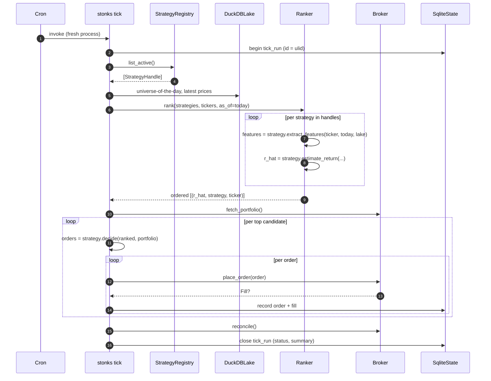

# Block 5 — Production Tick

> Status: **implemented** for paper mode via `SimulatedBroker`. Live broker adapters (Alpaca, IB, etc.) remain a post-MVP drop-in behind the same `Broker` Protocol.

## Purpose

One fresh Python process per tick, invoked by an external scheduler. Pulls latest data, ranks active strategies × universe, executes the best candidates through the broker, records everything. Stateless across invocations — all state is in DuckDB + SQLite.

## Module layout (target)

```
src/stonks/production/
├── tick.py          # entrypoint: stonks tick
└── ranker.py        # strategies × universe → ordered (expected_return, strategy, ticker)
src/stonks/execution/
├── broker.py        # Broker Protocol
├── orders.py        # Order, Fill, client_id helper
└── brokers/         # SimulatedBroker (reused from backtest), AlpacaBroker, IbBroker, ...
```

## Tick flow



## `Broker` Protocol

```python
class Broker(Protocol):
    def fetch_portfolio(self) -> Portfolio: ...
    def place_order(self, order: Order) -> Fill | None: ...
    def reconcile(self) -> list[Fill]: ...
```

`place_order` must be idempotent: the broker keeps a record of `order.client_id` and re-submission of the same id returns the existing state, never places a duplicate. `SimulatedBroker` honors this too (trivial partial-tick recovery in both worlds).

## Idempotency + recovery

- Each tick gets a `tick_id` (ulid).
- `order.client_id = f"{tick_id}:{strategy_id}:{ticker}:{side}"`.
- If a tick crashes mid-way, the next tick re-derives the same client_ids; the broker short-circuits duplicates.
- `reconcile()` at end-of-tick checks broker truth vs `state.orders` / `state.fills`; mismatches flip `tick_runs.status = 'partial'` and emit an alert.

## CLI

```
stonks tick                       # one-shot; suitable for cron
stonks tick --dry-run             # rank and log intended orders without placing
stonks tick --strategy <id>       # restrict to a single strategy (debug)
```

## Scheduling

- `config/default.toml` suggests a default cron line; actually wiring cron/systemd is host-specific and out of scope for the repo.
- The tick does not enforce market hours; the scheduler is responsible (e.g., cron `0 15 * * 1-5`).

## Testing (target)

- `tests/integration/test_tick_dry_run.py` — fixture lake + registry with one fake strategy, assert ranked orders are logged without a broker call.
- `tests/integration/test_tick_idempotency.py` — run same tick twice with a `SimulatedBroker`; assert no duplicate orders.

## Milestones

- **Prod M1:** `SimulatedBroker`-backed paper tick (what `stonks tick --dry-run` effectively does plus local fill simulation).
- **Prod M2:** first live broker impl; pre-trade checks (position limits, cash caps); alerting on `tick_runs.status = 'partial'`.
