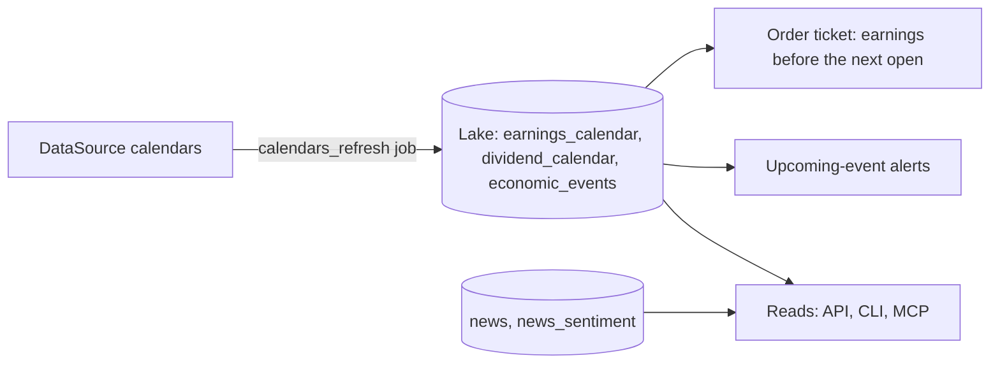

# Calendars and news

Stonks keeps three event calendars in the lake: company earnings, ex-dividend dates and economic releases (CPI, payrolls, rate decisions). You read them for your holdings, a watchlist, some tickers or the whole market. News and daily sentiment come from the tables the metadata ingest already fills.



## Tables

Lake migration 017 adds three tables. Every source fills the same columns with the same values.

| Table | Key | What it holds |
|---|---|---|
| `earnings_calendar` | `ticker, period_end` | Report date, `before_after_market` (`before`, `during`, `after` or empty), EPS estimate and actual, surprise |
| `dividend_calendar` | `ticker, ex_date` | Amount, currency, record, pay and declaration dates. Missing values never overwrite stored ones |
| `economic_events` | `country, event_time, event_type, comparison` | ISO alpha-2 country (or a region such as `EU`), UTC time, `comparison` (`mom`, `qoq`, `yoy`, `none`), actual, previous, estimate, change |

The report date of an earnings row can move. The fiscal period is the key, so a moved date updates the row in place.

## Refresh

The `calendars_refresh` job pulls the calendars and then sends the event alerts. It runs every day at 06:00 UTC by default, from a week back to five weeks ahead. It needs a paid EODHD plan: the free tier has no calendars.

Job params: `days_back` (7), `days_ahead` (35), `source` (`eodhd`), `tickers`, `countries`, `kinds` (`earnings`, `dividends`, `economic`), `alerts` (true) and `alert_days` (look-ahead days per alert kind, 0 turns one off).

A calendar the vendor fails on is a soft fail. The run row counts it in `tickers_failed` and the other calendars still land.

## Scopes

Every read takes a scope:

| Scope | Tickers |
|---|---|
| `holdings` (default) | What your portfolios hold now. `portfolio_id` picks one of them |
| `watchlists` | Your watchlists. `watchlist_id` picks one |
| `tickers` | The tickers you name |
| `all` | Every event in the lake (not for news) |

Economic releases are market wide. Every scope shows them, filtered by `countries` when given. A calendar read spans at most 120 days and returns at most 2000 events per calendar (`truncated` says when it cut).

## Order ticket warning

`GET /api/calendars/earnings-warnings?tickers=...` names the tickers that report earnings between now and the next open of their market. An order placed now fills after the report, so the order ticket shows a warning. A report with no time of day counts from the open to the close of its day.

## Event alerts

After each refresh, every active person gets one notification per upcoming event on a ticker they hold or watch:

| Kind | Looks ahead |
|---|---|
| `earnings_upcoming` | 2 days |
| `ex_dividend_upcoming` | 1 day |

Alerts use the `signal` category, so your notification settings, channels and quiet hours apply. The dedupe key holds the kind, ticker and date, so a second refresh the same day sends nothing new. A new kind is one module in `calendars/alert_kinds/`.

## Commands

```bash
uv run stonks calendars show [--scope holdings|watchlists|tickers|all] [--tickers ...] [--start ... --end ...] [--countries US,DE]
uv run stonks calendars news [--scope ...] [--tickers ...] [--limit 20]
uv run stonks calendars earnings-check AAPL.US,MSFT.US
uv run stonks calendars refresh [--source eodhd] [--start ... --end ...] [--no-alerts]
```

`--user EMAIL` reads as that person. `refresh` writes the lake, so while `stonks serve` runs, use `POST /api/calendars/refresh`.

## API and MCP

- `GET /api/calendars`, `GET /api/calendars/news`, `GET /api/calendars/earnings-warnings`, `GET /api/calendars/alert-kinds`.
- `POST /api/calendars/refresh` (operators) queues the refresh job. `GET /api/calendars/refresh/{job_id}/result` returns its result.
- MCP: `get_calendar`, `get_news`, `get_earnings_warnings`, `list_event_alert_kinds`.

## Adding a source

A source that serves calendars overrides `fetch_earnings_calendar`, `fetch_dividend_calendar` and `fetch_economic_events` on `DataSource` and maps vendor values to the normalized ones at parse time. The EODHD adapter lives in `ingest/sources/eodhd_calendar.py`.
