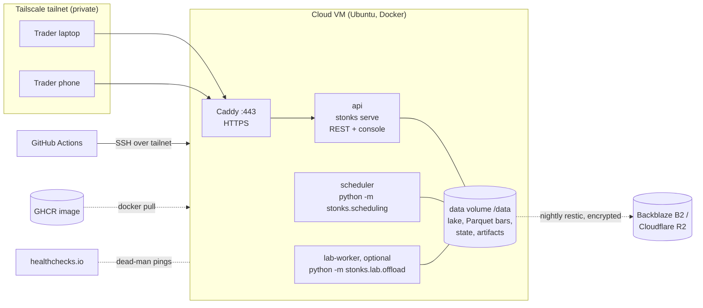
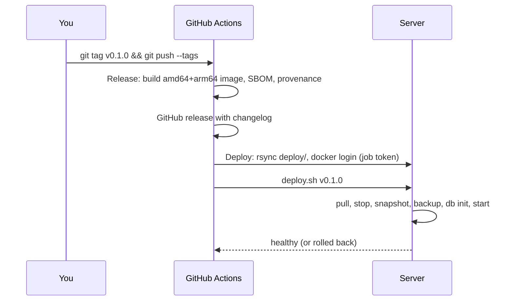
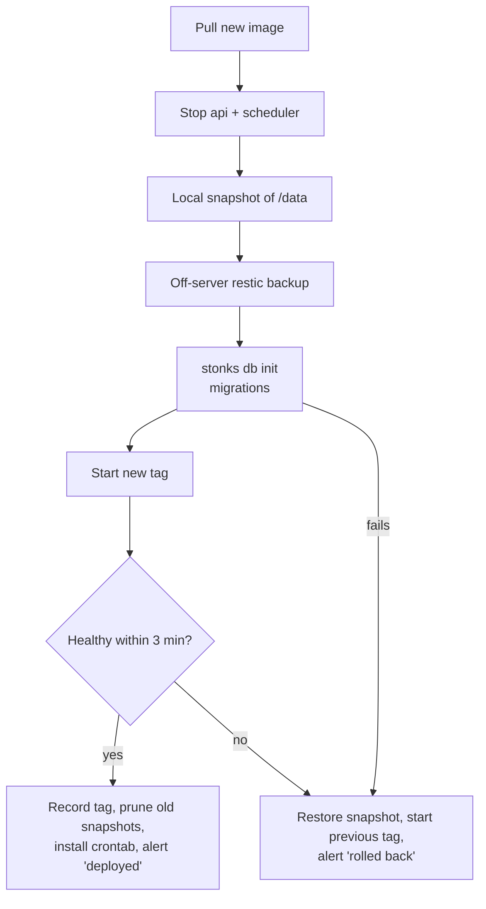
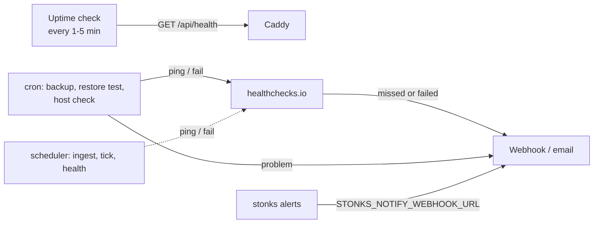
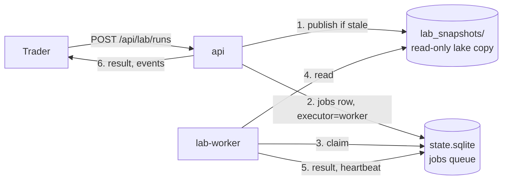

# Deploy

How to run Stonks on one small always-on cloud VM for several traders: create the server, set secrets, deploy, update, roll back, back up, restore and monitor. Covers Phases 12.7 to 12.9 and 14.1 to 14.10 of the [roadmap](roadmap.md). Sizes and costs: [capacity.md](capacity.md).

## The picture



- **One image** (`Dockerfile`) holds the API, the built console and the scheduler. It runs as a non-root user (uid 10001).
- **Compose** (`deploy/compose.yaml`) runs three services: `api`, `scheduler` and `caddy`, plus an optional `lab-worker` (see [10. Lab offload](#10-lab-offload)). Everything the app writes lives on one volume, `/data`, which sits on an attached block volume on the host (`/srv/stonks/data`).
- **Private access** is the default: the server has no public port. Traders join the tailnet. Public HTTPS with Let's Encrypt is one setting away.

| File | Purpose |
|------|---------|
| `Dockerfile`, `.dockerignore` | Multi-stage build: Node builds the console, uv installs the package, slim runtime with a healthcheck on `/api/health/live`. Compose waits for `/api/health/ready` before Caddy and the scheduler start. |
| `deploy/compose.yaml` | `api`, `scheduler`, `caddy`, an optional `lab-worker` (profile `lab-worker`), plus a `restic` tool service (profile `backup`). |
| `deploy/compose.tailscale.yaml` | Lets Caddy get its `*.ts.net` certificate from Tailscale. |
| `deploy/Caddyfile` | HTTPS, security headers, reverse proxy to the API. |
| `deploy/.env.example` | Every setting and secret the server needs (placeholders). |
| `deploy/cloud-init.yaml` | First-boot setup: users, Docker, firewall, automatic updates, data volume, Tailscale. |
| `infra/terraform/hetzner/` | Creates the server, firewall and volume on Hetzner Cloud. |
| `deploy/scripts/deploy.sh`, `rollback.sh` | Deploy with snapshot, migrations, health check and automatic rollback; manual rollback. |
| `deploy/backup/` | `backup.sh` (nightly), `restore-test.sh` (monthly), `restore.sh` (disaster). |
| `deploy/monitor/check-host.sh` | Disk, memory, load and container checks every 5 minutes. |
| `deploy/crontab` | The schedule for the three jobs above. Installed by every deploy. |
| `.github/workflows/release.yml`, `deploy.yml` | Build and publish on a tag; deploy over SSH. |

## 1. Create the server

Pick one. Both give the same result.

### With Terraform (Hetzner example)

You need: a Hetzner Cloud project and an API token (read/write), [Terraform](https://developer.hashicorp.com/terraform/install), two SSH key pairs (yours, and one for CI), and a Tailscale auth key ([deploy/tailscale/README.md](../deploy/tailscale/README.md), steps 1 to 4).

```bash
ssh-keygen -t ed25519 -f ~/.ssh/stonks_deploy -C github-actions-deploy -N ""   # CI key
cd infra/terraform/hetzner
cp terraform.tfvars.example terraform.tfvars      # fill in the two public keys
export TF_VAR_hcloud_token=...                     # never in a file
export TF_VAR_tailscale_auth_key=tskey-auth-...    # private mode
terraform init
terraform apply
```

The server boots, runs `cloud-init` (about 3 minutes) and appears in your tailnet as `stonks`. Rebuilding it from scratch is `terraform destroy && terraform apply` plus a deploy and a restore (section 7).

Terraform state contains the Tailscale key and server details. Keep it on your machine or in an encrypted remote backend. It is gitignored.

### By hand (any provider)

1. Create an Ubuntu 24.04 VM with 2 vCPU and 4 GB RAM, and attach a 20 GB block volume.
2. Open `deploy/cloud-init.yaml`, replace the five placeholders (see its header), and paste it as **user data**. Use the volume's device path (for example `/dev/disk/by-id/scsi-0DO_Volume_stonks`) for `volume_device`.
3. In the provider's firewall, allow **no inbound traffic** (Tailscale) or only SSH from your IP (public mode). Docker publishes ports past `ufw`, so the provider firewall is the real guard.

### Check the server

```bash
ssh admin@stonks          # over Tailscale (MagicDNS name)
cloud-init status         # "done"
docker version && ls -ld /srv/stonks/data /opt/stonks/deploy
```

## 2. Set the secrets

### On the server

```bash
# from your checkout of the repo
scp deploy/.env.example deploy@stonks:/opt/stonks/deploy/.env
ssh deploy@stonks 'chmod 600 /opt/stonks/deploy/.env'
ssh -t deploy@stonks 'nano /opt/stonks/deploy/.env'
```

Fill in at least `STONKS_IMAGE` (`ghcr.io/<owner>/<repo>`, lower case), `STONKS_DOMAIN`, `STONKS_API_TOKEN` (`openssl rand -hex 32`), `EODHD_API_KEY`, the `RESTIC_*` and `AWS_*` backup values, and the `HC_PING_*` URLs.

Secrets live **only** in this file. They are never baked into the image and never committed.

### In GitHub (Settings > Secrets and variables > Actions)

| Name | Kind | Value |
|------|------|-------|
| `DEPLOY_HOST` | secret | `stonks` (Tailscale name) or the server's IP |
| `DEPLOY_USER` | secret | `deploy` (optional, this is the default) |
| `DEPLOY_SSH_KEY` | secret | Private key `~/.ssh/stonks_deploy` |
| `DEPLOY_KNOWN_HOSTS` | secret | Output of `ssh-keyscan stonks` run from a tailnet machine |
| `TS_OAUTH_CLIENT_ID`, `TS_OAUTH_SECRET` | secret | Tailscale OAuth client with tag `tag:ci` (skip in public mode) |
| `STONKS_URL` | variable | `https://stonks.<tailnet>.ts.net` or your domain (optional; enables the post-deploy version check) |

Also create an environment named `production` (Settings > Environments). Add yourself as a required reviewer if every deploy should wait for a click.

Turn on **secret scanning** and **push protection** (Settings > Code security). They cannot be set from a file.

### Rotation

| Secret | When | How |
|--------|------|-----|
| `STONKS_API_TOKEN` | Every 90 days, and when a trader leaves | New value in `.env`, `docker compose up -d`, tell traders |
| Broker and data keys | Every 90 days or per the vendor | Vendor console, then `.env` |
| `DEPLOY_SSH_KEY` | Yearly | New key pair, update `~deploy/.ssh/authorized_keys` and the secret |
| B2/R2 keys | Yearly | New app key scoped to the bucket, then `.env`. Keep `RESTIC_PASSWORD` (it encrypts the old snapshots) |
| Tailscale OAuth client | Yearly | New client, update both secrets |

Optional: keep an encrypted copy of `.env` in the repo with [sops](https://github.com/getsops/sops) and an age key that only you hold.

## 3. First deploy



1. Bump `version` in `pyproject.toml`, refresh the changelog (`git cliff --tag v0.1.0 -o CHANGELOG.md`), commit.
2. `git tag v0.1.0 && git push origin v0.1.0`.
3. Watch **Release**, then **Deploy**, in the Actions tab.
4. On the server, run `docker compose run --rm api stonks users bootstrap --email you@example.com` once. Then open `https://stonks.<tailnet>.ts.net`, sign in and set up the second factor. Every call needs a sign-in or a token. Behind Caddy the API trusts forwarded client IPs only from the Compose network (`STONKS_DOCKER_SUBNET`).

The release fails on purpose if the tag does not match `pyproject.toml`.

## 4. Updates

Every release deploys itself. What `deploy.sh` does, in order:



- Downtime is the length of the snapshot plus migrations, usually under a minute. Deploy outside the daily loop (22:30 to 23:00 UTC).
- Tags with a suffix (`v1.3.0-rc.1`) are published as pre-releases and are not deployed automatically. Deploy them with **Actions > Deploy > Run workflow**.
- Dependabot opens grouped update PRs every Monday (Python, npm, Docker, Compose, Actions, Terraform). CI must pass before merge.
- The OS patches itself (`unattended-upgrades`) and reboots at 04:30 UTC when needed. The containers restart on their own.
- The monthly patch window (the 8th, 05:00 UTC, `deploy/crontab`) refreshes the Caddy and restic images and removes images unused for 90 days.

## 5. Roll back

Automatic: a failed deploy rolls itself back (section 4).

By hand, from GitHub: **Actions > Deploy > Run workflow** with the older tag. It runs the full deploy (snapshot, migrations are no-ops for older code, health check).

By hand, on the server:

```bash
/opt/stonks/deploy/scripts/rollback.sh               # previous tag, data as is
/opt/stonks/deploy/scripts/rollback.sh --with-data   # also restore the pre-deploy snapshot
/opt/stonks/deploy/scripts/rollback.sh v1.2.0        # a specific tag
```

Use `--with-data` only if the newer version's migrations broke the older one. It discards every tick, order and ingest since that deploy. See [runbooks/deploy-failed.md](runbooks/deploy-failed.md).

## 6. Backups

| What | Where | When | Keeps |
|------|-------|------|-------|
| Pre-deploy snapshot | `/srv/stonks/snapshots/pre-<tag>-<time>.tar.gz` | Every deploy | Last 5 |
| Off-server backup (restic, encrypted) | B2 or R2 bucket | 02:30 UTC nightly, and every deploy | 7 daily, 4 weekly, 12 monthly |
| Restore test | Scratch volume, wiped after | 1st of the month, 04:00 UTC | Result in healthchecks.io. Fails if the state DB is missing or lost rows |

`backup.sh` uses `python -m stonks.ops backup` when the image has it (a consistent copy with no downtime, written to `/data/backups`). Otherwise it stops the api and scheduler for the upload and backs up the whole volume.

Set up the bucket:

- **Backblaze B2**: create a private bucket and an application key limited to it. `RESTIC_REPOSITORY=s3:https://s3.<region>.backblazeb2.com/<bucket>/stonks`.
- **Cloudflare R2**: create a bucket and an R2 API token with object read/write on it. `RESTIC_REPOSITORY=s3:https://<account-id>.r2.cloudflarestorage.com/<bucket>/stonks` and `AWS_DEFAULT_REGION=auto`.

Store `RESTIC_PASSWORD` in your password manager too. Without it the backups cannot be read.

Useful commands (in `/opt/stonks/deploy`):

```bash
./backup/backup.sh                                             # back up now
docker compose --profile backup run --rm restic snapshots      # list backups
./backup/restore-test.sh                                       # prove a restore works
```

## 7. Restore

After losing the server: create a new one (section 1), set `.env` (same `RESTIC_*` values), deploy the same tag, then:

```bash
/opt/stonks/deploy/backup/restore.sh            # latest; or pass a snapshot id
```

It asks you to type `RESTORE` and keeps a local copy of the current data. Then `python -m stonks.ops restore-snapshot` brings back the state DB, the artifacts and the lake together. It moves the files already in `/data` aside as `<name>.pre-restore-<time>`, never deletes them, and checks that the users, strategies and orders row counts match the snapshot. A snapshot without the state DB or the lake is refused and nothing changes. Then it restarts and checks health.

The monthly restore test runs the same restore into a scratch folder and then `python -m stonks.ops check-restore`. It fails when the state DB is missing, empty or has fewer rows than the snapshot.

## 8. Monitoring



1. **Dead-man checks.** In [healthchecks.io](https://healthchecks.io) (free for 20 checks) or a self-hosted Uptime Kuma, create one check per job and put its ping URL in `.env`:

   | Variable | Schedule | Grace |
   |----------|----------|-------|
   | `HC_PING_HOST` | every 5 minutes | 15 minutes |
   | `HC_PING_BACKUP` | daily 02:30 UTC | 2 hours |
   | `HC_PING_RESTORE_TEST` | monthly, 1st, 04:00 UTC | 1 day |
   | `HC_PING_INGEST`, `HC_PING_TICK`, `HC_PING_HEALTH` | weekdays after the close | 1 hour |

   The first three are pinged by the scripts in `deploy/`. The last three are for the scheduler (see "Needs app support" below). Connect healthchecks.io to the same chat channel as `STONKS_NOTIFY_WEBHOOK_URL`.

2. **Uptime check.** Public mode: point an external monitor (healthchecks.io does not do this; use UptimeRobot, Better Stack or Uptime Kuma) at `https://<domain>/api/health`. Tailscale mode: nothing outside can reach the server, so `HC_PING_HOST` doubles as the uptime signal. If the server dies, the pings stop and you get an alert.

3. **Host limits.** `check-host.sh` alerts when disk passes 80 %, memory 90 %, or the 15-minute load 90 % of the cores, and when a container is down or the API unhealthy. Change the limits with `ALERT_*_PCT` in `.env`. Repeated alerts are sent at most once an hour.

4. **Logs.** Docker keeps 5 x 10 MB of JSON logs per container. Read them with `docker compose logs -f api scheduler`. Stonks logs are structlog JSON, so `| jq` works.

## 9. Size and cost

| Item | Choice | About per month |
|------|--------|-----------------|
| VM | 2 vCPU, 4 GB RAM, 40 GB disk (Hetzner CX22 class) | 4 to 6 EUR |
| Block volume | 20 GB | 1 EUR |
| Object storage | B2 (first 10 GB free, then about 6 USD/TB) or R2 (10 GB free) | 0 to 1 EUR |
| Tailscale | Personal or Starter plan | 0 to 6 USD per user |
| healthchecks.io | Free plan | 0 |
| **Total** | | **about 6 to 10 EUR** plus Tailscale seats |

Prices change; check the provider pages. DigitalOcean's 2 vCPU / 4 GB droplet costs about 24 USD.

Sizing:

Measured sizes for 1, 5 and 20 traders, and how they were measured, are in [capacity.md](capacity.md). In short:

- **RAM.** The API idles at a few hundred MB. Each lab or backtest job adds more (`[api].max_concurrent_jobs`, default 2). 4 GB is enough for a few traders. Move to 8 GB if the monitor reports memory alerts during jobs.
- **Disk.** Daily bars cost about 12 KB per ticker-year in Parquet and 23 KB in the DuckDB table. Intraday bars grow much faster. Keep the volume under 70 % full, since snapshots need room too. Grow it with `volume_size_gb` (or in the provider console), then `sudo resize2fs /dev/disk/by-label/stonks-data`.
- **CPU.** Run heavy lab work on the lab worker (next section) so it never slows the console.

## 10. Lab offload

Tuning, survival suites, sweeps and MCPT can keep every core busy for minutes. Inside the API they also compete with traders' requests. The lab worker runs them in their own container with their own limits.



1. The API gets a lab run, sweep or Studio lab run. When `STONKS_LAB_EXECUTOR=worker`, it does not run it. It writes the job row with `executor = worker`.
2. First it makes sure a fresh read-only copy of the lake exists under `/data/lab_snapshots`. It builds a new one when an ingest or bar fetch finished since, or the copy is older than an hour. With Parquet bars the copy is small: the bar files are hard links.
3. The worker claims the oldest queued job, opens the copy read-only and runs the same handler the API would. DuckDB allows one writer, and the worker never writes the lake.
4. Progress, the result and registered strategies go to the real state DB and artifacts. The job row, its event stream and its result route work as before.
5. Cancel works: the worker checks a flag at every heartbeat and stops at the next checkpoint. A worker that dies stops its heartbeat, and its job fails after two minutes.

Turn it on:

```bash
# deploy/.env
COMPOSE_PROFILES=scheduler,lab-worker
STONKS_LAB_EXECUTOR=worker
STONKS_LAB_WORKER_CPUS=2      # CPU limit, also the size of its process pool
STONKS_LAB_WORKER_MEMORY=3g   # memory limit
docker compose up -d
```

- The worker gets a quarter of the API's CPU weight, so the API wins when both are busy.
- A lab run that must fetch missing data first (`ensure_data`) stays in the API, because the fetch writes the lake. Run `stonks universe ensure` first to offload it.
- Run more workers to run more jobs at once: `docker compose up -d --scale lab-worker=2`. Each runs one job at a time.
- For a big search, resize the VM for an hour (Hetzner and DigitalOcean resize in about a minute), raise `STONKS_LAB_WORKER_CPUS`, and resize back.
- Watch it: `docker compose exec lab-worker python -m stonks.lab.offload status`, the `lab_queue` health check and the `stonks_lab_*` metrics ([operations.md](operations.md#lab-worker)).

The worker must share the data folder with the API on a local disk: the queue is the SQLite state DB, and SQLite on a network file system is not safe. A worker on another machine (the 32-core PC) needs a queue over the API. That is not built yet.

## Public mode (no Tailscale)

1. Point a DNS `A` (and `AAAA`) record at the server.
2. Terraform: `public_https = true` and `ssh_allowed_cidrs = ["<your ip>/32"]`, no Tailscale key.
3. `.env`: delete the `COMPOSE_FILE` line, set `STONKS_DOMAIN=stonks.example.com`.
4. GitHub: `DEPLOY_HOST` is the public IP; leave the Tailscale secrets empty. Allowing GitHub-hosted runners to SSH in means opening port 22 widely; prefer Tailscale or a self-hosted runner.

Caddy then gets a Let's Encrypt certificate by itself. Everyone on the internet can reach the login surface, so keep `STONKS_API_TOKEN` long and rotated.

## Windows without Docker

For a single-user setup on Windows, run `uv run stonks serve` as a service with [WinSW](https://github.com/winsw/winsw) or NSSM (working directory: the repo; environment: `.env`), and schedule the daily loop with Task Scheduler as in [operations.md](operations.md). Backups then use `stonks backup` (Phase 12.4) and any file-sync tool.

## Needs app support

These parts depend on code outside `deploy/`:

- `python -m stonks.scheduling` (Phase 12.2) is the scheduler service's command. Until the image has it, leave `COMPOSE_PROFILES` empty in `.env` (the service then does not start and health checks do not expect it) and run the daily loop with the cron lines from [operations.md](operations.md), using `docker compose exec api stonks ...`.
- Dead-man pings from the scheduler (`HC_PING_INGEST`, `HC_PING_TICK`, `HC_PING_HEALTH`).
- `python -m stonks.ops backup` (Phase 12.4) for backups without downtime.
- `[api]` host and allowed hosts cannot be set from the environment yet, so Caddy presents requests to the API as `localhost` (see `deploy/Caddyfile`).
