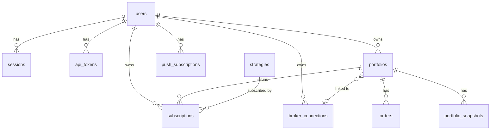
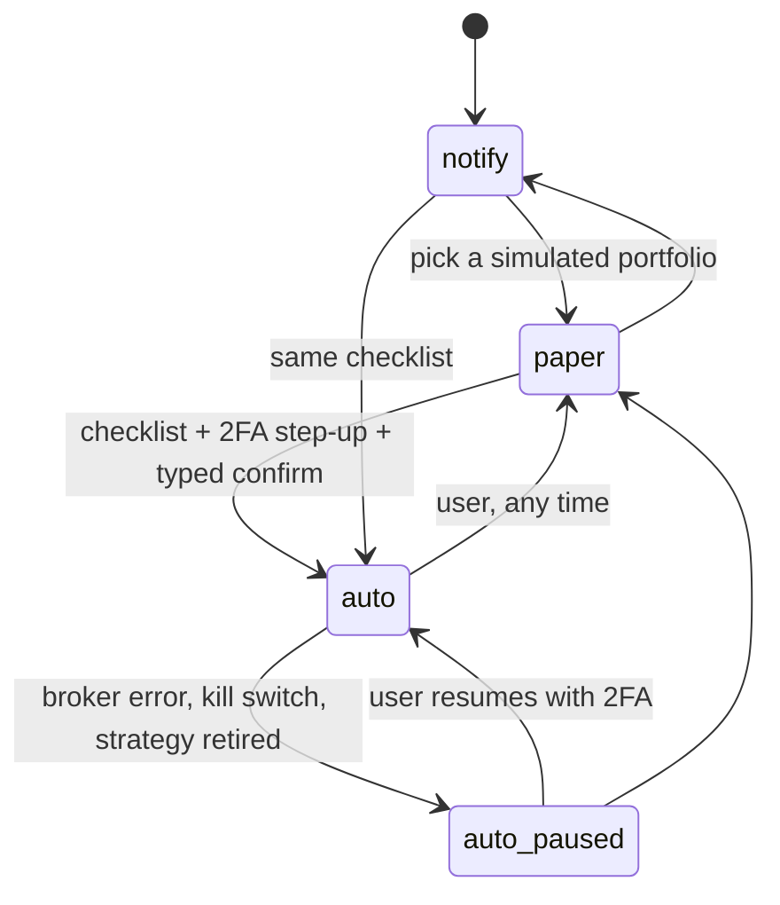
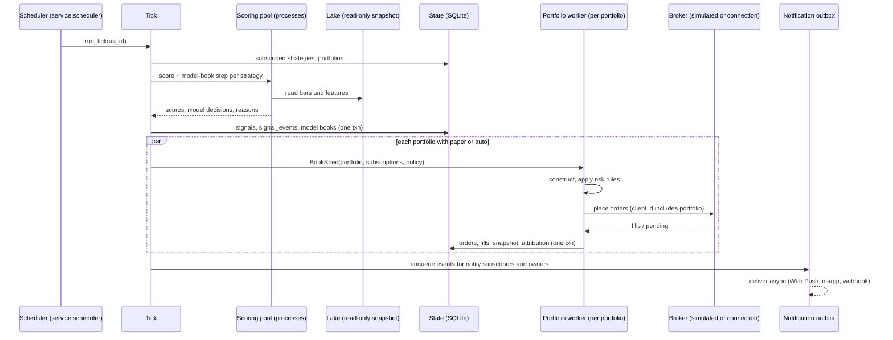
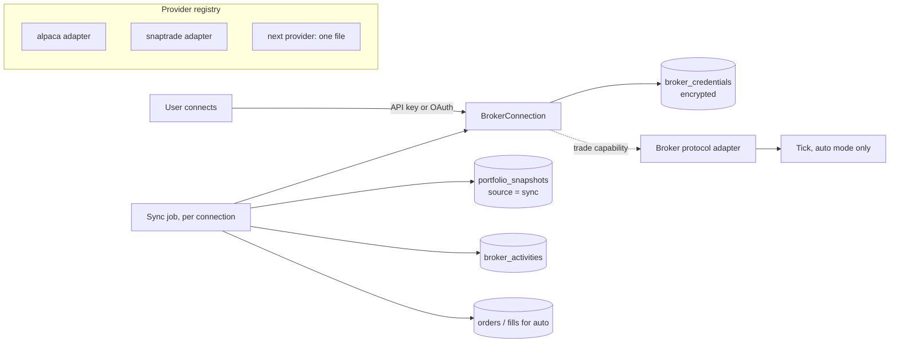
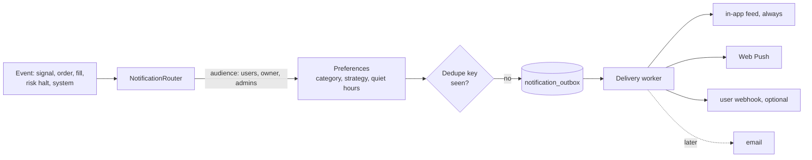
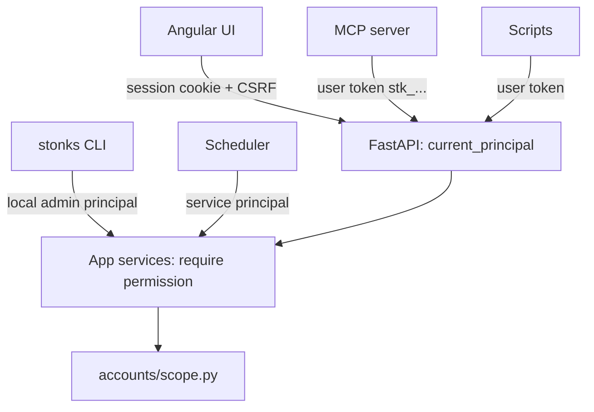

# Accounts, portfolios and automation modes

Design for roadmap Phase 15 (WP 15.1). It turns Stonks from one owner with one book into a small team: several traders, each with their own portfolios, broker connections, strategy subscriptions and notifications. Market data and the strategy catalog stay shared.

Status: proposed. Code on `feat/roadmap` at `ee5b60f` assumes one portfolio, one bearer token and one notifier; this doc says what changes and in which order.

## 1. Goals and non-goals

Goals:
- Several traders with roles (viewer, trader, admin); every action attributed to a person.
- A user owns any number of portfolios: simulated (Stonks ledger), or linked to a broker account.
- A user subscribes portfolios to catalog strategies and picks a mode per subscription: **notify**, **paper** or **auto**.
- Strategies compute once per tick for everyone; per-user work is only construction, risk and delivery.
- Read-only broker insights first; trading through a connection later and only in auto mode.
- Signals reach Chrome and installed PWAs by Web Push.
- One source of truth per fact, seams plus registries for every plug-in kind, all cores used where work is CPU-bound.

Non-goals (for now):
- Multi-organisation SaaS. One deployment is one team (one "workspace"). No org table.
- Per-user market data, per-user data vendors or per-user strategy code. The lake and the catalog are shared.
- Postgres. SQLite in WAL mode is enough for a handful of users on one VM (Phase 14). All state access already goes through `SqliteState`; the scoped repositories below keep a later switch possible.
- Social features (sharing portfolios, copying other users).

## 2. Users, roles and identity



**`users`** `(id, kind, email, display_name, role, status, password_hash, totp_secret_enc, timezone, created_at, last_login_at)`
- `kind ∈ {human, service}`. Service accounts have no password and no session; they act in-process.
- `role ∈ {viewer, trader, admin}`, a `StrEnum` with predicates (`role.can_trade`, `role.is_admin`), because the set carries behaviour.
- `status ∈ {active, disabled}`. Disabling a user revokes sessions and tokens and pauses their auto subscriptions.
- Passwords: argon2id (`argon2-cffi`, wrapped in `auth/passwords.py`).

**Roles**

| Can | viewer | trader | admin |
|---|:-:|:-:|:-:|
| Read the catalog, market data, own portfolios and signals | yes | yes | yes |
| Manage own portfolios, subscriptions, connections, notification settings | | yes | yes |
| Run backtests and lab jobs, use the Studio (rule strategies) | | yes | yes |
| Manual orders and auto mode on own portfolios (with 2FA) | | yes | yes |
| Promote, retire and register strategies (code and Studio), code drafts, run ticks and ingests, global risk policy, providers, users | | | yes |
| Global kill switch | | | yes |
| Totals across all traders (cash and value, never holdings, decision 2026-09-26) | | | yes |

**Sessions (UI).** Opaque random id in an `HttpOnly; Secure; SameSite=Lax` cookie; only its SHA-256 is stored in `sessions (id_hash, user_id, created_at, last_seen_at, expires_at, mfa_verified_at, ip, user_agent, revoked_at)`. Idle timeout 12 h, absolute 7 days. Unsafe methods also need an `X-CSRF-Token` header matching a per-session token (double submit).

**Second factor.** TOTP (`pyotp`, wrapped in `auth/totp.py`), secret encrypted at rest, ten one-time recovery codes stored hashed. Passkeys (WebAuthn) later as another factor behind the same `SecondFactor` seam. 2FA is required for admins and for anyone enabling auto. **Step-up**: sensitive actions need `mfa_verified_at` within 10 minutes (enable auto, connect or delete a broker, create a token with `trade` scope, resume the kill switch, change a password).

**API tokens (API and MCP).** `api_tokens (id, user_id, name, token_hash, scopes, created_at, last_used_at, expires_at, revoked_at)`. Format `stk_<id>_<32 random bytes, base32>`, shown once; SHA-256 stored (the secret is random, so a slow hash adds nothing). A token never exceeds its user's role. Tokens cannot perform step-up actions; those return 403 `step_up_required` and are done in the UI.

**Scopes:** `read`, `trade` (orders, modes except enabling auto, kill switch on), `lab` (jobs), `admin`.

**Service accounts.** `service:scheduler` runs ticks, syncs, ingest and deliveries. `service:system` is the actor for automatic changes (quit rule demotion, auto paused on a broker error). They hold a fixed scope set and cannot change modes or credentials.

**Principal.** Every entry point (UI session, API token, CLI, scheduler) resolves to one object, passed to every app service:

```python
@dataclass(frozen=True)
class Principal:
    user_id: str
    kind: Literal["human", "service"]
    role: Role
    scopes: frozenset[Scope]
    mfa_fresh: bool
    via: Literal["session", "token", "cli", "scheduler"]
    @property
    def actor(self) -> str: ...  # "user:<id>" or "service:scheduler", written to every audit row
```

The CLI runs as the local OS user mapped to an admin (`--as <email>`, default the bootstrap admin), because shell access to the VM already implies admin.

**Policy, one place.** `auth/policy.py` maps each `Permission` (e.g. `portfolio.trade`, `strategy.promote`, `killswitch.global`) to the roles and scopes that grant it. Services call `require(principal, Permission.X)`. Routers never check roles themselves.

**Transition from the single token.** `STONKS_API_TOKEN` keeps working during migration as a token of the bootstrap admin, with a deprecation warning, and is removed one release after login ships. `open_reads_on_loopback` stays only in the `dev` profile (`STONKS_PROFILE=dev`).

## 3. Scoping every piece of state

Rule: **market facts and the strategy catalog are global; money, people and delivery are scoped.** Portfolio-scoped rows carry `portfolio_id`; user-scoped rows carry `user_id`. A portfolio's owner is looked up through `portfolios.owner_id`, never copied.

| Scope | Tables |
|---|---|
| Global | whole lake (bars, statements, metadata, macro); `strategies`, `survival_reports`, `status_changes`, `lab_runs`, `lab_trials`, model books (today `shadow_decisions`, `shadow_portfolio_snapshots`), `signals`, `signal_events`, `tick_runs` |
| Global, attributed | `jobs` (+`owner_id`), `strategy_drafts` (+`owner_id`) |
| User | `users`, `sessions`, `api_tokens`, `mfa_recovery_codes`, `broker_connections`, `broker_credentials`, `push_subscriptions`, `notification_prefs`, `notifications` (today `alerts`, +`user_id`) |
| Portfolio | `portfolios`, `subscriptions`, `orders`, `fills`, `portfolio_snapshots`, `portfolio_runs`, `position_attribution` (W2.1), `risk_halts` (W3.2, NULL = global), `risk_snapshots` (W5.4), `broker_activities` |
| Append-only audit | `audit_log` (every user action), `status_changes` (strategy lifecycle, unchanged) |

Why strategies stay global: a strategy's evidence (survival tests, trial ledger, model book, go-live) is a property of the strategy, not of who runs it. Admins govern the catalog; traders choose from it.

**Enforcement.** SQLite has no row-level security, so it lives in one layer:
- `accounts/scope.py`: `owned_portfolio(principal, portfolio_id)` returns the row or raises `NotFound` (404, never 403, so ids don't leak). Every portfolio-scoped service starts with it.
- Repository functions for scoped tables take `portfolio_id` or `user_id` as a required argument; there is no unscoped variant outside `admin` services.
- A **tenant-isolation test** walks the route table: for every route with a path or query id of a scoped resource, user B gets 404 on user A's resource. New routes are covered automatically.

**Migration of existing single-owner data** (one migration, next free number, `010_accounts.sql` today):
1. Create the new tables.
2. Insert `usr_owner` (admin, no password yet; `stonks users bootstrap --email` sets it and enrols TOTP).
3. Insert `pf_default` owned by `usr_owner`: `kind = simulated`, or `broker` when `[brokers].kind = "alpaca"` (its connection row is created from the existing env keys by `stonks connections import-env`).
4. `ALTER TABLE ... ADD COLUMN portfolio_id TEXT` on `orders`, `fills`, `portfolio_snapshots`; backfill `pf_default`. SQLite can't add a `NOT NULL REFERENCES` column, so a trigger rejects NULL on insert and the repositories always set it.
5. `alerts` gains `user_id` (NULL = audience "admins"), `category`, `dedupe_key`, `read_at`. `jobs` and `strategy_drafts` gain `owner_id = usr_owner`.
6. One subscription per `active` strategy: `(usr_owner, strategy, pf_default, mode = paper or auto to match today's broker, weight = equal)`.

With one user, one portfolio and those subscriptions the tick must produce byte-identical orders to today: a golden test pins it.

## 4. Portfolios and subscriptions

**`portfolios`** `(id, owner_id, name, kind, broker_connection_id, external_account_id, base_currency, initial_cash, allow_short, universe, risk_policy_json, construction_json, status, created_at)`
- `kind ∈ {simulated, broker}`. Simulated uses `SimulatedBroker` and the Stonks ledger (today's behaviour). Broker mirrors one account of a connection; the account is the source of truth and Stonks' rows are a synced copy.
- One external account links to at most one portfolio (unique index), so client ids and reconciliation never collide.
- `status ∈ {active, paused, archived}`. Paused: nothing trades, syncs and marks continue.
- `risk_policy_json` and `construction_json` override the global `[production.risk]` and `[production.construction]` and can only **tighten** risk: `RiskPolicy.tighter_of(global, portfolio, subscription)` is the only merge function.
- `allow_short` defaults to false (see `shorting.md`).

**`subscriptions`** `(id, user_id, strategy_id, portfolio_id, mode, weight, risk_overrides_json, enabled, auto_enabled_at, auto_enabled_by, paused_reason, created_at, updated_at)`
- `mode ∈ {notify, paper, auto}`.
- `portfolio_id` is optional for notify (signals without sizing) and required for paper and auto. Unique `(portfolio_id, strategy_id)`; unique `(user_id, strategy_id)` where `portfolio_id IS NULL`.
- `weight`: the strategy's share of the portfolio's risk budget, fed to the construction pipeline as `strategy_weights`.
- `risk_overrides_json`: e.g. `max_positions`, `max_weight_per_ticker`, `max_order_notional` for this strategy's slice.

Which modes a strategy's status allows:

| Strategy status | notify | paper | auto |
|---|:-:|:-:|:-:|
| shadow (incubating) | yes, labelled | yes | no |
| active | yes | yes | yes, after the checklist |
| retired | ends: subscriptions switch to notify-exit-only until flat, then disable | | |

Mode rules:



`auto_paused` is `mode = auto` with `paused_reason` set; nothing is placed until cleared. Causes: broker auth error, reconcile mismatch, kill switch, strategy retired, user disabled.

**Auto checklist** (all must pass, shown in the UI):
1. The strategy is `active` (so it passed global go-live, BL-25).
2. The portfolio is `kind = broker`, its connection is healthy, has the `trade` capability, and the provider is enabled by an admin.
3. The user is a trader with 2FA enrolled and a fresh step-up.
4. The portfolio has a risk policy (at least the defaults) and no active halt; the kill switch is off.
5. Typed confirmation of the portfolio name.
6. Open question: also require N days of this subscription in paper mode first (section 13).

Every mode change writes an `audit_log` row.

## 5. The signal pipeline

Strategies run once per tick for all subscribers. Per-user work is cheap and isolated.

1. **Signal phase (global).** For every strategy with at least one enabled subscription, or `status = active|shadow`: score the universe (`estimate_return`) and advance its **model book**. The model book is today's shadow virtual portfolio generalised to every non-retired strategy: the strategy run alone against a standard simulated book. Its decisions are the canonical signals, with reasons. Written to `signals (tick_id, as_of, strategy_id, ticker, score, model_weight)` and `signal_events (id, tick_id, strategy_id, ticker, kind, strength, reason_json)`, `kind ∈ {entry, exit, increase, decrease, risk}`. Go-live and the quit rule read the model book, so strategy evidence no longer depends on anyone's real portfolio (today `production/golive.py` switches to the real portfolio once active).
2. **Portfolio phase (per portfolio with paper or auto subscriptions).** Build a `BookSpec` from the portfolio's subscriptions, run the W2.1 construction pipeline with that portfolio's signals and weights, apply global plus portfolio risk rules, then place orders: paper on `SimulatedBroker`, auto through the connection's trading adapter. Each portfolio runs in its own transaction and soft-fails alone (logged to `portfolio_runs`).
3. **Delivery phase (per subscription).** Signal events fan out to notify subscribers; order and fill results and risk events go to the portfolio owner. Everything goes through the notification outbox, so the tick never waits on a push service.



**BookSpec**, the seam that decouples construction from where the book came from:

```python
@dataclass(frozen=True)
class BookSpec:
    portfolio_id: str
    strategy_weights: Mapping[str, float]      # from subscriptions
    construction: ConstructionSettings         # global merged with portfolio
    risk: RiskPolicy                           # tighter_of(global, portfolio)
    risk_overrides: Mapping[str, RiskPolicy]   # per strategy slice
    allow_short: bool
    broker: Literal["simulated", "connection"]
```

Until 15.2 lands, `BookSpec.default(settings)` builds today's single book from config, so W2.1 can ship first without waiting.

**Idempotency.** `make_client_id(as_of, portfolio_id, strategy_id, ticker, side)` returns `<as_of>:<portfolio_id>:<strategy_id>:<ticker>:<side>`. The signal phase is keyed by `(strategy_id, as_of)` like shadow today, so a re-run skips done work. Upgrade note: don't deploy the migration between a tick and its same-day re-run (Phase 14.8 already migrates before the tick window).

**Cores.**
- Signal phase: CPU-bound, fans out per strategy (and per ticker chunk over 500 tickers) through `lab/parallel.run_tasks` on a read-only lake snapshot. This is the BL-12 `scoring_workers` plan; it now serves every user at once.
- Portfolio phase: light numpy work plus broker I/O, so a thread pool (`[production] portfolio_workers`, default 4). SQLite writes go through one writer lock.
- Broker syncs and push delivery: I/O-bound thread pools with per-provider rate limits.
- Lab jobs: unchanged pool; the job runner adds `max_jobs_per_user` so one trader can't take every core. Heavy runs offload per Phase 14.9.

**Signal reasons.** Optional duck-typed strategy hook `explain(ticker, as_of, lake) -> Mapping[str, Any]`; default is score, rank and the model weight change. Shown in the feed and the push body.

## 6. Broker connections

A connection is a user's link to a provider; it can hold several external accounts.



**Seam** (`connections/base.py`):

```python
class Capability(StrEnum):
    READ_BALANCES = "read_balances"; READ_POSITIONS = "read_positions"
    READ_ORDERS = "read_orders"; READ_ACTIVITY = "read_activity"
    TRADE = "trade"; SHORT = "short"; OPTIONS = "options"

class BrokerConnection(ABC):
    provider: ClassVar[str]
    capabilities: ClassVar[frozenset[Capability]]
    rate_limit: ClassVar[RateLimit]
    def accounts(self) -> list[ExternalAccount]: ...
    def balances(self, account_id: str) -> AccountBalances: ...
    def positions(self, account_id: str) -> list[ExternalPosition]: ...
    def orders(self, account_id: str, since: datetime) -> list[BrokerOrderState]: ...
    def activities(self, account_id: str, since: datetime) -> list[Activity]: ...
    def trader(self, account_id: str) -> Broker:  # only with Capability.TRADE; raises otherwise
        ...
```

- Types are ours (`ExternalPosition`, `Activity` with a normalised `kind ∈ {trade, dividend, interest, fee, deposit, withdrawal, split, other}`); vendor JSON never crosses the seam.
- `@register_provider("alpaca")` in `connections/providers/<name>.py`; discovery like the risk-rule registry.
- `[connections] enabled_providers = []`: **no provider is enabled by default**. The admin enables `snaptrade`, `alpaca` or both. Disabled providers are hidden in the UI and refused by the API.
- The Alpaca adapter reuses `execution/brokers/alpaca.py` for reads and returns the existing `AlpacaBroker` from `trader()`. The aggregator adapter is read-only first; its trading endpoints come later behind the same `trader()` call.
- Symbols map to our tickers through an extended `execution/brokers/symbols.py`. An unmapped holding is kept with its raw symbol and `ticker = NULL`, shown as "not covered".

**Sync.** A scheduled job per connection: every 15 minutes during market hours, hourly otherwise, plus on demand. It writes a `portfolio_snapshots` row with `source = 'sync'` for the linked portfolio, so insights, P&L and risk read one table whatever the portfolio kind. Activities are upserted by `(connection_id, provider_activity_id)`. For auto portfolios the existing `reconcile_orders` runs first. A connection error sets `broker_connections.status = error`, pauses auto subscriptions on it and notifies the owner.

**Rate limits.** Each provider declares app-wide and per-connection token buckets (`RateLimit(per_minute, per_connection_per_minute)`); one limiter per provider is shared by every sync thread. 429 responses back off exponentially and move the next sync.

**Credentials.** `broker_credentials (connection_id, key_id, ciphertext, created_at, rotated_at)`: API keys, OAuth refresh tokens or aggregator user secrets, sealed by `security/crypto.py` (below). Deleting a connection deletes its credentials and its synced activities; snapshots of a deleted linked portfolio are kept only if the user keeps the portfolio archived.

**Least privilege.** Prefer read-only grants: the aggregator's read-only connection type, and for Alpaca OAuth with the narrowest scopes it offers (plain Alpaca API keys can trade, so the UI says so before a user pastes them).

## 7. Notifications



- **Event model.** `Notification` gains `category ∈ {signal, order, risk, system}`, `audience` (user ids, "owner of portfolio X", or "admins"), `dedupe_key`, `urgency ∈ {low, normal, high}`, `deep_link`. The existing `Notifier` backends become channels behind a `@register_channel(name)` registry: `inapp` (today's `StoreNotifier`), `webpush`, `webhook`, later `email`.
- **Outbox.** Producers insert into `notification_outbox` in the same transaction as the event; a worker thread delivers and marks rows. A crash never loses or duplicates a delivery row; a push service outage never blocks a tick.
- **Web Push.** VAPID key pair (ECDSA P-256) generated by `stonks push keygen`; private key in secrets, public key at `GET /api/push/vapid-key`. `push_subscriptions (id, user_id, endpoint, p256dh, auth, user_agent, created_at, last_success_at, failure_count, revoked_at)`, one row per browser or installed app. Sending uses `pywebpush` wrapped in `notify/webpush.py`. The Angular service worker (`@angular/service-worker`, `SwPush`) subscribes and opens the deep link on click.
  - Headers: `TTL` (signals 12 h, risk 24 h), `Urgency` (`high` for risk and auto fills), `Topic` = dedupe key, so an undelivered older message is replaced.
  - 404 or 410 from the push service revokes the subscription; five consecutive failures disable it and tell the user in-app.
  - Payload is minimal (title, one line, deep link, no amounts or holdings): push services see metadata, and details load in the app after login.
  - iOS delivers Web Push only to PWAs added to the home screen (16.4+); the UI explains this on iPhone.
- **Preferences.** `notification_prefs (user_id, category, strategy_id NULL, channel, enabled)` plus `quiet_hours (start, end)` in the user's time zone. During quiet hours `low` and `normal` wait for a morning digest; `high` (halts, auto order failures, kill switch, connection broken) always goes.
- **Dedupe.** Unique `(user_id, dedupe_key)` in the outbox, e.g. `signal:<strategy>:<ticker>:<kind>:<as_of>`, so a re-run tick sends nothing twice.
- **Fallbacks.** In-app feed always; if a user has no working push subscription, `high` events go to their webhook when set; admins keep the existing global webhook for `system` events.

## 8. Auth across UI, API and MCP



- `api/deps.py`: `current_principal` replaces `authorize`. It accepts a session cookie (plus CSRF on unsafe methods) or a bearer token. Health and readiness stay open. The method-keyed default stays as a floor: an unsafe method needs at least `trade` or `lab` scope.
- Routes declare `Depends(require(Permission.X))`; the OpenAPI spec lists the permission per route.
- SSE stream tokens are bound to the user and the job.
- MCP: the server is configured with one user's token; its tools act as that user. Write tools keep `confirm`; step-up actions (enable auto, connect broker, resume kill switch) are refused with a link to the UI.
- Login rate limit and lockout: 5 failures per 15 minutes per account and per IP.

## 9. Governance, go-live, kill switch, risk

| Control | Scope | Who |
|---|---|---|
| Strategy status (register, promote, retire), `status_changes` | global | admin |
| Go-live (BL-25), quit rule (BL-29) | global, on the model book | system, admin |
| Auto-enable checklist | per subscription | trader with 2FA |
| Kill switch | global (all orders), user (all own portfolios), portfolio (pause) | admin / trader / trader |
| Global risk policy | global floor | admin |
| Portfolio and subscription risk | per portfolio / slice, tighten only | trader |
| Circuit breaker and drawdown rules (BL-27, BL-28) | per portfolio (they read its equity curve) | system; reset by owner with reason |
| Operational halt (stale data, stuck run) | global | system |
| Audit | `audit_log` for all actions, `status_changes` for strategy lifecycle | everyone, append-only |

- `risk_halts` (W3.2) gets `portfolio_id` (NULL = global) from the start; `clear_halt(kind, portfolio_id, principal, reason)`.
- The kill switch (12.6, extended) is a `risk_halts` row of kind `kill` at the matching scope (global, user or portfolio); the tick checks global, user and portfolio before placing anything. Sells and covers still go through when the user chooses "buys only" (`buys_only`, once called `flatten`). No kill switch closes positions.
- `audit_log (id, actor, action, target_kind, target_id, portfolio_id, details_json, ip, created_at)`, append-only through triggers like `status_changes`. Every cross-user admin read writes a row.

## 10. Security and privacy

- **Encryption at rest.** `security/crypto.py` exposes `SecretBox.seal(bytes) -> Sealed` / `open(Sealed)`, wrapping `cryptography` (AES-GCM data keys, envelope encryption, `key_id` for rotation). The master key is a secret on the VM (Phase 14.7), never in the database or backups. Encrypted: broker credentials, TOTP secrets, VAPID private key if stored. Backups (14.5) therefore hold only ciphertext.
- **Least privilege between processes.** Only the worker (scheduler, sync, tick, delivery) needs to open credentials. Option for step S3: the API seals with a public key and only the worker holds the private key, so an API compromise can't read stored credentials. Containers run as non-root, the data volume is the only writable mount.
- **Secrets hygiene.** Existing redaction (`notify/store.py`) extends to tokens and credential fields; logs carry user ids, not emails.
- **Privacy.** Users see only their own portfolios, connections and notifications. Admin support views are audited. `stonks users export <id>` and `delete` (credentials, connections, activities, push subscriptions; orders are kept anonymised only if the owner chooses, default delete).
- **Code strategies** (Studio `allow_code_strategies`) are admin-only, because they run arbitrary Python in the worker.
- **Dependencies** added and wrapped: `argon2-cffi`, `pyotp`, `cryptography`, `pywebpush`; aggregator SDK inside its adapter only.

## 11. Process model on one VM

Phase 14.2's Compose stack keeps two app processes: `api` (FastAPI + static UI) and `worker` (scheduler, ticks, syncs, outbox delivery, heavy jobs). Both use `state.sqlite` in WAL mode with a busy timeout. The lake keeps DuckDB's single-writer rule: writes (ingest) run in one process, as Phase 14.2 decides. Nothing in this design adds a new store.

## 12. Impact on in-flight work and the step plan

**Changes to planned packages**

| Package | Change |
|---|---|
| W2.1 (BL-12) construction pipeline | `build_orders(..., book: BookSpec)`; the tick becomes a loop over portfolios (one default portfolio until 15.2 wires subscriptions); ranker output is the signal phase; `shadow.py` becomes model books for active and shadow strategies; `position_attribution` has `portfolio_id`; migration takes the number after `010_accounts`. |
| W2.6 (BL-25) go-live | Paper evidence comes from the model book for active strategies too, not the real portfolio. |
| W3.2 (BL-28, BL-29) halts | `risk_halts.portfolio_id`; `clear_halt` takes a `Principal`; breaker runs per portfolio. |
| W3.4 (BL-32) TCA | `Order` gains `portfolio_id`; W3.4 owns `core/types.py`, so it adds the field (default `None`). |
| W5.4 (BL-47) | `risk_snapshots.portfolio_id`. |
| 11.2, 11.5 and alerts routes | Become user-scoped; 11.5's token check becomes `GET /api/auth/me`. |
| 13.1 login and roles | Its backend is step S2 below; 13.1 keeps the UI. |
| 13.3 notifications | Web Push part is step S4; 13.3 keeps SSE live updates. |
| Studio, lab jobs | Jobs and drafts carry `owner_id`; per-user job cap. |

**Execution order.** S1 lands **before W2.1 is wired into the tick**, so the tick is rewritten once, as a per-portfolio loop, instead of twice.

| Step | WP | Scope | Owns | After |
|---|---|---|---|---|
| S1 Accounts data model | 15.2 | Migration `010_accounts.sql` (users, portfolios, subscriptions, audit_log, `portfolio_id`/`user_id`/`owner_id` columns, backfill); repositories; `BookSpec`; `RiskPolicy.tighter_of`; golden single-owner test. No behaviour change. | `store/migrations_sqlite/010_accounts.sql`, `accounts/{__init__,models,users,portfolios,subscriptions,audit,scope,book}.py` | none |
| S2 Auth and principals | 13.1 backend | Passwords, TOTP, recovery codes, sessions, CSRF, API tokens, scopes, `Principal`, policy, bootstrap admin, legacy token shim. | `auth/*`, `api/deps.py`, `api/routers/auth.py`, `store/migrations_sqlite/NNN_auth.sql` | S1 |
| S3 Connections | 15.3 | `SecretBox`, `BrokerConnection` seam, provider registry, Alpaca and aggregator adapters (read-only), sync job, rate limits. | `security/*`, `connections/*`, `execution/brokers/symbols.py`, `store/migrations_sqlite/NNN_connections.sql` | S1 |
| S4 Notifications | 15.6 backend | Router, channel registry, outbox, Web Push with VAPID, preferences, quiet hours, dedupe. | `notify/*`, `store/migrations_sqlite/NNN_notify.sql` | S1 |
| — W2.1 | 9.2.1 | As above, with `BookSpec` and the portfolio loop. | its own list | S1 |
| S5 Signal phase | 15.5 part 1 | Model books for all strategies, `signals`, `signal_events`, `explain` hook, parallel scoring. | `production/signals.py`, `production/model_books.py`, `production/shadow.py`, `store/migrations_sqlite/NNN_signals.sql` | W2.1 |
| S6 Modes in the tick | 15.5 part 2 | BookSpec from subscriptions, paper and auto per portfolio, client id with portfolio, `portfolio_runs`, kill switch scopes, auto pause, portfolio worker pool. | `production/tick.py`, `production/books.py`, `production/killswitch.py`, `execution/orders.py` | S5, S3 |
| S7 Scoped services and API | 15.2 part 2 | App services take `Principal`; routes for portfolios, subscriptions, connections, push, signals, users; tenant-isolation test. | `app/*` (per service file), new `api/routers/{portfolios,subscriptions,connections,push,signals,users}.py` | S2 |
| S8 Insights | 15.4 | Allocation, exposure, P&L, risk and strategy agreement for any portfolio. | `insights/*`, `app/insights.py` | S3, S5 |
| S9 Simple UX | 15.7, 13.1 UI | Login and 2FA, home (portfolio, today's signals, my strategies with mode switch), auto checklist dialog, push opt-in, service worker. | `web/` | S7, S4 |
| S10 MCP per user | 15.2 | Token config, step-up refusals, scoped tools. | `mcp/*` | S2, S7 |

S2, S3, S4 and W2.1 run in parallel after S1; S5 to S8 in parallel where the "After" column allows. Shared files (`config.py`, `config/default.toml`, `cli.py`, `api/app.py` router mounts, `pyproject.toml`) change only in each integration step, as in Phase 9. Migration numbers are fixed at merge time, in the order of the table.

## 13. Open questions for the owner

1. Should auto require N days (e.g. 20 trading days) of the same subscription in paper mode first, or is global go-live enough?
2. Can admins read other traders' portfolios (audited), or only aggregate numbers?
3. Which aggregator: SnapTrade (read-only first, per-user fees) or another? Its pricing decides whether it is enabled for all users.
4. Email as a fallback channel in v1, or Web Push, in-app and webhooks only?
5. Should 2FA be mandatory for every trader at first login, or only when enabling auto (current design)?
6. Per-portfolio universes now, or keep one global universe until 13.4 (watchlists)?

## Decisions (2026-09-26)

- **Auto gate:** a subscription can switch to auto only after at least 20 trading days in paper mode on the same subscription without breaking its risk limits.
- **Admin visibility:** admins see totals only (aggregate exposure and risk across traders), never individual holdings.
- **Second factor:** mandatory for every trader at first login (TOTP), plus the step-up for sensitive actions.
- **Broker connections:** start with the SnapTrade aggregator (read-only); direct adapters come later behind the same seam.
- **Defaults, easy to change:** email is an optional fallback channel in version 1; per-portfolio universes arrive later with watchlists; the options data vendor is chosen when Phase 17 starts.
