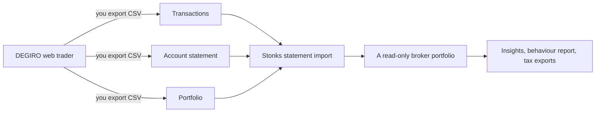

# DEGIRO

DEGIRO (flatexDEGIRO) comes into Stonks through the files you export from it. Stonks reads them only. It never logs in to DEGIRO and never places an order there.

This page says what DEGIRO offers officially, what Stonks built on it, and what is left out on purpose. Research date: 2026-09-29.



## What DEGIRO offers officially

**No API.** DEGIRO's helpdesk says it offers no API and that you cannot connect your account to another application.

- <https://www.degiro.com/uk/helpdesk/trading-platform/does-degiro-offer-api>
- <https://www.degiro.ie/helpdesk/trading-platform/does-degiro-offer-api>

**No bots or automated tools.** The helpdesk says trades cannot be automated, that third-party automation tools and API wrappers break its terms, and that it has no plans for automated trading.

- <https://www.degiro.ie/helpdesk/trading-platform/can-i-automate-trades-or-use-trading-bots-degiro>

**The client agreement** (UK version): <https://www.degiro.com/data/pdf/uk/Client_Agreement_Investment_Services_Terms_and_Conditions.pdf>

- Art. 5.6: the client may not use Automated Tools (scripts, automated queries, any application programming interface) on the platform. Accounts found using them can be blocked.
- Art. 7.5: instructions may not be given in an automated way without asking DEGIRO first.
- Art. 3.2 and 7.2.1: only the client may use the login, and any use of it by a third party is not permitted.

**No developer programme announced.** The flatexDEGIRO newsroom and the 2025 results name no public API: <https://flatexdegiro.com/English/newsroom/news/default.aspx>. This is an absence of news, not a promise.

**Exports.** DEGIRO lets you download these yourself (<https://www.degiro.fi/helpdesk/tax/what-kind-reports-are-there-and-where-can-i-find-them>):

| Export | Formats | Where |
|---|---|---|
| Transactions | CSV, Excel, PDF | Inbox, then Transactions |
| Account statement | CSV, Excel, PDF | Inbox, then Account statement |
| Portfolio | CSV, Excel, PDF | Portfolio, then Export |
| Annual report | PDF only | Inbox, then Documents |

## Aggregators

| Aggregator | DEGIRO | Route | Verdict |
|---|---|---|---|
| SnapTrade | Listed, read only | `UNOFFICIAL_API`: your DEGIRO login typed into SnapTrade's portal | Refused |
| Plaid, Yodlee, Tink, GoCardless, finAPI, Salt Edge, Finicity | Not found for DEGIRO securities | PSD2 covers payment accounts at most | Not usable |
| Vezgo | Not listed | Crypto only | Not usable |

**SnapTrade.** SnapTrade's public brokerage list names DEGIRO with `auth_type: UNOFFICIAL_API` for both read and trade, and `allows_trading: false` (<https://api.snaptrade.com/api/v1/brokerages>). Its DEGIRO page says DEGIRO has no public developer API and that the link does not place trades (<https://snaptrade.com/brokerage-integrations/degiro-api>). Interactive Brokers, Schwab and Alpaca are `OAUTH` there.

So SnapTrade reaches DEGIRO with your login over DEGIRO's private web API. That is what articles 3.2, 5.6 and 7.2.1 of the client agreement forbid, the same as the unofficial libraries (degiro-connector, degiroapi). Stonks does not offer it:

- The console never lists DEGIRO as a connection.
- If a DEGIRO account shows up in a SnapTrade connection anyway, Stonks leaves it out: it is never stored, linked or synced (`connections/route_policy.py`).

**Portfolio trackers** such as Sharesight, Snowball Analytics, Parqet and Portfolio Performance also use the files you export (CSV or PDF), not a login:

- <https://www.sharesight.com/partners/degiro/>
- <https://help.snowball-analytics.com/import-degiro/>
- <https://parqet.com/en/blog/degiro>

## The chosen route

The one route that fits DEGIRO's terms is the one those trackers use: you export the CSV files by hand and import them. Stonks has ready presets for the three CSV exports, so you map nothing.

| Preset | File | Becomes |
|---|---|---|
| `degiro_transactions` | Transactions | One trade per line, in the account currency |
| `degiro_account` | Account statement | Dividends, dividend tax, deposits, withdrawals, interest, fees, currency conversions |
| `degiro_portfolio` | Portfolio | The holdings and cash on the day you exported it |

The result is a broker portfolio that reads only. Insights, the behaviour report, cash flows and the tax exports read it like a synced account.

## What the files look like

All three files are comma separated. Some start with a byte order mark. Dates are day first (`31-12-2025`) with the time in its own column (`15:31`). Most languages write a decimal comma inside quotes (`"-1950,60"`), English a decimal point, and French a space between thousands (`"1 950,60"`).

A money column comes with an unnamed neighbour:

- In **Transactions** the named column holds the amount and the next one its currency (`Price,,Local value,,`). Newer files put the account currency in the header instead (`Value EUR`, `Total EUR`).
- In the **Account statement** and **Portfolio** the named column holds the currency and the next one the amount (`Change,,Balance,,`, `Local value,,`).

### Transactions

The current layout, in English:

```text
Date,Time,Product,ISIN,Reference exchange,Venue,Quantity,Price,,Local value,,Value EUR,Exchange rate,AutoFX Fee,Transaction and/or third party fees EUR,Total EUR,Order ID,
```

| Language | Headers |
|---|---|
| Dutch | `Datum,Tijd,Product,ISIN,Beurs,Uitvoeringsplaats,Aantal,Koers,,Lokale waarde,,Waarde EUR,Wisselkoers,AutoFX Kosten,Transactiekosten en/of kosten van derden EUR,Totaal EUR,Order ID,` |
| German | `Datum,Uhrzeit,Produkt,ISIN,Referenzbörse,Ausführungsort,Anzahl,Kurs,,Wert in Lokalwährung,,Wert EUR,Wechselkurs,AutoFX-Gebühr,Transaktionsgebühren und/oder Fremdkosten EUR,Gesamt EUR,Order-ID,` |
| Spanish | `Fecha,Hora,Producto,ISIN,Bolsa de referencia,Centro de ejecución,Número,Precio,,Valor local,,Valor EUR,Tipo de cambio,Comisión AutoFX,Costes de transacción y/o externos EUR,Total EUR,ID Orden,` |
| French | `Date,Heure,Produit,Code ISIN,Bourse de référence,Lieu d'exécution,Quantité,Cours,,Valeur locale,,Valeur EUR,Taux de change,Frais AutoFX,Frais de courtage ... EUR,Total EUR,ID Ordre,` |
| Italian | `Data,Ora,Prodotto,ISIN,Borsa di riferimento,Sede di esecuzione,Quantità,Quotazione,,Valore locale,,Valore EUR,Tasso di cambio,Commissione AutoFX,Costi di transazione e/o di terze parti EUR,Totale EUR,ID Ordine,` |
| Portuguese | `Data,Hora,Produto,ISIN,Bolsa de referência,Local de execução,Quantidade,Preço,,Valor local,,Valor EUR,Taxa de câmbio,Custo AutoFX,Custos de transação e/ou de terceiros EUR,Total EUR,ID da Ordem,` |

The older layout has a currency column after every amount and no AutoFX column, for example `...,Kurs,,Wert in Lokalwährung,,Wert,,Wechselkurs,Transaktionsgebühren,,Gesamt,,Order-ID`. Both layouts are read.

- A sale has a negative quantity. Fees and the AutoFX cost are negative numbers.
- One order can fill in several lines with the same Order ID.
- The AutoFX cost is DEGIRO's fee for converting the currency of a trade in another currency.

### Account statement

```text
Date,Time,Value date,Product,ISIN,Description,FX,Change,,Balance,,Order Id
```

| Language | Headers |
|---|---|
| Dutch | `Datum,Tijd,Valutadatum,Product,ISIN,Omschrijving,FX,Mutatie,,Saldo,,Order Id` |
| German | `Datum,Uhrzeit,Valutadatum,Produkt,ISIN,Beschreibung,FX,Änderung,,Saldo,,Order-ID` |
| French | `Date,Heure,Date de,Produit,Code ISIN,Description,FX,Mouvements,,Solde,,ID Ordre` |
| Spanish | `Fecha,Hora,Fecha valor,Producto,ISIN,Descripción,Tipo,Variación,,Saldo,,ID Orden` |
| Italian | `Data,Ora,Data Valore,Prodotto,ISIN,Descrizione,...,Variazioni,,Saldo,,ID Ordine` |
| Portuguese | `Data,Hora,Data Valor,Produto,ISIN,Descrição,T.,Mudança,,Saldo,,ID da Ordem` |

The Description says what each line is. Stonks reads these, in every language above:

| Line | Examples | In Stonks |
|---|---|---|
| Buy or sell | `Buy 10 APPLE INC@210.5 USD (US0378331005)`, `Koop 3 @ 650,2 EUR`, `Kauf`, `Achat`, `Compra` | Left out: trades come from Transactions |
| Trade fee | `DEGIRO Transaction and/or third party fees`, `DEGIRO Transactiekosten en/of kosten van derden` | Left out: in the Transactions total |
| AutoFX leg of a trade | `FX Credit`, `FX Debit`, `Valuta Creditering`, `Währungswechsel (Einbuchung)` with the trade's Order Id | Left out: in the Transactions total |
| Dividend | `Dividend`, `Dividende`, `Dividendo`, `Fund Distribution` | Dividend |
| Dividend tax | `Dividend Tax`, `Dividendbelasting`, `Dividendensteuer`, `Impôts sur dividende`, `Retención del dividendo`, `Ritenuta sul dividendo` | Dividend, negative |
| Currency conversion not tied to a trade | the FX legs of a dividend | Other, so the cash adds up |
| Deposit | `iDEAL Deposit`, `flatex Deposit`, `iDEAL storting`, `SOFORT Einzahlung`, `Versement de fonds`, `Ingreso` | Deposit |
| Withdrawal | `Processed Flatex Withdrawal`, `flatex terugstorting`, `Auszahlung`, `Retrait de fonds` | Withdrawal |
| Interest | `Flatex Interest Income` | Interest |
| Fees | `DEGIRO Exchange Connection Fee`, `DEGIRO Aansluitingskosten`, `Frais de connexion`, `Custo de Conectividade`, `Transactiebelasting` | Fee |
| Transfer inside DEGIRO | `Degiro Cash Sweep Transfer`, `Money Market fund conversion`, `Overboeking van uw geldrekening bij flatexDEGIRO Bank` | Left out |
| Reservation | `Reservation iDEAL / Sofort Deposit` | Left out: booked again when it settles |
| Corporate action | `AANDELENSPLIT:`, `AKTIENSPLIT:`, `ISIN-WIJZIGING` | Left out: its trades come from Transactions |

A line Stonks does not know is skipped with its description as the reason, so you see it in the preview.

### Portfolio

```text
Product,Symbol/ISIN,Quantity,Closing,Local value,,Value in EUR
```

| Language | Headers |
|---|---|
| Dutch | `Product,Symbool/ISIN,Aantal,Slotkoers,Lokale waarde,,Waarde in EUR` |
| German | `Produkt,Symbol/ISIN,Anzahl,Schlusskurs,Wert,,Wert in EUR` |

The cash line has no ISIN, for example `CASH & CASH FUND & FTX CASH (EUR)`. The file carries no date, so you give the day you exported it.

### Annual report

The annual report is a PDF only (Inbox, then Documents). It holds the portfolio value at the start and end of the year and the dividends with their withholding. Stonks does not read it. The same figures come from the three CSV files.

## How the import works

- **Found from the headers.** The preview finds the export and its language from the first line. You can also name the preset (`--preset degiro_transactions` in the CLI, the What file is it? select in the console).
- **Numbers.** Each file's decimal mark is worked out once from all its amounts. A value with both marks reads the last one as the decimal mark, the same fix the generic import got for decimal commas.
- **Trades in the account currency.** A trade in USD on a EUR account comes in with the EUR total as the amount, the EUR value per share as the price, and the transaction fees plus the AutoFX cost as the fee. The local price, currency and exchange rate stay in the description. So price, fee and amount always agree, and tax lots are in the currency DEGIRO booked.
- **Instruments by ISIN.** Each ISIN maps to a ticker through the `isin` of the lake's `instruments`. When an ISIN has several listings, the reference exchange picks one (`NDQ` and `NSY` to `.US`, `EAM` to `.AS`, `XET` to `.XETRA`, and so on), then the trading currency. More than one left, or none, and the instrument stays by its ISIN and shows as not covered. Stonks never guesses. Ingest the instrument's metadata (`stonks ingest metadata`) and import again after an undo to map it.
- **No double counting.** Transactions give the trades. The Account statement gives the rest, and leaves out every line that belongs to a trade (its Order Id, or a currency leg at the same moment).
- **Duplicates.** Every line has a stable id from its meaning and its place among identical lines. The same file imported twice adds nothing. Two identical partial fills in one file stay two.
- **Undo.** Each import can be undone. It removes exactly the lines it added and works the holdings out again.
- **Holdings.** The latest Portfolio import sets the holdings and cash on its day. Activities dated after that day build on it. Without one, the holdings are what the trades add up to.
- **Tax.** The gains export counts imported trades as lots, and the dividends export counts imported dividends with their tax as withholding.

## Gaps

- **No trading.** DEGIRO has no API and forbids automated tools, so Stonks never places an order at DEGIRO. A DEGIRO portfolio has no stage guard, halts or reconcile because nothing trades there.
- **No sync.** You export and import again to bring the portfolio up to date. The duplicate protection makes that safe: import the full history each time, or only the new months.
- **Annual report.** PDF only. Not read.
- **Excel and PDF exports.** Not read. Use CSV.
- **Cash in several currencies.** The holdings add cash amounts as they are, so a small leftover in another currency is added to the account currency's cash without conversion.
- **Unknown lines.** A new kind of Account statement line is skipped until Stonks learns its words. The preview shows it.
- **Header variants.** The Dutch, English, French, Portuguese and Spanish headers come from real exports that people published. The German, Italian and some Spanish variants were pieced together from parsers, so the matching is by the start of each name and tolerant of small changes.
