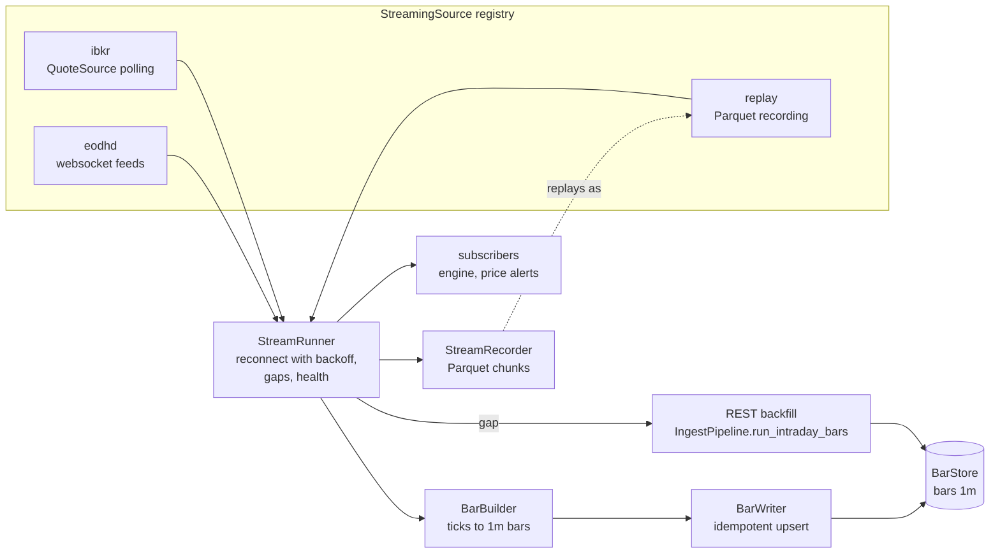
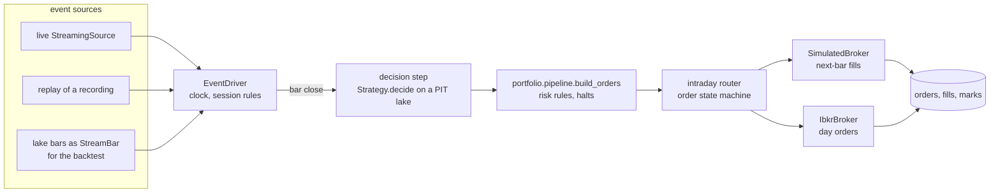

# Intraday trading

Design for roadmap Phase 21. It takes Stonks from one decision a day to decisions on minute bars, with live prices, a live event engine, intraday strategies, and the risk and monitoring an always-on loop needs.

Status: 21.1 (streaming data) built. 21.2 and 21.3 are planned and split into small work packages (section 9).

Owner decisions this page follows:

- Intraday comes after live daily trading is stable (Phase 19 stages).
- Research data stays EODHD (All-in-one). Live prices come from EODHD websockets and from Interactive Brokers.
- The broker is IBKR through the existing adapter. Alpaca stays off.
- Everything is off by default. A daily install sees no change.

Non-goals for this phase: tick-level strategies (sub-minute decisions), market making, options intraday, colocated or low-latency execution, and a second streaming vendor beyond EODHD and IBKR.

## 1. Goals

1. **One engine for research and live.** An intraday strategy decides on the close of a minute bar. The same code path decides in a replay of recorded data, in a backtest over lake bars, in paper and in live. Only the source of events and the broker change.
2. **Hermetic by default.** Every stream can be recorded to Parquet and replayed through the same interface. Tests replay recorded fixtures or talk to a fake websocket server on loopback.
3. **The lake stays the one store of prices.** Streamed ticks become 1m bars with the same columns as `bars`, written with idempotent upserts. A gap in the stream is backfilled from the REST intraday ingest.
4. **Safety first.** Per-minute loss limits, the kill switch and every halt act at the next event, not the next day. Stale data blocks new entries. Risk rules still only reduce exposure (P28, P40).
5. **Honest fills.** Intraday fills follow the same convention in the backtest and live (P21): a decision on a bar's close fills at the next bar, capped by that bar's volume (P20).

## 2. Where we start

| Piece | Today | Phase 21 adds |
|---|---|---|
| `Interval` (`core/interval.py`) | 1m to 5y, `is_intraday`, `visible_cutoff` | Nothing. Minute decisions already use the visibility rule (RS-03). |
| `Clock` (`core/clock.py`) | system, fixed and fake clocks | The replay source advances a `FakeClock` to each event, so the engine reads event time. |
| Intraday bars | `stonks ingest intraday`, `aggregate`, the `bars` table and the Parquet `BarStore` | Streamed 1m bars into the same store (21.1) |
| `DataSource` (`ingest/sources/base.py`) | REST pulls, `fetch_intraday_bars` | A separate `StreamingSource` seam for push data (21.1) |
| IBKR adapter (`execution/brokers/ibkr/`) | orders, executions, account, `QuoteSource` snapshots | A streaming source over its quotes (21.1), day orders during the session (21.2) |
| Order state machine (`execution/order_state.py`) | `pending` to `filled`, `unknown` after a timeout, `require_reconciled` | Reused as is by the intraday router (21.2) |
| Halts (`production/halts.py`) | kill switch, breakers, `operational`, `runaway`, `broker_drift` | An `intraday_loss` halt kind and a check on every event (21.3) |
| Scheduler | session, daily and interval triggers | Start the engine before the open and stop it after the close (21.2) |

## 3. The three work packages

### 21.1 Streaming data (built)

- **Events** (`core/stream.py`): `TradeTick`, `QuoteTick`, `StreamBar` and `Heartbeat`, frozen and vendor neutral. Timestamps are UTC. Tickers use the lake's ids (`AAPL.US`).
- **`StreamingSource`** (`streaming/base.py`): `stream(tickers)` connects, subscribes and yields events until the connection ends. `close()` ends it from another thread. Sources yield a `Heartbeat` when idle, so the runner can check time without data. A disconnect raises `StreamDisconnectedError`. A refused login raises `StreamAuthError` and is never retried.
- **Registry** (`streaming/registry.py`): each source is one module in `streaming/sources/` with a class decorated by `@register_stream_source`. Nothing edits a list.
- **`eodhd`**: EODHD's websocket feeds, one connection per feed. `.US` tickers go to the `us` trade feed (and `us-quote` when quotes are on), `.CC` to `crypto` and `.FOREX` to `forex`. The `websockets` library is imported only in this module. The key comes from `EODHD_API_KEY`.
- **`ibkr`**: polls the IBKR adapter's `QuoteSource` (market data snapshots) every few seconds and yields a `QuoteTick` when a quote changes. No new vendor code: it reuses the adapter's contracts, errors and pacing, under its own API client id (`[brokers.ibkr] client_ids.stream`, 15).
- **`replay`**: plays a recording back through the same interface, as fast as possible or at a speed factor, and can drive a `FakeClock`.
- **`BarBuilder`**: ticks to 1m bars with the columns of `bars`. Trades set open, high, low, close and volume. Quote-only feeds (forex, IBKR snapshots) build bars from the last price or the mid, with volume 0. A bar closes when a later tick arrives or when its minute plus a grace period has passed on the clock. A tick for a minute already closed is counted as late and dropped. `adj_close` equals `close`, like the REST intraday ingest.
- **`BarWriter`**: batches closed bars and upserts them into the `BarStore` (last write wins per `(ticker, timestamp, interval)`), so a replay, a backfill or a restart never duplicates a bar.
- **`StreamRecorder`**: writes every event, heartbeats included, to Parquet chunks under `<dir>/<day>/`. DuckDB writes the files, so no new Parquet library is needed.
- **`StreamRunner`**: the supervised loop. It reconnects with exponential backoff and jitter (reset once a connection delivers), never retries a refused login, and treats a silent stream during market hours as a disconnect. A gap (a disconnect, a silence, or the time since the open at startup) is backfilled through the REST intraday ingest `backfill_delay_seconds` after data flows again, so the vendor has finished the minute the stream came back in. The vendor's bars land after the stream's, and last write wins. Subscribers (the engine of 21.2, price alerts) get every event and every closed bar. One that raises is counted, never allowed to stop the stream. Health (state, connects, events per kind, bars written, late ticks, gaps, backfills, last error) renders as Prometheus families.
- **Settings**: `[streaming]` in `config/default.toml`, `enabled = false`. Operator entry point: `python -m stonks.streaming sources|run|record|replay`.

### 21.2 Live event engine (planned)

The engine turns events into decisions and orders. It has one driver loop, shared by the backtest, replay, paper and live.

- **One replay driver.** `EventDriver` pulls events from any `StreamingSource`. The backtest's intraday path becomes a source too: a `BarReplaySource` reads lake bars and yields `StreamBar` events in time order. So the backtest and live share the loop, the session rules, the decision step and the router. Only fills differ (simulated or broker).
- **The Clock.** Every time read in the engine comes from a `Clock`. Live uses `SystemClock`. Replay and the backtest use a `FakeClock` the source advances to each event, so rules like "no entries in the last 10 minutes" behave the same in both.
- **Decisions** happen on a bar close, through the existing `Strategy.decide` with a `PointInTimeLake` clamped to the decision bar (`visible_cutoff`, P12). The step builds orders through `portfolio.pipeline.build_orders`, the one pipeline the tick and the backtest share.
- **The order state machine** (`execution/order_state.py`) is reused unchanged. Intraday orders move `pending`, `submitted`, `accepted`, `partially_filled`, `filled`, or end `cancelled`, `expired` or `rejected`. A submit with no answer is `unknown`, and nothing is sent for that ticker until reconciliation settles it. The engine runs `startup_reconcile` and `require_reconciled` before it trades after any restart.

### 21.3 Intraday strategies, risk and monitoring (planned)

- **Strategies**: a few reference strategies that declare minute intervals (opening range breakout, VWAP reversion, intraday time-series momentum), each with a hypothesis card (P1) and lab support on sessions (walk-forward by session, embargo in bars, P9).
- **Risk**: registered `RiskRule`s and halts for the intraday loop (section 6).
- **Monitoring**: stream and engine health on the metrics endpoint, a dead-man on the engine heartbeat, event-to-order latency, a live panel in the console, and alerts.

## 4. Session rules

- Sessions come from the exchange calendars (`scheduling/calendar.py`): holidays, early closes and crypto around the clock.
- The engine trades only in regular hours. Pre-market and after-hours ticks are stored as bars but never decided on. `outside_rth` stays `False`, as the IBKR adapter enforces.
- No new entries in the first N minutes (the open is noisy) and the last M minutes (settings per book). Closing orders are always allowed.
- Optional flatten before the close: a book with `flatten_at_close` closes every position M minutes before the close with marketable limits.
- A trading halt (LULD pause, a stale ticker, no quote for too long) blocks new orders in that ticker until prices flow again.
- Early closes move every rule with the close.

## 5. Fills

| Where | Rule |
|---|---|
| Backtest and replay | A decision on the close of minute t fills at the open of minute t+1 (P21). A fill takes at most the participation cap of that minute's volume (P20). The rest stays working or expires, per order type. Limit and stop orders fill from the bar range, as `backtest/fills.py` does today. Recorded quotes add the half spread. |
| Paper | The simulated broker with the same rules, fed by the live stream. |
| Live | Marketable limit day orders at IBKR, collared by the price band (`price_band` rule), `tif = day`, never outside regular hours. Fills come from executions, as in Phase 19. |
| TCA | Decision price is the bar close, arrival price is the next bar's open or the quote at submit. The gap between backtest and live is recorded per order (P22). |

## 6. Safety

- **Per-minute loss limit.** A book whose marked equity falls more than X% within a rolling N-minute window opens an `intraday_loss` halt (buys) for the portfolio. A larger drop opens a halt of new orders and, when set, flattens. Clearing needs a reason, like every halt (P40, P41).
- **Intraday drawdown** from the day's high-water mark scales opening orders down, like `drawdown_scaling` (P27).
- **Kill switch and halts** are checked on every event, not once a run. The kill switch in stop-all mode also cancels working orders at the broker (`GlobalCanceller`).
- **Stale data.** No new entries while the stream is stale or reconnecting. Exits still go out on the last known prices with a tight collar.
- **Runaway guard.** A cap on orders per minute and per day per book. A burst above it drops opening orders and opens a `runaway` halt, as `max_orders_per_run` does.
- **Pattern day trader.** The account rules already count day trades (`pdt`). Intraday books on a margin account under the threshold are refused at configuration time.
- Every intraday rule only reduces exposure and never drops a closing order. The property tests over the rule registry cover them.

## 7. Testing

- Every stream can be recorded and replayed, so engine tests replay fixtures instead of calling vendors.
- `tests/fakes/eodhd_ws.py` is a scripted websocket server on loopback: login, subscribe, recorded messages, dropped connections and refused logins.
- The IBKR source is tested against a fake `QuoteSource` and against `FakeIbGateway`.
- Live contract tests (`tests/integration/live/test_eodhd_stream_live.py`) are marked `live` and need `STONKS_RUN_LIVE_TESTS=1` and `EODHD_API_KEY`.
- 21.2 adds a parity test: one recording through the backtest path and the live path gives the same decisions and orders.

## 8. What 21.1 built

- `core/stream.py`: the event types.
- `streaming/`: `base.py` (the seam and errors), `registry.py`, `sources/eodhd_ws.py`, `sources/ibkr.py`, `sources/replay.py`, `bars.py` (`BarBuilder`), `writer.py` (`BarWriter`), `recorder.py` (`StreamRecorder`, `read_recording`), `runner.py` (`StreamRunner`, `Backoff`, `PipelineBackfiller`), `health.py`, `settings.py`, `__main__.py`.
- `[streaming]` settings, off by default. A new `stream` role for the IBKR client ids (15, read only). `websockets` is a direct dependency, imported only in `sources/eodhd_ws.py`.
- No migration. Bars go to the existing `bars` store and recordings are Parquet files.
- Tests: unit tests per module, `tests/fakes/eodhd_ws.py` (the fake server), EODHD message fixtures in `tests/fixtures/streaming/` shaped after the vendor's documented messages, end to end runner tests (drop, reconnect, backfill, record and replay into the same bars), and a live contract test.
- The lake has one writer. `python -m stonks.streaming run` opens the lake itself, so it cannot run next to `stonks serve` on the DuckDB bar table. The Parquet bar store, or running the stream inside the process that owns the lake (21.2.5), avoids that.
- Not yet: the quality checker on streamed bars (the REST ingest keeps it), a scheduler job that starts the runner at the open (21.2.5), and the stream health on the API metrics endpoint (21.3.4).

## 9. Work packages

Shared files (`config.py`, `config/default.toml`, `cli.py`, router mounts, the MCP server, `pyproject.toml`, the docs) change only in the integration step after each wave.

| WP | Scope | Owns |
|----|-------|------|
| 21.1 Streaming data | The `StreamingSource` seam and registry, EODHD websocket and IBKR sources, bar builder, writer, recorder, replayer and the supervised runner. | `core/stream.py`, `streaming/*` |
| 21.2.1 Event driver | `EventDriver` over any `StreamingSource`, the `FakeClock` hand-off, bar-close dispatch, and `BarReplaySource` that turns lake bars into `StreamBar` events. | `engine/driver.py`, `streaming/sources/lake_bars.py` |
| 21.2.2 Decision step | Decide on a bar close through `Strategy.decide` and a minute `PointInTimeLake`, then `build_orders` per book. The intraday backtest runs on the driver. | `engine/step.py`, `backtest/intraday.py` |
| 21.2.3 Intraday router and fills | Orders through the state machine, next-bar fills with the participation cap and the half spread, day orders at IBKR, reconciliation of intraday fills. | `engine/router.py`, `backtest/fills.py` (additions), `execution/brokers/ibkr/orders.py` (day orders) |
| 21.2.4 Session rules | Regular hours only, no entries at the open and close edges, flatten before the close, per-ticker trading halts, early closes. | `engine/sessions.py` |
| 21.2.5 Engine process | The always-on process, scheduler jobs to start before the open and stop after the close, startup reconcile, restart and state recovery, the runner inside it. | `engine/process.py`, `scheduling/jobs.py` (jobs) |
| 21.3.1 Intraday strategies | Opening range breakout, VWAP reversion and intraday momentum with hypothesis cards, lab windows by session. | `strategies/examples/intraday_*.py`, `lab/dataset.py` (session windows) |
| 21.3.2 Intraday risk | The per-minute loss limit and `intraday_loss` halt kind, intraday drawdown scaling, orders per minute cap, the stale data gate, the kill switch per event. | `production/rules/intraday_*.py`, `production/halts.py`, a new SQLite migration |
| 21.3.3 Live marks and P&L | Minute marks from the stream, intraday P&L per book and strategy sleeve, intraday risk snapshots. | `production/intraday_pnl.py`, a new SQLite migration |
| 21.3.4 Monitoring | Stream and engine metrics on `/metrics`, the engine dead-man, latency from event to order, alerts, a live panel in the console. | `scheduling/metrics.py`, `api/routers/stream.py`, `web/src/app/pages/live/*` |
| 21.3.5 Intraday TCA | Spread from recorded quotes, arrival at the next minute, cost model calibration for minute trading. | `production/tca.py` (additions), `backtest/costs.py` (additions) |

Waves:

1. 21.1 (done).
2. 21.2.1, 21.2.4 and 21.3.1 in parallel.
3. 21.2.2, 21.2.3 and 21.3.2.
4. 21.2.5, 21.3.3, 21.3.4 and 21.3.5.
