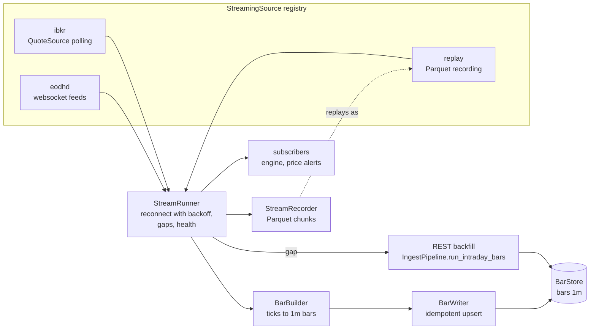
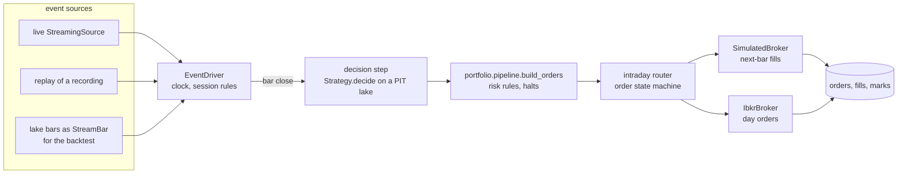
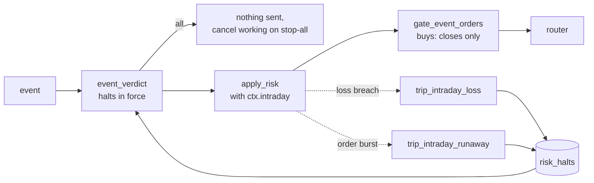
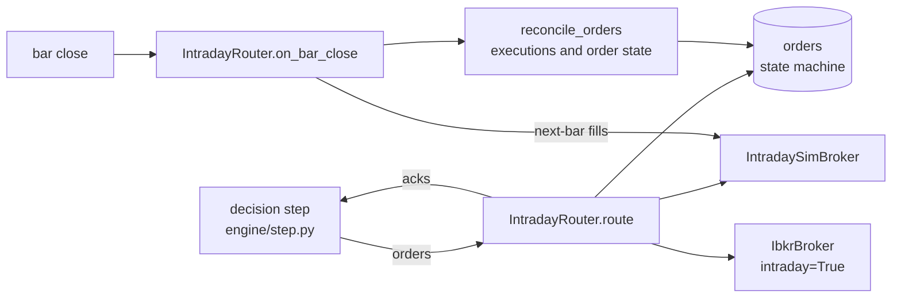
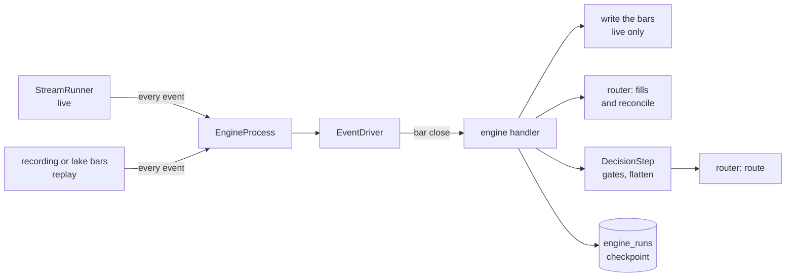
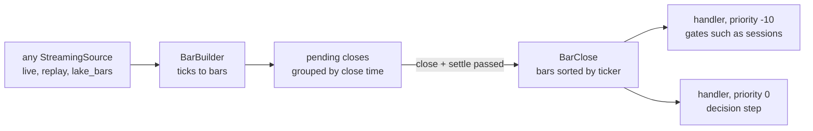
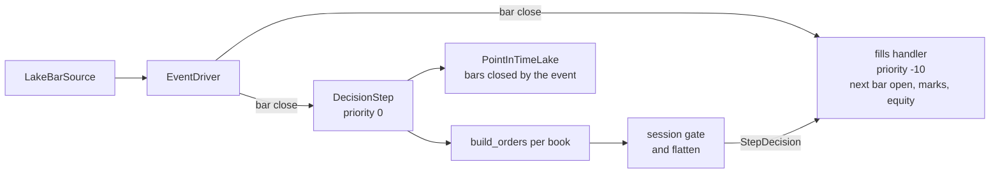
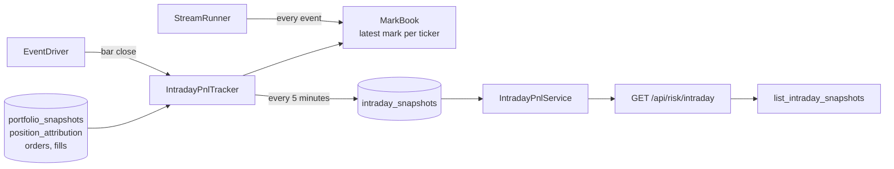
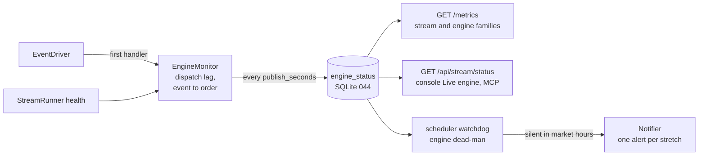
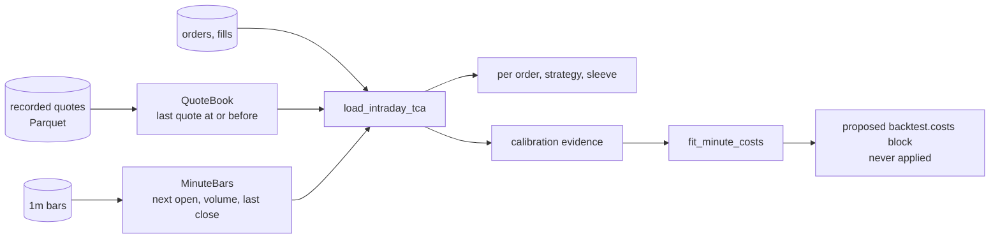

# Intraday trading

Design for roadmap Phase 21. It takes Stonks from one decision a day to decisions on minute bars, with live prices, a live event engine, intraday strategies, and the risk and monitoring an always-on loop needs.

Status: 21.1 (streaming data), 21.2.1 (event driver), 21.2.4 (session rules) and 21.3.1 (intraday strategies) built. The rest of 21.2 and 21.3 is planned and split into small work packages (section 9).

Status: 21.1 (streaming data) and 21.2.3 (the intraday router and fills, section 9) built. The rest of 21.2 and 21.3 is planned and split into small work packages (section 10).

Status: 21.1 (streaming data) and 21.2.5 (the engine process, section 9) built. The rest of 21.2 and 21.3 are split into small work packages (section 10).

Owner decisions this page follows:

- Intraday comes after live daily trading is stable (Phase 19 stages).
- Research data stays EODHD (All-in-one). Live prices come from EODHD websockets and from Interactive Brokers.
- The broker is IBKR through the existing adapter. Alpaca stays off.
- Everything is off by default. A daily install sees no change.

Non-goals for this phase: tick-level strategies (sub-minute decisions), market making, options intraday, colocated or low-latency execution, and a second streaming vendor beyond EODHD and IBKR.

## 1. Goals

1. **One engine for research and live.** An intraday strategy decides on the close of a minute bar. The same code path decides in a replay of recorded data, in a backtest over lake bars, in paper and in live. Only the source of events and the broker change.
2. **Hermetic by default.** Every stream can be recorded to Parquet and replayed through the same interface. Tests replay recorded fixtures or talk to a fake websocket server on loopback.
3. **The lake stays the one store of prices.** Streamed ticks become 1m bars with the same columns as `bars`, written with idempotent upserts. A gap in the stream is backfilled from the REST intraday ingest.
4. **Safety first.** Per-minute loss limits, the kill switch and every halt act at the next event, not the next day. Stale data blocks new entries. Risk rules still only reduce exposure (P28, P40).
5. **Honest fills.** Intraday fills follow the same convention in the backtest and live (P21): a decision on a bar's close fills at the next bar, capped by that bar's volume (P20).

## 2. Where we start

| Piece | Today | Phase 21 adds |
|---|---|---|
| `Interval` (`core/interval.py`) | 1m to 5y, `is_intraday`, `visible_cutoff` | Nothing. Minute decisions already use the visibility rule (RS-03). |
| `Clock` (`core/clock.py`) | system, fixed and fake clocks | The replay source advances a `FakeClock` to each event, so the engine reads event time. |
| Intraday bars | `stonks ingest intraday`, `aggregate`, the `bars` table and the Parquet `BarStore` | Streamed 1m bars into the same store (21.1) |
| `DataSource` (`ingest/sources/base.py`) | REST pulls, `fetch_intraday_bars` | A separate `StreamingSource` seam for push data (21.1) |
| IBKR adapter (`execution/brokers/ibkr/`) | orders, executions, account, `QuoteSource` snapshots | A streaming source over its quotes (21.1), day orders during the session (21.2) |
| Order state machine (`execution/order_state.py`) | `pending` to `filled`, `unknown` after a timeout, `require_reconciled` | Reused as is by the intraday router (21.2) |
| Halts (`production/halts.py`) | kill switch, breakers, `operational`, `runaway`, `broker_drift` | An `intraday_loss` halt kind and a check on every event (21.3.2, built) |
| Scheduler | session, daily and interval triggers | Start the engine before the open and stop it after the close (21.2) |

## 3. The three work packages

### 21.1 Streaming data (built)

- **Events** (`core/stream.py`): `TradeTick`, `QuoteTick`, `StreamBar` and `Heartbeat`, frozen and vendor neutral. Timestamps are UTC. Tickers use the lake's ids (`AAPL.US`).
- **`StreamingSource`** (`streaming/base.py`): `stream(tickers)` connects, subscribes and yields events until the connection ends. `close()` ends it from another thread. Sources yield a `Heartbeat` when idle, so the runner can check time without data. A disconnect raises `StreamDisconnectedError`. A refused login raises `StreamAuthError` and is never retried.
- **Registry** (`streaming/registry.py`): each source is one module in `streaming/sources/` with a class decorated by `@register_stream_source`. Nothing edits a list.
- **`eodhd`**: EODHD's websocket feeds, one connection per feed. `.US` tickers go to the `us` trade feed (and `us-quote` when quotes are on), `.CC` to `crypto` and `.FOREX` to `forex`. The `websockets` library is imported only in this module. The key comes from `EODHD_API_KEY`.
- **`ibkr`**: polls the IBKR adapter's `QuoteSource` (market data snapshots) every few seconds and yields a `QuoteTick` when a quote changes. No new vendor code: it reuses the adapter's contracts, errors and pacing, under its own API client id (`[brokers.ibkr] client_ids.stream`, 15).
- **`replay`**: plays a recording back through the same interface, as fast as possible or at a speed factor, and can drive a `FakeClock`.
- **`BarBuilder`**: ticks to 1m bars with the columns of `bars`. Trades set open, high, low, close and volume. Quote-only feeds (forex, IBKR snapshots) build bars from the last price or the mid, with volume 0. A bar closes when a later tick arrives or when its minute plus a grace period has passed on the clock. A tick for a minute already closed is counted as late and dropped. `adj_close` equals `close`, like the REST intraday ingest.
- **`BarWriter`**: batches closed bars and upserts them into the `BarStore` (last write wins per `(ticker, timestamp, interval)`), so a replay, a backfill or a restart never duplicates a bar.
- **`StreamRecorder`**: writes every event, heartbeats included, to Parquet chunks under `<dir>/<day>/`. DuckDB writes the files, so no new Parquet library is needed.
- **`StreamRunner`**: the supervised loop. It reconnects with exponential backoff and jitter (reset once a connection delivers), never retries a refused login, and treats a silent stream during market hours as a disconnect. A gap (a disconnect, a silence, or the time since the open at startup) is backfilled through the REST intraday ingest `backfill_delay_seconds` after data flows again, so the vendor has finished the minute the stream came back in. The vendor's bars land after the stream's, and last write wins. Subscribers (the engine of 21.2, price alerts) get every event and every closed bar. One that raises is counted, never allowed to stop the stream. Health (state, connects, events per kind, bars written, late ticks, gaps, backfills, last error) renders as Prometheus families.
- **Settings**: `[streaming]` in `config/default.toml`, `enabled = false`. Operator entry point: `python -m stonks.streaming sources|run|record|replay`.

### 21.2 Live event engine (planned)

The engine turns events into decisions and orders. It has one driver loop, shared by the backtest, replay, paper and live.

- **One replay driver.** `EventDriver` pulls events from any `StreamingSource`. The backtest's intraday path becomes a source too: `LakeBarSource` (`lake_bars`) reads lake bars and yields `StreamBar` events in time order. So the backtest and live share the loop, the session rules, the decision step and the router. Only fills differ (simulated or broker).
- **The Clock.** Every time read in the engine comes from a `Clock`. Live uses `SystemClock`. Replay and the backtest use a `FakeClock` the source advances to each event, so rules like "no entries in the last 10 minutes" behave the same in both.
- **Decisions** happen on a bar close, through the existing `Strategy.decide` with a `PointInTimeLake` clamped to the decision bar (`visible_cutoff`, P12). The step builds orders through `portfolio.pipeline.build_orders`, the one pipeline the tick and the backtest share.
- **The order state machine** (`execution/order_state.py`) is reused unchanged. Intraday orders move `pending`, `submitted`, `accepted`, `partially_filled`, `filled`, or end `cancelled`, `expired` or `rejected`. A submit with no answer is `unknown`, and nothing is sent for that ticker until reconciliation settles it. The engine runs `startup_reconcile` and `require_reconciled` before it trades after any restart.

### 21.3 Intraday strategies, risk and monitoring (planned)

- **Strategies** (21.3.1, built): `intraday_orb`, `intraday_vwap_reversion` and `intraday_momentum` in `strategies/examples/`, each with a hypothesis card (P1). They read the regular session from the exchange calendar, decide on closed minute bars only and are flat before every close. The lab splits an intraday dataset by whole sessions, with an embargo of whole sessions (P9), and walk-forward folds count sessions. See `docs/strategies/intraday.md`.
- **Risk** (21.3.2, built): registered `RiskRule`s and halts for the intraday loop (section 6).
- **Live marks and P&L** (21.3.3, built): the latest mark per ticker, intraday P&L per book and strategy sleeve, and intraday risk snapshots every few minutes.
- **Monitoring** (21.3.4, built): stream and engine health on the metrics endpoint, a dead-man on bar closes, event-to-order latency, a live panel in the console, and alerts.

## 4. Session rules

- Sessions come from the exchange calendars (`scheduling/calendar.py`): holidays, early closes and crypto around the clock.
- The engine trades only in regular hours. Pre-market and after-hours ticks are stored as bars but never decided on. `outside_rth` stays `False`, as the IBKR adapter enforces.
- No new entries in the first N minutes (the open is noisy) and the last M minutes (settings per book). Closing orders are always allowed.
- Optional flatten before the close: a book with `flatten_at_close` closes every position M minutes before the close with marketable limits.
- A trading halt (LULD pause, a stale ticker, no quote for too long) blocks new orders in that ticker until prices flow again.
- Early closes move every rule with the close.

## 5. Fills

| Where | Rule |
|---|---|
| Backtest and replay | A decision on the close of minute t fills at the open of minute t+1 (P21). A fill takes at most the participation cap of that minute's volume (P20). The rest stays working or expires, per order type. Limit and stop orders fill from the bar range, as `backtest/fills.py` does today. Recorded quotes add the half spread. |
| Paper | The simulated broker with the same rules, fed by the live stream. |
| Live | Marketable limit day orders at IBKR, collared by the price band (`price_band` rule), `tif = day`, never outside regular hours. Fills come from executions, as in Phase 19. |
| TCA | Decision price is the bar close. Arrival price is the next minute's open (section 10). The gap between backtest and live is recorded per order (P22). |

## 6. Safety

Built in 21.3.2. Every rule is off by default and set under `[production.risk.rules.*]`, where overrides only tighten.

- **What the rules read.** The engine puts an `IntradayContext` (`production/rules/_intraday.py`) on `RiskContext.intraday`: the event time, the session's equity marks, the latest bar time per ticker, the times of orders already sent, and whether the stream is stale. A daily book has none, and the intraday rules leave its orders alone. Nothing stamped after the event is read (P12).
- **Per-minute loss limit** (`intraday_loss_limit`). The loss is the fall from the highest mark in the last `window_minutes` to the current value. Past `max_loss` opening orders are dropped and `trip_intraday_loss` opens an `intraday_loss` halt (buys) for the portfolio. Past `hard_loss` the halt stops every new order (an open buys halt is escalated). With `flatten` the rule also closes every position at once, and the halt stays on buys so those closes get out. Clearing needs a reason, like every halt (P40, P41).
- **Intraday drawdown** (`intraday_drawdown`) from the day's high scales opening orders with a schedule and the same hysteresis as `drawdown_scaling` (P27).
- **Kill switch and halts** are checked on every event by `production/intraday_halts.py`: `event_verdict` reads the halts in force (global, the owner's, the portfolio's and its parent's), and `gate_event_orders` keeps only closes under a buys halt and nothing under stop-all. `cancel_working` tells the engine to cancel working orders at the broker (`GlobalCanceller`) when a stop-all kill switch is on.
- **Stale data** (`intraday_stale_data`). No opening order when the latest bar of its ticker is older than `max_bar_age_seconds`, when it has no bar, or while the stream is stale or reconnecting. Exits still go out on the last known prices. The tight collar on those exits belongs to the router (21.2.3).
- **Runaway guard** (`intraday_order_rate`). A cap on orders per minute and per day per book. Closes use the room first and always go out. Opening orders over it are dropped, lowest score first, and `trip_intraday_runaway` opens a `runaway` halt, as `max_orders_per_run` does.
- **Pattern day trader.** The account rules already count day trades (`pdt`). Intraday books on a margin account under the threshold are refused at configuration time.
- Every intraday rule only reduces exposure and never drops a closing order. Property tests (`tests/property/test_intraday_rules_properties.py`) cover it over random books, marks, bar times and sent orders.
- Migration 042 adds `intraday_loss` to the halt kinds. It rebuilds `risk_halts` with its rows, ids, counter, indexes and triggers, and `reconcile_reports` around it, because that table refers to the halts.

## 7. Testing

- Every stream can be recorded and replayed, so engine tests replay fixtures instead of calling vendors.
- `tests/fakes/eodhd_ws.py` is a scripted websocket server on loopback: login, subscribe, recorded messages, dropped connections and refused logins.
- The IBKR source is tested against a fake `QuoteSource` and against `FakeIbGateway`.
- Live contract tests (`tests/integration/live/test_eodhd_stream_live.py`) are marked `live` and need `STONKS_RUN_LIVE_TESTS=1` and `EODHD_API_KEY`.
- 21.2 adds a parity test: one recording through the backtest path and the live path gives the same decisions and orders.

## 8. What 21.1 built

- `core/stream.py`: the event types.
- `streaming/`: `base.py` (the seam and errors), `registry.py`, `sources/eodhd_ws.py`, `sources/ibkr.py`, `sources/replay.py`, `bars.py` (`BarBuilder`), `writer.py` (`BarWriter`), `recorder.py` (`StreamRecorder`, `read_recording`), `runner.py` (`StreamRunner`, `Backoff`, `PipelineBackfiller`), `health.py`, `settings.py`, `__main__.py`.
- `[streaming]` settings, off by default. A new `stream` role for the IBKR client ids (15, read only). `websockets` is a direct dependency, imported only in `sources/eodhd_ws.py`.
- No migration. Bars go to the existing `bars` store and recordings are Parquet files.
- Tests: unit tests per module, `tests/fakes/eodhd_ws.py` (the fake server), EODHD message fixtures in `tests/fixtures/streaming/` shaped after the vendor's documented messages, end to end runner tests (drop, reconnect, backfill, record and replay into the same bars), and a live contract test.
- The lake has one writer. `python -m stonks.streaming run` opens the lake itself, so it cannot run next to `stonks serve` on the DuckDB bar table. The Parquet bar store, or running the stream inside the process that owns the lake (21.2.5), avoids that.
- Not yet: the quality checker on streamed bars (the REST ingest keeps it) and a scheduler job that starts the runner at the open (21.2.5). The stream health reaches the API metrics endpoint through the engine status row (21.3.4, section 10).

## 8a. What 21.2.4 built

`engine/sessions.py` holds the session rules as pure functions. It imports nothing from the driver, so the event driver, the intraday backtest and replay all call the same code.

- `session_state(at, ticker, calendar=..., rules=..., halts=...)` returns a `SessionState`: the phase, the session, the halt if any, and `can_open`, `can_close`, `must_flatten`, `reason` and `minutes_to_close`.
- Phases, first match wins:

| Phase | When | Entries | Exits |
|---|---|---|---|
| `closed` | outside regular hours, holidays, unknown calendar | no | no |
| `halted` | the ticker has an active trading halt | no | no |
| `flatten` | last `flatten_minutes`, only with `flatten_at_close` | no | yes, and close everything |
| `closing` | last `entry_cutoff_minutes` | no | yes |
| `opening` | first `entry_delay_minutes` | no | yes |
| `regular` | the rest of the session | yes | yes |

- `SessionRules` is a frozen pydantic model: `entry_delay_minutes` (5), `entry_cutoff_minutes` (10), `flatten_at_close` (off) and `flatten_minutes` (5). Zero minutes turns an edge off. It is not wired into `config.py` yet. The engine process (21.2.5) or the book settings will carry it.
- Sessions come from `scheduling/calendar.py`. The edges are measured from each session's own open and close in UTC, so early closes and DST need no special case. A 24/7 calendar has no edges.
- Trading halts are data. `TradingHalt(ticker, start, end, reason)` with reason `luld`, `exchange`, `regulatory`, `news`, `stale` or `other`, and `end = None` while it lasts. `HaltTable` is an immutable value with `active`, `add` and `resume`. A halted ticker gets no orders at all, exits included, because the exchange would not take them.
- `SessionRulebook(rules, halts=...)` picks the calendar per ticker (by asset class, else by exchange suffix) and caches sessions per day. A ticker with no known calendar is `closed`.
- `gate_orders(orders, positions, state_for)` classifies orders against positions (`execution.orders.classify_all`) and keeps what the session allows. An order that crosses zero is split, so its closing leg survives an entry block (P28).
- `flatten_orders(positions, state_for, prices=..., collar_bps=...)` builds closing day orders in the flatten window: marketable limits when a price is known, else market orders. Client ids use the session date and the strategy id `flatten`, so a repeat on the next bar does not double up.
- Tests (`tests/unit/test_engine_sessions.py`) cover every phase, the NYSE early close on 2026-11-27, the 2026-07-03 holiday, both 2026 DST changes, 24/7 crypto, halts with and without an end, and the order gate and flatten orders.
- Not yet: feeding halts from a live source (LULD messages, the stale data gate of 21.3.2) and per-book settings.

## 9. The intraday router (21.2.3, built)

The router is the only part of the engine that talks to a broker. One router serves one book: one portfolio and its broker.

**The interface the step calls.** `route(orders) -> tuple[RouteAck, ...]` (`engine/router.py`, the `OrderRouter` protocol). One ack per order, in order. `route` never raises for one order and never fills. An ack has the client id, the ticker, a status and the order's state in the ledger:

| Status | Meaning |
|---|---|
| `sent` | At the broker now. |
| `known` | The client id was routed before. Nothing is sent again. |
| `rejected` | Refused by the router (not a day order) or by the broker. |
| `unknown` | Sent with no answer. Reconciliation settles it by client id. |
| `held` | Not sent: the router is not started, or the ticker waits for reconciliation. |

`ack.accepted` is true for `sent` and `known`. Fills never come back in an ack. They reach the ledger on a later event.

**Start.** `start()` runs `startup_reconcile` and `require_reconciled`. Until it passes, every order is `held`.

**The state machine.** Each order is committed `pending`, sent, then `submitted`, then synced by client id (`accepted` once the broker lists it). A rejection ends it `rejected`. A submit with no answer is `unknown`, and nothing more is sent for that ticker until reconciliation settles it. Other tickers keep trading. A missing `decided_at` is set to the clock.

**Day orders.** Every order goes out as a day order (`as_day_order`). No time in force means `day`, `ioc` stays, and `opg` or `gtc` are refused, since an intraday book ends with the session. `IbkrBroker(intraday=True)` checks the same rule again in `to_ib_order(intraday=True)`, so a day order is sent even though the daily default is the opening auction.

**Per event.** Register the router on the driver at `ROUTER_PRIORITY` (-10), before the step. On each bar close it first lets the simulated broker fill its working orders against the new bars, then reconciles the book's open orders through `execution.reconcile.reconcile_orders`. Both brokers report executions and order state, so the execution path books one fill per execution id, with its fee, and a repeat books nothing. With no open order the reconcile is skipped.

**The simulated intraday broker** (`engine/sim_broker.py`) behaves like a live broker:

- `place_order` never fills. The order waits for the next bar of its ticker. A bar that began before the decision bar closed is never used (P21).
- Each bar close runs every working order through `MinuteFillModel`. Cash, margin, short rules and the cost model come from a wrapped `SimulatedBroker`, and the cost model's fee is the execution's commission.
- The session of a bar comes from the ticker's exchange calendar (`calendar_session_key`). A day order whose next bar is in a later session expires. `expire_open()` ends every working order at the close.
- `on_quote` keeps the last recorded quote per ticker. Only a quote from before the fill bar's open is used.

**Minute fills** (`backtest/fills.py`, `MinuteFillModel` and `MinuteFillSettings`). The daily `BarFillModel` is unchanged. The minute model uses it for order types and the participation cap, then adds:

- the participation cap of the minute's volume, 10% by default (P20). A zero volume minute fills nothing and the order keeps working. `ioc` never carries,
- a gap guard in bars (`max_gap_bars`, 5 by default), not calendar days,
- day orders that expire in a new session,
- the half spread of a recorded quote: a buy pays half the spread above the open, a sell half below, never past a limit. Without a quote nothing is added. With recorded quotes, set the cost model's class half spread to zero, or the spread is paid twice.

`BarQuote` gains four optional fields (`bid`, `ask`, `gap_bars`, `new_session`) that the daily model ignores.

Not yet: the kill switch and halts on every event (21.3.2), the price band collar for intraday limits (the IBKR collar applies), flatten orders at the close through the router (the session rules build them, the engine process sends them, 21.2.5), and the parity test of one recording through the backtest and live paths (21.2.2 and 21.2.5).

## 9. The engine process (21.2.5)

`engine/process.py` runs the intraday books in one always-on process. It is off by default (`[engine] enabled = false`).

On each bar close the handler:

1. skips the close when a crashed run already handled it (the checkpoint),
2. writes the decision bars to the bar store in live mode, so the step reads them even before the runner's writer flushes,
3. lets each book's router fill simulated orders and reconcile,
4. tells the step about the new fills, so it knows who owns each holding,
5. runs the decision step (signals, `build_orders`, session gates, flatten orders),
6. routes each book's orders and writes the checkpoint and heartbeat.

**Startup.** Before the first order the process:

- marks any run row left `running` as `crashed`. The engine lock proves no other engine is up.
- rebuilds each simulated book from its starting cash and the ledger's fills, and ends its open orders, because they died with the old process.
- runs `startup_reconcile` and `require_reconciled` on every router. An order still `unknown` stops the start. Nothing is sent.

**Restart without re-sending.** Client ids are deterministic and the router never sends a client id already in the ledger, so a decision made again is `known`. A replay that resumes also skips every close up to the crashed run's checkpoint. A new simulated broker gets a new order id prefix, so its execution ids never repeat booked ones.

**Flatten.** A book with `flatten_at_close` gets closing orders from the step in the flatten window. They go through the router like any order. When the step fails on a bar, the engine still builds and sends the flatten orders.

**Stop.** A stop file in the control directory, a signal, the end of a replay, or the close plus `stop_after_close_minutes` ends the loop. Simulated day orders still working expire, and every book is reconciled once more.

**Control files** live in `[engine] control_dir` (default `engine` next to the state DB): `engine.lock` (an OS lock the running process holds, dropped by the OS if it dies), `stop` (a stop request) and `engine.log`.

**Scheduler jobs.** `engine_start` (open minus 15 minutes) starts a detached `python -m stonks.engine run`. `engine_stop` (close plus 10 minutes) writes the stop file and waits `stop_timeout_seconds`. Both work the same on the `api`, `in_process` and `local` backends, since they only touch the control files. Both skip while the engine is off, `engine_start` also on closed days and while an engine runs.

**Entry point.** `python -m stonks.engine run [--session D]`, `replay PATH [--session D --speed S --write-bars]`, `status` and `stop [--timeout S]`.

**Settings** (`engine/settings.py`, `[engine]`): `enabled`, `interval`, `calendar`, `source`, `universe`, `stale_after_seconds`, `threshold`, `control_dir`, the job times, and `[[engine.books]]` with `id`, `portfolio_id`, `strategies` (registry ids or catalog names), `broker` (`simulated` or `ibkr`), `initial_cash`, `construction` and `sessions`.

**Migration.** SQLite 041 adds `engine_runs` (status, heartbeat, checkpoint, counts, the run it recovered from).

**Parity.** `tests/unit/engine/test_process_parity.py` plays one recorded minute stream through the replay path and checks it gives the same orders and fills as the intraday backtest, with and without flatten.

**Limits.**

- The process opens the lake itself, like `python -m stonks.streaming run`. It cannot run beside `stonks serve` on a DuckDB lake. Running the engine inside the server is left to integration.
- Orders keep a strategy id in the ledger only for registered strategies. A catalog strategy or a flatten order is stored without one (`orders.strategy_id` references the registry). The process keeps the owner in memory.
- A replay trades simulated books only.

## 10. Work packages

Shared files (`config.py`, `config/default.toml`, `cli.py`, router mounts, the MCP server, `pyproject.toml`, the docs) change only in the integration step after each wave.

| WP | Scope | Owns |
|----|-------|------|
| 21.1 Streaming data | The `StreamingSource` seam and registry, EODHD websocket and IBKR sources, bar builder, writer, recorder, replayer and the supervised runner. | `core/stream.py`, `streaming/*` |
| 21.2.1 Event driver (built) | `EventDriver` over any `StreamingSource`, the `FakeClock` hand-off, bar-close dispatch, and `LakeBarSource` that turns lake bars into `StreamBar` events. | `engine/driver.py`, `streaming/sources/lake_bars.py` |
| 21.2.2 Decision step | Decide on a bar close through `Strategy.decide` and a minute `PointInTimeLake`, then `build_orders` per book. The intraday backtest runs on the driver. | `engine/step.py`, `backtest/intraday.py` |
| 21.2.3 Intraday router and fills (done) | Orders through the state machine, next-bar fills with the participation cap and the half spread, day orders at IBKR, reconciliation of intraday fills. | `engine/router.py`, `engine/sim_broker.py`, `backtest/fills.py` (additions), `execution/brokers/ibkr/orders.py` (day orders) |
| 21.2.4 Session rules | Regular hours only, no entries at the open and close edges, flatten before the close, per-ticker trading halts, early closes. | `engine/sessions.py` |
| 21.2.5 Engine process | The always-on process, scheduler jobs to start before the open and stop after the close, startup reconcile, restart and state recovery, the runner inside it. | `engine/process.py`, `scheduling/jobs.py` (jobs) |
| 21.3.1 Intraday strategies | Opening range breakout, VWAP reversion and intraday momentum with hypothesis cards, lab windows by session. | `strategies/examples/intraday_*.py`, `lab/dataset.py` (session windows) |
| 21.3.2 Intraday risk | The per-minute loss limit and `intraday_loss` halt kind, intraday drawdown scaling, orders per minute cap, the stale data gate, the kill switch per event. | `production/rules/intraday_*.py`, `production/intraday_halts.py`, `production/halts.py`, SQLite migration 042 (built) |
| 21.3.3 Live marks and P&L (built) | Minute marks from the stream, intraday P&L per book and strategy sleeve, intraday risk snapshots. | `production/intraday_pnl.py`, SQLite migration 043 |
| 21.3.4 Monitoring | Stream and engine metrics on `/metrics`, the engine dead-man, latency from event to order, alerts, a live panel in the console. | `scheduling/metrics.py`, `api/routers/stream.py`, `web/src/app/pages/live/*` |
| 21.3.5 Intraday TCA (built) | Spread from recorded quotes, arrival at the next minute, cost model calibration for minute trading (section 10). | `production/intraday_tca.py`, `backtest/cost_calibration.py` |

Waves:

1. 21.1 (done).
2. 21.2.1, 21.2.4 and 21.3.1 in parallel.
3. 21.2.2, 21.2.3 and 21.3.2.
4. 21.2.5, 21.3.3, 21.3.4 and 21.3.5.

## 10. What 21.2.1 built

- **`engine/driver.py`**: `EventDriver(source, clock=..., interval=1m, settle=...)`.
  - `run(tickers)` pulls the source until it ends or `stop()` is called. `on_event(event)` is public, so the driver can also be a `StreamRunner` subscriber.
  - Every event goes through a `BarBuilder`. Ticks become bars, and a bar a source delivered passes through.
  - Bars that close at the same moment make one `BarClose` (`at`, `interval`, `bars` sorted by ticker, `sequence`). It is dispatched once `at + settle` has passed (settle is the builder's grace, 2 seconds by default), so a slow ticker's bar for the same minute is still in it.
  - A bar that closes at or before a moment already dispatched is late. It is dropped and counted.
  - With a `FakeClock` the driver owns time. Event time moves the clock forward, never back. During a dispatch the clock reads `at + settle`, the moment a live run decides at. With any other clock (live) the driver only reads it.
  - A finite source closes and dispatches every bar at its end. A live stream that ends or is stopped keeps the bar in progress. A disconnect propagates and keeps pending closes, so the next `run` carries on.
- **The handler interface.** A handler is an object with `on_bar_close(event: BarClose)` (the `BarCloseHandler` protocol) or a plain callable. `register(handler, name=..., priority=0)` returns its unique name. Handlers run by `priority` (lower first), then registration order. Gates such as the session rules (21.2.4) register with a negative priority and the decision step (21.2.2) at 0. A handler that raises is logged and counted in `DriverStats.handler_errors` by name, and the others still run.
- **`streaming/sources/lake_bars.py`**: `LakeBarSource(reader, start=, end=, interval=1m, clock=, chunk=1 day)`, registered as `lake_bars`. It reads the lake (anything with `get_bars`, such as `DuckDBLake`) one chunk at a time and yields `StreamBar` events by time, then ticker. A bar is yielded only once closed: the `FakeClock` is set to its close first, and a bar that closes after `end` is never read (P12). Rows that are not sound bars are skipped and counted. It has no settings, so the backtest builds it in code.
- **Tests**: `tests/unit/engine/test_driver.py` (grouping, the clock at dispatch, ticks through the builder, the same input giving the same event sequence in any arrival order, handler order, a raising handler isolated and counted, late bars, live mode, stop and disconnect, and lake bars giving the same events as the same bars fed directly) and `tests/unit/streaming/test_lake_bars.py` (order, point in time, chunked reads, bad rows, a real lake).
- No migration, no settings, no CLI. `engine/__init__.py` imports nothing.

## 11. What 21.2.2 built

- **`engine/step.py`**: `DecisionStep(strategies, books, lake, universe=, portfolio=, on_decision=)`, a driver handler named `decision_step`.
  - On each bar close it updates the marks (last close per ticker, carried forward) and opens a `PointInTimeLake` for the bar that just closed, with the driver's interval as the decision interval. A strategy sees only bars closed by the event time (P12).
  - Strategies get `as_of` = the start of the decision bar in naive UTC, the same value the bar backtester passes. Session rules and `Order.decided_at` use the bar close in aware UTC.
  - Every strategy scores every universe ticker once per bar (`estimate_return`), shared by all books. A book that cannot short drops negative scores.
  - Per book (`StepBook`: construction, risk policy, strategy weights, `allow_short`, session rules) it runs `portfolio.pipeline.build_orders`. Client ids are `[<portfolio_id>:]<strategy>:<bar start>:<ticker>:<side>`, the bar backtester's format. Orders carry `portfolio_id`, `decided_at` and `decision_price`.
  - A book with `sessions` (a `SessionRules`) is gated by `gate_orders` and gets `flatten_orders` in the flatten window, which replace other orders for those tickers. A book without session rules is not gated (research parity).
  - `stale_after` blocks opening orders on a ticker without a recent bar. `fresh_reads` opens a new point-in-time session per bar, for a live lake that grows. `record_fill` tells the step who filled a holding, so its owner can exit it when nothing is picked.
  - The result is one `StepDecision` per book (orders, dropped orders with the reason, flattened tickers, the pipeline result), handed to `on_decision`.
- **`backtest/intraday.py`**: `IntradayBacktester(strategies, broker, lake, IntradayBacktestConfig(...))`.
  - `LakeBarSource` with a `FakeClock`, the `EventDriver`, a fills handler at priority -10 and the `DecisionStep` at 0. It is the loop a live run uses. Only the fills differ.
  - The fills handler fills orders queued on the previous close at this bar's opens (P21), carries deferred remainders as `<root>~<n>`, accrues financing, marks at the closes and records equity. A new decision replaces what is still queued. This is the bar backtester's convention, kept exactly.
  - The report is `compute_report` over the same equity points, so Sharpe and the other metrics match too.
- **Tests**: `tests/unit/engine/test_step.py` (the view stops at the closed bar, one scoring per bar for all books, client ids and decision fields, carried marks, opening edge, halts, flatten, the closing bar, exit owners from fills, a constructor book, shorts dropped, stale tickers) and `tests/unit/engine/test_intraday_backtest.py` (fills, equity curve and Sharpe equal to `Backtester` on the same minute bars for `single_winner` and `equal_weight_top_n`, one decision per bar close, no look-ahead, changing later bars leaves earlier fills alone, two runs and shuffled lake rows give the same fills, next-bar fills, session edges and flatten). The helper `tests/unit/engine/minute_lake.py` builds minute bars on real NYSE sessions and a toy minute momentum strategy.
- No migration, no settings, no CLI.
- Not yet: corporate actions, point-in-time membership, lagged market statistics for fills and short books in the intraday backtest (the bar backtester keeps them). The router of 21.2.3 replaces the fills handler. History-aware risk rules get no daily history in the step yet, so they skip.

## 10. What 21.3.3 built

- `production/intraday_pnl.py`:
  - `MarkBook`: the latest mark per ticker. A runner subscriber (call it with any event) and a driver handler. A trade sets the mark, a live quote its last trade or mid, a bar its close at the bar's end. A delayed quote and an older event never move it.
  - `PositionLedger`: one day of one book at average cost. Start positions are priced at the prior close (`lake_reference_prices` reads the lake), or at their first mark when there is none. A fill that reduces a position realises P&L, one that goes through zero opens the rest at the fill price. `realised + unrealised - fees` equals the change in value.
  - `IntradayPnlTracker`: a driver handler. On each bar close it marks the bars, books the day's fills whose time has come (so a replay never sees a later fill early, P12), and moves each book's high-water P&L. Every `snapshot_minutes` (5) and on `finish` it stores one row per book. A book is the whole portfolio or a strategy's sleeve (start positions from `position_attribution`, fills of the strategy's orders). The day's high is read back after a restart.
  - `IntradayPnlSettings` (`enabled`, `snapshot_minutes`, `stale_mark_seconds`), to mount as `[production.intraday_pnl]` in the integration step.
- SQLite migration 043: `intraday_snapshots`, one row per book and moment, unique on `(portfolio_id, strategy_id, at)`.
- `app/intraday_pnl.py` (`IntradayPnlService`), `GET /api/risk/intraday` (`data.read`, scoped to your portfolios, paged, `day`, `strategy_id`, `all_books`) and the MCP tool `list_intraday_snapshots`.
- Tests: the ledger math, and replays of recorded streams through the `replay` source and the driver (marks, fills in time, snapshots every five minutes, the high-water mark, restart, stale marks).
- Not yet: the engine process (21.2.5) that registers the tracker, and the console panel (21.3.4). The trading day is the UTC date of the bar close, which fits US and European sessions.

## 10. Monitoring (21.3.4)

The engine runs in its own process, so the API cannot read its memory. It writes a status row, and everything else reads that row.

- **`EngineMonitor`** (`engine/monitor.py`) registers two driver handlers. `monitor.dispatch` runs first on every bar close and records the dispatch lag, the clock time past the close plus settle (zero in a replay, by construction). `monitor.publish` runs last and writes the row, at most every `publish_seconds`. `record_order(event)` records event to order latency, from the dispatch of that bar close to the order. The decision step and the router call it. A failed write is logged and never reaches the engine.
- **Latency** lives in `LatencyHistogram`: fixed buckets from 10 ms to 60 s that render as Prometheus histograms. The console shows upper estimates of the median and the 95th percentile.
- **`engine_status`** (`engine/status.py`): one row per engine with its calendar, state, start, last update, stop, last dispatch and a JSON snapshot (stream health, driver counters, histograms). A row not updated for `stale_after_seconds` belongs to an engine that is not live, so its stream reports down too.
- **Metrics**: `engine_metric_families` renders the stream families of 21.1 plus the last event age, and the engine families (up, last dispatch age, bar closes, late bars, handler errors, both histograms), merged so each name appears once. `GET /metrics` appends them.
- **Dead-man** (`engine/deadman.py`): no bar close for `deadman_minutes` while the engine's market is open alerts the operator. It runs inside the scheduler's `DeadlineWatchdog` as an extra check and deduplicates in `scheduler_deadline_alerts`, like a missed deadline.
- **Status route**: `GET /api/stream/status` (`data.read`) adds live or not, market open, the dead-man state and scrubbed stream errors. Intraday P&L per book comes with 21.3.3. Until then the route carries a note, and the console shows it.
- **Settings**: `[streaming.monitor]` with `deadman_minutes` (5), `stale_after_seconds` (120) and `publish_seconds` (15).

## 10. Intraday TCA (21.3.5, built)

The daily TCA prices an order against the next session. An intraday order lives for minutes, so `production/intraday_tca.py` prices it against minutes and against the recorded quotes.

- **Which orders.** An order is intraday when its decision context names an intraday `interval`. Without one, an order placed outside a tick and not by a person counts, which is how the router records them.
- **Arrival** is the open of the first bar that starts at or after the decision, the price a backtest fills at (P21). Without that bar, the fills' recorded arrival price stands in, then the quote mid at that minute.
- **Spread** is the last valid quote at or before the decision and at or before each fill. A quote older than 60 seconds, a crossed quote or a quote with one side missing is not used.
- **Shortfall** uses the daily `compute_shortfall`, so the numbers compare. Impact splits into the quoted half spread paid (`spread`) and the rest (`residual`: slippage and impact beyond the spread). Opportunity cost uses the day's last minute close. The convention gap does not apply.
- **Groups**: per order, strategy, sleeve (portfolio and strategy), ticker, portfolio or day.
- **Calibration** fits `cost_bps = half_spread_bps + impact_bps * sqrt(quantity / bar_volume)`. The half spread per asset class is the median quoted half spread. Impact is least squares through the origin on what each fill paid over arrival, less its own quoted half spread, clipped to `[0, max_impact_bps]`. Under 10 quotes or 10 fills keeps the current value and says so.
- **Point in time.** Quotes, bars, orders and fills after the end date are never read.
- **Never applied.** The result is a `[backtest.costs]` block for a person to review. With recorded quotes the minute fill model already adds the quoted half spread, so books filled that way set `half_spread_bps` to 0.
- No migration: it reads `orders`, `fills`, the `bars` store and the recordings.
