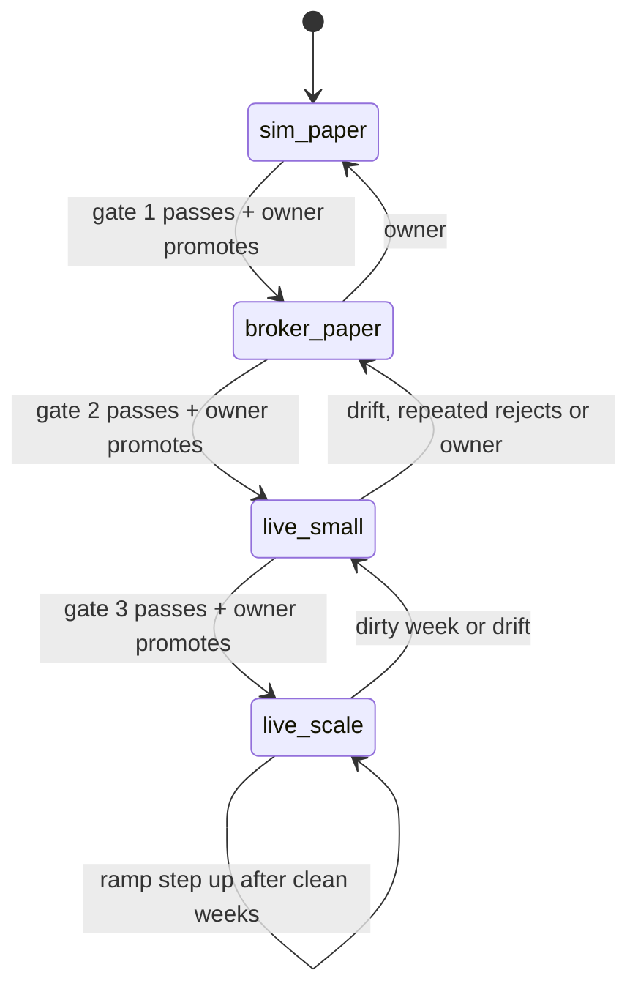
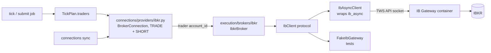
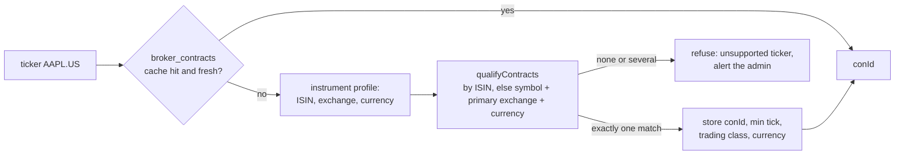
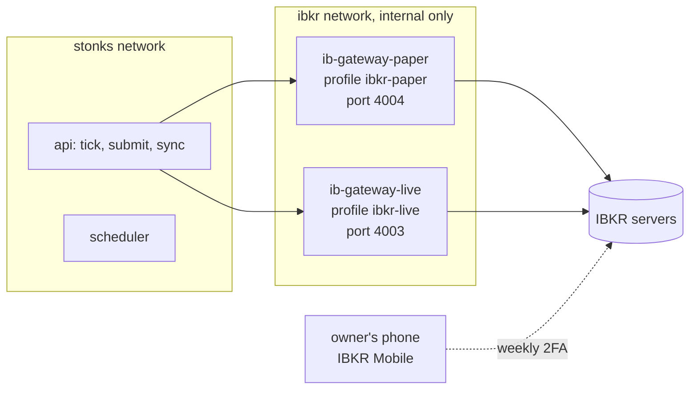
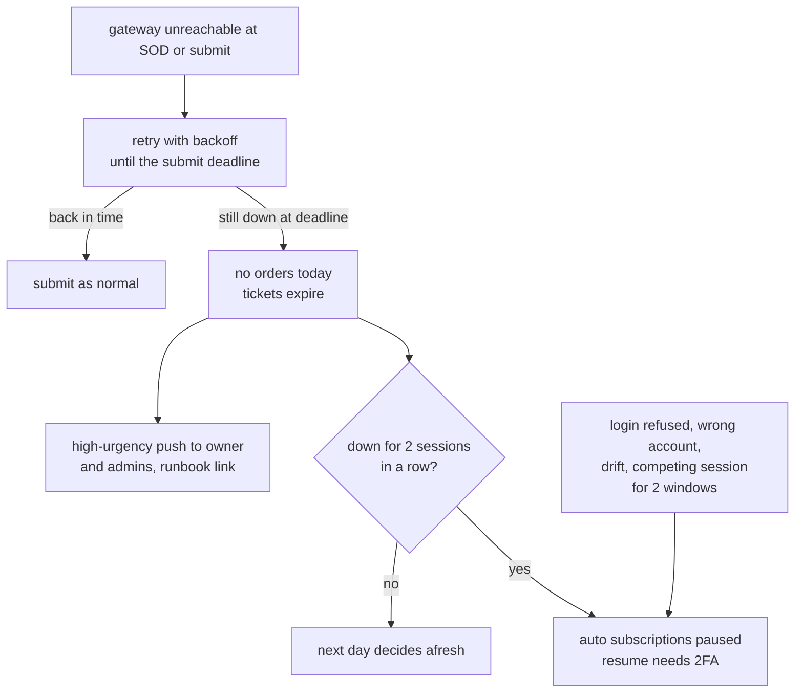
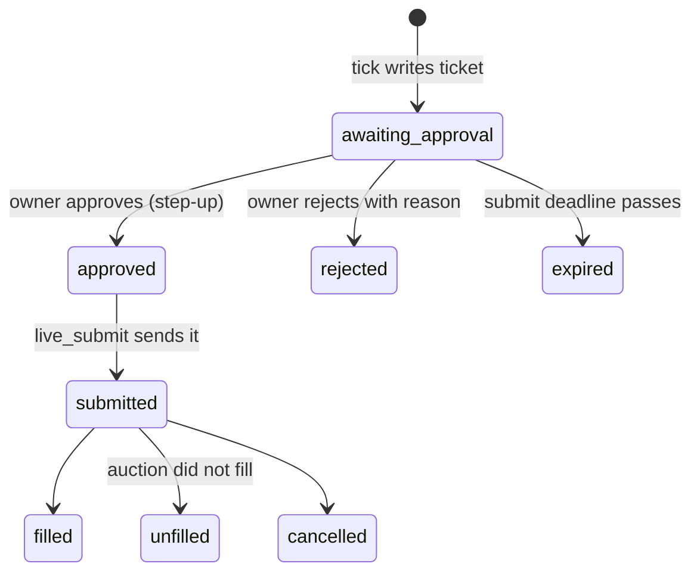
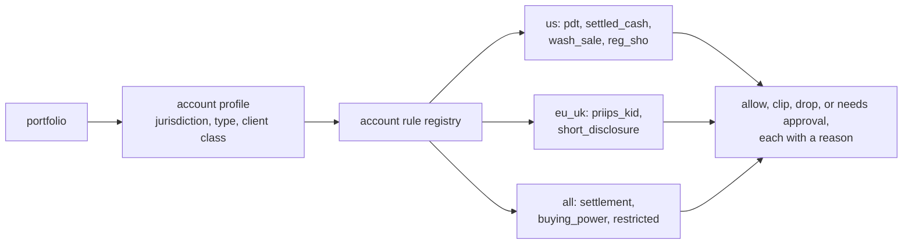
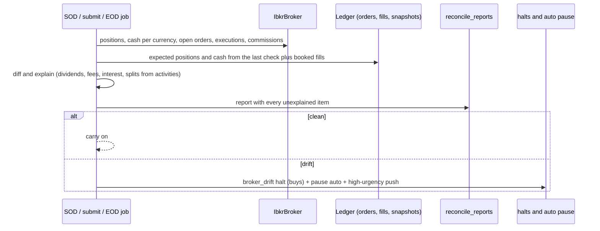

# Go live with real money

Design for roadmap Phase 19. It takes Stonks from simulated paper trading to real orders at Interactive Brokers (IBKR), in stages, with a gate between each stage.

Status: proposed. Nothing here is built yet.

Owner decisions (2026-09-27):

- Move from simulated paper to real trading in stages.
- The first broker is Interactive Brokers, through IB Gateway next to Stonks.
- The account location is not decided. Account rules are built for the US and for the EU and UK, and chosen per portfolio.
- Alpaca stays off.
- Secrets come only from the environment, never from git or TOML.

Non-goals for this phase: options (Phase 17), futures, crypto at IBKR, advisor and family sub-accounts, intraday strategies, and a second live broker.

## 0. Where we start

Most of the plumbing exists already. Phase 19 fills in the real broker and the guard rails around it.

| Piece | Today | Phase 19 adds |
|---|---|---|
| `Broker` protocol (`core/protocols.py`) | `fetch_portfolio`, `place_order`, `reconcile` | Nothing changes. New optional capabilities sit next to `OrderStateSource` and `OrderCanceller` in `execution/brokers/base.py`. |
| Brokers | `simulated`, `alpaca` (off), `make_broker` | `ibkr` wrapping `ib_async` |
| Connections | `BrokerConnection` seam, `alpaca`, `snaptrade`, `fake` providers. Only the fake one can trade. | An `ibkr` provider with `TRADE` and `SHORT`, whose `trader()` returns the IBKR broker |
| Tick | Books per portfolio. Auto books trade through `TickPlan.traders`. Rows are written `pending` before submit and fills come only from reconciliation. | A split between deciding (after the close) and submitting (before the open) for live books, tickets, and live safeguards |
| Modes | `notify`, `paper`, `auto`. Auto needs 20 paper days, 2FA step-up and a healthy trading connection. | `approve` between paper and auto |
| Halts | `risk_halts` with `kill`, breaker kinds and `operational`. The kill switch cancels working orders. | Kinds `broker_drift` and `runaway`, and a global cancel at IBKR |
| Auto pause | A broker error pauses the book's auto subscriptions | A difference between a short outage (skip and alert) and a real fault (pause) |
| TCA | Decision and arrival prices, shortfall against the cost model | Commissions from IBKR, and TCA as a stage gate |

## 1. Stages and gates

Every broker portfolio has a live stage. A stage only moves up by a logged human action that needs a passing gate report, a fresh second factor and a typed confirmation. It moves down on its own when a gate breaks (rules only reduce risk, P28 and P40).



| Stage | Money | Broker | Who trades |
|---|---|---|---|
| 0. `sim_paper` | none | `SimulatedBroker` | the tick, as today |
| 1. `broker_paper` | none | IBKR paper account (`DU...` id) through IB Gateway in paper mode | the tick, auto mode |
| 2. `live_small` | a small slice of a real account | IBKR live account (`U...` id) | approve mode first, then auto |
| 3. `live_scale` | the slice grows along the capital ramp | same | auto |

### What we measure

The same five numbers at every broker stage, stored per portfolio per session in `live_gate_days` (section 9, WP 19.9) and shown on the go-live page.

| Metric | How | Source |
|---|---|---|
| TCA gap | Realised implementation shortfall minus the cost model's estimate, in bps of traded value. Mean and a bootstrap 95% interval over the stage. | `production/tca.py`, IBKR commissions |
| Reconciliation drift | Count of unexplained differences between the broker and our ledger at each check: position quantity, unknown order, missing order, cash beyond tolerance, fill without commission. | `reconcile_reports` (section 6) |
| Rejections | Broker rejections over orders sent. Our own refusals (safeguards, account rules) are counted apart and are not failures. | `orders.status_reason` |
| Uptime | Share of submit windows where the gateway was connected, logged in to the right account and answering. | broker health checks |
| Stuck orders | Orders not terminal at the end-of-day check. | `orders`, EOD check |

A **clean week** is five sessions with zero unresolved drift at every end-of-day check, zero stuck orders, a rejection rate under 2%, every submit window up, no safeguard or account-rule halt, and every fill with its commission booked.

### Gate 0 to 1: simulated paper to broker paper

- Entry: the portfolio's strategies are `active` and passed go-live. The subscription finished 20 paper days (the existing auto gate). WP 19.1 to 19.6 are merged. The fake-gateway tests and the live contract tests against the paper account pass. The runbooks in section 7 exist.
- Measure: all five numbers. IBKR paper fills are simulated by IBKR, so the TCA gap here only proves the plumbing (commission booked, arrival price stored), not the cost model.
- Exit (gate 1 report): at least 20 trading days in `broker_paper`, the last 4 weeks clean, at least one weekly re-authentication handled, one gateway restart during a session and one forced disconnect recovered without drift, one kill switch drill and one broker outage drill done (section 7), and zero duplicate orders at IBKR (checked by `orderRef`).

### Gate 1 to 2: broker paper to live small

- Entry: gate 1 report passes. The owner funded the live account, picked the account-rules profile (section 5), bought the market data (section 10), and set the live safeguards. Defaults for this stage: capital ramp at 5% of net liquidation value, per-order notional cap 1,000 in base currency, per-day cap 5,000, 10 opening orders per run, approve mode on.
- Measure: all five numbers. Now the TCA gap is real, and approval latency is added (time from ticket to decision).
- Exit (gate 2 report): at least 8 weeks in `live_small`, the last 6 clean, at least 30 filled live orders, the mean TCA gap's 95% interval includes zero or sits below it (the cost model is not too cheap), and at least 2 weeks in auto after approve mode with nothing a human had to fix.

### Gate 2 to 3: live small to scale up

- Entry: gate 2 report passes.
- Measure: the same, per ramp step.
- Ramp: 5%, 10%, 25%, 50%, 100% of the capital the owner allocated to the portfolio. Each step up needs 4 clean weeks at the current step, a gate report, a reason and a step-up second factor. A dirty week drops one step on its own. Drift or a runaway halt drops back to `live_small` (5%).
- Exit: none. `live_scale` at 100% is steady state. The quit rule, the circuit breaker and the drift checks keep running.

### Stage state

- `portfolios.live_stage` holds the current stage and the ramp step.
- `live_stage_changes (id, portfolio_id, from_stage, to_stage, ramp_pct, actor, reason, gate_report_json, created_at)` is append-only, like `status_changes`.
- `stonks live stage show|promote|demote <portfolio> --reason "..."`, the same in the API (step-up) and on the go-live page. MCP can read stages but not promote.
- A promote needs a gate report computed at that moment, not a cached one.

## 2. The IBKR broker adapter

### Why ib_async and IB Gateway

- `ib_async` is the maintained successor of `ib_insync` (BSD-2, Python 3.10 or newer). It speaks the TWS API protocol itself, so IBKR's own `ibapi` package is not needed. It gives `qualifyContracts`, `placeOrder`, `cancelOrder`, `whatIfOrder`, `reqExecutions`, `fills`, commission reports, `accountSummary`, `positions`, `openTrades` and events for errors and disconnects.
- IB Gateway is the headless-friendly login process for the TWS API. TWS is the full desktop app. Both listen on a socket and need a logged-in IBKR session. We run IB Gateway, controlled by IBC, in the `gnzsnz/ib-gateway` Docker image.
- The Client Portal Web API is the other option. It needs its own gateway and a browser login too, and `ib_async` does not cover it. We don't use it.

### Where it sits



Both paths are used, as the accounts design planned:

- `execution/brokers/ibkr/` is the broker. The module the brief names, `ibkr.py`, grows into a small package: `broker.py` (`IbkrBroker`), `client.py` (the `IbClient` protocol and `IbAsyncClient`), `session.py`, `contracts.py`, `orders.py`, `errors.py`, `borrow.py`. `ib_async` is imported only in `client.py`, so vendor types never leave it.
- `connections/providers/ibkr.py` registers provider `ibkr` with `READ_BALANCES`, `READ_POSITIONS`, `READ_ORDERS`, `READ_ACTIVITY`, `TRADE` and `SHORT`. Its `trader(account_id)` returns an `IbkrBroker`. Auto books already reach traders through this seam, so the tick changes very little.
- `make_broker` learns `kind = "ibkr"` only for the legacy default book. New installs link a broker portfolio to an `ibkr` connection instead.

The connection holds no IBKR password. The gateway container holds the login. The connection record stores the gateway host, port, trading mode (`paper` or `live`) and the expected account id. These are settings, not secrets, but they are still sealed like other connection fields.

### IbkrBroker capabilities

| Capability | Method | IBKR call |
|---|---|---|
| `Broker` | `fetch_portfolio()` | `positions()`, `accountSummary()` |
| `Broker` | `place_order(order)` | `placeOrder` |
| `Broker` | `reconcile()` | executions and commission reports since the last call |
| `OrderStateSource` | `get_order_state(client_id)` | open trades, `reqCompletedOrders`, `reqExecutions`, matched by `orderRef` |
| `OrderCanceller` | `cancel_order(client_id)` | `cancelOrder` |
| new `GlobalCanceller` | `cancel_all()` | `reqGlobalCancel` (kill switch, stop all) |
| new `AccountReader` | `fetch_account()` | account summary tags (below) |
| new `MarginPreviewer` | `what_if(order)` | `whatIfOrder` |
| new `ExecutionSource` | `executions(since)` | `reqExecutions`, commission reports |
| new `QuoteSource` | `quotes(tickers)` | market data snapshot |
| `BorrowSource` (exists, `execution/borrow.py`) | `quote(ticker, day)` | shortable ticks plus IBKR's short stock file |

The new capabilities are `runtime_checkable` protocols in `execution/brokers/base.py`, like the existing two. Code that needs one checks `isinstance` and degrades when it is missing, so the simulated and fake brokers keep working.

### Orders

| Our field | IBKR field | Rule |
|---|---|---|
| `client_id` | `orderRef` | Idempotency key. The client id itself when it fits the length the live contract test measures, else a stable hash (`stk-` plus 20 base32 characters of its SHA-256). The value sent is stored in a new `orders.broker_ref`. |
| `quantity` | `totalQuantity` | Whole shares only in this phase. Rounded down. An order below one share is dropped with a reason. |
| `side` | `action` | `BUY` or `SELL`. A short sale is `SELL` with `position_effect = open`, checked against borrow first. |
| `order_type` `market` | `MKT` | Only for closing orders in an emergency path. Normal orders are collared limits. |
| `order_type` `limit` | `LMT` | Price rounded to the contract's minimum tick from `contracts.py`. |
| `order_type` `stop` | `STP` | Needs a new `Order.stop_price` field. |
| `order_type` `stop_limit` | `STP LMT` | `stop_price` plus `limit_price` |
| new `time_in_force` | `tif` | `opg` (the opening auction) by default for live books, `day` and `gtc` allowed. `gtc` only for protective stops. |
| new `outside_rth` | `outsideRth` | Always `False`. The adapter refuses `True` in this phase. |
| (none) | `account` | Always set to the portfolio's linked account id, so a login with several accounts never trades the wrong one. |
| (none) | `transmit` | `True`. A preview uses `whatIf` instead. |

**Default live order.** The tick decides at the close and the backtest fills at the next open. So a live book sends a limit-on-open order (`LMT` with `tif = OPG`) with a collar: the limit is the reference price plus the fat-finger band for a buy, minus it for a sell. This matches the backtest's fill convention (P21) and closes the gap TCA records today as `convention`. An order the auction does not fill is cancelled by IBKR and reported as unfilled. TCA books its opportunity cost.

**Idempotency.** IBKR has no server-side dedupe on `orderRef`, so the adapter does it:

1. The order row is committed as `pending` before any submit (the tick does this already).
2. `place_order` first asks `get_order_state(client_id)`. If IBKR knows the `orderRef` (open, completed today, or with an execution), it books that state and does not submit.
3. Otherwise it submits and stores IBKR's `permId` as `broker_order_id`. `orderId` is per API client and resets, so it is never stored as the key.
4. `reqCompletedOrders` and `reqExecutions` only reach back about a day. So an order must be settled the same session. The end-of-day check (section 6) enforces it, and the next morning's IBKR Flex statement is the backstop for older gaps.

**API client ids.** Each process role uses a fixed TWS API client id (`[brokers.ibkr] client_ids`: tick and submit 11, sync 12, health 13). The gateway's master API client id is set to the tick's id, so it sees orders from every client, and manual orders from TWS show up there too.

### Fills and commissions

- An execution report carries `execId`, `orderRef`, quantity, price and time. A commission report arrives later, keyed by `execId`, with commission and currency.
- Fills are booked from executions, one row per `execId`. New columns `fills.broker_exec_id` (unique per portfolio) make booking idempotent. `delta_fill` stays for brokers that only report cumulative state.
- The commission updates the fill's `fee` when it arrives. A fill with no commission after the end-of-day check is drift.
- The commission currency may differ from the base currency. The fee is stored in its own currency with the FX rate used, so TCA stays exact.

### Cancels

- `cancel_order(client_id)` finds the trade by `orderRef` and cancels it. It returns `False` for unknown or terminal orders, as the protocol says.
- The kill switch in stop-all mode also calls `cancel_all()` (`reqGlobalCancel`), which cancels orders placed from any client, TWS and mobile included, then books the result through reconciliation.
- A cancel is only done when IBKR reports `Cancelled`. `PendingCancel` stays working until the next check.

### What-if margin preview

`what_if(order)` sends the order with `whatIf = True`. IBKR does not transmit it and answers with the initial and maintenance margin change, equity with loan after the trade, and the commission estimate. We map that to our own `MarginPreview` type. It is used in three places:

- the live dry-run preview (section 4),
- the `account_rules` rule, as the broker's view of buying power for each buy (section 5),
- approval tickets, which show the commission and margin the trade will use.

A what-if that fails or times out never lets a buy through. The buy waits for a person or is dropped.

### Short sales: locate and borrow

- Before an opening sell, `IbkrBorrowSource.quote` reads the shortable indicator and the shortable shares from a market data snapshot. IBKR marks a name as easy to borrow, hard to borrow (locate needed), or not shortable.
- Fee rates come from IBKR's public short stock availability file, read once a day into a new lake table `borrow_rates (ticker, as_of, available_shares, fee_rate_annual, rebate_rate, source)`. This also closes the open 16.x item "a lake table of borrow rates".
- No quote means no short (`shorting.md` section 4). Hard-to-borrow names need an approval ticket even in auto mode.
- Account rules add Reg SHO and the EU short selling rules (section 5).

### Contract resolution

Our tickers are EODHD-style (`AAPL.US`, `VOD.LSE`). IBKR trades contracts identified by `conId`.



- A new state table `broker_contracts (broker, ticker, con_id, symbol, sec_type, exchange, primary_exchange, currency, min_tick, trading_class, isin, verified_at)` caches the answer. Unique on `(broker, ticker)` and on `(broker, con_id)`.
- The ISIN from the instrument's identifiers is tried first. Then symbol, `SMART` routing, the primary exchange mapped from `instruments.exchange`, and the currency. Share classes map `BRK-B.US` to IBKR's `BRK B`.
- Ambiguity is never guessed. Several matches, or a match whose currency or primary exchange disagrees with the instrument, refuse the ticker.
- Entries are re-verified weekly and when a split, ticker change or delisting reaches the lake.
- The reverse map for positions is by `conId`. An IBKR position with no mapped ticker is kept with its raw symbol, as the connection seam already does ("not covered"), and counts as drift for an auto book.
- London prices are quoted in pence (GBX) for many stocks. `contracts.py` keeps the price unit next to the currency, and the band and notional math converts both ways.

### Market data and pacing

- The tick decides on lake closes, as today. Live data is only needed for the fat-finger bands, the pre-open gap check and approval tickets.
- Quotes come from snapshot requests for the tickers of the day's orders only, a few dozen at most. This fits IBKR's default of 100 simultaneous market data lines.
- Without a subscription IBKR returns delayed data or an error. The adapter reports which one it got. A band check never uses a delayed quote as if it were live. It falls back to the lake close and marks the quote as `delayed`, and the band tightens (section 4).
- The TWS API allows about 50 messages a second. `ib_async` throttles requests on its own. We add our own token bucket per gateway in `session.py` for the sync and the health checks, so a burst never starves the submit path.
- Historical bars are never pulled from IBKR. The lake stays the one source of prices (EODHD and Yahoo).

### Account summary and positions

`fetch_account()` maps these account summary tags to our `BrokerAccount` plus a new `LiveAccountState`:

| IBKR tag | Our field |
|---|---|
| `NetLiquidation` | `equity` |
| `TotalCashValue` | `cash` (base currency) |
| `SettledCash` | `settled_cash` |
| `AvailableFunds` | `available_funds` |
| `BuyingPower` | `buying_power` |
| `ExcessLiquidity` | `excess_liquidity` |
| `DayTradesRemaining` | `day_trades_remaining` (US margin accounts) |
| `FullInitMarginReq`, `FullMaintMarginReq` | margin used |
| `AccountType` | checked against the portfolio's account profile |

Cash is read per currency too (`$LEDGER` values), because an EU or UK account often holds USD next to its base currency.

### Errors and reconnects

The client runs `ib_async` on its own event loop in one thread per gateway (`session.py`) and exposes a blocking facade, so the tick stays synchronous.

| IBKR signal | Meaning | Our reaction |
|---|---|---|
| 502, 504, socket closed | gateway not reachable | `BrokerUnavailable`: short outage path (section 3) |
| 1100 | gateway lost its link to IBKR | same, and stop sending until 1101 or 1102 |
| 1101, 1102 | link restored (1101 means market data lost) | resume, re-subscribe snapshots |
| 2104, 2106, 2158 | data farm OK | info only, never an error |
| 10197 | competing session (someone logged in with the same user) | `BrokerUnavailable` plus a high-urgency alert that names the cause |
| 201 | order rejected | `OrderRejectedError` with IBKR's text |
| 110 | price does not fit the minimum tick | bug in our rounding: reject and alert the admin |
| 354 | no market data subscription | quote marked missing, band falls back |
| 103 | duplicate order id | re-sync the next valid id, then re-check by `orderRef` before any retry |
| wrong account id or a `DU` account in live mode | misconfiguration | `LiveTradingRefusedError`, the book never trades |

- Reconnect uses exponential backoff with jitter, capped at 60 seconds, for up to the submit window's deadline.
- After every reconnect the adapter re-reads open orders and executions before it sends anything.
- **Account safety check.** On connect the adapter reads the managed accounts. Live mode requires a `U` account and `allow_live = true` and a portfolio stage of `live_small` or higher. Paper mode requires a `DU` account. Any mismatch refuses to trade. Paper and live gateways listen on different ports and run as different services, so a paper setting cannot reach the live account by accident.

## 3. Deployment

### The gateway in Compose

Two services under their own profiles in `deploy/compose.yaml`, never both by accident:



- Image `ghcr.io/gnzsnz/ib-gateway`, pinned to a stable tag and digest, updated on purpose like the Stonks image.
- `TRADING_MODE=paper` for one service and `live` for the other. Ports 4004 (paper) and 4003 (live) are the image's socat relays. They are exposed only on an internal Compose network that only `api` joins. Nothing is published on the host. VNC is off. It can be turned on over Tailscale for a one-off manual login.
- Settings: `READ_ONLY_API=no` (yes during a read-only soak), `TWS_ACCEPT_INCOMING=accept` (only our network can reach it), `AUTO_RESTART_TIME` at a quiet hour away from the tick and submit windows, `TIME_ZONE` set explicitly, `TWOFA_TIMEOUT_ACTION=restart`, `RELOGIN_AFTER_TWOFA_TIMEOUT=yes`.
- Memory: the gateway is a Java process. Plan about 1 GB per gateway. The 1-trader VM in `capacity.md` (4 GB) holds one gateway. Running paper and live at once wants the 8 GB size.
- Stonks connects with `[brokers.ibkr] host`, `port`, `mode` and `account_id`, set per connection. The `api` process runs the tick today, so it holds the session.

### Secrets

- The IBKR username and password go in Docker secret files (`TWS_USERID`, `TWS_PASSWORD_FILE`), mounted into the gateway container only. The Stonks containers never see them.
- Paper has its own username and password (`TWS_USERID_PAPER`, `TWS_PASSWORD_PAPER_FILE` when one gateway runs both, or its own service).
- The optional Flex Web Service token for statements is `STONKS_IBKR_FLEX_TOKEN` in `deploy/.env`, read by Stonks only.
- `.env.example` lists the names with empty values. `deploy/ibkr/README.md` explains the secret files. Nothing lands in git or TOML. The config loader rejects these fields in TOML, as it does for Alpaca keys.

### The re-authentication reality

- IB Gateway must restart once a day. With IBC's auto restart it reuses the session and needs no second factor.
- Once a week, after IBKR's Sunday reset (about 01:00 US Eastern), the session expires and a full login with 2FA is needed. IBC types the password, then IBKR pushes an approval to IBKR Mobile on the owner's phone.
- If the owner does not approve within the timeout, IBC restarts and asks again (`RELOGIN_AFTER_TWOFA_TIMEOUT=yes`).
- A login with the same username anywhere else (TWS, the web portal, the mobile app) kicks the gateway off ("competing session"). So the gateway uses a dedicated secondary username with trading rights, and the owner uses their main username for everything else.

Stonks makes this a routine, not a surprise:

| When | Job | What it does |
|---|---|---|
| Sunday, 18:00 owner time | `ibkr_reauth_reminder` | A push: "Approve the IBKR login on your phone tonight." |
| Every 5 minutes | `broker_health` | Connected, logged in, right account, server time answers within 2 s. Writes metrics. |
| Open minus 60 min | `live_sod_check` | Start-of-day check (section 6). If the gateway is down, a high-urgency push with the runbook link. |
| Open minus 20 min | `live_submit` | Sends approved and auto tickets as opening-auction orders |
| Close plus 15 min | `live_eod_check` | End-of-day check before the tick decides |
| Close plus 45 min | `tick` | Decides. Live books write tickets instead of sending orders. |

### When the gateway is down



- A short outage never sends yesterday's decisions late. Tickets expire at the submit deadline and the next tick decides again from fresh data.
- A real fault (login refused, wrong account, drift) pauses auto at once, through the existing `pause_auto`, with its audit row and notification.
- Exits wait too. A broker that is down cannot take a sell either. The protective stops (section 4) are the answer for positions that must be protected while Stonks cannot reach IBKR.

### Health and metrics

New Prometheus families in `scheduling/metrics.py`, labelled by portfolio (never by account number):

- `stonks_broker_connected` (0 or 1), `stonks_broker_last_ok_timestamp_seconds`
- `stonks_broker_orders_total{status}` (sent, filled, rejected, cancelled, refused_by_rule)
- `stonks_reconcile_drift_items` at the last check
- `stonks_tca_gap_bps` (rolling 20 fills)
- `stonks_live_stage` and `stonks_live_ramp_pct`
- `stonks_approval_tickets_pending`

`stonks health` gains a `broker` check per live portfolio. The global operational halt does not trip on a broker outage, because a broker belongs to a portfolio. The book skips instead, as above.

## 4. Live safeguards

New registered risk rules in `production/rules/`. They run only for books whose broker is live (a new `RiskContext.live` field holds the account state, quotes and stage). In backtests and paper books `ctx.live` is `None` and every one of them does nothing, so backtests stay identical. Like every rule they only drop or shrink opening orders, and never drop an order that closes a position (P28). The property tests in `tests/property/` pick them up from the registry.

| Rule | Runs | What it does |
|---|---|---|
| `capital_ramp` | whole-list rule, after `portfolio_vol` and before the circuit breaker (the exact `order` values are fixed in 19.6) | Scales opening buys so the book's gross exposure stays under ramp pct times the allocated capital, capped at the account's net liquidation value. |
| `live_notional_caps` | order-rule pass, before `cash_buffer` | Per-order cap and per-day cap for opening orders, per portfolio. A per-user and a global daily cap sit on top. The day's sent notional is read from `orders`. |
| `price_band` | order-rule pass, before `cash_buffer`, so cash sees the collared price | Fat-finger check. Sets or clamps the limit price of every order to the reference plus or minus the band. Drops an opening order whose reference moved beyond the gap limit since the decision. |
| `max_orders_per_run` | order-rule pass, after `cash_buffer` | At most N opening orders per run. Closing orders beyond a higher ceiling trip a `runaway` halt and send the whole run to approval. |
| `account_rules` | order-rule pass, before `min_order_notional` | Calls the account rules engine (section 5). |

### Settings

Under `[production.live]`, with portfolio and owner overrides that can only tighten (`RiskPolicy.tighter_of`):

```toml
[production.live]
# Capital ramp: the steps a stage walks through, in percent of allocated capital.
ramp_steps = [5, 10, 25, 50, 100]
clean_weeks_per_step = 4
allocated_capital = 0          # set per portfolio. 0 means nothing may open

[production.live.caps]
max_order_notional = 1000      # base currency
max_day_notional = 5000
max_user_day_notional = 10000
max_global_day_notional = 20000

[production.live.price_band]
band_pct = 0.02                # limit within 2% of the reference
nbbo_band_pct = 0.01           # and within 1% outside the bid or ask when live quotes exist
delayed_band_pct = 0.01        # tighter band when only a delayed quote or the lake close exists
max_gap_pct = 0.05             # drop an opening order when price moved more than 5% since the decision

[production.live.orders]
max_opening_orders_per_run = 10
max_closing_orders_per_run = 30

[production.live.approval]
expires_before_open_minutes = 20
required_for_hard_to_borrow = true

[production.live.stops]
enabled = false
atr_multiple = 3.0
```

### Fat-finger bands

- The reference is the last trade from a live snapshot when there is one, else the lake close. A buy limit may not exceed the reference plus `band_pct`, and may not exceed the ask plus `nbbo_band_pct` when a live quote exists. A sell mirrors it.
- The rule sets the price for our collared opening-auction orders, so a price is always present.
- IBKR's own precautionary settings in the gateway (maximum order value and size) are set too, as a second, independent layer.

### Max orders per run

A bug that emits 500 orders must not reach the broker. Opening orders beyond the limit are dropped in score order. Closing orders are never dropped, but a run that tries to close more than the ceiling is not sent: every order becomes an approval ticket and a `runaway` halt (mode `buys`) is opened for the portfolio.

### Capital ramp

- The ramp step is part of the portfolio's live stage (section 1).
- The rule scales only opening buys. A step down does not sell anything. The book shrinks as positions close in the normal course.
- Step changes write `live_stage_changes` rows with a reason.

### Approve mode

A fourth mode between paper and auto: `approve`. The tick decides, and every order waits for a person.



- Mode ladder: notify, paper, approve, auto. Switching to approve needs the same checklist as auto (20 paper days, active strategy, healthy trading connection, no halt, step-up). Moving from approve to auto needs nothing more, because approve already met the auto checklist.
- `order_tickets (id, portfolio_id, tick_id, client_id, order_json, preview_json, reason_json, status, expires_at, decided_by, decided_at, decision_reason, created_at)`. The ticket carries the client id, so a submitted ticket is idempotent like any order.
- The push is high urgency with a minimal payload, as the notification design requires: "3 orders wait for approval in Growth". No amounts or tickers leave the server.
- The ticket view in the console looks like an order ticket: side, ticker, quantity, limit, notional, the reason (signal, score, target weight), the what-if margin and commission, the band, and the risk and account rules that touched it. Approve one, reject one with a reason, or approve all for a run.
- Approving needs a fresh second factor (10 minutes). One TOTP covers every ticket approved in that window, so a batch takes one code. Phones use the installed PWA.
- MCP and API tokens can list tickets but cannot approve (step-up actions are UI-only).
- Auto books still create tickets, already `approved` by `service:system`. So the submit path is the same for both modes, and the ticket table is the audit trail of what was sent and why.
- Hard-to-borrow shorts and anything a `runaway` halt holds need approval even in auto mode.

### Live dry-run preview

`stonks live preview <portfolio>` and a "Preview tomorrow's orders" button:

1. Runs the tick's decision for one book on today's data, without writing anything.
2. Reads the live account (positions, cash, buying power) from IBKR.
3. Runs risk rules, live safeguards and account rules against it.
4. Calls `what_if` for every order.
5. Shows the tickets it would create, with what each rule changed and why.

It never transmits. It needs `trade` permission but no step-up, because it cannot place orders. The preview is also the first step of every stage promotion: the gate report embeds one.

### Broker-side protective stops (optional)

- Off by default (`[production.live.stops] enabled = false`), per portfolio.
- After an entry fills, the adapter places a GTC `STP` sell (or a buy stop for a short) at the fill price minus `atr_multiple` times ATR. The stop's client id is the entry's plus `:stop`, and the stop is in an OCA group per ticker.
- The tick re-sizes the stop when the position changes and cancels it when the position closes. Reconciliation treats a stop fill as a normal closing fill attributed to the strategy that held the lots.
- Stops only reduce risk. They protect a position while Stonks or the gateway is down. A stop fills at the market after a gap, so it limits time exposure, not the size of an overnight loss.

## 5. Account rules engine

The account rules decide what a real account may do under its jurisdiction and type. They are a registry, like risk rules, and run as the `account_rules` risk rule for live books.



**Account profile.** `account_profiles (portfolio_id, jurisdiction, account_type, client_class, base_currency, fx_policy, wash_sale_mode, updated_at, updated_by)`:

- `jurisdiction` in {`us`, `eu`, `uk`}. It follows the IBKR entity that holds the account, not the owner's passport.
- `account_type` in {`cash`, `margin`}. Shorts need `margin` (`allow_short` is refused on a cash profile).
- `client_class` in {`retail`, `professional`}. It decides the product restrictions.
- The profile is checked against IBKR's `AccountType` at connect. A mismatch refuses to trade.
- Changing a profile needs a step-up and an audit row. It can only be set before the first live stage, or with the book in `broker_paper`.

### Rules for every account

| Rule | What it checks |
|---|---|
| `settlement` | Tracks each fill's settlement date from the security's market, not the account's jurisdiction: US securities settle T+1. EU and UK markets settle T+2 today and plan to move to T+1 in October 2027, so the cycle is a setting per market. |
| `buying_power` | Buys fit IBKR's `AvailableFunds` (margin) or settled cash (cash), net of the other orders of the run. The what-if answer wins when it is stricter. |
| `restricted` | Drops buys of tickers on a restricted list: a per-portfolio list the owner keeps, and names IBKR refused earlier (cached from rejection text). |
| `fx_funding` | A buy in a currency the account does not hold enough of follows `fx_policy`: `refuse` (default), or `convert` (a separate FX order through IBKR before the buy, own ticket). A cash account never borrows a currency. |

### US rules

| Rule | What it checks |
|---|---|
| `pdt` | Pattern day trader rule for margin accounts under 25,000 USD equity: at most 3 day trades in 5 business days. We count day trades (open and close of the same ticker in one session, protective stops included) and cross-check IBKR's `DayTradesRemaining`. An order that would make the 4th is dropped (an open) or needs approval (a close, never dropped). FINRA has proposed replacing this rule, so the threshold and count are settings. A daily strategy rarely day-trades, but stops can. |
| `settled_cash` | Cash accounts: buys use settled cash only, and a position bought with unsettled funds is not sold before those funds settle (a good-faith violation). A would-be violation drops the buy. |
| `wash_sale` | A buy within 30 days of selling the same ticker at a loss is tagged in the journal. `wash_sale_mode` is `warn` (default) or `block` (drops the buy). Tax reporting stays with the broker. |
| `reg_sho` | Opening short sales need a borrow quote (the locate). When a stock is under the short sale price test (Rule 201, after a 10% fall from the prior close), an opening short must be a limit above the bid. Our collared order may not be, so the rule drops it. |

### EU and UK rules

| Rule | What it checks |
|---|---|
| `priips_kid` | Retail clients in the EU (PRIIPs) and the UK (the successor consumer-investment disclosure rules) cannot buy most US-domiciled ETFs, because they have no local key information document. The rule drops buys of funds whose domicile needs a document the instrument does not have (instrument metadata: `security_type`, domicile, and a per-instrument `kid_available` flag, filled from IBKR rejections and an owner list). Sells are always allowed. Professional clients skip it. |
| `short_disclosure` | EU and UK short selling rules: a net short position of 0.1% of issued shares must be reported to the regulator, and 0.5% is published. The rule caps each short so it stays below 0.1% (shares outstanding from the lake), unless the owner turns on reporting, which Stonks does not do for them. |
| `transaction_taxes` | Not a block. UK stamp duty and the French and Italian financial transaction taxes are costs. They go into the cost model per market (a `backtest/costs.py` addition), so lab and live agree. |

### Where the numbers come from

- The broker is the source of truth for cash, settled cash, buying power and day trades remaining.
- Our own counters (`settlement_ledger (portfolio_id, fill_id, currency, amount, trade_date, settle_date)`, day-trade count) exist to explain a refusal before IBKR sends it, and to catch drift. If ours and IBKR's disagree, the stricter one is used and the difference is reported as drift.

## 6. Reconciliation

The broker is the source of truth every run. Stonks' rows are a checked copy.



**Drift items.** Each has a kind, the ticker or order, our value, the broker's value and whether it was explained.

| Kind | Example | Explained by |
|---|---|---|
| `position_qty` | IBKR holds 100, we expect 90 | a fill we had not booked yet (then booked), a split |
| `unknown_position` | a ticker we never traded | none: a manual trade or a transfer |
| `unknown_order` | a working order with no `orderRef` of ours | none: placed by hand in TWS or mobile |
| `missing_order` | our `pending` row, IBKR never saw it | the existing "never received" rejection |
| `cash` | beyond `max(1 unit, 0.01% of NLV)` | dividends, interest, fees, deposits from activities |
| `commission_missing` | a fill with no commission after EOD | a late report (booked next check) |
| `rules_mismatch` | our settled cash or day-trade count differs from IBKR's | none |

**Policy.**

- Positions are exact. One share off is drift.
- Manual trades in a Stonks-managed account are not allowed by default (`[production.live] allow_manual_trades = false`). An unknown position or order opens a `broker_drift` halt (buys) for the portfolio and pauses its auto subscriptions. Closing orders keep working.
- With `allow_manual_trades = true`, a manual position is adopted into an `unmanaged` sleeve. Strategies never sell it and the risk rules count it.
- Clearing a `broker_drift` halt needs a reason, like every halt. The reconcile report is linked in the audit row.
- A drift item that stays unexplained for 2 checks demotes the stage one step (section 1).

**Start of day** (`live_sod_check`, open minus 60 minutes):

1. Gateway up, logged in, managed account matches the portfolio, mode matches the stage.
2. Yesterday's day orders and opening-auction orders are terminal. Anything still working from yesterday is cancelled and reported.
3. Positions and cash reconcile against the last end-of-day check plus overnight activities (dividends, corporate actions).
4. Buying power, settled cash and day trades remaining are read and stored for the submit.
5. Contract cache entries for today's tickets are fresh.
6. The optional Flex statement for the last session is fetched and compared with our fills and commissions. This is the official record and catches anything the socket missed.

**Submit** (`live_submit`): a short reconcile first (open orders and executions), then the gap check against pre-market quotes, then sending.

**End of day** (`live_eod_check`, close plus 15 minutes, before the tick decides):

1. Every order sent today is terminal (filled, partly filled then expired, unfilled, cancelled). Anything else is a stuck order and alerts.
2. Every execution is booked with its commission.
3. A snapshot with `source = broker` is written, so P&L, insights and risk read the broker's numbers.
4. The day's gate metrics are written to `live_gate_days`.

`reconcile_reports (id, portfolio_id, kind, taken_at, status, items_json, explained_json)`, kind in {`sod`, `submit`, `eod`, `adhoc`}.

## 7. Monitoring and operations

### Alerts

| Event | Urgency | Who |
|---|---|---|
| Gateway down at SOD or submit | high | owner, admins |
| Weekly re-auth reminder | normal | owner |
| Competing session | high | owner |
| Drift found, `broker_drift` halt | high | owner |
| `runaway` halt | high | owner, admins |
| Tickets waiting for approval | high | owner |
| Stuck order at EOD | high | owner |
| Order rejected by IBKR | normal (high when 3 or more in a run) | owner |
| TCA gap outside the band for 20 fills | normal | owner, admins |
| Stage demoted | high | owner, admins |

High urgency skips quiet hours, as the notification design says.

### Runbooks

New pages in `docs/runbooks/`. They also close the open Phase 12 item "broker unreachable".

- `broker-outage.md`: gateway down or login lost. Check `docker compose ps`, the gateway logs, the phone for a pending 2FA, a competing session. Restart the gateway service. What happens to today's tickets. When to resume paused auto.
- `stuck-order.md`: an order not terminal at EOD. Find it by `orderRef` in TWS. Cancel through Stonks (`stonks orders cancel <client-id>`), never by hand, so the ledger follows. What to do when IBKR shows `PendingCancel` for long.
- `reconcile-drift.md`: read the report, find the cause (manual trade, missed fill, corporate action), fix the ledger through reconciliation, clear the halt with a reason.
- `gateway-reauth.md`: the weekly login, changing the secondary user's password, what IBC does on a timeout.
- `kill-switch-drill.md`: the drill below.

### Kill switch drills

- Monthly in `broker_paper`, quarterly in live, and before every stage promotion.
- `stonks halts drill <portfolio>` places one tiny limit order far from the market (it cannot fill), engages the portfolio kill switch in stop-all mode, checks that IBKR reports the order `Cancelled` within 10 seconds and that `reqGlobalCancel` ran, then waits for a person to resume with `RESUME TRADING`.
- The drill writes a `kill_switch_drills` row with the timings. A gate report needs a passing drill from the last 30 days.

## 8. Testing

**Hermetic by default.**

- `IbClient` is a narrow protocol owned by us. `IbAsyncClient` wraps `ib_async`. `tests/fakes/ib_gateway.py` holds `FakeIbGateway`, an in-memory implementation that can be scripted: fills, partial fills, auction no-fills, rejections with IBKR codes, late commission reports, a disconnect in the middle of a submit, a gateway restart that forgets order ids, a competing session, a `DU` account in live mode, delayed quotes, a what-if timeout.
- `IbkrBroker` and the `ibkr` provider are tested only against the fake. So are the submit and reconcile jobs, the account rules and the safeguards.
- The existing fake trading connection keeps serving generic auto-mode tests.
- Property tests: the new rules join the registry, so `tests/property/test_risk_rule_properties.py` already checks that none adds exposure or drops a closing order. New properties: an order is never sent twice for one client id across any sequence of crashes and reconnects, and booked fills plus commissions equal the fake's executions.
- Mutation targets are added for `execution/brokers/ibkr/orders.py`, `execution/drift.py` and the safeguard rules.

**Live contract tests** in `tests/integration/live/test_ibkr_live.py`, marked `@pytest.mark.live`, run only with `STONKS_RUN_LIVE_TESTS=1` and `STONKS_IBKR_HOST`, `STONKS_IBKR_PORT` and `STONKS_IBKR_ACCOUNT` set. They refuse to run unless the account id starts with `DU` (paper):

- connect and read managed accounts, account summary and positions,
- qualify `AAPL.US`, `BRK-B.US` and one LSE ticker, and compare with the cache format,
- measure the `orderRef` length the gateway keeps,
- what-if a buy,
- place a far-from-market limit, find it by `orderRef`, cancel it,
- read executions and completed orders,
- read a shortable indicator.

Tests that need an open market skip outside regular hours.

**Paper soak.** Stage 1 is the soak: at least 20 trading days of the real schedule against the paper account. `tools/live_soak.py` prints the gate 1 report from `live_gate_days`, `reconcile_reports` and the drill table. A nightly job keeps it current.

## 9. Work packages

Each package owns the tests of its own modules. Shared files (`config.py`, `config/default.toml`, `cli.py`, API router mounts, the MCP server, `pyproject.toml`, `.env.example`, `tests/conftest.py`, the docs) change only in the integration step after each wave, as in Phase 9. Migration numbers are the next free ones at merge time (SQLite 027 onward today).

| WP | Scope | Owns |
|----|-------|------|
| 19.1 Broker seam for live | `Order.stop_price`, `time_in_force`, `outside_rth`. `BrokerKind` gains `ibkr`. New optional capabilities (`GlobalCanceller`, `AccountReader`, `MarginPreviewer`, `ExecutionSource`, `QuoteSource`) and our types (`LiveAccountState`, `MarginPreview`, `Quote`). `fills.broker_exec_id` and fee currency, `orders.broker_ref`, fee update by execution id in reconciliation. | `core/types.py`, `execution/brokers/base.py`, `execution/reconcile.py`, `store/migrations_sqlite/NNN_live_broker.sql` |
| 19.2 IBKR adapter | `IbClient` protocol, `IbAsyncClient` over `ib_async`, the session thread and reconnects, contract resolution and the `broker_contracts` cache, order mapping, error mapping, the account safety check, `IbkrBroker`, and `FakeIbGateway`. | `execution/brokers/ibkr/*`, `store/migrations_sqlite/NNN_broker_contracts.sql`, `tests/fakes/ib_gateway.py` |
| 19.3 IBKR connection and borrow | The `ibkr` provider (reads and `trader()`), sync of positions, cash and activities, `IbkrBorrowSource`, the daily short stock file into the lake `borrow_rates` table, optional Flex statement fetch. | `connections/providers/ibkr.py`, `execution/brokers/ibkr/borrow.py`, `execution/brokers/ibkr/flex.py`, `ingest/sources/ibkr_borrow.py`, `store/migrations_duckdb/NNN_borrow_rates.sql` |
| 19.4 Gateway deployment | Compose services and profiles `ibkr-paper` and `ibkr-live`, the internal network, Docker secrets, the gateway README, broker health check and metrics, the re-auth reminder job. | `deploy/compose.yaml`, `deploy/ibkr/*`, `production/broker_health.py`, `scheduling/metrics.py` |
| 19.5 Reconciliation and drift | Drift detection and explanation, SOD, submit and EOD checks, `reconcile_reports`, the `broker_drift` halt kind, auto pause on drift, the short-outage versus fault split in auto pause. | `execution/drift.py`, `production/live/checks.py`, `production/auto_pause.py`, `production/halts.py`, `store/migrations_sqlite/NNN_reconcile_reports.sql` |
| 19.6 Live safeguards | `RiskContext.live`, the rules `capital_ramp`, `live_notional_caps`, `price_band`, `max_orders_per_run`, the `runaway` halt, `[production.live]` settings and their tighten-only merge, reference prices from quotes or the lake. | `production/rules/{__init__,capital_ramp,live_caps,price_band,max_orders}.py`, `production/rules/settings.py`, `production/live/settings.py`, `production/live/quotes.py` |
| 19.7 Account rules engine | Account profiles, the account rule registry, the rules in section 5, the settlement ledger and day-trade counter, the `account_rules` risk rule, per-market transaction taxes in the cost model. | `accounts/rules/*`, `production/rules/account_rules.py`, `backtest/costs.py`, `store/migrations_sqlite/NNN_account_profiles.sql` |
| 19.8 Tickets, approve mode and the submit job | `Mode.APPROVE`, `order_tickets`, decide versus submit for live books in the tick, the `live_submit` job, ticket API with step-up approval, the ticket view and push, MCP read-only tools. | `accounts/models.py`, `accounts/subscriptions.py`, `production/tickets.py`, `production/submit.py`, `production/tick.py`, `app/tickets.py`, `api/routers/tickets.py`, `web/src/app/tickets/*`, `store/migrations_sqlite/NNN_order_tickets.sql` |
| 19.9 Stages, gates and preview | The stage state machine and `live_stage_changes`, `live_gate_days`, the gate reports, `stonks live stage` and `stonks live preview`, the go-live page section. | `production/live/stages.py`, `production/live/gates.py`, `production/live/preview.py`, `app/live.py`, `api/routers/live.py`, `web/src/app/golive/*`, `store/migrations_sqlite/NNN_live_stages.sql` |
| 19.10 Protective stops | Stop placement after entry fills, resizing and cancelling, OCA groups, attribution of stop fills. | `production/live/stops.py` |
| 19.11 Live tests, drills and runbooks | Live contract tests, `tools/live_soak.py`, `stonks halts drill` and `kill_switch_drills`, the five runbooks, the ops and deploy doc sections. | `tests/integration/live/test_ibkr_live.py`, `tools/live_soak.py`, `production/drills.py`, `docs/runbooks/{broker-outage,stuck-order,reconcile-drift,gateway-reauth,kill-switch-drill}.md` |
| 19.12 Go live | Not code. Run stage 1 (20 days paper soak), gate 1, stage 2 with approve mode then auto, gate 2, then the ramp. Each step has a logged reason. | operations only |

Waves:

1. 19.1, 19.4, 19.6, 19.7 in parallel.
2. 19.2 and 19.8.
3. 19.3, 19.5, 19.9, 19.10.
4. 19.11, then 19.12.

## 10. What the owner must provide

- **An IBKR account** at the entity that fits where you live (IBKR LLC for the US, IBKR Ireland for the EU, IBKR UK for the UK). This decides the account-rules profile. IBKR Pro is the safer choice for API trading.
- **The account type**: cash or margin. Shorts need margin.
- **Your client class** in the EU or UK: retail or professional. Retail blocks most US ETFs.
- **The paper account** that comes with it, with "share market data with the paper account" turned on.
- **A secondary username for the API** with trading rights, and IBKR Mobile on your phone for its 2FA. Approve its login every Sunday night.
- **Market data subscriptions** on that username, non-professional: US top of book (for example the US securities snapshot and futures value bundle, or NYSE and NASDAQ top of book), plus any EU or UK exchange you will trade.
- **Trading permissions** for stocks and ETFs in the markets you choose.
- **IBKR's precautionary order limits** set in the gateway user's settings, at or below our caps.
- **The capital** to allocate per portfolio (`allocated_capital`), and the funding.
- **Optional: a Flex Web Service token and query id** for daily statements.
- **The VM**: 1 GB more memory per gateway (the 1-trader 4 GB size holds one gateway, 8 GB for paper and live at once).
- **Credentials put in place by you**, into Docker secret files on the server. Never paste them in chat, git or TOML.

## Open questions

1. Where will the account be (US, EU or UK)? Everything else follows from this.
2. Cash or margin account, and do you want shorts live in this phase?
3. How long should approve mode last in stage 2: the 2 weeks proposed, or until you switch it off?
4. Are the ramp steps (5, 10, 25, 50, 100%) and 4 clean weeks per step right?
5. May you trade by hand in the same IBKR account? The default says no (a separate account for manual trading is simpler).
6. For an EU or UK account with a EUR or GBP base: hold a USD balance, or convert per trade (`fx_policy`)?
7. Opening auction for every order (proposed, matches the backtest) or a day order at the open with a collar?
8. Will other traders bring their own IBKR logins? Each login needs its own gateway container and its own weekly approval.
9. Do you want a read-only stage (gateway with `READ_ONLY_API=yes`, sync only) before broker paper?
10. Fractional shares stay off in this phase. Do small accounts need them later?
