# Go live with real money

Design for roadmap Phase 19. It takes Stonks from simulated paper trading to real orders at Interactive Brokers (IBKR), in stages, with a gate between each stage.

Status: wave 1 built (19.1 broker seam, 19.4 gateway deployment, 19.6 live safeguards, 19.7 account rules), then the IBKR adapter (19.2), the IBKR connection and borrow (19.3), reconciliation (19.5), tickets, approve mode and submit (19.8), stages, gates and preview (19.9), protective stops (19.10) and live tests, drills and runbooks (19.11). The rest is planned.

Owner decisions (2026-09-27):

- Move from simulated paper to real trading in stages.
- The first broker is Interactive Brokers, through IB Gateway next to Stonks.
- The account location is not decided. Account rules are built for the US and for the EU and UK, and chosen per portfolio.
- Alpaca stays off.
- Secrets come only from the environment, never from git or TOML.

Later owner decisions (2026-09-27), which this page now follows:

- No mandatory approve stage. Auto may place live orders once the broker paper stage passes. Approve each trade stays an optional mode, not a gate.
- The broker account is shared with the owner's own manual trading. Stonks only trades the positions it opened itself (ownership by attribution, `production/ownership.py`). It never touches, counts against, or sells the owner's own positions, and reconciliation does not treat them as drift. Manual trades are allowed by default.
- The first live account is a cash account, long only. The account rules enforce settled cash only, no free-riding, no shorts and no margin. Margin with longs and shorts is a later Phase 19 follow-up, and the seams stay ready for it.
- The owner sets, by hand, the amount Stonks may trade per live portfolio. There are no automatic ramp steps or suggestions. Changing it needs a fresh second factor and is audited. A bad week (TCA gap, drift, rejections) raises an alert but does not cut the amount. The kill switch and the halts still stop trading.

Non-goals for this phase: options (Phase 17), futures, crypto at IBKR, advisor and family sub-accounts, intraday strategies, and a second live broker.

## 0. Where we start

Most of the plumbing exists already. Phase 19 fills in the real broker and the guard rails around it.

| Piece | Today | Phase 19 adds |
|---|---|---|
| `Broker` protocol (`core/protocols.py`) | `fetch_portfolio`, `place_order`, `reconcile` | Nothing changes. New optional capabilities sit next to `OrderStateSource` and `OrderCanceller` in `execution/brokers/base.py`. |
| Brokers | `simulated`, `alpaca` (off), `make_broker` | `ibkr` wrapping `ib_async` |
| Connections | `BrokerConnection` seam, `alpaca`, `snaptrade`, `fake` providers. Only the fake one can trade. | An `ibkr` provider with `TRADE` and `SHORT`, whose `trader()` returns the IBKR broker |
| Tick | Books per portfolio. Auto books trade through `TickPlan.traders`. Rows are written `pending` before submit and fills come only from reconciliation. | A split between deciding (after the close) and submitting (before the open) for live books, tickets, and live safeguards |
| Modes | `notify`, `paper`, `auto`. Auto needs 20 paper days, 2FA step-up and a healthy trading connection. | `approve` between paper and auto |
| Halts | `risk_halts` with `kill`, breaker kinds and `operational`. The kill switch cancels working orders. | Kinds `broker_drift` and `runaway`, and a global cancel at IBKR |
| Auto pause | A broker error pauses the book's auto subscriptions | A difference between a short outage (skip and alert) and a real fault (pause) |
| TCA | Decision and arrival prices, shortfall against the cost model | Commissions from IBKR, and TCA as a stage gate |

## 1. Stages and gates

Every broker portfolio has a live stage. A stage only moves up by a logged human action that needs a passing gate report, a fresh second factor and a typed confirmation. It moves down on its own when a gate breaks (rules only reduce risk, P28 and P40).

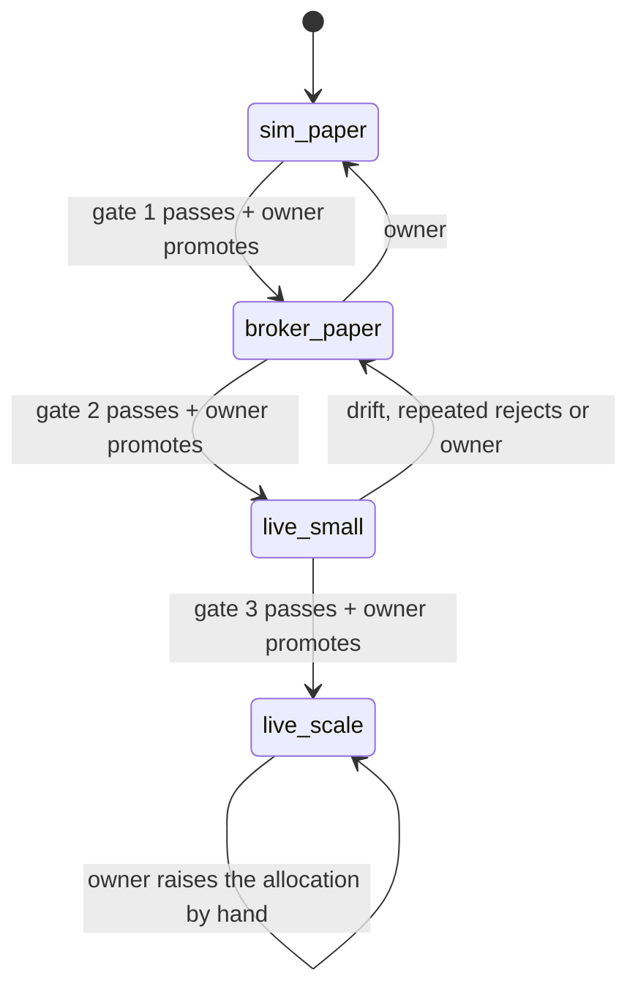

| Stage | Money | Broker | Who trades |
|---|---|---|---|
| 0. `sim_paper` | none | `SimulatedBroker` | the tick, as today |
| 1. `broker_paper` | none | IBKR paper account (`DU...` id) through IB Gateway in paper mode | the tick, auto mode |
| 2. `live_small` | a small allocation the owner sets | IBKR live account (`U...` id) | auto (approve mode is optional) |
| 3. `live_scale` | the owner raises the allocation by hand | same | auto |

### What we measure

The same five numbers at every broker stage, stored per portfolio per session in `live_gate_days` (section 9, WP 19.9) and shown on the go-live page.

| Metric | How | Source |
|---|---|---|
| TCA gap | Realised implementation shortfall minus the cost model's estimate, in bps of traded value. Mean and a bootstrap 95% interval over the stage. | `production/tca.py`, IBKR commissions |
| Reconciliation drift | Count of unexplained differences between the broker and our ledger at each check: position quantity, unknown order, missing order, cash beyond tolerance, fill without commission. | `reconcile_reports` (section 6) |
| Rejections | Broker rejections over orders sent. Our own refusals (safeguards, account rules) are counted apart and are not failures. | `orders.status_reason` |
| Uptime | Share of submit windows where the gateway was connected, logged in to the right account and answering. | broker health checks |
| Stuck orders | Orders not terminal at the end-of-day check. | `orders`, EOD check |

A **clean week** is five sessions with zero unresolved drift at every end-of-day check, zero stuck orders, a rejection rate under 2%, every submit window up, no safeguard or account-rule halt, and every fill with its commission booked.

### Gate 0 to 1: simulated paper to broker paper

- Entry: the portfolio's strategies are `active` and passed go-live. The subscription finished 20 paper days (the existing auto gate). WP 19.1 to 19.6 are merged. The fake-gateway tests and the live contract tests against the paper account pass. The runbooks in section 7 exist.
- Measure: all five numbers. IBKR paper fills are simulated by IBKR, so the TCA gap here only proves the plumbing (commission booked, arrival price stored), not the cost model.
- Exit (gate 1 report): at least 20 trading days in `broker_paper`, the last 4 weeks clean, at least one weekly re-authentication handled, one gateway restart during a session and one forced disconnect recovered without drift, one kill switch drill and one broker outage drill done (section 7), and zero duplicate orders at IBKR (checked by `orderRef`).

### Gate 1 to 2: broker paper to live small

- Entry: gate 1 report passes. The owner funded the live account, picked the account profile (section 5), bought the market data (section 10), set the allocation by hand, and set the live safeguards. Suggested limits for this stage: per-order notional cap 1,000 in base currency, per-day cap 5,000, 10 opening orders per run. Approve mode is optional.
- Measure: all five numbers. Now the TCA gap is real. With approve mode on, approval latency is added (time from ticket to decision).
- Exit (gate 2 report): at least 8 weeks in `live_small`, the last 6 clean, at least 30 filled live orders, and the mean TCA gap's 95% interval includes zero or sits below it (the cost model is not too cheap).

### Gate 2 to 3: live small to scale up

- Entry: gate 2 report passes.
- Measure: the same, per ramp step.
- Allocation: the owner raises the amount by hand when they are ready, with a reason and a fresh second factor. Stonks never suggests or changes it. A dirty week raises an alert. Drift or a runaway halt stops new buys through the halts, as always.
- Exit: none. `live_scale` is steady state. The quit rule, the circuit breaker and the drift checks keep running.

### Stage state

- `portfolios.live_stage` holds the current stage.
- `live_allocations (portfolio_id, amount, currency, reason, updated_at, updated_by)` holds the owner's amount (built in 19.6). Every change also writes an `audit_log` row.
- `live_stage_changes (id, portfolio_id, from_stage, to_stage, actor, reason, gate_report_json, created_at)` is append-only, like `status_changes`.
- `stonks live stage show|promote|demote <portfolio> --reason "..."`, the same in the API (step-up) and on the go-live page. MCP can read stages but not promote.
- A promote needs a gate report computed at that moment, not a cached one.

## 2. The IBKR broker adapter

### Why ib_async and IB Gateway

- `ib_async` is the maintained successor of `ib_insync` (BSD-2, Python 3.10 or newer). It speaks the TWS API protocol itself, so IBKR's own `ibapi` package is not needed. It gives `qualifyContracts`, `placeOrder`, `cancelOrder`, `whatIfOrder`, `reqExecutions`, `fills`, commission reports, `accountSummary`, `positions`, `openTrades` and events for errors and disconnects.
- IB Gateway is the headless-friendly login process for the TWS API. TWS is the full desktop app. Both listen on a socket and need a logged-in IBKR session. We run IB Gateway, controlled by IBC, in the `gnzsnz/ib-gateway` Docker image.
- The Client Portal Web API is the other option. It needs its own gateway and a browser login too, and `ib_async` does not cover it. We don't use it.

### Where it sits

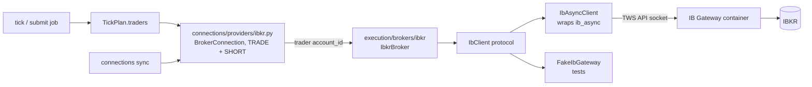

Both paths are used, as the accounts design planned:

- `execution/brokers/ibkr/` is the broker. The module the brief names, `ibkr.py`, grows into a small package: `broker.py` (`IbkrBroker`), `client.py` (the `IbClient` protocol and `IbAsyncClient`), `session.py`, `contracts.py`, `orders.py`, `errors.py`, `borrow.py`. `ib_async` is imported only in `client.py`, so vendor types never leave it.
- `connections/providers/ibkr.py` registers provider `ibkr` with `READ_BALANCES`, `READ_POSITIONS`, `READ_ORDERS`, `READ_ACTIVITY`, `TRADE` and `SHORT`. Its `trader(account_id)` returns an `IbkrBroker`. Auto books already reach traders through this seam, so the tick changes very little.
- `make_broker` learns `kind = "ibkr"` only for the legacy default book. New installs link a broker portfolio to an `ibkr` connection instead.

The connection holds no IBKR password. The gateway container holds the login. The connection record stores the gateway host, port, trading mode (`paper` or `live`) and the expected account id. These are settings, not secrets, but they are still sealed like other connection fields.

### IbkrBroker capabilities

| Capability | Method | IBKR call |
|---|---|---|
| `Broker` | `fetch_portfolio()` | `positions()`, `accountSummary()` |
| `Broker` | `place_order(order)` | `placeOrder` |
| `Broker` | `reconcile()` | executions and commission reports since the last call |
| `OrderStateSource` | `get_order_state(client_id)` | open trades, `reqCompletedOrders`, `reqExecutions`, matched by `orderRef` |
| `OrderCanceller` | `cancel_order(client_id)` | `cancelOrder` |
| new `GlobalCanceller` | `cancel_all()` | `reqGlobalCancel` (kill switch, stop all) |
| new `AccountReader` | `fetch_account()` | account summary tags (below) |
| new `MarginPreviewer` | `what_if(order)` | `whatIfOrder` |
| new `ExecutionSource` | `executions(since)` | `reqExecutions`, commission reports |
| new `QuoteSource` | `quotes(tickers)` | market data snapshot |
| `BorrowSource` (exists, `execution/borrow.py`) | `quote(ticker, day)` | shortable ticks plus IBKR's short stock file |

The new capabilities are `runtime_checkable` protocols in `execution/brokers/base.py`, like the existing two. Code that needs one checks `isinstance` and degrades when it is missing, so the simulated and fake brokers keep working.

### Orders

| Our field | IBKR field | Rule |
|---|---|---|
| `client_id` | `orderRef` | Idempotency key. The client id itself when it fits the length the live contract test measures, else a stable hash (`stk-` plus 20 base32 characters of its SHA-256). The value sent is stored in a new `orders.broker_ref`. |
| `quantity` | `totalQuantity` | Whole shares only in this phase. Rounded down. An order below one share is dropped with a reason. |
| `side` | `action` | `BUY` or `SELL`. A short sale is `SELL` with `position_effect = open`, checked against borrow first. |
| `order_type` `market` | `MKT` | Only for closing orders in an emergency path. Normal orders are collared limits. |
| `order_type` `limit` | `LMT` | Price rounded to the contract's minimum tick from `contracts.py`. |
| `order_type` `stop` | `STP` | Needs a new `Order.stop_price` field. |
| `order_type` `stop_limit` | `STP LMT` | `stop_price` plus `limit_price` |
| new `time_in_force` | `tif` | `opg` (the opening auction) by default for live books, `day` and `gtc` allowed. `gtc` only for protective stops. |
| new `outside_rth` | `outsideRth` | Always `False`. The adapter refuses `True` in this phase. |
| (none) | `account` | Always set to the portfolio's linked account id, so a login with several accounts never trades the wrong one. |
| (none) | `transmit` | `True`. A preview uses `whatIf` instead. |

**Default live order.** The tick decides at the close and the backtest fills at the next open. So a live book sends a limit-on-open order (`LMT` with `tif = OPG`) with a collar: the limit is the reference price plus the fat-finger band for a buy, minus it for a sell. This matches the backtest's fill convention (P21) and closes the gap TCA records today as `convention`. An order the auction does not fill is cancelled by IBKR and reported as unfilled. TCA books its opportunity cost.

**Idempotency.** IBKR has no server-side dedupe on `orderRef`, so the adapter does it:

1. The order row is committed as `pending` before any submit (the tick does this already).
2. `place_order` first asks `get_order_state(client_id)`. If IBKR knows the `orderRef` (open, completed today, or with an execution), it books that state and does not submit.
3. Otherwise it submits and stores IBKR's `permId` as `broker_order_id`. `orderId` is per API client and resets, so it is never stored as the key.
4. `reqCompletedOrders` and `reqExecutions` only reach back about a day. So an order must be settled the same session. The end-of-day check (section 6) enforces it, and the next morning's IBKR Flex statement is the backstop for older gaps.

**API client ids.** Each process role uses a fixed TWS API client id (`[brokers.ibkr] client_ids`: tick and submit 11, sync 12, health 13, reconcile 14, stream 15, api 16). The gateway's master API client id is set to the tick's id, so it sees orders from every client, and manual orders from TWS show up there too. Section 18 covers the API's own id.

### Fills and commissions

- An execution report carries `execId`, `orderRef`, quantity, price and time. A commission report arrives later, keyed by `execId`, with commission and currency.
- Fills are booked from executions, one row per `execId`. New columns `fills.broker_exec_id` (unique per portfolio) make booking idempotent. `delta_fill` stays for brokers that only report cumulative state.
- The commission updates the fill's `fee` when it arrives. A fill with no commission after the end-of-day check is drift.
- The commission currency may differ from the base currency. The fee is stored in its own currency with the FX rate used, so TCA stays exact.

### Cancels

- `cancel_order(client_id)` finds the trade by `orderRef` and cancels it. It returns `False` for unknown or terminal orders, as the protocol says.
- The kill switch in stop-all mode also calls `cancel_all()` (`reqGlobalCancel`), which cancels orders placed from any client, TWS and mobile included, then books the result through reconciliation.
- A cancel is only done when IBKR reports `Cancelled`. `PendingCancel` stays working until the next check.

### What-if margin preview

`what_if(order)` sends the order with `whatIf = True`. IBKR does not transmit it and answers with the initial and maintenance margin change, equity with loan after the trade, and the commission estimate. We map that to our own `MarginPreview` type. It is used in three places:

- the live dry-run preview (section 4),
- the `account_rules` rule, as the broker's view of buying power for each buy (section 5),
- approval tickets, which show the commission and margin the trade will use.

A what-if that fails or times out never lets a buy through. The buy waits for a person or is dropped.

### Short sales: locate and borrow

- Before an opening sell, `IbkrBorrowSource.quote` reads the shortable indicator and the shortable shares from a market data snapshot. IBKR marks a name as easy to borrow, hard to borrow (locate needed), or not shortable.
- Fee rates come from IBKR's public short stock availability file, read once a day into a new lake table `borrow_rates (ticker, as_of, available_shares, fee_rate_annual, rebate_rate, source)`. This also closes the open 16.x item "a lake table of borrow rates".
- No quote means no short (`shorting.md` section 4). Hard-to-borrow names need an approval ticket even in auto mode.
- Account rules add Reg SHO and the EU short selling rules (section 5).

### Contract resolution

Our tickers are EODHD-style (`AAPL.US`, `VOD.LSE`). IBKR trades contracts identified by `conId`.

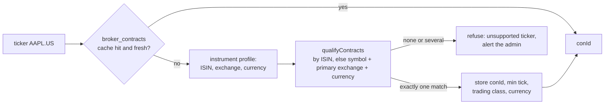

- A new state table `broker_contracts (broker, ticker, con_id, symbol, sec_type, exchange, primary_exchange, currency, min_tick, trading_class, isin, verified_at)` caches the answer. Unique on `(broker, ticker)` and on `(broker, con_id)`.
- The ISIN from the instrument's identifiers is tried first. Then symbol, `SMART` routing, the primary exchange mapped from `instruments.exchange`, and the currency. Share classes map `BRK-B.US` to IBKR's `BRK B`.
- Ambiguity is never guessed. Several matches, or a match whose currency or primary exchange disagrees with the instrument, refuse the ticker.
- Entries are re-verified weekly and when a split, ticker change or delisting reaches the lake.
- The reverse map for positions is by `conId`. An IBKR position with no mapped ticker is kept with its raw symbol, as the connection seam already does ("not covered"), and counts as drift for an auto book.
- London prices are quoted in pence (GBX) for many stocks. `contracts.py` keeps the price unit next to the currency, and the band and notional math converts both ways.

### Market data and pacing

- The tick decides on lake closes, as today. Live data is only needed for the fat-finger bands, the pre-open gap check and approval tickets.
- Quotes come from snapshot requests for the tickers of the day's orders only, a few dozen at most. This fits IBKR's default of 100 simultaneous market data lines.
- Without a subscription IBKR returns delayed data or an error. The adapter reports which one it got. A band check never uses a delayed quote as if it were live. It falls back to the lake close and marks the quote as `delayed`, and the band tightens (section 4).
- The TWS API allows about 50 messages a second. `ib_async` throttles requests on its own. We add our own token bucket per gateway in `session.py` for the sync and the health checks, so a burst never starves the submit path.
- Historical bars are never pulled from IBKR. The lake stays the one source of prices (EODHD and Yahoo).

### Account summary and positions

`fetch_account()` maps these account summary tags to our `BrokerAccount` plus a new `LiveAccountState`:

| IBKR tag | Our field |
|---|---|
| `NetLiquidation` | `equity` |
| `TotalCashValue` | `cash` (base currency) |
| `SettledCash` | `settled_cash` |
| `AvailableFunds` | `available_funds` |
| `BuyingPower` | `buying_power` |
| `ExcessLiquidity` | `excess_liquidity` |
| `DayTradesRemaining` | `day_trades_remaining` (US margin accounts) |
| `FullInitMarginReq`, `FullMaintMarginReq` | margin used |
| `AccountType` | checked against the portfolio's account profile |

Cash is read per currency too (`$LEDGER` values), because an EU or UK account often holds USD next to its base currency.

### Errors and reconnects

The client runs `ib_async` on its own event loop in one thread per gateway (`session.py`) and exposes a blocking facade, so the tick stays synchronous.

| IBKR signal | Meaning | Our reaction |
|---|---|---|
| 502, 504, socket closed | gateway not reachable | `BrokerUnavailable`: short outage path (section 3) |
| 1100 | gateway lost its link to IBKR | same, and stop sending until 1101 or 1102 |
| 1101, 1102 | link restored (1101 means market data lost) | resume, re-subscribe snapshots |
| 2104, 2106, 2158 | data farm OK | info only, never an error |
| 10197 | competing session (someone logged in with the same user) | `BrokerUnavailable` plus a high-urgency alert that names the cause |
| 201 | order rejected | `OrderRejectedError` with IBKR's text |
| 110 | price does not fit the minimum tick | bug in our rounding: reject and alert the admin |
| 354 | no market data subscription | quote marked missing, band falls back |
| 103 | duplicate order id | re-sync the next valid id, then re-check by `orderRef` before any retry |
| wrong account id or a `DU` account in live mode | misconfiguration | `LiveTradingRefusedError`, the book never trades |

- Reconnect uses exponential backoff with jitter, capped at 60 seconds, for up to the submit window's deadline.
- After every reconnect the adapter re-reads open orders and executions before it sends anything.
- **Account safety check.** On connect the adapter reads the managed accounts. Live mode requires a `U` account and `allow_live = true` and a portfolio stage of `live_small` or higher. Paper mode requires a `DU` account. Any mismatch refuses to trade. Paper and live gateways listen on different ports and run as different services, so a paper setting cannot reach the live account by accident.

## 3. Deployment

### The gateway in Compose

Two services under their own profiles in `deploy/compose.yaml`, never both by accident:

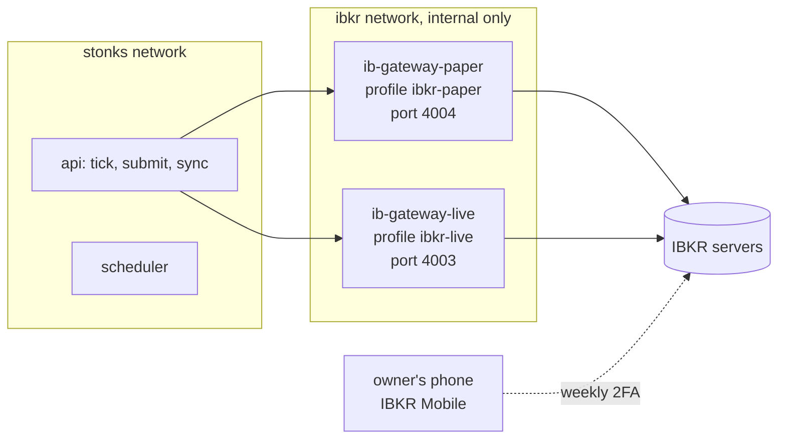

- Image `ghcr.io/gnzsnz/ib-gateway`, pinned to a stable tag and digest, updated on purpose like the Stonks image.
- `TRADING_MODE=paper` for one service and `live` for the other. Ports 4004 (paper) and 4003 (live) are the image's socat relays. They are exposed only on an internal Compose network that only `api` joins. Nothing is published on the host. VNC is off. It can be turned on over Tailscale for a one-off manual login.
- Settings: `READ_ONLY_API=no` (yes during a read-only soak), `TWS_ACCEPT_INCOMING=accept` (only our network can reach it), `AUTO_RESTART_TIME` at a quiet hour away from the tick and submit windows, `TIME_ZONE` set explicitly, `TWOFA_TIMEOUT_ACTION=restart`, `RELOGIN_AFTER_TWOFA_TIMEOUT=yes`.
- Memory: the gateway is a Java process. Plan about 1 GB per gateway. The 1-trader VM in `capacity.md` (4 GB) holds one gateway. Running paper and live at once wants the 8 GB size.
- Stonks connects with `[brokers.ibkr] host`, `port`, `mode` and `account_id`, set per connection. The `api` process runs the tick today, so it holds the session.

### Secrets

- The IBKR username and password go in Docker secret files (`TWS_USERID`, `TWS_PASSWORD_FILE`), mounted into the gateway container only. The Stonks containers never see them.
- Paper has its own username and password (`TWS_USERID_PAPER`, `TWS_PASSWORD_PAPER_FILE` when one gateway runs both, or its own service).
- The optional Flex Web Service token for statements is `STONKS_IBKR_FLEX_TOKEN` in `deploy/.env`, read by Stonks only.
- `.env.example` lists the names with empty values. `deploy/ibkr/README.md` explains the secret files. Nothing lands in git or TOML. The config loader rejects these fields in TOML, as it does for Alpaca keys.

### The re-authentication reality

- IB Gateway must restart once a day. With IBC's auto restart it reuses the session and needs no second factor.
- Once a week, after IBKR's Sunday reset (about 01:00 US Eastern), the session expires and a full login with 2FA is needed. IBC types the password, then IBKR pushes an approval to IBKR Mobile on the owner's phone.
- If the owner does not approve within the timeout, IBC restarts and asks again (`RELOGIN_AFTER_TWOFA_TIMEOUT=yes`).
- A login with the same username anywhere else (TWS, the web portal, the mobile app) kicks the gateway off ("competing session"). So the gateway uses a dedicated secondary username with trading rights, and the owner uses their main username for everything else.

Stonks makes this a routine, not a surprise:

| When | Job | What it does |
|---|---|---|
| Sunday, 18:00 owner time | `ibkr_reauth_reminder` | A push: "Approve the IBKR login on your phone tonight." |
| Every 5 minutes | `broker_health` | Connected, logged in, right account, server time answers within 2 s. Writes metrics. |
| Open minus 60 min | `live_sod_check` | Start-of-day check (section 6). If the gateway is down, a high-urgency push with the runbook link. |
| Open minus 20 min | `live_submit` | Sends approved and auto tickets as opening-auction orders |
| Close plus 15 min | `live_eod_check` | End-of-day check before the tick decides |
| Close plus 45 min | `tick` | Decides. Live books write tickets instead of sending orders. |

### When the gateway is down

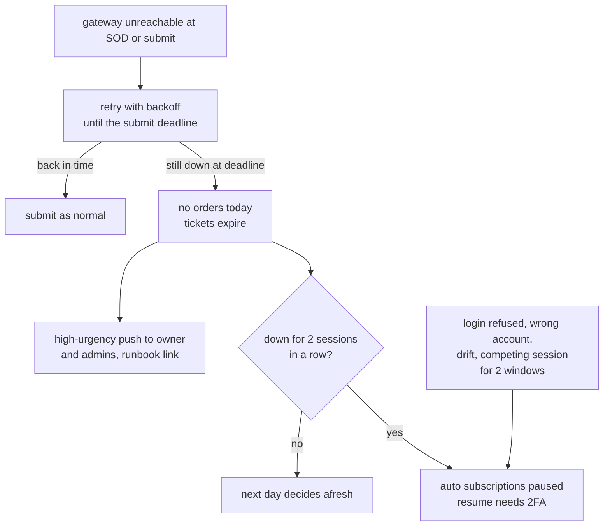

- A short outage never sends yesterday's decisions late. Tickets expire at the submit deadline and the next tick decides again from fresh data.
- A real fault (login refused, wrong account, drift) pauses auto at once, through the existing `pause_auto`, with its audit row and notification.
- Exits wait too. A broker that is down cannot take a sell either. The protective stops (section 4) are the answer for positions that must be protected while Stonks cannot reach IBKR.

### Health and metrics

New Prometheus families in `scheduling/metrics.py`, labelled by portfolio (never by account number):

- `stonks_broker_connected` (0 or 1), `stonks_broker_last_ok_timestamp_seconds`
- `stonks_broker_orders_total{status}` (sent, filled, rejected, cancelled, refused_by_rule)
- `stonks_reconcile_drift_items` at the last check
- `stonks_tca_gap_bps` (rolling 20 fills)
- `stonks_live_stage` and `stonks_live_ramp_pct`
- `stonks_approval_tickets_pending`

`stonks health` gains a `broker` check per live portfolio. The global operational halt does not trip on a broker outage, because a broker belongs to a portfolio. The book skips instead, as above.

## 4. Live safeguards

New registered risk rules in `production/rules/`. They run only for books whose broker is live (a new `RiskContext.live` field holds the account state, quotes and stage). In backtests and paper books `ctx.live` is `None` and every one of them does nothing, so backtests stay identical. Like every rule they only drop or shrink opening orders, and never drop an order that closes a position (P28). The property tests in `tests/property/` pick them up from the registry.

| Rule | Runs (`order`) | What it does |
|---|---|---|
| `capital_ramp` | whole-list rule (4), after `portfolio_vol` and before the circuit breaker | The owner's allocation cap. Scales every opening order by one factor so the book's gross exposure stays at or under the allocation, capped at the account's net liquidation value. No allocation means nothing opens. |
| `live_notional_caps` | whole-list rule (9), before the order-rule pass | Per-order cap and per-day cap for opening orders, per portfolio. A per-user and a global daily cap sit on top. The day's sent notional is read from `orders`. |
| `price_band` | whole-list rule (9), before the order-rule pass | Fat-finger check. Sets or clamps the limit price of every order to the reference plus or minus the band. Drops an opening order whose reference moved beyond the gap limit since the decision. |
| `account_rules` | whole-list rule (65), between `cash_buffer` and `min_order_notional` | Calls the account rules engine (section 5). |
| `max_orders_per_run` | whole-list rule (80), last | At most N opening orders per run, dropped lowest score first. A run with more closing orders than a higher ceiling is a runaway: every opening order is dropped, each close is tagged, and the `live_runaway` hook opens a `runaway` halt (buys). |

Every live rule is a whole-list rule. An order rule can change only a quantity, and `price_band` changes prices, while the caps need a running total across the run.

### Settings

The limits are risk rule settings under `[production.risk.rules.<rule>]`, so portfolio and owner overrides can only tighten them (`RiskPolicy.tighter_of` and `MERGE_RULES`). Every one is off by default:

```toml
[production.risk.rules.capital_ramp]
enabled = true                 # cap gross exposure at the owner's allocation

[production.risk.rules.live_notional_caps]
max_order_notional = 1000      # base currency
max_day_notional = 5000
max_user_day_notional = 10000
max_global_day_notional = 20000

[production.risk.rules.price_band]
band_pct = 0.02                # limit within 2% of the reference
nbbo_band_pct = 0.01           # and within 1% outside the bid or ask when live quotes exist
delayed_band_pct = 0.01        # tighter band when only a delayed quote or the lake close exists
max_gap_pct = 0.05             # drop an opening order when price moved more than 5% since the decision

[production.risk.rules.max_orders_per_run]
max_opening_orders = 10
max_closing_orders = 30

[production.risk.rules.account_rules]
enabled = true
```

`[production.live]` holds what is not a risk rule: `allow_manual_trades` (default `true`) today, and later the approval and stop settings (19.8, 19.10). The allocation is not a setting. The owner sets it per portfolio in the console (`PUT /api/portfolios/{id}/live/allocation`, step-up, audited).

### Fat-finger bands

- The reference is the last trade from a live snapshot when there is one, else the lake close. A buy limit may not exceed the reference plus `band_pct`, and may not exceed the ask plus `nbbo_band_pct` when a live quote exists. A sell mirrors it.
- The rule sets the price for our collared opening-auction orders, so a price is always present.
- IBKR's own precautionary settings in the gateway (maximum order value and size) are set too, as a second, independent layer.

### Max orders per run

A bug that emits 500 orders must not reach the broker. Opening orders beyond the limit are dropped in score order. Closing orders are never dropped. A run that tries to close more than the ceiling loses every opening order and opens a `runaway` halt (mode `buys`) for the portfolio. Once tickets exist (19.8), such a run becomes approval tickets instead of being sent.

### Allocation cap

- The owner sets the amount per live portfolio by hand, with a reason and a fresh second factor. It is stored in `live_allocations` and audited.
- The `capital_ramp` rule scales only opening orders. Lowering the amount does not sell anything. The book shrinks as positions close in the normal course.
- Stonks never changes the amount. A bad week alerts.

### Approve mode

An optional fourth mode between paper and auto: `approve`. The tick decides, and every order waits for a person. It is not a gate: a book may go from paper straight to auto once the broker paper stage passes.

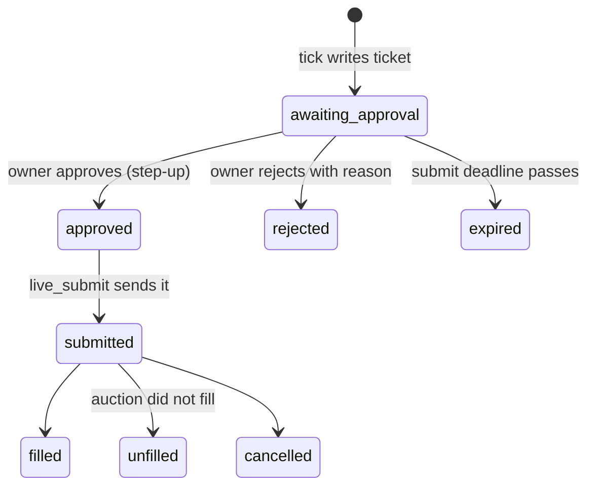

- Mode ladder: notify, paper, approve, auto. Approve is optional. Switching to approve needs the same checklist as auto (20 paper days, active strategy, healthy trading connection, no halt, step-up). Moving from approve to auto needs nothing more, because approve already met the auto checklist.
- `order_tickets (id, portfolio_id, tick_id, client_id, order_json, preview_json, reason_json, status, expires_at, decided_by, decided_at, decision_reason, created_at)`. The ticket carries the client id, so a submitted ticket is idempotent like any order.
- The push is high urgency with a minimal payload, as the notification design requires: "3 orders wait for approval in Growth". No amounts or tickers leave the server.
- The ticket view in the console looks like an order ticket: side, ticker, quantity, limit, notional, the reason (signal, score, target weight), the what-if margin and commission, the band, and the risk and account rules that touched it. Approve one, reject one with a reason, or approve all for a run.
- Approving needs a fresh second factor (10 minutes). One TOTP covers every ticket approved in that window, so a batch takes one code. Phones use the installed PWA.
- MCP and API tokens can list tickets but cannot approve (step-up actions are UI-only).
- Auto books still create tickets, already `approved` by `service:system`. So the submit path is the same for both modes, and the ticket table is the audit trail of what was sent and why.
- Hard-to-borrow shorts and anything a `runaway` halt holds need approval even in auto mode.

### Live dry-run preview

`stonks live preview <portfolio>` and a "Preview tomorrow's orders" button:

1. Runs the tick's decision for one book on today's data, without writing anything.
2. Reads the live account (positions, cash, buying power) from IBKR.
3. Runs risk rules, live safeguards and account rules against it.
4. Calls `what_if` for every order.
5. Shows the tickets it would create, with what each rule changed and why.

It never transmits. It needs `trade` permission but no step-up, because it cannot place orders. The preview is also the first step of every stage promotion: the gate report embeds one.

### Broker-side protective stops (optional)

- Off by default, per portfolio (built as `[production.risk.rules.protective_stops]`, see section 14).
- After an entry fills, the adapter places a GTC `STP` sell (or a buy stop for a short) at the fill price minus `atr_multiple` times ATR. The stop's client id is the entry's plus `:stop`, and the stop is in an OCA group per ticker.
- The tick re-sizes the stop when the position changes and cancels it when the position closes. Reconciliation treats a stop fill as a normal closing fill attributed to the strategy that held the lots.
- Stops only reduce risk. They protect a position while Stonks or the gateway is down. A stop fills at the market after a gap, so it limits time exposure, not the size of an overnight loss.

## 5. Account rules engine

The account rules decide what a real account may do under its jurisdiction and type. They are a registry, like risk rules, and run as the `account_rules` risk rule for live books.

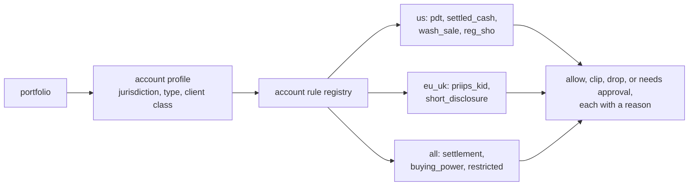

**Account profile.** `account_profiles (portfolio_id, jurisdiction, account_type, client_class, base_currency, fx_policy, wash_sale_mode, allow_short, updated_at, updated_by)`, set in the console (`PUT /api/portfolios/{id}/live/account-profile`, step-up, audited):

- `jurisdiction` in {`us`, `eu`, `uk`}. It follows the IBKR entity that holds the account, not the owner's passport.
- `account_type` in {`cash`, `margin`}, default `cash`. The owner's first live account is a cash account, long only. Shorts need `margin` (`allow_short` is refused on a cash profile, by the service and by the table). Margin with longs and shorts is a later follow-up.
- `client_class` in {`retail`, `professional`}. It decides the product restrictions.
- The profile is checked against IBKR's `AccountType` at connect. A mismatch refuses to trade.
- Changing a profile needs a step-up and an audit row. It can only be set before the first live stage, or with the book in `broker_paper`.

### Rules for every account

| Rule | What it checks |
|---|---|
| settlement | Not a gate. The settlement ledger tracks each fill's settlement date from the security's market, not the account's jurisdiction: US securities settle T+1. EU and UK markets settle T+2 today and plan to move to T+1 in October 2027, so the cycle is a setting per market (`settlement_days`). |
| `restricted` | Drops opening orders in tickers on a restricted list: a per-portfolio list the owner keeps, and names IBKR refused earlier. |
| `short_permission` | Drops every short sale on a cash account, and on a margin account whose profile does not allow shorts. |
| `account_known` | With no account state from the broker, nothing opens. |
| `settled_cash` | Cash accounts: buys use settled cash only, net of the other buys of the run. Sale proceeds never count until they settle, so the account never buys with money it has not received yet (no free-riding, no margin). |
| `buying_power` | Margin accounts: buys fit `AvailableFunds`, net of the other buys of the run. The what-if answer wins when it is stricter (19.2). |
| `fx_funding` | A buy in a currency the account does not hold enough of is clipped to what it holds. `convert` (a separate FX order before the buy) is not built yet, so both policies only spend what is held. A cash account never borrows a currency. |

### US rules

| Rule | What it checks |
|---|---|
| `pdt` | Pattern day trader rule for margin accounts under 25,000 USD equity: at most 3 day trades in 5 business days. We count day trades (open and close of the same ticker in one session) and cross-check IBKR's `DayTradesRemaining`, and the stricter wins. A close that would make the 4th needs approval (never dropped). With no day trade left, opening orders are dropped, since a stop could make another. Cash accounts are not subject to it. FINRA has proposed replacing this rule, so the threshold and count are settings. A daily strategy rarely day-trades, but stops can. |
| `wash_sale` | A buy within 30 days of selling the same ticker at a loss is tagged in the journal. `wash_sale_mode` is `warn` (default) or `block` (drops the buy). Tax reporting stays with the broker. |
| `reg_sho` | Opening short sales need a borrow quote (the locate). When a stock is under the short sale price test (Rule 201, after a 10% fall from the prior close), an opening short must be a limit above the bid. Our collared order may not be, so the rule drops it. |

### EU and UK rules

| Rule | What it checks |
|---|---|
| `priips_kid` | Retail clients in the EU (PRIIPs) and the UK (the successor consumer-investment disclosure rules) cannot buy most US-domiciled ETFs, because they have no local key information document. The rule drops buys of funds whose domicile needs a document the instrument does not have (instrument metadata: `security_type`, domicile, and a per-instrument `kid_available` flag, filled from IBKR rejections and an owner list). Sells are always allowed. Professional clients skip it. |
| `short_disclosure` | EU and UK short selling rules: a net short position of 0.1% of issued shares must be reported to the regulator, and 0.5% is published. The rule caps each short so it stays below 0.1% (shares outstanding from the lake), unless the owner turns on reporting, which Stonks does not do for them. |
| `transaction_taxes` | Not a block. UK stamp duty and the French and Italian financial transaction taxes are costs. They go into the cost model per market (a `backtest/costs.py` addition), so lab and live agree. |

### Where the numbers come from

- The broker is the source of truth for cash, settled cash, buying power and day trades remaining.
- Our own counters (`settlement_ledger (portfolio_id, fill_id, currency, amount, trade_date, settle_date)`, day-trade count) exist to explain a refusal before IBKR sends it, and to catch drift. If ours and IBKR's disagree, the stricter one is used and the difference is reported as drift.

## 6. Reconciliation

The broker is the source of truth every run. Stonks' rows are a checked copy.

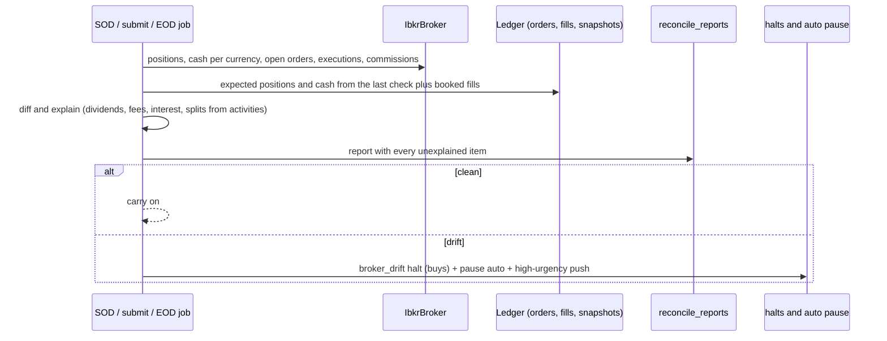

**Drift items.** Each has a kind, the ticker or order, our value, the broker's value and whether it was explained.

| Kind | Example | Explained by |
|---|---|---|
| `position_qty` | IBKR holds 100, we expect 90 | a fill we had not booked yet (then booked), a split |
| `unknown_position` | a ticker we never traded | none: a manual trade or a transfer |
| `unknown_order` | a working order with no `orderRef` of ours | none: placed by hand in TWS or mobile |
| `missing_order` | our `pending` row, IBKR never saw it | the existing "never received" rejection |
| `cash` | beyond `max(1 unit, 0.01% of NLV)` | dividends, interest, fees, deposits from activities |
| `commission_missing` | a fill with no commission after EOD | a late report (booked next check) |
| `rules_mismatch` | our settled cash or day-trade count differs from IBKR's | none |

**Policy.**

- Positions are exact. One share off is drift.
- The owner trades by hand in the same account, so manual trades are allowed by default (`[production.live] allow_manual_trades = true`). Stonks only trades the positions it opened (ownership by attribution). The owner's positions and orders are kept apart as external: never sold, never counted as the book's, and never drift. Only a difference in Stonks' own positions, orders or fills is drift.
- With `allow_manual_trades = false`, an unknown position or order opens a `broker_drift` halt (buys) for the portfolio and pauses its auto subscriptions. Closing orders keep working.
- Clearing a `broker_drift` halt needs a reason, like every halt. The reconcile report is linked in the audit row.
- A drift item that stays unexplained for 2 checks demotes the stage one step (section 1).

**Start of day** (`live_sod_check`, open minus 60 minutes):

1. Gateway up, logged in, managed account matches the portfolio, mode matches the stage.
2. Yesterday's day orders and opening-auction orders are terminal. Anything still working from yesterday is cancelled and reported.
3. Positions and cash reconcile against the last end-of-day check plus overnight activities (dividends, corporate actions).
4. Buying power, settled cash and day trades remaining are read and stored for the submit.
5. Contract cache entries for today's tickets are fresh.
6. The optional Flex statement for the last session is fetched and compared with our fills and commissions. This is the official record and catches anything the socket missed.

**Submit** (`live_submit`): a short reconcile first (open orders and executions), then the gap check against pre-market quotes, then sending.

**End of day** (`live_eod_check`, close plus 15 minutes, before the tick decides):

1. Every order sent today is terminal (filled, partly filled then expired, unfilled, cancelled). Anything else is a stuck order and alerts.
2. Every execution is booked with its commission.
3. A snapshot with `source = broker` is written, so P&L, insights and risk read the broker's numbers.
4. The day's gate metrics are written to `live_gate_days`.

`reconcile_reports (id, portfolio_id, kind, taken_at, status, items_json, explained_json)`, kind in {`sod`, `submit`, `eod`, `adhoc`}.

## 7. Monitoring and operations

### Alerts

| Event | Urgency | Who |
|---|---|---|
| Gateway down at SOD or submit | high | owner, admins |
| Weekly re-auth reminder | normal | owner |
| Competing session | high | owner |
| Drift found, `broker_drift` halt | high | owner |
| `runaway` halt | high | owner, admins |
| Tickets waiting for approval | high | owner |
| Stuck order at EOD | high | owner |
| Order rejected by IBKR | normal (high when 3 or more in a run) | owner |
| TCA gap outside the band for 20 fills | normal | owner, admins |
| Stage demoted | high | owner, admins |

High urgency skips quiet hours, as the notification design says.

### Runbooks

New pages in `docs/runbooks/`. They also close the open Phase 12 item "broker unreachable".

- `broker-outage.md`: gateway down or login lost. Check `docker compose ps`, the gateway logs, the phone for a pending 2FA, a competing session. Restart the gateway service. What happens to today's tickets. When to resume paused auto.
- `stuck-order.md`: an order not terminal at EOD. Find it by `orderRef` in TWS. Cancel through Stonks (`stonks orders cancel <client-id>`), never by hand, so the ledger follows. What to do when IBKR shows `PendingCancel` for long.
- `reconcile-drift.md`: read the report, find the cause (manual trade, missed fill, corporate action), fix the ledger through reconciliation, clear the halt with a reason.
- `gateway-reauth.md`: the weekly login, changing the secondary user's password, what IBC does on a timeout.
- `kill-switch-drill.md`: the drill below.

### Kill switch drills

- Monthly in `broker_paper`, quarterly in live, and before every stage promotion.
- `stonks halts drill <portfolio>` places one tiny limit order far from the market (it cannot fill), engages the portfolio kill switch in stop-all mode, checks that IBKR reports the order `Cancelled` within 10 seconds and that `reqGlobalCancel` ran, then waits for a person to resume with `RESUME TRADING`.
- The drill writes a `kill_switch_drills` row with the timings. A gate report needs a passing drill from the last 30 days.

## 8. Testing

**Hermetic by default.**

- `IbClient` is a narrow protocol owned by us. `IbAsyncClient` wraps `ib_async`. `tests/fakes/ib_gateway.py` holds `FakeIbGateway`, an in-memory implementation that can be scripted: fills, partial fills, auction no-fills, rejections with IBKR codes, late commission reports, a disconnect in the middle of a submit, a gateway restart that forgets order ids, a competing session, a `DU` account in live mode, delayed quotes, a what-if timeout.
- `IbkrBroker` and the `ibkr` provider are tested only against the fake. So are the submit and reconcile jobs, the account rules and the safeguards.
- The existing fake trading connection keeps serving generic auto-mode tests.
- Property tests: the new rules join the registry, so `tests/property/test_risk_rule_properties.py` already checks that none adds exposure or drops a closing order. New properties: an order is never sent twice for one client id across any sequence of crashes and reconnects, and booked fills plus commissions equal the fake's executions.
- Mutation targets are added for `execution/brokers/ibkr/orders.py`, `execution/drift.py` and the safeguard rules.

**Live contract tests** in `tests/integration/live/test_ibkr_live.py`, marked `@pytest.mark.live`, run only with `STONKS_RUN_LIVE_TESTS=1` and `STONKS_IBKR_HOST`, `STONKS_IBKR_PORT` and `STONKS_IBKR_ACCOUNT` set. They refuse to run unless the account id starts with `DU` (paper):

- connect and read managed accounts, account summary and positions,
- qualify `AAPL.US`, `BRK-B.US` and one LSE ticker, and compare with the cache format,
- measure the `orderRef` length the gateway keeps,
- what-if a buy,
- place a far-from-market limit, find it by `orderRef`, cancel it,
- read executions and completed orders,
- read a shortable indicator.

Tests that need an open market skip outside regular hours.

**Paper soak.** Stage 1 is the soak: at least 20 trading days of the real schedule against the paper account. `stonks live soak-report` (`production/soak.py`) sums it up from the ledger, gateway notifications, `broker_drift` halts and `reconcile_reports` when that table exists. The gate 1 report (19.9) adds `live_gate_days` and the drill record.

## 9. Work packages

Each package owns the tests of its own modules. Shared files (`config.py`, `config/default.toml`, `cli.py`, API router mounts, the MCP server, `pyproject.toml`, `.env.example`, `tests/conftest.py`, the docs) change only in the integration step after each wave, as in Phase 9. Migration numbers are the next free ones at merge time (SQLite 027 onward today).

| WP | Scope | Owns |
|----|-------|------|
| 19.1 Broker seam for live | `Order.stop_price`, `time_in_force`, `outside_rth`. `BrokerKind` gains `ibkr`. New optional capabilities (`GlobalCanceller`, `AccountReader`, `MarginPreviewer`, `ExecutionSource`, `QuoteSource`) and our types (`LiveAccountState`, `MarginPreview`, `Quote`). `fills.broker_exec_id` and fee currency, `orders.broker_ref`, fee update by execution id in reconciliation. | `core/types.py`, `execution/brokers/base.py`, `execution/reconcile.py`, `store/migrations_sqlite/NNN_live_broker.sql` |
| 19.2 IBKR adapter | `IbClient` protocol, `IbAsyncClient` over `ib_async`, the session thread and reconnects, contract resolution and the `broker_contracts` cache, order mapping, error mapping, the account safety check, `IbkrBroker`, and `FakeIbGateway`. | `execution/brokers/ibkr/*`, `store/migrations_sqlite/NNN_broker_contracts.sql`, `tests/fakes/ib_gateway.py` |
| 19.3 IBKR connection and borrow | The `ibkr` provider (reads and `trader()`), sync of positions, cash and activities, `IbkrBorrowSource`, the daily short stock file into the lake `borrow_rates` table, optional Flex statement fetch. | `connections/providers/ibkr.py`, `execution/brokers/ibkr/borrow.py`, `execution/brokers/ibkr/flex.py`, `ingest/sources/ibkr_borrow.py`, `store/migrations_duckdb/NNN_borrow_rates.sql` |
| 19.4 Gateway deployment | Compose services and profiles `ibkr-paper` and `ibkr-live`, the internal network, Docker secrets, the gateway README, broker health check and metrics, the re-auth reminder job. | `deploy/compose.yaml`, `deploy/ibkr/*`, `production/broker_health.py`, `scheduling/metrics.py` |
| 19.5 Reconciliation and drift | Drift detection and explanation, SOD, submit and EOD checks, `reconcile_reports`, the `broker_drift` halt kind, auto pause on drift, the short-outage versus fault split in auto pause. | `execution/drift.py`, `production/live/checks.py`, `production/auto_pause.py`, `production/halts.py`, `store/migrations_sqlite/NNN_reconcile_reports.sql` |
| 19.6 Live safeguards | `RiskContext.live`, the rules `capital_ramp`, `live_notional_caps`, `price_band`, `max_orders_per_run`, the `runaway` halt, `[production.live]` settings and their tighten-only merge, reference prices from quotes or the lake. | `production/rules/{__init__,capital_ramp,live_caps,price_band,max_orders}.py`, `production/rules/settings.py`, `production/live/settings.py`, `production/live/quotes.py` |
| 19.7 Account rules engine | Account profiles, the account rule registry, the rules in section 5, the settlement ledger and day-trade counter, the `account_rules` risk rule, per-market transaction taxes in the cost model. | `accounts/rules/*`, `production/rules/account_rules.py`, `backtest/costs.py`, `store/migrations_sqlite/NNN_account_profiles.sql` |
| 19.8 Tickets, approve mode and the submit job | `Mode.APPROVE`, `order_tickets`, decide versus submit for live books in the tick, the `live_submit` job, ticket API with step-up approval, the ticket view and push, MCP read-only tools. | `accounts/models.py`, `accounts/subscriptions.py`, `production/tickets.py`, `production/submit.py`, `production/tick.py`, `app/tickets.py`, `api/routers/tickets.py`, `web/src/app/tickets/*`, `store/migrations_sqlite/NNN_order_tickets.sql` |
| 19.9 Stages, gates and preview | The stage state machine and `live_stage_changes`, `live_gate_days`, the gate reports, `stonks live stage` and `stonks live preview`, the go-live page section. | `production/live/stages.py`, `production/live/gates.py`, `production/live/preview.py`, `app/live.py`, `api/routers/live.py`, `web/src/app/golive/*`, `store/migrations_sqlite/NNN_live_stages.sql` |
| 19.10 Protective stops | Stop placement after entry fills, resizing and cancelling, OCA groups, attribution of stop fills. | `production/live/stops.py` |
| 19.11 Live tests, drills and runbooks | Live contract tests, `stonks live soak-report`, `stonks halts drill` (dry run, no `kill_switch_drills` table yet), the five runbooks, the ops and deploy doc sections. | `tests/integration/live/test_ibkr_live.py`, `production/soak.py`, `production/drills.py`, `docs/runbooks/{broker-outage,stuck-order,reconcile-drift,gateway-reauth,kill-switch-drill}.md` |
| 19.12 Go live | Not code. Run stage 1 (20 days paper soak), gate 1, stage 2 in auto (approve mode optional), gate 2, then raise the allocation by hand. Each step has a logged reason. | operations only |

Waves:

1. 19.1, 19.4, 19.6, 19.7 in parallel.
2. 19.2 and 19.8.
3. 19.3, 19.5, 19.9, 19.10.
4. 19.11, then 19.12.

## 10. What the owner must provide

- **An IBKR account** at the entity that fits where you live (IBKR LLC for the US, IBKR Ireland for the EU, IBKR UK for the UK). This decides the account-rules profile. IBKR Pro is the safer choice for API trading.
- **The account type**: cash or margin. Shorts need margin.
- **Your client class** in the EU or UK: retail or professional. Retail blocks most US ETFs.
- **The paper account** that comes with it, with "share market data with the paper account" turned on.
- **A secondary username for the API** with trading rights, and IBKR Mobile on your phone for its 2FA. Approve its login every Sunday night.
- **Market data subscriptions** on that username, non-professional: US top of book (for example the US securities snapshot and futures value bundle, or NYSE and NASDAQ top of book), plus any EU or UK exchange you will trade.
- **Trading permissions** for stocks and ETFs in the markets you choose.
- **IBKR's precautionary order limits** set in the gateway user's settings, at or below our caps.
- **The capital** to allocate per portfolio (`allocated_capital`), and the funding.
- **Optional: a Flex Web Service token and query id** for daily statements.
- **The VM**: 1 GB more memory per gateway (the 1-trader 4 GB size holds one gateway, 8 GB for paper and live at once).
- **Credentials put in place by you**, into Docker secret files on the server. Never paste them in chat, git or TOML.

## Open questions

1. Where will the account be (US, EU or UK)? Everything else follows from this.
2. Answered: a cash account, long only, for now. Margin with shorts is a later follow-up.
3. Answered: approve mode is optional, not a stage.
4. Answered: no ramp steps. The owner sets the allocation by hand.
5. Answered: yes, the account is shared. Stonks only trades its own positions.
6. For an EU or UK account with a EUR or GBP base: hold a USD balance, or convert per trade (`fx_policy`)?
7. Opening auction for every order (proposed, matches the backtest) or a day order at the open with a collar?
8. Will other traders bring their own IBKR logins? Each login needs its own gateway container and its own weekly approval.
9. Do you want a read-only stage (gateway with `READ_ONLY_API=yes`, sync only) before broker paper?
10. Fractional shares stay off in this phase. Do small accounts need them later?

## 11. What wave 1 built

Wave 1 landed 19.1, 19.4, 19.6 and 19.7, plus the deploy side of 20.6. Where it differs from the sections above:

- **Settings.** The safeguard limits are risk rule settings under `[production.risk.rules.<rule>]`, not `[production.live.*]`, so the existing tighten-only merge covers them. `[production.live]` holds only `allow_manual_trades` for now.
- **Rule kinds.** Every live rule is a whole-list rule (section 4). `live_notional_caps` and `price_band` run before the order-rule pass, `account_rules` between `cash_buffer` and `min_order_notional`, and `max_orders_per_run` last.
- **Allocation.** `capital_ramp` keeps its name but is the owner's allocation cap. It is stored in `live_allocations` and set through `PUT /api/portfolios/{id}/live/allocation` with the new step-up permission `live.manage`.
- **Runaway.** A runaway run loses its opening orders and opens a `runaway` halt, but its closes still go out. Holding them as tickets waits for 19.8.
- **Account rules.** The engine adds `short_permission` and `account_known`. `fx_funding` only spends what is held (conversion orders come later). Transaction taxes in the cost model are left for a later wave, so `backtest/costs.py` is untouched. Profile changes are not yet locked to the stage (stages are 19.9).
- **Halts.** Migration 027 adds both `runaway` and `broker_drift` to `risk_halts` now, so 19.5 needs no table rebuild.
- **Gateway health.** The `broker_health` job runs in the scheduler, so the scheduler joins the internal `ibkr` network too. Metrics are labelled by gateway and mode, never by account. A gateway down for two sessions, or with a real fault, pauses the auto subscriptions of the portfolios listed on it (`[brokers.ibkr.gateways.<name>] portfolios`). `SocketProbe` only checks the port. The adapter adds a login and account check (19.2).
- **One migration.** Everything wave 1 stores is in SQLite migration 028: live order and fill columns, halt kinds, `live_allocations`, `broker_gateway_status`, `account_profiles`, `settlement_ledger`, `account_restricted` and `product_documents`.
- **Order state machine.** `orders.state` holds the fine state: `pending`, `submitted`, `accepted`, `partially_filled`, `filled`, `pending_cancel`, `cancelled`, `expired`, `rejected` and `unknown`. `status` follows it, so every reader keeps working. Changes go through one transition table (`execution/order_state.py`) with a property test, and reconciliation refuses a report the table forbids. IBKR statuses map onto it in `execution/brokers/ibkr/status.py`. The tick's own writers move over with the submit split (19.8).
- **Timed-out orders.** A submit, cancel or modify whose outcome is unknown becomes `unknown`. Nothing is sent for it again until reconciliation resolves it by client id. `startup_reconcile` and `require_reconciled` are the gate a submit window waits for (19.8 calls them).
- **Clock.** Phase 19 code takes a `Clock` (`core/clock.py`: system, fixed and fake) instead of calling the time itself.
- **Instruments.** Wave 1 needed no contract details, so it adds no instrument model. The IBKR adapter uses the shared `InstrumentSpec` in `core/` (tick size, lot size, multiplier, currency, broker contract ids) when it lands.
- **Protections.** Three more live rules, freqtrade style, off by default: `stop_cooldown` (no reopen of a ticker for some days after a stop-out), `stop_guard` (a strategy opens nothing after N stop-outs in a window) and `losing_lock` (a ticker whose last trades all lost is locked). They read the book's closed trades from its own fills. Until broker-side stops exist, a losing exit counts as a stop-out.
- **Seam ready for 19.2.** `BrokerKind` has `ibkr`, `[brokers.ibkr]` lists the gateways and refuses credentials in TOML, and `make_broker(kind="ibkr")` refuses until the adapter lands. `build_live_context` reads the account and quotes through the new capabilities, so the adapter only has to implement them. Nothing wires `build_live_context` into the tick yet: that is the decide and submit split of 19.8.

## 12. What 19.2 built

The IBKR adapter lives in `execution/brokers/ibkr/`. Where it differs from section 2:

- **Modules.** `client.py` holds the `IbClient` protocol and its plain types. `ib_async_client.py` holds `IbAsyncClient`, the only module that imports `ib_async`. `session.py` holds the loop thread, the backoff and the token bucket. `factory.py` turns `[brokers.ibkr]` into a broker. `borrow.py` and `flex.py` came with 19.3 (section 13).
- **Submits.** `place_order` never returns a fill. Fills come from executions. It first looks the client id up by `orderRef` (open orders, completed orders, executions) and sends nothing when IBKR knows it. A submit that drops or times out raises `OrderOutcomeUnknownError` (`execution/brokers/base.py`). The caller marks the order `unknown` and reconciliation finds it. A 103 (duplicate order id) re-checks by `orderRef` before it reports an error.
- **Order shape.** A market order with a `decision_price` goes out as a collared limit (`[brokers.ibkr.orders] collar_bps`, 100 by default). A market close with no reference goes out as `MKT`. An opening market order with no reference is refused. Stops default to `DAY`. `order_ref_max_length` is 40 until the live contract test measures what the gateway keeps.
- **Order states.** A cancelled opening-auction order with no fill reads as `expired`. Since 19.16 a cancel by hand reads as `cancelled` (section 16). An order known only from its executions reads as `unknown`, so reconciliation settles it.
- **Account check.** It runs after every connect. Live orders need `allow_live` and a stage of `live_small` or higher (19.9). Reads do not.
- **Long only.** A short sale is refused on a cash account. Since 19.3 a margin gateway may short after a borrow check (section 13).
- **Contracts.** `broker_contracts` is SQLite migration 029, with `price_magnifier` next to the minimum tick. Since 19.16 every price goes through the magnifier (section 16). The lake lookup reads the ISIN, venue and currency from `instruments`.
- **Health.** `broker_health` logs in through the adapter by default (`IbkrLoginProbe`, the health client id, one try within `probe_timeout_seconds`). `[brokers.ibkr.health] probe = "socket"` keeps the port-only check.
- **Legacy book.** `make_broker(kind="ibkr")` builds the broker of the gateway that lists `pf_default` (or the only gateway). It connects on first use.
- **Tests.** `tests/fakes/ib_gateway.py` scripts every failure section 8 lists. Properties: no client id is sent twice across crashes, drops, restarts and faults, and reported executions and commissions equal the gateway's. Live contract tests are in `tests/integration/live/test_ibkr_live.py`.

## 13. What 19.8 built

Tickets, approve mode and the submit job. Where it differs from the sections above:

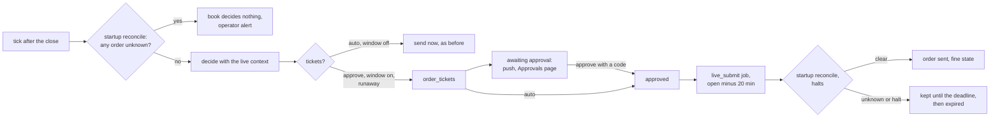

- **When a book uses tickets.** A live book (the default portfolio at an external `[brokers].kind`, or a broker portfolio traded through its connection) writes tickets when it has an `approve` subscription, when `[production.live] submit_in_window = true`, or when a runaway run or an open `runaway` halt holds its orders. Otherwise an auto book still sends at once. `submit_in_window` is off by default, so today's auto books behave as before. Turn it on for the IBKR stages.
- **One book per broker account.** Approve and auto subscriptions of a portfolio share one book, recorded in `portfolio_runs` as mode `auto`. `auto_subscriptions_json` lists both. An order held for a person is any order of an approve strategy, and any order that is not one auto strategy's own (a constructor's blended order included).
- **Mode rules.** The ladder is notify, paper, approve, auto. A subscription never starts in approve. Switching to approve, and from approve to auto, needs the auto checklist and a fresh second factor (`subscription.auto_enable`). The existing pauses (broker error, gateway down, inactive strategy) still touch auto rows only: an approve row places nothing without a person anyway.
- **Ticket table.** Migration 033: `order_tickets` as designed, plus `as_of`, the order's own columns, `hold` (`approve_mode` or `runaway`), `submit_after`, `submitted_at` and `status_reason`. Statuses add `failed` (the broker refused the order). Every change goes through one transition table in `production/tickets.py`. The table is append-only.
- **Submit window.** `[production.live.submit]`: `calendar` (XNYS), `window_minutes` (20) and `deadline_minutes` (2). A ticket may go out from the next open minus the window until the open minus the deadline, then it expires. The `live_submit` job fires at open minus 20 minutes on every backend, reads the real time (never the fire time) and is never caught up late.
- **Submit steps.** Per portfolio: open the broker, `startup_reconcile` then `require_reconciled`, then the halts in force now (a halt of new orders holds every ticket, a halt of buys holds the opening ones). Each order row is committed `pending`, sent, then `submitted`. A rejection fails the ticket. A submit with no answer is `unknown` until reconciliation settles it.
- **The tick.** An external book now runs `startup_reconcile` before it decides and noops (reason `orders_unreconciled`) while an order is `unknown`. It builds `RiskContext.live` with `build_live_context` (quotes for the held and signalled tickers, since the orders do not exist yet). The tick's order rows write the fine `state` with the status, a submit with no answer turns `unknown`, and a sent order turns `submitted`.
- **Not yet.** The pre-open gap check at submit (built in 19.14, section 16), the stage (`broker_paper` or `live`) in the live context (19.9: it is `live` for now), MCP and API tokens approving (never: step-up only), a CLI for tickets (the console approves, `stonks schedule run-now live_submit` sends), and a menu badge with the waiting count (the push and the Approvals page carry it).

## 17. What 19.9 built

Stages, gates and the preview. Where it differs from the sections above:

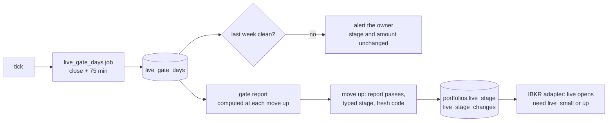

- **Stages.** `portfolios.live_stage` in {`sim_paper`, `broker_paper`, `live_small`, `live_scale`}, default `sim_paper`. `production/live/stages.py` is the only writer. Every change writes an append-only `live_stage_changes` row first, then an `audit_log` row, and a trigger refuses a stage write without its log row. Moving up goes one stage at a time with a passing gate report embedded in the row. Moving down goes to any lower stage with a reason.
- **Who.** Moving up needs `live.manage` (a fresh second factor) and the target stage typed in `confirm`. The shell (`stonks live stage promote`) is trusted like `stonks users`: it asks for the typed stage and still needs a passing report. Moving down needs `portfolio.trade` only. MCP reads the stage and the gate report, and never changes them.
- **No automatic moves.** Owner decisions win over section 1 and section 6: there is no ramp, no mandatory approve stage, and a dirty week, drift or a gate that breaks never demotes. A dirty week sends a normal-urgency push. The halts and the kill switch still stop trading.
- **Gate days.** `live_gate_days` (migration 037), one row per portfolio past `sim_paper` per session, written by the `live_gate_days` job after the tick: orders sent, filled, rejected by the broker, refused by our own rules (read from the tick's risk adjustments, not failures), stuck, fills and fills with no commission, the session's mean TCA gap, the book's return and its model book's return, and drift. Uptime is not recorded yet: the gateway status table keeps only the latest check.
- **Clean session.** No drift, no stuck order, every commission booked, and a rejection rate under `max_reject_rate` (2%). A clean week is `week_sessions` (5) clean sessions in a row.
- **Model book.** `ShadowModelBook` weighs the model books (`shadow_portfolio_snapshots`) of the portfolio's approve and auto subscriptions. Active strategies keep one with `[production] model_books = "all"`. Tracking error is the annualised standard deviation of the daily return differences. It is reported, and gates only when `max_tracking_error` is set.
- **Drift seam.** `DriftSource` reads the unexplained items of the session's last end-of-day `reconcile_reports` row. Until 19.5 creates that table it reads nothing, and the reconciliation check shows as "no data yet".
- **Gate reports.** `gate_report` checks what the next stage needs, with the thresholds under `[production.live.stages]`. Gate 1 (to `broker_paper`): a broker link, a subscription, 20 paper days on each, every strategy active. Gate 2 (to `live_small`): 20 sessions in `broker_paper`, the last 20 clean, the allocation and the account profile set, a kill switch drill, tracking error. Gate 3 (to `live_scale`): 40 sessions in `live_small`, the last 30 clean, 30 filled orders, and the TCA gap's bootstrap 95% interval includes zero or sits below it. A check with no data yet (drift, drills, tracking) does not block. The rehearsal items of gate 1 in section 1 (re-authentication, restarts, drills) come with 19.11.
- **Preview.** `production/live/preview.py` runs the tick as a dry run for the portfolio's live book with an `order_sink` that receives the decided orders. Every broker the tick opens is wrapped in `PreviewBroker`, which refuses to place or cancel anything. The preview asks the broker's `what_if` for each order and reports a failed one. Only a dry-run tick row is written. The gate report does not embed a preview yet.
- **Live context.** `LiveContext.stage` is the stored stage.
- **Adapter.** `IbkrBroker` takes a `stage_lookup` (`connect_ibkr` reads `portfolios.live_stage` of the portfolio it serves). At a live gateway an order that may open needs `live_small` or up, and an unknown stage refuses. Closes and cancels still go out, so a book moved down can wind down (P28).
- **Profile lock.** The account profile cannot change while the portfolio is at `live_small` or up.
- **Console.** The live settings page (`/profile/live/:id`) has a Stage card (the ladder, the checks, the last sessions, moving up and down, the changes) and an Order preview panel.


## 14. What 19.3 built

The `ibkr` connection, borrow checks, daily borrow rates and Flex statements. Where it differs from section 2:

- **The connection.** `connections/providers/ibkr.py` registers `ibkr` with `READ_BALANCES`, `READ_POSITIONS`, `READ_ACTIVITY`, `TRADE` and `SHORT`. `READ_ORDERS` is left out, since reconciliation reads orders through the broker. Its one field is `gateway`, the name of a `[brokers.ibkr.gateways]` entry. It holds no login. The connections config reads the same `[brokers.ibkr]` table as the broker, so the gateways are set in one place.
- **Sync.** Cash, buying power and net liquidation come from the account values. Positions map back by `conId` and then by market and symbol (`ticker_for_contract`). A holding in a market we do not cover keeps its raw symbol. Activities are the session's executions, hand-placed ones too, since the sync mirrors the whole account. Ids are `exec:<execId>`, so a later Flex row for the same execution updates it.
- **Shared sessions.** One API client id holds one session. The provider keeps one session per gateway and role for the process (sync 12, tick 11) and a connection never closes it. The broker also maps unknown contracts back by market now, so an owned position still reads as its ticker after a restart with a cold cache.
- **Trading.** `trader(account_id)` returns an `IbkrBroker` on the tick's client id, bound to the linked account. `open_trader` passes the state DB, so the contract cache and the `orderRef` lookup persist.
- **Ownership.** The account is shared with the owner's own trading. The broker reports the whole account. The tick keeps only what the book opened (`production/ownership.py`) and never trades the rest. The broker books only executions with our `orderRef`. An integration test covers this with a hand-bought holding next to a book's buy.
- **Cash or margin.** `[brokers.ibkr.gateways.<name>] account_type` is `cash` by default. A cash account refuses every short sale. A margin account shorts only with a locate: `IbkrBorrowSource` reads IBKR's shortable ticks (generic tick 236: easy above 2.5, hard above 1.5, else none, plus the shares it can lend) and takes the fee from the lake. A hard name without a known fee gets no quote. An easy one falls back to a general fee. An order larger than the shares on offer is refused. No quote means no short.
- **Borrow rates.** DuckDB migration 021 adds `borrow_rates (ticker, as_of, source, currency, isin, available_shares, fee_rate_annual, rebate_rate_annual)`, rates as yearly fractions and `source` in the key. `stonks ingest borrow` reads IBKR's public short stock files (`ingest/sources/ibkr_borrow.py`, one market per unit of the run). Bond CUSIPs and masked ISINs are dropped. `LakeBorrowSource` quotes from the table: `none` at zero shares, `hard` at or above a fee threshold, else `easy`.
- **Not a price source.** The borrow source is not one of the `--source` ids, so the API and its generated client are unchanged.
- **Flex.** `execution/brokers/ibkr/flex.py` runs the two-step Flex Web Service fetch, polls while IBKR generates the statement, and parses execution-level trades and cash transactions. The token comes only from `STONKS_IBKR_FLEX_TOKEN`, is refused in TOML and is scrubbed from every error. The sync caches a statement for `refresh_hours` and never fails when Flex fails.
- **Not yet.** Flex rows are not yet compared with our fills (that is reconciliation, 19.5). The broker borrow source in the tick and the `ingest_borrow` job came with 19.14 (section 16).

## 15. What 19.5 built

Reconciliation lives in `execution/drift.py` (pure diffs) and `production/live/checks.py` (the checks). Where it differs from section 6:

- **One table.** `reconcile_reports` is SQLite migration 034. Next to the design's columns it keeps `as_of` (the session), `external_json` (the owner's own positions and orders), `summary_json` (what reconciliation booked), `detail` (why the broker could not be read), `halt_id` and `paused_json`. Status is `clean`, `warn`, `drift`, `outage` or `fault`.
- **Order of work.** A check reconciles first (`startup_reconcile`: fills from executions, states by client id), then diffs. A material difference triggers one more reconcile and a second look, so a fill that lands between two reads is booked, not called drift.
- **Positions.** Stonks owns its net filled quantity per ticker (`owned_positions`, manual orders excluded). The broker must hold at least that on the same side. The rest is external. With `allow_manual_trades = false` positions must match exactly.
- **Orders.** A new optional broker capability, `OpenOrderSource.open_orders()`, lists every working order with its client id, or none when placed by hand. `IbkrBroker` implements it. A broker without it (the simulated one) is checked on positions and unresolved orders only.
- **Kinds.** Material: `position_qty`, `unknown_position`, `unknown_order`, `missing_order`, `order_state` (the ledger closed an order the broker still works, or the state machine refused the broker's report), `unknown_execution`. Alert only: `unresolved_order` (still `unknown`, blocks a submit), `stuck_order`, `commission_missing`, `stale_order` (cancelled at the start of the day).
- **Not yet.** `rules_mismatch` is not compared. Cash and the Flex statement came in 19.15 (section 16). The broker snapshot and `live_gate_days` at the end of the day wait for 19.9, and so does demoting a stage after drift that stays for 2 checks.
- **Outage versus fault.** `auto_pause.broker_failure_kind` names a `BrokerUnavailableError`, a dropped socket or a timeout an outage, anything else a fault. The tick no longer pauses auto on an outage: the book skips the day (`broker_outage` in its summary). A check pauses after outages on `[production.live] outage_pause_after_sessions` sessions in a row (2), and at once on a fault or drift. Drift pauses with a `broker_drift: report <id>` reason.
- **Jobs.** `live_sod_check` (open minus 60 minutes) and `live_eod_check` (close plus 15) run the `live_reconcile` action through each gateway with the new `reconcile` client id (14). Splits come from the lake when it can be opened read only.
- **Submit gate.** `submit_gate` runs a `submit` check. The submit window of 19.8 sends only when `CheckResult.may_submit`.
- **Surfaces.** `GET /api/reconcile/reports`, `GET /api/reconcile/reports/{id}`, `stonks reconcile list|show|run`, the MCP tools `list_reconcile_reports` and `get_reconcile_report`, and a panel on Health that stays hidden until a report exists.

## 16. What 19.10 built

Protective stops live in `production/live/stops.py`. Where they differ from section 4:

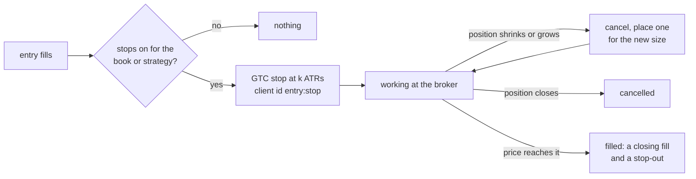

- **Settings.** `[production.risk.rules.protective_stops]` (`enabled`, `atr_multiple`, `atr_window`, `fallback_pct`), not `[production.live.stops]`. As a rule setting it gets the tighten-only merge: a portfolio's risk overrides or one strategy's subscription can turn stops on and bring them closer, never turn them off. It is not a risk rule: no order is dropped, and the risk layer's own on and off does not apply.
- **Price.** The entry price is the average cost of the position from the book's own fills. The ATR is Wilder's over `atr_window` traded daily bars. Without enough bars the distance is `fallback_pct` of the entry. A stop never sits beyond the market: when the price already passed the level, it is measured from the close. A split moves a working stop's price with its shares.
- **Ids and groups.** The first stop of an entry is `<entry>:stop`, a replacement `<entry>:stop:2` and so on. The OCA group is one per position entry (`stk-oca-` plus a hash), so a new entry never reuses a group whose orders already filled. The tick's exits of that position join the group, and IBKR's OCA type 2 shrinks the other orders by the filled quantity with overfill blocked. An exit is never dropped as a conflict with a working stop.
- **Resizing.** Cancel first, then place. A smaller position keeps the stop price. A grown one (a new entry) is priced from the new average cost. Duplicates keep one stop.
- **When.** The tick syncs stops for every book, noop runs included, after its orders are sent. The new `live_stops` job (open plus 30 minutes, every backend) does the same for live books after the opening auction, behind the startup reconciliation gate. A halt of new orders pauses both. The job opens the lake read only for the ATR, and falls back to `fallback_pct` while another process holds it.
- **Ownership.** The quantity protected is the book's own view: the account position capped by what the book's fills explain, so the owner's manual holdings in a shared account get no stop.
- **Simulated books.** Paper books keep stops in the ledger (`accepted`). The next tick replays the daily bars since each stop was placed through the simulated broker, whose good till cancelled stops now rest until a bar's low (or high) reaches them, and books the fill with that run's snapshot.
- **Protections.** `count_losses` of `stop_cooldown` and `stop_guard` is now unset by default: losses count only while the book has no protective stops. With stops on, only stop fills are stop-outs.
- **Ledger.** Migration 036 adds `orders.oca_group` and `orders.protective`. The orders API returns `protective`, `stop_price` and `time_in_force`, and the console says "Protective stop: sells if the price falls to ..." under the ticker.
- **Not yet.** The kill switch in stop-all mode cancels stops with every other order, and they come back when trading resumes. Stops trigger on regular hours only (`outside_rth` stays refused).

## 19. What 19.16 built

Broker edge cases in the IBKR adapter and the tick. Where it differs from the sections above:

- **Pence-quoted markets.** IBKR quotes a London stock in pence: its contract says GBP with a price magnifier of 100. Stonks works in the currency's major unit everywhere. The adapter divides every price it reads (quotes, execution prices, average fill prices, the sync's activities) by the magnifier and multiplies every price it sends (limits, collars, stops, what-if orders). Limits snap on IBKR's own tick grid, in pence. `ResolvedContract.spec().tick_size` is in pounds. Money is never scaled: commissions and margin stay as IBKR reports them. `to_major` and `to_ib_price` in `contracts.py` do the sums with decimals. A contract missing from the cache is looked up once to find its magnifier. One that cannot be resolved counts as 1, with a warning.
- **Lake prices.** EODHD sends London bars in pence (GBX). A London `decision_price` from the lake must be in pounds before it reaches the adapter, or the collar and the price band are off by 100. Converting the lake is a follow-up. Until then, keep London names out of live books, or turn on the `price_band` rule, whose `max_gap_pct` drops an opening order whose broker reference is that far from its decision price.
- **Hard to borrow.** A short opening order for a name the borrow source marks `hard` (IBKR's shortable level between 1.5 and 2.5, or a lake fee over its threshold), or whose yearly fee is at or above `[production.live] hard_to_borrow_fee_rate` (0.03), becomes a ticket held `hard_to_borrow`, even in an auto book. The source is the broker's own (`IbkrBroker.borrow`), else the book's `borrow_check` or `squeeze_guard` settings. No quote or no locate is not held: the broker refuses that short anyway. With tickets off (auto, `submit_in_window = false`) only the held orders become tickets and the rest of the book is sent at once. The book's summary lists them under `hard_to_borrow`. After approval the `live_submit` job sends them in the window, where the broker checks the locate again.
- **Migration 039.** `order_tickets` is rebuilt so `hold` takes `hard_to_borrow`. Rows, indexes and the append-only trigger stay. The API's ticket view and the console's hold words know the new value.
- **Cancel origin.** IBKR names who cancelled a completed order in its completed status (`Cancelled by Trader`, `Cancelled by System`). `ib_async` drops that text, so `IbAsyncClient` keeps it by `permId` as the decoder hands it over, and `IbTrade.cancel_origin` is `trader` or `system`. A person's cancel reads `cancelled`, and IBKR or the exchange ending the order unfilled reads `expired`. A cancel this broker sent itself also reads `cancelled`. With no origin, the rule of 19.2 stays: an unfilled opening-auction order is `expired`, anything else `cancelled`. An order with some fills is always `cancelled`. The words matched are in `status.py`. The live run should confirm IBKR's exact texts.
- **orderRef length.** `test_live_order_ref_max_length_is_measured` places far limit buys on the paper account with references of 24 to 128 characters, reads each back on the open order and after the cancel, and records the longest kept whole. It fails when `[brokers.ibkr.orders] order_ref_max_length` is longer than that.
- **Measured value.** Not measured yet: to be filled in from the first live run (the test's `order_ref_max_measured` property). `order_ref_max_length` stays 40 until then.
- **Live London test.** `test_live_london_prices_are_in_pounds` checks that `VOD.LSE` resolves with a magnifier of 100 and quotes in pounds.

## 20. What 19.14 built

19.14 connects what 19.3, 19.5 and 19.8 left apart. No migration.

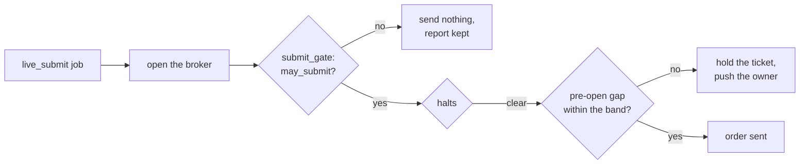

- **Submit gate.** `production/submit.py` calls `submit_gate` in place of its own `startup_reconcile` and `require_reconciled`. It sends only when `CheckResult.may_submit`. Every run stores a `submit` report. An outage or a fault reports the portfolio as `error`, drift or an order still `unknown` as `skipped`. A lookup the broker times out on counts as drift in 19.5, so it also opens the `broker_drift` halt of buys, and a person clears it.
- **Pre-open gap.** `production/live/gap.py`. The limit is the portfolio's `price_band.max_gap_pct`, else its `band_pct`. It follows the tick's merge: the global policy tightened by the owner's and the portfolio's limits. The quote is the broker's latest (`QuoteSource`), delayed ones included. An opening ticket with no quote is held. A close always goes out (P28). A held ticket stays approved, expires at the deadline, and the owner gets one high-urgency push per portfolio and day.
- **Borrow from the broker.** A new optional capability, `BorrowLocator.borrow_source(fees)`, in `execution/brokers/base.py`. `IbkrBroker` implements it on a margin account: its own `IbkrBorrowSource`, with the lake's `borrow_rates` (`LakeBorrowSource`) filled in as the fee. The tick asks for it when a short book trades at an external broker (`financing.broker_borrow_source`) and hands it to the short rules. The broker's own locate before a short sale uses the same source. A broker without the capability, or a cash account, keeps the settings' source.
- **Borrow ingest job.** `ingest_borrow` runs at close plus 35 minutes on the `local`, `api` and `in_process` backends and skips while `[brokers.ibkr.gateways]` is empty. It reads `params.markets`, else `[sources.ibkr_borrow] markets`. The `api` backend posts `POST /api/ingest/runs` with the new kind `borrow` and a `markets` list, so the lake keeps one writer.
- **Not yet.** The gap check reads one quote per ticker and does not retry. A held ticket is not re-checked later in the window, since the job fires once.

## 21. What 19.15 built

The end-of-day check now also compares cash and the broker's statement. No new table: the cash baseline and the notes live in the report's `summary_json`.

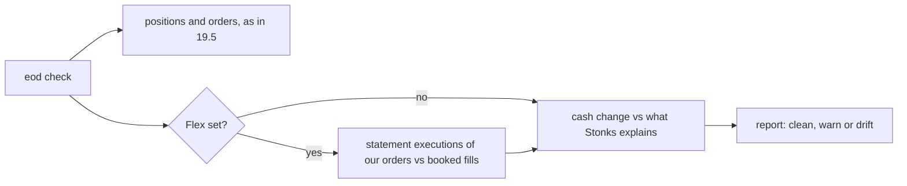

- **Cash.** The account is shared with the owner's own trading, so the check compares only what Stonks can explain. It takes the broker's change in cash and settled cash since the last end-of-day report of the portfolio. It subtracts the cash of Stonks' own fills and fees (every portfolio on the gateway), dividends on Stonks' positions, and every other flow the statement names (the owner's hand trades, dividends on the owner's holdings, interest, deposits). Settled cash counts a fill on its settle date (the `account_rules` cycles: US T+1, EU and UK T+2). What is left beyond `max(cash_tolerance, cash_tolerance_fraction x NLV)` is a `cash` or `settled_cash` item.
- **Warn, not drift.** A cash item only warns. `[production.live.reconcile] cash_is_drift = true` makes it material, so it opens the halt and pauses auto. Without a Flex statement, a hand trade, a deposit or interest shows as a cash warning. That is expected.
- **The first check** stores the baseline and compares nothing. So does a check after the account's base currency changed.
- **One currency.** The check compares the account's base currency totals. Stonks' fills count at face value. Statement rows in another currency are skipped and counted in `skipped_foreign`.
- **Flex statement.** When `[brokers.ibkr.flex] query_id` and `STONKS_IBKR_FLEX_TOKEN` are set, the check reads the statement through the cache the `ibkr` sync uses (`execution/brokers/ibkr/statements.py`). It maps each Flex statement to a vendor-free `BrokerStatement`. Statements of another account than the gateway's `account_id` are ignored. For each statement's days, the executions of the portfolio's own orders (by `orderRef` or execution id) must match its booked fills. Hand trades are left out.
- **Statement kinds.** Material: `statement_missing_execution` (the statement lists it, the ledger never booked it), `statement_extra_execution` (booked, not in the statement), `statement_quantity`. Alert only: `statement_commission` (beyond `commission_tolerance`, or not booked yet). A failed Flex fetch never fails the check. It is noted as `summary.statement.status = failed`.
- **Drift streak.** A drift report records `summary.drift_streak`, the drift reports in a row including this one. The stage gate reads it. The stage never moves by itself (owner decision): drift halts buys, pauses auto and alerts, and a person demotes the stage when they want to.
- **Metrics.** `stonks_reconcile_drift_items{portfolio, severity}` (material or warning, unexplained items of the latest check), `stonks_reconcile_last_status{portfolio, status}` and `stonks_reconcile_last_check_timestamp_seconds{portfolio}`. Labels name the portfolio, never the account.
- **Mutation testing.** `execution/drift.py` is the `drift` target of `tools/mutation.py`.

## 22. What 19.17 built

The review found that every IBKR broker the API built used the tick's client id (11). IBKR lets one session hold a client id at a time. So while a tick ran, the kill switch and manual orders could not connect. 19.17 gives the API its own session.

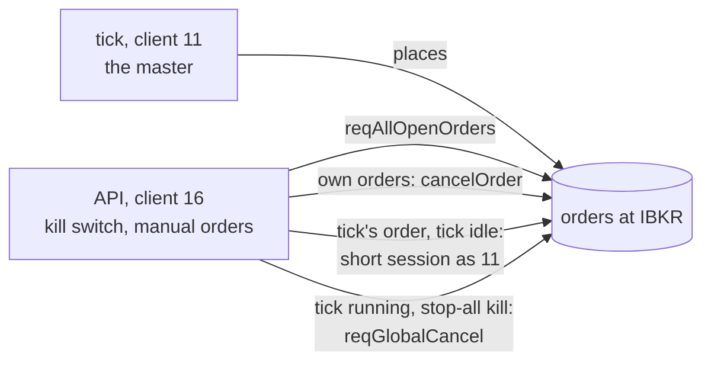

- **A new role.** `api` has client id 16 (`[brokers.ibkr] client_ids`). The kill switch and manual orders build their broker with it (`make_broker(..., ibkr_role="api")`, and `open_trader(..., session="api")` for linked IBKR portfolios). The ids must all differ, or the settings are refused.
- **The master client.** `[brokers.ibkr] master_client_id` names the "Master API client ID" set in IB Gateway. Unset, it is the tick's id. The owner sets it once in the gateway (`deploy/ibkr/README.md`). The master keeps every order in sync. Any other client reads open orders with `reqAllOpenOrders` (`IbClient.all_open_trades`), so the API, sync and reconcile sessions see the tick's orders. The tick also asks every client for an order it did not send when its own view lacks it, so a missing master setting (a recreated gateway container loses it) never makes a manual order read as gone.
- **Who may cancel.** IBKR lets only the client that placed an order cancel it. A broker that is the master also tries its own cancel (the fake allows it, and a refusal from the gateway comes back as an error). `IbTrade.client_id` carries the placing client. The API cancels its own manual orders at once. For an order of another Stonks client id, it opens a short session under that id (one try), cancels, and closes it. While that id is busy (a tick is running), the cancel fails with `OrderOwnedElsewhereError`. An error 10147 (not your order) is never read as "nothing to cancel".
- **The kill switch while a tick runs.** Single cancels of the tick's orders fail then. A stop-all kill that covers every portfolio of the gateway (a global kill, or one naming all of them) falls back to one `reqGlobalCancel` and syncs the failed rows again. It also cancels orders placed by hand in TWS, as stop-all always meant. A buys-only kill never cancels everything: its failures are audited, and pressing again once the tick is done cancels them one by one.
- **Closed after use.** The kill switch and each manual order request close the broker they built, so the next request can open client id 16 again.
- **Tests.** `FakeIbGateway` models ownership: `session(client_id)` opens another client of the same gateway, a busy id answers 326, `open_trades` holds a client's own orders (every order for the master), and `cancel_order` of another client's order answers 10147 unless the caller is the master. No migration.
