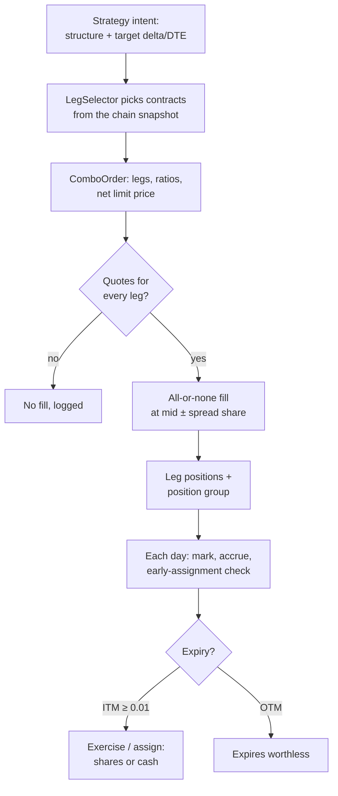
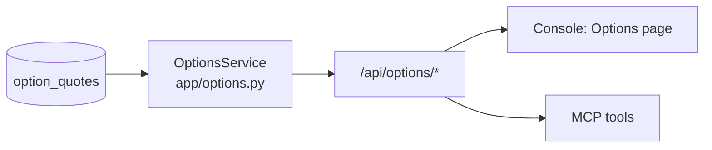

# Options

Design for roadmap Phase 17. When it was written Stonks had no derivatives: positions were keyed by ticker, valued at `qty × price`, and every instrument lived in `instruments`.

**Status:** stages 1 to 4 are built as research, off by default (roadmap 17.1 to 17.5), and the console and MCP can read chains, draw payoffs and run options backtests (17.6, section 10). Nothing in the tick, the console or MCP trades options. Stage 5 (live) waits for Phase 19. Section 9 lists what changed from this design.

Staging is the main decision: **read-only analytics first** (chains, implied volatility, Greeks, "what would a covered call on my holdings pay"), then backtests, then paper, and live trading last behind its own go-live.

Non-goals for now: naked short options, futures options, exotic payoffs, intraday options data, market making.

## 1. Instrument model

Options don't go in `instruments`: a single large underlying has thousands of contracts and they churn daily. They get their own table and a canonical id.

**Contract id**: `<underlying>:<expiry>:<C|P>:<strike>`, e.g. `AAPL.US:2026-01-16:C:150`. Vendor symbols (OCC `AAPL  260116C00150000`, broker variants) are mapped at parse time, like tickers today.

**`option_contracts`** (lake) `(contract_id PK, underlying, expiry, strike, right, style, multiplier, settlement, currency, exchange, first_seen, last_seen)`
- `right ∈ {call, put}`, `style ∈ {american, european}`, `settlement ∈ {physical, cash}`: normalised literals.
- `multiplier` is usually 100, but adjusted contracts after splits or mergers differ, so it is never assumed.

**Core types** (`core/options.py`):

```python
@dataclass(frozen=True)
class OptionContract:
    contract_id: str
    underlying: str
    expiry: date
    strike: float
    right: Literal["call", "put"]
    style: Literal["american", "european"]
    multiplier: float
    settlement: Literal["physical", "cash"]
```

**Valuation with multipliers.** `Portfolio.positions` stays `id -> signed quantity`; an option position is keyed by its contract id. `Portfolio.total_value(prices, multipliers=None)` and the fill cash delta use `qty × price × multiplier`, where the multiplier map defaults to empty (1.0). Long-only equity code never passes it, so nothing changes there. An `InstrumentBook` helper resolves multipliers and underlyings for any id.

## 2. Data source and lake tables

**Seam.** An optional capability on `DataSource`, duck-typed like the other hooks:

```python
def fetch_option_chain(self, underlying: str, as_of: date) -> OptionChainFrame: ...
```

`OptionChainFrame` has our columns only: `contract_id, bid, ask, last, volume, open_interest, vendor_iv, underlying_price, quoted_at`. Candidate vendors: EODHD's options add-on, Tradier, Polygon (Massive), or ORATS or CBOE for history. Yahoo has current chains only. Each is one adapter file.

**`option_quotes`** (lake) `(contract_id, as_of, bid, ask, last, volume, open_interest, vendor_iv, underlying_price, source; PK (contract_id, as_of, source))`: one end-of-day snapshot per contract.

**Size control.** 500 underlyings × ~2,000 contracts × 252 days is about 250 M rows a year. So:
- snapshot only a configured list of underlyings (watchlists plus holdings), strikes within ±30 % of spot, expiries up to 1 year;
- store the table as Parquet partitioned by underlying and year (the same layout Phase 14.2 uses for bars), queried through DuckDB;
- start collecting forward now; buy history only when a strategy needs it for validation.

**Derived tables** (recomputable, never the source of truth): `option_analytics (contract_id, as_of, iv, delta, gamma, vega, theta, rho, model)` and `vol_surface_points (underlying, as_of, expiry, moneyness, iv)`.

## 3. Pricing and Greeks seam

```python
class OptionPricer(ABC):
    name: ClassVar[str]
    def price(self, c: OptionContract, m: MarketInputs) -> float: ...
    def greeks(self, c: OptionContract, m: MarketInputs) -> Greeks: ...
    def implied_vol(self, c: OptionContract, m: MarketInputs, price: float) -> float | None: ...
    # vectorised versions over a whole chain are the main path
```

`MarketInputs(spot, rate, dividend_yield | discrete_dividends, vol, as_of)`.

| Pricer | Wraps | Use |
|---|---|---|
| `black_scholes` | `py_vollib` / `py_vollib_vectorized` | European, index options, fast chain-wide IV and Greeks |
| `american` | `QuantLib` (Barone-Adesi-Whaley or binomial) | Equity options with dividends, early exercise value |

- Registry `@register_pricer(name)`; strategies and risk ask for a pricer by name, and vendor types never leave the adapter.
- Rates: Treasury yields from `bond_yield_history` interpolated to expiry; dividends from `dividends` (known future ex-dates, else trailing yield).
- `VolSurface`: per-expiry smile interpolation in moneyness, total-variance interpolation across expiries; an SVI fit can come later behind the same class.
- IV that fails to solve (price below intrinsic, stale quote) is `NULL`, never a guess.
- Cores: IV and Greeks are vectorised per chain; the per-underlying fan-out goes through `lab/parallel.run_tasks`.

## 4. Backtest handling



- **Fills.** From the day's quote only: buy at `mid + f × half-spread`, sell at `mid − f × half-spread`, `f` configurable (default 1.0, i.e. at the touch). No quote, no fill: a model price never fills in v1. Fee per contract (e.g. $0.65) through the cost model.
- **Multi-leg.** `ComboOrder(legs=[(contract_id, ratio, side)], net_limit)` fills all legs or none. Legs are ordinary positions; a `position_groups (group_id, portfolio_id, structure, legs_json, opened_at)` row ties them together for risk, P&L and exits.
- **Expiry.** At the expiry close: ITM by at least $0.01 is exercised (OCC auto-exercise); physical settlement turns into `± multiplier × qty` shares of the underlying at the strike, cash settlement credits intrinsic value. OTM expires at zero.
- **Early assignment** of short American options, via an `AssignmentModel` seam: default assigns a short call the day before ex-dividend when its extrinsic value is below the dividend, and a deep ITM short put when extrinsic value falls below a threshold. Configurable, reported.
- **Corporate actions.** Splits produce adjusted contracts (new multiplier or deliverable); v1 closes affected positions at the last quote and logs it.
- **Calendar.** Weekly and monthly expiries follow the exchange calendar from Phase 12.1.
- The engine iterates daily bars as today; option marks come from `option_quotes` of the same day.

## 5. Risk

Portfolio Greeks are summed in share-equivalents and dollars (`dollar_delta = Σ delta × multiplier × qty × spot`). New rules under `production/rules/`:

| Rule | Limit (defaults to confirm) |
|---|---|
| `greek_limits` | `max_abs_dollar_delta` (e.g. 1.0 × equity), `max_vega` (% of equity per vol point), `max_gamma`, `max_theta_decay` |
| `max_loss` | Every position group must have a defined max loss (long options, verticals, iron condors, covered calls, cash-secured puts); max loss per group ≤ `max_loss_per_group` (2 % of equity) and in total ≤ `max_loss_total` |
| `option_liquidity` | Minimum open interest and volume; maximum spread as % of mid |
| `expiry_rules` | Close or roll at `min_dte` (e.g. 5 days) to avoid pin and assignment risk; cap exposure per expiry date |
| `option_margin` | Cash-secured puts reserve `strike × multiplier`; covered calls need the shares; spreads reserve max loss; naked shorts rejected in v1 |

The generic property test still applies: rules never increase max loss or gross Greeks, and closing orders are never blocked.

## 6. Strategy contract and examples

Option strategies usually reuse an equity view, then choose a structure. So the contract splits in two:
1. The strategy returns **intents**: `OptionIntent(underlying, structure, params)`, e.g. `("AAPL.US", "covered_call", {"delta": 0.30, "dte": 35})`.
2. A **structure registry** (`options/structures/*.py`, `@register_structure`) turns an intent into legs with a `LegSelector` over the chain snapshot (nearest delta, nearest DTE, liquidity filters).

This keeps selection logic in one place and lets any equity strategy drive an options overlay.

| Strategy | Idea |
|---|---|
| Covered call overlay | Sell ~0.30 delta, 30-45 DTE calls on held shares; roll at 50 % profit or 21 DTE |
| Cash-secured put (wheel) | Sell puts on names an equity strategy wants to own; assigned shares then get covered calls |
| Protective put / collar | Buy puts on large holdings when a regime filter (BL-42) turns risk-off |
| Vertical spreads | Defined-risk directional bets from existing momentum or trend signals |
| Volatility risk premium | Iron condors when IV rank is high and implied exceeds forecast realised volatility (BL-48 `VolForecaster`), per Sinclair and Natenberg |

Validation reuses the lab: survival tests run on the equity curve; options add a check that results survive wider fills (`f` from 1.0 to 1.5) and missing-quote days.

## 7. Staging

| Stage | WP | Delivers | Trades? |
|---|---|---|---|
| 1 Read-only analytics | 17.1, 17.2 | Contract model, chain adapter, daily snapshots, pricers, IV and Greeks, vol surface; UI pages for IV rank, term structure, skew, expected move; insight "covered-call yield on my holdings" | No |
| 2 Backtests | 17.3 | Multipliers in valuation, combo fills, expiry, assignment, position groups | Simulated only |
| 3 Risk and paper | 17.4 | Greek and max-loss rules, option margin; paper subscriptions | Paper |
| 4 Strategies | 17.5 | The examples above through the lab and go-live | Paper, then auto |
| 5 Live | after 17.5 | Auto only with `Capability.OPTIONS` on the connection; the broker's options approval level limits the allowed structures (level 1: covered and cash-secured; level 2: long options; level 3: spreads) | Auto with 2FA |

Owns, by stage: `core/options.py`, `ingest/sources/<vendor>_options.py`, lake migrations for `option_contracts`, `option_quotes` and analytics; `options/{pricing,surface,structures,selector}/*`; `backtest/{options_fills,expiry}.py` and multiplier support in `core/types.py` and `backtest/engine.py`; `production/rules/{greek_limits,max_loss,option_liquidity,expiry_rules,option_margin}.py`; `strategies/examples/options/*`.

Depends on: shorting's `position_effect` and margin seam (Phase 16) for short legs; accounts design step S3 for connection capabilities.

## 8. Open questions

1. Which options data vendor, and do we buy history or collect forward only?
2. Which underlyings to snapshot (size and cost)?
3. Is QuantLib acceptable as a dependency (large wheel), or py_vollib only and European approximations at first?

## 9. What changed from this design

The build follows the sections above, with these differences.

**Data and vendor.**
- Vendor: EODHD's US options API. It is a separate Marketplace subscription (about $30 to $40 a month), not part of All-In-One. It covers about 6,000 US underlyings with two years of end-of-day history, bid, ask, last, volume, open interest, implied vol and the five Greeks. Live quotes will come from IBKR (OPRA top of book) with Phase 19.
- The seam is `DataSource.fetch_option_quotes(underlying, since, until)`, a date range, so one call can load history. `since == until` is one day's chain.
- `option_quotes` keeps the vendor's IV and Greeks as `vendor_*` columns. There are no `option_analytics` or `vol_surface_points` tables: our own IV and Greeks are computed when needed (`options/analytics.py`). The tables are plain DuckDB tables with indexes. Parquet partitions can come when the size needs them.
- A synthetic source (`options/synthetic.py`) prices chains from closes for hermetic tests. Its results are never evidence.

**Contracts and valuation.**
- Contracts are one case of a general `InstrumentSpec` (`core/instruments.py`), the model every instrument uses, with broker ids for the IBKR contract cache. Combo orders are general too (`core/combos.py`).
- The contract id adds the multiplier only when it is not 100 (`AAPL.US:2026-01-16:C:100:150`). Style and settlement travel with the contract, not in the id.
- `core/types.py` is unchanged. `Portfolio.total_value` gets no multiplier map. Instead the options ledger hands risk code a portfolio whose option prices are per contract (mark times multiplier), so the equity comes out right.
- Splits adjust contracts by OCC rules (whole-number splits multiply contracts, other ratios change the deliverable) instead of closing the position.

**Pricing.**
- The seam is `PricingModel` over plain `PricingInputs` (right, spot, strike, time, rate, dividend yield, vol). `inputs_for` builds them from a contract.
- QuantLib alone covers every model (question 3): Black-Scholes with a dividend yield, Black-76, Barone-Adesi-Whaley, Bjerksund-Stensland and a binomial tree, plus implied vol. py_vollib is not used.
- Rates and dividends come from a `PricingMarket` (`options/market.py`, roadmap 17.7). It pairs a `RateCurve` with a `DividendForecast` and builds the `PricingInputs` of a contract on a pricing day. Chains (`analyze`, `analyze_chain`), Greeks, implied vol, the leg selector, the risk view and the options backtest all take one. `PricingMarket.flat(rate)` is the old flat behaviour.
- `TreasuryRateCurve` (`options/rates.py`) reads constant maturity Treasury yields from `bond_yield_history` (`US1M.GBOND` to `US30Y.GBOND`, set in `RateCurveSettings`). For each tenor it takes the latest yield dated on or before the pricing day, drops a yield older than `max_age_days` (10), turns the bond equivalent percent into a continuous rate and interpolates linearly in time to each expiry, flat beyond the ends. With no usable yield it uses `fallback_rate` and logs `options.rate_curve.flat_fallback` with the reason, once per day.
- `KnownDividendForecast` (`options/dividends.py`) reads `dividends`. A future ex-date counts only when its `declaration_date` is on or before the pricing day. A row with no declaration date is not known before its ex-date. After the last known ex-date, or over the whole tenor when none is declared, the trailing year's cash over the spot fills in as a yield.
- The models still take one continuous dividend yield. Known cash dividends become the yield with `S exp(-qT) = S - PV(dividends)`, so a European price equals the escrowed dividend model (QuantLib's `AnalyticDividendEuropeanEngine`, checked in the tests). For American options this is an approximation: the early exercise just before an ex-date is not modelled exactly.
- Point in time (P12): a test shocks every yield dated after the pricing day and every dividend declared after it, and checks that prices, Greeks and implied vols do not move. The backtest has the same test end to end.

**Backtest.**
- A separate engine, `backtest/options_engine.py`, so the stock backtest and its golden results are untouched.
- Combos fill against the next day's quotes, not the decision day's (P12).
- The next dividend, used for early assignment and `ctx.next_dividends`, is the next ex-date among dividends declared on or before the day (`declaration_date` in `dividends`, roadmap 17.9). A dividend with no declaration date is not known before its ex-date (P12).
- Position groups live in the backtest ledger. There is no SQLite table yet, because nothing trades options on paper or live.

**Risk.**
- Four rules at order 9: `option_greek_limits`, `option_max_loss`, `option_margin` (Reg T strategy-based or a risk-based estimate) and `short_option_guard` (approval levels 1 to 4, no naked calls, cash-secured puts). Liquidity is a leg selector filter and expiry handling is each strategy's `roll_dte`, not separate rules.
- The rules read the day's option market from a new `RiskContext.options` field and keep or drop a combo as one unit.

**Strategies and validation.**
- The volatility strategy sells iron condors when at-the-money implied vol is rich against realized vol. IV rank needs an IV history we do not store yet.
- Options strategies have their own catalog and are not tuned in the lab. `stonks options backtest --validate` runs the tests that apply to any equity curve: out of sample PSR, deflated Sharpe, wider fills, missing quote days and doubled fees.
- The CLI is `stonks options ingest|chain|strategies|backtest`. The console and MCP came with 17.6 (section 10). Loading chains stays a CLI job for operators.

## 10. Console and MCP (17.6)

Research only: nothing here places an order or writes to the lake.



| Route | Permission | What it returns |
|---|---|---|
| `GET /api/options/underlyings` | `data.read` | Underlyings with stored chains: first and last day, days, contracts, sources |
| `GET /api/options/chains/{underlying}` | `data.read` | One expiry of a chain with our IV and Greeks, calls and puts by strike |
| `GET /api/options/strategies` | `data.read` | The options strategy catalog with hypotheses and parameters |
| `GET /api/options/structures` | `data.read` | Structures a payoff can be drawn for, with the parameters each reads |
| `POST /api/options/payoff` | `data.read` | One unit of a structure picked from a chain, its legs and its payoff at expiry |
| `POST /api/options/backtests` | `lab.run` | Queues an `options_backtest` job |
| `GET /api/options/backtests/{job_id}/result` | `data.read` | The equity curve, figures, validation checks and a verdict |

- **Chains.** `as_of` picks the last stored day on or before it, so a weekend shows Friday. The expiry defaults to the one nearest 30 days out. Greeks come from the `PricingModel` seam through `options/analytics.py`: theta per share per day, vega per share per vol point.
- **Payoff.** `options/payoff.py` builds one unit of the structure with the structure builders the backtest uses (over expiries up to 400 days out), then values the legs at expiry. The payoff is piecewise linear with kinks at the strikes, so max loss, max gain and breakevens are exact. Covered calls and protective puts include one contract's worth of shares. `null` means no bound.
- **Backtest.** The job runs `OptionsBacktester` and, unless `validation` is false, the checks in `options/validation.py`. The verdict is `passed` only when every check passes. A request is checked before it queues: a known strategy, valid parameters, and stored chains in the window.
- **Synthetic chains.** Every view says `synthetic: true` when all quotes came from the synthetic source. The console then warns that the result is never evidence.
- **MCP.** `list_option_underlyings`, `get_option_chain`, `list_option_strategies`, `list_option_structures`, `get_option_payoff` and `run_options_backtest`. The job tool follows the other research jobs: no confirm, and `wait_for_job` returns the typed result.
- **Console.** The Options page under Research (`/options`). See `docs/ui.md`.
