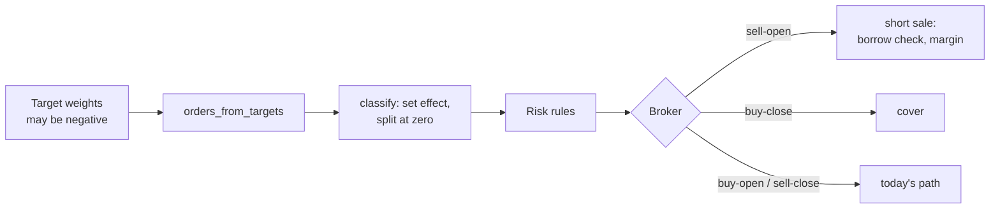

# Short selling

Design for roadmap Phase 16. Stonks is long-only today: `SimulatedBroker` rejects a sell beyond the held quantity, the `caps` risk rule clips sells so they can't open a short, `orders_from_targets` raises on a negative target, signal normalisation clips negatives, and the neurotrader888 ports turn their short legs into "flat".

Goal: long/short books as an **opt-in**, with long-only behaviour byte-identical by default.

Non-goals: naked shorting, short options (see `options.md`), portfolio margin, securities lending income.

## 1. Two switches, both off by default

A short can only open when **both** are true:

| Switch | Where | Default |
|---|---|---|
| The strategy can short | `BaseStrategy.supports_short: ClassVar[bool]` (duck-typed, read with `getattr`) and a param `short_mode ∈ {flat, short}` | `False`, `flat` |
| The book can short | `portfolios.allow_short` (tick), `BacktestConfig.allow_short` (backtest), plus a margin model other than `cash` | `False` |

Otherwise every negative signal is clipped to 0 and every opening short order is dropped with a logged `RiskAdjustment`, exactly as today.

## 2. Portfolio and order model

**Positions stay signed.** `Portfolio.positions` is already `ticker -> signed quantity`, and `apply_fill` already handles negatives (a short sale credits cash; `total_value` marks a short as a liability). No new position type. Add read-only helpers: `long_value`, `short_value`, `gross`, `net`.

**Orders keep `side ∈ {buy, sell}` and gain a position effect.**

```python
PositionEffect = Literal["open", "close"]

@dataclass(frozen=True)
class Order:
    ...
    position_effect: PositionEffect | None = None   # None = infer, legacy
```

- `sell` + `open` is a short sale; `buy` + `close` is a cover.
- `execution/orders.classify(order, held) -> list[Order]` sets the effect and **splits an order that crosses zero** into a close and an open (long 100, sell 150 becomes sell-close 100 and sell-open 50). Each order then has one effect, so borrow checks, margin, broker short-sale marking and the trade ledger each see one simple case.
- Client ids: the side token becomes `buy | sell | short | cover`. Long-only orders keep `buy` and `sell`, so their ids don't change.
- `orders.position_effect` is a new nullable column; `CHECK (side IN ('buy','sell'))` stays.



## 3. Simulated broker

`SimulatedBroker.place_order` gains one branch for `sell` + `open`:
1. Refuse unless `allow_short`.
2. Ask the `BorrowSource` (below) for availability on the fill date; `none` rejects with `reason = not_borrowable`.
3. Ask the `MarginModel` whether buying power covers the initial requirement; if not, scale down like `_affordable` does for buys, or reject.
4. Fill at the bid side of the cost model (`side = sell`), credit proceeds to cash.

Covers use the buy path; with margin the cash check is against buying power, not cash.

**Daily accrual.** A new `broker.accrue(as_of)` call, once per bar in the engine and once per tick:
- borrow fee: `Σ |short qty| × price × fee_rate_annual / 360`, debited to cash;
- debit interest on negative cash when the margin model allows leverage;
- recorded as `financing` events so the trade ledger and reports can show them.

**Dividends on shorts** are debited in full (manufactured dividend): withholding does not reduce what a short owes. `backtest/corporate_actions.py` already debits; the tick path gets the same rule and a test.

**Recall.** When the borrow source flips a held short to `none`, the backtest forces a cover at the next open (`forced_cover` reason). Off when the source has no history.

## 4. Borrow fees and availability

Seam `BorrowSource` (`execution/borrow.py`): `status(ticker, day) -> BorrowQuote(status ∈ {easy, hard, none}, fee_rate_annual, available_shares | None)`.

| Implementation | Use |
|---|---|
| `FlatBorrow` | Backtests. Fee per asset class from `[backtest.borrow]` (e.g. equity 0.5 %/yr general collateral); names below a liquidity or market-cap floor count as `hard` at a higher rate (e.g. 5 %) or `none`. |
| `LakeBorrow` | Reads lake table `borrow_rates (ticker, date, status, fee_rate_annual, available_shares, source; PK (ticker, date, source))` filled by any vendor. |
| Connection capability | Live: `BrokerConnection` with `Capability.SHORT` answers shortable and easy-to-borrow now. |

Missing borrow data never passes in production: no quote means no short. Backtests use `FlatBorrow` and must pass the borrow-cost stress (section 7).

## 5. Margin model

Seam `MarginModel` with a registry (`execution/margin.py`):

```python
class MarginModel(ABC):
    def initial_requirement(self, ticker, qty, price, asset_class) -> float: ...
    def maintenance_requirement(self, portfolio, prices, asset_classes) -> float: ...
    def buying_power(self, portfolio, prices, asset_classes) -> float: ...
```

- `cash` (default): no shorts, no leverage, buying power = cash. Today's behaviour.
- `reg_t`: 50 % initial on longs and shorts, maintenance 25 % long and 30 % short; per-asset-class overrides (crypto shorts often 100 %+).
- Later: a broker-reported model (read buying power from the connection).

A maintenance breach in a backtest liquidates the largest losing positions first until restored, and is reported; in the tick it raises a `high` risk notification and blocks new opens.

## 6. Risk rules

New files under `production/rules/`, registered like the rest:

| Rule | Does |
|---|---|
| `gross_exposure` | `Σ|w| ≤ max_gross` (default 1.0; e.g. 2.0 for 130/30 or market neutral). Scales opens. |
| `net_exposure` | `min_net ≤ Σw ≤ max_net` (default `[0, 1]`, so long-only is unaffected). |
| `short_caps` | Per position `|w_short| ≤ max_short_weight` (0.05), total `≤ max_short_total` (0.5). |
| `borrow_check` | Drops opening shorts without availability; drops or shrinks when `fee_rate_annual > max_borrow_fee` (0.10). |
| `squeeze_stop` | Covers a short after an adverse move of `k × ATR(20)` from entry (default 3) or `max_adverse_pct` (25 %), or when the borrow fee jumps past `max_borrow_fee`. |
| `margin_check` | Clips opens so the `MarginModel` requirement stays under buying power with a buffer. |

The `caps` rule's "sells can't open a short" becomes "sells can't open a short **unless the book allows shorts**".

The registry-wide property test changes from "buy notional never increases, sells never blocked" to: **rules never increase gross exposure, and position-reducing orders (sell-close, buy-close) are never blocked.** Long-only books are a special case, so every existing rule still passes it.

## 7. Strategy contract and validation

**Strategies**
- Scores may be negative; `supports_short` says they mean "short", not only "less long".
- Construction (`portfolio/signals.py`, constructors) already has `long_only`; it is set from `not book.allow_short or not strategy.supports_short`, per strategy slice.
- `orders_from_targets` accepts negative targets when `allow_short`; the buffer rule works on `|target|`, and a sign flip always trades.
- In sleeve mode, `decide()` may emit `sell` beyond the held quantity; `classify` turns it into close plus open, and a strategy without `supports_short` gets the open leg dropped.
- 16.3 re-enables the short legs of the neurotrader888 ports behind `short_mode = short`, and adds long/short books from the book research.
- Notify subscribers whose portfolio can't short see short signals labelled "short (info only)", or not at all, per their preference.

**Validation**
- Trade ledger (`backtest/trades.py`): FIFO lots per direction, so sell-open then buy-close is a round trip; stats report long and short legs separately.
- Metrics and reports: long, short, gross and net exposure series; borrow and financing costs as their own line in costs paid.
- Cost stress (BL-18): borrow fees multiplied with the other costs (1×, 2×, 3×), and a "hard to borrow" scenario that blocks the top decile of shorts.
- Benchmark-relative (BL-22): a market-neutral book is judged against cash and its beta, not SPY.
- Permutation and Monte Carlo tests work on returns and need no change; a new check requires both legs to be positive or the short leg to reduce drawdown (otherwise shorting is only adding risk).
- Point-in-time: borrow data is read as of the fill date.
- Go-live: a strategy with `supports_short` may only run in auto on a connection with `Capability.SHORT` and a margin account.

## 8. Keeping long-only identical

- Every new switch defaults off; `MarginModel` defaults to `cash`; `BorrowSource` is never called for a long-only book.
- Client ids, order columns, snapshots and reports of long-only runs are unchanged (new columns are NULL or zero).
- A golden test runs the full backtest and tick fixtures before and after and compares orders, fills and reports byte for byte.
- `accrue` on a book with no shorts and no debit cash is a no-op.

## 9. Steps

| WP | Scope | Owns |
|---|---|---|
| 16.1 Engine and broker | `position_effect`, `classify`, simulated short fills, `accrue`, `BorrowSource`, `MarginModel`, short dividends in the tick | `core/types.py`, `execution/{orders,borrow,margin}.py`, `backtest/simulated_broker.py`, `backtest/engine.py`, `production/corporate_actions.py`, migrations for `orders.position_effect` and `borrow_rates` |
| 16.2 Risk rules | The six rules, `caps` change, new property test | `production/rules/{gross_exposure,net_exposure,short_caps,borrow_check,squeeze_stop,margin_check}.py`, `production/rules/caps.py` |
| 16.3 Strategies | `supports_short`, `short_mode`, signed construction and order diff, nt888 short legs | `strategies/base.py`, `portfolio/*`, `strategies/examples/*` |
| 16.4 Validation | Two-sided trade ledger, exposure reports, borrow stress, benchmark choice | `backtest/{trades,metrics,report}.py`, `lab/survival/{cost_stress,benchmark_relative}.py` |

16.2 and 16.4 can run in parallel with 16.1 against its interfaces (duck-typed `getattr(ctx, "margin", None)`); 16.3 needs 16.1. All of it needs the accounts design's `allow_short` column (step S1).
