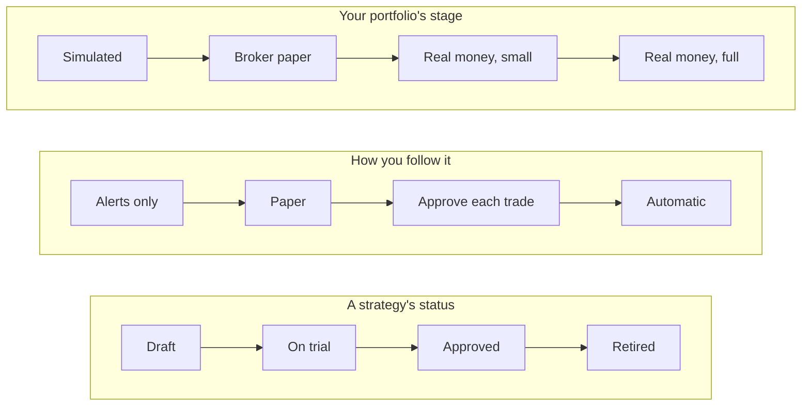

# Vocabulary

One set of words for the whole product. The console, notifications, Telegram, the assistant, the CLI help and the docs use these words and no others. Code identifiers keep their names. Only the words people read change.

## The one rule

**"Live" and "real money" only ever mean real money at a broker.** Nothing that trades on paper is called live, is stamped in brass, or uses a red button.

## Three ladders, three sets of words

Stonks has three separate ladders. Each has its own words, and no word is shared between them.

| Ladder | API value | Words people see | Meaning |
|---|---|---|---|
| Strategy status | (studio draft) | Draft | Being built. Not tested by the system yet. |
| | `shadow` | On trial | The system paper-tests it on its own test book every run. |
| | `active` | Approved | It passed the go-live check. People can follow it. |
| | `retired` | Retired | It no longer decides. |
| Follow mode | `notify` | Alerts only | You get its signals. Nothing trades. |
| | `paper` | Paper | It trades your paper portfolio. No real money. |
| | `approve` | Approve each trade | Each trade waits for your approval as a ticket. |
| | `auto` | Automatic | Trades go out without asking. |
| Portfolio stage | `sim_paper` | Simulated | Simulated fills only. |
| | `broker_paper` | Broker paper | The broker's paper account. No real money. |
| | `live_small` | Real money, small | Real money with the allocation you set and tight caps. |
| | `live_scale` | Real money, full | Real money at your full allocation. |

Whether a trade uses real money depends only on the **portfolio stage**. The follow mode says who decides (you, or the strategy). The strategy status says whether the strategy is allowed to be followed at all.

## Renamed words

| Old words | New words |
|---|---|
| Live (a strategy status), "It trades live now", "4 live" | Approved, "Approved: people can follow it", "4 approved" |
| Go live (promote a strategy) | Approve |
| Back to paper trading (demote) | Back on trial |
| Stop (retire a strategy) | Retire |
| Go live (the admin review page) | Strategy review |
| Paper trading (the page of model books) | Trial results |
| Model book, shadow book, shadow | Test book |
| Tick, run (a daily trading run) | Trading run |
| Subscription, follow | Follow (the noun and the verb) |
| Sleeve | The strategy's part of your portfolio |
| Overview (the admin page) | Dashboard, in both the menu and the page title |

## Status words

One word per state, on every page.

| State | Word |
|---|---|
| A run or job that finished well | Done |
| A run that finished with some errors | Partly done |
| A run or job that failed | Failed |
| A check that passed | Passed |
| A check that failed | Failed |
| A check with too little data | Not enough data yet |

## Stop buttons

- **Kill switch:** "Stop trading". One pattern everywhere: a sheet that defaults to the portfolio on screen, shows a ticket and needs a reason.
- **Retire a strategy:** "Retire", as a quiet button, never red, never next to the kill switch.

## Where to add a word

Add a new term here first, then in the console glossary (`web/src/app/core/help/`), then in the page. A term that is not here does not ship.
