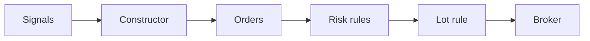

# Whole shares and broker fees

Roadmap 23.1 and 23.2. A backtest that buys 2.7 shares and pays 0.5 bps a trade
tests a book nobody can hold. This page covers the two settings that close that gap.

## Whole shares (23.1)



The lot rule is the last step of `build_orders`, the one order pipeline the backtest,
the paper books, the model books and the live books share. So all of them size the
same shares (P21). When a strategy decides alone in a backtest, the engine applies the
same rule right after it decides.

Per order, for an asset class traded in whole lots:

- a close of the whole position keeps its exact quantity
- anything else rounds down to whole lots, so an order never spends more than decided
- an order below one lot is skipped

Lot profiles (`stonks.portfolio.lots.LOT_PROFILES`):

| Profile | Whole lots for | Used by |
| --- | --- | --- |
| `fractional` | nothing | the default for backtests and paper books |
| `whole_shares` | equities, bonds, commodities | live books at IBKR (crypto stays fractional) |
| `whole` | every asset class | on request |

Which profile a book uses:

- Backtests, the lab, paper books and model books read `[backtest.lots] profile`. One
  setting for all of them keeps a paper book in step with its backtest.
- A live book uses its broker's profile. IBKR only takes whole shares, so it is
  `whole_shares`. Alpaca takes fractions. An unknown broker gets `whole_shares`.

### Why the default stays fractional

P21 asks the backtest, paper books and model books to fill alike. They all read the same
setting, so they stay alike with either profile. Turning whole shares on for everyone
would change every stored backtest result. So the default is `fractional`, and a live
IBKR book is sized to whole shares because the broker demands it. To test a strategy the
way an IBKR account will trade it, set:

```toml
[backtest.lots]
profile = "whole_shares"
```

### What gets reported

Every backtest report carries `lots`: orders rounded and skipped, the notional skipped,
and the weight lost to rounding per decision (mean and largest).

It also carries the **minimum capital**. An order for `q` shares decided on a book worth
`E` needs `E / q` to buy one share, whatever the price. The minimum capital is the 95th
percentile of that figure over the opening orders. It is measured against whole shares
even when the orders stay fractional, so every backtest shows it.

The figures show in the API backtest result (`lots`), in the `oos` survival report
(`min_capital`, `lot_skipped_share` and friends) and in the go-live checklist
(Minimum capital, Skipped by whole shares). They never change a verdict.

## IBKR fees (23.2)

An asset class in `[backtest.costs.asset_classes.*]` can name a commission schedule and
pay the US regulatory fees. Both are off by default, so existing costs do not move.

| Schedule | Charge |
| --- | --- |
| `ibkr_fixed` | 0.005 USD a share, at least 1.00, at most 1% of the trade value |
| `ibkr_tiered` | 0.0035 USD a share falling with monthly volume, at least 0.35, at most 1%, plus exchange and clearing fees a share |

When 1% of the trade is below the minimum, the 1% cap wins, as IBKR's page says.

US regulatory fees (`us_sell_fees = true`):

- SEC fee on the value of a sale (27.80 USD per million)
- FINRA TAF per share sold (0.000166 USD, at most 8.30 a trade)
- CAT fee per share on both sides (0.000035 USD)

Every rate lives in `[backtest.costs.commissions]` with its source next to it in
`config/default.toml`. Check them before trusting a figure: SEC and FINRA change rates
each year.

The fee adds to the cost model's fee, so the lab, the paper books (their simulated
broker) and TCA's expected cost all see it. Ready-made presets: `--cost-model ibkr_tiered`
and `--cost-model ibkr_fixed` (also in the API and MCP). They keep the realistic spread
and impact and swap the flat equity `fee_bps` for the IBKR commission.

```toml
[backtest.costs.asset_classes.equity]
half_spread_bps = 2.0
fee_bps = 0.0
commission = "ibkr_tiered"
us_sell_fees = true
```

A backtest with a commission counts as a costed run for the go-live `nonzero_costs`
check and the lab's zero-cost warning.
