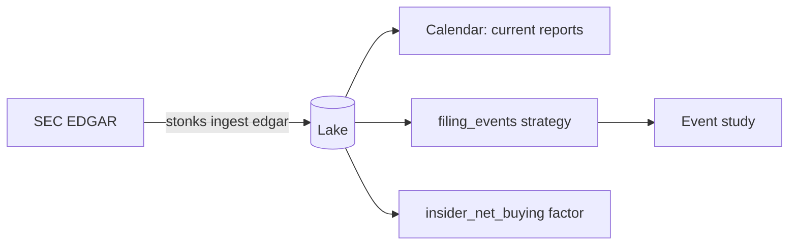

# EDGAR filings

SEC EDGAR is the primary source for US company filings. It is free and needs no key. Stonks reads three things from it, all point in time:

| What | Lake table | Used by |
|------|------------|---------|
| Filings: form, acceptance time, 8-K item codes | `corporate_filings` | the calendar, the `filing_events` strategy and the event study |
| Form 4 insider trades | `insider_transactions` (with `known_at`) | the `insider_net_buying` factor |
| 13F holdings of institutional managers | `institutional_holdings` | your own research |



## Set it up

The SEC asks every client to name itself with a contact address. Set a User-Agent with your name and email. It is not a secret.

```toml
[sources.edgar]
user_agent = "Jane Trader jane@example.com"
```

Or set `STONKS_EDGAR_USER_AGENT`. Without it, `stonks ingest edgar` refuses to start.

## Pull filings

```bash
uv run stonks ingest edgar --tickers AAPL.US,MSFT.US --since 2024-01-01
uv run stonks ingest edgar --kinds holdings --filers 1067983 --since 2025-01-01
```

- `--kinds` takes `filings`, `insiders` and `holdings` (default `filings,insiders`).
- Filings keep the forms in `[sources.edgar] forms` (8-K, 10-Q and 10-K by default).
- Holdings name managers by CIK. A holding gets a ticker when the lake knows its CUSIP.
- Each ticker or filer is one unit of the `ingest_runs` row. One bad document is skipped with a warning. The rest of the ticker still lands.

## Fair access

- Every request carries your User-Agent.
- Requests are spaced by `min_request_interval_seconds` (0.125, so 8 a second). The SEC allows 10.
- A 429 or a server error backs off and retries.

## Point in time

The acceptance time is when the SEC accepted a filing, the earliest moment anyone outside the company could read it. Stonks keeps it as `known_at` in UTC (P12).

- A filing is hidden from any decision made before its acceptance.
- An insider trade counts from the acceptance of its Form 4, not the trade date. The trade date is often two days earlier.
- An insider row from another vendor without an acceptance time counts from the day after its filing date.
- An Apple earnings 8-K accepted at 20:30 UTC is the 16:30 New York release, after the close. It is traded at the next open.

## Limits

- EDGAR covers US listings only.
- Only non-derivative Form 4 lines are kept. Option grants and exercises are not open-market trades.
- 13F values are in dollars. Reports filed before 2023-01-03 gave thousands and are converted.
