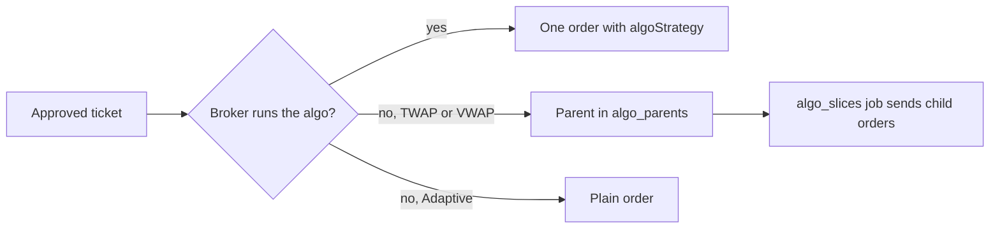

# Execution algos and the rebalancing planner

Roadmap 23.16. Two tools for working orders with care: an execution algo decides how one order is worked, and the planner shows the trades that reach target weights before anything is sent.

## Execution algos

By default every order goes out as a plain limit order (a market order leaves as a limit with a collar). That stays the default. A portfolio, or one strategy in it, can choose an algo instead.

| Algo | What it does | At IBKR | At other brokers |
|------|--------------|---------|------------------|
| `adaptive` | Works the order between the bid and the ask. `priority` is `patient`, `normal` or `urgent`. | IBKR runs it | Sent as a plain order |
| `twap` | Equal parts over a window of the session. | IBKR runs it | Stonks sends `slices` equal child orders |
| `vwap` | Trades with the day's volume, more near the open and the close. `max_participation` caps IBKR's share of volume. | IBKR runs it | Stonks sends `slices` child orders on a volume curve |

The window is `start_minutes` to `end_minutes` after the open (empty runs to the close).



### How it fits the order path

- The algo rides on each ticket (`Order.algo`), so the person approving it sees how it will be worked.
- The `live_submit` job resolves the window for the next session. At IBKR the order goes out with `algoStrategy` and `algoParams`, as a day order. Its fills arrive under the parent's reference, so the ledger sees one order.
- At another broker a TWAP or VWAP ticket becomes a parent that never reaches the broker. The `algo_slices` job (every 5 minutes) sends each child when it is due. Each child is a normal order (`<parent>.sNN`, `orders.parent_client_id`), so the order state machine, reconciliation and the submit gate cover it.
- A halt of new orders holds every slice. A halt of buys holds the slices that open or grow a position. Slices not sent by the window end are skipped.
- The parent's state follows its children: `accepted`, `partially_filled`, then `filled`, `expired` (window over), `rejected` (every child refused) or `cancelled`.
- Stops, option orders and one-cancels-other orders always stay plain.

### Costs

Each algo names what it is assumed to cost next to a plain order: a factor on the half spread, a factor on market impact, and a timing cost in bps.

| Algo | Spread | Impact | Timing |
|------|--------|--------|--------|
| adaptive patient | 0.5 | 1.0 | 1 bps |
| adaptive normal | 0.75 | 1.0 | 0.5 bps |
| adaptive urgent | 0.9 | 1.0 | 0 |
| twap | 1.0 | 0.6 | 2 bps |
| vwap | 1.0 | 0.5 | 2 bps |

Backtest with the same assumption under `[backtest.costs.exec_algo]`:

```toml
[backtest.costs.exec_algo]
name = "vwap"
params = { end_minutes = 120 }
```

These are starting points. TCA groups orders by algo (`stonks tca summary --by algo`, `plain` for no algo), so the assumption can be checked against real fills.

### Setting it

- Console: Orders, Rebalance, "How orders are worked".
- CLI: `stonks algos list | show | set | clear | parents --portfolio ID`.
- MCP: `list_execution_algos`, `get_execution_algo_settings`, `set_execution_algo` (needs `confirm=true`), `list_algo_parents`.
- API: `GET /api/execution/algos`, `GET|PUT|DELETE /api/portfolios/{id}/execution-algos`, `GET /api/portfolios/{id}/algo-parents`.

Changing the setting needs `portfolio.manage` and is audited.

## The rebalancing planner

The planner shows the trades that move a portfolio to target weights. The targets are either a strategy's latest model book weights or your own list. Nothing is written or sent.

For each ticker it shows:

- the weight now, the target and the weight after.
- the trade in whole shares (never a fraction), or why there is none: no price, less than one share, below the smallest trade, or not enough cash.
- the estimated cost from the cost model, with the portfolio's algo assumption.
- for a sell, the lots it closes (oldest first), the gain, short or long term, and the tax when you give the rates.

The totals are the value, the turnover (traded value over the book's value), the costs, the cash after and the estimated tax. Weights are long only and add to at most 1. The rest stays cash. Sells come first. Buys are cut by whole shares until they fit the cash.

The tax figure is a preview. The broker's lots and the tax report decide.

### Confirming

Confirming writes one order ticket per trade. Every ticket waits for approval (`hold = approve_mode`), which needs a fresh second factor in the web app or the typed phrase in the CLI. Approved tickets go out in the next submit window, worked with the portfolio's algo. Confirming the same plan twice writes its tickets once.

Planned tickets carry no strategy: the trades are the portfolio's own, with the plan's key and your reason in the ticket.

- Console: Orders, Rebalance.
- CLI: `stonks plan preview | confirm --portfolio ID (--strategy ID | --targets AAPL.US=0.3,MSFT.US=0.2)`.
- MCP: `plan_rebalance`, `confirm_rebalance` (needs `confirm=true`).
- API: `POST /api/planner/plan`, `POST /api/planner/confirm`.

## Storage

SQLite migration 059: `execution_algo_settings`, `orders.exec_algo`, `orders.parent_client_id`, `algo_parents` and `algo_slices`.
