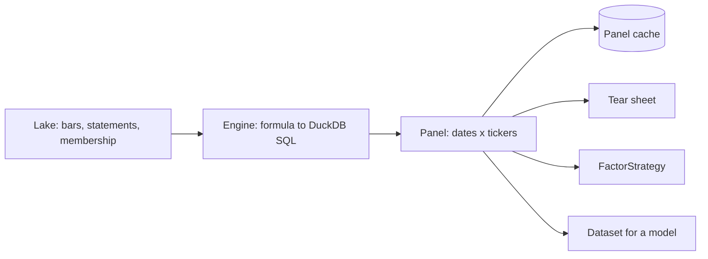
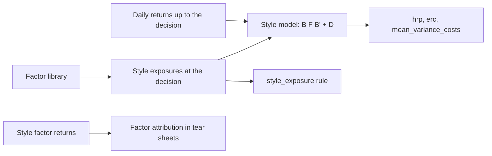

# Factors

A factor is a number per ticker per date that should rank future returns. Stonks computes factors once over a whole universe, keeps the panels in a cache, and tests them with a tear sheet before any strategy trades them.



## The library

Every factor lives in a module of `stonks/factors/library/`. Each module is a set:

| Set | What is in it |
|-----|---------------|
| `alpha158` | 157 price and volume features ported from Qlib's Alpha158: candle shapes, price ratios and 29 rolling features at 5, 10, 20, 30 and 60 bars. |
| `classic` | Momentum (12-1, 6-1), one-month reversal, low volatility, distance from the 52-week high and size (log dollar volume), each with a hypothesis. |
| `fundamentals` | The value, quality and forensic scores (EBIT/TEV, book to market, Piotroski F, Altman Z, accruals, Beneish M and more), equities only. |

A new factor or set is one new module with a `factors()` function. Nothing else is edited.

Each factor has a `direction`: `+1` when higher values should earn more, `-1` when lower should (`low_vol_60`, `accruals`).

```bash
uv run stonks factors list [--set alpha158] [--family momentum] [--kind fundamental]
uv run stonks factors show mom_12_1
```

## The expression language

A formula uses the fields `$open`, `$high`, `$low`, `$close` and `$volume` and functions such as `Ref`, `Mean`, `Std`, `Sum`, `Max`, `Min`, `Rank`, `CSRank`, `Corr`, `Slope`, `Rsquare`, `Resi`, `Quantile`, `IdxMax`, `IdxMin`, `Delta`, `Log`, `Abs`, `Sign`, `Greater`, `Less` and `If`. It compiles to DuckDB window SQL.

```bash
uv run stonks factors check '$close / Ref($close, 20) - 1'
```

Two rules keep a formula honest:

- **No look-ahead.** A negative `Ref` offset reads the future and is refused. Only the evaluation label may do that.
- **No raw levels.** A formula that compares a price or volume level with something of another scale would change value after a later split. Use a ratio, such as `$close / Ref($close, 20)`.

Anywhere a factor id is accepted, a formula works too.

## Point in time

- A value on date `t` uses only data known at the close of `t` (P12). An intraday decision sees only closed daily bars.
- Bars are adjusted for splits and dividends as they were known on each date.
- With a stored universe, a ticker counts only while it was a member (from `start_date` up to the day before `end_date`). History before it joined still feeds rolling windows.
- Fundamentals count from the day after their filing.

## Panel cache

A panel is keyed by the factor, universe, window and interval plus a fingerprint of the rows it read. When bars, corporate actions, statements or membership change, the fingerprint changes and the old panel is dropped. A hit is always the panel today's data would give.

```toml
[factors]
cache = "parquet"                  # or "memory", or "off"
# cache_dir = "data/factor_panels" # default: factor_panels next to the lake
```

The folder is safe to delete at any time.

## Tear sheets

```bash
uv run stonks factors tearsheet mom_12_1 --universe-id sp500 \
  --start 2018-01-01 --end 2025-01-01 --horizons 1,5,21 --html mom.html
```

A tear sheet shows, for any factor:

| Part | What it answers |
|------|-----------------|
| IC per horizon | Does the factor rank returns 1, 5 or 21 bars ahead? Mean IC, ICIR, hit rate and a Newey-West t-stat. |
| IC by sector, asset class and size | Does it work everywhere, or only in one corner? Size is market cap when the lake has it, else dollar volume. |
| Returns per quantile | Mean forward return of each bucket, the top minus bottom spread, and cumulative returns. |
| Alpha and beta | The long-short book on the equal-weight universe. |
| Monthly IC heatmap | Is the edge steady, or a few good months? |
| Turnover | How fast the ranking and the top bucket change, a proxy for cost. |

Returns start at the next open and never read past the window end. Universes under 10 tickers come back `n/a`. Values are raw: a `-1` factor that works shows a negative IC. Sector and asset class are today's labels, not point in time.

## Values at a date

```bash
uv run stonks factors values low_vol_60 --universe-id sp500 --as-of 2025-01-02
```

Names come back best first in the factor's direction.

## FactorStrategy

The `factor` strategy holds the top slice of a universe by any factor or formula, equal weight, rebalanced on month ends.

```bash
uv run stonks lab run factor --start 2020-01-01 --end 2025-01-01 --universe-id sp500 \
  --params '{"factor": "mom_12_1", "top_pct": 0.2}'
```

A formula has no hypothesis of its own. Write one in the lab trial before you trust it (P1).

## Datasets for models

```bash
uv run stonks factors dataset alpha158 --universe-id sp500 \
  --start 2020-01-01 --end 2025-01-01 --out alpha158.parquet
```

One row per date and ticker, one column per factor, and a `label` column: the return from the next open over `--label-horizon` bars (`O[t+1+h] / O[t+1] - 1`), the way the backtest fills.

## Factor risk model

A factor model writes the covariance of many names as a few shared factors plus what is left per name. It is stable where a sample covariance is noise.



### Styles

| Style | Library factor |
|-------|----------------|
| momentum | `mom_12_1` |
| size | `size_dv_60` (log of 60-bar dollar volume) |
| value | `book_to_market` (equities only) |
| volatility | `low_vol_60` |
| sector | `instruments.sector`, one dummy per sector |

Each style is clipped at 3 robust standard deviations and z-scored across the names. A name with no value sits at the average. A style that fails (no statements for value) is left out and logged.

### Covariance estimators

Two estimators join `sample`, `ledoit_wolf`, `ewma` and `denoised`:

- `pca`: the top `n_factors` principal components plus specific variance.
- `style`: each day's returns regressed on the market and the styles, the covariance of those factor returns, plus specific variance. `residual_pcs` adds principal components of what the styles leave.

```toml
[production.construction]
method = "erc"

[production.construction.params]
estimator = "style"
estimator_params = { residual_pcs = 1 }   # or estimator = "pca" with { n_factors = 3 }
```

A portfolio's `construction_json` takes the same knobs flat: `{"method": "erc", "estimator": "style"}`.

The tick and the backtest read style exposures with `values_at` at the decision, through the point-in-time view in a backtest. Returns stop at the decision too (P12). Without exposures the `style` model reads momentum and volatility from the returns themselves.

### Style exposure rule

`style_exposure` keeps the book's net lean to each style inside a cap. The lean is the sum of weight times z-score. A lean of 0.5 is half a standard deviation towards that style.

```toml
[production.risk.rules.style_exposure]
max_abs_exposure = 0.5
styles = ["momentum", "size", "value", "volatility"]
```

It is off by default. Opening orders are scaled down until every style fits. When the holdings are already over the cap, new orders may still go if they leave no style further out. Sells and covers always pass. Portfolio and subscription overrides can only tighten it: a lower cap, or more styles.

### Factor attribution

Every backtest tear sheet (`stonks report --backtest`) ends with a factor attribution. The book's daily returns are regressed on the style factor returns of its universe. Each line shows how much of the return came from the market, each style and the sectors, and what is left is specific. Returns are summed, so the lines add up to the total. The factor returns are point in time: each day's move is explained by the exposures known the day before.

## API and MCP

| Route | MCP tool |
|-------|----------|
| `GET /api/factors`, `GET /api/factors/{id}` | `list_factors`, `get_factor` |
| `POST /api/factors/check` | `check_factor_expression` |
| `POST /api/factors/values` | `get_factor_values` |
| `POST /api/factors/tearsheets`, `GET /api/factors/tearsheets/{job_id}/result` | `run_factor_tearsheet` |

Reads need `data.read`. Tear sheets are jobs and need `lab.run`.
