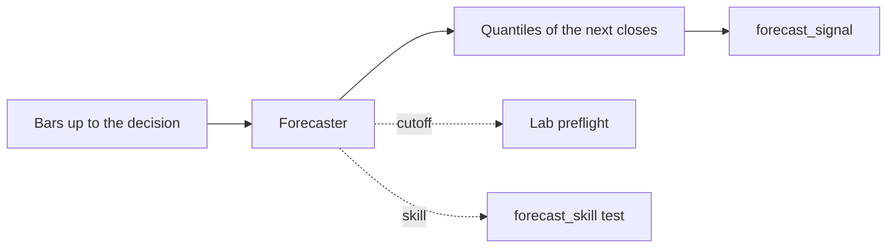

# Forecasting models

Stonks can run time series forecasting models, including pretrained
foundation models, behind one seam. A strategy asks a model for the next
closes of a ticker and trades on the answer. Two rules keep this honest:

1. **The cutoff rule.** A pretrained model may have seen every price up to
   the end of its training data. The lab refuses a run whose validation
   window starts on or before that date.
2. **The skill test.** The model must beat the random walk and simple
   statistical baselines on the validation window before its backtest
   counts.



## The models

| Name | What it is | Licence | Cutoff | Install |
|------|------------|---------|--------|---------|
| `random_walk` | The last close carried forward. The bar to beat. | none | none | built in |
| `drift` | The random walk plus the mean return per bar. | none | none | built in |
| `ets` | Simple exponential smoothing on log closes. | none | none | built in |
| `theta` | The Theta method: smoothing with half the trend. | none | none | built in |
| `chronos_bolt` | Chronos-Bolt small from Amazon, closes only. | Apache-2.0 | 2024-11-25 | `chronos` |
| `chronos_2` | Chronos-2 from Amazon, closes only. | Apache-2.0 | 2025-10-30 | `chronos` |
| `timesfm_2_5` | TimesFM 2.5 (200M) from Google, closes only. | Apache-2.0 | 2025-09-02 | `timesfm` |
| `kronos_small` | Kronos-small, reads open, high, low, close and volume. | MIT | 2025-06-30 | `kronos` |
| `kronos_mini` | Kronos-mini, the smallest Kronos, reads OHLCV. | MIT | 2025-07-01 | `kronos` |

No model card publishes the end date of its training data, so each cutoff
is the release date of the weights. Weights under a non-commercial licence
are not allowed: TimesFM 3.0 and Moirai are left out, and the registry
refuses any model whose licence forbids commercial use.

## Install a model

The models need torch, which is large, so they are optional groups. The
default install and CI never pull them.

```bash
uv sync --extra chronos        # chronos_bolt, chronos_2
uv sync --extra timesfm        # timesfm_2_5
uv sync --extra kronos         # kronos_small, kronos_mini (plus the clone below)
uv sync --extra forecasters    # all of them
```

Kronos is not on PyPI. Clone its code and point Stonks at the clone:

```bash
git clone https://github.com/shiyu-coder/Kronos /opt/kronos
export STONKS_KRONOS_REPO=/opt/kronos
```

Weights download from Hugging Face on first use and stay in its cache.
To fetch them ahead of time, for a server with no internet:

```bash
uv run huggingface-cli download amazon/chronos-bolt-small
uv run huggingface-cli download google/timesfm-2.5-200m-pytorch
uv run huggingface-cli download NeoQuasar/Kronos-small
uv run huggingface-cli download NeoQuasar/Kronos-Tokenizer-base
```

All models run on the CPU by default.

## Pick a model

- Start with `theta`. It is cheap, needs nothing extra, and has no cutoff,
  so any window works.
- Try `chronos_bolt` next. It is small and fast on a CPU.
- Use a Kronos model when the candle shape matters (range and volume),
  since it is the only one that reads more than closes.
- Each model is its own hypothesis. The `model` parameter is fixed per run
  and never tuned, so pick one before the run and write down why.
- Mind the cutoff. With `chronos_2` the validation window must start after
  2025-10-30, so you need data well past that date.

Run the example strategy:

```bash
uv run stonks lab run forecast_signal --start 2024-01-01 --end 2026-09-01 \
  --tickers AAPL.US,MSFT.US,SPY.US --preset promotion
```

Pass `"model": "chronos_bolt"` in the fixed params to use a pretrained model.

## The cutoff rule

A strategy names the models it runs with `forecast_models(params)`. Before
any work, the lab checks each one against the first day of the validation
window (with no embargo, the strictest check). A window that starts on or
before the cutoff stops the run with the preflight error
`forecast_cutoff`. The check runs even with `--no-preflight`. An unknown
model name fails the same way, because its cutoff is unknown.

This is the same rule as the AI research loop's `model_cutoff`.

## The skill test

`forecast_skill` runs for every strategy that has a `forecaster()`. The lab
adds it to the suite by itself. On the validation window, every few bars
and for every ticker, the model and the baselines forecast the close
`horizon` bars ahead from the bars known at that time. The test passes when:

- the model beats the random walk by a Diebold-Mariano test with HAC
  errors (one-sided, 5% level),
- it beats the better of `ets` and `theta` the same way,
- its MASE is below the random walk's,
- its CRPS, the score of its whole forecast band, is below the random
  walk's.

It also reports the rank IC across tickers and the share of correct
directions. Set `min_rank_ic` to require a floor. With too few forecast
dates the test fails. The test only reads the validation window, so the
research loop may run it.

## Add a model

Add one module to `features/forecasters/` with a `Forecaster` subclass.
Give it a `name`, a `licence`, and for pretrained weights `pretrained =
True` plus `pretrain_cutoff` or `release_date`. Import the model package
inside its methods, never at the top of the module. Add its packages as a
new optional group in `pyproject.toml`. Tests must pass
`local_files_only=True` and skip when the package or the weights are
missing, so no test downloads anything.
