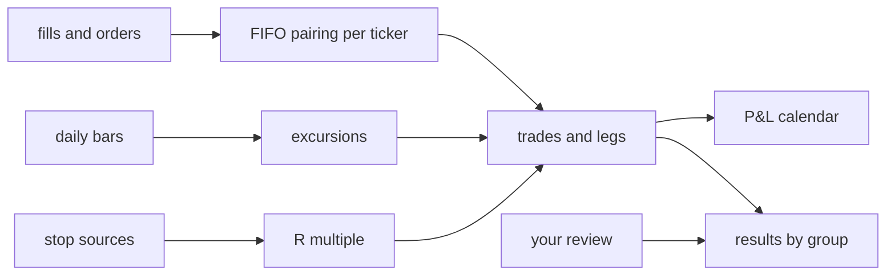

# The round-trip journal

The journal turns a book's fills into trades you can review. It works for
paper and live portfolios alike (roadmap 23.3).

## What a trade is

- A trade starts at the fill that opened it. Its id is that fill's id.
- Each closing fill is a leg. A partial exit is its own leg, and what you
  still hold is the last, open, leg.
- Lots pair first in, first out per ticker, long and short. Splits and
  dividends applied to the book count.
- A trade belongs to the strategy whose order opened it. Your own orders
  form the `manual` sleeve, so hand trades stay apart.
- Option contracts are left out.

## The figures

| Figure | Meaning |
|---|---|
| Holding time | Days from the entry fill to the exit fill, or to now |
| Worst move (MAE) | The furthest the price went against you while held, from the daily bars |
| Best move (MFE) | The furthest it went for you |
| R multiple | P&L over the money at risk at your first stop |
| Exit efficiency | Where the exit sits in the range the trade saw: 0 the worst price, 1 the best |
| Exit | Stop, strategy signal, no new pick, risk rule, or by hand |

With daily bars the entry day's whole range counts.

## Where the stop comes from

Stop sources live in `journal/stops/`. Each is one module, found at start.
The first that finds a stop wins.

1. `order_plan`: a stop written on the opening order (`stop_price` in its
   decision context), such as the manual ticket's trade plan.
2. `protective_stop`: the first protective stop Stonks placed for the entry.

A stop on the wrong side of the entry is ignored. With no stop the trade has
no R.

## Your review

On each trade you can set tags, mistakes, a playbook, whether you followed
the plan, and a short note. A playbook is a setup you trade, with its rules.
Playbooks are yours alone. Results then split by any of these.

## The P&L calendar

Each closed leg books its realised P&L on its exit day. Days sum into ISO
weeks (Monday to Sunday) and months. Money is in the portfolio's base
currency. A leg whose currency has no exchange rate is left out and counted.

## Where to find it

- Console: Orders, then the Journal tab (`/journal`).
- CLI: `stonks journal trades | show | review | calendar | breakdown | playbooks`.
- API: `/api/journal/*`. Reviews and playbooks need `portfolio.manage`.
- MCP: `list_round_trips`, `get_round_trip`, `get_pnl_calendar`,
  `get_journal_breakdown`, `list_playbooks`.
