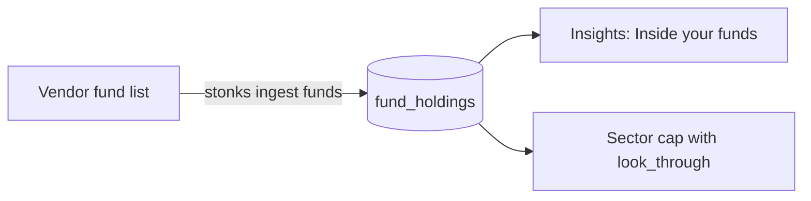

# Look inside your funds

A fund such as SPY or QQQ holds hundreds of companies. Stonks can count a
fund as the companies it owns, so you see your real weight in a name, a
sector or a country. Your real Apple weight counts AAPL plus its share of
SPY and QQQ.



## Get the lists

```bash
uv run stonks ingest funds --tickers SPY.US,QQQ.US
```

- The EODHD source reads the `ETF_Data` block of its fundamentals endpoint.
  Other sources can add `fetch_fund_holdings` behind the `DataSource` seam.
- Each fund is one unit of the ingest run. A fund the source has no list
  for counts as failed, and the run goes on.
- Weights are stored as fractions (0.07 is 7%). Countries are ISO codes
  (`US`, `NL`).

## Point in time

The `fund_holdings` table keeps every list with two dates:

- `as_of`, the day the vendor says the list describes, never later than
  the day Stonks fetched it.
- `known_at`, when Stonks first stored the row. A re-run never moves it.

A read on a day takes, per fund, the newest list Stonks already had by the
end of that day (principle P12). So a list fetched today never changes what
a past day saw.

## In insights

The Insights page has an "Inside your funds" panel. It shows single names,
sectors or countries, each with the part held directly and the part held
through funds. It reads `GET /api/insights/look-through`, and the MCP tool
is `get_look_through`.

- A fund with no list stays whole, so the numbers match the plain
  allocation.
- Fund lists often leave out small holdings. That rest shows as "Not in the
  fund lists".
- A holding's sector and country come from `instruments` when Stonks knows
  the company, so direct and fund holdings use the same labels.

## In the sector cap

The sector cap rule can count fund holdings too. It is off by default:

```toml
[production.risk.rules.sector_cap]
max_weight_per_sector = 0.3
look_through = true
```

- A stock buy then sees the tech already held inside SPY.
- A fund buy is capped by each sector it adds to.
- The plain cap still applies, so turning it on only ever tightens. A
  portfolio or strategy override can turn it on, never off.
