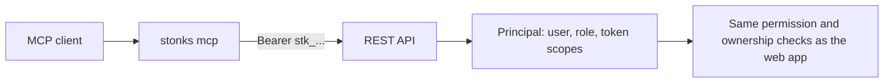

# MCP server (`stonks mcp`)

`stonks mcp` runs a [Model Context Protocol](https://modelcontextprotocol.io)
server over stdio. Claude Code, Claude Desktop or any other MCP client can use
it to:

- read the portfolio, P&L, risk policy, shadow results and operational health
- inspect strategies and market data
- launch backtests, lab runs and ingests
- build and test Strategy Studio drafts
- with explicit confirmation, change strategy status or queue a production tick

## How it works

DuckDB allows one writing process, and `stonks serve` holds the lake open. So
the MCP server never opens the lake or the state database: it is a thin client
of the running REST API. Start the API first:

```bash
uv run stonks serve              # http://127.0.0.1:8000
export STONKS_MCP_TOKEN=stk_...  # your personal token, made in the web app
```

If the API is not reachable, every tool returns an error that says so and
tells you to run `stonks serve`.

## Who the tools act as

The server acts as one person: the owner of its token.



- Make the token in the web app (Settings, API tokens). Pick its scopes:
  `read` for a read-only assistant, add `lab` for research jobs, `trade`
  for subscriptions and the kill switch. A token never exceeds its user's
  role.
- `whoami` shows the user, role and scopes.
- Every tool does only what that user may do in the web app. A refused
  call says that the token's role or scopes do not allow it.
- Portfolio tools take an optional `portfolio_id`. It must be one of your
  portfolios, otherwise the answer is "not found". Without it you get your
  own book. Admins get totals (`get_portfolio_totals`,
  `get_insights_totals`), never another trader's holdings.
- Actions that need a fresh second factor are refused: switching a
  subscription to auto, connecting or deleting a broker, resuming the kill
  switch, user admin. The message points to the web app. A token can never
  pass a second factor.
- `STONKS_MCP_TOKEN` wins over `STONKS_API_TOKEN`, so the server's shared
  token in the same `.env` is not picked up by accident. With the shared
  token the server acts as the bootstrap admin and logs a warning.

A test (`tests/integration/app/multiuser/test_mcp_permissions.py`) calls
every tool as a viewer, a trader, a read-only trader token and an admin
with and without the `admin` scope. Each request must be refused exactly
when the REST route's permission is. A second test hands Alice's server
Bob's ids and checks none of Bob's rows come back.

## Configuration

| Setting | Where | Default | Purpose |
|---------|-------|---------|---------|
| `[mcp].api_url` | `config/default.toml` | `http://127.0.0.1:8000` | Base URL of the REST API |
| `[mcp].timeout_seconds` | `config/default.toml` | `30` | Per-request HTTP timeout |
| `[mcp].max_wait_seconds` | `config/default.toml` | `600` | Upper bound for `wait_for_job` |
| `STONKS_MCP_TOKEN` | env / `.env` | unset | Your personal API token (`stk_...`), sent as the bearer |
| `STONKS_API_TOKEN` | env / `.env` | unset | Fallback: the old shared token, acts as the bootstrap admin |

The token is env-only. Without one, job and write tools fail with a message
asking for it, and reads work only on a dev machine (`STONKS_PROFILE=dev`). The token is never sent over plain `http` to a non-loopback host:
`stonks mcp` exits with an error instead (use `https`). `[mcp]` is read from
`config/default.toml` in the working directory, so start the server from the
repo root (the `--directory` / `cwd` settings below do that).

## Register with Claude Code

From the repo root:

```bash
claude mcp add stonks --env STONKS_MCP_TOKEN=stk_your-token -- uv run --directory "$(pwd)" stonks mcp
```

Or put the token in the repo's `.env` (`stonks mcp` loads it) and drop
`--env`. Check it with `claude mcp list`, or `/mcp` inside a session.

## Register with Claude Desktop

Add to `claude_desktop_config.json` (Settings, Developer, Edit Config):

```json
{
  "mcpServers": {
    "stonks": {
      "command": "uv",
      "args": ["run", "--directory", "C:\\path\\to\\Stonks", "stonks", "mcp"],
      "env": { "STONKS_MCP_TOKEN": "stk_your-token" }
    }
  }
}
```

Restart Claude Desktop after editing. `stonks serve` must be running.

## Tools

Every tool carries MCP annotations (`readOnlyHint`, `destructiveHint`,
`idempotentHint`, `openWorldHint`).

**Read** (`readOnly`, not destructive, idempotent):

| Tool | Route |
|------|-------|
| `health` | `GET /api/health` |
| `get_health_report` (freshness, stuck ticks/ingests, ingest failures) | `GET /api/health/report` |
| `whoami` (the token's user, role and scopes) | `GET /api/auth/me` |
| `get_portfolio`, `list_portfolio_snapshots` | `GET /api/portfolio[/snapshots]` |
| `get_insights` (allocation, exposure and beta, P&L over periods, risk) | `GET /api/insights` |
| `get_strategy_agreement` (per holding, which active strategies agree, and why) | `GET /api/insights/agreement` |
| `get_portfolio_totals`, `get_insights_totals` (admins, no holdings) | `GET /api/portfolio/totals`, `GET /api/insights/totals` |
| `get_pnl` | `GET /api/pnl` |
| `get_risk_policy` | `GET /api/risk/policy` |
| `get_broker` (kind, paper, allow_live, credentials configured; never keys) | `GET /api/brokers` |
| `list_strategies`, `get_strategy` (with survival reports) | `GET /api/strategies[/{id}]` |
| `list_shadow_decisions`, `list_shadow_pnl` | `GET /api/shadow/decisions`, `GET /api/shadow/pnl` |
| `get_shadow_pnl` | `GET /api/shadow/strategies/{id}/pnl` |
| `search_instruments`, `get_bars`, `get_coverage` | `GET /api/market/...` |
| `list_orders`, `list_fills` | `GET /api/orders[/fills]` |
| `list_ticks`, `get_tick` | `GET /api/ticks[/{id}]` |
| `list_ingest_runs` | `GET /api/ingest/runs` |
| `list_sources` | `GET /api/sources` |
| `get_catalog` (strategy classes + parameter specs, intervals, asset classes) | `GET /api/catalog/...` |
| `list_cost_models` | `GET /api/lab/cost-models` |
| `list_jobs`, `get_job` | `GET /api/jobs[/{id}]` |
| `wait_for_job` (polls, then fetches the typed result) | `GET /api/jobs/{id}` + result route |
| `list_studio_templates`, `get_rule_schema` | `GET /api/studio/templates`, `GET /api/studio/schema` |
| `list_drafts`, `get_draft` | `GET /api/studio/drafts[/{id}]` |
| `validate_rule_spec` (saves nothing) | `POST /api/studio/spec/validate` |
| `list_connections` (your broker connections; never credentials) | `GET /api/connections` |
| `get_connection_accounts` (external accounts and linked portfolios) | `GET /api/connections/{id}/accounts` |

List-shaped responses come back as `{"items": [...]}`.

`wait_for_job` returns `{"timed_out", "job", "result"}`. Once the job
succeeded, `result` is the typed result from `/api/lab/backtests/{id}/result`,
`/api/lab/runs/{id}/result`, `/api/lab/signal-ic/{id}/result`,
`/api/ingest/jobs/{id}/result` or `/api/ticks/jobs/{id}/result` (by job kind). Studio jobs have no typed route,
so their `result` is the job's own. Otherwise `result` is `null`.

**Jobs and draft writes** (not destructive, not idempotent; research data only,
never orders):

| Tool | Route |
|------|-------|
| `run_backtest` (`cost_model`: `zero` / `realistic` preset, or flat `slippage_bps` / `fee_per_trade`) | `POST /api/lab/backtests` |
| `run_lab` (`walk_forward` and `mcpt` option blocks, with `walk_forward` / `permutation` in `survival_tests`) | `POST /api/lab/runs` |
| `run_signal_ic` (IC, ICIR, decay, quantile spread, turnover of `estimate_return`; 10+ tickers) | `POST /api/lab/signal-ic` |
| `run_ingest` (also `openWorld`: calls market-data vendors) | `POST /api/ingest/runs` |
| `create_draft` | `POST /api/studio/drafts` |
| `validate_draft` (smoke run; a code draft's Python runs in the API) | `POST /api/studio/drafts/{id}/validate` |
| `backtest_draft`, `lab_run_draft` | `POST /api/studio/drafts/{id}/backtests`, `/lab-runs` |

`run_lab` and `lab_run_draft` with `register_strategy: true` register the
result in shadow (whatever the verdict), so like `register_draft` they need
`confirm: true`; without it they return a preview and queue nothing.

**Draft edit** (destructive, idempotent; no confirm, since a draft is never
traded): `update_draft` (`PATCH /api/studio/drafts/{id}`, only the fields
given).

**Guarded writes** (destructive, need `confirm: true`):

| Tool | Route |
|------|-------|
| `promote_strategy`, `shadow_strategy`, `retire_strategy` | `POST /api/strategies/{id}/{promote,shadow,retire}` |
| `register_draft` (lands in shadow; not idempotent) | `POST /api/studio/drafts/{id}/register` |
| `enable_draft`, `disable_draft` (active / back to shadow) | `POST /api/studio/drafts/{id}/{enable,disable}` |
| `run_tick` (not idempotent) | `POST /api/ticks` |
| `sync_connection` (idempotent, `openWorld`: reads from the broker, read-only there) | `POST /api/connections/{id}/sync` |

Connecting, linking and removing a broker are console-only: they carry
credentials and need a fresh second factor.

Code drafts (`kind: "code"`) run Python inside the API server. The API answers
403 unless `[api] allow_code_strategies = true`; the Studio tools pass that
refusal on, saying that an operator has to change the setting and that MCP
cannot.

Resource: `stonks://portfolio/summary` (cash, total value, positions).

## Safety model

- Every guarded tool called without `confirm: true` returns a preview (current
  and new status, survival results and warnings, the draft being registered,
  or the tick request, active strategies and broker mode) and sends nothing
  mutating. Clients should show the preview to the user before confirming.
- `run_tick` defaults to `dry_run: true`. A real tick (`dry_run: false`) is
  allowed only when `GET /api/brokers` reports `kind: "simulated"`, or
  `kind: "alpaca"` with `paper: true`. A non-paper Alpaca broker is refused
  whatever `allow_live` says. So is any other or unreadable answer, including
  the route failing. Live ticks belong in the CLI or UI.
- Every id put into a URL path (strategy, tick, job, draft, connection) is
  validated (letters, digits and `_ . : @ + -` only), so a crafted id cannot
  redirect a request to another route.
- No tool changes broker settings or configuration, or enables live trading.
- The token is only sent as a bearer header. Tool output and errors are
  redacted, and logs go to stderr (stdout carries the MCP protocol).
- The API enforces auth itself: every route checks the token's principal,
  whatever the client. MCP adds no permission of its own and removes none.

## Adding a tool

Tools live in `src/stonks/mcp/tools/`, one module per area: `reads.py`,
`jobs.py`, `guarded.py`, `studio.py`, `insights.py` and others. Shared annotations, parameter types and
helpers are in `common.py`.

- A parameterless `GET` is one `RouteRead(name, path, description)` row in the
  module's `ROUTE_READS` table.
- Anything else is one small async function in the module's `register(t)`.
  Pick the annotation constant (`READ`, `JOB`, `JOB_OPEN_WORLD`, `EDIT`,
  `STATUS_CHANGE`, `GUARDED_CREATE`, `TICK`), write a docstring (it becomes the
  tool description) and typed parameters (they become the input schema), and
  return `await t.get(...)`, `t.post(...)` or `t.patch(...)`.
- Wrap every id that goes into a path in `seg(...)`.
- A write that changes what production trades needs a `confirm` parameter and
  a preview built in `guards.py`.
- A new module goes into `MODULES` in `tools/__init__.py`.

Add a test in `tests/integration/app/test_mcp_server.py` (or
`test_mcp_studio.py`) and put the tool in the catalogue sets there. Add a
row to `CASES` in `tests/integration/app/multiuser/test_mcp_permissions.py`
with the route the tool reaches and arguments that reach it.
