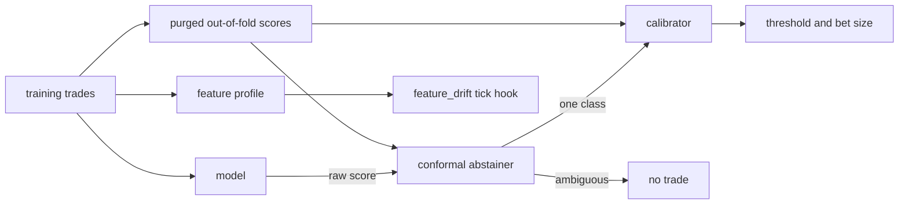

# ML toolkit

Tools for strategies that learn from data. Roadmap 23.10. Each one keeps the research rules in `docs/principles.md`: it is fitted on training data only, it never reads the future at decision time, and every choice you tune counts as a trial.



## Calibrated probabilities

A forest's `P(win)` is a vote share, not a probability. Bet sizing reads it as one, so an overconfident model bets too big.

`features/calibration.py` fixes that. It fits on purged out-of-fold scores of the training window (`purged_oof_proba`), never on rows the model trained on.

| Calibrator | What it does |
|---|---|
| `none` | Keeps the raw score. |
| `isotonic` | A monotone step function. Flexible, needs more data. |
| `platt` | A logistic curve on the score's log odds. Smooth, fine with little data. |

Calibrators are a registry. A new one is one class with `@_register`. Fitted calibrators save as JSON, never pickle.

## Conformal abstention

`ConformalAbstainer` turns a score into a prediction set that holds the true outcome `1 - alpha` of the time. When the set holds both outcomes, the model cannot tell. The strategy does not trade.

With too few training rows the set always holds both outcomes, so the model never trades. That is the safe default.

`ProbabilityPolicy` is the seam a strategy holds. It abstains on the raw score, calibrates, and sizes with `bet_size`, zero where it abstains.

`trendline_meta_label` uses it through two params:

- `calibration`: `none`, `isotonic` or `platt`. Tunable, so each value tried is a trial.
- `conformal_alpha`: the miss rate. `0` turns abstention off.

Both need `cv_folds >= 2`.

## Feature importance

`stonks lab importance` scores a model strategy's features on purged folds of the training window.

| Method | Question it answers |
|---|---|
| MDA | How much worse is the model when this feature is shuffled? |
| SFI | How good is a model on this feature alone? |
| Clustered MDA | How much worse when a whole group of correlated features is shuffled? |

Plain MDA splits the credit between twins: shuffle one and the other still carries the signal, so both look useless. Clustered MDA shuffles the group at once. Clusters come from k-means on the correlation distance.

```bash
uv run stonks lab importance --strategy trendline_meta_label --tickers BTC-USD.CC \
  --start 2021-01-01 --end 2025-01-01 --train-end 2024-01-01 --html imp.html
```

A strategy opts in with `training_set(dataset)` and `new_classifier()`. Dropping features after reading the report is a new hypothesis, so it is a new lab run.

## Labels and events

In `features/labels.py`:

- `frac_diff_ffd`: fractional differencing with a fixed-width window. It keeps memory that a plain return throws away. Causal.
- `min_ffd_d`: the smallest `d` that passes a stationarity test (ADF by default, behind `StationarityTest`). Pick `d` on the training window only. The result lists every `d` tried, because each is a trial.
- `cusum_events`: the symmetric CUSUM filter. An event fires when the drift since the last event passes a threshold. Causal.
- `trend_scanning`: labels each event by the sign of the strongest linear trend over the next few bars. It reads the future by design, like the triple barrier, so purge around test blocks with its `t1`.

Every causal tool has a future-shock test: changing bars after `t` changes nothing at or before `t`.

## Feature schema check

A model trained on `(a, b, c)` reads a row as three numbers in that order. If the code that builds the row changes, the model reads the wrong numbers without a sound. `check_feature_schema` refuses to load such a model: names and order must match exactly.

## Live feature drift

The fit stores a feature profile with the model (`feature_profile.json` in its artifact folder, so each model version keeps its own).

Each real tick, the `feature_drift` hook:

1. stores the rows each model strategy scores today in `model_feature_values` (SQLite migration 054),
2. once the last `window_days` days hold `min_rows` rows, scores them against the profile with PSI per feature,
3. warns when any feature's PSI passes `warn_psi`.

It only warns. Findings go to the log and the tick summary under `feature_drift`. A new model version has a new profile, so its window starts fresh.

```toml
[production.feature_drift]
enabled = true
window_days = 60
min_rows = 50      # PSI of a small sample is biased up, keep this well above the bin count
warn_psi = 0.25
```
