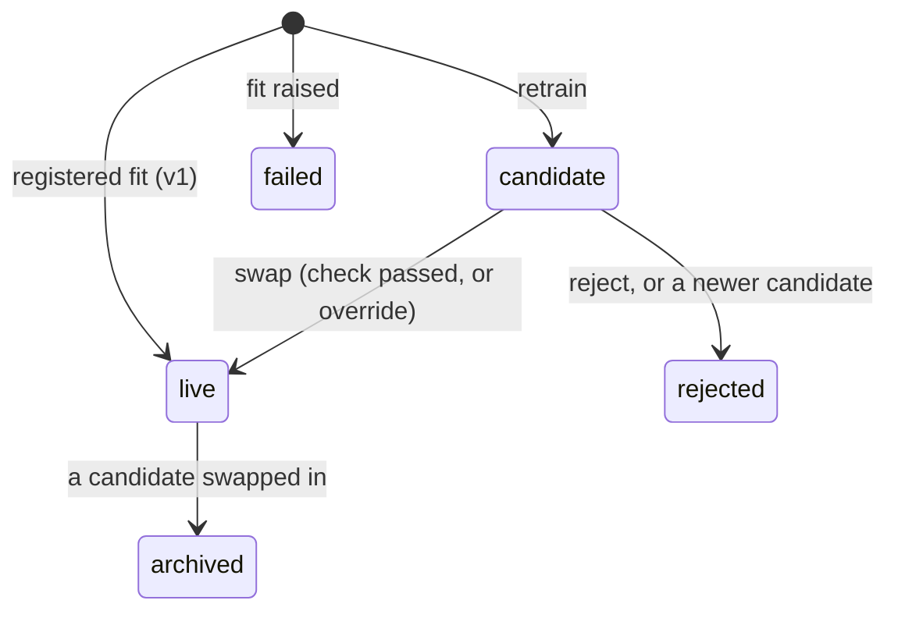

# Model lifecycle

A strategy that learns from data (a classifier, a regime model) gets stale. Stonks refits it on a schedule, runs each new fit as a model book first, and swaps it in only through governance. Roadmap 22.6. Code: `src/stonks/lifecycle/`, `src/stonks/registry/versions.py`, `src/stonks/production/version_books.py`, `src/stonks/app/model_versions.py`.

## Versions under one strategy id

The strategy id never changes. The model inside it does. Each fit is a version.



| Status | Meaning |
|---|---|
| `live` | The model the strategy trades. One per strategy. |
| `candidate` | A new fit. Runs as a model book, never trades. |
| `archived` | A former live model. |
| `rejected` | Dropped by hand, or replaced by a newer candidate. |
| `failed` | The fit raised. The error is kept. |

Version 1 is the fit the strategy was registered with. It is recorded the first time you ask for versions. Later versions live in `data/artifacts/<id>/versions/v<n>/`.

The params never change in a retrain. A new param set is a new lab run and a new strategy id.

Each version keeps its own feature profile, and a model whose feature names or order differ from the code refuses to load. The `feature_drift` tick hook warns when live features drift from the live version's profile. See [ML toolkit](ml-toolkit.md).

## Which strategies retrain

A strategy retrains when its `retrainable` flag is true. By default that means the class has its own `fit`. A wrapper retrains when its inner strategy does, or when it fits a model of its own (`LatentRegimeFilter`). Today: `trendline_meta_label`, `rsi_pca`, `pip_miner`, and wrappers around them.

## Retraining

The `model_retrain` job runs every Saturday at 06:00 UTC on all three scheduler backends (`api`, `in_process`, `local`). For each retrainable strategy of `[lifecycle].statuses` it:

1. takes the lab universe and interval from the artifact, else the production universe. A lab run on a stored universe is refit on that universe's members over the new window, names that left included;
2. fits on the last `lookback_days` up to the day before the fire date, through the lab process pool. The version's `train_end` is that last day;
3. saves the fit as a candidate. An older candidate is replaced.

A strategy fitted within `min_days_between_fits` days is skipped, so a re-run does nothing. `force` refits anyway. Nothing trades yet.

```bash
uv run stonks registry retrain                   # every retrainable strategy
uv run stonks registry retrain mom_ml_1a2b --force --as-of 2026-09-25
```

## Model books

While a strategy has a candidate, each tick runs two model books: the candidate and the live version. Both start on the same day with the same cash, under the same risk policy, on an in-memory simulated broker. The real ledger never sees them. Book ids are `<id>@v<n>`, and the tick summary lists them under `model_versions`.

## The swap check

A swap needs a passing swap check, or an override with a reason of at least 20 characters. Missing data never passes.

| Check | Passes when |
|---|---|
| `candidate` | the version is a candidate and the strategy is not retired |
| `min_days` | the candidate book has at least `min_days` days |
| `max_drawdown` | the candidate book fell no deeper than `max_drawdown` |
| `vs_live` | a paired test on the two books' daily returns over the same days does not show the candidate trailing (see below) |

```bash
uv run stonks registry swap-check mom_ml_1a2b 2
uv run stonks registry swap mom_ml_1a2b 2
uv run stonks registry swap mom_ml_1a2b 2 --override --reason "the refit handles the new regime"
uv run stonks registry reject mom_ml_1a2b 2 --reason "worse fit"
```

### The paired test

A few weeks of returns are mostly noise, so the check never compares raw cumulative returns. It takes each day both books have a return, subtracts the live return from the candidate's, and runs a t-test on the mean gap with a Newey-West (HAC) standard error. It fails when the candidate trails the live model with a one-sided p-value below `vs_live_alpha`, or when there are fewer than `min_paired_days` paired days. The report shows the t-statistic and its limit. Roadmap 23.9.

The next tick after a swap trades the new model. A retired strategy never swaps.

## Live calibration

A classifier forecasts a probability that its trade wins. Each tick stores the live and candidate versions' forecasts (`model_forecasts`), and the outcome once the holding horizon has passed. The calibration report says how good those probabilities were (roadmap 23.9):

| Field | Meaning |
|---|---|
| `brier` | Mean squared gap between forecast and outcome. Lower is better. |
| `brier_base_rate` | The Brier score of always forecasting the base rate. |
| `skill` | `1 - brier / brier_base_rate`. Above 0 beats the base rate. |
| `ece` | Expected calibration error over the reliability bins. |
| `bins` | Reliability: mean forecast against the hit rate, per bin. |

A version with no resolved forecast has `null` scores. Strategies that forecast no probability have none at all.

```bash
uv run stonks registry calibration mom_ml_1a2b 2
```

## Audit

Every change writes one row to `model_version_events` first: baseline, candidate, swap, reject, supersede or fail, with the actor, the reason and the swap check report. The table is append-only. Database triggers refuse a live version or a new `strategies.artifact_path` that did not come through a logged swap.

```bash
uv run stonks registry versions mom_ml_1a2b
uv run stonks registry version-history mom_ml_1a2b
uv run stonks registry candidates
```

## Settings

```toml
[lifecycle]
lookback_days = 730
statuses = ["active", "shadow"]
min_days_between_fits = 5

[lifecycle.swap]
min_days = 20
max_drawdown = 0.25
vs_live_alpha = 0.05       # refuse when the candidate trails live with p below this
min_paired_days = 10
```

An old config with `max_underperformance` still loads. The key is ignored with a warning.

## API and MCP

| Action | REST | MCP |
|---|---|---|
| List versions, log, candidates | `GET /api/strategies/{id}/versions`, `.../versions/history`, `GET /api/model-versions/candidates` | `list_model_versions`, `get_model_version_history`, `list_model_candidates` |
| Swap check | `GET /api/strategies/{id}/versions/{version}/check` | `check_model_swap` |
| Calibration | `GET /api/strategies/{id}/versions/{version}/calibration` | `get_model_calibration` |
| Swap, reject | `POST .../versions/{version}/swap`, `.../reject` (strategy.promote) | `swap_model_version`, `reject_model_version` (confirm) |
| Retrain | `POST /api/model-versions/retrain` (lab.run), `GET /api/model-versions/jobs/{job_id}/result` | `retrain_models` (confirm) |

The assistant never gets the swap or reject tools.

## Console

Each strategy page has a Model versions tab: the versions, the candidate's model book against the live model, the swap check, the forecast calibration of the live and candidate models, Swap in (a reason, then a fresh code), Reject, a retrain of that strategy, and the log. Admins see every candidate and Retrain all on `/ops/models`. See `docs/ui.md`.
