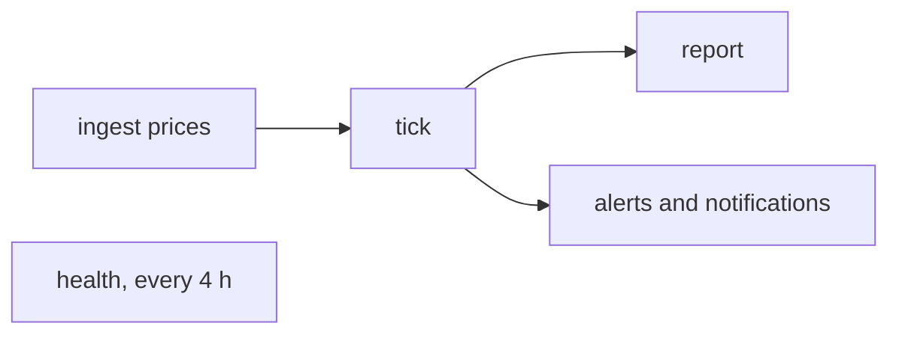
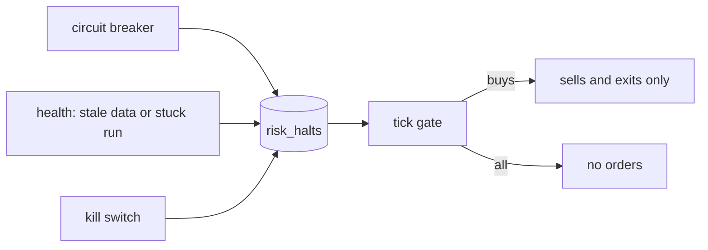
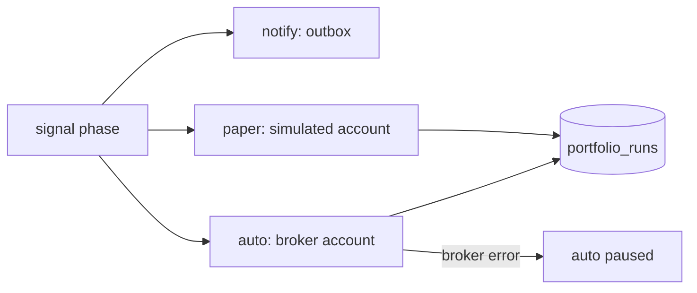

# Operations

How to run Stonks every day and know when something breaks. Server setup, updates, off-server backups and host monitoring are in [deploy.md](deploy.md). Incident steps are in the [runbooks](#runbooks).

## The daily loop



| Step | Command | What it does |
|------|---------|--------------|
| 1 | `uv run stonks ingest prices --tickers AAPL.US,MSFT.US` | Pulls the latest daily bars, checks them, upserts them. |
| 2 | `uv run stonks tick` | Scores active strategies, trades the default portfolio (`pf_default`), advances the model books, runs the hooks. |
| 3 | `uv run stonks report` | Writes the HTML report (`data/reports/report.html` by default). |
| 4 | `uv run stonks health --notify` | Checks data freshness and stuck or failed runs. Exits 1 and alerts when unhealthy. |

Run `uv run stonks db init` after every upgrade, before the first tick. It applies new migrations to both stores.

Every step is safe to rerun: ingest upserts, the tick reuses client ids for the same `as_of` and skips orders already placed (and model books already evaluated), and health only opens or clears the operational halt. Times are UTC. `tick` defaults `--as-of` to today's UTC date and refuses a date older than its latest snapshot.

- `stonks tick --tickers ...` (or `--asset-class`) runs a scoped tick. It trades only those tickers and leaves every other holding alone, not even selling it. A tick over `[production].universe` still sells a holding that left the universe.
- When the broker fills less than an order asked for (a simulated buy scaled down to cash), the order row keeps the filled quantity. Its `status_reason` says what was asked for.

## Scheduler

The built-in scheduler runs the loop on the exchange calendar, catches up missed runs, alerts on missed deadlines and pings an external monitor.

```bash
uv run python -m stonks.scheduling run          # run until Ctrl+C / SIGTERM
uv run python -m stonks.scheduling next         # each job's next fire time
uv run python -m stonks.scheduling runs         # recent runs and their status
uv run python -m stonks.scheduling run-now tick --as-of 2026-09-25
uv run python -m stonks.scheduling check        # deadline check once; exit 1 on a miss
uv run python -m stonks.scheduling metrics      # Prometheus text metrics
```

Run exactly one, as a long-lived process (systemd unit, Windows service, or the `scheduler` container). It acts as `service:scheduler`. A second `run` finds `scheduler.lock` taken and exits with code 2.

### Default jobs

| Job | When | Deadline |
|-----|------|----------|
| `universes_refresh`: refresh stored universes and fill their recent bars | close + 20 min | none |
| `ingest_metadata`: splits, dividends and other metadata for the universe, from Yahoo | close + 25 min | none |
| `ingest_prices`: last 7 days of daily bars for `[production].universe` | close + 30 min | 60 min |
| `tick` | close + 45 min | 60 min |
| `report`: `reports/latest.html` next to the state DB | close + 90 min | none |
| `health`: checks, and opens or clears the operational halt | every 4 hours | none |
| `backup`: `[backup]` target and retention | 05:00 UTC daily | 120 min |
| `connections_sync`: broker connections whose sync is due | every hour | none |

Session jobs run on NYSE trading days. `ingest_metadata` reads Yahoo because the free EODHD plan has no metadata. On a paid plan set `params = { source = "eodhd" }`.

The scheduler also runs the notification delivery worker (`[scheduler].deliver_notifications`, on by default). Don't add a cron `deliver` next to it.

Listing any `[[scheduler.jobs]]` in the config replaces the whole default list:

```toml
[scheduler]
catch_up = "latest"          # none | latest | all
max_catch_up_runs = 3
catch_up_window_hours = 72

[[scheduler.jobs]]
name = "tick"
action = "tick"
deadline_minutes = 60
ping_url_env = "STONKS_PING_TICK"      # healthchecks.io-style URL, kept in .env
trigger = { type = "session", calendar = "XNYS", anchor = "close", offset_minutes = 45 }

[[scheduler.jobs]]
name = "crypto_tick"
action = "tick"
params = { tickers = ["BTC-USD.CC", "ETH-USD.CC"] }
trigger = { type = "daily", at = "00:30", timezone = "UTC" }
```

A job with its own `tickers`, like `crypto_tick`, runs a scoped tick: holdings outside its tickers are marked but never traded. A scheduled tick also buys a ticker only when the lake holds the bar of its latest session that closed by the fire time. When the price ingest failed, the tick still marks and sells, but buys nothing. (`crypto_tick` at 00:30 UTC needs the previous day's bar.)

Triggers:

- `session`: minutes after (or before) a calendar's `open` or `close`, on its trading days. The run is for that session's date.
- `daily`: a wall-clock time in an IANA time zone, optionally only on `weekdays` or a `calendar`'s trading days. DST gaps and repeats run once.
- `interval`: every `every_minutes` on a fixed grid from midnight UTC.

### Market calendars

Sessions come from `exchange_calendars` (wrapped in `scheduling/calendar.py`), with holidays, early closes and DST. Tickers map to calendars by suffix: `.US` is NYSE, `.LSE` London, `.XETRA` Xetra, `.COMM` CME, `.GBOND` a 24/5 calendar, and crypto (`.CC` or asset class `crypto`) trades 24/7. The tick and price ingest skip a day on which nothing in the universe trades. Turn that off per job with `params = { skip_closed_days = false }`.

### Backends

DuckDB allows one writer per lake, so `[scheduler].backend` picks where jobs run:

| Backend | Jobs run | Use when |
|---------|----------|----------|
| `api` | Through the running API (`POST /api/ingest/runs`, `POST /api/ticks`, then polling `GET /api/jobs/{id}`). Never opens the lake. | `stonks serve` runs, as in the Compose stack. |
| `in_process` | Inside the API process, on its job runner. | A single-process install. `stonks serve` starts and stops it with the app. |
| `local` | In the scheduler process, opening the stores like the CLI. | Nothing else holds the lake. |

`auto` (default) picks `api` when `STONKS_API_URL` or `[scheduler].api_url` is set, else `local`. The `api` backend sends `STONKS_API_TOKEN`, only over https, to loopback, or to hosts in `[scheduler].api_trusted_hosts` or the comma-separated `STONKS_API_TRUSTED_HOSTS` (Compose sets `api`).

### Runs and catch-up

Each fire is one `scheduled_runs` row keyed by job and run key (session date, local date, or UTC instant), so a fire never runs twice, even across restarts or two schedulers. At start, `catch_up` decides what happens to fires missed within `catch_up_window_hours`: `none` drops them, `latest` (default) runs the newest, `all` runs up to `max_catch_up_runs`, oldest first. A job that never ran has nothing to catch up.

A failed run is not retried. It alerts; rerun it with `run-now`. A run interrupted by a crash is marked `failed` ("interrupted") at the next start. If the scheduler stops while an API job runs, the job keeps going in the API; check `GET /api/jobs/{id}` before rerunning.

A tick killed mid-run (container stop, out of memory, reboot) leaves its `tick_runs` row at `running`, and the `stuck_ticks` check then holds the operational buy halt. The next start of the process that runs ticks (`stonks serve`, or the `local` scheduler) closes such rows as `error` ("interrupted"). The next health run then clears the halt. Run `stonks health` to clear it at once. A same-day rerun of the tick is safe.

### Dead-man checks

- **Deadlines.** A watchdog checks every `watchdog_seconds` that each job with `deadline_minutes` succeeded (or was skipped) in time. A miss sends one error alert, recorded in `scheduler_deadline_alerts` so restarts don't repeat it.
- **Pings.** With `ping_url_env`, a job POSTs `<url>/start`, then `<url>` or `<url>/fail`. The external monitor alerts when pings stop, which also covers a dead scheduler or server. Logs show only `scheme://host/***`.

## Health and metrics

`stonks health` exits 0 when healthy and 1 otherwise. Thresholds are under `[production.health]`:

| Check | Fails when | Setting (default) |
|-------|------------|---------|
| `freshness:<ticker>` | The latest daily bar is older than N calendar days, or missing. | `max_bar_age_days` (4) |
| `stuck_ticks` | A tick has been `running` for more than N minutes. | `stuck_tick_minutes` (60) |
| `stuck_ingest_runs` | An ingest has been `running` for more than N minutes. | `stuck_ingest_minutes` (180) |
| `ingest_failures` | An ingest failed in the last N hours. | `ingest_failure_lookback_hours` (24) |
| `var_violations` | A portfolio's rolling 95% VaR violation ratio is outside 0.5 to 1.5, after at least 60 scored days. It never opens a halt. | see Live risk below |
| `lab_queue` | Lab worker jobs waited more than N minutes with no live worker, or a running one lost its worker. It never opens a halt. | `stuck_lab_queue_minutes` (30) |

The API serves `GET /api/health` (liveness, used by Docker and Caddy) and `GET /api/health/report` (the full report). The report only reads: it lists open halts but never opens or clears one, whatever tickers it is asked about. `POST /api/health/run` (admins, `operations.run`) runs the checks and syncs the operational halt, recorded under the caller. The `api` scheduler backend uses it.

`GET /api/ticks` and `GET /api/ticks/{id}` show everyone each tick's status, counts, winner and shadow results. Orders, clipped orders, stale buys, halts and per-portfolio details show only for your own portfolios, admins included. `?portfolio_id=` picks one of yours. The MCP tools `list_ticks` and `get_tick` read the same.

`python -m stonks.scheduling metrics` prints Prometheus text from the state DB: tick counts, duration and last success; orders by status and rejections; API jobs and queue depth; each scheduled job's last success, last status and next run; the scheduler heartbeat. `GET /metrics` adds the lab worker queue (see below). `--data-age` adds universe data age buckets but opens the lake, so use it only when `stonks serve` is not running.

`stonks serve` serves the same set, data age included, at `GET /metrics`. Scrapes from a loopback peer need no token. From anywhere else they need the scrape-only bearer token `STONKS_METRICS_TOKEN`. The API token is not accepted there, so Prometheus never holds an admin credential. `STONKS_METRICS_ALLOW_LOOPBACK=false` requires the token on loopback too.

A useful alert: `time() - stonks_scheduled_job_last_success_timestamp_seconds{job="tick"} > 26 * 3600` on weekdays.

Over HTTP, `GET /api/health/live` (the process, plus the scheduler when `stonks serve` hosts it) and `GET /api/health/ready` (state migrated, lake present) are open to everyone, like `GET /api/health`. They answer 200 with each check's name and `ok`, or 503 naming the failing checks; details go to the log, not the response.

With `[scheduler] backend = "in_process"`, `stonks serve` starts the scheduler with the app and stops it (after the running job) on shutdown. `GET /api/schedule` lists the jobs, their next fire and recent runs; `POST /api/schedule/{job}/run-now` (token, audited as `schedule.run_now`) starts a `manual:` run in the background.

## Lab worker

With `[lab.offload] executor = "worker"` (env `STONKS_LAB_EXECUTOR=worker`) the API queues lab runs, sweeps and Studio lab runs for a separate process instead of running them. Setup and the flow are in [deploy.md](deploy.md#10-lab-offload).

```bash
python -m stonks.lab.offload worker          # run until SIGTERM (the lab-worker service)
python -m stonks.lab.offload worker --once   # at most one job, then exit
python -m stonks.lab.offload status          # queue and workers as JSON, exit 1 when unhealthy
python -m stonks.lab.offload snapshot        # publish a lake copy now (only while serve is down)
```

| Metric | Meaning |
|--------|---------|
| `stonks_lab_queue_jobs{status}` | Worker jobs queued and running. |
| `stonks_lab_queue_oldest_queued_seconds` | How long the oldest queued job has waited. |
| `stonks_lab_queue_stale_running` | Running jobs whose worker stopped sending heartbeats. |
| `stonks_lab_workers_alive` | Workers with a heartbeat in the last `lease_seconds`. |
| `stonks_lab_worker_jobs_total{outcome}` | Jobs finished by workers: succeeded, failed, cancelled. |

A useful alert: `stonks_lab_queue_oldest_queued_seconds > 1800 and stonks_lab_workers_alive == 0`.

- A worker writes a heartbeat every `heartbeat_seconds` (10). A running job with no heartbeat for `lease_seconds` (120) fails as `worker lost`. The next worker poll does that.
- Stopping the worker cancels its running job at the next checkpoint. Restarting the API leaves queued worker jobs alone.
- Snapshots live in `<lake dir>/lab_snapshots`. The newest two are kept, plus any a worker still reads.

## Backups and restore

```bash
uv run stonks backup backup             # backup, verify, prune
uv run stonks backup list
uv run stonks backup verify <backup-id>
uv run stonks backup restore <backup-id> --data-dir /srv/stonks/data-restored
uv run stonks backup prune
```

`python -m stonks.ops <command>` is the same tool without the rest of the CLI. It also has `restore-snapshot` and `check-restore`, which the off-server restore scripts use.

A backup is one folder `stonks-<UTC time>Z` with the state DB, the lake, Parquet bars (hard-linked), artifacts and a `manifest.json` of hashes and row counts. It goes to `[backup].dir`, or `backups/` next to the lake. Pruning keeps the newest backup of each of the last 7 days, 4 weeks and 12 months.

The lake must not be held by another writer: stop `stonks serve` or back up from the server's own copy. `[backup]` in the config sets the folder and the retention. Off-server encrypted copies (restic) are covered in [deploy.md](deploy.md#6-backups). Full steps: [runbooks/restore.md](runbooks/restore.md).

## Data quality

Every `ingest prices` and `ingest intraday` batch is checked before it is stored:

- **Quarantined** (kept out of `bars`, written to `quarantined_bars` with reasons): missing or non-positive prices, high below low, close outside the bar's range, duplicate timestamps, one-bar spikes that revert. A vendor row with a null or missing price costs only that row, not the ticker.
- **Stored spikes**: a daily ingest stores one bar at a time, so a bad tick is stored before the next bar shows it up. When the next batch takes its move back, the stored bar moves to `quarantined_bars` and leaves `bars`.
- **Warnings** (kept): extreme moves that stick, stale series, flat price streaks, zero-volume streaks, calendar gaps (a day whose only bar was quarantined counts), and `no_data` when the source returned nothing.
- **Unfinished bars**: a daily bar whose session has not closed yet is dropped. The next ingest after the close stores it.

Each run stores a summary in `ingest_runs.quality_json` and alerts when it quarantines a bar, when 5 or more tickers warn, or when a fallback source supplied data. Thresholds use the defaults in `ingest/quality_config.py`; `[ingest.quality]` and `[ingest.fallback]` are not read from the config file yet, and no command wires a fallback source today. Triage: [runbooks/data-stale.md](runbooks/data-stale.md).

## Alerts

Operator alerts go through the `Notifier` seam, set under `[notify]`:

```toml
[notify]
backends = ["log", "store", "webhook"]   # default ["log", "store"]; [] disables
min_level = "warning"                    # info | warning | error
```

- `log`: a `notify` event in the structured log.
- `store`: every alert, any level, in the `alerts` table, read by `GET /api/alerts`. Credentials are scrubbed first.
- `webhook`: POSTs `{level, title, message, fields, text}` to `STONKS_NOTIFY_WEBHOOK_URL` (keep it in `.env`; Slack and Mattermost show `text`).

A notifier never raises. What alerts:

| Source | Level | When |
|--------|-------|------|
| tick | error | The tick raised (recorded as `error`, exit non-zero). |
| tick | warning | Status `partial` (naming each failed portfolio and its error), or the broker rejected orders. |
| tick | warning | A corporate action waits for its ex-date bar. |
| `health --notify` | error | Any check failed. |
| scheduler | error | A job failed or missed its deadline. |
| ingest | warning | Quarantined bars, many warnings, or fallback used. |

Orders the risk rules clip or drop are not alerts; they are listed under `risk_adjustments` in the tick summary.

## Push and per-user notifications

Per-user notifications go through an outbox: the router writes one in-app `alerts` row and one delivery per channel (Web Push, the user's webhook, email), with dedupe, preferences and quiet hours in the user's time zone. The delivery worker sends them with retries and dead letters. The tick does not enqueue signals into the outbox yet (its `notification_enqueue` hook only logs), so today `notify test` is the way to exercise it.

```bash
uv run python -m stonks.notify vapid-keygen             # prints STONKS_VAPID_PUBLIC_KEY / _PRIVATE_KEY
uv run python -m stonks.notify test --user you@example.com
uv run python -m stonks.notify deliver                  # one delivery pass
```

Set `STONKS_VAPID_PUBLIC_KEY`, `STONKS_VAPID_PRIVATE_KEY` and `STONKS_VAPID_SUBJECT` (a `mailto:` or `https:` contact) as secrets. Email is optional (`STONKS_SMTP_HOST`, `_PORT`, `_USERNAME`, `_PASSWORD`, `_FROM`, `_SECURITY`). Rotating the VAPID pair makes every user re-enable push.

The scheduler runs the delivery worker. Without the scheduler, run `deliver` every minute from cron or a timer. The console's install and push opt-in are described in [ui.md](ui.md#install-and-notifications-pwa).

## Broker connections

Connections sync a user's broker accounts read-only: positions, cash and activities, into a linked `broker` portfolio. No provider works until an admin enables it.

```bash
export STONKS_SECRET_KEYS="$(uv run python -m stonks.security keygen 2>/dev/null)"   # once; keep it secret
export STONKS_CONNECTIONS_ENABLED_PROVIDERS=alpaca
uv run python -m stonks.connections providers
STONKS_CONNECT_API_KEY=... STONKS_CONNECT_SECRET_KEY=... uv run python -m stonks.connections connect alpaca
uv run python -m stonks.connections link <connection> <account>
uv run python -m stonks.connections sync --due        # every due connection
uv run python -m stonks.connections rotate-keys       # after adding a new master key
```

- Credentials come from `STONKS_CONNECT_<FIELD>` or a hidden prompt, never from arguments, and are sealed with the master key from `STONKS_SECRET_KEYS`. Keep the old keys listed after a new one until `rotate-keys` has run.
- SnapTrade needs `STONKS_SNAPTRADE_CLIENT_ID` and `STONKS_SNAPTRADE_CONSUMER_KEY` and connects through its portal (`connect snaptrade --redirect URL`, then `callback`).
- A sync writes one `portfolio_snapshots` row per portfolio and day (`source` other than `tick`), and is safe to repeat.
- The scheduler's `connections_sync` job runs `sync --due` every hour. Without the scheduler, run it from cron or a timer.

## Risk policy

Risk rules run between construction and the broker, configured under `[production.risk]`:

| Setting | Effect |
|---------|--------|
| `enabled` | `false` passes orders through untouched. |
| `max_open_positions` | Buys that would open a position beyond the count are dropped. |
| `max_weight_per_ticker` | Buys are clipped to this fraction of portfolio value. |
| `max_weight_per_asset_class` | For example `crypto = 0.2`. With any class cap set, buys of unknown-class tickers are dropped. |
| `cash_buffer_fraction` | Buys are clipped so this fraction stays in cash, net of costs. |
| `min_order_notional` | Smaller buys are dropped. |

Weights use portfolio value before the tick's orders. Sells are never blocked, only clipped to the held quantity, and go before buys. Portfolio and subscription overrides can only tighten the policy. The rules are a registry (`production/rules/`); the newer ones (`risk_per_position`, `portfolio_vol`, `drawdown_scaling`, `liquidity`, `sector_cap`, `max_holding`, `circuit_breaker`, `operational_halt`) are set under `[production.risk.rules.<name>]` and stay off until a limit is set there (see `config/default.toml`).

## Halts and the kill switch

A halt stops new orders before they reach the broker. Every halt is a row in `risk_halts`, and the tick checks global, user and portfolio halts for each book.



| Halt | Trips when | Ends |
|------|------------|------|
| `month_loss` | Value is 6% below the month's first snapshot. | At the start of next month, or when cleared. |
| `week_loss` | Value fell 4% over 5 snapshots. | At the start of next month, or when cleared. |
| `drawdown` | Value is 20% below its peak. | Only when a person clears it. |
| `operational` | The scheduled health job or `stonks health` finds stale data or a stuck run. | When one of them passes again. |
| `kill` | A person turns on the kill switch. | Resume with the typed confirmation. |

- The breaker limits live in `[production.risk.rules.circuit_breaker]` (`max_month_loss`, `max_week_loss`, `max_drawdown_halt`, `cooldown`). They are off until set. The same rule runs in backtests.
- Breaker halts block buys. Sells and exits still go through.
- The gate also runs on a tick that trades nothing, so a breaker trip is recorded and notified the day it happens.
- The kill switch has three scopes: `global` (admins), `user` (all your portfolios) and `portfolio` (one of yours). It stops every order, or only buys with `buys_only` (sells and exits still go through, and no position is closed). `flatten` is the old, deprecated name of `buys_only` and still works.
- A `user` kill switch covers every portfolio you own, `pf_default` included when you are its owner.
- Engaging stop-all while a buys-only kill switch is on escalates it to stop everything. The old row closes with "escalated to all" and a new one opens. Engaging buys-only never weakens a stop-all.
- Engaging also cancels the orders your portfolios still have working at an external broker (only buys with `buys_only`), and books the result. A failed cancel is logged and audited but never undoes the halt. Engage again to retry.
- Resume the kill switch with `POST /api/halts/{id}/resume` and the text `RESUME TRADING`. Clear other halts with `POST /api/halts/{id}/clear` and a reason.
- Every action writes an `audit_log` row. Every clear also writes a `risk_reset` row in `status_changes`.
- A trip sends a `risk` notification to the portfolio owner, or to the admins for a global halt.
- A halt on a broker portfolio also stops its paper account.
- MCP can list halts and turn the kill switch on (with `confirm=true`). It cannot resume.

### Quit rule

After each tick the quit rule checks every active strategy. It sums the strategy's share of each portfolio's P&L since promotion. When the drawdown of that P&L passes 1.5 times the backtest drawdown, or the Monte Carlo 95th percentile when it is lower, the admins get an `error` notification. With `auto_demote` on, the strategy also moves to `shadow` with a logged reason.

### Live risk

After each real tick the `risk_monitor` hook writes one `risk_snapshots` row per portfolio, and one per strategy sleeve of it (the positions attribution gives the strategy).

- **VaR and ES.** One-day 95% and 99%, from an EWMA covariance (0.94) of the last 250 daily returns. They are fractions of the book's value, and a loss is positive. A portfolio's value includes cash.
- **Violations.** Each day, yesterday's holdings times today's returns is compared with yesterday's VaR. Trades and deposits do not count. The row keeps the rolling violation ratio (1.0 is right) and the Kupiec p-value.
- **Alpha decay.** For each sleeve, the rolling 60 and 120 day IR. It fires when the 60 day IR stays below zero for 20 days, or the 120 day IR falls below half of the backtest's (the `oos` Sharpe, else the benchmark-relative IR).

The portfolio owner gets a `risk` warning when the violation ratio leaves the band or a sleeve decays, once per crossing. `GET /api/risk/live` shows one of your portfolios on its latest day and `GET /api/risk/snapshots` pages its history (`?strategy_id=` for one sleeve). The MCP tools `live_risk` and `risk_snapshots` read the same.

In the lab, the `pool_correlation` survival test refuses a strategy whose validation returns correlate above 0.7 with any active strategy, unless its IR is at least 10% better. It is not in a preset yet; add it with `--tests`.

## Splits and dividends

Before a real book decides, the tick applies the splits and cash dividends of its holdings, once per portfolio. The `corporate_action_ledger` table records each one.

- An event applies once its ex-date is on or before the tick's date, even when its row reached the lake after the ex-date tick.
- It acts on the shares held at the close before the ex-date. Shares bought later were bought at post-split prices and are not scaled. A position closed in between is skipped.
- It waits, and alerts, until the lake has a bar for the ticker on or after the ex-date. Before that the price is still the old one.
- Working orders decided before a split's ex-date are resized. Fills already booked for them move to post-split shares too, as the broker reports them. An external broker's account already shows the event, so only the ledger row is written.
- Events on or before a portfolio's last snapshot at the upgrade count as done.

Model books still apply the events between their last snapshot and the tick.

## Signals and automation modes

Each tick scores every active strategy once for everyone, and shadow strategies too when model books run. After the model books move, the tick stores what each strategy said:

- `signals`: one row per strategy and ticker, with the score, its rank and its weight in the model book.
- `signal_events`: what changed (`entry`, `exit`, `increase`, `decrease`) with a plain reason. A strategy can give its own reason through an `explain(ticker, as_of, lake)` method.

A strategy with a model book signals what its book did. One without signals new and dropped tickers. With `[production] model_books = "all"` every active strategy gets a model book. A same-day rerun writes nothing twice.

Strategies that set `parallel_scoring = True` are scored in worker processes over a read-only copy of the lake. `[production] scoring_workers` sets the processes (0 means every core) and `parallel_min_estimates` (default 2000) is the smallest job worth a pool. Other strategies are scored in the tick's own process.

The tick trades one book per portfolio from its subscriptions (`[production] books_from_subscriptions = true`, the default):

| Mode | What the tick does |
|------|--------------------|
| notify | Sends the day's signal events to the outbox. Places nothing. |
| paper | Trades a simulated account. A broker portfolio gets its own paper account (`<id>_paper`), so paper money never reaches the real one. |
| auto | Trades the portfolio's connected broker account. |



- Client ids carry the portfolio, so two portfolios never share one.
- Every book writes one `portfolio_runs` row per tick: mode, status, counts, any halt, and its paper and auto subscriptions.
- Paper days for the auto gate come from `portfolio_runs`: days that finished without an error or a risk breach, after the last breach and after the last switch to notify. Only weekdays up to today count, and a day halted with `all` traded nothing, so it does not count. The subscriptions view shows the same count.
- A real tick for a date after today is refused. Only a dry run may look ahead.
- Auto needs 20 paper days, an active strategy, a healthy connection that can trade, no halt, and a fresh second factor.
- A broker error pauses the portfolio's auto subscriptions with a `paused_reason`, writes an audit row and tells the owner. A plain rejection pauses nothing. Resume by switching back to auto, which runs the checklist again.
- Auto trades only an active strategy. When a strategy leaves `active` (demoted to shadow or retired), its auto subscriptions pause with `strategy_not_active: <status>`, an audit row and a notice to the owner. The tick also refuses, and pauses, any auto subscription whose strategy is not active. Paper and notify subscriptions go on.
- A retired strategy exits its own holdings in each paper book that follows it, whatever the other strategies decided for those tickers. Once it holds nothing its subscription is turned off (audited as `service:system`). Its auto subscriptions pause instead, so real holdings wait for their owner.
- An auto book trades only what it owns in the connected account. What it owns is its own net filled quantity per ticker (its fill ledger, carried through splits). Holdings you bought yourself are marked in the snapshot but never traded, and an order that would sell your own long or cover your own short is dropped (`external_holdings_skipped` in the tick summary). The book sizes on the account's cash plus its own positions. The legacy live default book of `[brokers].kind` still treats its whole account as its own, so keep that account dedicated.
- Owner risk limits (`users.risk_policy_json`) tighten every portfolio the owner has. They can only make limits stricter.
- The default book `pf_default` follows every active strategy. A promotion subscribes it to the strategy when it has no subscription yet: paper on the simulated broker, auto when `[brokers].kind` is an external broker. The row is audited as `service:system`. Migration 022 did the same once for the strategies already active. A subscription the owner turned off stays off.
- Upgrading an install whose `[brokers].kind` is external (for example `alpaca`): migration 022 wrote those `pf_default` rows in paper, because `pf_default` was a simulated portfolio. The first real tick turns the rows the system wrote to auto (audited as `service:system`, reason `default_book_live_broker`), so the live account keeps trading. A row whose mode someone changed is left alone. If the live default holds positions but no auto strategy runs on it, each tick sends a "default book unmanaged" alert.
- A dry run plans the same books but writes nothing: no paper account rows and no mode switch.
- With the flag set to false the tick trades only the old single book: `pf_default` over every active strategy.

## Financing of short books

A portfolio with `allow_short` trades on margin. Each tick its paper broker charges the borrow fee of every short and interest on negative cash for the calendar days since the last charge. The tick keeps that date in `financing_accruals` and each charge in `financing_charges`, both written with the snapshot. A book with no stored date starts from its latest snapshot. A dry run charges nothing.

## Model books (shadow mode)

`shadow` strategies are scored each tick and never traded. Each runs alone against a virtual portfolio seeded with `initial_cash`, with the same risk policy, always on a simulated broker:

- `shadow_decisions`: one row per hypothetical order.
- `shadow_portfolio_snapshots`: one row per strategy per `as_of`.

A failing model book is reported in the tick summary and never affects real books. Turn it off with `[production].shadow_enabled = false`; `--dry-run` writes nothing.

## Go-live and promotion

```bash
uv run stonks pnl --strategy <shadow-id>
uv run stonks golive check <shadow-id>          # exit 1 when a check fails
uv run stonks registry promote <shadow-id>
uv run stonks registry promote <id> --override --reason "why"
uv run stonks registry history <id>
```

With `[golive] incubation = true` the gate needs at least 63 days (or MinTRL, capped at 252), 20 trades, live results inside the Monte Carlo band, no quit-rule breach, stored reports for every `promotion` preset test, non-zero costs, a recorded hypothesis, and at least 30 backtest trades. The gate never changes status; `registry promote` does, and refuses without a pass or an override.

## Reading P&L

```bash
uv run stonks pnl                      # the default portfolio, from inception
uv run stonks pnl --since 2026-09-01   # rows from this day on
uv run stonks pnl --strategy <id>      # a model book
```

Columns: `date`, `value` (cash plus marked positions), `change`, `daily`, `cumulative` (since the first snapshot) and `drawdown` (below the running peak). `--since` only trims rows; `cumulative` and `drawdown` still count from inception.

## Trading costs and the journal

Every order the tick places records its decision: the price the strategy decided at (the latest close), the day, why it traded (the trigger, the strategy, the signal score and rank, the constructor and the target weight) and what the cost model expected it to cost. Each fill records its arrival price, the market price before costs.

```bash
uv run stonks tca summary                     # the default portfolio, all orders
uv run stonks tca summary --by strategy       # or ticker, portfolio, day, week, month
uv run stonks tca journal --since 2026-09-01  # orders with reason, outcome and notes
uv run stonks tca order <client-id>           # one order in full
uv run stonks tca note <client-id> "text"     # add a note
uv run stonks tca edit-note <note-id> "text"  # change your note
uv run stonks tca refresh                     # fill next-session prices from the lake
```

The summary shows implementation shortfall in basis points of the traded value at the decision price. Positive numbers are costs.

- `delay`: the move from the decision price to the arrival price.
- `impact`: the move from the arrival price to the fill price (spread, slippage, impact).
- `fees`: the fees charged.
- `IS`: all three together.
- `opportunity`: what the unfilled part cost, measured at the next session's close.
- `convention`: how much more the live fill paid than a backtest would have, which fills at the next session's open.
- `model` and `gap`: the cost model's estimate and the realised shortfall minus that estimate. A gap that stays above zero means the cost model is too cheap.

The next session's open and close arrive a day later. The tick fills them in after every run, and `stonks tca refresh` does it by hand. For an external broker the arrival price is that next open.

The go-live report shows the strategy's live shortfall next to the modelled cost. The same numbers are in the API under `/api/tca` and in the MCP tools `tca_summary`, `trade_journal` and `order_tca`. A trader only sees the orders of their own portfolios and edits only their own notes.

Backtests use the same math. `Backtester.decision_prices` holds the close each order was decided at, and `production.tca.backtest_shortfalls` prices the simulated fills against it.

## Without the scheduler

Plain cron works too. After the US close in UTC terms (22:30 UTC is safe all year):

```cron
30 22 * * 1-5  cd /opt/stonks && uv run stonks ingest prices --tickers AAPL.US,MSFT.US >> logs/ingest.log 2>&1
45 22 * * 1-5  cd /opt/stonks && uv run stonks tick >> logs/tick.log 2>&1
0  23 * * 1-5  cd /opt/stonks && uv run stonks health --notify >> logs/health.log 2>&1
*  *  * * *    cd /opt/stonks && uv run python -m stonks.notify deliver >> logs/notify.log 2>&1
0  */6 * * *   cd /opt/stonks && uv run python -m stonks.connections sync --due >> logs/sync.log 2>&1
0  2  * * *    cd /opt/stonks && uv run python -m stonks.ops backup >> logs/backup.log 2>&1
```

cron does not know exchange holidays; on those days the tick finds no new bars and trades nothing.

## Runbooks

- [Data stale or bad](runbooks/data-stale.md)
- [Back up and restore](runbooks/restore.md)
- [Deploy failed](runbooks/deploy-failed.md)
