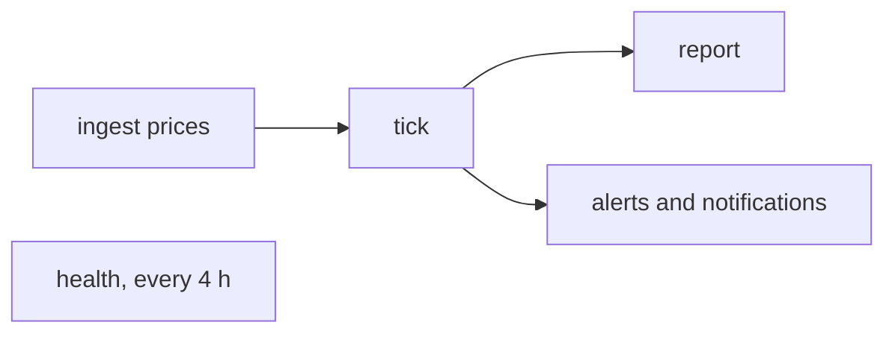
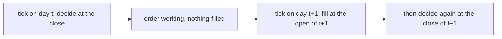
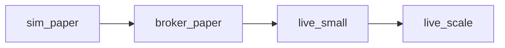
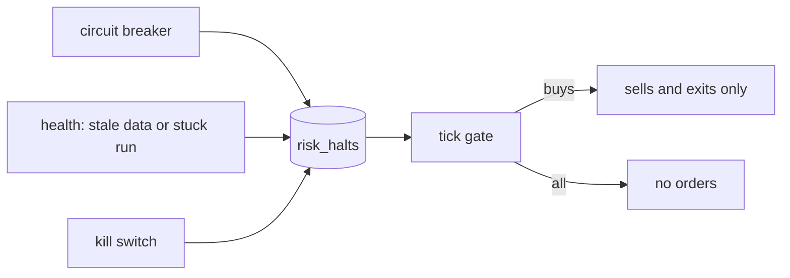
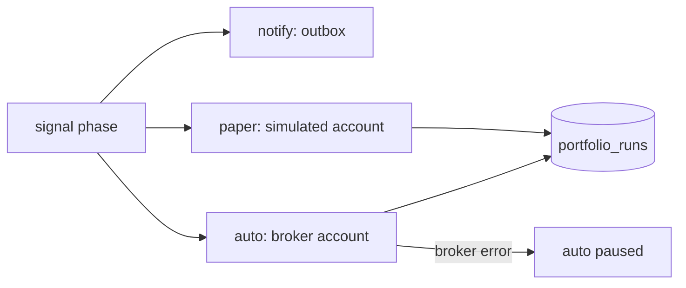

# Operations

How to run Stonks every day and know when something breaks. Server setup, updates, off-server backups and host monitoring are in [deploy.md](deploy.md). Incident steps are in the [runbooks](#runbooks).

## The daily loop



| Step | Command | What it does |
|------|---------|--------------|
| 1 | `uv run stonks ingest prices --tickers AAPL.US,MSFT.US` | Pulls the latest daily bars, checks them, upserts them. |
| 2 | `uv run stonks tick` | Scores active strategies, trades one book per portfolio from its subscriptions (`pf_default` follows every active strategy), advances the model books, runs the hooks. |
| 3 | `uv run stonks report` | Writes the HTML report (`data/reports/report.html` by default). |
| 4 | `uv run stonks health --notify` | Checks data freshness and stuck or failed runs. Exits 1 and alerts when unhealthy. |

Run `uv run stonks db init` after every upgrade, before the first tick. It applies new migrations to both stores.

Every step is safe to rerun: ingest upserts, the tick reuses client ids for the same `as_of` and skips orders already placed (and model books already evaluated), and health only opens or clears the operational halt. Times are UTC. `tick` defaults `--as-of` to today's UTC date and refuses a date older than its latest snapshot.

- `stonks tick --tickers ...` (or `--asset-class`) runs a scoped tick. It trades only those tickers and leaves every other holding alone, not even selling it. A tick over `[production].universe` still sells a holding that left the universe. Add `--full` to trade the whole book over those tickers. The CLI and the API tick job run the same code.
- When the broker fills less than an order asked for (a simulated buy scaled down to cash), the order row keeps the filled quantity. Its `status_reason` says what was asked for.

### How paper books fill

A paper book fills the way a backtest does (principle P21). The tick decides after the close, and the order fills at the open of the next session.



- The tick that decides records each order as working (`pending`, state `accepted`). The snapshot of that day holds no new fills.
- The next tick fills it before it decides. It uses the first daily bar of the ticker after the decision day, with the same fill model (`[backtest.execution]`) and cost model (`[backtest.costs]`) as a backtest: the open as the price, the participation cap on that bar's volume, the gap guard, limit orders against the bar's range.
- What the fill model leaves unfilled is cancelled with the reason "replaced by the next decision", as a backtest replaces its queue at each rebalance. The fill that did happen stays.
- An order the fill model refuses outright (the gap guard, a limit not reached, no cash) expires.
- A split between the decision and the fill rescales the order.
- A halt in force when the next tick runs holds the working orders it blocks: all of them under `all`, those that do not reduce a position under `buys`. They are cancelled unfilled, as the kill switch cancels working orders at a broker.
- The fill is booked by the next tick, not by a job after the open. The daily bar with that open is only in the lake after the session's price ingest.
- `[production] paper_fills = "close"` keeps the old rule: fill at once at the latest close. Books at a broker are not affected. They send before the next open (tickets and the submit window).
- `tests/integration/test_paper_fill_parity.py` runs one strategy through the paper tick day by day and through a backtest, and checks the fills are the same, a capped partial fill included.

## Scheduler

The built-in scheduler runs the loop on the exchange calendar, catches up missed runs, alerts on missed deadlines and pings an external monitor.

```bash
uv run python -m stonks.scheduling run          # run until Ctrl+C / SIGTERM
uv run python -m stonks.scheduling next         # each job's next fire time
uv run python -m stonks.scheduling runs         # recent runs and their status
uv run python -m stonks.scheduling run-now tick --as-of 2026-09-25
uv run python -m stonks.scheduling check        # deadline check once; exit 1 on a miss
uv run python -m stonks.scheduling metrics      # Prometheus text metrics
```

Run exactly one, as a long-lived process (systemd unit, Windows service, or the `scheduler` container). It acts as `service:scheduler`. A second `run` finds `scheduler.lock` taken and exits with code 2.

### Default jobs

| Job | When | Deadline |
|-----|------|----------|
| `universes_refresh`: refresh stored universes and fill their recent bars | close + 20 min | none |
| `ingest_metadata`: splits, dividends and other metadata for the universe, from Yahoo | close + 25 min | none |
| `ingest_prices`: last 7 days of daily bars for `[production].universe` | close + 30 min | 60 min |
| `ingest_borrow`: IBKR's short stock files into `borrow_rates` (`[sources.ibkr_borrow] markets`) | close + 35 min | none |
| `price_alerts`: every person's price alerts against the new closes | close + 40 min | none |
| `tick` | close + 45 min | 60 min |
| `report`: `reports/latest.html` next to the state DB | close + 90 min | none |
| `health`: checks, and opens or clears the operational halt | every 4 hours | none |
| `backup`: `[backup]` target and retention | 05:00 UTC daily | 120 min |
| `connections_sync`: broker connections whose sync is due | every hour | none |
| `broker_health`: probes each IB Gateway (see Live trading) | every 5 minutes | none |
| `ibkr_reauth_reminder`: push to approve the weekly IBKR login | Sunday 18:00 New York | none |
| `live_sod_check`: reconcile each live portfolio with its broker (see Live trading) | open - 60 min | none |
| `live_eod_check`: the same after the close, before the tick decides | close + 15 min | none |
| `calendars_refresh`: earnings, dividend and economic calendars, then the event alerts (see [calendars](calendars.md)) | 06:00 UTC daily | none |
| `model_retrain`: refit strategies that learn from data into candidate versions (see [Model lifecycle](model-lifecycle.md)) | Saturday 06:00 UTC | none |
| `live_submit`: send approved order tickets (see Live trading) | open - 20 min | none |
| `live_stops`: protective stops for the entries the opening auction filled (see Protective stops) | open + 30 min | none |
| `options_live`: book option assignments, plan expiry closes and rolls as held tickets (see Live options) | close + 55 min | none |
| `options_expiry_watch`: alert on a short option still in the money on its expiry day (see Live options) | close - 60 min | none |
| `live_gate_days`: the live stages' gate metrics for the session (see Live trading) | close + 75 min | none |
| `live_margin`: the margin cushion of each margin account, with an alert when it is thin (see Margin accounts) | every 30 minutes | none |
| `engine_start`: start the intraday engine process (see [intraday](design/intraday.md)) | open - 15 min | none |
| `engine_stop`: ask the intraday engine to stop, and wait for it | close + 10 min | none |

Session jobs run on NYSE trading days. The two engine jobs skip while `[engine] enabled = false`. The two options jobs skip while `[production.options] live = false`. The IB Gateway jobs skip while `[brokers.ibkr.gateways]` is empty (the two reconcile checks also while no gateway lists a portfolio, and `live_margin` while no portfolio has a margin profile). `ingest_metadata` reads Yahoo because the free EODHD plan has no metadata. On a paid plan set `params = { source = "eodhd" }`.

The scheduler also runs the notification delivery worker (`[scheduler].deliver_notifications`, on by default). Don't add a cron `deliver` next to it.

Listing any `[[scheduler.jobs]]` in the config replaces the whole default list:

```toml
[scheduler]
catch_up = "latest"          # none | latest | all
max_catch_up_runs = 3
catch_up_window_hours = 72

[[scheduler.jobs]]
name = "tick"
action = "tick"
deadline_minutes = 60
ping_url_env = "STONKS_PING_TICK"      # healthchecks.io-style URL, kept in .env
trigger = { type = "session", calendar = "XNYS", anchor = "close", offset_minutes = 45 }

[[scheduler.jobs]]
name = "crypto_tick"
action = "tick"
params = { tickers = ["BTC-USD.CC", "ETH-USD.CC"] }
trigger = { type = "daily", at = "00:30", timezone = "UTC" }
```

A job with its own `tickers`, like `crypto_tick`, runs a scoped tick: holdings outside its tickers are marked but never traded. A scheduled tick also buys a ticker only when the lake holds the bar of its latest session that closed by the fire time. When the price ingest failed, the tick still marks and sells, but buys nothing. (`crypto_tick` at 00:30 UTC needs the previous day's bar.)

Triggers:

- `session`: minutes after (or before) a calendar's `open` or `close`, on its trading days. The run is for that session's date.
- `daily`: a wall-clock time in an IANA time zone, optionally only on `weekdays` or a `calendar`'s trading days. DST gaps and repeats run once.
- `interval`: every `every_minutes` on a fixed grid from midnight UTC.

### Market calendars

Sessions come from `exchange_calendars` (wrapped in `scheduling/calendar.py`), with holidays, early closes and DST. Tickers map to calendars by suffix: `.US` is NYSE, `.LSE` London, `.XETRA` Xetra, `.COMM` CME, `.GBOND` a 24/5 calendar, and crypto (`.CC` or asset class `crypto`) trades 24/7. The tick and price ingest skip a day on which nothing in the universe trades. Turn that off per job with `params = { skip_closed_days = false }`.

### Backends

DuckDB allows one writer per lake, so `[scheduler].backend` picks where jobs run:

| Backend | Jobs run | Use when |
|---------|----------|----------|
| `api` | Through the running API (`POST /api/ingest/runs`, `POST /api/ticks`, then polling `GET /api/jobs/{id}`). Never opens the lake. | `stonks serve` runs, as in the Compose stack. |
| `in_process` | Inside the API process, on its job runner. | A single-process install. `stonks serve` starts and stops it with the app. |
| `local` | In the scheduler process, opening the stores like the CLI. | Nothing else holds the lake. |

`auto` (default) picks `api` when `STONKS_API_URL` or `[scheduler].api_url` is set, else `local`. The `api` backend sends `STONKS_API_TOKEN`, only over https, to loopback, or to hosts in `[scheduler].api_trusted_hosts` or the comma-separated `STONKS_API_TRUSTED_HOSTS` (Compose sets `api`).

### Runs and catch-up

Each fire is one `scheduled_runs` row keyed by job and run key (session date, local date, or UTC instant), so a fire never runs twice, even across restarts or two schedulers. At start, `catch_up` decides what happens to fires missed within `catch_up_window_hours`: `none` drops them, `latest` (default) runs the newest, `all` runs up to `max_catch_up_runs`, oldest first. A job that never ran has nothing to catch up.

A failed run is not retried. It alerts; rerun it with `run-now`. A run interrupted by a crash is marked `failed` ("interrupted") at the next start. If the scheduler stops while an API job runs, the job keeps going in the API; check `GET /api/jobs/{id}` before rerunning.

A tick killed mid-run (container stop, out of memory, reboot) leaves its `tick_runs` row at `running`, and the `stuck_ticks` check then holds the operational buy halt. The next start of the process that runs ticks (`stonks serve`, or the `local` scheduler) closes such rows as `error` ("interrupted"). Each running row names the host and process that run it, so a tick that is still running (a CLI tick, say) is left alone. A row from another host is closed once it is 12 hours old. The next health run then clears the halt. Run `stonks health` to clear it at once. A same-day rerun of the tick is safe.

### Dead-man checks

- **Deadlines.** A watchdog checks every `watchdog_seconds` that each job with `deadline_minutes` succeeded (or was skipped) in time. A miss sends one error alert, recorded in `scheduler_deadline_alerts` so restarts don't repeat it.
- **Pings.** With `ping_url_env`, a job POSTs `<url>/start`, then `<url>` or `<url>/fail`. The external monitor alerts when pings stop, which also covers a dead scheduler or server. Logs show only `scheme://host/***`.
- **Engine dead-man.** The same watchdog checks each live intraday engine. When no bar close was dispatched for `[streaming.monitor] deadman_minutes` (5) while the engine's market is open, it sends one error alert per silent stretch. Silence counts from the last bar close, the engine's start or today's open, whichever is latest. A stopped engine or a closed market never alerts. The alert is recorded in `scheduler_deadline_alerts` as job `engine:<id>`, so restarts don't repeat it. `python -m stonks.scheduling check` runs it once too.

## Health and metrics

`stonks health` exits 0 when healthy and 1 otherwise. Thresholds are under `[production.health]`:

| Check | Fails when | Setting (default) |
|-------|------------|---------|
| `freshness:<ticker>` | The latest daily bar is older than N calendar days, or missing. | `max_bar_age_days` (4) |
| `stuck_ticks` | A tick has been `running` for more than N minutes. | `stuck_tick_minutes` (60) |
| `stuck_ingest_runs` | An ingest has been `running` for more than N minutes. | `stuck_ingest_minutes` (180) |
| `ingest_failures` | An ingest failed in the last N hours. | `ingest_failure_lookback_hours` (24) |
| `var_violations` | A portfolio's rolling 95% VaR violation ratio is outside 0.5 to 1.5, after at least 60 scored days. It never opens a halt. | see Live risk below |
| `lab_queue` | Lab worker jobs waited more than N minutes with no live worker, or a running one lost its worker. It never opens a halt. | `stuck_lab_queue_minutes` (30) |
| `broker:<gateway>` | The IB Gateway did not answer the latest `broker_health` check. It never opens the operational halt. | `[brokers.ibkr.health]` |

Freshness covers the tickers you pass, else `[production].universe`. A universe id there is resolved to its members on today's date, the same way the tick does. When nothing resolves (the universe was never refreshed), no freshness check runs, so it never opens the operational halt.

The API serves `GET /api/health` (liveness, used by Docker and Caddy) and `GET /api/health/report` (the full report). The report only reads: it lists open halts but never opens or clears one, whatever tickers it is asked about. `POST /api/health/run` (admins, `operations.run`) runs the checks and syncs the operational halt, recorded under the caller. The `api` scheduler backend uses it.

`GET /api/ticks` and `GET /api/ticks/{id}` show everyone each tick's status, counts, winner and shadow results. Orders, clipped orders, stale buys, halts and per-portfolio details show only for your own portfolios, admins included. `?portfolio_id=` picks one of yours. The MCP tools `list_ticks` and `get_tick` read the same.

`python -m stonks.scheduling metrics` prints Prometheus text from the state DB: tick counts, duration and last success; orders by status and rejections; API jobs and queue depth; each scheduled job's last success, last status and next run; the scheduler heartbeat. Per IB Gateway it adds `stonks_broker_connected` and `stonks_broker_last_ok_timestamp_seconds` (labelled by gateway and mode, never by account). Per live portfolio it adds `stonks_reconcile_drift_items` (material and warning items of the latest reconcile check), `stonks_reconcile_last_status` and `stonks_reconcile_last_check_timestamp_seconds`. `GET /metrics` adds the lab worker queue (see below). `--data-age` adds universe data age buckets but opens the lake, so use it only when `stonks serve` is not running.

`stonks serve` serves the same set, data age included, at `GET /metrics`. Scrapes from a loopback peer need no token. From anywhere else they need the scrape-only bearer token `STONKS_METRICS_TOKEN`. The API token is not accepted there, so Prometheus never holds an admin credential. `STONKS_METRICS_ALLOW_LOOPBACK=false` requires the token on loopback too.

A useful alert: `time() - stonks_scheduled_job_last_success_timestamp_seconds{job="tick"} > 26 * 3600` on weekdays.

### Live engine monitoring

The intraday engine runs in its own process. Its monitor writes one `engine_status` row (SQLite migration 044) every `publish_seconds` (15) and when it stops. `GET /metrics` renders it, labelled by `engine` and `source`, never by key or account:

| Metric | What it tells |
|---|---|
| `stonks_stream_up`, `stonks_stream_state` | The stream is connected (0 when the engine stopped reporting) |
| `stonks_stream_last_event_age_seconds` | Seconds since the last trade, quote or bar |
| `stonks_stream_bars_written_total`, `stonks_stream_late_ticks_total` | Bars built from the stream, late prices dropped |
| `stonks_stream_connects_total`, `_disconnects_total`, `_gaps_total`, `_backfills_total` | Connection churn and gap repair |
| `stonks_engine_up` | The engine runs and reported within `stale_after_seconds` (120) |
| `stonks_engine_last_dispatch_age_seconds` | Seconds since the last bar close was dispatched |
| `stonks_engine_bar_closes_total`, `_bars_total`, `_late_bars_total` | Driver counters |
| `stonks_engine_handler_errors_total{handler}` | Steps that raised on a bar close |
| `stonks_engine_dispatch_lag_seconds` (histogram) | Clock time from a bar's settle time to its dispatch |
| `stonks_engine_event_to_order_seconds` (histogram) | Time from a bar close dispatch to the order it caused |

`GET /api/stream/status` (`data.read`) and the MCP tool `get_stream_status` show the same with the dead-man state. The console shows it on Live engine (`/live`). Useful alerts:

- `stonks_engine_up == 0` during market hours.
- `histogram_quantile(0.95, rate(stonks_engine_event_to_order_seconds_bucket[15m])) > 2`.
- `rate(stonks_engine_handler_errors_total[5m]) > 0`.

Settings live under `[streaming.monitor]`: `deadman_minutes`, `stale_after_seconds` and `publish_seconds`.

Over HTTP, `GET /api/health/live` (the process, plus the scheduler when `stonks serve` hosts it) and `GET /api/health/ready` (state migrated, lake present) are open to everyone, like `GET /api/health`. They answer 200 with each check's name and `ok`, or 503 naming the failing checks; details go to the log, not the response.

With `[scheduler] backend = "in_process"`, `stonks serve` starts the scheduler with the app and stops it (after the running job) on shutdown. `GET /api/schedule` lists the jobs, their next fire and recent runs; `POST /api/schedule/{job}/run-now` (token, audited as `schedule.run_now`) starts a `manual:` run in the background.

## Lab worker

With `[lab.offload] executor = "worker"` (env `STONKS_LAB_EXECUTOR=worker`) the API queues lab runs, sweeps and Studio lab runs for a separate process instead of running them. Setup and the flow are in [deploy.md](deploy.md#10-lab-offload).

```bash
python -m stonks.lab.offload worker          # run until SIGTERM (the lab-worker service)
python -m stonks.lab.offload worker --once   # at most one job, then exit
python -m stonks.lab.offload status          # queue and workers as JSON, exit 1 when unhealthy
python -m stonks.lab.offload snapshot        # publish a lake copy now (only while serve is down)

# on another machine, through the API (token with the lab_worker scope only)
STONKS_LAB_WORKER_TOKEN=stk_... python -m stonks.lab.offload worker --api https://stonks.example.com
```

| Metric | Meaning |
|--------|---------|
| `stonks_lab_queue_jobs{status}` | Worker jobs queued and running. |
| `stonks_lab_queue_oldest_queued_seconds` | How long the oldest queued job has waited. |
| `stonks_lab_queue_stale_running` | Running jobs whose worker stopped sending heartbeats. |
| `stonks_lab_workers_alive` | Workers with a heartbeat in the last `lease_seconds`. |
| `stonks_lab_worker_jobs_total{outcome}` | Jobs finished by workers: succeeded, failed, cancelled. |

A useful alert: `stonks_lab_queue_oldest_queued_seconds > 1800 and stonks_lab_workers_alive == 0`.

- A worker writes a heartbeat every `heartbeat_seconds` (10). A running job with no heartbeat for `lease_seconds` (120) fails as `worker lost`. The next worker poll does that.
- Stopping the worker cancels its running job at the next checkpoint. Restarting the API leaves queued worker jobs alone.
- Snapshots live in `<lake dir>/lab_snapshots`. The newest two are kept, plus any a worker still reads.
- A remote worker (`--api`) shows up in `status` and the metrics like a local one, with its host as `remote:<name>`. It keeps its own copy of the snapshot in `<data dir>/lab_worker` (`--work-dir`) and fetches a new one only when a claim names it.
- A remote worker takes lab runs and sweeps. Studio lab runs and lab runs of a registered strategy wait for a worker on the server. If one waits too long, `python -m stonks.lab.offload status` shows it queued; start the `lab-worker` service or run the job with `STONKS_LAB_EXECUTOR=in_process`.
- Revoke a worker's token in Profile. Its running job then fails after `lease_seconds`, like a lost worker.

## Backups and restore

```bash
uv run stonks backup backup             # backup, verify, prune
uv run stonks backup list
uv run stonks backup verify <backup-id>
uv run stonks backup restore <backup-id> --data-dir /srv/stonks/data-restored
uv run stonks backup prune
```

`python -m stonks.ops <command>` is the same tool without the rest of the CLI. It also has `restore-snapshot` and `check-restore`, which the off-server restore scripts use.

A backup is one folder `stonks-<UTC time>Z` with the state DB, the lake, Parquet bars (hard-linked), artifacts and a `manifest.json` of hashes and row counts. It goes to `[backup].dir`, or `backups/` next to the lake. Pruning keeps the newest backup of each of the last 7 days, 4 weeks and 12 months.

The lake must not be held by another writer: stop `stonks serve` or back up from the server's own copy. `[backup]` in the config sets the folder and the retention. Off-server encrypted copies (restic) are covered in [deploy.md](deploy.md#6-backups). Full steps: [runbooks/restore.md](runbooks/restore.md).

## Data quality

Every `ingest prices` and `ingest intraday` batch is checked before it is stored:

- **Quarantined** (kept out of `bars`, written to `quarantined_bars` with reasons): missing or non-positive prices, high below low, close outside the bar's range, duplicate timestamps, one-bar spikes that revert. A vendor row with a null or missing price costs only that row, not the ticker.
- **Stored spikes**: a daily ingest stores one bar at a time, so a bad tick is stored before the next bar shows it up. When the next batch takes its move back, the stored bar moves to `quarantined_bars` and leaves `bars`.
- **Warnings** (kept): extreme moves that stick, stale series, flat price streaks, zero-volume streaks, calendar gaps (a day whose only bar was quarantined counts), and `no_data` when the source returned nothing.
- **Unfinished bars**: a daily bar whose session has not closed yet is dropped. The next ingest after the close stores it.
- **Checker off**: with `[ingest.quality] enabled = false` nothing is quarantined, but a row with a missing price is still dropped and logged. It never overwrites a stored bar.
- **Adjustment basis**: a daily batch whose `adj_close / close` differs from the stored bars it overlaps means a split or dividend. The older stored bars are scaled onto the new basis, and the summary lists the ticker under `readjusted` (see [universes.md](universes.md)).

Each run stores a summary in `ingest_runs.quality_json` and alerts when it quarantines a bar, when 5 or more tickers warn, or when a fallback source supplied data. Set the thresholds under `[ingest.quality]`. Set a fallback source per primary under `[ingest.fallback]`, for example `sources = { eodhd = "yahoo" }`. Every ingest command, the scheduled ingest and the ensurer use both. Triage: [runbooks/data-stale.md](runbooks/data-stale.md).

## Alerts

Operator alerts go through the `Notifier` seam, set under `[notify]`:

```toml
[notify]
backends = ["log", "store", "webhook"]   # default ["log", "store"]; [] disables
min_level = "warning"                    # info | warning | error
```

- `log`: a `notify` event in the structured log.
- `store`: every alert, any level, in the `alerts` table, read by `GET /api/alerts`. Credentials are scrubbed first.
- `webhook`: POSTs `{level, title, message, fields, text}` to `STONKS_NOTIFY_WEBHOOK_URL` (keep it in `.env`; Slack and Mattermost show `text`).

A notifier never raises. What alerts:

| Source | Level | When |
|--------|-------|------|
| tick | error | The tick raised (recorded as `error`, exit non-zero). |
| tick | warning | Status `partial` (naming each failed portfolio and its error), or the broker rejected orders. |
| tick | warning | A corporate action waits for its ex-date bar. |
| `health --notify` | error | Any check failed. |
| scheduler | error | A job failed or missed its deadline. |
| ingest | warning | Quarantined bars, many warnings, or fallback used. |

Orders the risk rules clip or drop are not alerts; they are listed under `risk_adjustments` in the tick summary.

## Push and per-user notifications

Per-user notifications go through an outbox: the router writes one in-app `alerts` row and one delivery per channel (Web Push, the user's webhook, email), with dedupe, preferences and quiet hours in the user's time zone. The delivery worker sends them with retries and dead letters. The tick's `notification_enqueue` hook queues each notify subscription's signals of the day (entries, exits, increases and decreases). `notify test` sends a test notification to one user.

```bash
uv run python -m stonks.notify vapid-keygen             # prints STONKS_VAPID_PUBLIC_KEY / _PRIVATE_KEY
uv run python -m stonks.notify test --user you@example.com
uv run python -m stonks.notify deliver                  # one delivery pass
```

Set `STONKS_VAPID_PUBLIC_KEY`, `STONKS_VAPID_PRIVATE_KEY` and `STONKS_VAPID_SUBJECT` (a `mailto:` or `https:` contact) as secrets. Email is optional (`STONKS_SMTP_HOST`, `_PORT`, `_USERNAME`, `_PASSWORD`, `_FROM`, `_SECURITY`). Rotating the VAPID pair makes every user re-enable push.

The scheduler runs the delivery worker. Without the scheduler, run `deliver` every minute from cron or a timer. The console's install and push opt-in are described in [ui.md](ui.md#install-and-notifications-pwa).

## Price alerts

Each person keeps their own alert rules, on one ticker or on every ticker of one of their watchlists:

| Condition | Fires when |
|-----------|------------|
| `crosses_above` | The price moves up through `level` since the last check. |
| `crosses_below` | The price moves down through `level`. |
| `moves_pct` | The price moved at least `pct` percent, up or down, over the last `window_days` days. It fires when that becomes true, not every day it stays true. |

- The `price_alerts` job checks every enabled rule after the price ingest, on the latest close of each ticker. Each rule remembers the last price it saw per ticker, so a crossing is found whatever the time between checks.
- A firing goes to the rule's owner through the notification router in the `price_alert` category: the feed, push, email, Telegram and their webhook, with their quiet hours and preferences. Turning price alerts off for a channel keeps strategy signals on it. It is recorded once per rule, ticker and bar, so a rerun sends nothing twice.
- Changing a rule's thresholds starts it fresh from the next price.
- Manage rules in the console, over MCP or the API (`/api/price-alerts`), or from the shell:

```bash
uv run stonks price-alerts create --user you@example.com --ticker AAPL.US --condition crosses_above --level 250
uv run stonks price-alerts create --user you@example.com --watchlist wl_... --condition moves_pct --pct 8 --window-days 5
uv run stonks price-alerts list|events --user you@example.com
uv run stonks price-alerts run [--as-of YYYY-MM-DD]    # what the job does, for every person
```

## Telegram

The Telegram bot sends your notifications to a chat and answers a few commands. It uses long polling, so it needs no public webhook and works on a home server.

1. Make a bot with @BotFather in Telegram and copy its token.
2. Put the token in `.env` as `STONKS_TELEGRAM_BOT_TOKEN`. Never in TOML.
3. With the token set, linked chats get notifications (the `telegram` channel, on by default, and a fallback for urgent ones like email).
4. To answer commands too, set `[telegram] enabled = true` and restart `stonks serve`. The bot then polls inside the API process.
5. Each person links their own chat: make a one-time code in the console (Settings, Telegram) or with the CLI, then send `/link CODE` to the bot. The code works once, for 10 minutes.

```bash
uv run stonks telegram link-code --user you@example.com
uv run stonks telegram status --user you@example.com
uv run stonks telegram unlink --user you@example.com
uv run stonks telegram poll [--once]    # run the bot in the foreground instead of inside serve
```

Commands in a linked private chat: `/status` (halts, last tick, portfolio value), `/today` (orders, fills and P&L change today), `/positions [portfolio_id]`, `/signals` (latest signals of the strategies you follow), `/kill` (stops new orders on all your portfolios after you type `KILL ALL`), `/unlink` and `/help`. Resuming after the kill switch is only possible in the web app. Group chats are refused.

Run only one poller per bot token. Do not run `stonks telegram poll` while `stonks serve` has the bot enabled.

## AI assistant

The console has a chat that talks to your own model server and acts through the MCP tools as the signed-in person. It is off until you point it at a server.

1. Run a model server that speaks the OpenAI chat API with tool calls: Ollama, vLLM or a llama.cpp server. Pick a model that supports tools.
2. Set `[assistant] base_url` and `model` in `config/default.toml`, for example `base_url = "http://127.0.0.1:11434/v1"` and `model = "llama3.1"` for Ollama.
3. If the server needs a key, put it in `.env` as `STONKS_ASSISTANT_API_KEY`. Never in TOML. Local servers usually need none.
4. Restart `stonks serve`. `GET /api/assistant/status` shows whether it is on.

Limits per turn, all under `[assistant]`: `max_steps` model calls (default 8), `max_tokens` per call (1024), `timeout_seconds` for the whole turn with its tool calls (120), `max_conversation_messages` sent to the model (40) and `max_tool_result_chars` of each tool result (8000).

Read tools run at once, and so do research writes (strategy drafts, lab jobs, price alerts). Any other tool that changes something waits: the chat shows what it will do, and runs it only when the person approves. Actions that need a fresh second factor stay in the web app. Conversations and every turn (model, prompt version, tool calls, drafts) are stored per person in the state database.

The assistant starts with about twenty tools and turns on more categories when it needs them (portfolio, market, strategies, risk, alerts, studio, lab). This keeps small local models reliable.

Order drafts and limits live under `[assistant.envelope]`:

| Setting | Default | Effect |
|---------|---------|--------|
| `order_tools` | false | Off: research only, no order tool at all. On: the assistant may draft orders. |
| `allowed_tickers` | unset | Only these instruments may be drafted. |
| `max_order_notional`, `max_day_notional` | 5000, 20000 | Caps per draft and per day, in the book's currency. |
| `price_band` | 0.05 | A limit price must sit within 5% of the latest close. |
| `draft_ttl_minutes` | 1440 | A draft not approved by then expires. |
| `max_writes_per_minute`, `max_writes_per_hour` | 5, 40 | A burst freezes the assistant. |
| `freeze_minutes` | 60 | How long a freeze lasts. |

A draft is never an order. The person approves it in the web app with a fresh second factor, and only then it is placed as a manual order through every check. The kill switch cancels pending drafts. A conversation can be started research only.

### Research sessions

The assistant can also run a research session (roadmap 22.9). You give a goal and a universe. The model proposes lab trials, each with a hypothesis and a premortem, and the lab runs them. Start one from the chat (it calls `start_research`), from MCP, from **Lab, Research sessions** in the console, or with `POST /api/assistant/research`. Read it with `GET /api/assistant/research/{id}`: every proposal, whether it ran or why not, and its lab run in the trial ledger.

Rules the code enforces, whatever the model says:

- Every proposal is recorded with its hypothesis before it runs.
- Models remember prices from before their training cutoff. So a trial runs only when its validation window starts after `model_cutoff`. Without a cutoff the loop is off.
- The suite holds only tests that judge the validation window or the run's own trials (`oos`, `deflated_sharpe`, `pbo`, `period_stability`, `perturbation`, `runs_test`). Walk-forward and permutation tests score older folds, so they are left out.
- Every lab run is a normal ledgered run in the session's trial family. Deflated Sharpe counts the larger of the class's trials and the session's trials. A run stopped half way counts its whole budget as failed trials.
- It never registers or promotes. A proposal that asks to is rejected. A person registers a result and promotes it through the go-live check as usual.
- A frozen assistant starts no session, and a freeze stops a running one.

Settings under `[assistant.research]`:

| Setting | Default | Effect |
|---------|---------|--------|
| `model_cutoff` | unset | The model's training cutoff, as a date. Unset: the loop is off. |
| `max_trials` | 200 | Tuning trials per session. |
| `max_proposals` | 10 | Proposals per session, rejected ones too. |
| `max_cpu_seconds` | 3600 | Compute per session: lab wall time times the lab's worker count. Checked between trials. |
| `max_budget_per_proposal` | 50 | Tuning trials per proposal. |
| `survival_tests` | oos, deflated_sharpe, pbo | The suite of every research run. |
| `min_hypothesis_chars`, `min_premortem_chars` | 40, 20 | Shortest hypothesis and premortem. |

A request may lower the budgets but never raise them.

Before switching models, run the eval set: `uv run stonks assistant eval` checks the safety code with the scripted model, and `uv run stonks assistant eval --base-url http://127.0.0.1:11434/v1 --model qwen2.5` checks a real model on the same tasks (a planted prompt injection included). The `research_*` cases check the research loop: hypothesis first, the model's cutoff, the trial and compute budgets, and no registering, with a planted instruction in a lab result. It exits 1 when a case fails.

## Broker connections

Connections sync a user's broker accounts: positions, cash and activities, into a linked `broker` portfolio. A provider that can trade (`ibkr`) also places the orders of that portfolio's auto and approve books. Providers are `alpaca`, `snaptrade`, `ibkr` (an IB Gateway named in `[brokers.ibkr.gateways]`, see [Live trading](#live-trading)) and the fakes for tests. No provider works until an admin enables it.

```bash
export STONKS_SECRET_KEYS="$(uv run python -m stonks.security keygen 2>/dev/null)"   # once; keep it secret
export STONKS_CONNECTIONS_ENABLED_PROVIDERS=alpaca
uv run python -m stonks.connections providers
STONKS_CONNECT_API_KEY=... STONKS_CONNECT_SECRET_KEY=... uv run python -m stonks.connections connect alpaca
uv run python -m stonks.connections link <connection> <account>
uv run python -m stonks.connections sync --due        # every due connection
uv run python -m stonks.connections rotate-keys       # after adding a new master key
```

- Credentials come from `STONKS_CONNECT_<FIELD>` or a hidden prompt, never from arguments, and are sealed with the master key from `STONKS_SECRET_KEYS`. Keep the old keys listed after a new one until `rotate-keys` has run.
- SnapTrade needs `STONKS_SNAPTRADE_CLIENT_ID` and `STONKS_SNAPTRADE_CONSUMER_KEY` and connects through its portal (`connect snaptrade --redirect URL`, then `callback`).
- A sync writes one `portfolio_snapshots` row per portfolio and day (`source` other than `tick`), and is safe to repeat.
- The scheduler's `connections_sync` job runs `sync --due` every hour. Without the scheduler, run it from cron or a timer.

## Manual orders

A person can place, change and cancel orders on their own portfolios by hand, next to what the strategies do. The console, MCP (`place_order`, `change_order`, `cancel_order`, each with `confirm=true`), the API (`/api/orders/manual`) and the CLI all do the same:

```bash
uv run stonks orders preview --user you@example.com --ticker AAPL.US --side buy --quantity 10
uv run stonks orders place --user you@example.com --ticker AAPL.US --side buy --quantity 10 --reason "earnings dip" [--limit 190] [--client-id k1]
uv run stonks orders change <client-id> --quantity 5 --reason "smaller" --user you@example.com
uv run stonks orders cancel <client-id> --reason "changed my mind" --user you@example.com
uv run stonks orders list --manual --user you@example.com
```

- Every order goes through the kill switch, every halt and every risk rule of the book, like a strategy's order. The account rules and live safeguards of Phase 19 are risk rules too, so they apply as soon as they are registered.
- A rule that would drop the order refuses it. A rule that would make it smaller refuses it too and says what is allowed, unless the person accepts a smaller order (`allow_reduce`). The answer lists each rule's adjustment.
- The same client id places the order once. The ledger id is `manual:<portfolio>:<key>`.
- A simulated book fills a manual order at once at the latest close. A limit order fills only when that close is at or better than the limit, else it is recorded as rejected. A book at a broker sends it through the broker and books fills when the broker reports them.
- Manual orders keep that rule on purpose, while strategy orders in paper books fill at the next open. Principle P21 asks a strategy to fill live the way its backtest filled, so its paper record can be compared with its backtest and feed go-live. A manual order has no backtest to match. The person sees the price on the ticket and places the order at it. Manual holdings stay out of every strategy's decisions, attribution and go-live evidence, so this rule never touches a strategy's record.
- A book that trades real money needs a fresh second factor in the web app, so MCP and API tokens can only preview there. The CLI asks you to type `PLACE LIVE ORDER`.
- A change cancels the working order and places a new one (`<id>.r1`, `<id>.r2`, ...) through every check again. Only a working manual order can change. Cancel works on any working order of your portfolio.
- Each order is recorded with `origin = manual`, no strategy, who placed it and why, and an `audit_log` row. An order is refused while a tick runs.
- The tick never trades a manual holding. Strategies decide and size without it, and the snapshot keeps it.

## Live trading

Phase 19 is built up to 19.18: the IBKR adapter (`execution/brokers/ibkr/`), the `ibkr` connection, the gateway deployment, the safeguards and account rules, tickets and approve mode, reconciliation, stages and gates, and protective stops. Only 19.12 (running the stages with real money) and 19.13 (margin accounts) remain. `[brokers] kind = "ibkr"` trades the default portfolio through the gateway that lists it, and a broker portfolio trades through its `ibkr` connection. Real money waits for each stage gate (see [Stages, gates and the preview](#stages-gates-and-the-preview)). Design: `docs/design/live-trading.md`.

### IB Gateway health

List the gateways under `[brokers.ibkr.gateways.<name>]` (`host`, `port`, `mode`, `portfolios`). Credentials never go there: the IBKR login lives in the gateway's Docker secret files (`deploy/ibkr/README.md`).

- `broker_health` probes each gateway every 5 minutes and stores the result in `broker_gateway_status`.
- After `alert_after_failures` failed checks in a row (2), the owners of its portfolios and the admins get one high-urgency push a day.
- A gateway down for `pause_after_sessions` trading sessions (2), or with a real fault (login refused, wrong account), pauses the auto subscriptions of its portfolios. Resume needs a fresh second factor.
- A short outage only skips the day. Yesterday's decisions are never sent late.
- `ibkr_reauth_reminder` pushes on Sunday evening: approve the IBKR login on your phone.

### Tickets and the submit window

A live book can decide after the close and send before the next open (roadmap 19.8). It then writes one order ticket per order instead of sending it.

- Books with an `approve` subscription (Approve each trade) always use tickets. Their owner gets a high-urgency push and approves each ticket on the Approvals page with a fresh code. Rejecting needs a reason.
- `[production.live] submit_in_window = true` makes auto books use tickets too, already approved by `service:system`. Off by default. Turn it on for the IBKR stages.
- A runaway run, or an open `runaway` halt, holds every order as a ticket for a person, even in auto.
- A short sale of a hard to borrow name waits for a person too, even in auto. Hard means the borrow source says so (IBKR's shortable level is low) or the yearly fee is at or above `[production.live] hard_to_borrow_fee_rate` (0.03). With `submit_in_window` off, the rest of the book is still sent at once.
- `live_submit` sends the approved tickets from the open minus `[production.live.submit] window_minutes` (20) until the open minus `deadline_minutes` (2). Unsent tickets then expire and the next tick decides afresh. The job is never caught up late.
- Before sending, and before each tick decides, every open order is reconciled. While one is `unknown` (a submit that got no answer), that portfolio sends and decides nothing. A kill switch or halt in force at submit time holds the tickets it covers.
- Before sending, the window runs the `submit` reconcile check and stores its report. It sends only when the check is `clean` or `warn` and no order is `unknown`. Drift opens the `broker_drift` halt as usual.
- The pre-open gap check: with `price_band` on, an opening ticket whose latest pre-open quote moved more than `max_gap_pct` (else `band_pct`) since the decision is held, and the owner gets a push. An opening ticket with no quote is held too. Closes always go out. A held ticket stays approved and expires at the deadline.
- By hand: `POST /api/tickets/submit` (admins) or `stonks schedule run-now live_submit`. Either still sends only tickets inside their window.
- From the shell: `stonks tickets list|show|approve|reject`. The operator sees every ticket, `--user` acts as one person within their role. Approving asks you to type `APPROVE TICKETS` at a terminal and refuses a pipe or a script. API tokens and MCP still cannot approve.

```bash
uv run stonks tickets list --status awaiting_approval
uv run stonks tickets show tkt_0123abcd
uv run stonks tickets approve tkt_0123abcd tkt_4567ef01   # asks you to type APPROVE TICKETS
uv run stonks tickets reject tkt_0123abcd --reason "price moved"
```

### Reconciliation and drift

The broker is the source of truth. `live_sod_check` and `live_eod_check` reconcile every portfolio listed on a gateway, and a submit window waits for the same check (`submit`). Each check books the fills first, then compares the broker with the ledger and stores a report.

- Only Stonks' own positions and orders count. Your own trades in the same account are listed as external and never drift.
- `clean` or `warn`: nothing stops. A warning (an order still working after the close, a missing commission) pushes an alert.
- `drift`: one share off, an order the broker lost, or a reference Stonks never wrote. It opens a `broker_drift` halt (new buys stop, closes still work), pauses the portfolio's auto subscriptions and pushes a high-urgency alert.
- `outage`: the broker did not answer. The day is skipped. Outages on 2 sessions in a row (`[production.live] outage_pause_after_sessions`) pause auto.
- `fault`: a wrong account or a refused login. Auto pauses at once.
- The start-of-day check cancels day and auction orders left from an earlier session (`cancel_stale_orders`).
- The end-of-day check compares the change in cash and settled cash with what Stonks can explain, and the Flex statement (when set) with Stonks' fills. A cash difference warns (`[production.live.reconcile] cash_is_drift` makes it drift). A missing or extra execution is drift, a commission difference warns. See `docs/runbooks/reconcile-drift.md`.

Runbook for drift: read the report (`stonks reconcile list`, `stonks reconcile show <id>`, or Health in the console), find the cause (a missed fill, a manual sale of Stonks' shares, a split), fix it at the broker or let the next check book it, run `stonks reconcile run --portfolio <id>` until it is clean, then `stonks halts clear <id> --reason "..."` and resume auto with a fresh code.

### Allocation and account profile

Each live portfolio needs two owner settings before anything opens. Both need a fresh second factor (`live.manage`) and write an audit row:

```
PUT /api/portfolios/{id}/live/allocation        {"amount": 2500, "currency": "USD", "reason": "..."}
PUT /api/portfolios/{id}/live/account-profile   {"jurisdiction": "us", "account_type": "cash"}
```

- In the console: Profile, then Live settings next to the LIVE portfolio. The page also lists which live safeguards and account rules act on it (`GET /api/portfolios/{id}/live/rules`). Gateway health and the reconcile reports show on Health (`GET /api/brokers/gateways`, `GET /api/reconcile/reports`).
- The allocation is the most Stonks may hold in the book. There are no automatic steps. A bad week alerts but never changes it.
- The profile picks the account rules: `us`, `eu` or `uk`, `cash` (default) or `margin`, `retail` (default) or `professional`. Shorts need a margin account.
- The jurisdiction and base currency are stored once, in the tax settings and the portfolio (see [tax.md](tax.md)). Saving the profile updates them, and the tax settings page shows the same values.
- The account is shared with your own trading. Stonks only trades the positions it opened (`[production.live] allow_manual_trades = true`).
- The profile is locked while the portfolio trades real money (`live_small` or up). Move it down to `broker_paper` to change it.

### Margin accounts

Off by default. The first live account is a cash account, long only. Margin (longs and shorts at IBKR, roadmap 19.13) comes after the cash account runs well.

- **Turn it on.** Set `[production.risk.rules.account_rules] margin_accounts = true`, with `enabled = true` there and `[production.risk.rules.margin_call] enabled = true`. Set the gateway's `account_type = "margin"` under `[brokers.ibkr.gateways.<name>]`. A portfolio override can turn margin off, never on.
- **Choose it.** In Live settings, pick Margin, read the risks and tick "I understand these risks", then save with a fresh code. Stonks asks IBKR first and saves only when IBKR reports a margin account. The audit row records its answer. While margin accounts are off, a margin book opens nothing new.
- **Buying power.** Every new order (a buy or a short sale) goes through IBKR's what-if first. Its initial and maintenance margin after the order, with the run's other orders, must stay within `1 - margin_buffer` of equity (`margin_buffer = 0.10` by default). The order is cut to fit, or dropped. A what-if that fails or warns drops it.
- **Short sales** need IBKR's locate for today. A name IBKR cannot lend is dropped, a short is cut to the shares on offer, and a hard to borrow name waits for a person as a ticket, even in auto.
- **Pattern day trader.** A US margin account under 25,000 USD may make at most 3 day trades in 5 trading days (the stricter of our count and IBKR's).
- **Margin monitoring.** The cushion is excess liquidity over equity, from IBKR. Below `warn_cushion` (15%) the owner gets an alert. Below `reduce_cushion` (10%) the alert is urgent and the next run of the book drops new positions and sells its own positions until the cushion is back at `restore_cushion` (20%), before IBKR liquidates. At 0 IBKR may already be selling. These sit under `[production.risk.rules.margin_call]`. The tick and the `live_margin` job (every 30 minutes, on the reconcile client id) each write a `margin_checks` row. Alerts go out once per level and day.
- **See it.** Live settings shows buying power, margin use, the cushion and its level, the new margin still allowed, and the day trade state (`GET /api/portfolios/{id}/live/margin`, MCP `get_live_margin`).

### Stages, gates and the preview

Every portfolio has a live stage (roadmap 19.9):



- Moving up goes one stage at a time. It needs a gate report that passes, computed at that moment, a reason, the target stage typed again, and a fresh second factor (`live.manage`). Moving down goes to any lower stage with a reason and needs no code. Both write a `live_stage_changes` row and an audit row.
- The IBKR adapter only sends an opening order to a live gateway when the portfolio is at `live_small` or up. Closes and cancels still go out, so a book moved down can wind down.
- `live_gate_days` records, for every portfolio past `sim_paper`: orders sent, filled, rejected, refused by our own rules and stuck, fills with no commission, the TCA gap, the book's and its model book's return, and drift. A session is clean with no drift, no stuck order, every commission booked and under 2% rejected. A week that is not clean sends the owner an alert. It never changes the stage or the allocation.
- Thresholds sit under `[production.live.stages]`: 20 paper days for gate 1, 20 clean sessions in `broker_paper` for gate 2, 40 sessions with the last 30 clean and 30 filled orders for gate 3, whose TCA gap interval must include zero or sit below it.
- Checks with no data yet (drift before reconciliation lands, the kill switch drill before 19.11, tracking error without model books) show as "no data yet" and do not block. Tracking error needs `[production] model_books = "all"`.
- The preview runs the live book's decision as a dry run through every rule and the broker's what-if. It never sends an order and needs trade rights only.

```
uv run stonks live stage show|report PORTFOLIO
uv run stonks live stage promote PORTFOLIO --to broker_paper --reason "..."   # asks you to type the stage
uv run stonks live stage demote PORTFOLIO --to sim_paper --reason "..."
uv run stonks live preview PORTFOLIO
```

In the console: Live settings of the portfolio, the Stage card and Order preview. Over the API: `GET /api/portfolios/{id}/live/stage`, `GET .../live/gate-report`, `POST .../live/stage/promote`, `POST .../live/stage/demote`, `POST .../live/preview`. MCP reads the stage and the gate report only.

### Live safeguards

These risk rules act only on books at a real broker and never drop a closing order. All are off by default:

| Rule | Setting under `[production.risk.rules.*]` | Effect |
|------|-------------------------------------------|--------|
| `capital_ramp` | `enabled` | Gross exposure capped at the owner's allocation and the account's net liquidation value. |
| `live_notional_caps` | `max_order_notional`, `max_day_notional`, `max_user_day_notional`, `max_global_day_notional` | Opening orders clipped per order and per day. |
| `price_band` | `band_pct`, `nbbo_band_pct`, `delayed_band_pct`, `max_gap_pct` | Every order gets a collared limit. An opening order is dropped when the price moved too far since the decision. |
| `max_orders_per_run` | `max_opening_orders`, `max_closing_orders` | Opening orders over the limit are dropped. Too many closes open a `runaway` halt. |
| `account_rules` | `enabled`, `settlement_days`, `pdt_*`, `wash_sale_window_days`, `short_disclosure_threshold` | The account rules below. |
| `stop_cooldown` | `cooldown_days`, `count_losses` | A strategy does not reopen a ticker for some days after a stop-out on it. |
| `stop_guard` | `max_stops`, `window_days`, `count_losses` | A strategy opens nothing after N stop-outs in the window. |
| `losing_lock` | `max_consecutive_losses`, `lock_days` | A ticker whose last trades for the strategy all lost is locked. |

A stop-out is the fill of a protective stop (below). `count_losses` decides whether any losing exit counts too. Left unset, losses count only while the book has no protective stops. `true` always counts them, `false` never does.

### Protective stops

Optional stop orders at the broker that keep a position protected while Stonks or the gateway is down (roadmap 19.10). Off by default:

```toml
[production.risk.rules.protective_stops]
enabled = true        # off by default
atr_multiple = 3.0    # distance from the entry price, in ATRs
atr_window = 14       # daily bars in the ATR
fallback_pct = 0.10   # distance as a share of the entry when there is no ATR
```

- Turn them on for everyone here, for one portfolio in its risk overrides, or for one strategy in its subscription. Overrides only tighten: they can turn stops on and bring them closer, never turn them off.
- After an entry fills, the position gets one good till cancelled stop: a sell below a long, a buy above a short. Its client id is the entry's plus `:stop`.
- When the position changes, the stop is cancelled and replaced for the new size. A smaller position keeps the stop price. A bigger one is priced from the new average cost.
- When the position closes, or stops are turned off, the stop is cancelled.
- The stop and the exits of its position share one OCA group at the broker, so the position is never sold twice.
- Only Stonks' own positions get stops. Your own shares in a shared account never do.
- `live_stops` runs 30 minutes after the open and gives the entries the opening auction filled their stops. The evening tick syncs them too. A halt of new orders pauses both. The job reads the lake only for the ATR. While another process holds the lake it uses `fallback_pct`.
- Simulated books (paper) keep their stops in the ledger. The next tick fills a stop when a later day's low (or high, for a short) reaches it, at the stop or at a gapped open.
- A stop fills at the market after a gap. It limits how long a loss runs while nobody watches, not the size of an overnight gap.
- The kill switch in stop-all mode cancels the stops too. They come back once trading resumes.

### Intraday risk

These risk rules act only on intraday books, on each event of the intraday engine (roadmap 21.3.2). Engine books use `[production.risk]`, so the rules below apply to them once set. A daily book never sees them. They never drop or shrink a closing order. All are off by default:

| Rule | Setting under `[production.risk.rules.*]` | Effect |
|------|-------------------------------------------|--------|
| `intraday_loss_limit` | `max_loss`, `hard_loss`, `window_minutes` (5), `flatten` | A fall of `max_loss` from the highest mark of the window drops opening orders and opens an `intraday_loss` halt on new buys. A fall of `hard_loss` stops every new order. With `flatten` it also closes every position and the halt stays on buys, so the closes get out. |
| `intraday_drawdown` | `schedule` | Opening orders are sized by the drawdown from the day's high, like `drawdown_scaling`. |
| `intraday_order_rate` | `max_orders_per_minute`, `max_orders_per_day` | Opening orders over the cap are dropped, lowest score first, and a `runaway` halt opens. Closes use the room first and always go out. |
| `intraday_stale_data` | `max_bar_age_seconds` | No opening order when the latest bar of its ticker is older than the limit, or while the stream is stale or reconnecting. |

- Overrides only tighten. A longer loss window is tighter, because it sees a higher peak.
- The engine checks the halts on every event (`production.intraday_halts.event_verdict`), so a kill switch stops the next order, not the next day. A stop-all kill switch also cancels the book's working orders at the broker. The engine run summary counts halted orders, tripped halts and cancelled orders.
- Clearing an `intraday_loss` halt needs a reason, like every halt.

### Order states

Live orders carry a fine state in `orders.state`: `pending`, `submitted`, `accepted`, `partially_filled`, `filled`, `pending_cancel`, `cancelled`, `expired`, `rejected` or `unknown`. The `status` column follows it. An order whose submit or cancel timed out is `unknown`, and nothing is sent for it again until reconciliation finds it at the broker by client id. A submit window stays shut while any order of the portfolio is `unknown`. A client id names one order for good: a ticket whose order is already `cancelled`, `rejected` or `expired` fails and is never sent again under that id, a resume included.

`uv run stonks live reconcile --portfolio <id>` syncs a portfolio's open orders and fills with its broker now, the way the tick and `live_submit` do before they act. It only reads the broker. It exits 1 while an order is still unknown.

### Paper soak, drills and live tests

Stage 1 is at least 20 trading days of the real schedule against the IBKR paper account (roadmap 19.11).

```bash
uv run stonks live soak-report --portfolio <id> [--days 20] [--end YYYY-MM-DD] [--model ID] [--json] [--strict]
uv run stonks halts drill [--price 100] [--timeout 10] [--json-out drill.json]
```

- `live soak-report` reads the state DB only. Per portfolio it shows orders by outcome and the top rejection reasons, slippage against the decision price, fills against the model book (the portfolio's paper twin, or `--model`), gateway outage days and recoveries, `broker_drift` halts, and `reconcile_reports` rows when that table exists. It lists findings (too few days, unknown orders, over 5% rejects, mean slippage over 50 bps, fills that differ from the model book, an outage not recovered, drift). A soak with no finding is clean. `--strict` exits 1 when it is not.
- `halts drill` is the kill switch dry run. It uses a scratch state DB and the simulated broker, never production data and never a real order. It places a far limit, engages the global kill switch through the halt service, and checks that the gates stop new orders and the working order is cancelled within the timeout. It exits 1 when a step fails. See [runbooks/kill-switch-drill.md](runbooks/kill-switch-drill.md) for the paper drill.
- Live contract tests: `tests/integration/live/test_ibkr_live.py` with `STONKS_RUN_LIVE_TESTS=1`, `STONKS_IBKR_HOST`, `STONKS_IBKR_PORT` and a `DU` `STONKS_IBKR_ACCOUNT`. They check login and account, contracts, what-if, a far limit placed and cancelled, executions, a reconnect and quotes. They stop at once if the gateway manages any account that is not paper. No credential is read: the gateway holds the login.

### Account rules

| Applies to | Rules |
|------------|-------|
| Every account | `restricted` (your list and names the broker refused), `short_permission`, `account_known` (no account state, nothing opens), `fx_funding` (spend only what a currency holds) |
| Cash accounts | `settled_cash`: settled cash only. Sale proceeds wait for settlement (US T+1, EU and UK T+2), so nothing is bought with unsettled money. |
| Margin accounts | `margin_allowed` (margin accounts on, and the broker reports a margin account), `buying_power` (buys fit the available funds), `margin_what_if` (the broker's what-if margin of each new order leaves `margin_buffer` of equity unused) |
| US | `pdt` (margin under 25,000 USD), `wash_sale` (warn or block), `reg_sho` (locate and the price test) |
| EU and UK | `priips_kid` (retail clients cannot buy funds without a local document, most US ETFs), `short_disclosure` (stay under 0.1% of issued shares) |

A rule that would drop a close marks it as needing approval instead. The tag is `account_rules.<rule>` in the tick's adjustments.

## Risk policy

Risk rules run between construction and the broker, configured under `[production.risk]`:

| Setting | Effect |
|---------|--------|
| `enabled` | `false` passes orders through untouched. |
| `max_open_positions` | Buys that would open a position beyond the count are dropped. |
| `max_weight_per_ticker` | Buys are clipped to this fraction of portfolio value. |
| `max_weight_per_asset_class` | For example `crypto = 0.2`. With any class cap set, buys of unknown-class tickers are dropped. |
| `cash_buffer_fraction` | Buys are clipped so this fraction stays in cash, net of costs. |
| `min_order_notional` | Smaller buys are dropped. |

Weights use portfolio value before the tick's orders. Sells are never blocked, only clipped to the held quantity, and go before buys. Portfolio and subscription overrides can only tighten the policy. The rules are a registry (`production/rules/`); the newer ones (`risk_per_position`, `portfolio_vol`, `drawdown_scaling`, `liquidity`, `sector_cap`, `max_holding`, `circuit_breaker`, `operational_halt`, `style_exposure`, and the [intraday rules](#intraday-risk)) are set under `[production.risk.rules.<name>]` and stay off until a limit is set there (see `config/default.toml`). The sector cap's `look_through = true` also counts the sectors inside held funds (see [look-through](look-through.md)).

## Halts and the kill switch

A halt stops new orders before they reach the broker. Every halt is a row in `risk_halts`, and the tick checks global, user and portfolio halts for each book.



| Halt | Trips when | Ends |
|------|------------|------|
| `month_loss` | Value is 6% below the month's first snapshot. | At the start of next month, or when cleared. |
| `week_loss` | Value fell 4% over 5 snapshots. | At the start of next month, or when cleared. |
| `drawdown` | Value is 20% below its peak. | Only when a person clears it. |
| `operational` | The scheduled health job or `stonks health` finds stale data or a stuck run. | When one of them passes again. |
| `kill` | A person turns on the kill switch. | Resume with the typed confirmation. |
| `runaway` | A live run tries to close more positions than `max_orders_per_run.max_closing_orders`, or an intraday book goes over `intraday_order_rate`. | Only when a person clears it. |
| `broker_drift` | Reconciliation finds a difference it cannot explain (see [Reconciliation and drift](#reconciliation-and-drift)). New buys stop, closes still work. | Only when a person clears it. |
| `intraday_loss` | An intraday book loses more than `intraday_loss_limit.max_loss` within its window (buys), or `hard_loss` (all, unless it flattens). | Only when a person clears it. |

- The breaker limits live in `[production.risk.rules.circuit_breaker]` (`max_month_loss`, `max_week_loss`, `max_drawdown_halt`, `cooldown`). They are off until set. The same rule runs in backtests.
- Breaker halts block buys. Sells and exits still go through.
- The gate also runs on a tick that trades nothing, so a breaker trip is recorded and notified the day it happens.
- The kill switch has three scopes: `global` (admins), `user` (all your portfolios) and `portfolio` (one of yours). It stops every order, or only buys with `buys_only` (sells and exits still go through, and no position is closed). `flatten` is the old, deprecated name of `buys_only` and still works.
- A `user` kill switch covers every portfolio you own, `pf_default` included when you are its owner.
- Engaging stop-all while a buys-only kill switch is on escalates it to stop everything. The old row closes with "escalated to all" and a new one opens. Engaging buys-only never weakens a stop-all.
- Engaging also cancels the orders your portfolios still have working at an external broker (only buys with `buys_only`), and books the result. A failed cancel is logged and audited but never undoes the halt. Engage again to retry.
- Resume the kill switch with `POST /api/halts/{id}/resume` and the text `RESUME TRADING`. Clear other halts with `POST /api/halts/{id}/clear` and a reason.
- Every action writes an `audit_log` row. Every clear also writes a `risk_reset` row in `status_changes`.
- A trip sends a `risk` notification to the portfolio owner, or to the admins for a global halt.
- A halt on a broker portfolio also stops its paper account.
- MCP can list halts and turn the kill switch on (with `confirm=true`). It cannot resume.

### Quit rule

After each tick the quit rule checks every active strategy. It sums the strategy's share of each portfolio's P&L since promotion. When the drawdown of that P&L passes 1.5 times the backtest drawdown, or the Monte Carlo 95th percentile when it is lower, the admins get an `error` notification. With `auto_demote` on, the strategy also moves to `shadow` with a logged reason.

### Live risk

After each real tick the `risk_monitor` hook writes one `risk_snapshots` row per portfolio, and one per strategy sleeve of it (the positions attribution gives the strategy).

- **VaR and ES.** One-day 95% and 99%, from an EWMA covariance (0.94) of the last 250 daily returns. They are fractions of the book's value, and a loss is positive. A portfolio's value includes cash.
- **Violations.** Each day, yesterday's holdings times today's returns is compared with yesterday's VaR. Trades and deposits do not count. The row keeps the rolling violation ratio (1.0 is right) and the Kupiec p-value.
- **Alpha decay.** For each sleeve, the rolling 60 and 120 day IR. It fires when the 60 day IR stays below zero for 20 days, or the 120 day IR falls below half of the backtest's (the `oos` Sharpe, else the benchmark-relative IR).

The portfolio owner gets a `risk` warning when the violation ratio leaves the band or a sleeve decays, once per crossing. `GET /api/risk/live` shows one of your portfolios on its latest day and `GET /api/risk/snapshots` pages its history (`?strategy_id=` for one sleeve). The MCP tools `live_risk` and `risk_snapshots` read the same.

### Intraday P&L

The intraday engine (Phase 21) keeps P&L during the session when `[production.intraday_pnl] enabled = true` (off by default, `snapshot_minutes` 5, `stale_mark_seconds` 120). It builds nothing on a daily install. The engine updates it after each bar's fills, for the portfolios of its books.

- **Marks.** The latest price per ticker from the stream: a trade, the last trade or mid of a live quote, or a bar's close. A delayed quote never counts.
- **P&L.** Per portfolio and per strategy sleeve. The day starts from the last tick's snapshot, priced at the prior close. Fills of the day book at average cost: realised P&L when a fill reduces a position, unrealised from the marks, fees apart. A manual fill counts only in the whole portfolio.
- **Snapshots.** Every five minutes one `intraday_snapshots` row per book: the P&L split, the day's return, the drawdown from the day's high, gross and net exposure, and how many held names have a stale (older than two minutes) or missing mark. The day's high survives a restart.

`GET /api/risk/intraday` pages one of your portfolios for a day, newest first (`?day=`, `?strategy_id=` for one sleeve, `?all_books=true` for every book). The MCP tool `list_intraday_snapshots` reads the same, and the console's Live page shows each of your portfolios' latest row.

In the lab, the `pool_correlation` survival test refuses a strategy whose validation returns correlate above 0.7 with any active strategy, unless its IR is at least 10% better. It is not in a preset yet; add it with `--tests`.

## Splits and dividends

Before a real book decides, the tick applies the splits and cash dividends of its holdings, once per portfolio. The `corporate_action_ledger` table records each one.

- An event applies once its ex-date is on or before the tick's date, even when its row reached the lake after the ex-date tick.
- It acts on the shares held at the close before the ex-date. Shares bought later were bought at post-split prices and are not scaled. A position closed in between is skipped.
- It waits, and alerts, until the lake has a bar for the ticker on or after the ex-date. Before that the price is still the old one.
- Working orders decided before a split's ex-date are resized. Fills already booked for them move to post-split shares too, as the broker reports them. An external broker's account already shows the event, so only the ledger row is written.
- Events on or before a portfolio's last snapshot at the upgrade count as done.

Model books still apply the events between their last snapshot and the tick.

## Signals and automation modes

Each tick scores every active strategy once for everyone, and shadow strategies too when model books run. After the model books move, the tick stores what each strategy said:

- `signals`: one row per strategy and ticker, with the score, its rank and its weight in the model book.
- `signal_events`: what changed (`entry`, `exit`, `increase`, `decrease`) with a plain reason. A strategy can give its own reason through an `explain(ticker, as_of, lake)` method.

A strategy with a model book signals what its book did. One without signals new and dropped tickers. With `[production] model_books = "all"` every active strategy gets a model book. A same-day rerun writes nothing twice.

Strategies that set `parallel_scoring = True` are scored in worker processes over a read-only copy of the lake. `[production] scoring_workers` sets the processes (0 means every core) and `parallel_min_estimates` (default 2000) is the smallest job worth a pool. Other strategies are scored in the tick's own process.

The tick trades one book per portfolio from its subscriptions (`[production] books_from_subscriptions = true`, the default):

| Mode | What the tick does |
|------|--------------------|
| notify | Sends the day's signal events to the outbox. Places nothing. |
| paper | Trades a simulated account. A broker portfolio gets its own paper account (`<id>_paper`), so paper money never reaches the real one. |
| auto | Trades the portfolio's connected broker account. |



- Client ids carry the portfolio, so two portfolios never share one.
- Every book writes one `portfolio_runs` row per tick: mode, status, counts, any halt, and its paper and auto subscriptions.
- Paper days for the auto gate come from `portfolio_runs`: days that finished without an error or a risk breach, after the last breach and after the last switch to notify. Only weekdays up to today count, and a day halted with `all` traded nothing, so it does not count. The subscriptions view shows the same count.
- A real tick for a date after today is refused. Only a dry run may look ahead.
- Auto needs 20 paper days, an active strategy, a healthy connection that can trade, no halt, and a fresh second factor.
- A broker error pauses the portfolio's auto subscriptions with a `paused_reason`, writes an audit row and tells the owner. A plain rejection pauses nothing. Resume by switching back to auto, which runs the checklist again.
- Auto trades only an active strategy. When a strategy leaves `active` (demoted to shadow or retired), its auto subscriptions pause with `strategy_not_active: <status>`, an audit row and a notice to the owner. The tick also refuses, and pauses, any auto subscription whose strategy is not active. Paper and notify subscriptions go on.
- A retired strategy exits its own holdings in each paper book that follows it, whatever the other strategies decided for those tickers. Once it holds nothing its subscription is turned off (audited as `service:system`). Its auto subscriptions pause instead, so real holdings wait for their owner.
- An auto book trades only what it owns in the connected account. What it owns is its own net filled quantity per ticker (its fill ledger, carried through splits). Holdings you bought yourself are marked in the snapshot but never traded, and an order that would sell your own long or cover your own short is dropped (`external_holdings_skipped` in the tick summary). The book sizes on the account's cash plus its own positions. The legacy live default book of `[brokers].kind` still treats its whole account as its own, so keep that account dedicated.
- Owner risk limits (`users.risk_policy_json`) tighten every portfolio the owner has. They can only make limits stricter.
- The default book `pf_default` follows every active strategy. A promotion subscribes it to the strategy when it has no subscription yet: paper on the simulated broker, auto when `[brokers].kind` is an external broker. The row is audited as `service:system`. Migration 022 did the same once for the strategies already active. A subscription the owner turned off stays off.
- Upgrading an install whose `[brokers].kind` is external (for example `alpaca`): migration 022 wrote those `pf_default` rows in paper, because `pf_default` was a simulated portfolio. The first real tick turns the rows the system wrote to auto (audited as `service:system`, reason `default_book_live_broker`), so the live account keeps trading. A row whose mode someone changed is left alone. If the live default holds positions but no auto strategy runs on it, each tick sends a "default book unmanaged" alert.
- A dry run plans the same books but writes nothing: no paper account rows and no mode switch.
- With the flag set to false the tick trades only the old single book: `pf_default` over every active strategy.

## Financing of short books

A portfolio with `allow_short` trades on margin. Each tick its paper broker charges the borrow fee of every short and interest on negative cash for the calendar days since the last charge. The tick keeps that date in `financing_accruals` and each charge in `financing_charges`, both written with the snapshot. A book with no stored date starts from its latest snapshot. A dry run charges nothing.

A short book at IBKR (a margin gateway) reads borrow from the broker instead of the settings. The short rules ask IBKR whether a name can be borrowed and how many shares are on offer, and take the fee from the lake's `borrow_rates`. The `ingest_borrow` job fills that table each trading day while a gateway is configured.

IBKR debits the real borrow fee itself. So the book's P&L sees it the day it is owed, each tick of a short book at IBKR also books the fee of its own shorts at IBKR's rate (the live locate and the `borrow_rates` fee) into `financing_charges`, from the stored accrual date. Debit interest is left to the broker's statement.

## Model books (shadow mode)

`shadow` strategies are scored each tick and never traded. Each runs alone against a virtual portfolio seeded with `initial_cash`, with the same risk policy, always on a simulated broker:

- `shadow_decisions`: one row per hypothetical order.
- `shadow_portfolio_snapshots`: one row per strategy per `as_of`.

Model books fill like paper books. With `paper_fills = "next_open"` a day's decisions are written as `working`. The next tick fills them at the next session's open before the book decides again, and marks each row `filled` (with `filled_on`, the day of that open) or `expired`. Version books (`model_version_decisions`) work the same way.

A failing model book is reported in the tick summary and never affects real books. Turn it off with `[production].shadow_enabled = false`; `--dry-run` writes nothing.

## Go-live and promotion

```bash
uv run stonks pnl --strategy <shadow-id>
uv run stonks golive check <shadow-id>          # exit 1 when a check fails
uv run stonks registry promote <shadow-id>
uv run stonks registry promote <id> --override --reason "why"
uv run stonks registry history <id>
```

With `[golive] incubation = true` the gate needs at least 63 days (or MinTRL, capped at 252), 20 trades, live results inside the Monte Carlo band, no quit-rule breach, stored reports for every `promotion` preset test, non-zero costs, a recorded hypothesis, and at least 30 backtest trades. The gate never changes status; `registry promote` does, and refuses without a pass or an override.

## Reading P&L

```bash
uv run stonks pnl                      # the default portfolio, from inception
uv run stonks pnl --since 2026-09-01   # rows from this day on
uv run stonks pnl --strategy <id>      # a model book
```

Columns: `date`, `value` (cash plus marked positions), `change`, `daily`, `cumulative` (since the first snapshot) and `drawdown` (below the running peak). `--since` only trims rows; `cumulative` and `drawdown` still count from inception.

## Returns and cash flows

`cumulative` is the plain change in value, so a deposit would look like profit. The P&L views, Insights and `stonks pnl` also show returns with the money a person moved taken out:

- **Time-weighted return (TWR):** each day's return with that day's deposit or withdrawal taken out, chained. A flow counts at the start of its day: `value today / (value yesterday + flow) - 1`. It shows how the investments did, whatever the timing of the flows.
- **Money-weighted return (MWR):** the yearly rate (XIRR) that turns the start value and the flows into the latest value. It shows what your money earned, timing included.
- **Net deposits:** deposits less withdrawals inside the range.

Only deposits and withdrawals are flows. Dividends, interest and fees stay inside the return. A broker book's flows come from its sync. A broker flow in another currency than its account is converted to the account currency at the stored FX rate of its day. When no rate exists, TWR and MWR are left out and the view names the currency. On a simulated book, record them yourself. Recording one also moves the book's cash:

```bash
uv run stonks cash-flows record --kind deposit --amount 5000 [--date YYYY-MM-DD] [--note ...] --user you@example.com
uv run stonks cash-flows list --user you@example.com
```

The API does the same (`/api/portfolios/{id}/cash-flows`). A withdrawal larger than the cash, a date before the book's latest snapshot or in the future, and a running tick are refused.

## FX rates

Portfolios report in their base currency (see `docs/tax.md`). Values in other currencies need FX rates in the lake:

```bash
uv run stonks ingest fx --pairs EURUSD,GBPUSD --since 2024-01-01
```

Run it after the daily price ingest, for every pair between a held currency and a base currency (one pair per currency to USD is enough: Stonks crosses through USD). Each pair is one unit of the `ingest_runs` row, so a bad pair never blocks the rest. Without a rate the base totals stay empty and `fx_missing` names the currency. Tax files come from `stonks tax gains|dividends --year Y [--portfolio ID] [--out FILE]`.

## Trading costs and the journal

Every order the tick places records its decision: the price the strategy decided at (the latest close), the day, why it traded (the trigger, the strategy, the signal score and rank, the constructor and the target weight) and what the cost model expected it to cost. Each fill records its arrival price, the market price before costs.

```bash
uv run stonks tca summary                     # the default portfolio, all orders
uv run stonks tca summary --by strategy       # or ticker, portfolio, day, week, month
uv run stonks tca journal --since 2026-09-01  # orders with reason, outcome and notes
uv run stonks tca order <client-id>           # one order in full
uv run stonks tca note <client-id> "text"     # add a note
uv run stonks tca edit-note <note-id> "text"  # change your note
uv run stonks tca refresh                     # fill next-session prices from the lake
```

The summary shows implementation shortfall in basis points of the traded value at the decision price. Positive numbers are costs.

- `delay`: the move from the decision price to the arrival price.
- `impact`: the move from the arrival price to the fill price (spread, slippage, impact).
- `fees`: the fees charged.
- `IS`: all three together.
- `opportunity`: what the unfilled part cost, measured at the next session's close.
- `convention`: how much more the live fill paid than a backtest would have, which fills at the next session's open. A paper book fills at that open, so its `convention` is zero.
- `model` and `gap`: the cost model's estimate and the realised shortfall minus that estimate. A gap that stays above zero means the cost model is too cheap.

The next session's open and close arrive a day later. The tick fills them in after every run, and `stonks tca refresh` does it by hand. For an external broker the arrival price is that next open. For a paper book it is the open it filled at, before costs.

The go-live report shows the strategy's live shortfall next to the modelled cost. The same numbers are in the API under `/api/tca` and in the MCP tools `tca_summary`, `trade_journal` and `order_tca`. A trader only sees the orders of their own portfolios and edits only their own notes.

Backtests use the same math. `Backtester.decision_prices` holds the close each order was decided at, and `production.tca.backtest_shortfalls` prices the simulated fills against it.

### Intraday costs

Intraday orders are priced against minutes and the recorded quotes (`[streaming.record]`), not the next session.

```bash
uv run stonks tca intraday                        # all intraday orders of the default book
uv run stonks tca intraday --by sleeve            # or order, strategy, ticker, portfolio, day
uv run stonks tca intraday --by order --json      # one row per order
uv run stonks tca calibrate --interval 1m --end 2026-09-25 [--start 2026-09-01] [--out proposed.toml]
```

- The arrival price is the next minute's open, the price a backtest fills at.
- `spread` is the quoted half spread paid at the fills and `residual` is the rest of the impact. `quoted` is the spread at the decision.
- A quote older than 60 seconds is not used.

`stonks tca calibrate` fits the cost model's half spread (per asset class) and square-root impact to the recorded quotes and the intraday fills. It reads nothing after `--end`. It prints a proposed `[backtest.costs]` block, or writes it to `--out`. Stonks never applies it. Read the fit (quotes, fills used, r2, notes), then copy the block into your config by hand. With too little data a value stays as it is and a note says why. Books filled with recorded quotes already pay the quoted half spread, so set `half_spread_bps` to 0 for them.

## Options research

Options are research only for now: chains in the lake, pricing, backtests and validation. Nothing in the tick trades them.

```bash
uv run stonks options ingest --underlyings AAPL.US,MSFT.US --since 2025-01-01   # EODHD options
uv run stonks options chain AAPL.US --as-of 2025-06-02                          # IV and Greeks
uv run stonks options backtest vertical_spread --underlyings AAPL.US --start 2025-01-01 --end 2025-12-31
```

EODHD serves US options as a separate Marketplace subscription (not part of All-In-One). `ingest` keeps strikes within 30% of spot and expiries within a year by default (`--strike-band`, `--max-expiry-days`). Each run writes one `ingest_runs` row of kind `options`, and a failed underlying is a soft fail.

## Live options

Live options at IBKR (roadmap 17.8) are built and off. Turn them on only after live stock trading is stable and the IBKR options data add-on (OPRA) is bought. An option order opens only when all three hold:

1. `[production.options] live = true` (the admin's switch).
2. the portfolio is at stage `live_small` or higher.
3. its owner set an options approval level above `none` on the Live settings page, with a reason and a fresh code.

| Level | May open |
|-------|----------|
| `none` | nothing (the default) |
| `covered` | covered calls, cash-secured puts, long calls and puts, protective puts |
| `spreads` | plus verticals and iron condors |
| `naked` | plus uncovered short puts. Naked short calls stay refused. |

Keep the level at or below what IBKR granted the account. A close never needs the three conditions: a book can always wind down.

```toml
[production.options]
live = false
collar_share = 0.0            # limit at the mid, 1.0 at the touch. Never market orders.
max_spread_pct = 0.5          # no order on a quote wider than this share of its mid
auto_approve_closes = false   # every option order waits for a person
max_loss_per_group = 0.02     # of equity, when option_max_loss sets none
max_loss_total = 0.10

[production.options.expiry]
close_sessions = 1            # close or roll on the session before expiry
action = "close"              # or "roll"
roll_target_days = 35
close_longs = true
watch_band = 0.01
```

- `options_live` runs after the tick. It books IBKR's assignments, exercises and expiries into the ledger (from the Flex statement, so set up Flex), plans a close for every option with `close_sessions` sessions or fewer left, or a roll with `action = "roll"`, prices each at the mid from live quotes, runs the option risk rules on the live book and previews the margin with IBKR's what-if. Each leg becomes a ticket held for you (hold `options`). The owner hears when tickets wait.
- Live books always run the defined-risk rules: `short_option_guard` capped at the approval level, `option_margin`, and `option_max_loss` at the tighter of its own limits and the ones above. Greek limits follow `[production.risk.rules.option_greek_limits]`.
- Approve the tickets on the Tickets page. `live_submit` sends them before the next open: a single leg as a day limit, a roll or a spread as one combo order at its net limit. A combo waits whole while any leg is not approved.
- `options_expiry_watch` runs an hour before the close. A short option that expires today, still held and in or near the money, sends a high urgency alert. It never sends an order. Close it by hand from the ticket, or in TWS.
- A quote with no bid and ask, or one too wide, makes no order. The job reports it, and the watch still alerts on expiry day.
- Shares an assignment or exercise delivers are booked at the strike and belong to no strategy. Keep them or sell them with a manual order.

## Without the scheduler

Plain cron works too. After the US close in UTC terms (22:30 UTC is safe all year):

```cron
30 22 * * 1-5  cd /opt/stonks && uv run stonks ingest prices --tickers AAPL.US,MSFT.US >> logs/ingest.log 2>&1
45 22 * * 1-5  cd /opt/stonks && uv run stonks tick >> logs/tick.log 2>&1
0  23 * * 1-5  cd /opt/stonks && uv run stonks health --notify >> logs/health.log 2>&1
*  *  * * *    cd /opt/stonks && uv run python -m stonks.notify deliver >> logs/notify.log 2>&1
0  */6 * * *   cd /opt/stonks && uv run python -m stonks.connections sync --due >> logs/sync.log 2>&1
0  2  * * *    cd /opt/stonks && uv run python -m stonks.ops backup >> logs/backup.log 2>&1
```

cron does not know exchange holidays; on those days the tick finds no new bars and trades nothing.

## Runbooks

- [Data stale or bad](runbooks/data-stale.md)
- [Back up and restore](runbooks/restore.md)
- [Deploy failed](runbooks/deploy-failed.md)
- [Broker outage](runbooks/broker-outage.md)
- [Stuck or unknown order](runbooks/stuck-order.md)
- [Drift between Stonks and the broker](runbooks/reconcile-drift.md)
- [Gateway login expired](runbooks/gateway-reauth.md)
- [Kill switch and drills](runbooks/kill-switch-drill.md)
- IB Gateway set-up and the weekly login: `deploy/ibkr/README.md`
