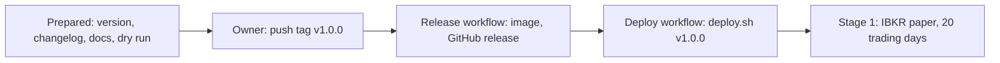

# Release 1.0

The checklist for Stonks 1.0.0 (roadmap 18.8): what was checked before the tag, the result, and the owner's steps that remain. The changes are in [CHANGELOG.md](../CHANGELOG.md), with an "Upgrading" section.



## Prepared (2026-09-28)

| Item | Result |
|------|--------|
| Version | `1.0.0` in `pyproject.toml`, `src/stonks/__init__.py`, `uv.lock`, `web/package.json` and the OpenAPI contract. The release workflow checks that the tag matches `pyproject.toml`. |
| Changelog | `CHANGELOG.md` has a hand-written `1.0.0` section grouped by area, plus "Upgrading". The release workflow now publishes that section. Without one it falls back to `git cliff`, which would list about 1,460 commits for this first tag. |
| Docs | `CLAUDE.md`, `docs/architecture.md`, `docs/operations.md`, `docs/deploy.md`, `docs/strategies/README.md`, the design status lines and the docs site index match the code: 32 strategies and 6 wrappers, 22 survival tests, 8 constructors, SQLite migrations 001 to 044, DuckDB 001 to 022, the new blocks (`engine`, `streaming`, `calendars`, `screener`, `factors`, `assistant`, `lifecycle`). |
| Generated docs | `web/openapi.json`, `docs/api/*` regenerated. The docs tests pass (23). |
| Gates | ruff check and format pass. The pyright gate passes (465 errors, baseline 465, none new). Targeted tests pass (version, registry, docs, deploy, config and parity: over 1,400). Web lint, the generated client check and the production build pass. |

## Deploy dry run

Docker is not installed on the machine that prepared the release, so `docker compose config` and the image build could not run here. They run in CI (`deploy-lint` and `image` jobs) on the release commit. What ran instead:

| Check | How | Result |
|-------|-----|--------|
| Compose file, every profile | An offline stand-in for `docker compose config`: loads `deploy/compose.yaml` with its anchors, and for the core and each profile (`scheduler`, `lab-worker`, `backup`, `ibkr-paper`, `ibkr-live`, `ai`, then all together) checks images are pinned, `depends_on` targets are active, networks, volumes and secrets are declared, bind sources exist, and every `${VAR}` without a default is in `deploy/.env.example`. | Pass. The only findings are the four IBKR secret files, which the operator creates on the server (`deploy/ibkr/README.md`). |
| Tailscale overlay | Same stand-in: `compose.tailscale.yaml` only names services that exist. | Pass |
| Compose in CI | `deploy-lint` now runs `docker compose config` for the core, each profile and the Tailscale overlay, with placeholder IBKR secret files. | Added, runs on the next push |
| Deploy tests | `tests/unit/test_deploy_*.py` (crontab, IBKR, lab worker, probes, proxy) and the docs site test | 31 passed |
| Shell scripts | `bash -n` and `shellcheck -x` 0.11 on `deploy/scripts`, `deploy/backup` and `deploy/monitor` | Pass |
| Workflows | `actionlint` on `release.yml`, `ci.yml` and `deploy.yml`. The changelog extraction step was run by hand on `CHANGELOG.md` (88 lines for `1.0.0`, none for an unknown version, so the fallback runs). | Pass |
| Host check | `check-host.sh` has no dry mode. It ran on a copy of `deploy/` with a fake `docker` on `PATH`, no webhook and no ping URL, so nothing left the machine. Healthy stack: exit 0. Scheduler down and api unhealthy: exit 1 with both problems named. | Pass (the memory limit was lifted for the run: Git Bash on Windows has no `MemAvailable`) |
| Fresh install | `stonks db init` into an empty data folder | SQLite 001 to 044 and DuckDB 001 to 022 applied |
| Scheduler config | `stonks schedule check` on the fresh install | Loads. Reports the never-run jobs as missed deadlines, as designed |
| API | `stonks serve` on the fresh install | `/api/health/ready` 200 (state and lake ok), `/api/health/live` 200, console served |
| Image build | Not run here (no Docker). The build's two stages were checked on their own: `uv lock --check` and the web production build. | Build runs in CI |
| Terraform | Not run here (not installed). CI runs `terraform fmt` and `validate`. | CI |

## Owner's steps

1. **Merge.** Integrate `feat/roadmap` into `main` and wait for CI to pass, including `deploy-lint` (every profile) and `image` (build and smoke test).
2. **Tag.** On the merged `main`:

   ```bash
   git tag v1.0.0
   git push origin v1.0.0
   ```

3. **Release workflow.** It checks the tag against `pyproject.toml`, builds the amd64 and arm64 image with an SBOM and provenance, pushes `ghcr.io/<owner>/stonks:v1.0.0`, `1.0.0`, `1.0` and `latest`, and publishes the GitHub release with the `1.0.0` changelog section.
4. **Deploy workflow.** It starts when the release succeeds. It needs the repository secrets `DEPLOY_HOST`, `DEPLOY_SSH_KEY` and `DEPLOY_KNOWN_HOSTS` (and `TS_OAUTH_CLIENT_ID`, `TS_OAUTH_SECRET` over Tailscale), and `STONKS_URL` as a variable for the health check. `deploy.sh v1.0.0` snapshots the data, runs `stonks db init`, starts the new image and rolls back by itself if the health check fails. See [deploy.md](deploy.md).
5. **Server settings.** Set `STONKS_IMAGE_TAG=v1.0.0` in `deploy/.env` if you pin tags. Add the new variables you need from the changelog's "Upgrading" section. Then run `docker compose run --rm api stonks users bootstrap --email you@example.com` on a first install.
6. **IBKR paper account.** Create the IBKR paper account and a dedicated API username with IBKR Mobile for the weekly login. Put the credentials in `deploy/ibkr/secrets/paper_username.txt` and `paper_password.txt`, add `ibkr-paper` to `COMPOSE_PROFILES`, and list the gateway under `[brokers.ibkr.gateways]` ([deploy/ibkr/README.md](../deploy/ibkr/README.md)). Set `STONKS_IBKR_FLEX_TOKEN` for the Flex statement checks. Then run stage 1: at least 20 trading days on the real schedule against the paper account, with `stonks live soak-report` and the kill switch drill (`stonks halts drill`). See [operations.md](operations.md#paper-soak-drills-and-live-tests).
7. **Market data plan.** The free EODHD plan gives end-of-day prices only, one year back. Fundamentals, calendars, news and the EODHD websockets for intraday need a paid plan (the planned choice is All-in-one). Quotes for the live preview, the pre-open gap check and the IBKR streaming source need IBKR market data subscriptions for each market you trade.
8. **Wiki.** The docs workflow syncs the API and MCP references to the wiki on the merge. The guides and glossary on the wiki live outside this repository and still need a manual read against this release.
9. **Real money** waits for each stage gate (`stonks live stage report`), roadmap 19.12.

## Could not be checked here

- `docker compose config` and the image build (no Docker on this machine). Both run in CI.
- Terraform (not installed). CI runs it.
- The release and deploy workflows themselves. They run only on the tag, which is the owner's step.
- The wiki guides (outside the repository).
