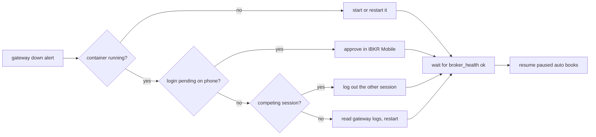

# Runbook: broker outage

Use this when the Health page shows an IB Gateway as down, a push says "Broker gateway ... is down", or `stonks health` fails the `broker:<gateway>` check.



## What Stonks does on its own

- `broker_health` probes each gateway every 5 minutes and stores the result in `broker_gateway_status`.
- While a gateway is down no order goes out. Tickets that miss their submit window expire. Nothing is ever sent late, and the next tick decides again.
- A gateway down for 2 trading sessions, or with a real fault (login refused, wrong account, competing session), pauses the auto subscriptions of its portfolios.
- When it answers again, a "Broker gateway ... is back" notice goes out. Paused books stay paused until a person resumes them.

## Steps

1. Look at the gateway container on the server:

   ```bash
   cd /opt/stonks/deploy
   docker compose --profile ibkr-paper ps          # or --profile ibkr-live
   docker compose logs --tail 200 ib-gateway-paper
   ```

2. Container stopped or unhealthy: start it again.

   ```bash
   docker compose --profile ibkr-paper up -d ib-gateway-paper
   ```

3. Container running but not logged in: check your phone. A pending IBKR Mobile approval means the weekly login is waiting. See [gateway-reauth.md](gateway-reauth.md).
4. Logs mention a competing session (code 10197): someone logged in with the gateway's username in TWS, the web portal or the app. Log that session out. The gateway must have its own username.
5. Logs mention 1100 (link to IBKR lost): IBKR's side is down. Wait. The gateway reconnects by itself and logs 1101 or 1102.
6. Anything else: restart the gateway once.

   ```bash
   docker compose --profile ibkr-paper restart ib-gateway-paper
   ```

7. Wait for the next `broker_health` run (5 minutes). The Health page, `GET /api/brokers/gateways` or `stonks health` should show it connected.

## After the outage

- Check open orders. An order whose submit timed out is `unknown`, and that portfolio sends nothing until reconciliation finds it. Run `uv run stonks live reconcile --portfolio <id>`. If an order stays unknown, use [stuck-order.md](stuck-order.md).
- Today's tickets: if the submit window has passed, they expired. Do not place them by hand. The next tick decides afresh.
- Resume paused auto books only after the gateway has been healthy for a full check cycle and no order is unknown. Resume from the portfolio's subscription in the console. It asks for a fresh second factor.
- An outage longer than a day during the paper soak shows in `stonks live soak-report` as an outage day. Note the cause.
