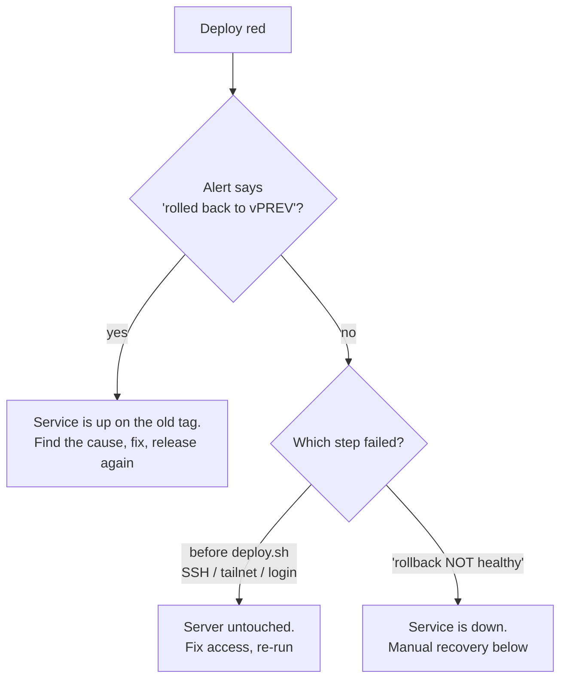

# Runbook: deploy failed

**Signal:** the Deploy workflow is red, or chat shows `deploy of vX failed ... rolling back` or `rollback ... is NOT healthy`.



## 1. Find out where it stopped

Open the failed run in **Actions > Deploy**.

| Failing step | Meaning | Server state |
|--------------|---------|--------------|
| Check the tag | Tag is malformed or `DEPLOY_HOST` missing | Untouched |
| Join the tailnet / Set up SSH / Copy deploy files | Access problem: expired OAuth client, wrong key, changed host key | Untouched |
| Log the server in to GHCR | Image registry access | Untouched |
| Deploy | `deploy.sh` failed; read its log lines | Rolled back, or down (see the alert) |
| Check the public health endpoint | Server runs, but reports another version or is unreachable from outside | Running |

## 2. Access problems

- `Host key verification failed`: the server was rebuilt. Refresh `DEPLOY_KNOWN_HOSTS` with `ssh-keyscan <host>` from a trusted machine.
- `Permission denied (publickey)`: `DEPLOY_SSH_KEY` does not match `~deploy/.ssh/authorized_keys`.
- Tailscale step fails: the OAuth client was revoked or lacks `tag:ci`. See `deploy/tailscale/README.md`.
- `pull access denied` / `manifest unknown`: the Release run did not push that tag. Check the Release run, or deploy a tag that exists (`docker manifest inspect ghcr.io/<owner>/<repo>:<tag>`).

Fix, then **Re-run failed jobs**.

## 3. deploy.sh rolled back (service is up)

On the server:

```bash
cd /opt/stonks/deploy
cat .deployed-tag                              # still the old tag
docker compose logs --since 30m api scheduler | tail -n 200
```

Typical causes: a migration error in `stonks db init`, a missing new setting in `.env`, the API not starting (import error, bad config). Fix it in code or `.env`, cut a new patch release. Do not retry the same tag unless the cause was on the server (for example `.env`).

## 4. Rollback is not healthy (service is down)

```bash
cd /opt/stonks/deploy
docker compose ps
docker compose logs --tail 100 api
df -h / /srv/stonks                            # disk full?
ls -lt /srv/stonks/snapshots | head            # snapshots available
```

Then, in order, stop at the first that works:

1. Free disk if full (`docker image prune -af --filter until=720h`, old snapshots), then `docker compose up -d`.
2. Roll back with data: `./scripts/rollback.sh --with-data <last good tag>`.
3. Restore last night's off-server backup: `./backup/restore.sh`.

Check `https://<domain>/api/health` and the console, then tell the traders what was lost, if anything (ticks and orders after the snapshot or backup time).

## 5. After the incident

- Note the cause and fix in the release notes of the fixing version.
- If a migration caused it, add a test that runs the migration on a copy of real data.
- Run `./backup/restore-test.sh` if you restored anything, to confirm backups still work.
