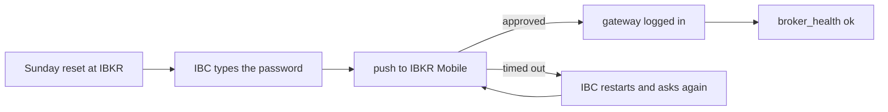

# Runbook: gateway login expired

Use this when the weekly IBKR login is due, when the Sunday reminder arrives, when the gateway shows "login did not finish", or when you change the gateway user's password.



## How the login works

- IB Gateway restarts once a day at `AUTO_RESTART_TIME`. That keeps the session and needs no second factor.
- Once a week, after IBKR's Sunday reset (about 01:00 US Eastern), the session ends. IBC, inside the gateway container, types the password. IBKR then pushes an approval to IBKR Mobile on the owner's phone.
- Stonks sends a reminder push on Sunday at 18:00 New York (`ibkr_reauth_reminder`).
- The login itself lives only in the gateway's secret files. Stonks never sees or stores it.

## Weekly login

1. When the IBKR Mobile push arrives, approve it.
2. Missed it? `TWOFA_TIMEOUT_ACTION=restart` and `RELOGIN_AFTER_TWOFA_TIMEOUT=yes` make the gateway restart and ask again. Approve the next push.
3. Still not logged in after two pushes: restart the gateway by hand.

   ```bash
   cd /opt/stonks/deploy
   docker compose --profile ibkr-paper restart ib-gateway-paper   # or ib-gateway-live
   ```

4. Check the next `broker_health` run (within 5 minutes) on the Health page or with `stonks health`.

## IBKR asks for something IBC cannot type

A new agreement or a security question blocks the login. Turn VNC on for a few minutes over Tailscale and finish it by hand. Steps: `deploy/ibkr/README.md`, "One-off manual login over VNC".

## Change the gateway user's password

1. Change it in IBKR's Client Portal for the gateway's own username.
2. On the server, write the new password to the secret file without echo:

   ```bash
   cd /opt/stonks/deploy/ibkr/secrets
   read -r -s -p 'IBKR paper password: ' p && printf '%s' "$p" > paper_password.txt && echo
   ```

3. Recreate the gateway so it reads the file:

   ```bash
   docker compose --profile ibkr-paper up -d --force-recreate ib-gateway-paper
   ```

4. Approve the login push.

Never put the password in `.env`, TOML, chat or a ticket.

## Competing session

A login with the gateway's username anywhere else ends the gateway's session (code 10197). Stonks pauses auto at once and names the cause. Log the other session out and use your main username for your own logins. See [broker-outage.md](broker-outage.md).
