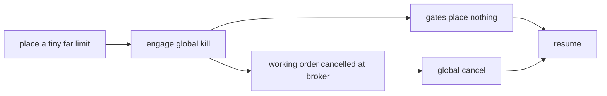

# Runbook: kill switch and drills

Use this to stop trading now, and to prove the kill switch works: monthly during paper trading, quarterly in live, and before every stage promotion.



## Stop trading now

```bash
uv run stonks halts kill --scope global --reason "what happened"
```

- `--scope portfolio --portfolio <id>` stops one portfolio, `--scope user --user <email>` all of one person's.
- By default it stops every order and cancels the working ones at the broker. `--buys-only` stops only buys and leaves sells and exits alone.
- Engage again to retry a cancel that failed.
- Turn it off with `uv run stonks halts resume <halt-id> --reason "..."`. It asks you to type `RESUME TRADING`.

## Drill 1: the dry run

```bash
uv run stonks halts drill
```

It runs on a scratch state DB in a temporary folder with the simulated broker. Production data is never touched and no real order is sent. It:

1. places one buy of 1 share with a limit at half the reference price, so it cannot fill,
2. engages the global kill switch in stop-all mode through the same service the API uses,
3. checks the trade gates now place nothing,
4. checks the broker reports the order cancelled within 10 seconds (`--timeout`) and the ledger shows it cancelled,
5. sends the broker's global cancel,
6. clears the scratch halt.

Every step prints `ok` or `failed`. The command exits 1 when a step fails. `--json-out drill.json` keeps the report. Keep it with the date as the drill record.

## Drill 2: against the IBKR paper account

Only against a paper account. The account id must start with `DU`.

1. Run the live contract tests. They place a far limit at the paper account, find it by order reference and cancel it, and check a reconnect:

   ```bash
   STONKS_RUN_LIVE_TESTS=1 STONKS_IBKR_HOST=<host> STONKS_IBKR_PORT=4004 \
   STONKS_IBKR_ACCOUNT=DU1234567 uv run pytest tests/integration/live/test_ibkr_live.py -m live
   ```

   They stop at once if the gateway manages any account that is not `DU`.
2. With the paper portfolio holding a working order (after a tick, before the open), engage its kill switch:

   ```bash
   uv run stonks halts kill --scope portfolio --portfolio <paper-portfolio> --reason "drill"
   ```

3. Check in TWS that IBKR shows the order `Cancelled` within 10 seconds, and in `stonks orders list --portfolio <paper-portfolio>` that the ledger agrees.
4. Resume with `stonks halts resume <halt-id> --reason "drill done"`.

## If a drill fails

Do not promote. Read the failed step:

- `place_working_order`: the limit crossed. Use a higher `--price`.
- `new_orders_blocked`: a gate is missing. Check `stonks halts list` and the tick logs.
- `working_order_cancelled`: the broker did not confirm the cancel in time. See [stuck-order.md](stuck-order.md).
