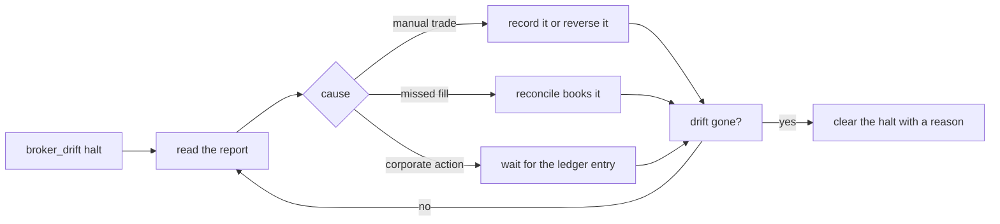

# Runbook: drift between Stonks and the broker

Use this when a `broker_drift` halt opens, when a reconcile report lists a difference, or when positions or cash at IBKR do not match the ledger.



## What Stonks does on its own

- Reconciliation compares orders, fills, positions and cash with what IBKR reports (roadmap 19.5).
- A difference it cannot explain opens a `broker_drift` halt on the portfolio. It stops every new order until a person clears it.
- The halt never clears by itself.

## Steps

1. See the halt:

   ```bash
   uv run stonks halts list
   ```

2. Read the drift report for the portfolio (console, Health page). Note each ticker, the quantity Stonks expects and the quantity IBKR holds.
3. Find the cause. The usual ones:
   - **A manual trade** in TWS or the app on the same account. Either reverse it, or record it as a manual order so the ledger knows.
   - **A missed fill**: an execution the ledger has not booked. Run a reconcile: `uv run stonks live reconcile --portfolio <id>`. Fills are booked once per execution id, so running it twice is safe.
   - **A corporate action**: a split, merger or spin-off changed the share count at IBKR first. Wait for the corporate action ledger to catch up after the next ingest of metadata, then reconcile.
   - **Cash only**: fees, interest or a deposit. Record deposits and withdrawals with `stonks cash-flows record`.
4. Reconcile again (`stonks live reconcile`) and check the report shows no difference.
5. Clear the halt with a clear reason. It is audited.

   ```bash
   uv run stonks halts clear <halt-id> --reason "manual AAPL sell recorded, positions match"
   ```

## If you cannot explain it

Leave the halt on. The book stays safe while it is stopped. Compare the IBKR activity statement for the day with `stonks orders list --portfolio <id>` line by line. During the paper soak, every drift halt shows in `stonks live soak-report` and blocks gate 1 until the cause is known.
