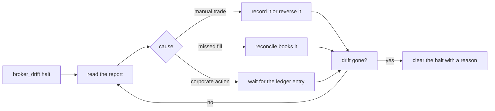

# Runbook: drift between Stonks and the broker

Use this when a `broker_drift` halt opens, when a reconcile report lists a difference, or when positions or cash at IBKR do not match the ledger.



## What Stonks does on its own

- Reconciliation compares orders, fills and positions with what IBKR reports (roadmap 19.5).
- The end-of-day check also compares cash, settled cash and the Flex statement (roadmap 19.15, see below).
- A difference it cannot explain opens a `broker_drift` halt on the portfolio. It stops every new order until a person clears it.
- The halt never clears by itself.
- Grafana or any Prometheus client can watch `stonks_reconcile_drift_items{severity="material"}`. Above 0 means a halt is open.

## Steps

1. See the halt:

   ```bash
   uv run stonks halts list
   ```

2. Read the drift report for the portfolio (console, Health page). Note each ticker, the quantity Stonks expects and the quantity IBKR holds.
3. Find the cause. The usual ones:
   - **A manual trade** in TWS or the app on the same account. Either reverse it, or record it as a manual order so the ledger knows.
   - **A missed fill**: an execution the ledger has not booked. Run a reconcile: `uv run stonks live reconcile --portfolio <id>`. Fills are booked once per execution id, so running it twice is safe.
   - **A corporate action**: a split, merger or spin-off changed the share count at IBKR first. Wait for the corporate action ledger to catch up after the next ingest of metadata, then reconcile.
   - **Cash only**: fees, interest or a deposit. Record deposits and withdrawals with `stonks cash-flows record`.
4. Reconcile again (`stonks live reconcile`) and check the report shows no difference.
5. Clear the halt with a clear reason. It is audited.

   ```bash
   uv run stonks halts clear <halt-id> --reason "manual AAPL sell recorded, positions match"
   ```

## Cash warnings

A `cash` or `settled_cash` item means the broker's cash moved more than Stonks can explain since the last end-of-day check. It only warns, so nothing is halted.

1. Open the report and read the item's detail. It lists the broker's change, what Stonks explains (trades, fees, dividends, other known flows) and the rest.
2. The rest is usually the owner's own activity: a hand trade, a deposit, a withdrawal, interest or a fee. Without a Flex statement Stonks cannot see these. Set up Flex (`[brokers.ibkr.flex] query_id` and `STONKS_IBKR_FLEX_TOKEN`) and most of these explain themselves.
3. Flex usually runs a day behind, so a flow can warn once and then be explained the next day.
4. A rest that matches none of these is worth a look at the IBKR activity statement. If you want cash differences to halt buys, set `[production.live.reconcile] cash_is_drift = true`.

## Statement items

When Flex is set, the end-of-day check compares the statement's executions of Stonks' own orders with the booked fills.

- `statement_missing_execution`: IBKR executed part of our order and the ledger never booked it. Run `uv run stonks live reconcile --portfolio <id>`. If the socket no longer reports it (older than a day), keep the halt, compare positions with the statement, and clear the halt only when they match.
- `statement_extra_execution`: the ledger holds a fill IBKR does not list. Check the execution id in TWS. A fill booked twice or for the wrong account is a bug: keep the halt and report it.
- `statement_quantity`: the same execution with a different size. Trust the statement.
- `statement_commission`: only warns. The commission arrives late at times. It is fixed at the next check when the socket reports it.

## If you cannot explain it

Leave the halt on. The book stays safe while it is stopped. Compare the IBKR activity statement for the day with `stonks orders list --portfolio <id>` line by line. During the paper soak, every drift halt shows in `stonks live soak-report` and blocks gate 1 until the cause is known.
