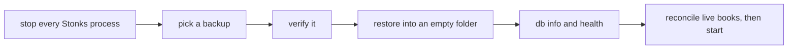

# Runbook: back up and restore

Use this when the lake, the state DB or the artifacts are lost or damaged, when you move Stonks to a new machine, and once a month as a restore drill.



With a live or broker paper portfolio, reconcile before the first tick after a restore: `uv run stonks live reconcile --portfolio <id>`. The broker is the source of truth for orders and fills placed after the backup was taken.

## What a backup holds

`python -m stonks.ops backup` writes one folder, `stonks-<UTC time>Z`, with:

| Path | Content |
|------|---------|
| `state/state.sqlite` | The state DB (strategies, orders, fills, snapshots, alerts), copied with SQLite's online backup API. |
| `lake/lake.duckdb` | The lake, copied with `COPY FROM DATABASE` in one transaction. |
| `lake/bars/` | Parquet bars, only when the lake keeps its bars in Parquet. Files are hard-linked when possible. |
| `artifacts/` | The registry's strategy bundles. |
| `manifest.json` | Size and SHA-256 of every file, schema versions, row counts, git sha and Stonks version. |

Each store is a consistent snapshot even while Stonks writes. The stores are copied one after the other (state, then lake, then artifacts), so the state never names a strategy whose bundle is missing from the backup.

Backups go to `[backup].dir`, or to `backups/` next to the lake when that is unset. After each backup, old ones are pruned: by default the newest backup of each of the last 7 days, 4 weeks and 12 months is kept.

## Take a backup

```bash
uv run python -m stonks.ops backup            # backup, verify, prune
uv run python -m stonks.ops backup --no-prune # keep everything
uv run python -m stonks.ops list
```

If it fails with "the lake ... is in use", another process (usually `stonks serve`) holds the lake for writing. DuckDB allows one writer, so either stop that process for the backup or run the backup inside it (the scheduler job passes its open lake to `run_backup(..., lake=...)`).

## Check a backup

```bash
uv run python -m stonks.ops verify stonks-20260926T220000Z
```

It re-hashes every file, runs SQLite's `integrity_check`, opens the lake read-only and compares schema versions and row counts with the manifest. Exit code 1 and a list of problems means the backup is damaged. Use an older one.

## Restore

1. Stop every Stonks process: `stonks serve`, the scheduler, cron jobs. The restore replaces files under them.
2. Pick the backup: `uv run python -m stonks.ops list`.
3. Restore into an empty data folder:

   ```bash
   uv run python -m stonks.ops restore stonks-20260926T220000Z --data-dir /srv/stonks/data-restored
   ```

   Without `--data-dir` the restore goes to the configured paths (`STONKS_DATA_DIR` or `[lake]`, `[state]`, `[registry]`). It refuses when they already hold data.
4. To restore over existing data, add `--force`. The existing files are renamed to `<name>.pre-restore-<time>`, not deleted. If anything fails part way, the restore is rolled back and the old files are moved back.
5. The restore runs both stores' migrations, so an older backup comes up on the current schema. A backup made by a newer Stonks is refused. Restore it with that version.
6. Point Stonks at the restored folder (if you used `--data-dir`) and start it. Run `uv run stonks db info` and `uv run stonks health` to check. Strategies load their artifacts from the new folder: the registry stores artifact paths relative to the artifacts folder, and older absolute paths resolve to the same bundle there.
7. Once you are satisfied, delete the `*.pre-restore-*` files.

## Monthly drill

Restore the newest backup into a scratch folder and check it:

```bash
uv run python -m stonks.ops restore <id> --data-dir /tmp/stonks-drill
STONKS_DATA_DIR=/tmp/stonks-drill uv run stonks db info
```

Compare row counts with production. Then delete `/tmp/stonks-drill`.

## Later: off the server

Backups stay on the same machine for now. Roadmap 14.5 adds encrypted off-server copies (restic to B2 or R2) as another `BackupTarget`. The commands above stay the same.
